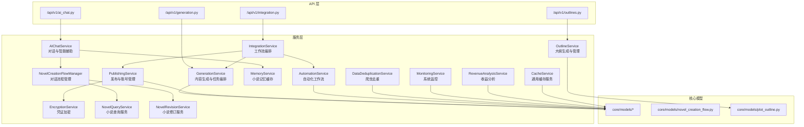
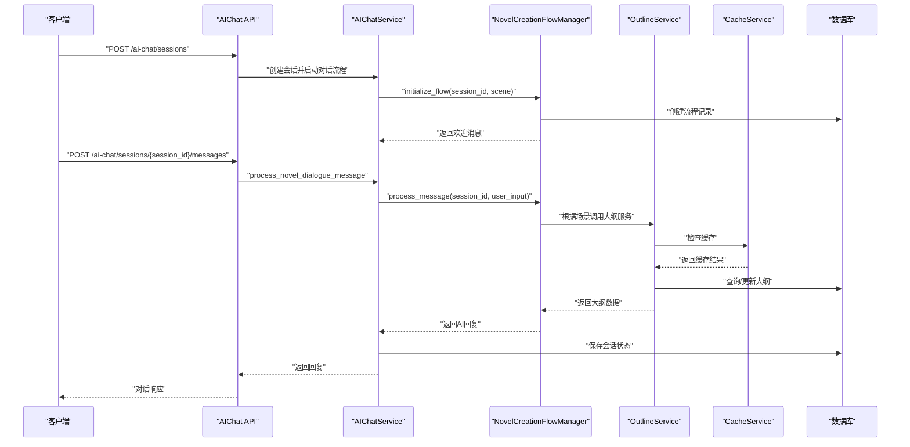
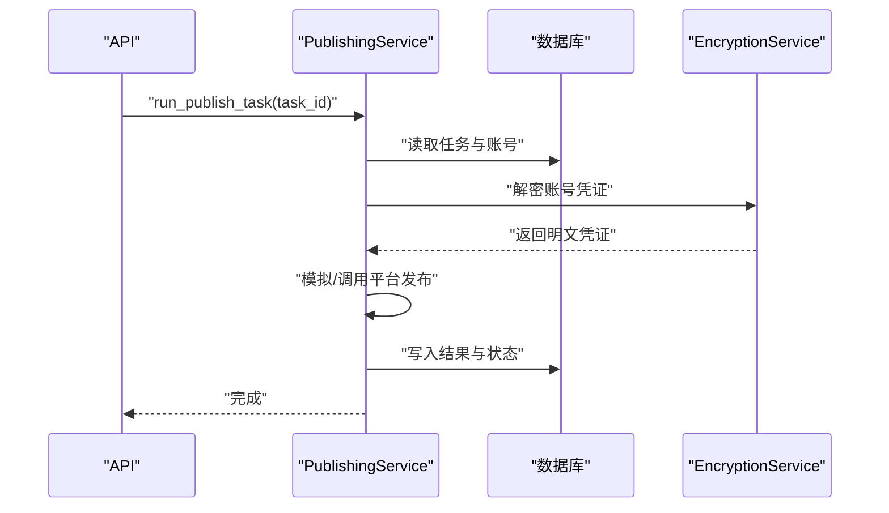
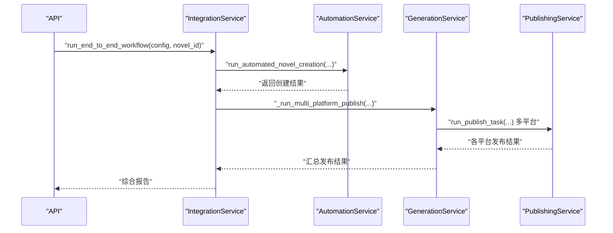
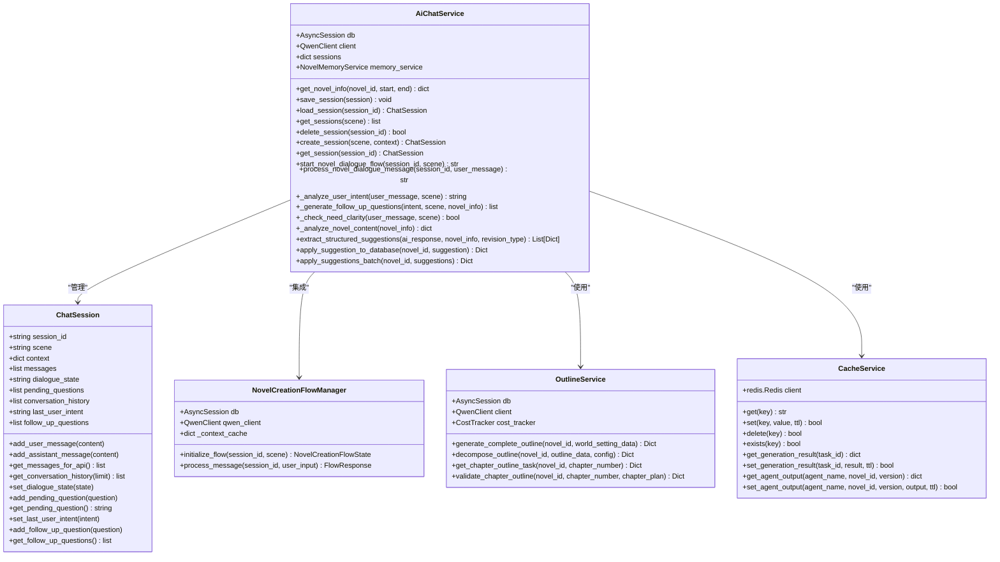
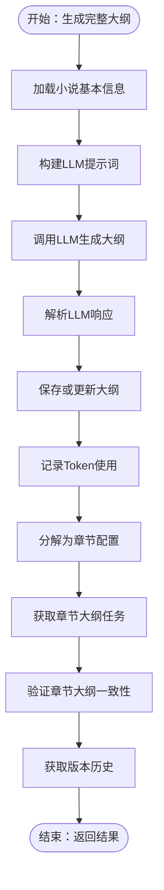
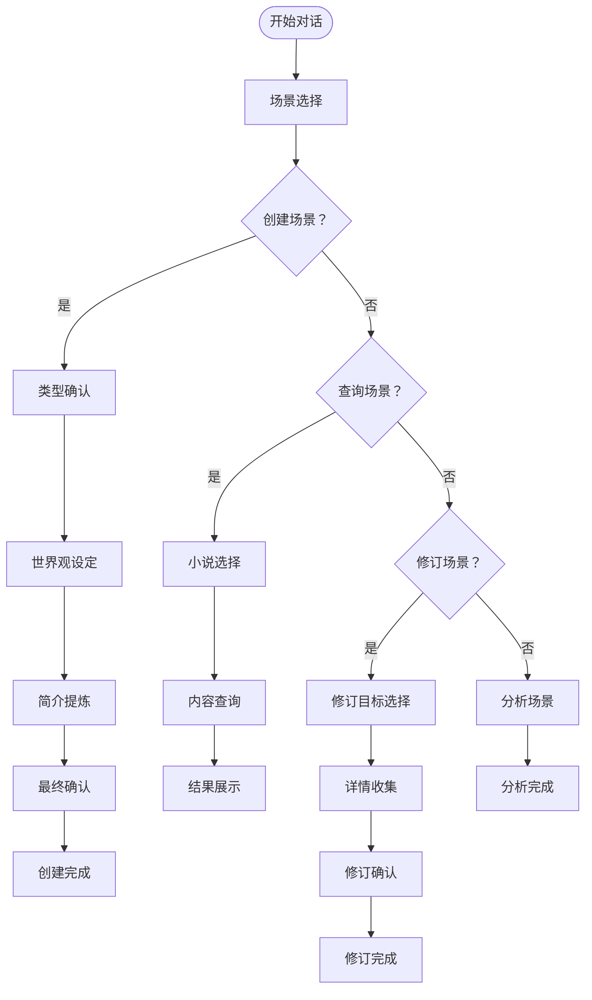
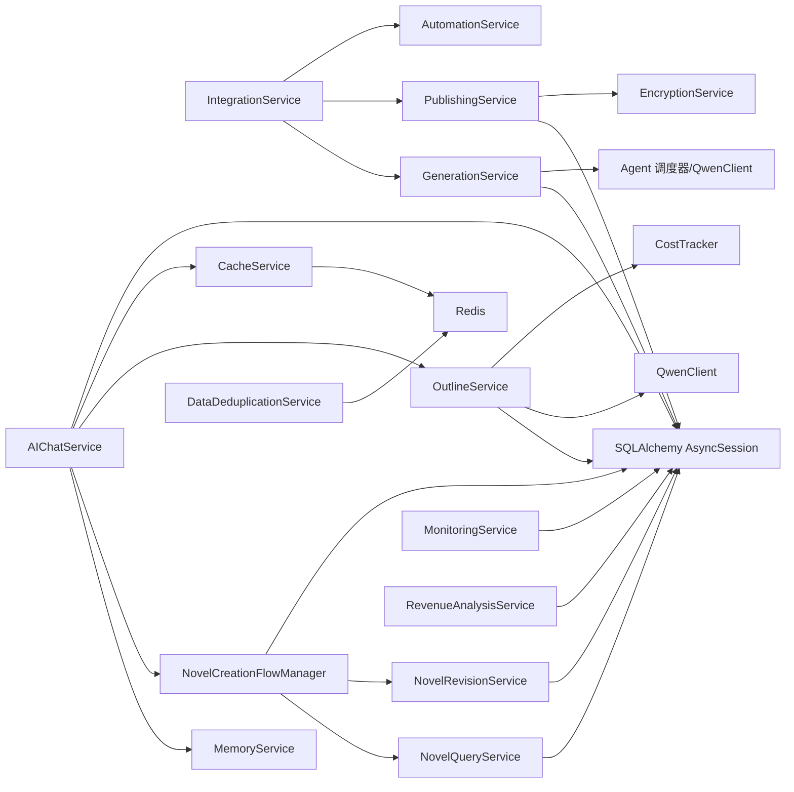

# 服务层设计

<cite>
**本文引用的文件**
- [backend/services/generation_service.py](file://backend/services/generation_service.py)
- [backend/services/publishing_service.py](file://backend/services/publishing_service.py)
- [backend/services/integration_service.py](file://backend/services/integration_service.py)
- [backend/services/ai_chat_service.py](file://backend/services/ai_chat_service.py)
- [backend/services/automation_service.py](file://backend/services/automation_service.py)
- [backend/services/memory_service.py](file://backend/services/memory_service.py)
- [backend/services/data_deduplication_service.py](file://backend/services/data_deduplication_service.py)
- [backend/services/monitoring_service.py](file://backend/services/monitoring_service.py)
- [backend/services/revenue_analysis_service.py](file://backend/services/revenue_analysis_service.py)
- [backend/services/encryption_service.py](file://backend/services/encryption_service.py)
- [backend/services/novel_creation_flow_manager.py](file://backend/services/novel_creation_flow_manager.py)
- [backend/services/novel_query_service.py](file://backend/services/novel_query_service.py)
- [backend/services/novel_revision_service.py](file://backend/services/novel_revision_service.py)
- [backend/services/outline_service.py](file://backend/services/outline_service.py)
- [backend/services/cache_service.py](file://backend/services/cache_service.py)
- [backend/api/v1/generation.py](file://backend/api/v1/generation.py)
- [backend/api/v1/integration.py](file://backend/api/v1/integration.py)
- [backend/api/v1/ai_chat.py](file://backend/api/v1/ai_chat.py)
- [backend/api/v1/outlines.py](file://backend/api/v1/outlines.py)
- [backend/main.py](file://backend/main.py)
- [backend/dependencies.py](file://backend/dependencies.py)
- [core/models/__init__.py](file://core/models/__init__.py)
- [core/models/novel_creation_flow.py](file://core/models/novel_creation_flow.py)
- [backend/schemas/novel_creation_flow.py](file://backend/schemas/novel_creation_flow.py)
- [backend/schemas/outline.py](file://backend/schemas/outline.py)
- [alembic/versions/002_add_novel_creation_flow_table.py](file://alembic/versions/002_add_novel_creation_flow_table.py)
</cite>

## 更新摘要
**变更内容**
- 新增 OutlineService 大纲服务，提供完整的大纲生成、分解、验证和版本管理功能
- 新增 CacheService 缓存服务，提供通用的Redis缓存功能和多种缓存策略
- 增强 AIChatService，新增结构化修订建议提取、批量应用、对话流程集成等功能
- 完善大纲API端点，支持世界设定和剧情大纲的完整管理
- 增强服务间的协作机制，支持更复杂的业务流程编排

## 目录
1. [引言](#引言)
2. [项目结构](#项目结构)
3. [核心组件](#核心组件)
4. [架构总览](#架构总览)
5. [详细组件分析](#详细组件分析)
6. [依赖关系分析](#依赖关系分析)
7. [性能考虑](#性能考虑)
8. [故障排查指南](#故障排查指南)
9. [结论](#结论)
10. [附录](#附录)

## 引言
本文件面向架构师与高级开发者，系统化梳理小说生成系统的服务层设计。围绕分层架构、业务逻辑封装、领域服务设计与接口抽象原则，深入解析以下核心服务：
- GenerationService：内容生成逻辑与任务编排
- PublishingService：发布管理与平台账号治理
- IntegrationService：工作流编排与跨域协作
- AIChatService：对话管理与智能辅助
- **新增** OutlineService：大纲生成与管理服务
- **新增** CacheService：通用缓存服务
- **增强** NovelCreationFlowManager：小说对话流程管理
- **增强** NovelQueryService：小说查询服务
- **增强** NovelRevisionService：小说修订服务

同时阐述服务间依赖关系与协作机制（服务组合、事件驱动、异步调用）、错误处理与事务策略、扩展指南与性能优化建议。

## 项目结构
服务层位于 backend/services，围绕"领域服务 + 接口抽象 + 异步编排"的设计组织，配合 FastAPI 路由层暴露 REST/WS 能力，通过依赖注入提供数据库会话。

**更新** 新增大纲服务和缓存服务，完善了小说创作的全流程支持和系统性能优化。

图示来源
- [backend/api/v1/generation.py:1-171](file://backend/api/v1/generation.py#L1-L171)
- [backend/api/v1/integration.py:1-61](file://backend/api/v1/integration.py#L1-L61)
- [backend/api/v1/ai_chat.py:1-490](file://backend/api/v1/ai_chat.py#L1-L490)
- [backend/api/v1/outlines.py:1-509](file://backend/api/v1/outlines.py#L1-L509)
- [backend/services/generation_service.py:1-689](file://backend/services/generation_service.py#L1-L689)
- [backend/services/publishing_service.py:1-275](file://backend/services/publishing_service.py#L1-L275)
- [backend/services/integration_service.py:1-334](file://backend/services/integration_service.py#L1-L334)
- [backend/services/ai_chat_service.py:1-2345](file://backend/services/ai_chat_service.py#L1-L2345)
- [backend/services/automation_service.py:1-445](file://backend/services/automation_service.py#L1-L445)
- [backend/services/memory_service.py:1-232](file://backend/services/memory_service.py#L1-L232)
- [backend/services/data_deduplication_service.py:1-274](file://backend/services/data_deduplication_service.py#L1-L274)
- [backend/services/monitoring_service.py:1-805](file://backend/services/monitoring_service.py#L1-L805)
- [backend/services/revenue_analysis_service.py:1-451](file://backend/services/revenue_analysis_service.py#L1-L451)
- [backend/services/encryption_service.py:1-86](file://backend/services/encryption_service.py#L1-L86)
- [backend/services/novel_creation_flow_manager.py:1-1000](file://backend/services/novel_creation_flow_manager.py#L1-L1000)
- [backend/services/novel_query_service.py:1-201](file://backend/services/novel_query_service.py#L1-L201)
- [backend/services/novel_revision_service.py:1-141](file://backend/services/novel_revision_service.py#L1-L141)
- [backend/services/outline_service.py:1-742](file://backend/services/outline_service.py#L1-L742)
- [backend/services/cache_service.py:1-280](file://backend/services/cache_service.py#L1-L280)
- [core/models/__init__.py:1-40](file://core/models/__init__.py#L1-L40)
- [core/models/novel_creation_flow.py:1-53](file://core/models/novel_creation_flow.py#L1-L53)

章节来源
- [backend/main.py:1-53](file://backend/main.py#L1-L53)
- [backend/dependencies.py:1-23](file://backend/dependencies.py#L1-L23)

## 核心组件
- GenerationService：负责企划、单章与批量写作，编排 Agent 调度器，持久化结果与任务状态，追踪 Token 使用与成本。
- PublishingService：平台账号生命周期管理、发布任务执行、发布预览与状态跟踪。
- IntegrationService：串联自动化服务、生成服务与发布服务，实现端到端工作流。
- AIChatService：会话与消息管理、场景化系统提示、小说信息检索与分析、会话持久化、**新增**结构化修订建议提取与批量应用。
- **新增** OutlineService：完整的大纲生成（基于世界观设定）、章节分解、一致性验证、版本管理，提供张力循环和关键事件的智能分析。
- **新增** CacheService：通用Redis缓存服务，支持生成结果缓存、Agent输出缓存、章节内容缓存、仪表盘统计数据缓存等多种缓存策略。
- **增强** NovelCreationFlowManager：小说对话流程管理器，支持创建、查询、修订三种场景的多步骤对话流程，**新增**与大纲服务的深度集成。
- **增强** NovelQueryService：提供小说信息查询功能，包括基本信息、世界观设定、角色列表、剧情大纲、章节列表和内容查询。
- **增强** NovelRevisionService：提供小说内容修订功能，支持世界观设定、角色信息、剧情大纲和基本信息的更新。
- AutomationService：代理初始化与调度、自动化工作流编排、批量任务执行。
- MemoryService：小说信息结构化缓存、版本管理与变更检测。
- DataDeduplicationService：基于 Redis 的爬虫数据去重、增量爬取与统计。
- MonitoringService：系统资源、任务状态、性能指标与健康检查。
- RevenueAnalysisService：小说/平台收益分析与优化建议。
- EncryptionService：敏感凭证加密/解密，保障账号安全。

**更新** 新增两个核心服务组件，完善了小说创作的全流程支持和系统性能优化。

章节来源
- [backend/services/generation_service.py:27-689](file://backend/services/generation_service.py#L27-L689)
- [backend/services/publishing_service.py:21-275](file://backend/services/publishing_service.py#L21-L275)
- [backend/services/integration_service.py:17-334](file://backend/services/integration_service.py#L17-L334)
- [backend/services/ai_chat_service.py:182-2345](file://backend/services/ai_chat_service.py#L182-L2345)
- [backend/services/outline_service.py:28-742](file://backend/services/outline_service.py#L28-L742)
- [backend/services/cache_service.py:14-280](file://backend/services/cache_service.py#L14-L280)
- [backend/services/novel_creation_flow_manager.py:34-1000](file://backend/services/novel_creation_flow_manager.py#L34-L1000)
- [backend/services/novel_query_service.py:19-201](file://backend/services/novel_query_service.py#L19-L201)
- [backend/services/novel_revision_service.py:19-141](file://backend/services/novel_revision_service.py#L19-L141)
- [backend/services/automation_service.py:27-445](file://backend/services/automation_service.py#L27-L445)
- [backend/services/memory_service.py:72-232](file://backend/services/memory_service.py#L72-L232)
- [backend/services/data_deduplication_service.py:19-274](file://backend/services/data_deduplication_service.py#L19-L274)
- [backend/services/monitoring_service.py:63-805](file://backend/services/monitoring_service.py#L63-L805)
- [backend/services/revenue_analysis_service.py:20-451](file://backend/services/revenue_analysis_service.py#L20-L451)
- [backend/services/encryption_service.py:10-86](file://backend/services/encryption_service.py#L10-L86)

## 架构总览
服务层采用"接口抽象 + 领域服务 + 异步编排"模式：
- 接口抽象：API 路由层统一暴露 REST/WS 端点，依赖注入数据库会话，调用服务层。
- 领域服务：各服务封装特定业务域，职责清晰、可独立演进。
- 异步编排：后台任务与异步等待策略，结合任务状态机与持久化，确保可观测与可恢复。

**更新** 新增大纲服务和缓存服务，通过 OutlineService 和 CacheService 实现更完整的创作流程和性能优化。

**更新** 新增对话流程处理序列图，展示 AIChatService 如何协调不同服务处理用户请求，包括与大纲服务和缓存服务的集成。

图示来源
- [backend/api/v1/ai_chat.py:1-490](file://backend/api/v1/ai_chat.py#L1-L490)
- [backend/services/ai_chat_service.py:2240-2345](file://backend/services/ai_chat_service.py#L2240-L2345)
- [backend/services/novel_creation_flow_manager.py:61-100](file://backend/services/novel_creation_flow_manager.py#L61-L100)
- [backend/services/novel_query_service.py:25-201](file://backend/services/novel_query_service.py#L25-L201)
- [backend/services/novel_revision_service.py:25-141](file://backend/services/novel_revision_service.py#L25-L141)
- [backend/services/outline_service.py:44-114](file://backend/services/outline_service.py#L44-L114)
- [backend/services/cache_service.py:25-94](file://backend/services/cache_service.py#L25-94)

## 详细组件分析

### GenerationService：内容生成与任务编排
- 设计要点
  - 三层任务形态：企划（规划世界观、角色、大纲）、单章写作、批量写作。
  - 任务状态机：Pending → Running → Completed/Failed，持久化输出与成本统计。
  - 与 Agent 调度器协作：初始化、传参、结果回填。
  - 数据一致性：每个任务独立事务，异常时回滚并记录错误。
- 关键流程
  - 企划阶段：构建 novel_data，调用调度器，持久化世界设定、角色、大纲，更新小说状态与 Token 使用。
  - 单章写作：组装上下文（前几章摘要），调用调度器，持久化章节与统计，更新小说字数与 Token 成本。
  - 批量写作：逐章执行，汇总结果与失败数，更新任务进度与最终状态。
- 错误处理
  - 捕获异常并回写任务状态与错误信息；保证数据库一致性。
- 性能特性
  - 任务拆分与异步执行，降低单次请求阻塞；Token 使用统计便于成本控制。

```mermaid
flowchart TD
Start(["开始：接收任务"]) --> Load["加载小说与上下文"]
Load --> Init["初始化 Agent 调度器"]
Init --> Run{"任务类型？"}
Run --> |企划| Plan["执行企划阶段"]
Run --> |单章| Write["执行单章写作"]
Run --> |批量| Batch["批量循环写作"]
Plan --> PersistPlan["持久化世界设定/角色/大纲"]
Write --> PersistChapter["持久化章节与统计"]
Batch --> Loop{"遍历章节"}
Loop --> |成功| Next["继续下一章"]
Loop --> |失败| RecordErr["记录失败并继续"]
Next --> Loop
RecordErr --> Loop
Loop --> DoneBatch["批量汇总与任务完成"]
PersistPlan --> UpdateCost["更新 Token 成本"]
PersistChapter --> UpdateCost
DoneBatch --> UpdateCost
UpdateCost --> End(["结束：返回结果"])
```

图示来源
- [backend/services/generation_service.py:36-555](file://backend/services/generation_service.py#L36-L555)

章节来源
- [backend/services/generation_service.py:27-689](file://backend/services/generation_service.py#L27-L689)

### PublishingService：发布管理与平台账号治理
- 设计要点
  - 平台账号管理：创建、更新、解密凭证、验证状态。
  - 发布任务执行：根据类型（创建书籍、发布章节、批量发布）执行并回写结果。
  - 发布预览：统计未发布章节与发布状态。
- 安全性
  - 凭证加密存储，解密仅在必要时进行。
- 错误处理
  - 任务失败回写错误信息，状态置为 Failed。

图示来源
- [backend/services/publishing_service.py:144-209](file://backend/services/publishing_service.py#L144-L209)
- [backend/services/encryption_service.py:10-86](file://backend/services/encryption_service.py#L10-L86)

章节来源
- [backend/services/publishing_service.py:21-275](file://backend/services/publishing_service.py#L21-L275)
- [backend/services/encryption_service.py:10-86](file://backend/services/encryption_service.py#L10-L86)

### IntegrationService：工作流编排与跨域协作
- 设计要点
  - 组合多个服务：自动化、生成、发布，形成端到端工作流。
  - 多平台发布：按配置扫描可用账号、创建书籍、发布最新章节。
  - 历史与详情：占位实现，便于扩展。
- 协作机制
  - 服务组合：在 IntegrationService 内部持有 GenerationService/PublishingService 等实例。
  - 异步策略：后台任务与 sleep 等待，平衡平台限流与吞吐。

图示来源
- [backend/services/integration_service.py:26-292](file://backend/services/integration_service.py#L26-L292)
- [backend/services/automation_service.py:80-165](file://backend/services/automation_service.py#L80-L165)
- [backend/services/generation_service.py:387-555](file://backend/services/generation_service.py#L387-L555)
- [backend/services/publishing_service.py:144-209](file://backend/services/publishing_service.py#L144-L209)

章节来源
- [backend/services/integration_service.py:17-334](file://backend/services/integration_service.py#L17-L334)
- [backend/services/automation_service.py:27-445](file://backend/services/automation_service.py#L27-L445)

### AIChatService：对话管理与智能辅助
- 设计要点
  - 会话模型：ChatSession 维护消息历史、对话状态、待处理问题与后续问题。
  - 场景化提示：针对创作、爬虫、修订、分析四类场景提供系统提示与欢迎语。
  - 小说信息检索：优先从 MemoryService 获取，否则从数据库加载并写入缓存，检测内容变化。
  - 会话持久化：支持创建、加载、保存、删除与列表查询。
  - **新增** 结构化修订建议：支持从AI回复中提取结构化修订建议，包括类型、目标、字段、建议值等。
  - **新增** 批量应用：支持批量应用修订建议到数据库，自动处理缓存失效和版本更新。
  - **新增** 对话流程集成：与 NovelCreationFlowManager 深度集成，支持创建、查询、修订三种场景的复杂对话流程。
- 智能辅助
  - 用户意图识别：根据关键词权重判定修订/创作/分析意图。
  - 后续问题生成：基于意图生成引导性问题，提升交互质量。
  - **增强** 大纲分析：结合持久化记忆，提供章节摘要、角色状态、伏笔等上下文信息。
- 错误处理
  - 异常捕获与日志记录，避免影响主流程。

**更新** 新增结构化修订建议提取与批量应用功能，增强AI聊天服务的实用性。

**更新** 新增类图，展示 AIChatService 与新增服务组件的集成关系。

图示来源
- [backend/services/ai_chat_service.py:111-192](file://backend/services/ai_chat_service.py#L111-L192)
- [backend/services/ai_chat_service.py:182-2345](file://backend/services/ai_chat_service.py#L182-L2345)
- [backend/services/ai_chat_service.py:2240-2345](file://backend/services/ai_chat_service.py#L2240-L2345)
- [backend/services/novel_creation_flow_manager.py:34-1000](file://backend/services/novel_creation_flow_manager.py#L34-L1000)
- [backend/services/outline_service.py:28-742](file://backend/services/outline_service.py#L28-L742)
- [backend/services/cache_service.py:14-280](file://backend/services/cache_service.py#L14-L280)

章节来源
- [backend/services/ai_chat_service.py:1-2345](file://backend/services/ai_chat_service.py#L1-L2345)
- [backend/services/memory_service.py:1-232](file://backend/services/memory_service.py#L1-L232)

### OutlineService：大纲生成与管理服务
- 设计要点
  - **完整大纲生成**：基于世界观设定，使用 LLM 生成完整的剧情大纲，包括主线剧情、支线剧情、卷级大纲、关键转折点等。
  - **章节分解**：将卷级大纲分解为详细的章节配置，包括强制性事件、张力循环位置、伏笔分配等。
  - **一致性验证**：检查章节计划是否符合大纲要求，提供完成率和质量评分。
  - **版本管理**：管理大纲版本历史，支持版本对比和回滚。
  - **张力循环分析**：智能识别章节在张力循环中的位置，提供压制期和释放期的事件分配。
- 核心功能
  - generate_complete_outline：生成完整大纲，支持自定义提示词和温度参数。
  - decompose_outline：将大纲分解为章节配置，支持自动拆分和灵活调整。
  - get_chapter_outline_task：获取指定章节的大纲任务，包含详细的任务要求。
  - validate_chapter_outline：验证章节大纲一致性，提供结构化验证报告。
  - get_outline_versions：获取大纲版本历史信息。
- 错误处理
  - LLM 响应解析失败时提供默认大纲结构，确保系统稳定性。
  - 数据库操作异常时回滚并记录错误。

**更新** 新增核心服务组件，提供完整的大纲生成与管理能力。

**更新** 新增大纲服务流程图，展示 OutlineService 的核心功能。

图示来源
- [backend/services/outline_service.py:44-114](file://backend/services/outline_service.py#L44-L114)
- [backend/services/outline_service.py:317-412](file://backend/services/outline_service.py#L317-L412)
- [backend/services/outline_service.py:491-565](file://backend/services/outline_service.py#L491-L565)
- [backend/services/outline_service.py:567-651](file://backend/services/outline_service.py#L567-L651)
- [backend/services/outline_service.py:653-695](file://backend/services/outline_service.py#L653-L695)

章节来源
- [backend/services/outline_service.py:28-742](file://backend/services/outline_service.py#L28-L742)

### CacheService：通用缓存服务
- 设计要点
  - **Redis 集成**：基于 redis-py 库，提供统一的缓存接口。
  - **多种缓存策略**：支持通用键值操作、生成结果缓存、Agent输出缓存、章节内容缓存、仪表盘统计数据缓存等。
  - **TTL 管理**：为不同类型的数据设置合理的过期时间，默认5分钟到2小时不等。
  - **异常处理**：缓存读写失败不影响主流程，提供优雅降级。
- 缓存类型
  - 生成结果缓存：`generation:{task_id}`，默认5分钟，用于缓存生成任务的结果。
  - Agent 输出缓存：`agent:{agent_name}:novel:{novel_id}:v{version}`，默认1小时，用于缓存Agent的输出。
  - 章节内容缓存：`chapter:{novel_id}:{chapter_number}:content`，默认2小时，用于缓存章节内容。
  - 仪表盘统计缓存：`dashboard:{user_id}:stats`，默认5分钟，用于缓存用户仪表盘统计数据。
- 性能特性
  - 异步操作：所有缓存操作都是异步的，避免阻塞主流程。
  - 连接池：基于 redis-py 的连接池，支持高并发访问。
  - 自动降级：缓存失败时返回None，不影响业务逻辑。

**更新** 新增缓存服务组件，提供系统性能优化和缓存管理能力。

章节来源
- [backend/services/cache_service.py:14-280](file://backend/services/cache_service.py#L14-L280)

### NovelCreationFlowManager：小说对话流程管理
- 设计要点
  - 多场景支持：CREATE（创建）、QUERY（查询）、REVISE（修订）、ANALYZE（分析）四种场景。
  - 步骤化流程：从场景选择到具体操作的完整对话流程。
  - 上下文管理：维护对话状态、用户输入历史、查询结果等。
  - 数据持久化：通过 NovelCreationFlow 模型持久化流程状态。
- 核心流程
  - 场景选择：AI 分析用户意图，确定对话场景。
  - 创建流程：类型确认 → 世界观设定 → 简介提炼 → 最终确认。
  - 查询流程：小说选择 → 内容查询 → 结果展示。
  - 修订流程：目标选择 → 详情收集 → 修改确认。
- 错误处理
  - AI 解析失败时提供默认消息，确保对话连续性。
  - 数据库操作异常时回滚并记录错误。

**更新** 增强了与大纲服务和缓存服务的集成，提供更完整的对话流程管理。

**更新** 新增大纲服务流程图，展示 NovelCreationFlowManager 的多场景对话流程。

图示来源
- [backend/services/novel_creation_flow_manager.py:61-100](file://backend/services/novel_creation_flow_manager.py#L61-L100)
- [backend/services/novel_creation_flow_manager.py:102-140](file://backend/services/novel_creation_flow_manager.py#L102-L140)
- [backend/services/novel_creation_flow_manager.py:554-617](file://backend/services/novel_creation_flow_manager.py#L554-L617)

章节来源
- [backend/services/novel_creation_flow_manager.py:34-1000](file://backend/services/novel_creation_flow_manager.py#L34-L1000)

### NovelQueryService：小说查询服务
- 设计要点
  - 多维度查询：支持按关键词搜索、按ID查询、分页获取。
  - 结构化返回：统一的数据格式，便于前端展示。
  - 错误处理：无效ID时返回错误信息，不抛出异常。
- 查询类型
  - 基础信息：标题、作者、类型、状态、字数、章节数等。
  - 世界观设定：时代背景、地理环境、社会结构、特殊规则、力量体系等。
  - 角色信息：姓名、角色类型、性别、年龄、外貌、性格、背景、目标、能力等。
  - 剧情大纲：结构类型、卷数、主线剧情、支线剧情、关键转折点等。
  - 章节信息：章节编号、标题、字数、状态等。

**更新** 增强了与大纲服务的集成，提供更全面的小说信息查询能力。

章节来源
- [backend/services/novel_query_service.py:19-201](file://backend/services/novel_query_service.py#L19-L201)

### NovelRevisionService：小说修订服务
- 设计要点
  - 精细化更新：支持世界观设定、角色信息、剧情大纲、基本信息的单独更新。
  - 安全更新：过滤不允许直接更新的字段，防止数据破坏。
  - 增量更新：不存在时自动创建，存在时增量更新。
- 更新范围
  - 世界观设定：创建或更新 power_system、geography、factions、rules 等字段。
  - 角色信息：更新角色的基本属性和详细描述。
  - 剧情大纲：更新结构和详细剧情信息。
  - 小说基本信息：更新标题、简介、标签、目标平台、篇幅类型等。

**更新** 增强了与AI聊天服务的集成，支持结构化修订建议的自动应用。

章节来源
- [backend/services/novel_revision_service.py:19-141](file://backend/services/novel_revision_service.py#L19-L141)

### AutomationService：自动化工作流编排
- 设计要点
  - 代理初始化：ContentPlanningAgent、WritingAgent、EditingAgent、PublishingAgent。
  - 工作流编排：市场分析 → 内容策划 → 小说创建/更新 → 章节生成 → 编辑 → 发布（可选）。
  - 批量自动化：按批次配置顺序执行，支持间隔。
- 与 GenerationService/PublishingService 协作
  - 通过任务模型与服务实例进行编排与执行。

章节来源
- [backend/services/automation_service.py:27-445](file://backend/services/automation_service.py#L27-L445)

### MemoryService：小说记忆缓存
- 设计要点
  - 结构化缓存：base/details/chapters/analysis/metadata 分层存储。
  - 版本管理：基于版本号与时间戳，检测内容变化。
  - LRU 淘汰：基于访问次数与时间的淘汰策略。
- 与 AIChatService 协作：加速小说信息检索与分析。

章节来源
- [backend/services/memory_service.py:72-232](file://backend/services/memory_service.py#L72-L232)

### DataDeduplicationService：爬虫数据去重
- 设计要点
  - 基于 Redis 的哈希去重，支持批量检查与标记。
  - 过期时间与清理策略，统计平台分布。
- 与爬虫模块协作：避免重复入库与重复抓取。

章节来源
- [backend/services/data_deduplication_service.py:19-274](file://backend/services/data_deduplication_service.py#L19-L274)

### MonitoringService：系统监控与自动调优
- 设计要点
  - 系统状态：CPU/内存/磁盘/网络、数据库健康、任务状态。
  - 性能指标：Token 使用、任务成功率、成本效率。
  - 错误分析：失败任务分布与模式识别。
  - 自动调优建议：系统、性能、错误三类建议与优先级排序。

章节来源
- [backend/services/monitoring_service.py:63-805](file://backend/services/monitoring_service.py#L63-L805)

### RevenueAnalysisService：收益分析与优化建议
- 设计要点
  - 小说性能：章节数、字数、发布成功率、成本效率。
  - 平台表现：任务/发布成功率、账号数量。
  - 收益预测：基于历史数据的章节/字数/成本预测。
  - 内容优化：基于类型与长度的建议。

章节来源
- [backend/services/revenue_analysis_service.py:20-451](file://backend/services/revenue_analysis_service.py#L20-L451)

### EncryptionService：凭证加密
- 设计要点
  - 基于 Fernet 的对称加密，支持字符串与字典加密/解密。
  - 密钥来源配置，开发环境提示。

章节来源
- [backend/services/encryption_service.py:10-86](file://backend/services/encryption_service.py#L10-L86)

## 依赖关系分析
- 服务内聚与耦合
  - GenerationService 与 AI 模型/Agent 调度器耦合，但通过 QwenClient/CostTracker 抽象隔离。
  - IntegrationService 作为编排者，聚合多个服务，保持低耦合高内聚。
  - PublishingService 依赖 EncryptionService，保障账号安全。
  - **新增** AIChatService 依赖 NovelCreationFlowManager、OutlineService、CacheService，实现复杂对话管理。
  - **新增** OutlineService 依赖 QwenClient、CostTracker，提供完整的大纲管理能力。
  - **新增** CacheService 提供通用缓存服务，被多个服务组件使用。
  - **增强** NovelCreationFlowManager 依赖 NovelQueryService 和 NovelRevisionService，提供查询和修订功能。
- 外部依赖
  - 数据库：SQLAlchemy 异步会话。
  - Redis：DataDeduplicationService、CacheService。
  - 第三方模型服务：QwenClient。
- 循环依赖
  - 未见循环依赖；服务间通过组合与接口调用，避免直接循环引用。

**更新** 新增服务间的依赖关系，展示新增服务组件的依赖关系。

**更新** 新增大纲服务和缓存服务的依赖关系图。

图示来源
- [backend/services/generation_service.py:30-34](file://backend/services/generation_service.py#L30-L34)
- [backend/services/publishing_service.py:24-26](file://backend/services/publishing_service.py#L24-L26)
- [backend/services/integration_service.py:20-24](file://backend/services/integration_service.py#L20-L24)
- [backend/services/ai_chat_service.py:185-189](file://backend/services/ai_chat_service.py#L185-L189)
- [backend/services/novel_creation_flow_manager.py:37-40](file://backend/services/novel_creation_flow_manager.py#L37-L40)
- [backend/services/novel_query_service.py:22-23](file://backend/services/novel_query_service.py#L22-L23)
- [backend/services/novel_revision_service.py:22-23](file://backend/services/novel_revision_service.py#L22-L23)
- [backend/services/outline_service.py:39-42](file://backend/services/outline_service.py#L39-L42)
- [backend/services/cache_service.py:25-27](file://backend/services/cache_service.py#L25-L27)
- [backend/services/memory_service.py](file://backend/services/memory_service.py#L76)
- [backend/services/data_deduplication_service.py:21-22](file://backend/services/data_deduplication_service.py#L21-L22)

章节来源
- [backend/services/generation_service.py:1-689](file://backend/services/generation_service.py#L1-L689)
- [backend/services/publishing_service.py:1-275](file://backend/services/publishing_service.py#L1-L275)
- [backend/services/integration_service.py:1-334](file://backend/services/integration_service.py#L1-L334)
- [backend/services/ai_chat_service.py:1-2345](file://backend/services/ai_chat_service.py#L1-L2345)
- [backend/services/novel_creation_flow_manager.py:1-1000](file://backend/services/novel_creation_flow_manager.py#L1-L1000)
- [backend/services/novel_query_service.py:1-201](file://backend/services/novel_query_service.py#L1-L201)
- [backend/services/novel_revision_service.py:1-141](file://backend/services/novel_revision_service.py#L1-L141)
- [backend/services/outline_service.py:1-742](file://backend/services/outline_service.py#L1-L742)
- [backend/services/cache_service.py:1-280](file://backend/services/cache_service.py#L1-L280)
- [backend/services/memory_service.py:1-232](file://backend/services/memory_service.py#L1-L232)
- [backend/services/data_deduplication_service.py:1-274](file://backend/services/data_deduplication_service.py#L1-L274)
- [backend/services/monitoring_service.py:1-805](file://backend/services/monitoring_service.py#L1-L805)
- [backend/services/revenue_analysis_service.py:1-451](file://backend/services/revenue_analysis_service.py#L1-L451)
- [backend/services/encryption_service.py:1-86](file://backend/services/encryption_service.py#L1-L86)

## 性能考虑
- 缓存策略
  - MemoryService：基于访问频次与时间的 LRU 淘汰，适合频繁读取的小说信息。
  - DataDeduplicationService：Redis 哈希去重，支持批量操作与过期清理。
  - **新增** CacheService：提供多种缓存策略，包括生成结果缓存（5分钟）、Agent输出缓存（1小时）、章节内容缓存（2小时）、仪表盘统计缓存（5分钟）。
  - **新增** OutlineService：内存上下文缓存，减少数据库查询频率。
- 批量处理
  - GenerationService 批量写作：逐章执行并汇总结果，适合大体量内容生成。
  - AutomationService 批量自动化：按批次与间隔执行，避免瞬时压力。
  - **新增** AIChatService 批量应用修订建议：支持批量应用多个修订建议，提高处理效率。
  - **新增** NovelQueryService：支持分页查询，避免大数据量一次性返回。
- 资源池管理
  - 异步数据库会话与后台任务，避免阻塞主请求线程。
  - Redis 连接池：DataDeduplicationService、CacheService 使用统一连接与管道执行。
  - **新增** QwenClient 连接池：OutlineService、AIChatService 使用共享的 AI 客户端。
- 成本控制
  - TokenUsage 持久化与成本统计，结合 MonitoringService 的成本分析，指导参数优化。
  - **新增** 对话流程优化：通过步骤化处理减少不必要的AI调用。
  - **新增** 缓存优化：通过合理的TTL设置和缓存命中率提升系统性能。

**更新** 新增性能优化建议，涵盖新增服务组件的性能考虑。

## 故障排查指南
- 任务失败
  - GenerationService/PublishingService 在异常时回写任务状态与错误信息，检查任务表与日志。
- 会话异常
  - AIChatService 保存/加载会话失败时回滚并记录日志，检查数据库连接与会话表。
  - **新增** OutlineService：检查LLM响应解析、数据库连接、Token使用统计。
  - **新增** CacheService：检查Redis连接、TTL设置、缓存键格式。
  - **新增** NovelCreationFlowManager：检查流程状态表和上下文缓存。
- 发布失败
  - PublishingService 验证账号与解密凭证失败时回写状态，检查账号状态与密钥配置。
- 监控告警
  - MonitoringService 提供系统健康评分与建议，结合错误分析定位根因。
- **新增** 对话流程问题
  - NovelCreationFlowManager：检查流程状态表、AI 模型响应、数据库连接。
  - NovelQueryService：验证查询参数、数据库连接、权限设置。
  - NovelRevisionService：确认更新字段、权限验证、数据格式。
- **新增** 大纲服务问题
  - OutlineService：检查LLM API调用、提示词构建、响应解析、数据库操作。
  - CacheService：验证Redis连接、键值格式、TTL设置、异常处理。
- **新增** 缓存服务问题
  - CacheService：检查Redis服务器状态、连接池配置、键值序列化、TTL过期。

**更新** 新增故障排查指南，涵盖新增服务组件的问题诊断。

章节来源
- [backend/services/generation_service.py:198-204](file://backend/services/generation_service.py#L198-L204)
- [backend/services/publishing_service.py:134-138](file://backend/services/publishing_service.py#L134-L138)
- [backend/services/ai_chat_service.py:410-412](file://backend/services/ai_chat_service.py#L410-L412)
- [backend/services/monitoring_service.py:486-556](file://backend/services/monitoring_service.py#L486-L556)
- [backend/services/novel_creation_flow_manager.py:489-512](file://backend/services/novel_creation_flow_manager.py#L489-L512)
- [backend/services/novel_query_service.py:72-201](file://backend/services/novel_query_service.py#L72-L201)
- [backend/services/novel_revision_service.py:25-141](file://backend/services/novel_revision_service.py#L25-L141)
- [backend/services/outline_service.py:111-114](file://backend/services/outline_service.py#L111-L114)
- [backend/services/cache_service.py:42-44](file://backend/services/cache_service.py#L42-L44)

## 结论
服务层通过清晰的职责划分与接口抽象，实现了内容生成、发布管理、工作流编排与智能辅助的协同。**新增的大纲服务和缓存服务**进一步完善了小说创作的全流程支持，包括对话引导、信息查询、内容修订、性能优化等核心功能。结合异步编排、缓存与监控，系统具备良好的可扩展性与可观测性。建议在新增服务时遵循"单一职责、依赖注入、异步编排、幂等与可观测"的原则，持续完善错误处理与性能优化。

**更新** 总结新增服务组件的价值和意义，强调其对系统完整性的贡献。

## 附录

### 服务扩展指南
- 新增服务步骤
  - 定义服务类与职责边界，依赖注入数据库会话。
  - 在 API 路由层新增端点，使用依赖注入获取会话。
  - 在 IntegrationService 或对应编排服务中组合新服务。
  - **新增**：设计合适的上下文管理和状态持久化机制。
  - **新增**：考虑缓存策略和性能优化。
- 接口设计规范
  - 统一返回模型与错误码；对敏感数据进行加密存储。
  - 明确任务状态机与持久化策略，确保可观测与可恢复。
  - **新增**：定义清晰的对话流程步骤和状态转换规则。
  - **新增**：设计合理的缓存策略和TTL设置。
- 测试策略
  - 单元测试：覆盖核心算法与边界条件。
  - 集成测试：模拟异步任务与外部依赖（Redis/LLM）。
  - 监控与日志：关键路径埋点，异常捕获与上报。
  - **新增**：对话流程测试：验证多步骤对话的状态流转和错误处理。
  - **新增**：缓存测试：验证缓存命中率、TTL过期、异常降级。
- **新增** 性能优化指南
  - 缓存策略：根据数据访问模式选择合适的缓存类型和TTL。
  - 异步处理：合理使用异步操作，避免阻塞主流程。
  - 连接池：配置合适的连接池大小，避免资源浪费。
  - 监控指标：建立关键性能指标监控，及时发现性能瓶颈。

**更新** 新增服务扩展指南，涵盖新增服务组件的扩展方法和性能优化建议。