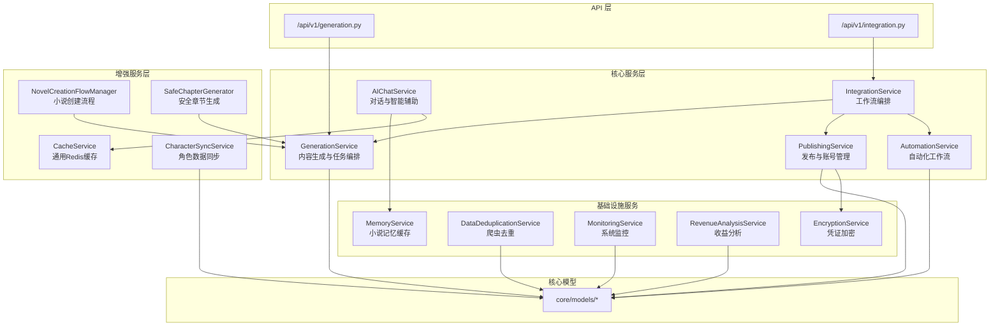
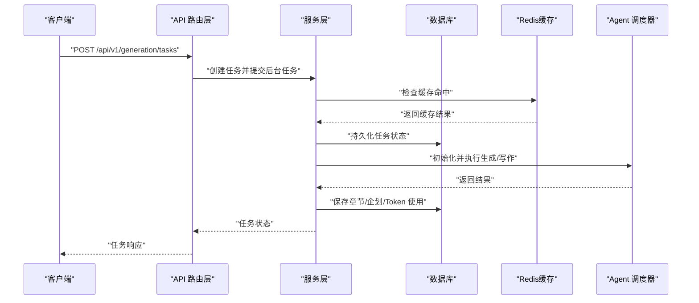
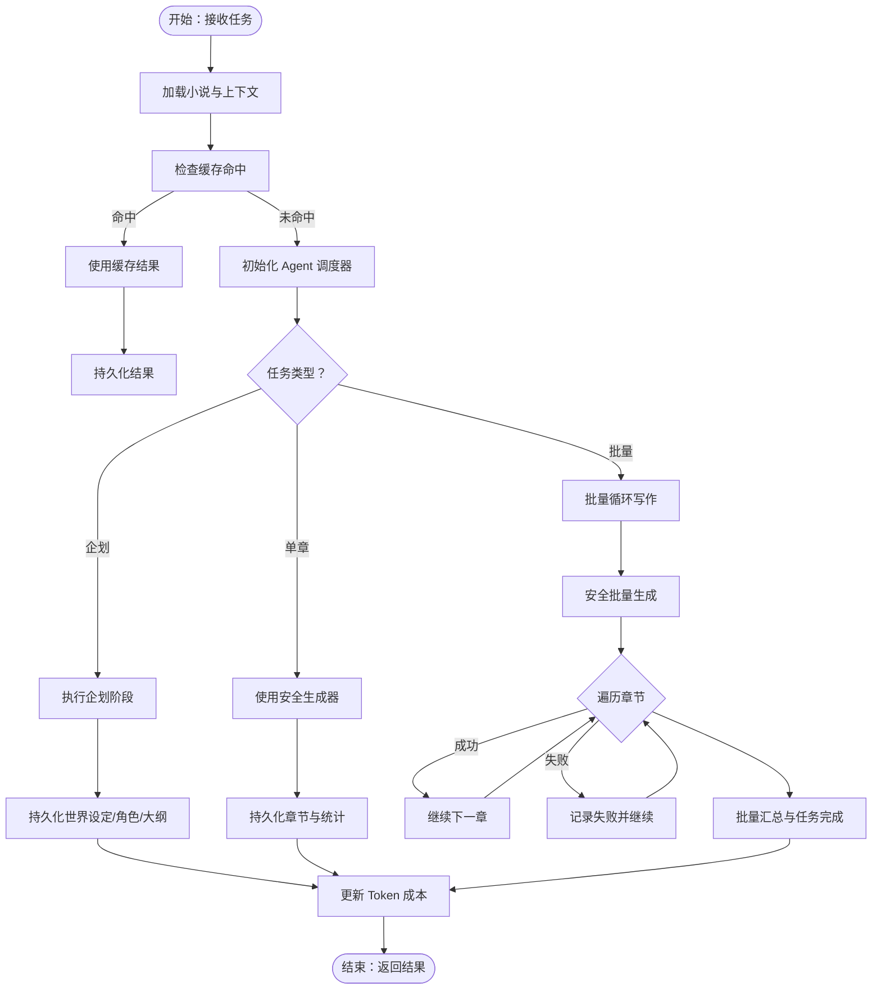
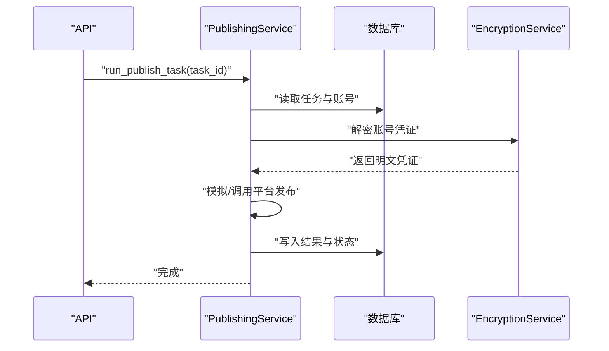
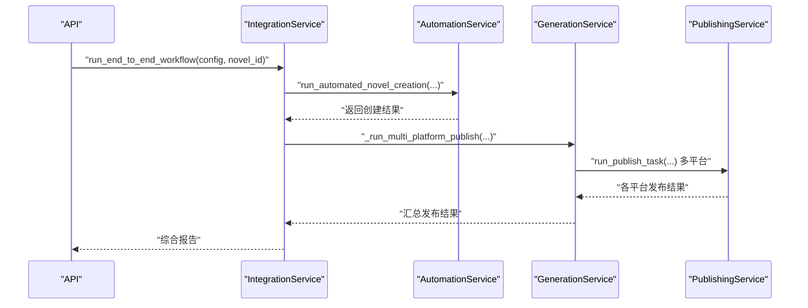
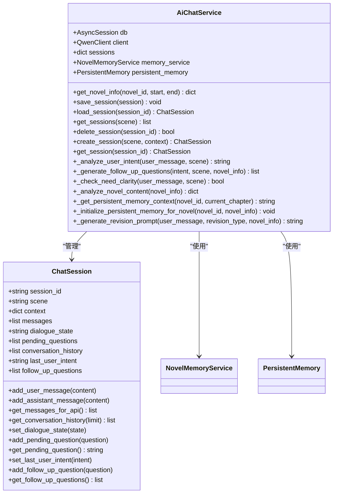
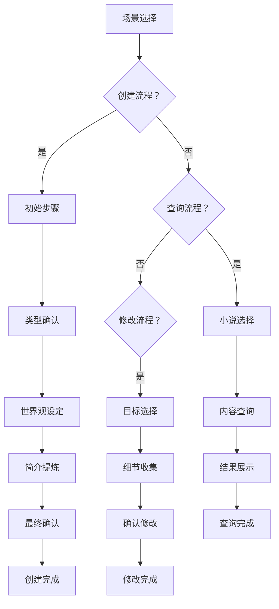
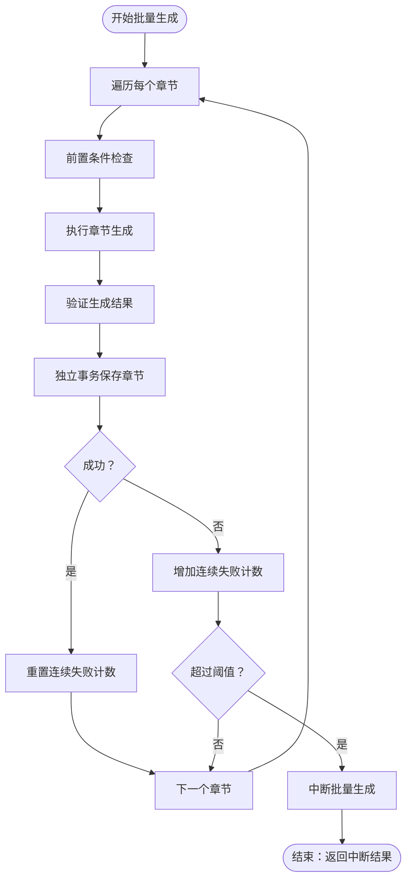
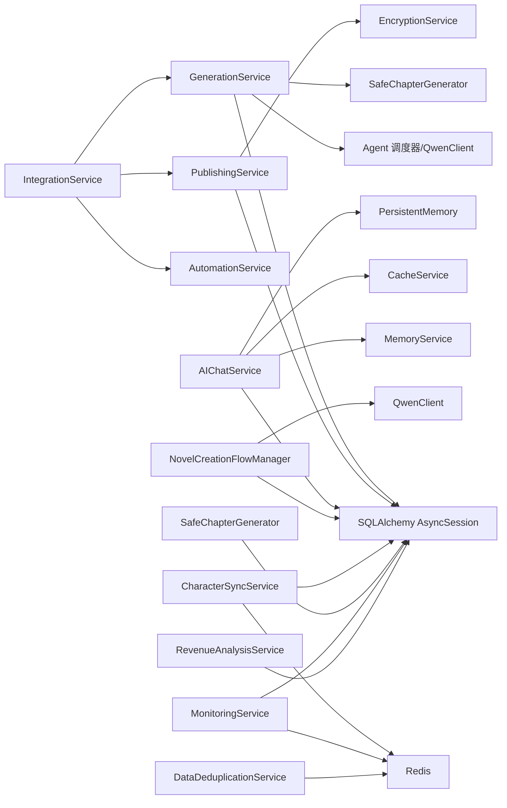

# 服务层设计

<cite>
**本文档引用的文件**
- [backend/services/generation_service.py](file://backend/services/generation_service.py)
- [backend/services/publishing_service.py](file://backend/services/publishing_service.py)
- [backend/services/integration_service.py](file://backend/services/integration_service.py)
- [backend/services/ai_chat_service.py](file://backend/services/ai_chat_service.py)
- [backend/services/automation_service.py](file://backend/services/automation_service.py)
- [backend/services/memory_service.py](file://backend/services/memory_service.py)
- [backend/services/data_deduplication_service.py](file://backend/services/data_deduplication_service.py)
- [backend/services/monitoring_service.py](file://backend/services/monitoring_service.py)
- [backend/services/revenue_analysis_service.py](file://backend/services/revenue_analysis_service.py)
- [backend/services/encryption_service.py](file://backend/services/encryption_service.py)
- [backend/services/cache_service.py](file://backend/services/cache_service.py)
- [backend/services/novel_creation_flow_manager.py](file://backend/services/novel_creation_flow_manager.py)
- [backend/services/character_sync_service.py](file://backend/services/character_sync_service.py)
- [backend/services/safe_chapter_generator.py](file://backend/services/safe_chapter_generator.py)
- [backend/api/v1/generation.py](file://backend/api/v1/generation.py)
- [backend/api/v1/integration.py](file://backend/api/v1/integration.py)
- [backend/main.py](file://backend/main.py)
- [backend/dependencies.py](file://backend/dependencies.py)
- [core/models/__init__.py](file://core/models/__init__.py)
</cite>

## 更新摘要
**所做更改**
- 新增缓存服务模块，提供通用Redis缓存功能
- 新增小说创建流程管理器，支持对话式小说创建流程
- 新增角色同步服务，确保角色数据一致性
- 新增安全章节生成器，提供失败处理和事务隔离
- 增强AI聊天服务，新增持久化记忆和智能分析功能
- 增强监控服务，新增错误模式分析和建议优先级排序

## 目录
1. [引言](#引言)
2. [项目结构](#项目结构)
3. [核心组件](#核心组件)
4. [架构总览](#架构总览)
5. [详细组件分析](#详细组件分析)
6. [依赖关系分析](#依赖关系分析)
7. [性能考虑](#性能考虑)
8. [故障排查指南](#故障排查指南)
9. [结论](#结论)
10. [附录](#附录)

## 引言
本文件面向架构师与高级开发者，系统化梳理小说生成系统的服务层设计。围绕分层架构、业务逻辑封装、领域服务设计与接口抽象原则，深入解析以下核心服务：
- GenerationService：内容生成逻辑与任务编排
- PublishingService：发布管理与平台账号治理
- IntegrationService：工作流编排与跨域协作
- AIChatService：对话管理与智能辅助
- CacheService：通用Redis缓存服务
- NovelCreationFlowManager：小说创建流程管理
- CharacterSyncService：角色数据同步服务
- SafeChapterGenerator：安全章节生成器

同时阐述服务间依赖关系与协作机制（服务组合、事件驱动、异步调用）、错误处理与事务策略、扩展指南与性能优化建议。

## 项目结构
服务层位于 backend/services，围绕"领域服务 + 接口抽象 + 异步编排"的设计组织，配合 FastAPI 路由层暴露 REST/WS 能力，通过依赖注入提供数据库会话。

**图表来源**
- [backend/api/v1/generation.py:1-171](file://backend/api/v1/generation.py#L1-L171)
- [backend/api/v1/integration.py:1-61](file://backend/api/v1/integration.py#L1-L61)
- [backend/services/generation_service.py:1-689](file://backend/services/generation_service.py#L1-L689)
- [backend/services/publishing_service.py:1-275](file://backend/services/publishing_service.py#L1-L275)
- [backend/services/integration_service.py:1-334](file://backend/services/integration_service.py#L1-L334)
- [backend/services/ai_chat_service.py:1-2345](file://backend/services/ai_chat_service.py#L1-L2345)
- [backend/services/automation_service.py:1-445](file://backend/services/automation_service.py#L1-L445)
- [backend/services/cache_service.py:1-280](file://backend/services/cache_service.py#L1-L280)
- [backend/services/novel_creation_flow_manager.py:1-1000](file://backend/services/novel_creation_flow_manager.py#L1-L1000)
- [backend/services/character_sync_service.py:1-400](file://backend/services/character_sync_service.py#L1-L400)
- [backend/services/safe_chapter_generator.py:1-392](file://backend/services/safe_chapter_generator.py#L1-L392)
- [backend/services/memory_service.py:1-232](file://backend/services/memory_service.py#L1-L232)
- [backend/services/data_deduplication_service.py:1-274](file://backend/services/data_deduplication_service.py#L1-L274)
- [backend/services/monitoring_service.py:1-804](file://backend/services/monitoring_service.py#L1-L804)
- [backend/services/revenue_analysis_service.py:1-451](file://backend/services/revenue_analysis_service.py#L1-L451)
- [backend/services/encryption_service.py:1-86](file://backend/services/encryption_service.py#L1-L86)

**章节来源**
- [backend/main.py:1-53](file://backend/main.py#L1-L53)
- [backend/dependencies.py:1-23](file://backend/dependencies.py#L1-L23)

## 核心组件
- GenerationService：负责企划、单章与批量写作，编排 Agent 调度器，持久化结果与任务状态，追踪 Token 使用与成本。
- PublishingService：平台账号生命周期管理、发布任务执行、发布预览与状态跟踪。
- IntegrationService：串联自动化服务、生成服务与发布服务，实现端到端工作流。
- AIChatService：会话与消息管理、场景化系统提示、小说信息检索与分析、会话持久化、持久化记忆增强。
- CacheService：通用Redis缓存服务，提供生成结果缓存、Agent输出缓存、章节内容缓存等功能。
- NovelCreationFlowManager：小说创建对话流程管理器，支持创建、查询、修改三种场景的对话式流程。
- CharacterSyncService：角色数据同步服务，确保角色数据在多模块间的一致性。
- SafeChapterGenerator：安全章节生成器，提供失败处理和事务隔离机制。
- AutomationService：代理初始化与调度、自动化工作流编排、批量任务执行。
- MemoryService：小说信息结构化缓存、版本管理与变更检测。
- DataDeduplicationService：基于 Redis 的爬虫数据去重、增量爬取与统计。
- MonitoringService：系统资源、任务状态、性能指标与健康检查，支持错误模式分析。
- RevenueAnalysisService：小说/平台收益分析与优化建议。
- EncryptionService：敏感凭证加密/解密，保障账号安全。

**章节来源**
- [backend/services/generation_service.py:27-689](file://backend/services/generation_service.py#L27-L689)
- [backend/services/publishing_service.py:21-275](file://backend/services/publishing_service.py#L21-L275)
- [backend/services/integration_service.py:17-334](file://backend/services/integration_service.py#L17-L334)
- [backend/services/ai_chat_service.py:182-2345](file://backend/services/ai_chat_service.py#L182-L2345)
- [backend/services/cache_service.py:14-280](file://backend/services/cache_service.py#L14-L280)
- [backend/services/novel_creation_flow_manager.py:34-1000](file://backend/services/novel_creation_flow_manager.py#L34-L1000)
- [backend/services/character_sync_service.py:24-400](file://backend/services/character_sync_service.py#L24-L400)
- [backend/services/safe_chapter_generator.py:44-392](file://backend/services/safe_chapter_generator.py#L44-L392)
- [backend/services/automation_service.py:27-445](file://backend/services/automation_service.py#L27-L445)
- [backend/services/memory_service.py:72-232](file://backend/services/memory_service.py#L72-L232)
- [backend/services/data_deduplication_service.py:19-274](file://backend/services/data_deduplication_service.py#L19-L274)
- [backend/services/monitoring_service.py:63-804](file://backend/services/monitoring_service.py#L63-L804)
- [backend/services/revenue_analysis_service.py:20-451](file://backend/services/revenue_analysis_service.py#L20-L451)
- [backend/services/encryption_service.py:10-86](file://backend/services/encryption_service.py#L10-L86)

## 架构总览
服务层采用"接口抽象 + 领域服务 + 异步编排"模式：
- 接口抽象：API 路由层统一暴露 REST/WS 端点，依赖注入数据库会话，调用服务层。
- 领域服务：各服务封装特定业务域，职责清晰、可独立演进。
- 异步编排：后台任务与异步等待策略，结合任务状态机与持久化，确保可观测与可恢复。

**图表来源**
- [backend/api/v1/generation.py:23-103](file://backend/api/v1/generation.py#L23-L103)
- [backend/services/generation_service.py:36-196](file://backend/services/generation_service.py#L36-L196)
- [backend/services/cache_service.py:25-94](file://backend/services/cache_service.py#L25-L94)

## 详细组件分析

### GenerationService：内容生成与任务编排
- 设计要点
  - 三层任务形态：企划（规划世界观、角色、大纲）、单章写作、批量写作。
  - 任务状态机：Pending → Running → Completed/Failed，持久化输出与成本统计。
  - 与 Agent 调度器协作：初始化、传参、结果回填。
  - 数据一致性：每个任务独立事务，异常时回滚并记录错误。
- 关键流程
  - 企划阶段：构建 novel_data，调用调度器，持久化世界设定、角色、大纲，更新小说状态与 Token 使用。
  - 单章写作：组装上下文（前几章摘要），调用调度器，持久化章节与统计，更新小说字数与 Token 成本。
  - 批量写作：使用安全生成器逐章执行，汇总结果与失败数，更新任务进度与最终状态。
- 错误处理
  - 捕获异常并回写任务状态与错误信息；保证数据库一致性。
- 性能特性
  - 任务拆分与异步执行，降低单次请求阻塞；Token 使用统计便于成本控制。

**图表来源**
- [backend/services/generation_service.py:36-555](file://backend/services/generation_service.py#L36-L555)
- [backend/services/safe_chapter_generator.py:117-224](file://backend/services/safe_chapter_generator.py#L117-L224)
- [backend/services/cache_service.py:96-136](file://backend/services/cache_service.py#L96-L136)

**章节来源**
- [backend/services/generation_service.py:27-689](file://backend/services/generation_service.py#L27-L689)
- [backend/services/safe_chapter_generator.py:44-392](file://backend/services/safe_chapter_generator.py#L44-L392)

### PublishingService：发布管理与平台账号治理
- 设计要点
  - 平台账号管理：创建、更新、解密凭证、验证状态。
  - 发布任务执行：根据类型（创建书籍、发布章节、批量发布）执行并回写结果。
  - 发布预览：统计未发布章节与发布状态。
- 安全性
  - 凭证加密存储，解密仅在必要时进行。
- 错误处理
  - 任务失败回写错误信息，状态置为 Failed。

**图表来源**
- [backend/services/publishing_service.py:144-209](file://backend/services/publishing_service.py#L144-L209)
- [backend/services/encryption_service.py:10-86](file://backend/services/encryption_service.py#L10-L86)

**章节来源**
- [backend/services/publishing_service.py:21-275](file://backend/services/publishing_service.py#L21-L275)
- [backend/services/encryption_service.py:10-86](file://backend/services/encryption_service.py#L10-L86)

### IntegrationService：工作流编排与跨域协作
- 设计要点
  - 组合多个服务：自动化、生成、发布，形成端到端工作流。
  - 多平台发布：按配置扫描可用账号、创建书籍、发布最新章节。
  - 历史与详情：占位实现，便于扩展。
- 协作机制
  - 服务组合：在 IntegrationService 内部持有 GenerationService/PublishingService 等实例。
  - 异步策略：后台任务与 sleep 等待，平衡平台限流与吞吐。

**图表来源**
- [backend/services/integration_service.py:26-292](file://backend/services/integration_service.py#L26-L292)
- [backend/services/automation_service.py:80-165](file://backend/services/automation_service.py#L80-L165)
- [backend/services/generation_service.py:387-555](file://backend/services/generation_service.py#L387-L555)
- [backend/services/publishing_service.py:144-209](file://backend/services/publishing_service.py#L144-L209)

**章节来源**
- [backend/services/integration_service.py:17-334](file://backend/services/integration_service.py#L17-L334)
- [backend/services/automation_service.py:27-445](file://backend/services/automation_service.py#L27-L445)

### AIChatService：对话管理与智能辅助
- 设计要点
  - 会话模型：ChatSession 维护消息历史、对话状态、待处理问题与后续问题。
  - 场景化提示：针对创作、爬虫、修订、分析四类场景提供系统提示与欢迎语。
  - 小说信息检索：优先从 MemoryService 获取，否则从数据库加载并写入缓存，检测内容变化。
  - 会话持久化：支持创建、加载、保存、删除与列表查询。
  - 持久化记忆增强：新增持久化记忆上下文获取、小说元数据初始化、智能分析功能。
- 智能辅助
  - 用户意图识别：根据关键词权重判定修订/创作/分析意图。
  - 后续问题生成：基于意图生成引导性问题，提升交互质量。
  - 内容分析：基于小说信息生成分析结果，支持增量合并。
- 错误处理
  - 异常捕获与日志记录，避免影响主流程。

**图表来源**
- [backend/services/ai_chat_service.py:111-180](file://backend/services/ai_chat_service.py#L111-L180)
- [backend/services/ai_chat_service.py:182-2345](file://backend/services/ai_chat_service.py#L182-L2345)
- [backend/services/memory_service.py:72-232](file://backend/services/memory_service.py#L72-L232)

**章节来源**
- [backend/services/ai_chat_service.py:1-2345](file://backend/services/ai_chat_service.py#L1-L2345)
- [backend/services/memory_service.py:1-232](file://backend/services/memory_service.py#L1-L232)

### CacheService：通用Redis缓存服务
- 设计要点
  - 通用键值操作：支持基本的 get/set/delete/exists 操作。
  - 生成结果缓存：专门的 generation 命名空间，支持 TTL 控制。
  - Agent输出缓存：按 agent_name:novel_id:version 组织的缓存结构。
  - 章节内容缓存：按 novel_id:chapter_number:content 组织的缓存结构。
  - 仪表盘统计缓存：支持用户级别的统计数据缓存。
- 性能特性
  - 异步操作，异常不影响主流程。
  - 合理的 TTL 设置，平衡内存使用与性能。

**章节来源**
- [backend/services/cache_service.py:14-280](file://backend/services/cache_service.py#L14-L280)

### NovelCreationFlowManager：小说创建流程管理器
- 设计要点
  - 对话式流程管理：支持创建、查询、修改三种场景的对话式交互。
  - 上下文管理：维护会话状态、当前步骤、用户输入等信息。
  - AI驱动的意图识别：使用 QwenClient 分析用户意图并引导流程。
  - 多步骤处理：从场景选择到最终确认的完整流程。
  - 数据持久化：支持从数据库加载和保存流程状态。
- 流程类型
  - 创建流程：场景选择 → 初始步骤 → 类型确认 → 世界观设定 → 简介提炼 → 最终确认。
  - 查询流程：小说选择 → 内容查询 → 结果展示。
  - 修改流程：目标选择 → 细节收集 → 确认修改。
- 错误处理
  - AI响应解析失败时的降级处理。
  - 数据库操作异常的回退机制。

**图表来源**
- [backend/services/novel_creation_flow_manager.py:61-100](file://backend/services/novel_creation_flow_manager.py#L61-L100)
- [backend/services/novel_creation_flow_manager.py:551-700](file://backend/services/novel_creation_flow_manager.py#L551-L700)

**章节来源**
- [backend/services/novel_creation_flow_manager.py:34-1000](file://backend/services/novel_creation_flow_manager.py#L34-L1000)

### CharacterSyncService：角色数据同步服务
- 设计要点
  - 数据同步机制：比较数据库设定与章节实际使用情况。
  - 差异分析：识别名字变体、属性不一致等问题。
  - 自动修复：根据严重程度应用相应的修复策略。
  - 批量处理：支持单个角色同步和整本小说的角色同步。
  - 历史记录：记录每次同步的结果和差异信息。
- 同步策略
  - 高优先级差异（如名字不匹配）：以章节使用为准进行修复。
  - 中等优先级差异（如属性不一致）：记录问题但不自动修复。
  - 一致性验证：提供专门的验证接口检查数据一致性。
- 错误处理
  - 同步失败时的回滚和错误记录。
  - 批量操作中的部分失败处理。

**章节来源**
- [backend/services/character_sync_service.py:24-400](file://backend/services/character_sync_service.py#L24-L400)

### SafeChapterGenerator：安全章节生成器
- 设计要点
  - 失败处理机制：立即终止后续章节生成，保护已生成数据。
  - 事务隔离：每个章节使用独立事务，确保数据完整性。
  - 连续失败检测：超过阈值时自动中断批量生成。
  - 结果验证：检查生成结果的有效性和完整性。
  - 独立保存：章节保存在独立事务中，不受后续操作影响。
- 异常类型
  - ChapterGenerationFailure：章节生成失败异常。
  - BatchGenerationInterrupted：批量生成中断异常。
- 错误日志：详细的错误日志和状态追踪。

**图表来源**
- [backend/services/safe_chapter_generator.py:117-224](file://backend/services/safe_chapter_generator.py#L117-L224)
- [backend/services/safe_chapter_generator.py:226-327](file://backend/services/safe_chapter_generator.py#L226-L327)

**章节来源**
- [backend/services/safe_chapter_generator.py:44-392](file://backend/services/safe_chapter_generator.py#L44-L392)

### AutomationService：自动化工作流编排
- 设计要点
  - 代理初始化：ContentPlanningAgent、WritingAgent、EditingAgent、PublishingAgent。
  - 工作流编排：市场分析 → 内容策划 → 小说创建/更新 → 章节生成 → 编辑 → 发布（可选）。
  - 批量自动化：按批次配置顺序执行，支持间隔。
- 与 GenerationService/PublishingService 协作
  - 通过任务模型与服务实例进行编排与执行。

**章节来源**
- [backend/services/automation_service.py:27-445](file://backend/services/automation_service.py#L27-L445)

### MemoryService：小说记忆缓存
- 设计要点
  - 结构化缓存：base/details/chapters/analysis/metadata 分层存储。
  - 版本管理：基于版本号与时间戳，检测内容变化。
  - LRU 淘汰：基于访问次数与时间的淘汰策略。
- 与 AIChatService 协作：加速小说信息检索与分析。

**章节来源**
- [backend/services/memory_service.py:72-232](file://backend/services/memory_service.py#L72-L232)

### DataDeduplicationService：爬虫数据去重
- 设计要点
  - 基于 Redis 的哈希去重，支持批量检查与标记。
  - 过期时间与清理策略，统计平台分布。
- 与爬虫模块协作：避免重复入库与重复抓取。

**章节来源**
- [backend/services/data_deduplication_service.py:19-274](file://backend/services/data_deduplication_service.py#L19-L274)

### MonitoringService：系统监控与自动调优
- 设计要点
  - 系统状态：CPU/内存/磁盘/网络、数据库健康、任务状态。
  - 性能指标：Token 使用、任务成功率、成本效率。
  - 错误分析：失败任务分布与模式识别。
  - 自动调优建议：系统、性能、错误三类建议与优先级排序。
  - 错误模式分析：支持生成、发布、爬虫三类错误模式识别。
- 增强功能
  - 错误模式优先级排序。
  - 指标历史记录与趋势分析。
  - 建议去重与优先级排序。

**章节来源**
- [backend/services/monitoring_service.py:63-804](file://backend/services/monitoring_service.py#L63-L804)

### RevenueAnalysisService：收益分析与优化建议
- 设计要点
  - 小说性能：章节数、字数、发布成功率、成本效率。
  - 平台表现：任务/发布成功率、账号数量。
  - 收益预测：基于历史数据的章节/字数/成本预测。
  - 内容优化：基于类型与长度的建议。

**章节来源**
- [backend/services/revenue_analysis_service.py:20-451](file://backend/services/revenue_analysis_service.py#L20-L451)

### EncryptionService：凭证加密
- 设计要点
  - 基于 Fernet 的对称加密，支持字符串与字典加密/解密。
  - 密钥来源配置，开发环境提示。

**章节来源**
- [backend/services/encryption_service.py:10-86](file://backend/services/encryption_service.py#L10-L86)

## 依赖关系分析
- 服务内聚与耦合
  - GenerationService 与 AI 模型/Agent 调度器耦合，但通过 QwenClient/CostTracker 抽象隔离。
  - IntegrationService 作为编排者，聚合多个服务，保持低耦合高内聚。
  - PublishingService 依赖 EncryptionService，保障账号安全。
  - AIChatService 依赖 MemoryService 和 CacheService，增强对话体验。
  - SafeChapterGenerator 与 GenerationService 协作，提供安全的批量生成。
- 外部依赖
  - 数据库：SQLAlchemy 异步会话。
  - Redis：CacheService/DataDeduplicationService。
  - 第三方模型服务：QwenClient。
- 循环依赖
  - 未见循环依赖；服务间通过组合与接口调用，避免直接循环引用。

**图表来源**
- [backend/services/generation_service.py:30-34](file://backend/services/generation_service.py#L30-L34)
- [backend/services/publishing_service.py:24-26](file://backend/services/publishing_service.py#L24-L26)
- [backend/services/integration_service.py:20-24](file://backend/services/integration_service.py#L20-L24)
- [backend/services/ai_chat_service.py:185-189](file://backend/services/ai_chat_service.py#L185-L189)
- [backend/services/memory_service.py](file://backend/services/memory_service.py#L76)
- [backend/services/cache_service.py](file://backend/services/cache_service.py#L27)
- [backend/services/novel_creation_flow_manager.py:37-39](file://backend/services/novel_creation_flow_manager.py#L37-L39)
- [backend/services/character_sync_service.py:27-28](file://backend/services/character_sync_service.py#L27-L28)
- [backend/services/safe_chapter_generator.py:50-51](file://backend/services/safe_chapter_generator.py#L50-L51)
- [backend/services/data_deduplication_service.py:21-22](file://backend/services/data_deduplication_service.py#L21-L22)

**章节来源**
- [backend/services/generation_service.py:1-689](file://backend/services/generation_service.py#L1-L689)
- [backend/services/publishing_service.py:1-275](file://backend/services/publishing_service.py#L1-L275)
- [backend/services/integration_service.py:1-334](file://backend/services/integration_service.py#L1-L334)
- [backend/services/ai_chat_service.py:1-2345](file://backend/services/ai_chat_service.py#L1-L2345)
- [backend/services/cache_service.py:1-280](file://backend/services/cache_service.py#L1-L280)
- [backend/services/novel_creation_flow_manager.py:1-1000](file://backend/services/novel_creation_flow_manager.py#L1-L1000)
- [backend/services/character_sync_service.py:1-400](file://backend/services/character_sync_service.py#L1-L400)
- [backend/services/safe_chapter_generator.py:1-392](file://backend/services/safe_chapter_generator.py#L1-L392)
- [backend/services/memory_service.py:1-232](file://backend/services/memory_service.py#L1-L232)
- [backend/services/data_deduplication_service.py:1-274](file://backend/services/data_deduplication_service.py#L1-L274)
- [backend/services/monitoring_service.py:1-804](file://backend/services/monitoring_service.py#L1-L804)
- [backend/services/revenue_analysis_service.py:1-451](file://backend/services/revenue_analysis_service.py#L1-L451)
- [backend/services/encryption_service.py:1-86](file://backend/services/encryption_service.py#L1-L86)

## 性能考虑
- 缓存策略
  - CacheService：基于 Redis 的多级缓存，支持生成结果、Agent输出、章节内容、仪表盘统计等。
  - MemoryService：基于访问频次与时间的 LRU 淘汰，适合频繁读取的小说信息。
  - DataDeduplicationService：Redis 哈希去重，支持批量操作与过期清理。
- 批量处理
  - GenerationService 批量写作：使用 SafeChapterGenerator 实现安全的批量生成。
  - AutomationService 批量自动化：按批次与间隔执行，避免瞬时压力。
  - CharacterSyncService 批量同步：支持整本小说的角色同步。
- 资源池管理
  - 异步数据库会话与后台任务，避免阻塞主请求线程。
  - Redis 连接池：CacheService/DataDeduplicationService 使用统一连接与管道执行。
  - QwenClient：通过 NovelCreationFlowManager 复用 AI 客户端实例。
- 成本控制
  - TokenUsage 持久化与成本统计，结合 MonitoringService 的成本分析，指导参数优化。
  - SafeChapterGenerator 的连续失败检测，避免无效的资源浪费。

## 故障排查指南
- 任务失败
  - GenerationService/PublishingService 在异常时回写任务状态与错误信息，检查任务表与日志。
  - SafeChapterGenerator 提供详细的失败日志和中断信息。
- 会话异常
  - AIChatService 保存/加载会话失败时回滚并记录日志，检查数据库连接与会话表。
  - NovelCreationFlowManager 的上下文缓存和数据库持久化双重保障。
- 发布失败
  - PublishingService 验证账号与解密凭证失败时回写状态，检查账号状态与密钥配置。
- 监控告警
  - MonitoringService 提供系统健康评分与建议，结合错误分析定位根因。
  - 新增的错误模式分析功能，支持快速识别常见问题模式。
- 缓存问题
  - CacheService 的异步操作不影响主流程，可通过日志检查缓存命中率。
- 角色同步问题
  - CharacterSyncService 提供详细的差异分析和修复建议，检查同步历史记录。

**章节来源**
- [backend/services/generation_service.py:198-204](file://backend/services/generation_service.py#L198-L204)
- [backend/services/publishing_service.py:134-138](file://backend/services/publishing_service.py#L134-L138)
- [backend/services/ai_chat_service.py:410-412](file://backend/services/ai_chat_service.py#L410-L412)
- [backend/services/monitoring_service.py:486-556](file://backend/services/monitoring_service.py#L486-L556)
- [backend/services/safe_chapter_generator.py:104-115](file://backend/services/safe_chapter_generator.py#L104-L115)
- [backend/services/novel_creation_flow_manager.py:489-511](file://backend/services/novel_creation_flow_manager.py#L489-L511)
- [backend/services/character_sync_service.py:93-98](file://backend/services/character_sync_service.py#L93-L98)

## 结论
服务层通过清晰的职责划分与接口抽象，实现了内容生成、发布管理、工作流编排与智能辅助的协同。新增的缓存服务、小说创建流程管理器、角色同步服务、安全章节生成器等增强了系统的稳定性与用户体验。结合异步编排、缓存与监控，系统具备良好的可扩展性与可观测性。建议在新增服务时遵循"单一职责、依赖注入、异步编排、幂等与可观测"的原则，持续完善错误处理与性能优化。

## 附录

### 服务扩展指南
- 新增服务步骤
  - 定义服务类与职责边界，依赖注入数据库会话。
  - 在 API 路由层新增端点，使用依赖注入获取会话。
  - 在 IntegrationService 或对应编排服务中组合新服务。
  - 如涉及缓存需求，优先考虑使用 CacheService 提供的标准缓存接口。
- 接口设计规范
  - 统一返回模型与错误码；对敏感数据进行加密存储。
  - 明确任务状态机与持久化策略，确保可观测与可恢复。
  - 提供适当的异常类型和错误处理机制。
- 测试策略
  - 单元测试：覆盖核心算法与边界条件。
  - 集成测试：模拟异步任务与外部依赖（Redis/LLM）。
  - 监控与日志：关键路径埋点，异常捕获与上报。
  - 性能测试：缓存命中率、并发处理能力、错误恢复机制。
- 最佳实践
  - 使用异步编程模型，避免阻塞主请求线程。
  - 实现适当的超时和重试机制。
  - 提供详细的日志记录和错误追踪。
  - 考虑服务的可扩展性和向后兼容性。