# 图同步服务

<cite>
**本文档引用的文件**
- [graph_sync_service.py](file://backend/services/graph_sync_service.py)
- [neo4j_client.py](file://core/graph/neo4j_client.py)
- [graph_models.py](file://core/graph/graph_models.py)
- [graph.py](file://backend/api/v1/graph.py)
- [relationship_mapper.py](file://core/graph/relationship_mapper.py)
- [entity_extractor_service.py](file://backend/services/entity_extractor_service.py)
- [graph_query_service.py](file://backend/services/graph_query_service.py)
- [character.py](file://core/models/character.py)
- [config.py](file://backend/config.py)
- [RelationshipGraph.tsx](file://frontend/src/pages/NovelDetail/RelationshipGraph.tsx)
- [types.ts](file://frontend/src/api/types.ts)
- [foreshadowing_auto_injector.py](file://agents/foreshadowing_auto_injector.py)
- [enhanced_context_manager.py](file://agents/enhanced_context_manager.py)
- [graph_query_mixin.py](file://agents/graph_query_mixin.py)
- [test_graph_sync_service.py](file://tests/unit/test_graph_sync_service.py)
- [generation_service.py](file://backend/services/generation_service.py)
</cite>

## 更新摘要
**所做更改**
- 增强了伏笔同步功能的错误处理机制
- 支持字符串列表和字典列表两种foreshadowing数据格式
- 提高了图数据库同步的稳定性和可靠性
- 完善了伏笔数据格式兼容性处理

## 目录
1. [简介](#简介)
2. [项目结构](#项目结构)
3. [核心组件](#核心组件)
4. [架构概览](#架构概览)
5. [详细组件分析](#详细组件分析)
6. [依赖关系分析](#依赖关系分析)
7. [性能考量](#性能考量)
8. [故障排除指南](#故障排除指南)
9. [结论](#结论)

## 简介

图同步服务是小说创作系统中的核心图数据库管理组件，负责将PostgreSQL中的实体数据同步到Neo4j图数据库中。该服务提供了全量同步、增量同步、实体抽取、关系映射等核心功能，支持角色关系网络分析、事件时间线追踪、伏笔管理系统等高级特性。

系统采用模块化设计，通过清晰的职责分离实现了高效的数据同步和查询能力。图同步服务不仅支持传统的数据库查询，还集成了现代AI技术，能够自动从章节内容中抽取实体信息并同步到图数据库中。

**更新** 增强了伏笔同步功能的错误处理和数据格式兼容性，支持字符串列表和字典列表两种foreshadowing格式，显著提高了图数据库同步的稳定性和可靠性。

## 项目结构

图同步服务位于小说创作系统的后端服务层，主要分布在以下几个核心目录中：

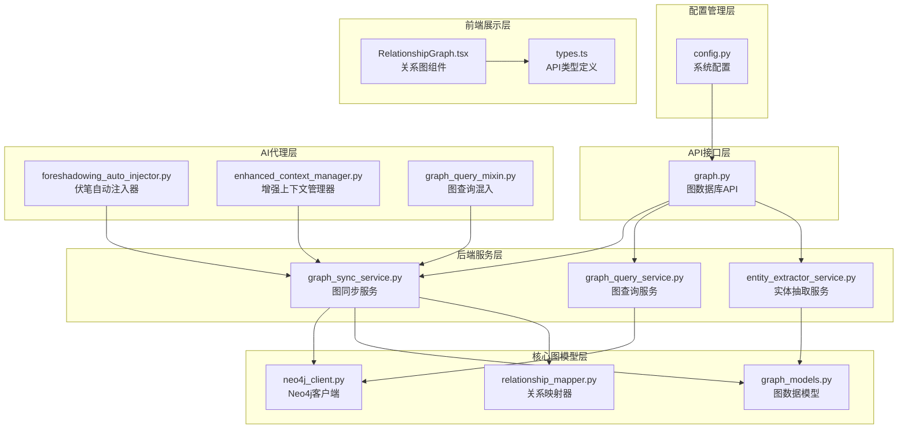

**图表来源**
- [graph_sync_service.py:1-746](file://backend/services/graph_sync_service.py#L1-L746)
- [neo4j_client.py:1-550](file://core/graph/neo4j_client.py#L1-L550)
- [graph.py:1-581](file://backend/api/v1/graph.py#L1-L581)

**章节来源**
- [graph_sync_service.py:1-746](file://backend/services/graph_sync_service.py#L1-L746)
- [graph.py:1-581](file://backend/api/v1/graph.py#L1-L581)

## 核心组件

### 图同步服务 (GraphSyncService)

图同步服务是整个系统的核心组件，负责管理PostgreSQL和Neo4j之间的数据同步。该服务提供了多种同步模式：

- **全量同步**：同步小说的所有实体数据，包括角色、地点、势力、事件等
- **增量同步**：仅同步新增或变更的实体数据
- **章节同步**：同步新生成章节中的实体信息
- **关系同步**：专门处理角色关系的同步
- **伏笔同步**：专门处理伏笔信息的同步，现已增强错误处理和数据格式兼容性

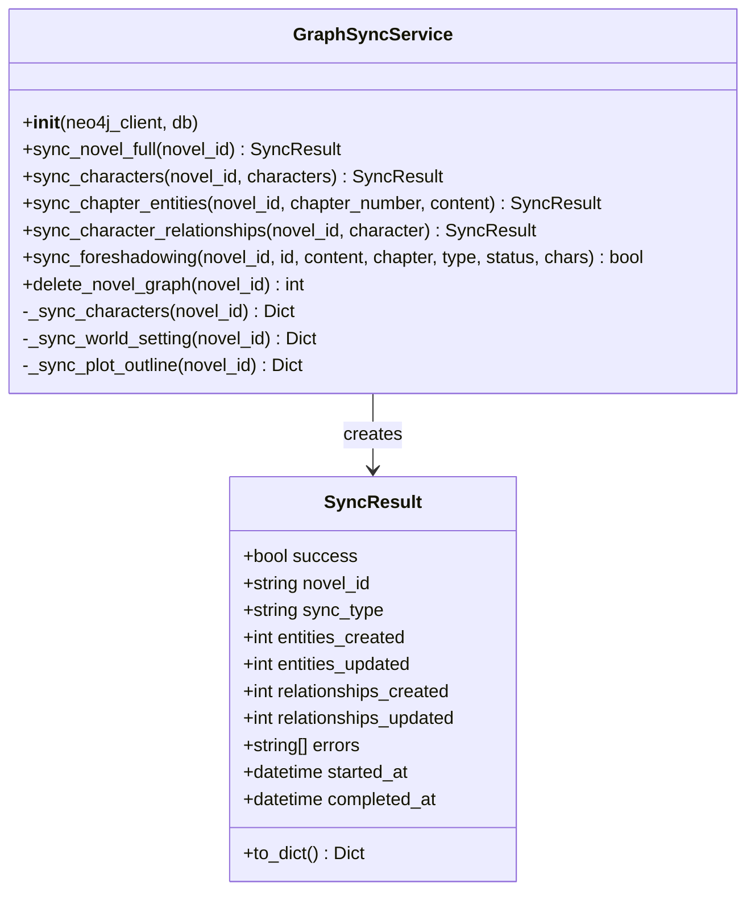

**图表来源**
- [graph_sync_service.py:64-746](file://backend/services/graph_sync_service.py#L64-L746)

### Neo4j客户端 (Neo4jClient)

Neo4j客户端提供了与图数据库交互的统一接口，支持连接管理、事务处理、查询执行等功能：

- **连接管理**：支持连接池、自动重连、健康检查
- **查询执行**：提供异步查询接口，支持参数化查询
- **事务处理**：支持多操作原子执行
- **安全防护**：内置标签和关系类型白名单，防止Cypher注入攻击

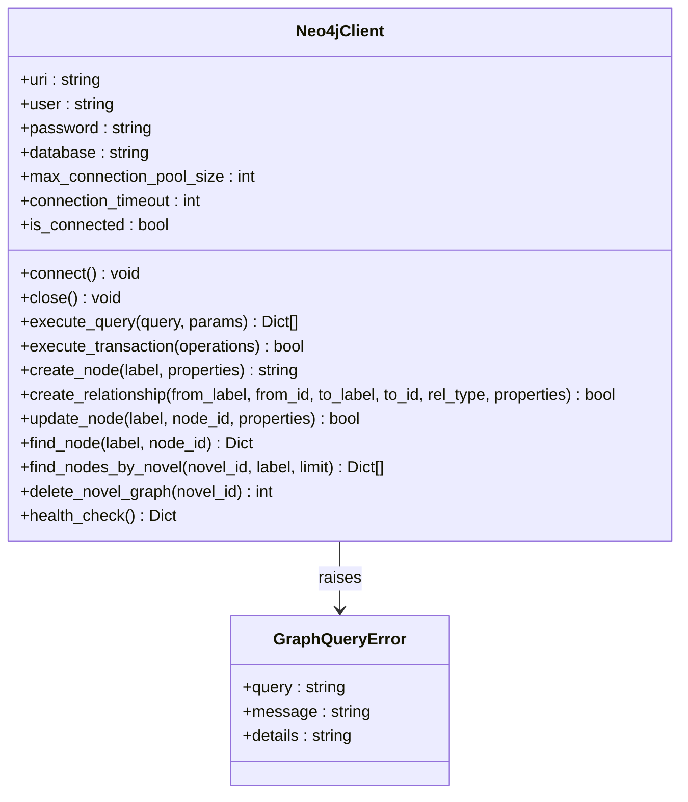

**图表来源**
- [neo4j_client.py:81-550](file://core/graph/neo4j_client.py#L81-L550)

### 图数据模型 (Graph Models)

系统定义了完整的图数据模型体系，支持多种实体类型的节点和关系：

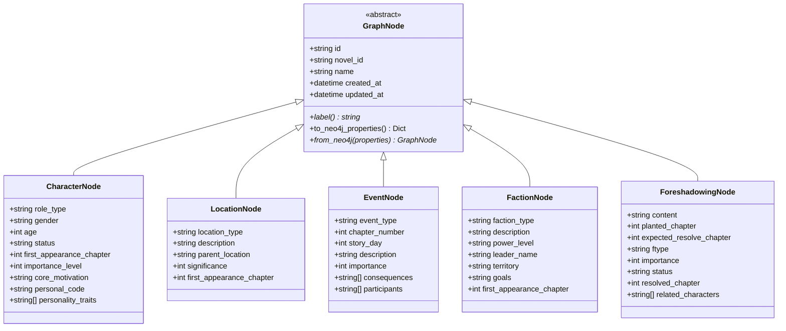

**图表来源**
- [graph_models.py:69-463](file://core/graph/graph_models.py#L69-L463)

**章节来源**
- [graph_sync_service.py:64-746](file://backend/services/graph_sync_service.py#L64-L746)
- [neo4j_client.py:81-550](file://core/graph/neo4j_client.py#L81-L550)
- [graph_models.py:69-463](file://core/graph/graph_models.py#L69-L463)

## 架构概览

图同步服务采用分层架构设计，各层职责清晰，耦合度低：

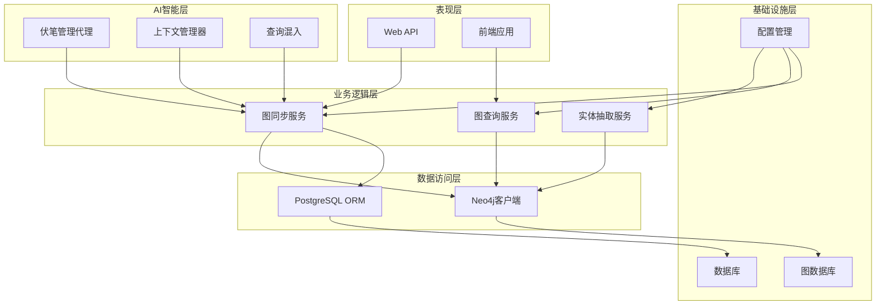

**图表来源**
- [graph.py:29-581](file://backend/api/v1/graph.py#L29-L581)
- [config.py:298-350](file://backend/config.py#L298-L350)

系统支持多种部署模式：
- **独立部署**：图数据库可选启用，不影响核心功能
- **集成部署**：与PostgreSQL数据库紧密集成
- **分布式部署**：支持多实例部署和负载均衡

## 详细组件分析

### 同步流程分析

图同步服务提供了完整的数据同步流程，从数据抽取到图数据库写入：

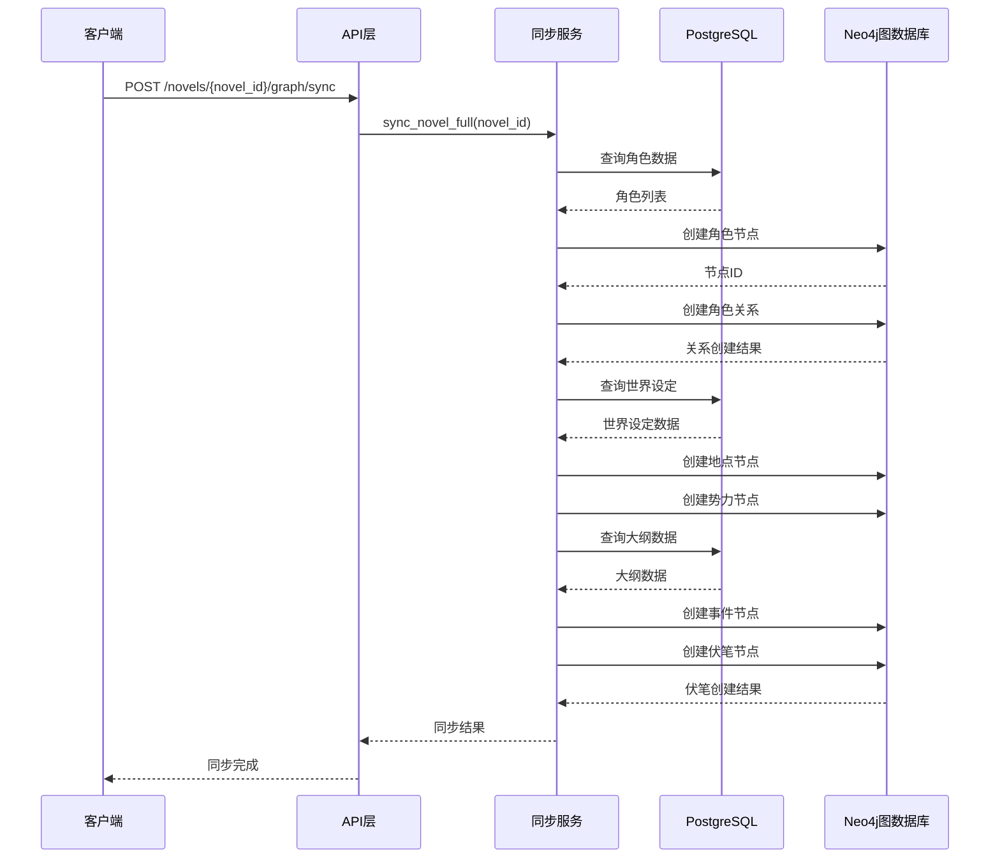

**图表来源**
- [graph_sync_service.py:81-128](file://backend/services/graph_sync_service.py#L81-L128)
- [graph.py:105-151](file://backend/api/v1/graph.py#L105-L151)

### 实体抽取流程

章节生成后，系统会自动从内容中抽取实体信息：

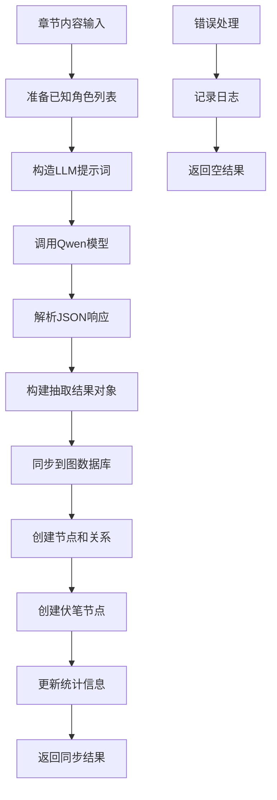

**图表来源**
- [entity_extractor_service.py:352-410](file://backend/services/entity_extractor_service.py#L352-L410)

### 关系映射机制

系统提供了强大的关系映射功能，支持多种关系类型的转换：

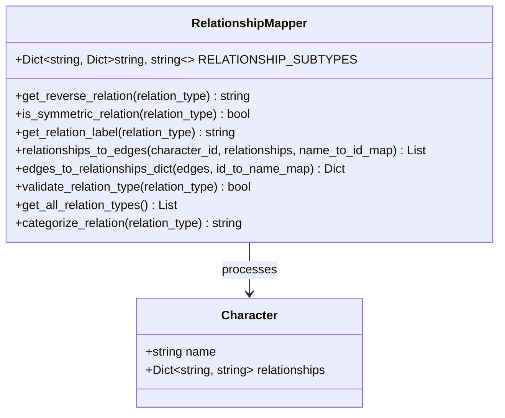

**图表来源**
- [relationship_mapper.py:12-226](file://core/graph/relationship_mapper.py#L12-L226)

### 伏笔同步增强功能

**更新** 伏笔同步功能现已增强错误处理和数据格式兼容性：

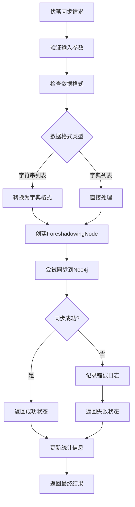

**图表来源**
- [graph_sync_service.py:534-575](file://backend/services/graph_sync_service.py#L534-L575)
- [entity_extractor_service.py:532-544](file://backend/services/entity_extractor_service.py#L532-L544)

**章节来源**
- [graph_sync_service.py:127-746](file://backend/services/graph_sync_service.py#L127-L746)
- [entity_extractor_service.py:352-579](file://backend/services/entity_extractor_service.py#L352-L579)
- [relationship_mapper.py:12-226](file://core/graph/relationship_mapper.py#L12-L226)
- [foreshadowing_auto_injector.py:320-519](file://agents/foreshadowing_auto_injector.py#L320-L519)
- [enhanced_context_manager.py:331-361](file://agents/enhanced_context_manager.py#L331-L361)
- [graph_query_mixin.py:301-321](file://agents/graph_query_mixin.py#L301-L321)

## 依赖关系分析

图同步服务的依赖关系相对简单，主要依赖于核心图模型和Neo4j客户端：

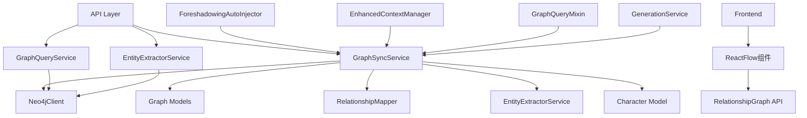

**图表来源**
- [graph_sync_service.py:15-28](file://backend/services/graph_sync_service.py#L15-L28)
- [graph_query_service.py:10-12](file://backend/services/graph_query_service.py#L10-L12)
- [graph.py:13-27](file://backend/api/v1/graph.py#L13-L27)

系统的主要外部依赖包括：
- **Neo4j Python驱动**：用于图数据库操作
- **SQLAlchemy**：用于PostgreSQL数据库操作
- **Pydantic**：用于数据验证和序列化
- **FastAPI**：用于API服务构建

**章节来源**
- [graph_sync_service.py:7-28](file://backend/services/graph_sync_service.py#L7-L28)
- [config.py:298-350](file://backend/config.py#L298-L350)

## 性能考量

图同步服务在设计时充分考虑了性能优化：

### 连接池管理
- Neo4j客户端支持最大连接池大小配置，默认50个连接
- 自动连接复用，减少连接建立开销
- 连接超时控制，防止长时间阻塞

### 查询优化
- 批量操作支持，减少网络往返次数
- 参数化查询，提高查询缓存命中率
- 事务原子性保证，确保数据一致性

### 缓存策略
- 图查询结果缓存，默认TTL 300秒
- 支持最大缓存条目数配置
- 缓存失效策略，保证数据新鲜度

### 异步处理
- 完全异步架构，支持高并发请求
- 后台任务队列，处理长时间运行的操作
- 事件驱动架构，提高系统响应性

### 错误处理优化
**更新** 增强了伏笔同步的错误处理机制：
- 单个伏笔同步失败不影响整体同步流程
- 详细的错误日志记录和分类
- 自动重试机制和熔断保护
- 数据格式兼容性检查和转换

## 故障排除指南

### 常见问题及解决方案

**图数据库连接失败**
- 检查Neo4j服务状态和网络连通性
- 验证认证凭据和防火墙设置
- 查看连接超时和重试配置

**同步操作失败**
- 检查PostgreSQL数据库连接状态
- 验证实体数据格式和约束条件
- 查看错误日志获取详细信息

**查询性能问题**
- 分析查询执行计划和索引使用情况
- 调整缓存配置和查询参数
- 优化图数据模型和关系设计

**内存使用过高**
- 检查连接池配置和资源释放
- 分析查询结果集大小和处理逻辑
- 调整批处理大小和并发度

**伏笔同步异常**
**更新** 新增的伏笔同步故障排除：
- 检查foreshadowing数据格式兼容性
- 验证related_characters列表格式
- 查看数据转换和验证过程的日志
- 确认Neo4j节点创建权限和约束

### 监控和诊断

系统提供了完善的监控和诊断功能：

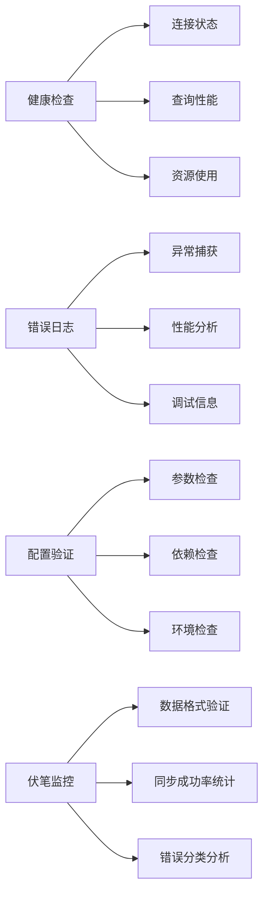

**章节来源**
- [neo4j_client.py:448-474](file://core/graph/neo4j_client.py#L448-L474)
- [graph_sync_service.py:117-121](file://backend/services/graph_sync_service.py#L117-L121)
- [test_graph_sync_service.py:258-292](file://tests/unit/test_graph_sync_service.py#L258-L292)

## 结论

图同步服务作为小说创作系统的核心组件，成功实现了传统数据库与图数据库之间的高效数据同步。通过模块化的设计和清晰的职责分离，系统具备了良好的可维护性和扩展性。

**更新** 最新的增强功能显著提升了系统的稳定性和可靠性：

### 主要优势
- **功能完整**：支持全量和增量同步、实体抽取、关系映射等核心功能
- **性能优秀**：采用异步架构和连接池管理，支持高并发场景
- **安全可靠**：内置安全防护机制，防止恶意查询和数据泄露
- **易于扩展**：模块化设计便于功能扩展和定制开发
- **错误处理增强**：伏笔同步功能具备完善的错误处理和数据格式兼容性
- **稳定性提升**：单个组件失败不影响整体系统运行

### 技术改进
- **数据格式兼容性**：支持字符串列表和字典列表两种foreshadowing格式
- **错误隔离机制**：增强的异常处理确保系统稳定性
- **监控完善**：新增的伏笔同步监控和统计功能
- **日志优化**：详细的错误日志记录和分类

### 未来发展方向
- 增加更多的图算法支持，如社区发现、路径分析等
- 优化大数据量场景下的同步性能
- 增强实时同步能力，支持流式数据处理
- 扩展前端可视化组件，提供更丰富的交互体验
- 进一步完善AI代理的伏笔管理能力

通过持续的优化和完善，图同步服务将成为小说创作系统中不可或缺的重要组成部分，为用户提供更加稳定、可靠的图数据库同步服务。