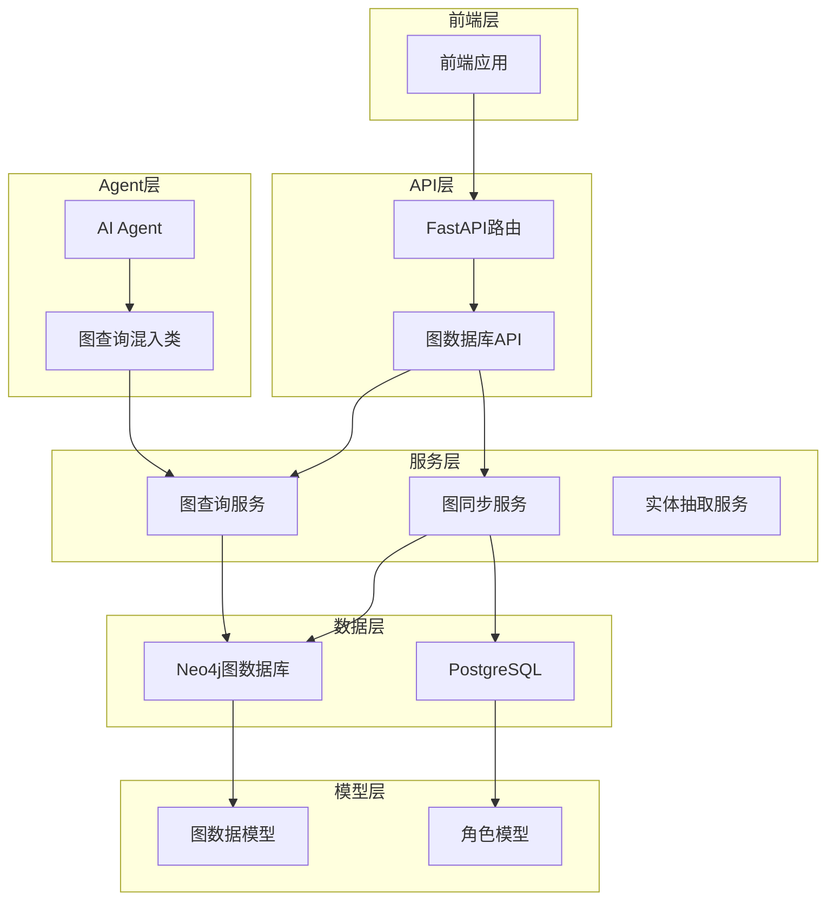
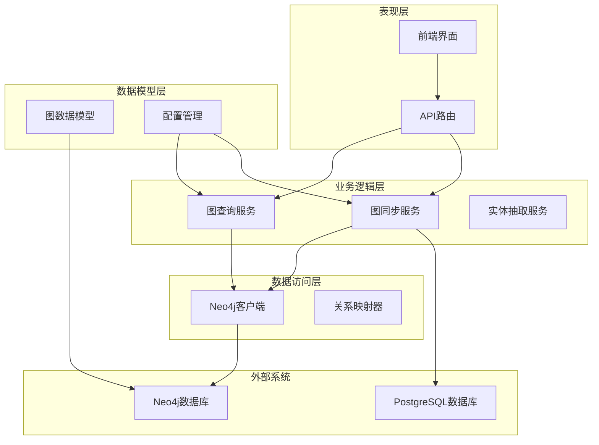
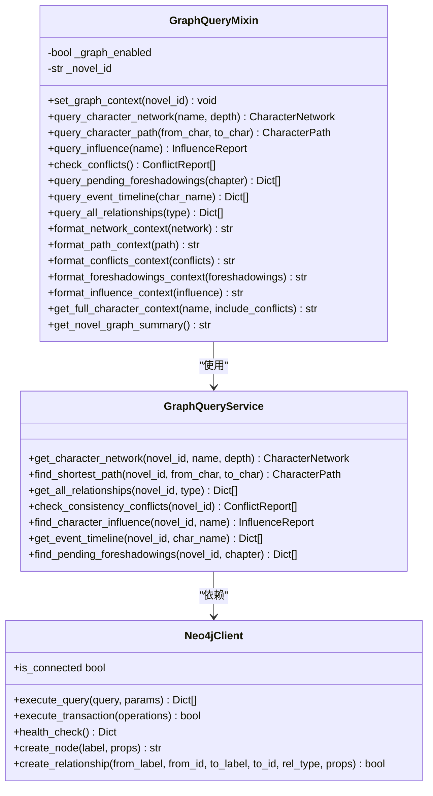
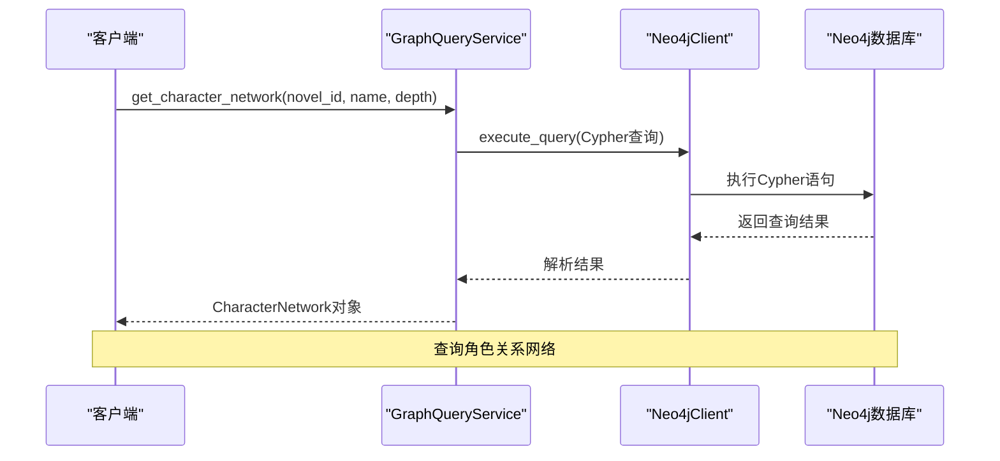
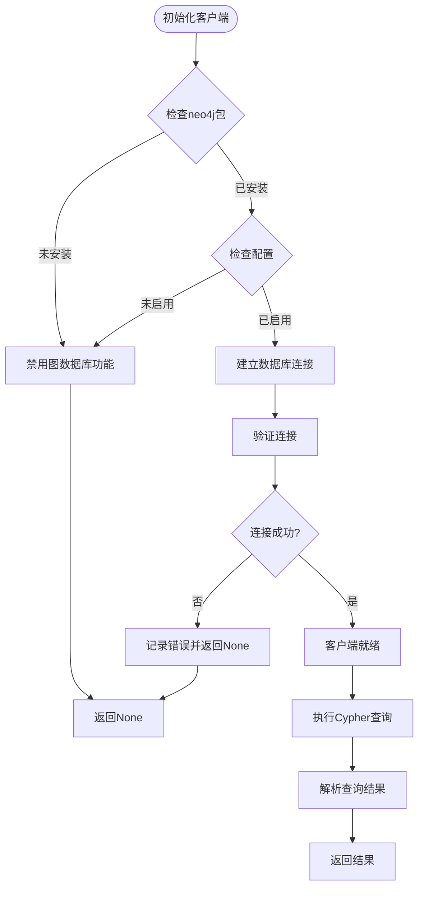
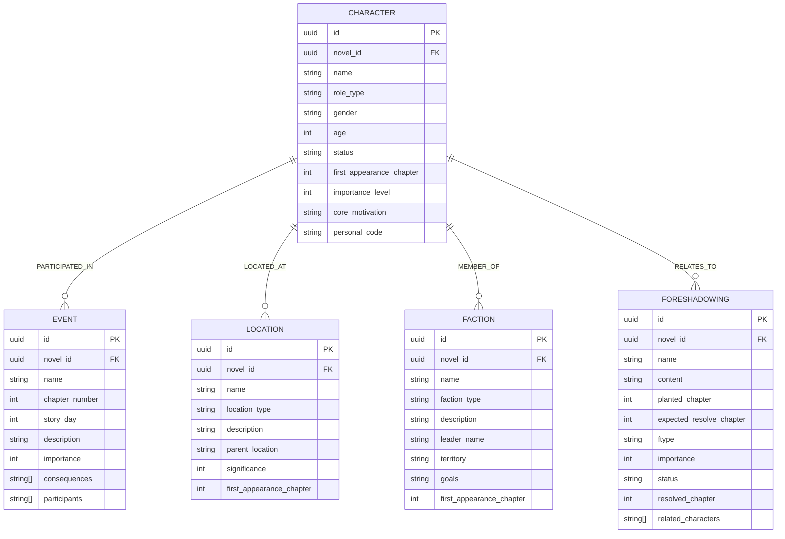
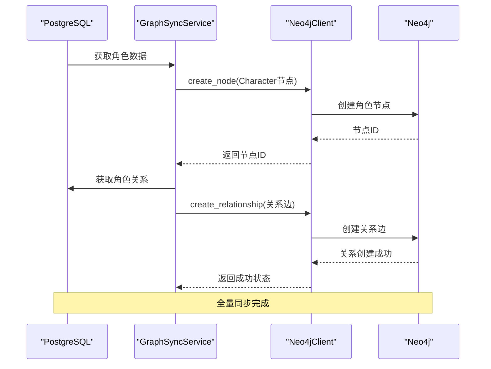
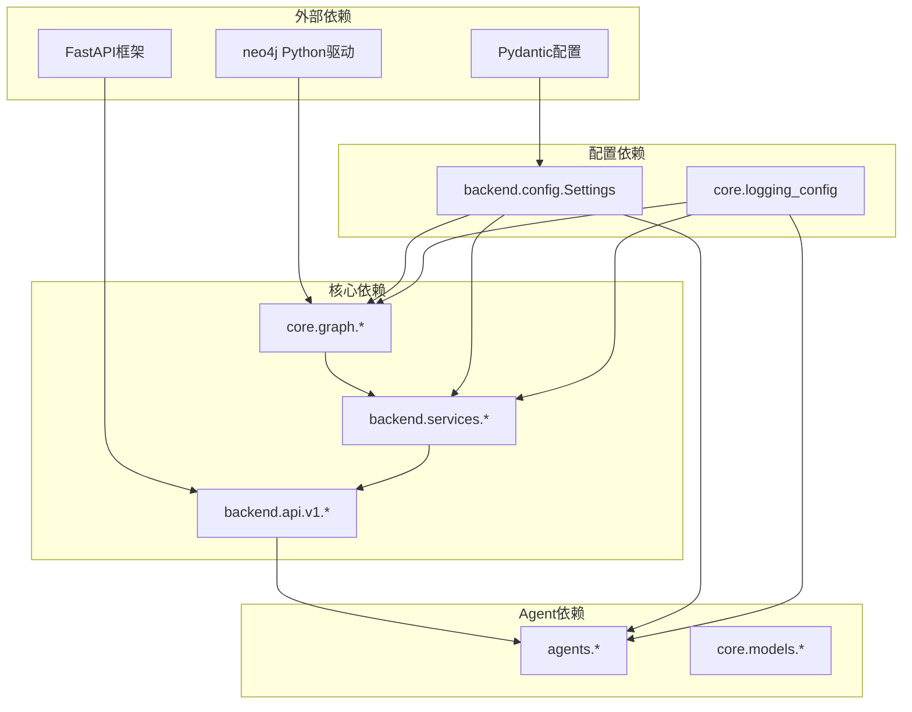

# 图查询服务

<cite>
**本文档引用的文件**
- [graph_query_mixin.py](file://agents/graph_query_mixin.py)
- [graph_query_service.py](file://backend/services/graph_query_service.py)
- [graph.py](file://backend/api/v1/graph.py)
- [neo4j_client.py](file://core/graph/neo4j_client.py)
- [graph_models.py](file://core/graph/graph_models.py)
- [graph_sync_service.py](file://backend/services/graph_sync_service.py)
- [config.py](file://backend/config.py)
- [relationship_mapper.py](file://core/graph/relationship_mapper.py)
- [graph_exceptions.py](file://core/graph/graph_exceptions.py)
- [main.py](file://backend/main.py)
</cite>

## 目录
1. [简介](#简介)
2. [项目结构](#项目结构)
3. [核心组件](#核心组件)
4. [架构概览](#架构概览)
5. [详细组件分析](#详细组件分析)
6. [依赖关系分析](#依赖关系分析)
7. [性能考量](#性能考量)
8. [故障排除指南](#故障排除指南)
9. [结论](#结论)

## 简介

图查询服务是小说生成系统中的核心图数据库查询能力模块。该服务基于Neo4j图数据库，为AI写作系统提供强大的关系查询、路径分析、影响力计算和一致性检测功能。通过图查询服务，系统能够实现角色关系网络分析、故事线索追踪、伏笔管理、角色影响力评估等高级功能，显著提升小说创作的质量和连贯性。

该服务采用混合式架构设计，既可以通过API直接调用，也可以作为混入类集成到各个AI Agent中，为不同类型的Agent提供统一的图数据库查询能力。

## 项目结构

图查询服务在整个项目架构中位于核心位置，横跨多个层次：

**图表来源**
- [graph.py:1-581](file://backend/api/v1/graph.py#L1-L581)
- [graph_query_mixin.py:1-498](file://agents/graph_query_mixin.py#L1-L498)
- [graph_query_service.py:1-537](file://backend/services/graph_query_service.py#L1-L537)

**章节来源**
- [main.py:1-159](file://backend/main.py#L1-L159)
- [config.py:298-350](file://backend/config.py#L298-L350)

## 核心组件

图查询服务由多个核心组件构成，每个组件都有明确的职责分工：

### 1. 图查询混入类 (GraphQueryMixin)
为AI Agent提供便捷的图数据库查询接口，支持角色网络查询、路径分析、影响力计算等功能。

### 2. 图查询服务 (GraphQueryService)
提供具体的图查询实现，包括角色网络查询、最短路径查找、关系一致性检测等核心功能。

### 3. Neo4j客户端 (Neo4jClient)
封装Neo4j数据库连接和查询操作，提供异步查询、事务处理、健康检查等基础能力。

### 4. 图数据模型 (Graph Models)
定义图数据库中的节点和关系的数据结构，包括角色、地点、事件、势力等实体类型。

### 5. 图同步服务 (GraphSyncService)
负责将PostgreSQL中的实体数据同步到Neo4j图数据库，支持全量同步和增量同步。

**章节来源**
- [graph_query_mixin.py:26-498](file://agents/graph_query_mixin.py#L26-L498)
- [graph_query_service.py:135-537](file://backend/services/graph_query_service.py#L135-L537)
- [neo4j_client.py:81-550](file://core/graph/neo4j_client.py#L81-L550)

## 架构概览

图查询服务采用分层架构设计，确保各层职责清晰、耦合度低：

**图表来源**
- [graph.py:29-581](file://backend/api/v1/graph.py#L29-L581)
- [graph_query_service.py:135-537](file://backend/services/graph_query_service.py#L135-L537)
- [graph_sync_service.py:61-596](file://backend/services/graph_sync_service.py#L61-L596)

## 详细组件分析

### 图查询混入类 (GraphQueryMixin)

图查询混入类是Agent与图数据库交互的桥梁，提供了统一的查询接口：

**图表来源**
- [graph_query_mixin.py:26-498](file://agents/graph_query_mixin.py#L26-L498)
- [graph_query_service.py:135-537](file://backend/services/graph_query_service.py#L135-L537)
- [neo4j_client.py:81-550](file://core/graph/neo4j_client.py#L81-L550)

#### 主要功能特性

1. **角色关系网络查询**: 支持指定查询深度的角色网络分析
2. **路径分析**: 查找两个角色之间的最短关系路径
3. **影响力计算**: 基于关系数量和中心性计算角色影响力
4. **一致性检测**: 自动检测故事中的逻辑冲突
5. **伏笔管理**: 跟踪和管理待回收的伏笔线索
6. **事件时间线**: 按章节顺序展示事件发展

**章节来源**
- [graph_query_mixin.py:46-498](file://agents/graph_query_mixin.py#L46-L498)

### 图查询服务 (GraphQueryService)

图查询服务是核心的查询实现层，提供具体的数据查询逻辑：

**图表来源**
- [graph_query_service.py:149-218](file://backend/services/graph_query_service.py#L149-L218)
- [neo4j_client.py:207-224](file://core/graph/neo4j_client.py#L207-L224)

#### 查询类型和复杂度

| 查询类型 | 功能描述 | 时间复杂度 | 空间复杂度 |
|---------|----------|-----------|-----------|
| 角色网络查询 | 获取指定深度的关系网络 | O(V+E) | O(V+E) |
| 最短路径查询 | 查找两点间最短路径 | O(V+E) | O(V) |
| 关系一致性检测 | 检测逻辑冲突 | O(V+E) | O(1) |
| 影响力分析 | 计算角色影响力分数 | O(V+E) | O(1) |
| 事件时间线 | 获取按章节排序的事件 | O(E log E) | O(E) |

**章节来源**
- [graph_query_service.py:135-537](file://backend/services/graph_query_service.py#L135-L537)

### Neo4j客户端 (Neo4jClient)

Neo4j客户端提供底层的数据库连接和查询能力：

**图表来源**
- [neo4j_client.py:133-171](file://core/graph/neo4j_client.py#L133-L171)
- [neo4j_client.py:207-224](file://core/graph/neo4j_client.py#L207-L224)

#### 安全特性

1. **白名单验证**: 防止Cypher注入攻击
2. **异步执行**: 使用线程池避免阻塞
3. **连接池管理**: 优化数据库连接性能
4. **异常处理**: 完善的错误捕获和处理机制

**章节来源**
- [neo4j_client.py:25-78](file://core/graph/neo4j_client.py#L25-L78)
- [neo4j_client.py:133-171](file://core/graph/neo4j_client.py#L133-L171)

### 图数据模型 (Graph Models)

图数据模型定义了图数据库中的实体结构：

**图表来源**
- [graph_models.py:100-395](file://core/graph/graph_models.py#L100-L395)

#### 关系类型映射

| 关系类型 | 描述 | 对称性 | 反向关系 |
|---------|------|--------|----------|
| CHARACTER_RELATION | 角色间关系 | 取决于具体子类型 | 取决于具体子类型 |
| LOCATED_AT | 角色-地点关系 | 否 | 无 |
| PARTICIPATED_IN | 角色-事件关系 | 否 | 无 |
| MEMBER_OF | 角色-势力关系 | 否 | 无 |
| FORESHADOWED_BY | 事件-伏笔关系 | 否 | 无 |

**章节来源**
- [graph_models.py:25-67](file://core/graph/graph_models.py#L25-L67)
- [relationship_mapper.py:18-48](file://core/graph/relationship_mapper.py#L18-L48)

### 图同步服务 (GraphSyncService)

图同步服务负责维护图数据库与关系数据库的一致性：

**图表来源**
- [graph_sync_service.py:78-125](file://backend/services/graph_sync_service.py#L78-L125)
- [graph_sync_service.py:443-491](file://backend/services/graph_sync_service.py#L443-L491)

#### 同步策略

1. **全量同步**: 同步小说的所有实体和关系
2. **增量同步**: 仅同步新增或变更的实体
3. **章节同步**: 章节生成后自动同步新实体
4. **关系同步**: 专门同步角色间的关系

**章节来源**
- [graph_sync_service.py:61-596](file://backend/services/graph_sync_service.py#L61-L596)

## 依赖关系分析

图查询服务的依赖关系呈现清晰的分层结构：

**图表来源**
- [graph_query_mixin.py:12-23](file://agents/graph_query_mixin.py#L12-L23)
- [graph_query_service.py:7-11](file://backend/services/graph_query_service.py#L7-L11)
- [graph.py:9-27](file://backend/api/v1/graph.py#L9-L27)

### 关键依赖关系

1. **配置依赖**: 所有组件都依赖配置管理模块
2. **异常处理**: 统一的异常处理机制
3. **日志系统**: 集中的日志记录
4. **数据库连接**: 通过工厂模式管理连接

**章节来源**
- [config.py:48-504](file://backend/config.py#L48-L504)
- [graph_exceptions.py:7-130](file://core/graph/graph_exceptions.py#L7-L130)

## 性能考量

图查询服务在设计时充分考虑了性能优化：

### 1. 连接池管理
- 最大连接池大小: 50个连接
- 连接超时时间: 30秒
- 自动连接复用，避免频繁创建销毁

### 2. 查询优化
- 使用白名单验证防止恶意查询
- 支持异步查询避免阻塞
- 提供查询缓存机制

### 3. 内存管理
- 限制查询结果集大小
- 及时释放数据库连接
- 优化数据结构减少内存占用

### 4. 错误恢复
- 自动重连机制
- 优雅降级处理
- 完善的错误日志

## 故障排除指南

### 常见问题及解决方案

#### 1. 图数据库连接失败
**症状**: API调用返回连接错误
**原因**: Neo4j服务不可用或认证失败
**解决方法**:
- 检查Neo4j服务状态
- 验证连接配置
- 确认防火墙设置

#### 2. 查询超时
**症状**: 查询长时间无响应
**原因**: 查询过于复杂或数据量过大
**解决方法**:
- 减少查询深度
- 添加适当的索引
- 优化查询条件

#### 3. 权限不足
**症状**: 查询返回空结果或权限错误
**原因**: 数据库用户权限不足
**解决方法**:
- 检查用户权限配置
- 确认数据库访问权限
- 验证角色权限设置

#### 4. 同步失败
**症状**: 图数据库与关系数据库不一致
**原因**: 同步过程中断或数据冲突
**解决方法**:
- 检查同步日志
- 重新执行同步任务
- 清理脏数据

**章节来源**
- [graph_exceptions.py:22-130](file://core/graph/graph_exceptions.py#L22-L130)
- [neo4j_client.py:133-171](file://core/graph/neo4j_client.py#L133-L171)

### 监控和诊断

1. **健康检查**: 定期检查数据库连接状态
2. **性能监控**: 监控查询响应时间和资源使用
3. **错误日志**: 记录详细的错误信息和堆栈跟踪
4. **审计日志**: 跟踪重要的数据库操作

## 结论

图查询服务是小说生成系统的重要基础设施，它通过以下优势为整个系统提供价值：

### 核心优势

1. **统一接口**: 为不同类型的Agent提供一致的图数据库访问方式
2. **功能丰富**: 支持关系查询、路径分析、影响力计算等多种分析功能
3. **性能优化**: 通过连接池、异步处理等技术确保高效运行
4. **安全保障**: 完善的异常处理和安全防护机制
5. **易于扩展**: 模块化设计便于功能扩展和维护

### 应用场景

- **角色关系分析**: 深入理解角色间的复杂关系网络
- **故事线索追踪**: 跟踪和管理各种故事线索的发展
- **一致性检查**: 自动检测故事中的逻辑冲突和不一致
- **创作辅助**: 为AI Agent提供丰富的背景信息和上下文
- **质量控制**: 确保小说内容的连贯性和完整性

### 发展方向

随着系统的不断发展，图查询服务将继续演进，包括：
- 更智能的关系推理能力
- 更丰富的可视化功能
- 更强大的预测分析能力
- 更好的性能优化和扩展性

通过持续的改进和优化，图查询服务将成为小说生成系统中不可或缺的核心组件，为用户提供更加智能化、个性化的创作体验。