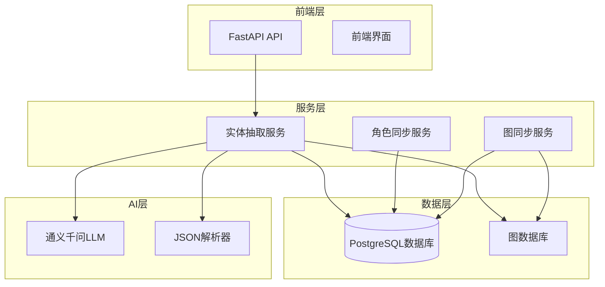
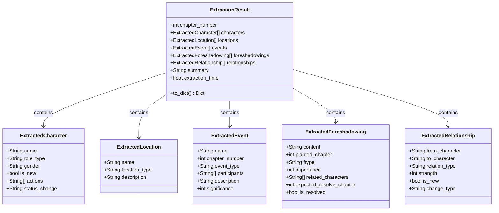
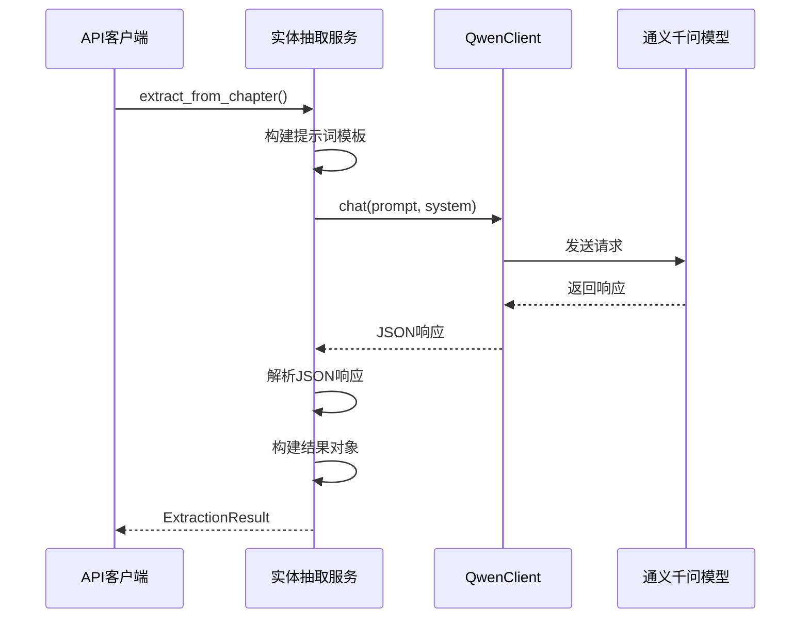
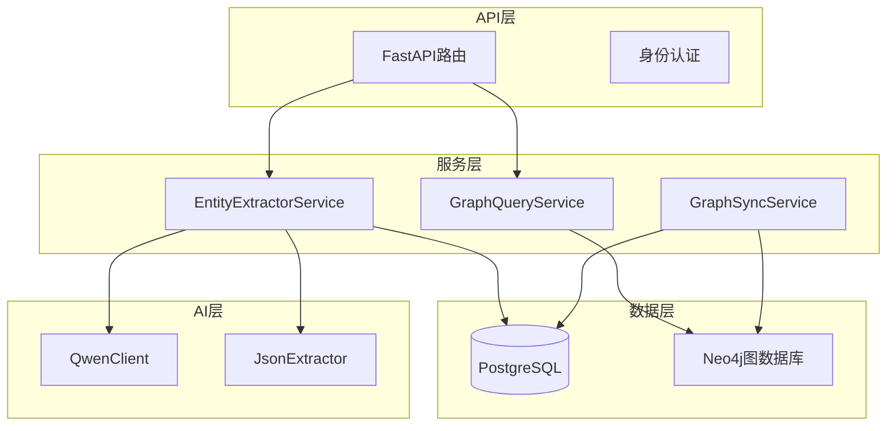
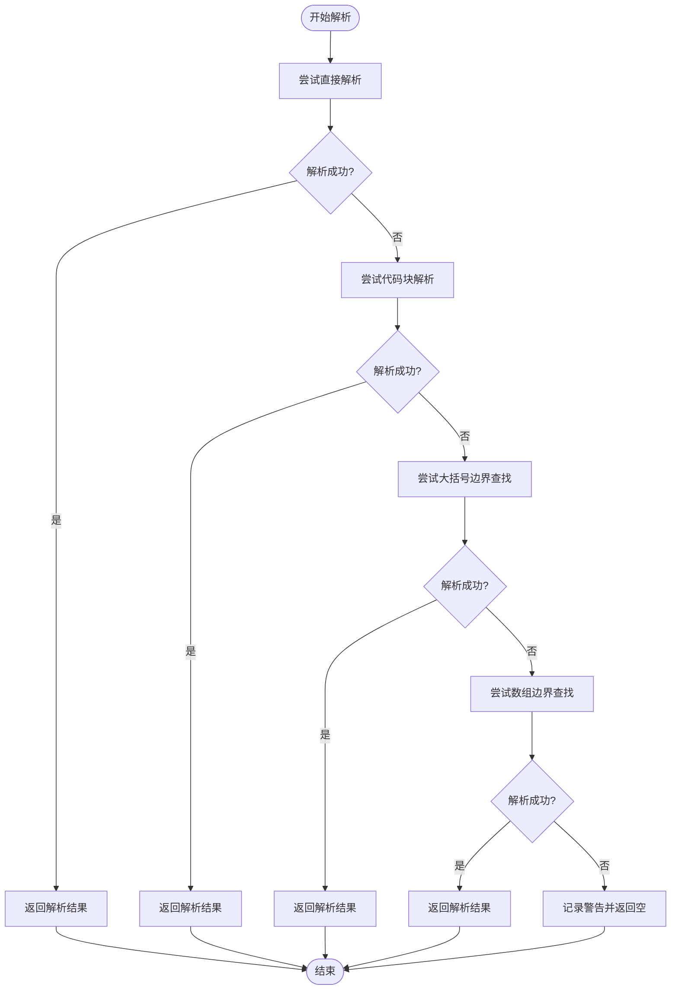
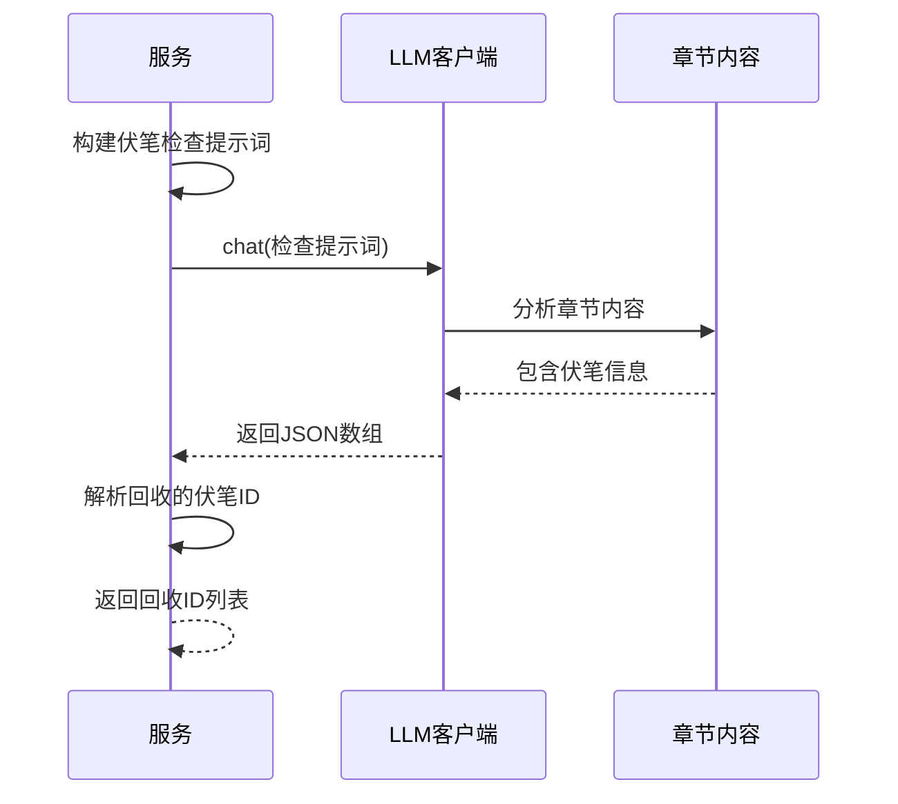
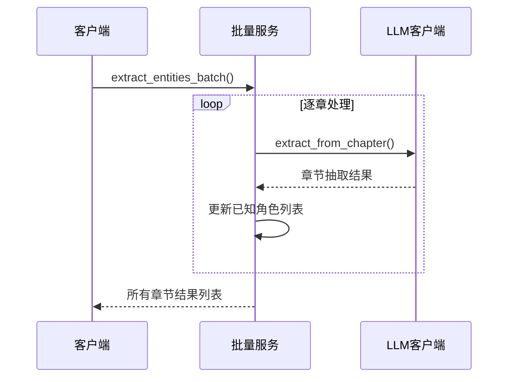
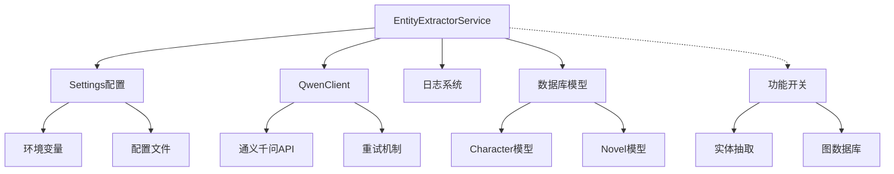
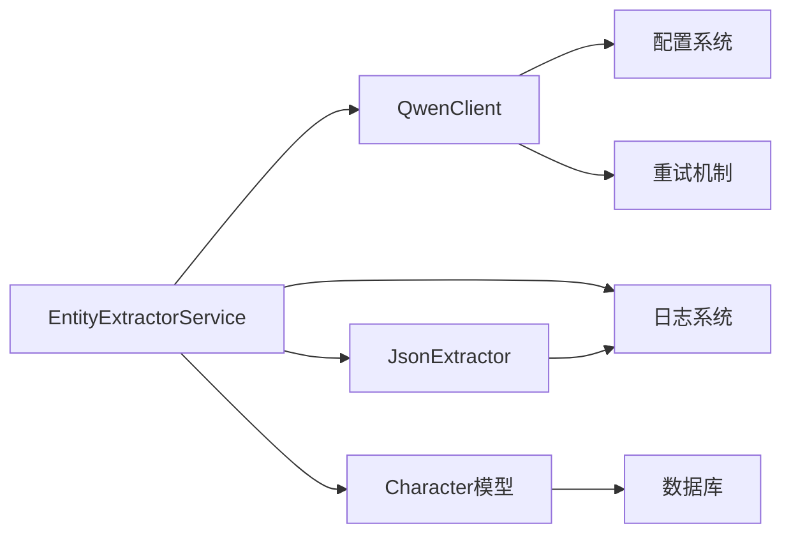

# 实体抽取服务

<cite>
**本文档引用的文件**
- [entity_extractor_service.py](file://backend/services/entity_extractor_service.py)
- [json_extractor.py](file://agents/base/json_extractor.py)
- [qwen_client.py](file://llm/qwen_client.py)
- [graph.py](file://backend/api/v1/graph.py)
- [config.py](file://backend/config.py)
- [character_auto_detector.py](file://backend/services/character_auto_detector.py)
- [foreshadowing_auto_injector.py](file://agents/foreshadowing_auto_injector.py)
- [foreshadowing_tracker.py](file://agents/foreshadowing_tracker.py)
- [graph_sync_service.py](file://backend/services/graph_sync_service.py)
- [neo4j_client.py](file://core/graph/neo4j_client.py)
- [character.py](file://core/models/character.py)
- [test_entity_extractor_service.py](file://tests/unit/test_entity_extractor_service.py)
- [test_graph_api.py](file://tests/unit/test_graph_api.py)
</cite>

## 更新摘要
**变更内容**
- 新增批量实体抽取功能，支持多章节同时处理
- 增强JSON解析能力，支持多种响应格式
- 添加伏笔回收检查功能
- 优化配置管理和错误处理机制
- 新增完整的单元测试覆盖

## 目录
1. [简介](#简介)
2. [项目结构](#项目结构)
3. [核心组件](#核心组件)
4. [架构概览](#架构概览)
5. [详细组件分析](#详细组件分析)
6. [依赖关系分析](#依赖关系分析)
7. [性能考虑](#性能考虑)
8. [故障排除指南](#故障排除指南)
9. [结论](#结论)

## 简介

实体抽取服务是小说生成系统中的核心组件，负责从章节内容中自动识别和抽取关键实体信息。该服务使用大型语言模型（LLM）技术，能够智能地从文本中提取角色、地点、事件、伏笔和关系等结构化信息，并将其转换为系统可处理的数据格式。

**更新** 该服务现已增强对角色、地点、事件、伏笔等实体的抽取能力，支持批量处理和多种JSON解析策略，显著提升了处理效率和准确性。

该服务的主要功能包括：
- **角色实体识别**：自动发现新角色、角色类型判断、性别识别
- **地点实体抽取**：识别故事发生的场景和地点  
- **事件实体提取**：捕捉重要的情节事件和转折点
- **伏笔管理**：识别和追踪小说中的伏笔线索，支持回收检查
- **关系分析**：建立角色间的关系网络
- **批量处理**：支持多章节同时处理，提升整体效率
- **智能JSON解析**：内置多种JSON解析策略，确保响应稳定性

## 项目结构

小说系统采用模块化架构设计，实体抽取服务位于后端服务层，与前端API、数据库和图数据库紧密集成。



**图表来源**
- [entity_extractor_service.py:1-579](file://backend/services/entity_extractor_service.py#L1-L579)
- [graph.py:1-765](file://backend/api/v1/graph.py#L1-L765)

## 核心组件

实体抽取服务由多个核心组件构成，每个组件都有特定的功能和职责：

### 主要数据模型

服务定义了完整的实体数据模型体系：



**图表来源**
- [entity_extractor_service.py:17-147](file://backend/services/entity_extractor_service.py#L17-L147)

### LLM集成架构

服务通过统一的LLM客户端接口与多种AI模型进行交互：



**图表来源**
- [entity_extractor_service.py:249-315](file://backend/services/entity_extractor_service.py#L249-L315)
- [qwen_client.py:59-178](file://llm/qwen_client.py#L59-L178)

**章节来源**
- [entity_extractor_service.py:17-147](file://backend/services/entity_extractor_service.py#L17-L147)
- [qwen_client.py:16-350](file://llm/qwen_client.py#L16-L350)

## 架构概览

实体抽取服务采用分层架构设计，确保了系统的可扩展性和维护性：



**图表来源**
- [graph.py:15-27](file://backend/api/v1/graph.py#L15-L27)
- [entity_extractor_service.py:235-247](file://backend/services/entity_extractor_service.py#L235-L247)

### 配置管理系统

系统通过集中式的配置管理确保各组件的一致性：

| 配置项 | 默认值 | 说明 |
|--------|--------|------|
| ENABLE_ENTITY_EXTRACTION | True | 启用实体抽取功能 |
| ENTITY_EXTRACTION_MODEL | "qwen-plus" | LLM模型名称 |
| ENTITY_EXTRACTION_CONFIDENCE_THRESHOLD | 0.7 | 置信度阈值 |
| ENTITY_EXTRACTION_MAX_CONTENT_LENGTH | 4000 | 最大内容长度 |

**章节来源**
- [config.py:334-342](file://backend/config.py#L334-L342)

## 详细组件分析

### 实体抽取服务核心实现

实体抽取服务是整个系统的核心组件，提供了完整的实体识别和抽取功能：

#### 主要功能特性

1. **多实体类型支持**：支持角色、地点、事件、伏笔、关系五种实体类型
2. **批量处理能力**：支持多章节同时处理，提高效率
3. **智能JSON解析**：内置多种JSON解析策略，确保响应稳定性
4. **错误处理机制**：完善的异常处理和降级策略
5. **伏笔回收检查**：专门的伏笔回收识别功能

#### JSON解析策略

服务实现了多层次的JSON解析策略，确保从LLM响应中稳定提取结构化数据：



**图表来源**
- [entity_extractor_service.py:411-464](file://backend/services/entity_extractor_service.py#L411-L464)

#### 伏笔检查功能

服务还提供了专门的伏笔回收检查功能：



**图表来源**
- [entity_extractor_service.py:352-410](file://backend/services/entity_extractor_service.py#L352-L410)

#### 批量处理功能

**更新** 新增批量实体抽取功能，支持多章节同时处理：



**图表来源**
- [entity_extractor_service.py:317-350](file://backend/services/entity_extractor_service.py#L317-L350)

**章节来源**
- [entity_extractor_service.py:235-579](file://backend/services/entity_extractor_service.py#L235-L579)

### JSON提取工具

JSON提取工具提供了统一的JSON解析接口，支持多种格式的响应处理：

#### 核心解析策略

1. **直接解析**：最快的解析方式，适用于标准JSON格式
2. **代码块提取**：处理Markdown代码块格式的JSON
3. **边界查找**：通过大括号和方括号定位JSON边界
4. **修复解析**：自动修复常见的JSON格式问题

#### 使用示例

```python
# 基本使用
data = JsonExtractor.extract_json(response_text)

# 安全提取
safe_data = JsonExtractor.safe_extract(response_text, "角色提取")

# 提取对象
obj = JsonExtractor.extract_object(response_text)

# 提取数组
arr = JsonExtractor.extract_array(response_text)
```

**章节来源**
- [json_extractor.py:16-237](file://agents/base/json_extractor.py#L16-L237)

### LLM客户端集成

QwenClient提供了统一的LLM调用接口，支持多种部署模式：

#### 支持的部署模式

1. **DashScope SDK模式**：标准的阿里云DashScope API
2. **OpenAI兼容模式**：支持自定义API端点
3. **流式响应**：支持实时流式输出

#### 配置选项

| 参数 | 类型 | 默认值 | 说明 |
|------|------|--------|------|
| temperature | float | 0.7 | 采样温度 |
| max_tokens | int | 4096 | 最大token数 |
| top_p | float | 0.9 | 核采样概率 |
| retries | int | 3 | 重试次数 |

**章节来源**
- [qwen_client.py:16-350](file://llm/qwen_client.py#L16-L350)

### API接口设计

实体抽取服务通过RESTful API提供服务，支持单章节和批量处理：

#### 主要API端点

1. **单章节抽取**：`POST /novels/{novel_id}/graph/extract`
2. **批量抽取**：`POST /novels/{novel_id}/graph/extract/batch`
3. **健康检查**：`GET /novels/{novel_id}/graph/health`

#### 请求参数

| 参数 | 类型 | 必需 | 说明 |
|------|------|------|------|
| novel_id | UUID | 是 | 小说唯一标识符 |
| chapter_number | int | 是 | 章节编号 |
| chapter_content | str | 是 | 章节内容 |
| chapters | List[Dict] | 否 | 章节列表（批量模式） |

**章节来源**
- [graph.py:509-581](file://backend/api/v1/graph.py#L509-L581)

## 依赖关系分析

实体抽取服务的依赖关系相对简洁，主要依赖于配置系统、数据库和AI服务：



**图表来源**
- [entity_extractor_service.py:12-14](file://backend/services/entity_extractor_service.py#L12-L14)
- [config.py:48-504](file://backend/config.py#L48-L504)

### 外部依赖

服务依赖的关键外部组件：

1. **通义千问API**：提供强大的语言理解和生成能力
2. **PostgreSQL数据库**：存储结构化数据
3. **Neo4j图数据库**：存储实体关系网络
4. **FastAPI框架**：提供高性能的Web服务

### 内部依赖

服务内部的模块依赖关系：



**图表来源**
- [entity_extractor_service.py:235-247](file://backend/services/entity_extractor_service.py#L235-L247)

**章节来源**
- [entity_extractor_service.py:12-14](file://backend/services/entity_extractor_service.py#L12-L14)
- [config.py:48-504](file://backend/config.py#L48-L504)

## 性能考虑

实体抽取服务在设计时充分考虑了性能优化：

### 并发处理

1. **异步处理**：所有LLM调用都是异步的，避免阻塞
2. **批量处理**：支持多章节同时处理，提高吞吐量
3. **连接池**：数据库和图数据库连接使用连接池管理

### 缓存策略

1. **配置缓存**：配置系统使用LRU缓存减少重复加载
2. **图查询缓存**：图数据库查询结果缓存
3. **响应缓存**：LLM响应结果缓存

### 超时和重试

1. **请求超时**：合理的超时设置避免资源浪费
2. **指数退避**：智能的重试策略减少服务器压力
3. **熔断机制**：防止级联故障

## 故障排除指南

### 常见问题及解决方案

#### LLM调用失败

**问题症状**：实体抽取服务抛出异常，返回空结果

**可能原因**：
1. API密钥配置错误
2. 网络连接问题
3. LLM服务不可用

**解决方案**：
1. 检查环境变量配置
2. 验证网络连接
3. 查看服务健康状态

#### JSON解析失败

**问题症状**：服务无法从LLM响应中提取JSON数据

**可能原因**：
1. LLM响应格式不符合预期
2. 响应内容包含特殊字符
3. 网络传输损坏

**解决方案**：
1. 检查提示词模板
2. 启用调试模式查看原始响应
3. 增加重试机制

#### 数据库连接问题

**问题症状**：服务无法连接到数据库

**可能原因**：
1. 数据库配置错误
2. 网络连接问题
3. 权限不足

**解决方案**：
1. 验证数据库URL配置
2. 检查网络可达性
3. 确认数据库用户权限

### 调试和监控

#### 日志级别

服务支持多种日志级别：
- **DEBUG**：详细的调试信息
- **INFO**：一般运行信息
- **WARNING**：潜在问题警告
- **ERROR**：严重错误信息

#### 性能监控

关键性能指标：
1. **响应时间**：单次请求的处理时间
2. **吞吐量**：每秒处理的请求数
3. **错误率**：失败请求的比例
4. **资源使用**：CPU、内存、网络使用情况

**章节来源**
- [entity_extractor_service.py:281-315](file://backend/services/entity_extractor_service.py#L281-L315)
- [config.py:367-427](file://backend/config.py#L367-L427)

## 结论

实体抽取服务是小说生成系统的重要组成部分，它通过先进的AI技术和优雅的架构设计，为整个系统提供了强大的内容理解能力。该服务具有以下特点：

1. **功能完整**：支持多种实体类型的识别和抽取
2. **架构清晰**：模块化设计便于维护和扩展
3. **性能优秀**：异步处理和缓存机制确保高效运行
4. **可靠性高**：完善的错误处理和监控机制
5. **易于集成**：标准化的API接口和配置管理
6. **扩展性强**：支持批量处理和多种JSON解析策略

**更新** 通过本次更新，实体抽取服务显著增强了批量处理能力和JSON解析稳定性，为小说生成系统提供了更加强大和可靠的技术支撑，帮助创作者构建更加丰富和连贯的故事情节。