# 并发控制系统

<cite>
**本文档引用的文件**
- [concurrency.py](file://backend/utils/concurrency.py)
- [celery_app.py](file://workers/celery_app.py)
- [generation_worker.py](file://workers/generation_worker.py)
- [main.py](file://backend/main.py)
- [config.py](file://backend/config.py)
- [generation.py](file://backend/api/v1/generation.py)
- [generation_service.py](file://backend/services/generation_service.py)
- [generation_task.py](file://core/models/generation_task.py)
- [retry.py](file://backend/utils/retry.py)
- [agent_scheduler.py](file://agents/agent_scheduler.py)
- [database.py](file://core/database.py)
- [continuity_validation.py](file://agents/continuity_validation.py)
</cite>

## 更新摘要
**变更内容**
- 新增智能重试机制章节，详细介绍指数退避算法和异常分类处理
- 更新重试机制设计图表，展示新的智能重试流程
- 增强故障排除指南，添加重试机制相关的故障诊断
- 更新配置管理章节，说明重试相关配置项
- 新增重试机制在实际业务场景中的应用示例

## 目录
1. [简介](#简介)
2. [项目结构](#项目结构)
3. [核心组件](#核心组件)
4. [架构概览](#架构概览)
5. [详细组件分析](#详细组件分析)
6. [智能重试机制](#智能重试机制)
7. [依赖关系分析](#依赖关系分析)
8. [性能考虑](#性能考虑)
9. [故障排除指南](#故障排除指南)
10. [结论](#结论)

## 简介

并发控制系统是小说生成系统的核心基础设施，负责协调多个用户和任务之间的资源访问，确保数据一致性和系统稳定性。该系统采用多层次的并发控制策略，包括分布式锁、数据库事务、行级锁和异步任务队列，为复杂的AI小说生成流程提供了可靠的并发安全保障。

系统主要解决以下核心问题：
- 防止多个用户同时修改同一资源导致的数据不一致
- 确保生成任务的有序执行和状态一致性
- 提供高可用的任务调度和执行机制
- 实现优雅的错误处理和重试机制
- **新增**：智能重试机制，支持指数退避算法和异常分类处理

## 项目结构

小说生成系统的并发控制架构采用分层设计，每个层次都有明确的职责分工：

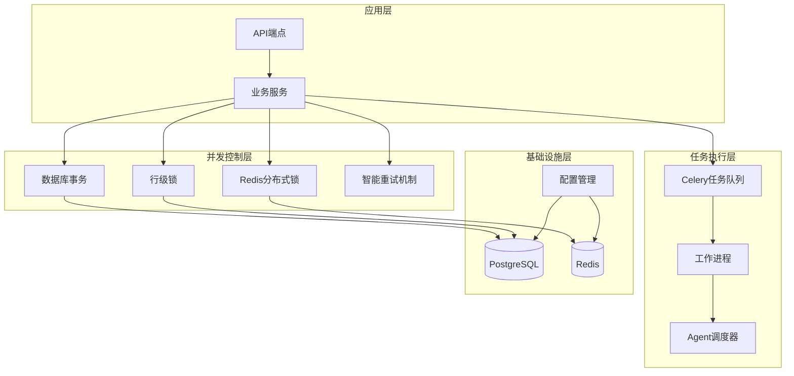

**图表来源**
- [concurrency.py:1-294](file://backend/utils/concurrency.py#L1-L294)
- [celery_app.py:1-26](file://workers/celery_app.py#L1-L26)
- [generation_worker.py:1-100](file://workers/generation_worker.py#L1-L100)

**章节来源**
- [main.py:1-159](file://backend/main.py#L1-L159)
- [config.py:1-417](file://backend/config.py#L1-L417)

## 核心组件

### 分布式锁系统

分布式锁是系统并发控制的核心组件，基于Redis实现，提供原子性的资源锁定机制。

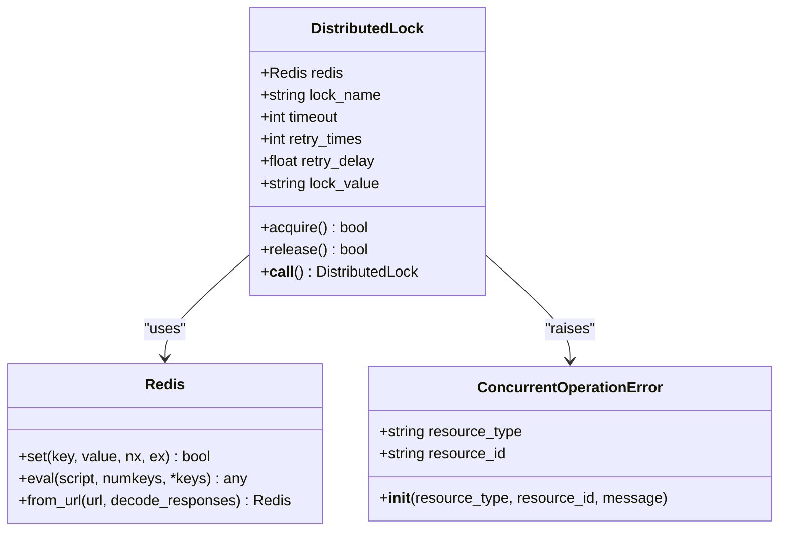

**图表来源**
- [concurrency.py:33-110](file://backend/utils/concurrency.py#L33-L110)

分布式锁的主要特性：
- **原子性**：使用Redis SETNX命令确保锁的原子性获取
- **防死锁**：通过超时机制自动释放长时间占用的锁
- **重试机制**：支持多次重试和指数退避策略
- **Lua脚本**：使用原子性脚本确保锁的正确释放

### 数据库事务管理

系统提供完整的数据库事务管理，确保数据操作的ACID特性。

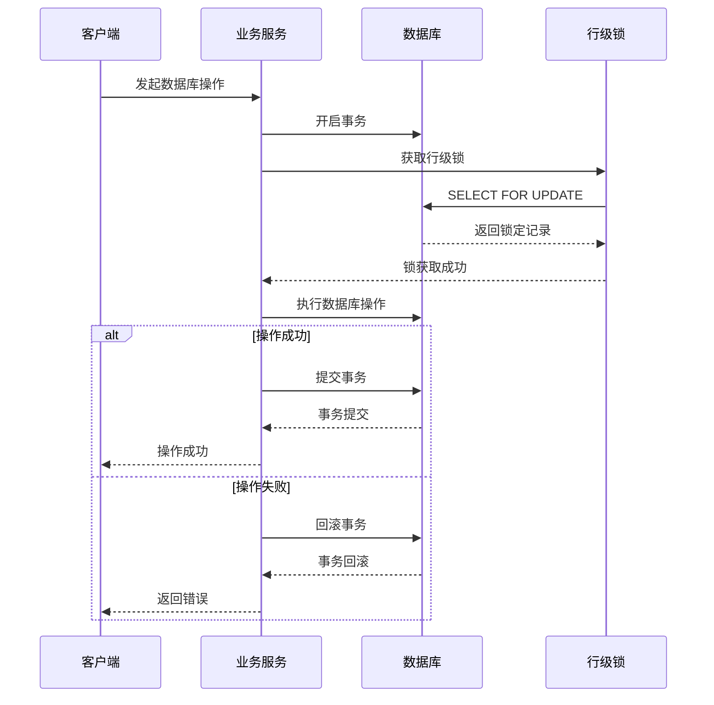

**图表来源**
- [concurrency.py:112-189](file://backend/utils/concurrency.py#L112-L189)

### 异步任务队列

Celery作为分布式任务队列，提供可靠的任务调度和执行机制。

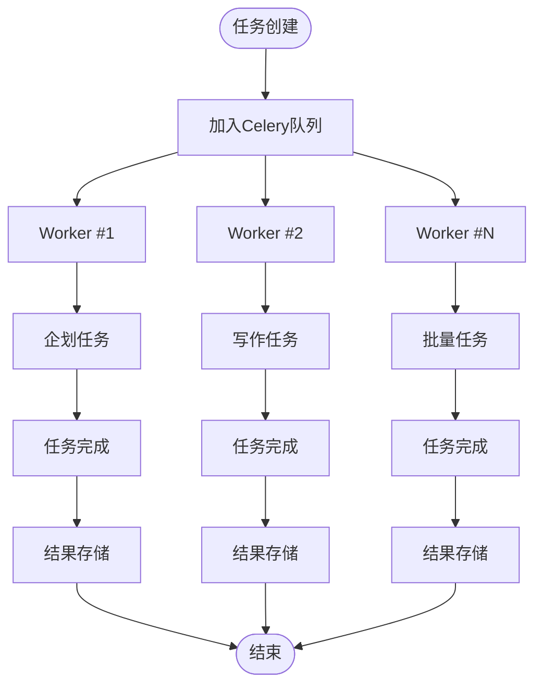

**图表来源**
- [celery_app.py:6-25](file://workers/celery_app.py#L6-L25)
- [generation_worker.py:84-100](file://workers/generation_worker.py#L84-L100)

**章节来源**
- [concurrency.py:1-294](file://backend/utils/concurrency.py#L1-L294)
- [retry.py:1-276](file://backend/utils/retry.py#L1-L276)

## 架构概览

小说生成系统的并发控制架构是一个多层次、分布式的系统，各组件协同工作确保系统的稳定性和可靠性。

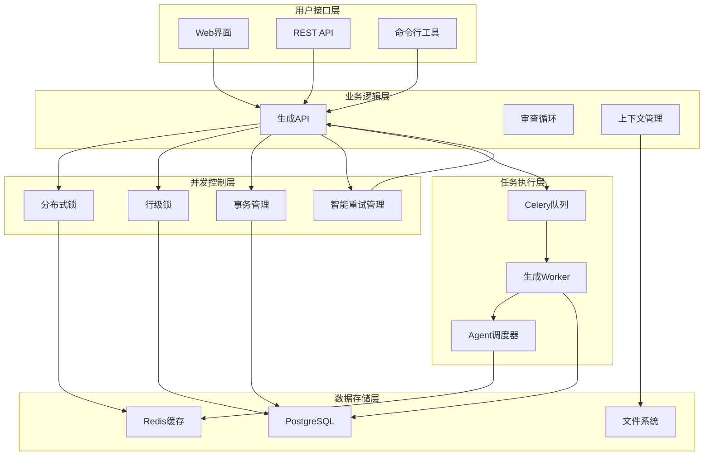

**图表来源**
- [main.py:62-114](file://backend/main.py#L62-L114)
- [config.py:146-176](file://backend/config.py#L146-L176)

## 详细组件分析

### 生成任务并发控制

生成任务的并发控制是系统中最复杂的部分，涉及多种锁机制和状态管理。

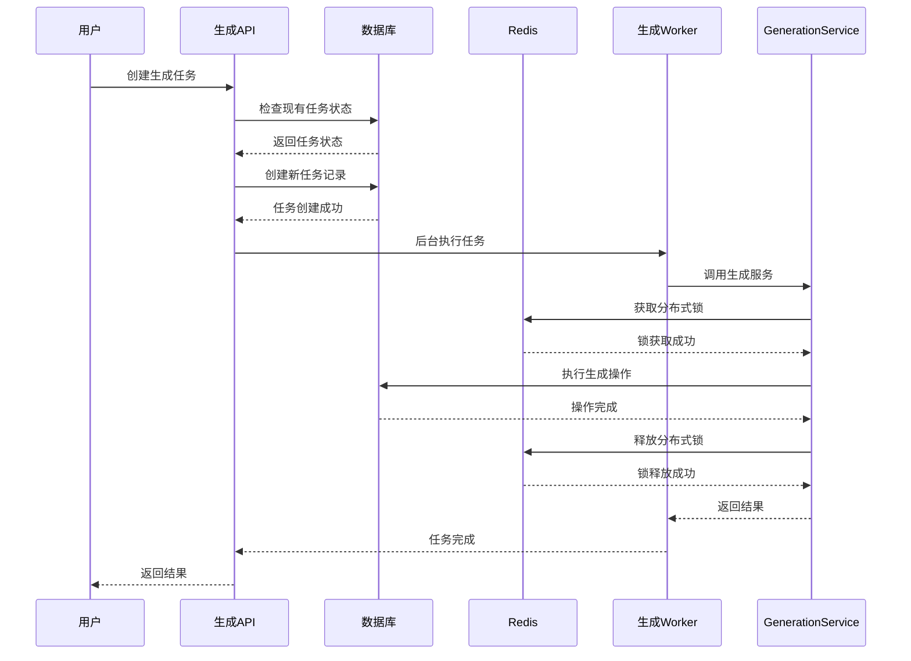

**图表来源**
- [generation.py:30-131](file://backend/api/v1/generation.py#L30-L131)
- [generation_worker.py:84-100](file://workers/generation_worker.py#L84-L100)

#### 任务状态管理

系统使用完整的任务生命周期管理，确保每个任务的状态转换都是可控和可追踪的。

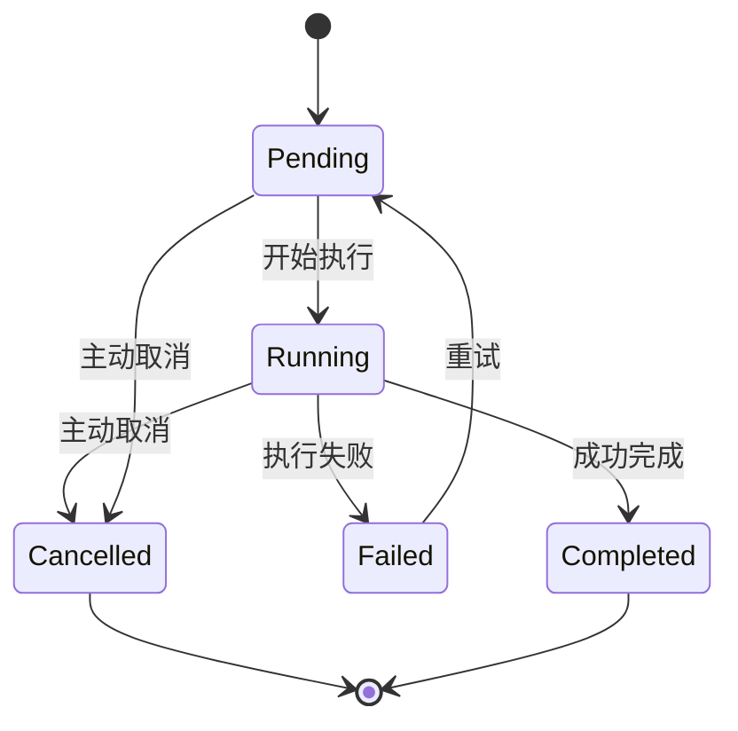

**图表来源**
- [generation_task.py:24-32](file://core/models/generation_task.py#L24-L32)

#### 企划任务并发控制

企划任务是系统中最关键的并发控制场景，需要确保同一小说的企划任务不会重复执行。

**章节来源**
- [generation.py:49-66](file://backend/api/v1/generation.py#L49-L66)
- [generation_service.py:109-133](file://backend/services/generation_service.py#L109-L133)

### Agent调度并发控制

Agent调度器实现了复杂的任务调度算法，确保多个Agent之间的协调和资源分配。

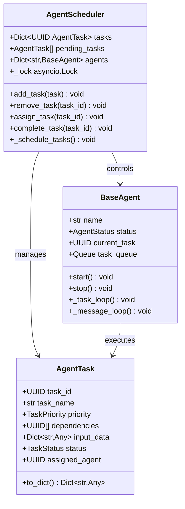

**图表来源**
- [agent_scheduler.py:43-200](file://agents/agent_scheduler.py#L43-L200)

**章节来源**
- [agent_scheduler.py:352-380](file://agents/agent_scheduler.py#L352-L380)

## 智能重试机制

**新增** 智能重试机制是系统可靠性的重要组成部分，通过指数退避算法和异常分类处理显著提升了系统的稳定性。

### 重试配置系统

智能重试机制的核心是灵活的配置系统，支持可定制的重试策略：

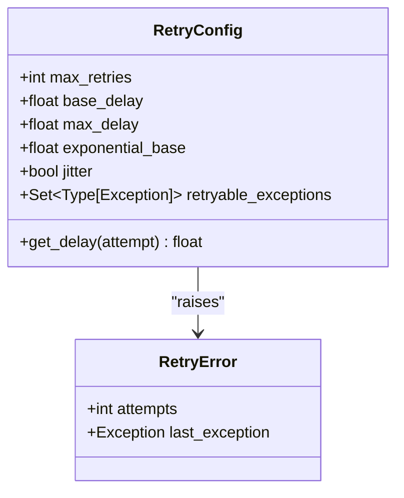

**图表来源**
- [retry.py:34-92](file://backend/utils/retry.py#L34-L92)

### 指数退避算法

系统实现了标准的指数退避算法，通过指数增长的延迟时间避免重试风暴：

```mermaid
flowchart TD
Start([开始重试]) --> CalcDelay[计算延迟时间]
CalcDelay --> ExpBackoff[指数退避: delay = base_delay * (exponential_base ^ attempt)]
ExpBackoff --> Jitter[添加随机抖动: ±10%]
Jitter --> CheckMax[检查是否超过最大延迟]
CheckMax --> |是| UseMax[使用最大延迟]
CheckMax --> |否| UseCalculated[使用计算延迟]
UseMax --> Sleep[等待延迟]
UseCalculated --> Sleep
Sleep --> Retry{还有重试机会?}
Retry --> |是| Start
Retry --> |否| Fail[重试失败]
Fail --> RaiseError[抛出RetryError]
```

**图表来源**
- [retry.py:69-92](file://backend/utils/retry.py#L69-L92)

### 异常分类处理

智能重试机制支持异常分类处理，只有特定类型的异常才会触发重试：

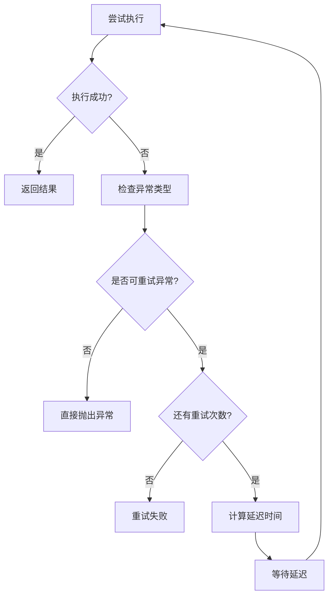

**图表来源**
- [retry.py:128-146](file://backend/utils/retry.py#L128-L146)

### 重试装饰器模式

系统提供了多种重试使用方式，包括装饰器模式、函数包装器和手动重试：

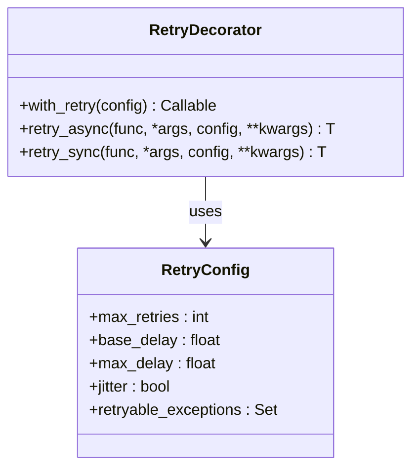

**图表来源**
- [retry.py:247-271](file://backend/utils/retry.py#L247-L271)

### 配置管理

智能重试机制的配置完全集成到系统配置中，支持运行时调整：

**章节来源**
- [config.py:273-281](file://backend/config.py#L273-L281)
- [retry.py:56-67](file://backend/utils/retry.py#L56-L67)

### 实际应用场景

智能重试机制在多个业务场景中发挥重要作用：

1. **审查循环重试**：章节审查过程中的临时性错误自动重试
2. **外部API调用**：LLM API调用的稳定性保障
3. **数据库操作**：偶发性数据库连接问题的自动恢复

**章节来源**
- [continuity_validation.py:275-313](file://agents/continuity_validation.py#L275-L313)

## 依赖关系分析

并发控制系统的依赖关系呈现清晰的分层结构，每个组件都有明确的职责边界。

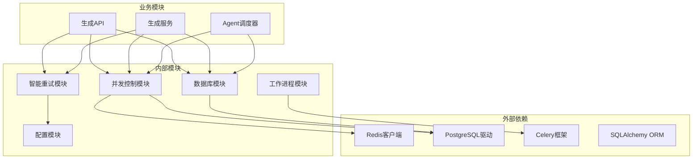

**图表来源**
- [concurrency.py:14-18](file://backend/utils/concurrency.py#L14-L18)
- [config.py:146-176](file://backend/config.py#L146-L176)

**章节来源**
- [database.py:13-25](file://core/database.py#L13-L25)
- [config.py:1-417](file://backend/config.py#L1-L417)

## 性能考虑

### 锁竞争优化

系统通过多种策略减少锁竞争对性能的影响：

1. **最小化锁持有时间**：锁只在必要的时间内保持
2. **细粒度锁**：使用具体的资源ID而不是全局锁
3. **超时机制**：防止死锁和长时间阻塞
4. **重试退避**：避免频繁重试造成系统压力

### 任务调度优化

Celery配置针对长任务进行了专门优化：

- **worker_prefetch_multiplier=1**：确保长任务不会被预取
- **worker_concurrency=2**：限制并发数量，避免资源争用
- **task_time_limit=600**：设置硬性超时限制
- **task_soft_time_limit=540**：设置软性超时限制

### 内存管理

系统实现了智能的内存管理策略：

- **连接池配置**：pool_size=10, max_overflow=20
- **会话过期控制**：expire_on_commit=False
- **缓存清理**：定期清理不活跃的上下文管理器

### 智能重试性能优化

智能重试机制在保证可靠性的同时，也考虑了性能影响：

- **指数退避**：避免重试风暴，保护外部服务
- **最大延迟限制**：防止重试时间过长影响用户体验
- **异常分类**：只对可重试异常进行重试，避免不必要的重试
- **随机抖动**：防止多个实例同时重试，避免雷群效应

## 故障排除指南

### 常见并发问题

#### 锁获取失败

当分布式锁获取失败时，系统会抛出`ConcurrentOperationError`异常。常见原因包括：

1. **锁超时**：锁持有者意外退出
2. **网络分区**：Redis连接中断
3. **资源竞争**：多个进程同时竞争同一资源

**解决方案**：
- 检查Redis服务状态
- 增加锁超时时间
- 实现重试逻辑

#### 事务冲突

数据库事务冲突通常发生在并发更新相同记录时：

**诊断步骤**：
1. 检查是否有未提交的事务
2. 验证锁获取顺序
3. 确认事务隔离级别

**解决方案**：
- 实现乐观锁机制
- 重试事务
- 优化查询语句

#### 任务执行异常

Celery任务执行失败时的处理流程：

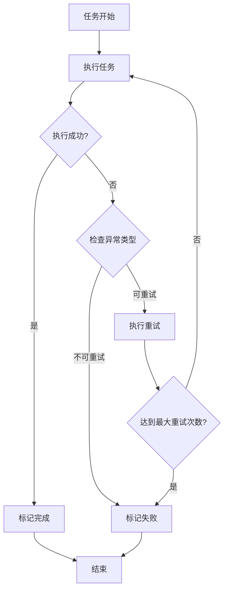

### 智能重试故障排除

**新增** 智能重试机制的故障排除指南：

#### 重试配置问题

**症状**：重试次数不足或过频繁
**诊断**：
1. 检查`REVIEW_LLM_MAX_RETRIES`配置
2. 验证`REVIEW_RETRY_BASE_DELAY`和`REVIEW_RETRY_MAX_DELAY`
3. 确认异常分类配置

**解决方案**：
- 调整重试次数配置
- 优化延迟参数
- 自定义异常分类

#### 重试失败

**症状**：即使重试也无法解决问题
**诊断**：
1. 查看重试日志
2. 检查异常类型是否在可重试列表中
3. 验证最大重试次数设置

**解决方案**：
- 扩展可重试异常类型
- 增加重试次数
- 实现自定义重试逻辑

#### 性能影响

**症状**：重试导致系统性能下降
**诊断**：
1. 监控重试频率
2. 检查指数退避参数
3. 分析重试异常类型分布

**解决方案**：
- 调整指数退避参数
- 优化异常分类
- 实施熔断器模式

**章节来源**
- [concurrency.py:21-31](file://backend/utils/concurrency.py#L21-L31)
- [retry.py:25-32](file://backend/utils/retry.py#L25-L32)

### 监控和调试

系统提供了完善的监控机制：

1. **健康检查端点**：`/health`检查数据库和Redis连接
2. **日志记录**：详细的错误日志和性能日志
3. **任务状态跟踪**：完整的任务生命周期记录
4. **性能指标**：连接池使用情况、锁等待时间等
5. **重试监控**：重试次数、延迟时间、成功率等指标

## 结论

小说生成系统的并发控制系统通过多层次的设计实现了高可用性和高可靠性。系统的关键优势包括：

1. **全面的并发控制**：从应用层到基础设施层的完整覆盖
2. **灵活的配置**：支持开发和生产环境的不同需求
3. **优雅的错误处理**：完善的重试和故障转移机制
4. **可观测性**：完整的监控和调试支持
5. **智能重试机制**：新增的指数退避算法和异常分类处理显著提升了系统的稳定性

**更新** 智能重试机制作为系统可靠性的重要组成部分，通过指数退避算法、异常分类处理和灵活的配置管理，为AI小说生成这一复杂的业务场景提供了更加稳健的基础设施保障。该机制不仅提高了系统的容错能力，还通过合理的重试策略保护了外部服务的稳定性。

该系统为AI小说生成这一复杂的业务场景提供了坚实的基础设施保障，能够支持高并发的用户访问和大规模的内容生成任务。通过持续的优化和改进，系统将继续为用户提供稳定可靠的服务。