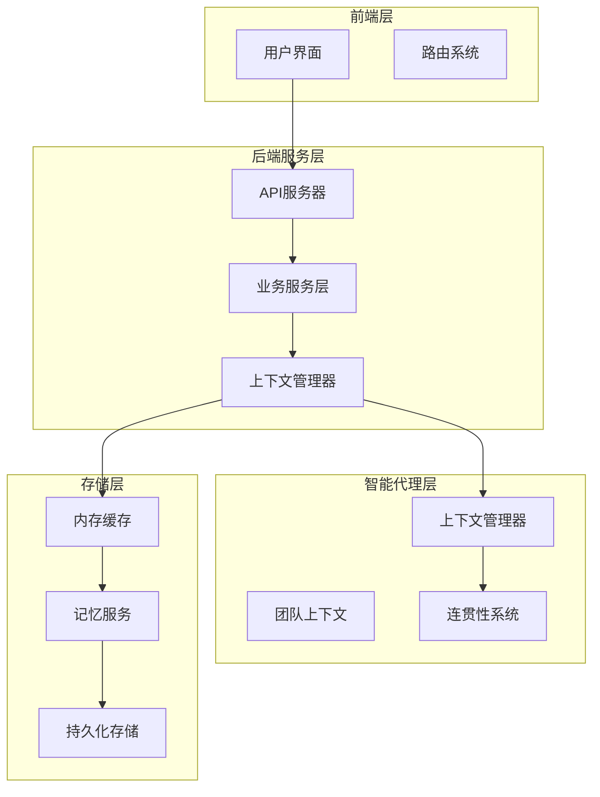
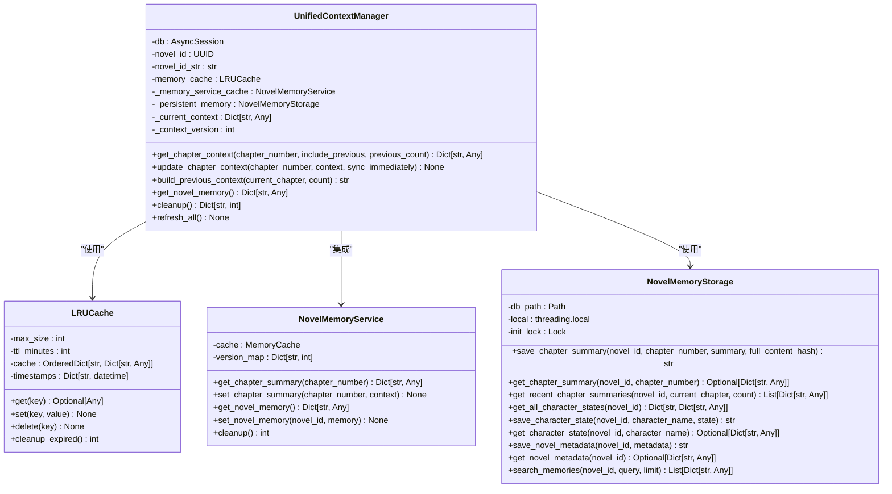
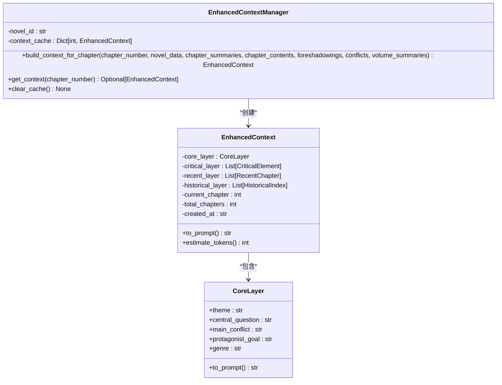
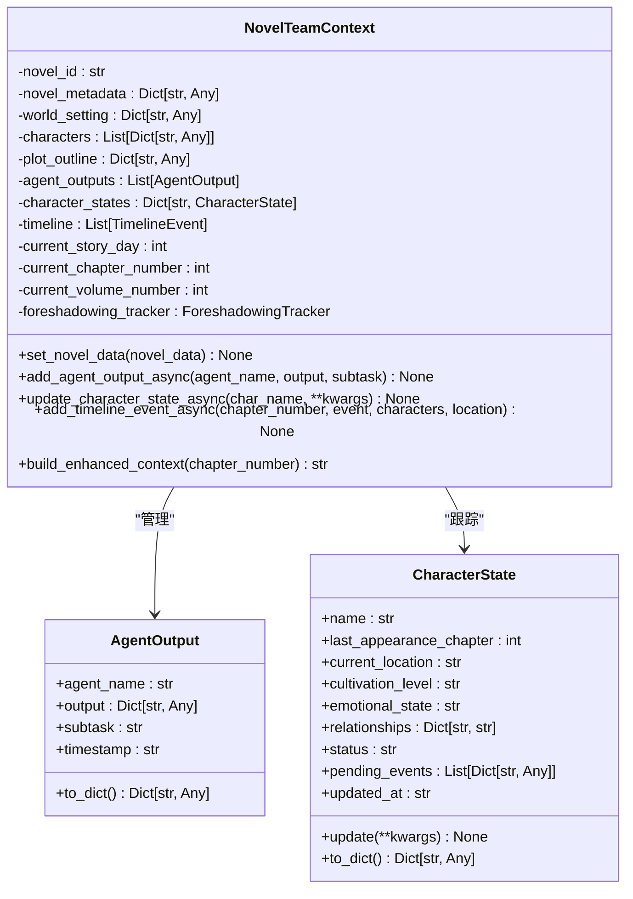
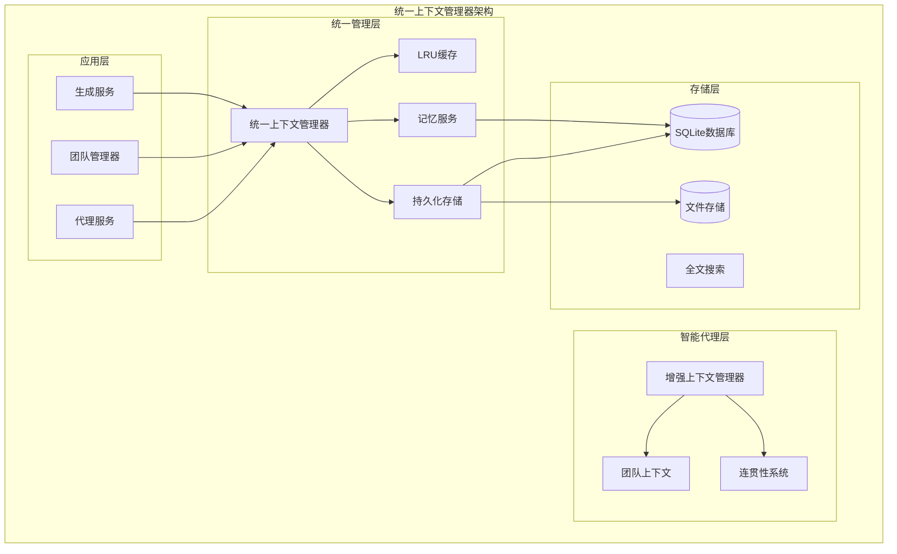
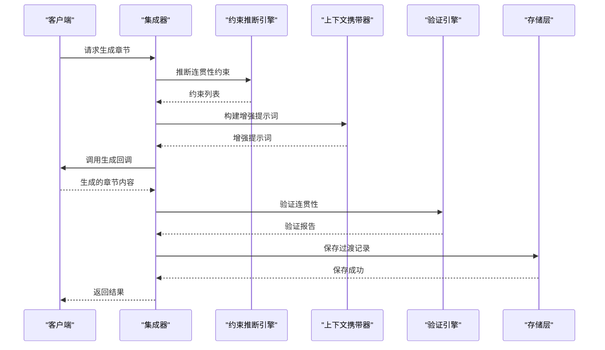
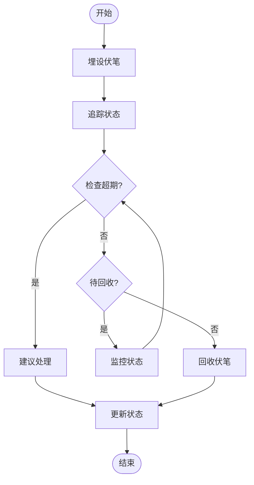
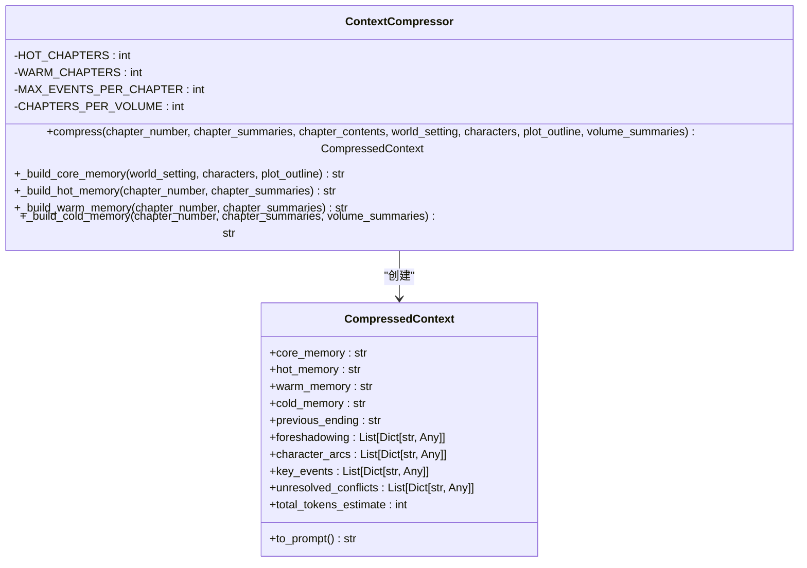
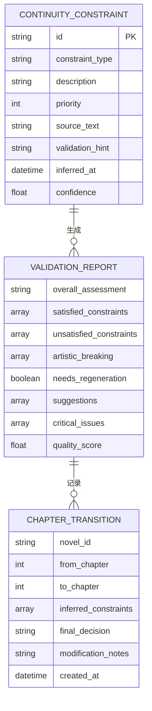
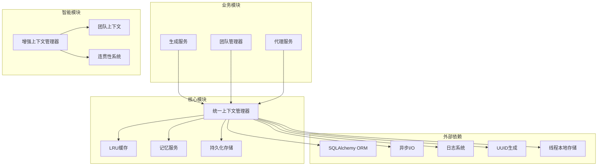

# 统一上下文管理器

<cite>
**本文档引用的文件**
- [enhanced_context_manager.py](file://agents/enhanced_context_manager.py)
- [context_manager.py](file://backend/services/context_manager.py)
- [team_context.py](file://agents/team_context.py)
- [context_compressor.py](file://agents/context_compressor.py)
- [continuity_integration.py](file://agents/continuity_integration.py)
- [foreshadowing_tracker.py](file://agents/foreshadowing_tracker.py)
- [continuity_inference.py](file://agents/continuity_inference.py)
- [memory_service.py](file://backend/services/memory_service.py)
</cite>

## 更新摘要
**变更内容**
- 更新了统一上下文管理器的架构说明，反映增强的四层记忆架构：核心层、关键层、近期层和历史层
- 新增了上下文预加载、双源加载机制和诊断日志系统的详细说明
- 增强了内存管理和协作功能的技术细节
- 更新了相关组件的交互关系图

## 目录
1. [简介](#简介)
2. [项目结构](#项目结构)
3. [核心组件](#核心组件)
4. [架构概览](#架构概览)
5. [详细组件分析](#详细组件分析)
6. [依赖关系分析](#依赖关系分析)
7. [性能考量](#性能考量)
8. [故障排除指南](#故障排除指南)
9. [结论](#结论)

## 简介

统一上下文管理器是小说生成系统中的核心基础设施，旨在解决当前存在的三层存储碎片化问题。该系统通过统一管理内存缓存、MemoryService缓存和SQLite持久化存储，实现了自动同步机制和LRU+TTL清理策略，有效解决了数据同步依赖手动调用、内存泄漏风险和上下文构建逻辑重复等问题。

**更新** 系统现已采用增强的四层记忆架构，包括核心层、关键层、近期层和历史层，确保小说生成过程中的信息完整性。同时集成了连贯性保障系统，通过约束推断、提示词增强和验证机制，保证章节间的逻辑连贯性和叙事一致性。新增的上下文预加载、双源加载机制和诊断日志系统进一步提升了系统的稳定性和可观测性。

系统采用四层记忆架构设计，包括核心层、关键层、近期层和历史层，确保小说生成过程中的信息完整性。同时集成了连贯性保障系统，通过约束推断、提示词增强和验证机制，保证章节间的逻辑连贯性和叙事一致性。

## 项目结构

小说生成系统采用模块化架构设计，主要分为以下几个层次：

**图表来源**
- [context_manager.py:99-153](file://backend/services/context_manager.py#L99-L153)
- [team_context.py:173-242](file://agents/team_context.py#L173-L242)

系统的主要模块包括：

1. **统一上下文管理器**：负责三层存储的统一管理和自动同步
2. **增强上下文管理器**：提供四层记忆架构的上下文构建
3. **团队上下文**：实现Agent之间的信息共享和状态追踪
4. **连贯性保障系统**：确保章节间的逻辑连贯性
5. **存储适配器**：提供SQLite持久化存储支持

**章节来源**
- [context_manager.py:1-391](file://backend/services/context_manager.py#L1-L391)
- [enhanced_context_manager.py:1-573](file://agents/enhanced_context_manager.py#L1-L573)

## 核心组件

### 统一上下文管理器

统一上下文管理器是系统的核心组件，实现了三层存储的统一管理：

**图表来源**
- [context_manager.py:99-153](file://backend/services/context_manager.py#L99-L153)
- [context_manager.py:33-86](file://backend/services/context_manager.py#L33-L86)
- [memory_service.py:75-81](file://backend/services/memory_service.py#L75-L81)

**更新** 统一上下文管理器现在通过NovelMemoryStorage实例化，支持novel_id参数和章节号参数。PersistentMemory属性现在延迟加载NovelMemoryStorage实例，并传入novel_id作为数据库路径的一部分，确保每个小说项目都有独立的存储空间。

### 增强上下文管理器

增强上下文管理器提供四层记忆架构，确保关键信息的完整性：

**图表来源**
- [enhanced_context_manager.py:201-285](file://agents/enhanced_context_manager.py#L201-L285)
- [enhanced_context_manager.py:149-198](file://agents/enhanced_context_manager.py#L149-L198)
- [enhanced_context_manager.py:20-44](file://agents/enhanced_context_manager.py#L20-L44)

### 团队上下文

团队上下文实现了Agent之间的信息共享和状态追踪：

**图表来源**
- [team_context.py:173-242](file://agents/team_context.py#L173-L242)
- [team_context.py:22-38](file://agents/team_context.py#L22-L38)
- [team_context.py:41-74](file://agents/team_context.py#L41-L74)

**章节来源**
- [context_manager.py:99-391](file://backend/services/context_manager.py#L99-L391)
- [enhanced_context_manager.py:201-573](file://agents/enhanced_context_manager.py#L201-L573)
- [team_context.py:173-638](file://agents/team_context.py#L173-L638)

## 架构概览

统一上下文管理器采用三层存储架构，实现了数据的自动同步和统一管理：

**图表来源**
- [context_manager.py:100-153](file://backend/services/context_manager.py#L100-L153)

**更新** 架构现在通过NovelMemoryStorage提供统一的存储接口，支持novel_id参数进行数据隔离。PersistentMemory属性延迟加载，确保每个小说项目都有独立的存储实例，避免了跨项目数据污染的风险。

系统的核心优势包括：

1. **自动同步机制**：三层存储之间的数据自动同步，避免手动调用的风险
2. **LRU+TTL清理策略**：防止内存泄漏和资源浪费
3. **统一接口设计**：简化了上下文构建和管理的复杂性
4. **线程安全保证**：通过异步锁保护共享数据的一致性
5. **数据隔离**：通过novel_id参数确保不同小说项目的存储隔离

**章节来源**
- [context_manager.py:100-153](file://backend/services/context_manager.py#L100-L153)

## 详细组件分析

### 连贯性保障集成系统

连贯性保障系统通过约束推断、提示词增强和验证机制，确保章节间的逻辑连贯性：

**图表来源**
- [continuity_integration.py:49-160](file://agents/continuity_integration.py#L49-L160)
- [continuity_inference.py:73-145](file://agents/continuity_inference.py#L73-L145)

### 伏笔追踪系统

伏笔追踪系统实现了小说中伏笔的埋设、追踪和回收管理：

**图表来源**
- [foreshadowing_tracker.py:145-245](file://agents/foreshadowing_tracker.py#L145-L245)

### 上下文压缩器

上下文压缩器采用四层记忆架构，将上下文保持在恒定的token数量：

**图表来源**
- [context_compressor.py:112-205](file://agents/context_compressor.py#L112-L205)

### 连贯性数据模型

连贯性系统使用统一的数据模型来描述约束、验证报告和章节过渡：

**图表来源**
- [continuity_models.py:12-215](file://agents/continuity_models.py#L12-L215)

**章节来源**
- [continuity_integration.py:24-340](file://agents/continuity_integration.py#L24-L340)
- [foreshadowing_tracker.py:128-435](file://agents/foreshadowing_tracker.py#L128-L435)
- [context_compressor.py:112-674](file://agents/context_compressor.py#L112-L674)

## 依赖关系分析

统一上下文管理器的依赖关系体现了清晰的分层架构：

**图表来源**
- [context_manager.py:16-30](file://backend/services/context_manager.py#L16-L30)
- [team_context.py:12-19](file://agents/team_context.py#L12-L19)

**更新** 依赖关系现在包含了threading模块，用于NovelMemoryStorage的线程本地存储实现。PersistentMemory属性通过延迟加载机制，确保每个线程都有独立的数据库连接实例。

系统的关键依赖特性：

1. **异步架构支持**：全面使用asyncio确保高性能
2. **数据库抽象层**：通过SQLAlchemy实现数据库无关性
3. **内存管理**：LRU缓存和TTL过期机制防止内存泄漏
4. **日志记录**：完整的操作日志便于调试和监控
5. **线程安全**：通过threading.local确保每个线程的独立连接

**章节来源**
- [context_manager.py:16-30](file://backend/services/context_manager.py#L16-L30)
- [team_context.py:12-19](file://agents/team_context.py#L12-L19)

## 性能考量

统一上下文管理器在设计时充分考虑了性能优化：

### 缓存策略

系统采用多级缓存策略，通过LRU算法和TTL过期机制优化内存使用：

- **内存缓存**：LRU缓存，最大100个项目，默认30分钟过期
- **MemoryService缓存**：兼容层缓存，支持TTL过期
- **持久化存储**：SQLite数据库，支持全文搜索和快速查询

**更新** 通过novel_id参数的使用，系统现在能够更好地管理不同小说项目的缓存隔离，避免了跨项目的数据竞争和缓存污染。

### 并发处理

系统通过异步编程模式实现高并发处理：

- **异步I/O**：使用asyncio确保非阻塞操作
- **线程安全**：通过异步锁保护共享数据
- **连接池**：SQLite连接采用线程本地存储

**更新** NovelMemoryStorage通过threading.local实现线程本地连接，确保每个线程都有独立的数据库连接，避免了连接竞争和死锁问题。

### 存储优化

存储层采用多种优化技术：

- **WAL模式**：提升并发性能和可靠性
- **FTS5全文索引**：支持高效的关键词搜索
- **分层存储**：根据访问频率优化存储策略

**更新** 通过novel_id参数的数据库路径组织，系统实现了物理层面的数据隔离，每个小说项目都有独立的数据库文件，进一步提升了存储性能和安全性。

## 故障排除指南

### 常见问题及解决方案

#### 1. 缓存同步问题

**症状**：不同层之间的数据不一致
**解决方案**：
- 检查自动同步机制是否正常工作
- 验证缓存清理策略配置
- 查看日志中的同步错误信息

#### 2. 内存泄漏问题

**症状**：内存使用持续增长
**解决方案**：
- 检查LRU缓存的最大容量设置
- 验证TTL过期机制是否正常
- 监控缓存清理统计信息

#### 3. 数据库连接问题

**症状**：SQLite连接超时或失败
**解决方案**：
- 检查数据库文件权限
- 验证WAL模式配置
- 监控连接池状态

#### 4. 异步锁死问题

**症状**：某些操作长时间无响应
**解决方案**：
- 检查异步锁的使用模式
- 验证锁的超时设置
- 查看死锁检测日志

#### 5. 数据隔离问题

**症状**：不同小说项目的数据相互影响
**解决方案**：
- 验证novel_id参数传递是否正确
- 检查PersistentMemory实例化方式
- 确认数据库路径的唯一性

**章节来源**
- [context_manager.py:361-391](file://backend/services/context_manager.py#L361-L391)
- [team_context.py:244-248](file://agents/team_context.py#L244-L248)

## 结论

统一上下文管理器成功解决了小说生成系统中上下文管理碎片化的问题，通过以下关键改进提升了系统的稳定性和可维护性：

### 主要成就

1. **统一三层存储**：实现了内存缓存、MemoryService和SQLite持久化的统一管理
2. **自动同步机制**：消除了手动数据同步的风险，确保数据一致性
3. **智能清理策略**：通过LRU+TTL机制防止内存泄漏
4. **线程安全保证**：通过异步锁保护共享数据的一致性
5. **统一接口设计**：简化了上下文构建和管理的复杂性
6. **数据隔离增强**：通过novel_id参数确保不同小说项目的存储隔离

**更新** 最重要的成就是增强的四层记忆架构的实现，包括核心层、关键层、近期层和历史层，确保了小说生成过程中关键信息的完整性。新增的上下文预加载、双源加载机制和诊断日志系统进一步提升了系统的稳定性和可观测性。

### 技术创新

系统采用了多项技术创新：

- **四层记忆架构**：确保关键信息的完整性
- **连贯性保障系统**：通过约束推断和验证机制保证章节间的逻辑连贯性
- **智能上下文压缩**：将上下文大小控制在恒定范围内
- **伏笔追踪系统**：实现伏笔的全生命周期管理
- **线程本地存储**：通过threading.local实现每个线程的独立数据库连接

### 未来发展方向

1. **性能优化**：进一步优化缓存策略和数据库查询
2. **扩展性增强**：支持更多的存储后端和缓存策略
3. **监控完善**：增加更详细的性能监控和告警机制
4. **自动化运维**：实现更智能的资源管理和故障自愈
5. **分布式支持**：考虑支持分布式部署和数据同步

统一上下文管理器为小说生成系统提供了坚实的基础，通过其优雅的设计和强大的功能，为后续的功能扩展和系统优化奠定了良好的基础。新的存储架构确保了系统的可扩展性和稳定性，为大规模小说项目的管理提供了可靠的技术支撑。