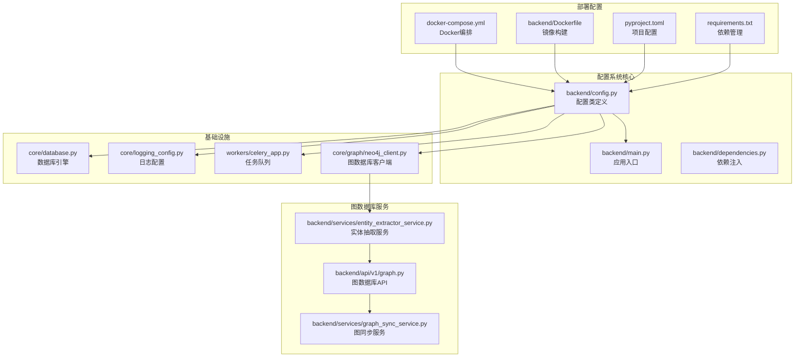
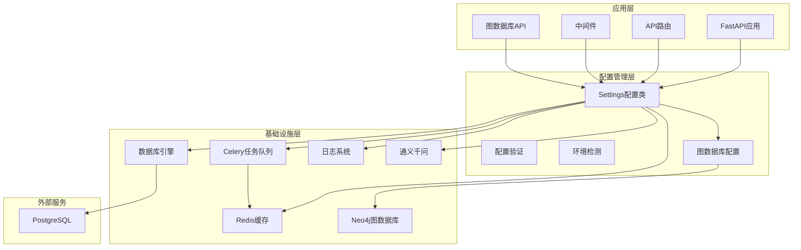
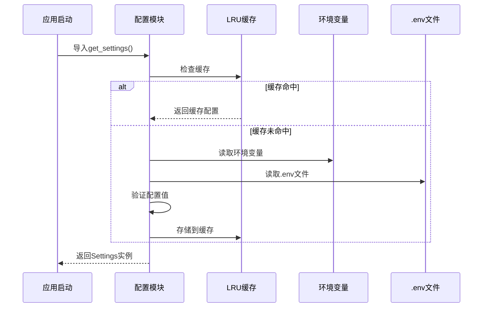
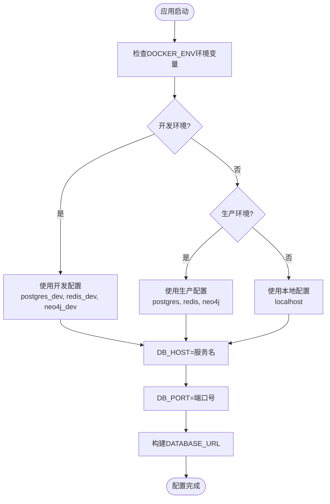
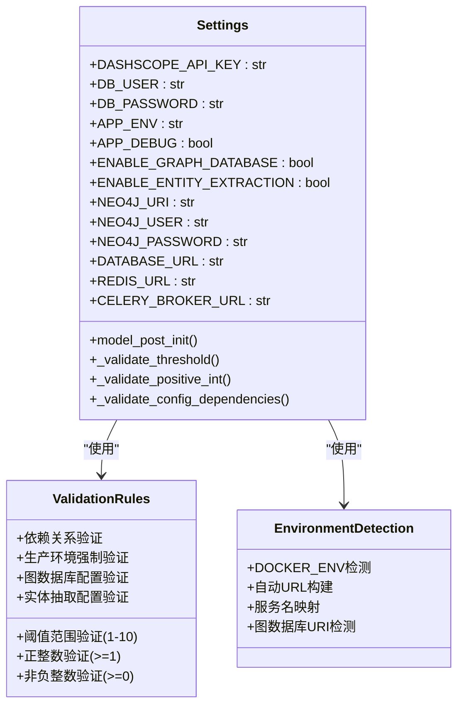
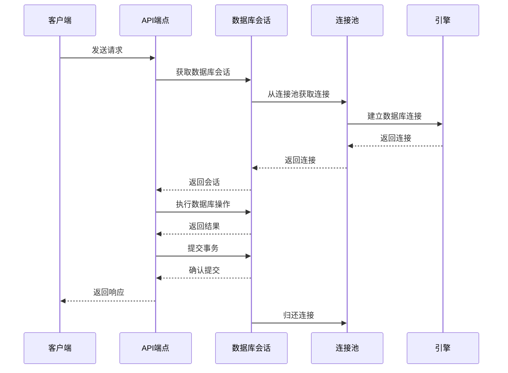

# 后端配置系统

<cite>
**本文档引用的文件**
- [backend/config.py](file://backend/config.py)
- [backend/main.py](file://backend/main.py)
- [backend/dependencies.py](file://backend/dependencies.py)
- [core/database.py](file://core/database.py)
- [alembic/env.py](file://alembic/env.py)
- [core/logging_config.py](file://core/logging_config.py)
- [docker-compose.yml](file://docker-compose.yml)
- [pyproject.toml](file://pyproject.toml)
- [requirements.txt](file://requirements.txt)
- [backend/Dockerfile](file://backend/Dockerfile)
- [workers/celery_app.py](file://workers/celery_app.py)
- [scripts/start_backend.sh](file://scripts/start_backend.sh)
- [backend/middleware/auth.py](file://backend/middleware/auth.py)
- [backend/api/v1/__init__.py](file://backend/api/v1/__init__.py)
- [backend/routes/agent_activities.py](file://backend/routes/agent_activities.py)
- [core/graph/neo4j_client.py](file://core/graph/neo4j_client.py)
- [backend/services/entity_extractor_service.py](file://backend/services/entity_extractor_service.py)
- [backend/api/v1/graph.py](file://backend/api/v1/graph.py)
</cite>

## 更新摘要
**变更内容**
- 新增图数据库配置章节，涵盖Neo4j连接和实体抽取功能
- 更新配置验证系统，添加图数据库相关验证规则
- 新增图数据库功能开关和环境检测机制
- 更新依赖关系分析，包含Neo4j驱动依赖

## 目录
1. [简介](#简介)
2. [项目结构](#项目结构)
3. [核心组件](#核心组件)
4. [架构概览](#架构概览)
5. [详细组件分析](#详细组件分析)
6. [图数据库配置](#图数据库配置)
7. [依赖关系分析](#依赖关系分析)
8. [性能考虑](#性能考虑)
9. [故障排除指南](#故障排除指南)
10. [结论](#结论)

## 简介

后端配置系统是小说生成系统的核心基础设施，负责管理系统的所有配置参数、环境检测、依赖管理和运行时配置。该系统采用现代化的配置管理模式，支持开发和生产环境的自动切换，提供完整的配置验证和错误处理机制。

系统基于Pydantic Settings构建，实现了配置的类型安全、自动验证和环境变量优先级管理。配置系统涵盖了数据库连接、Redis缓存、LLM集成、日志管理、CORS配置等多个方面，为整个小说生成系统提供了稳定可靠的基础设施支持。

**更新** 新增图数据库配置支持，包括Neo4j连接管理和实体抽取功能配置。

## 项目结构

后端配置系统主要分布在以下关键文件中：



**图表来源**
- [backend/config.py:1-514](file://backend/config.py#L1-L514)
- [backend/main.py:1-159](file://backend/main.py#L1-L159)
- [core/database.py:1-38](file://core/database.py#L1-L38)
- [core/graph/neo4j_client.py:1-550](file://core/graph/neo4j_client.py#L1-L550)
- [backend/services/entity_extractor_service.py:1-579](file://backend/services/entity_extractor_service.py#L1-L579)
- [backend/api/v1/graph.py:1-765](file://backend/api/v1/graph.py#L1-L765)

**章节来源**
- [backend/config.py:1-514](file://backend/config.py#L1-L514)
- [backend/main.py:1-159](file://backend/main.py#L1-L159)
- [core/database.py:1-38](file://core/database.py#L1-L38)

## 核心组件

### 配置类 Settings

Settings类是整个配置系统的核心，继承自Pydantic的BaseSettings，提供了完整的配置管理功能：

**主要特性：**
- **环境检测**：自动检测Docker环境并调整配置
- **配置验证**：运行时验证配置值的有效性
- **动态属性**：根据环境变量动态生成连接URL
- **类型安全**：所有配置项都有明确的数据类型定义

**配置分类：**
- **LLM配置**：DashScope API密钥和模型设置
- **数据库配置**：PostgreSQL连接参数和URL构建
- **缓存配置**：Redis和Celery连接设置
- **应用配置**：环境、调试模式、主机端口
- **审查配置**：质量阈值和迭代控制参数
- **图数据库配置**：Neo4j连接和实体抽取设置

**更新** 新增图数据库配置分类，包含功能开关、连接参数、实体抽取配置和查询缓存配置。

**章节来源**
- [backend/config.py:48-514](file://backend/config.py#L48-L514)

### 数据库引擎配置

数据库配置采用异步SQLAlchemy引擎，支持动态URL构建和连接池管理：

**关键特性：**
- **异步连接**：使用asyncpg驱动支持异步数据库操作
- **连接池**：配置连接池大小和溢出参数
- **SSL禁用**：针对asyncpg的SSL配置
- **自动回滚**：异常时自动事务回滚

**章节来源**
- [core/database.py:13-38](file://core/database.py#L13-L38)

### 日志系统配置

统一的日志管理系统，支持按大小轮转和过期清理：

**功能特性：**
- **目录管理**：自动创建日志目录并设置权限
- **轮转机制**：按文件大小轮转日志文件
- **过期清理**：自动删除超过保留期限的日志
- **级别控制**：根据调试模式调整日志级别
- **第三方库过滤**：减少SQLAlchemy等库的日志噪音

**章节来源**
- [core/logging_config.py:112-216](file://core/logging_config.py#L112-L216)

## 架构概览

后端配置系统采用分层架构设计，各组件职责清晰：



**图表来源**
- [backend/main.py:62-159](file://backend/main.py#L62-L159)
- [backend/config.py:48-514](file://backend/config.py#L48-L514)
- [core/database.py:13-38](file://core/database.py#L13-L38)

## 详细组件分析

### 配置加载流程

配置系统采用延迟加载和缓存机制，确保配置的一致性和性能：



**图表来源**
- [backend/config.py:508-514](file://backend/config.py#L508-L514)

### 环境检测机制

系统能够自动检测运行环境并调整配置参数：



**图表来源**
- [backend/config.py:116-139](file://backend/config.py#L116-L139)

**章节来源**
- [backend/config.py:116-139](file://backend/config.py#L116-L139)

### 配置验证系统

配置验证系统确保所有配置参数的有效性和一致性：



**更新** 新增图数据库配置验证规则，包括生产环境Neo4j密码强制验证和连接池配置验证。

**图表来源**
- [backend/config.py:437-466](file://backend/config.py#L437-L466)

**章节来源**
- [backend/config.py:437-466](file://backend/config.py#L437-L466)

### 数据库连接管理

数据库连接采用异步模式，支持连接池和自动事务管理：



**图表来源**
- [core/database.py:28-38](file://core/database.py#L28-L38)

**章节来源**
- [core/database.py:28-38](file://core/database.py#L28-L38)

## 图数据库配置

### Neo4j连接配置

系统支持灵活的Neo4j连接配置，包括开发、生产环境的自动检测：

**核心配置项：**
- **ENABLE_GRAPH_DATABASE**: 主开关，控制图数据库功能启用/禁用
- **NEO4J_URI**: 自定义Neo4j连接URI
- **NEO4J_USER**: 数据库用户名
- **NEO4J_PASSWORD**: 数据库密码（生产环境强制要求）
- **NEO4J_DATABASE**: 目标数据库名称
- **NEO4J_MAX_CONNECTION_POOL_SIZE**: 连接池大小
- **NEO4J_CONNECTION_TIMEOUT**: 连接超时时间

**环境检测机制：**
- **开发环境**: 自动使用 `bolt://neo4j_dev:7687`
- **生产环境**: 自动使用 `bolt://neo4j:7687`
- **本地开发**: 支持自定义URI或使用 `bolt://localhost:7688`

**章节来源**
- [backend/config.py:315-340](file://backend/config.py#L315-L340)

### 实体抽取配置

系统提供强大的实体抽取功能，支持从章节内容中自动识别各种实体：

**实体类型支持：**
- **角色实体**: 角色名称、角色类型、性别、状态变化
- **地点实体**: 地点名称、地点类型、描述信息
- **事件实体**: 事件名称、事件类型、参与者、重要程度
- **伏笔实体**: 伏笔内容、类型、重要程度、相关角色
- **关系实体**: 角色关系类型、关系强度、变化类型

**配置参数：**
- **ENABLE_ENTITY_EXTRACTION**: 实体抽取功能开关
- **ENTITY_EXTRACTION_MODEL**: LLM模型选择
- **ENTITY_EXTRACTION_CONFIDENCE_THRESHOLD**: 置信度阈值
- **ENTITY_EXTRACTION_MAX_CONTENT_LENGTH**: 内容长度限制

**章节来源**
- [backend/config.py:318-346](file://backend/config.py#L318-L346)

### 图查询缓存配置

为了提升查询性能，系统提供图查询缓存机制：

**缓存配置：**
- **GRAPH_QUERY_CACHE_TTL**: 缓存过期时间（秒）
- **GRAPH_QUERY_CACHE_MAX_SIZE**: 最大缓存条目数

**应用场景：**
- 角色关系网络查询
- 伏笔状态检查
- 实体一致性验证

**章节来源**
- [backend/config.py:348-350](file://backend/config.py#L348-L350)

### Agent图查询增强

系统支持将图数据库查询结果注入到Agent的prompt中，提供上下文增强：

**增强配置：**
- **ENABLE_GRAPH_CONTEXT_INJECTION**: 上下文注入开关
- **GRAPH_CONTEXT_MAX_CHARACTERS**: 最大查询角色数
- **GRAPH_CONTEXT_MAX_FORESHADOWINGS**: 最大伏笔提醒数

**注入内容：**
- 角色关系网络
- 待回收伏笔
- 一致性冲突警告

**章节来源**
- [backend/config.py:352-357](file://backend/config.py#L352-L357)

## 依赖关系分析

配置系统与各个组件的依赖关系如下：

```mermaid
graph TB
subgraph "核心依赖"
Pydantic[pydantic>=2.0.0]
Settings[pydantic-settings>=2.0.0]
FastAPI[fastapi>=0.115.0]
SQLAlchemy[sqlalchemy[asyncio]>=2.0.0]
end
subgraph "数据库依赖"
AsyncPG[asyncpg>=0.30.0]
Alembic[alembic>=1.14.0]
Psycopg2[psycopg2-binary>=2.9]
Neo4j[neo4j>=5.15.0]
end
subgraph "缓存依赖"
Redis[redis>=5.0.0]
Celery[celery[redis]>=5.4.0]
end
subgraph "AI依赖"
DashScope[dashscope>=1.20.0]
CrewAI[crewai>=0.100.0]
end
subgraph "开发工具"
DotEnv[python-dotenv>=1.0.0]
Ruff[ruff>=0.8.0]
PyTest[pytest>=8.0.0]
end
Config[配置系统] --> Pydantic
Config --> Settings
Config --> FastAPI
Config --> SQLAlchemy
Config --> AsyncPG
Config --> Alembic
Config --> Psycopg2
Config --> Redis
Config --> Celery
Config --> DashScope
Config --> CrewAI
Config --> DotEnv
Config --> Ruff
Config --> PyTest
Config --> Neo4j
```

**更新** 新增Neo4j依赖，版本要求为^5.15.0。

**图表来源**
- [pyproject.toml:8-46](file://pyproject.toml#L8-L46)
- [requirements.txt:1-28](file://requirements.txt#L1-L28)

**章节来源**
- [pyproject.toml:8-46](file://pyproject.toml#L8-L46)
- [requirements.txt:1-28](file://requirements.txt#L1-L28)

## 性能考虑

配置系统在性能方面的优化措施：

### 缓存策略
- **LRU缓存**：使用functools.lru_cache缓存Settings实例
- **配置复用**：避免重复解析和验证配置
- **内存效率**：缓存大小限制，防止内存泄漏

### 连接池优化
- **异步连接**：使用asyncpg驱动支持高并发
- **连接复用**：连接池复用数据库连接
- **自动回收**：超时连接自动回收

### 配置加载优化
- **延迟加载**：仅在需要时加载配置
- **环境检测**：快速判断运行环境
- **最小化IO**：减少文件系统访问

**更新** 新增图数据库连接池优化，支持Neo4j连接池配置和连接超时控制。

### 图数据库性能优化
- **连接池管理**：Neo4j连接池大小可配置
- **查询缓存**：图查询结果缓存机制
- **异步执行**：图数据库操作异步化
- **批量处理**：实体抽取和同步支持批量操作

## 故障排除指南

### 常见配置问题

**1. 数据库连接失败**
- 检查DOCKER_ENV环境变量设置
- 验证数据库服务是否启动
- 确认网络连接和防火墙设置

**2. API密钥认证失败**
- 确认DASHSCOPE_API_KEY环境变量设置
- 检查API密钥格式和有效期
- 验证APP_ENV环境变量设置

**3. Redis连接问题**
- 检查Redis服务状态
- 验证Redis_URL配置
- 确认网络连通性

**4. 日志文件写入失败**
- 检查日志目录权限
- 验证磁盘空间
- 确认文件系统权限

**5. 图数据库连接失败**
- 检查ENABLE_GRAPH_DATABASE开关状态
- 验证Neo4j服务状态和端口
- 确认生产环境Neo4j密码配置
- 检查网络连通性和防火墙设置

**6. 实体抽取功能异常**
- 确认ENABLE_ENTITY_EXTRACTION开关开启
- 验证DashScope API密钥配置
- 检查LLM模型可用性
- 确认内容长度限制设置合理

**章节来源**
- [backend/dependencies.py:25-66](file://backend/dependencies.py#L25-L66)
- [core/logging_config.py:53-96](file://core/logging_config.py#L53-L96)

### 配置验证错误

当配置验证失败时，系统会抛出详细的错误信息：

**常见验证错误：**
- 阈值超出范围(1-10)
- 迭代次数小于1
- 超时时间小于等于0
- 重试策略配置不合理
- **图数据库配置验证失败**：生产环境缺少Neo4j密码
- **实体抽取配置验证失败**：置信度阈值超出范围或内容长度过小

**解决方法：**
- 检查配置文件中的数值设置
- 验证配置参数的业务逻辑
- 参考配置注释中的建议值
- 确保生产环境配置完整性和安全性

**章节来源**
- [backend/config.py:437-466](file://backend/config.py#L437-L466)

## 结论

后端配置系统通过精心设计的架构和完善的验证机制，为小说生成系统提供了稳定可靠的基础设施。系统的主要优势包括：

1. **类型安全**：所有配置参数都有明确的数据类型定义
2. **环境适配**：自动检测和适配不同运行环境
3. **配置验证**：运行时验证确保配置的有效性
4. **性能优化**：缓存和连接池提升系统性能
5. **易于维护**：清晰的配置结构和详细的文档

**更新** 新增的图数据库配置系统进一步增强了系统的智能化能力，支持实体抽取、关系分析和智能查询等功能，为AI驱动的小说创作提供了更强大的技术支持。

该配置系统为整个小说生成系统奠定了坚实的基础，支持从开发到生产的完整部署流程，为AI驱动的小说创作提供了可靠的技术支撑。图数据库功能的加入使得系统具备了更强的知识管理和智能推理能力，能够为用户提供更丰富的小说创作辅助功能。