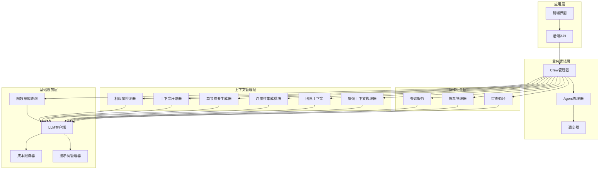
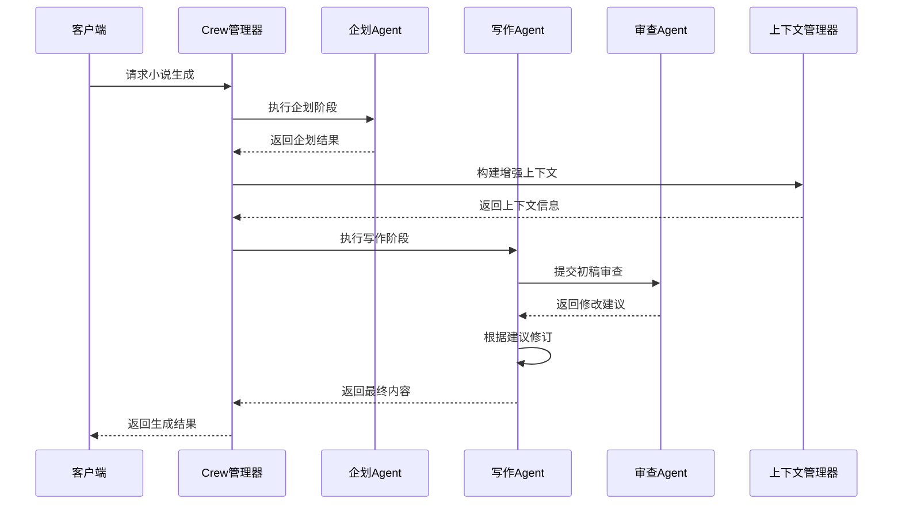
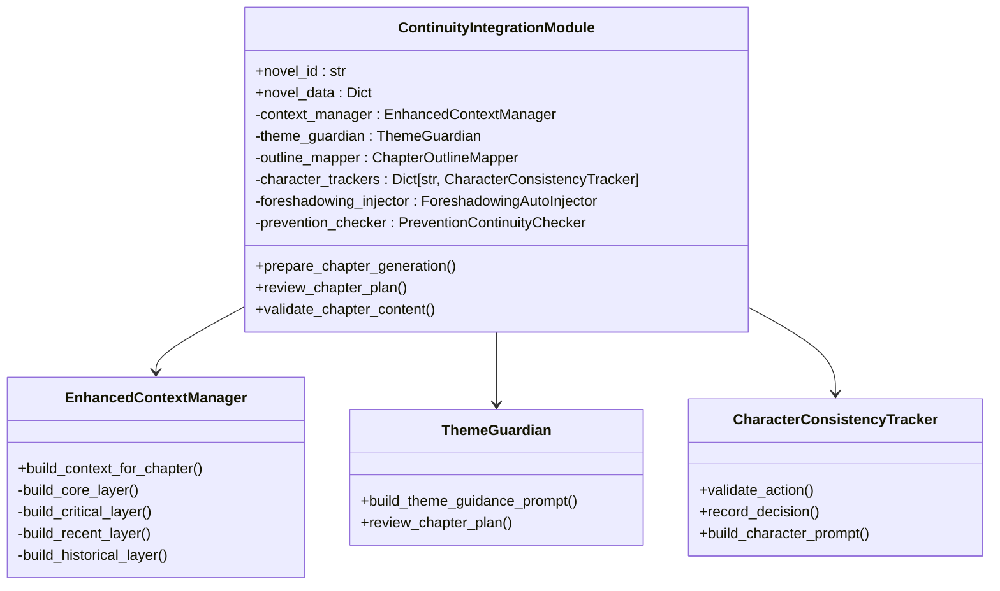
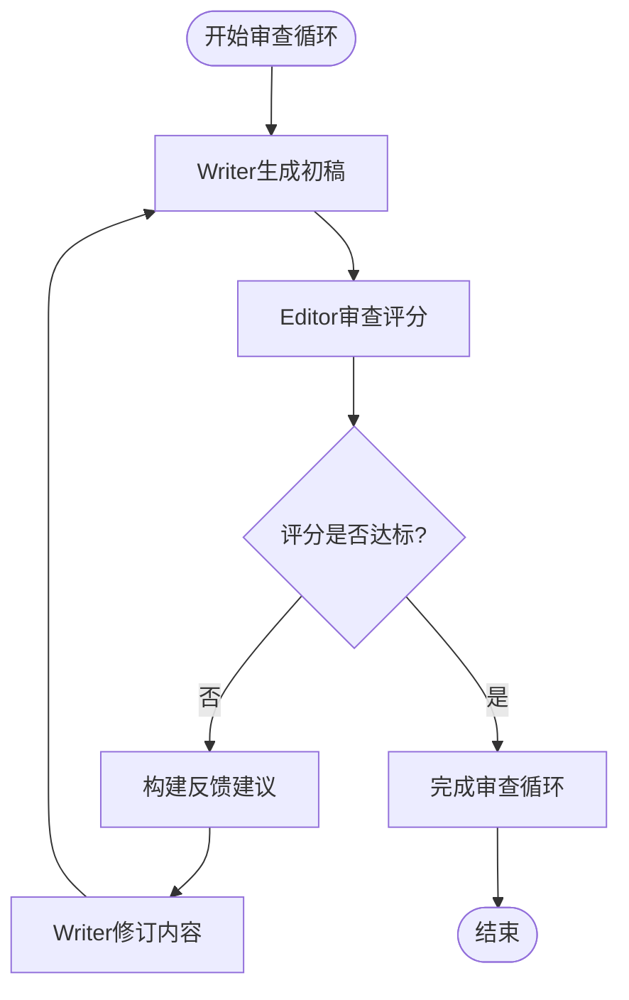
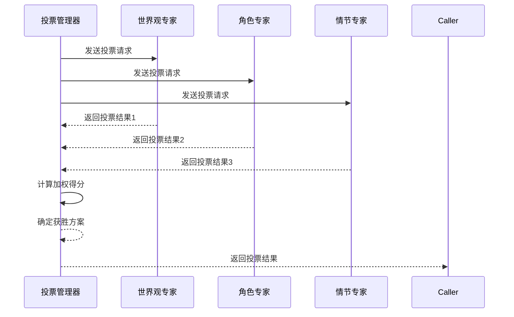
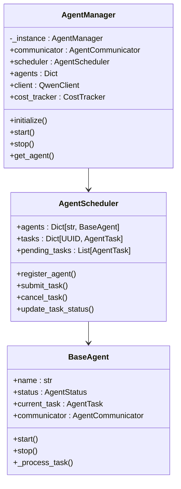
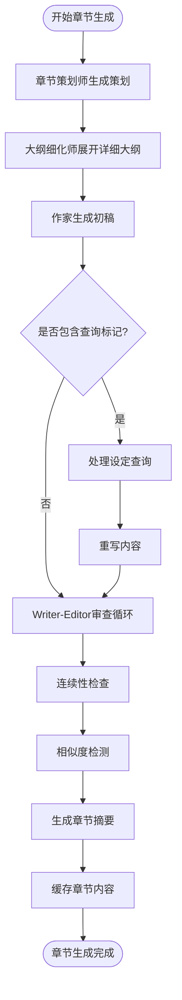
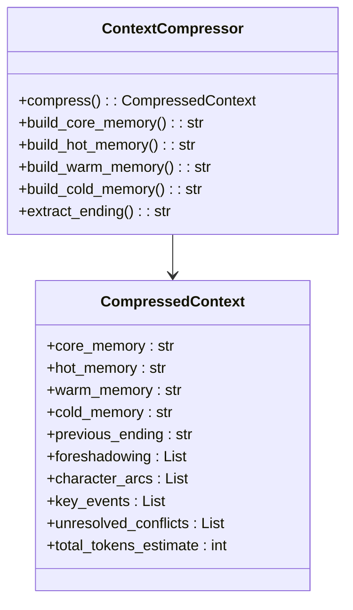
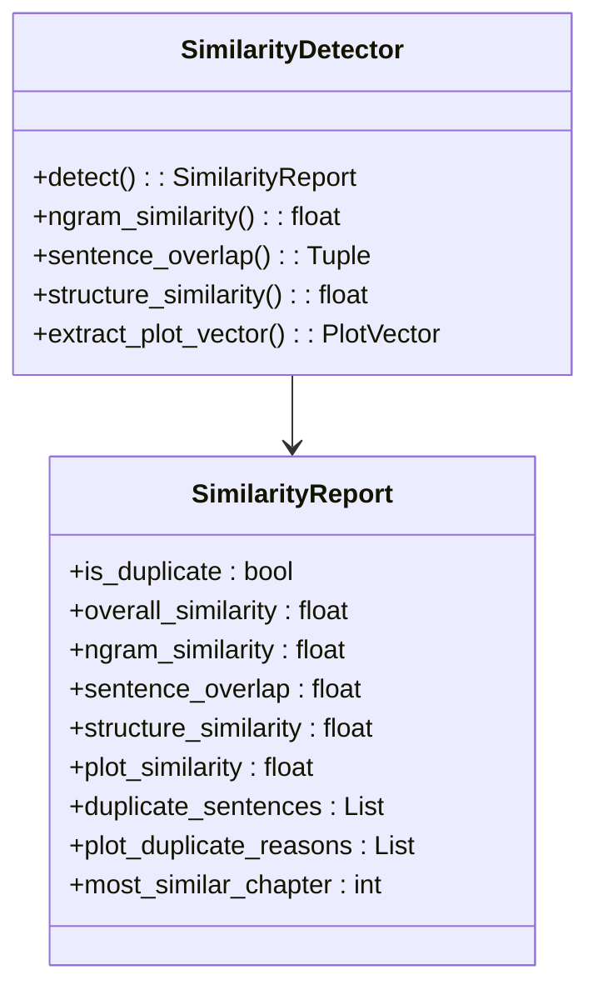
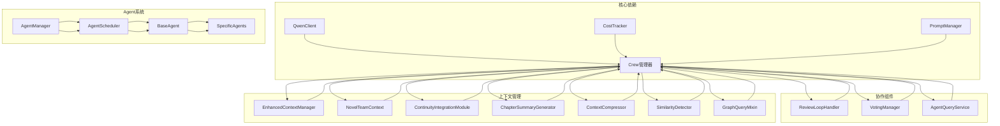

# 增强的Crew管理器

<cite>
**本文档引用的文件**
- [crew_manager.py](file://agents/crew_manager.py)
- [crew_manager_enhanced_example.py](file://agents/crew_manager_enhanced_example.py)
- [enhanced_context_manager.py](file://agents/enhanced_context_manager.py)
- [team_context.py](file://agents/team_context.py)
- [continuity_integration_module.py](file://agents/continuity_integration_module.py)
- [continuity_inference.py](file://agents/continuity_inference.py)
- [continuity_integration.py](file://agents/continuity_integration.py)
- [continuity_models.py](file://agents/continuity_models.py)
- [review_loop.py](file://agents/review_loop.py)
- [voting_manager.py](file://agents/voting_manager.py)
- [agent_manager.py](file://agents/agent_manager.py)
- [agent_scheduler.py](file://agents/agent_scheduler.py)
- [agent_communicator.py](file://agents/agent_communicator.py)
- [specific_agents.py](file://agents/specific_agents.py)
- [chapter_summary_generator.py](file://agents/chapter_summary_generator.py)
- [context_compressor.py](file://agents/context_compressor.py)
- [similarity_detector.py](file://agents/similarity_detector.py)
- [graph_query_mixin.py](file://agents/graph_query_mixin.py)
</cite>

## 更新摘要
**变更内容**
- 新增章节管理功能的详细分析
- 增强上下文压缩和相似度检测机制
- 图数据库上下文注入功能
- 章节摘要生成和缓存系统
- 连贯性保障的章节级实现

## 目录
1. [简介](#简介)
2. [项目结构](#项目结构)
3. [核心组件](#核心组件)
4. [架构概览](#架构概览)
5. [详细组件分析](#详细组件分析)
6. [章节管理增强功能](#章节管理增强功能)
7. [依赖关系分析](#依赖关系分析)
8. [性能考虑](#性能考虑)
9. [故障排除指南](#故障排除指南)
10. [结论](#结论)

## 简介

增强的Crew管理器是一个基于小说生成系统的智能协作框架，专门设计用于协调多个AI代理（Agents）完成复杂的小说创作任务。该系统采用创新的"增强连贯性保障"理念，通过多层次的上下文管理和智能审查机制，确保生成内容的质量和一致性。

系统的核心特色包括：
- **多层级上下文管理**：采用四层记忆架构，确保关键信息不会丢失
- **智能审查反馈循环**：Writer-Editor质量驱动的迭代优化
- **投票共识机制**：多Agent视角对关键决策进行投票
- **连贯性保障系统**：全面的主题一致性、角色一致性和情节连贯性检查
- **图数据库集成**：支持角色关系网络和一致性冲突检测
- **章节级管理**：完整的章节策划、生成、审查和优化流程
- **相似度检测**：防止内容重复和情节套路化

## 项目结构

该项目采用模块化的架构设计，主要分为以下几个核心层次：

**图表来源**
- [crew_manager.py:39-170](file://agents/crew_manager.py#L39-L170)
- [agent_manager.py:21-75](file://agents/agent_manager.py#L21-L75)

**章节来源**
- [crew_manager.py:1-100](file://agents/crew_manager.py#L1-L100)
- [agent_manager.py:1-50](file://agents/agent_manager.py#L1-L50)

## 核心组件

### Crew管理器（NovelCrewManager）

Crew管理器是整个系统的核心协调器，负责管理小说生成的完整生命周期。它集成了多种协作机制，包括审查反馈循环、投票共识和请求-应答协商。

**主要功能特性：**
- **多Agent协调**：协调主题分析师、世界观架构师、角色设计师、情节架构师等专业Agent
- **智能审查循环**：实现Writer-Editor质量驱动的迭代优化
- **投票共识机制**：对关键决策进行多视角投票
- **查询服务集成**：支持写作过程中的设定查询
- **连贯性检查**：内置连续性审查和修复循环
- **章节管理**：完整的章节策划、生成、审查和优化流程
- **上下文压缩**：智能的四层记忆架构管理
- **相似度检测**：防止内容重复和情节套路化

**章节来源**
- [crew_manager.py:39-170](file://agents/crew_manager.py#L39-L170)

### 增强上下文管理器

增强上下文管理器采用四层记忆架构，确保关键信息在长时间的小说创作过程中不会丢失：

1. **核心层（始终携带）**：主题、核心冲突、主角终极目标
2. **关键层（动态保留）**：伏笔、未解决冲突、角色重大决策
3. **近期层（最近3章）**：详细摘要 + 结尾原文
4. **历史层（更早章节）**：卷级摘要 + 关键事件索引

**章节来源**
- [enhanced_context_manager.py:20-194](file://agents/enhanced_context_manager.py#L20-L194)

### 团队上下文（NovelTeamContext）

团队上下文实现了Agent之间的信息共享和状态追踪，借鉴了AgentMesh的设计理念：

- **Agent输出历史追踪**：记录所有Agent的输出和交互
- **角色状态管理**：实时追踪主要角色的状态变化
- **时间线追踪**：维护故事的时间线和关键事件
- **伏笔系统集成**：与连贯性保障系统无缝对接
- **团队规则管理**：为Agent决策提供指导原则

**章节来源**
- [team_context.py:173-242](file://agents/team_context.py#L173-L242)

## 架构概览

系统采用分层架构设计，确保各组件职责清晰、耦合度低：

**图表来源**
- [crew_manager.py:487-786](file://agents/crew_manager.py#L487-L786)
- [crew_manager.py:792-1340](file://agents/crew_manager.py#L792-L1340)

## 详细组件分析

### 连贯性保障集成模块

连贯性保障集成模块是系统的核心创新之一，将所有连贯性保障组件集成到统一的接口中：

**图表来源**
- [continuity_integration_module.py:94-143](file://agents/continuity_integration_module.py#L94-L143)
- [enhanced_context_manager.py:201-285](file://agents/enhanced_context_manager.py#L201-L285)

**章节来源**
- [continuity_integration_module.py:94-373](file://agents/continuity_integration_module.py#L94-L373)

### 审查反馈循环

审查反馈循环实现了Writer-Editor的质量驱动迭代机制：

**图表来源**
- [review_loop.py:146-226](file://agents/review_loop.py#L146-L226)

**章节来源**
- [review_loop.py:146-798](file://agents/review_loop.py#L146-L798)

### 投票共识机制

投票共识机制支持多个Agent视角对关键决策进行投票，通过加权置信度计算获胜方案：

**图表来源**
- [voting_manager.py:86-141](file://agents/voting_manager.py#L86-L141)

**章节来源**
- [voting_manager.py:74-282](file://agents/voting_manager.py#L74-L282)

### Agent管理系统

Agent管理系统提供了完整的Agent生命周期管理：

**图表来源**
- [agent_manager.py:21-75](file://agents/agent_manager.py#L21-L75)
- [agent_scheduler.py:247-351](file://agents/agent_scheduler.py#L247-L351)

**章节来源**
- [agent_manager.py:21-227](file://agents/agent_manager.py#L21-L227)
- [agent_scheduler.py:247-542](file://agents/agent_scheduler.py#L247-L542)

## 章节管理增强功能

### 章节策划与生成流程

增强的Crew管理器引入了完整的章节管理功能，实现了从策划到生成的全流程自动化：

**图表来源**
- [crew_manager.py:800-1354](file://agents/crew_manager.py#L800-L1354)

### 上下文压缩与管理

系统实现了智能的四层上下文压缩机制，确保长篇小说的上下文管理效率：

**图表来源**
- [context_compressor.py:112-205](file://agents/context_compressor.py#L112-L205)

**章节来源**
- [context_compressor.py:112-674](file://agents/context_compressor.py#L112-L674)

### 章节摘要生成系统

章节摘要生成器提供了高质量的结构化摘要生成功能：

- **关键事件提取**：自动识别章节中的重要事件
- **角色变化追踪**：记录角色的状态变化和发展轨迹
- **情节推进分析**：分析章节对整体剧情的推进作用
- **伏笔追踪**：识别和管理章节中的伏笔线索
- **情感基调分析**：提取章节的情感色彩和氛围

**章节来源**
- [chapter_summary_generator.py:15-224](file://agents/chapter_summary_generator.py#L15-L224)

### 相似度检测与防重复机制

系统实现了多层次的相似度检测机制，防止内容重复和情节套路化：

**图表来源**
- [similarity_detector.py:77-206](file://agents/similarity_detector.py#L77-L206)

**章节来源**
- [similarity_detector.py:77-570](file://agents/similarity_detector.py#L77-L570)

### 图数据库上下文注入

系统集成了图数据库查询能力，为写作过程提供智能的上下文支持：

- **角色关系网络**：查询角色之间的关系和影响力
- **一致性冲突检测**：自动检测潜在的逻辑冲突
- **伏笔追踪**：管理并追踪未回收的伏笔线索
- **事件时间线**：维护完整的故事事件时间线

**章节来源**
- [graph_query_mixin.py:26-498](file://agents/graph_query_mixin.py#L26-L498)

## 依赖关系分析

系统采用了松耦合的设计，各组件之间的依赖关系清晰明确：

**图表来源**
- [crew_manager.py:14-36](file://agents/crew_manager.py#L14-L36)
- [agent_manager.py:5-18](file://agents/agent_manager.py#L5-L18)

**章节来源**
- [crew_manager.py:1-50](file://agents/crew_manager.py#L1-L50)
- [agent_manager.py:1-30](file://agents/agent_manager.py#L1-L30)

## 性能考虑

系统在设计时充分考虑了性能优化：

### 上下文管理优化
- **分层缓存策略**：不同层级采用不同的缓存策略，平衡内存使用和访问速度
- **智能压缩算法**：使用ContextCompressor减少上下文大小
- **延迟加载机制**：只在需要时加载历史信息

### 审查循环优化
- **动态迭代控制**：根据内容质量和问题复杂度动态调整迭代次数
- **并行处理**：支持多个Agent并行投票和审查
- **成本控制**：通过CostTracker监控和优化API调用成本

### 连贯性检查优化
- **增量验证**：只对新增内容进行连贯性检查
- **智能阈值**：根据章节类型和复杂度调整检查严格度
- **快速失败**：及时识别和处理严重问题

### 章节管理优化
- **批量处理**：支持多章节并行生成和审查
- **智能缓存**：章节摘要和内容的智能缓存机制
- **相似度检测优化**：使用多级阈值减少不必要的重处理

## 故障排除指南

### 常见问题及解决方案

**JSON解析失败**
- 检查LLM响应格式，使用增强的JSON提取策略
- 实施重试机制和错误恢复
- 记录详细的错误日志便于调试

**上下文丢失问题**
- 验证EnhancedContextManager的缓存机制
- 检查分层上下文的构建逻辑
- 确认上下文在Agent间的正确传递

**审查循环卡住**
- 检查Writer和Editor的提示词配置
- 验证质量阈值设置是否合理
- 监控迭代次数和收敛情况

**投票结果异常**
- 验证投票者的角色配置
- 检查置信度权重计算
- 确认模糊匹配算法的准确性

**章节生成质量不佳**
- 调整审查循环的参数设置
- 优化提示词模板
- 检查连贯性保障组件的配置

**相似度检测误报**
- 调整相似度检测阈值
- 检查检测算法的配置参数
- 验证章节内容的多样性

**图数据库查询失败**
- 检查图数据库连接状态
- 验证查询权限和配置
- 确认小说ID的有效性

**章节摘要生成失败**
- 检查LLM响应的完整性
- 验证摘要生成器的配置
- 确认章节内容的可读性

**章节来源**
- [crew_manager.py:436-482](file://agents/crew_manager.py#L436-L482)
- [review_loop.py:488-491](file://agents/review_loop.py#L488-L491)

## 结论

增强的Crew管理器通过创新的架构设计和智能化的协作机制，为大规模小说生成提供了强大的技术支持。系统的主要优势包括：

1. **全面的连贯性保障**：从主题一致性到情节连贯性的全方位检查
2. **智能的协作机制**：多Agent协同工作，实现专业化分工
3. **高效的上下文管理**：四层记忆架构确保信息的完整性和可用性
4. **灵活的成本控制**：通过CostTracker实现资源的最优利用
5. **强大的扩展性**：模块化设计支持功能的灵活扩展和定制
6. **完善的章节管理**：从策划到生成的全流程自动化
7. **智能的防重复机制**：多层次相似度检测防止内容套路化
8. **图数据库集成**：提供智能的上下文查询和冲突检测

该系统不仅能够生成高质量的小说内容，更重要的是建立了可持续的创作流程，为未来的AI辅助创作奠定了坚实的基础。通过持续的优化和改进，该系统有望成为AI小说创作领域的标杆解决方案。

**章节来源**
- [crew_manager.py:1869-1870](file://agents/crew_manager.py#L1869-L1870)
- [crew_manager.py:1871-1962](file://agents/crew_manager.py#L1871-L1962)