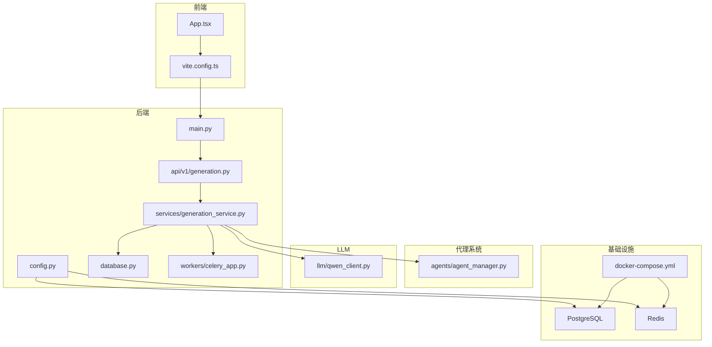
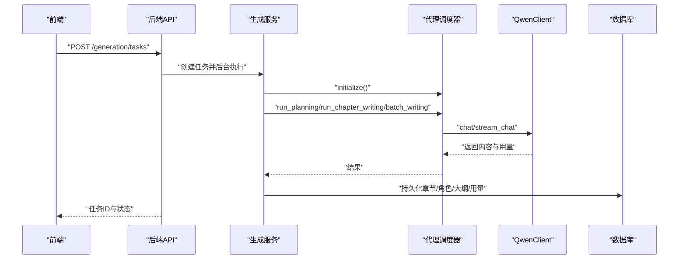
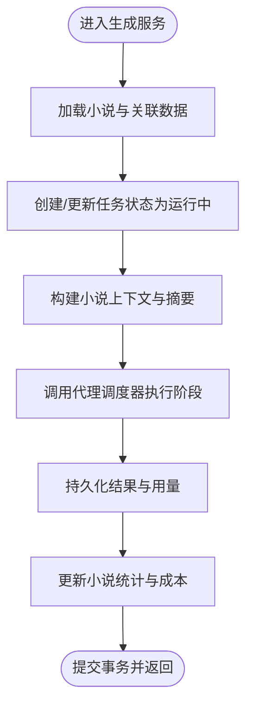
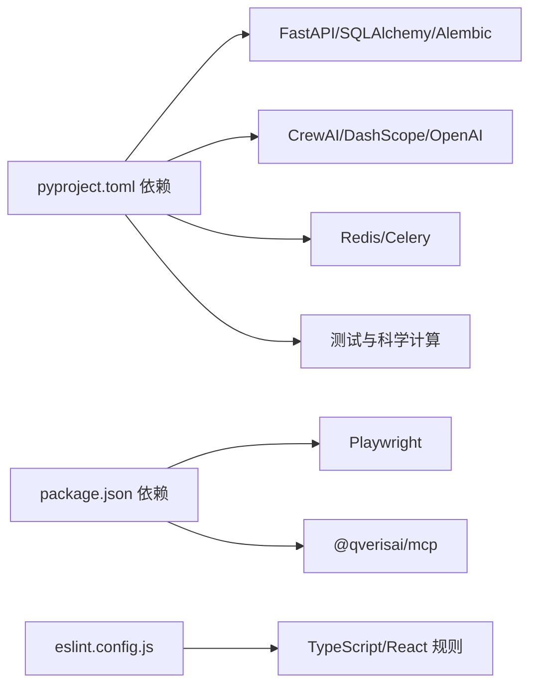

# 开发者指南

<cite>
**本文引用的文件**
- [README.md](file://README.md)
- [README.en.md](file://README.en.md)
- [pyproject.toml](file://pyproject.toml)
- [package.json](file://package.json)
- [playwright.config.ts](file://playwright.config.ts)
- [frontend/eslint.config.js](file://frontend/eslint.config.js)
- [backend/main.py](file://backend/main.py)
- [backend/config.py](file://backend/config.py)
- [core/database.py](file://core/database.py)
- [agents/agent_manager.py](file://agents/agent_manager.py)
- [workers/celery_app.py](file://workers/celery_app.py)
- [llm/qwen_client.py](file://llm/qwen_client.py)
- [backend/services/generation_service.py](file://backend/services/generation_service.py)
- [backend/api/v1/generation.py](file://backend/api/v1/generation.py)
- [frontend/src/App.tsx](file://frontend/src/App.tsx)
- [frontend/vite.config.ts](file://frontend/vite.config.ts)
- [scripts/start_agents.sh](file://scripts/start_agents.sh)
- [docker-compose.yml](file://docker-compose.yml)
</cite>

## 目录
1. [引言](#引言)
2. [项目结构](#项目结构)
3. [核心组件](#核心组件)
4. [架构总览](#架构总览)
5. [详细组件分析](#详细组件分析)
6. [依赖关系分析](#依赖关系分析)
7. [性能考虑](#性能考虑)
8. [故障排查指南](#故障排查指南)
9. [结论](#结论)
10. [附录](#附录)

## 引言
本指南面向所有层级的开发者，帮助您快速理解并高效参与“小说生成系统”的开发。内容涵盖代码规范与最佳实践（Python 与 TypeScript）、开发流程与工作流管理（Git 分支策略、代码评审、版本发布）、项目结构与模块化设计、调试与开发工具、扩展开发方法（新增功能模块、插件与第三方集成）、常见问题与性能优化、安全编码实践以及贡献指南。

## 项目结构
项目采用前后端分离与多子系统协同的模块化设计：
- 后端（Python/FastAPI）：提供 REST API、业务服务、数据库访问、任务队列与代理编排。
- 前端（TypeScript/React/Vite）：提供管理界面与交互，通过代理访问后端 API。
- 代理系统（Agents）：基于 CrewAI 的多智能体编排，负责创作流程的分层执行。
- LLM 客户端（LLM/QwenClient）：统一接入 DashScope/OpenAI 兼容接口，支持重试与流式输出。
- 数据库（SQLAlchemy Async）：异步 ORM 访问 PostgreSQL，配合 Alembic 迁移。
- 任务队列（Celery/Redis）：异步任务处理与状态追踪。
- 测试与校验：Pytest 单元测试、Playwright 端到端测试、Ruff/Lint 规则。

图表来源
- [backend/main.py](file://backend/main.py#L1-L53)
- [backend/api/v1/generation.py](file://backend/api/v1/generation.py#L1-L171)
- [backend/services/generation_service.py](file://backend/services/generation_service.py#L1-L689)
- [agents/agent_manager.py](file://agents/agent_manager.py#L1-L227)
- [llm/qwen_client.py](file://llm/qwen_client.py#L1-L232)
- [core/database.py](file://core/database.py#L1-L35)
- [workers/celery_app.py](file://workers/celery_app.py#L1-L26)
- [backend/config.py](file://backend/config.py#L1-L59)
- [docker-compose.yml](file://docker-compose.yml#L1-L25)

章节来源
- [backend/main.py](file://backend/main.py#L1-L53)
- [backend/config.py](file://backend/config.py#L1-L59)
- [core/database.py](file://core/database.py#L1-L35)
- [agents/agent_manager.py](file://agents/agent_manager.py#L1-L227)
- [workers/celery_app.py](file://workers/celery_app.py#L1-L26)
- [llm/qwen_client.py](file://llm/qwen_client.py#L1-L232)
- [backend/services/generation_service.py](file://backend/services/generation_service.py#L1-L689)
- [backend/api/v1/generation.py](file://backend/api/v1/generation.py#L1-L171)
- [frontend/src/App.tsx](file://frontend/src/App.tsx#L1-L16)
- [frontend/vite.config.ts](file://frontend/vite.config.ts#L1-L23)
- [docker-compose.yml](file://docker-compose.yml#L1-L25)

## 核心组件
- FastAPI 应用入口与中间件：CORS、路由挂载、健康检查。
- 配置中心：集中管理 LLM、数据库、Redis、Celery、应用与爬虫参数。
- 数据库层：异步引擎、会话工厂、依赖注入。
- 生成服务：编排代理系统与 LLM，执行企划、单章与批量写作，并持久化结果。
- 代理管理器：单例模式，负责代理生命周期与状态查询。
- LLM 客户端：统一 DashScope/OpenAI 兼容调用，支持重试与流式输出。
- 任务队列：Celery 任务配置与自动发现。
- 前端应用：React + Ant Design，Vite 代理后端 API。

章节来源
- [backend/main.py](file://backend/main.py#L1-L53)
- [backend/config.py](file://backend/config.py#L1-L59)
- [core/database.py](file://core/database.py#L1-L35)
- [backend/services/generation_service.py](file://backend/services/generation_service.py#L1-L689)
- [agents/agent_manager.py](file://agents/agent_manager.py#L1-L227)
- [llm/qwen_client.py](file://llm/qwen_client.py#L1-L232)
- [workers/celery_app.py](file://workers/celery_app.py#L1-L26)
- [frontend/src/App.tsx](file://frontend/src/App.tsx#L1-L16)
- [frontend/vite.config.ts](file://frontend/vite.config.ts#L1-L23)

## 架构总览
系统采用“前端渲染 + 后端 API + 代理编排 + LLM + 数据库 + 任务队列”的分层架构。前端通过 Vite 代理访问后端；后端通过服务层编排代理与 LLM，将结果写入数据库；异步任务通过 Celery 在 Redis 中排队执行；配置由 Pydantic Settings 统一读取环境变量。

图表来源
- [backend/api/v1/generation.py](file://backend/api/v1/generation.py#L23-L103)
- [backend/services/generation_service.py](file://backend/services/generation_service.py#L36-L205)
- [llm/qwen_client.py](file://llm/qwen_client.py#L46-L161)
- [core/database.py](file://core/database.py#L25-L35)

## 详细组件分析

### 后端入口与路由
- 应用初始化：设置日志、CORS、挂载 API 路由。
- 根与健康检查端点：对外暴露基础信息与健康状态。

章节来源
- [backend/main.py](file://backend/main.py#L1-L53)

### 配置与环境
- 设置项：LLM 凭证与模型、数据库连接、Redis/Celery、应用环境与调试开关、爬虫参数、加密密钥等。
- 动态构建数据库 URL 与同步 URL，便于迁移与同步操作。

章节来源
- [backend/config.py](file://backend/config.py#L1-L59)

### 数据库与依赖注入
- 异步引擎与会话工厂：连接池大小、溢出、回滚与关闭逻辑。
- 依赖注入：在请求生命周期内提供会话，保证事务一致性。

章节来源
- [core/database.py](file://core/database.py#L1-L35)

### 生成服务（核心编排）
- 企划阶段：加载小说，更新任务状态，调用代理调度器执行规划，持久化世界观、角色、大纲，记录 Token 用量与成本。
- 单章写作：构建小说上下文，拼接前序章节摘要，调用代理生成章节正文，持久化章节与统计信息。
- 批量写作：循环执行单章写作，汇总结果与错误，更新任务进度与状态。
- 内部方法：不创建任务记录的章节生成，供内部流程复用。

图表来源
- [backend/services/generation_service.py](file://backend/services/generation_service.py#L36-L205)
- [backend/services/generation_service.py](file://backend/services/generation_service.py#L206-L386)
- [backend/services/generation_service.py](file://backend/services/generation_service.py#L387-L563)

章节来源
- [backend/services/generation_service.py](file://backend/services/generation_service.py#L1-L689)

### API 层（生成任务）
- 创建任务：校验小说存在性与批量参数，创建任务记录，使用后台任务执行具体阶段。
- 列表与详情：支持按小说 ID 与状态过滤，分页查询任务。
- 取消任务：仅允许对未完成的任务进行取消。

章节来源
- [backend/api/v1/generation.py](file://backend/api/v1/generation.py#L1-L171)

### 代理管理器
- 单例模式：全局唯一实例，避免重复初始化。
- 初始化：创建通信器、调度器、LLM 客户端与成本跟踪器，注册市场分析、内容策划、写作、编辑、发布等代理。
- 生命周期：启动/停止，状态查询与代理检索。

章节来源
- [agents/agent_manager.py](file://agents/agent_manager.py#L1-L227)

### LLM 客户端（QwenClient）
- 模式切换：支持 DashScope 标准模式与 OpenAI 兼容模式（通过 base_url 判定）。
- 能力：同步/异步聊天、流式输出、指数退避重试、用量统计。
- 线程池：在异步环境中调用同步 SDK，避免阻塞事件循环。

章节来源
- [llm/qwen_client.py](file://llm/qwen_client.py#L1-L232)

### 任务队列（Celery）
- Broker/Backend：Redis。
- 配置：序列化、时区、UTC、任务超时、并发与预取策略、自动发现任务包。

章节来源
- [workers/celery_app.py](file://workers/celery_app.py#L1-L26)

### 前端应用与开发工具
- 应用入口：Ant Design 国际化、路由与错误边界。
- Vite：本地开发服务器端口、路径别名、后端 API 代理。
- ESLint：TypeScript/React Hooks/React Refresh 推荐规则。

章节来源
- [frontend/src/App.tsx](file://frontend/src/App.tsx#L1-L16)
- [frontend/vite.config.ts](file://frontend/vite.config.ts#L1-L23)
- [frontend/eslint.config.js](file://frontend/eslint.config.js#L1-L24)

### 测试与质量保障
- Playwright：跨浏览器端到端测试配置，HTML 报告与首次重试追踪。
- Pytest：标记分类（单元/网络/真实爬取/集成/慢），异步模式。
- Ruff：Python Lint 规则与行宽、目标版本。

章节来源
- [playwright.config.ts](file://playwright.config.ts#L1-L80)
- [pyproject.toml](file://pyproject.toml#L54-L63)
- [pyproject.toml](file://pyproject.toml#L47-L52)

### 启动与部署
- Agent 启动脚本：Poetry 环境下运行 Python 脚本，输出 PID 与日志文件。
- Docker Compose：PostgreSQL 与 Redis 容器化服务与数据卷。

章节来源
- [scripts/start_agents.sh](file://scripts/start_agents.sh#L1-L35)
- [docker-compose.yml](file://docker-compose.yml#L1-L25)

## 依赖关系分析
- 后端依赖：FastAPI、SQLAlchemy Async、Alembic、Pydantic/Settings、Redis/Celery、CrewAI、DashScope、OpenAI、HTTPX、加密库、Playwright、Scikit-learn 等。
- 前端依赖：Playwright（测试）、@qverisai/mcp（可选）等。
- 工具链：Ruff（Python Lint）、ESLint（TypeScript/React）、Vite（前端打包与代理）。

图表来源
- [pyproject.toml](file://pyproject.toml#L8-L36)
- [package.json](file://package.json#L1-L12)
- [frontend/eslint.config.js](file://frontend/eslint.config.js#L1-L24)

章节来源
- [pyproject.toml](file://pyproject.toml#L1-L64)
- [package.json](file://package.json#L1-L12)
- [frontend/eslint.config.js](file://frontend/eslint.config.js#L1-L24)

## 性能考虑
- 异步数据库：使用 SQLAlchemy Async 与连接池，减少阻塞。
- 任务队列：Celery 配置合理并发与预取，长任务避免预取，设置软/硬超时。
- LLM 调用：指数退避重试、流式输出降低等待、用量统计与成本控制。
- 前端代理：Vite 代理后端，避免跨域与额外握手开销。
- 缓存与会话：Redis 作为 Broker/Backend，注意键空间与过期策略。

## 故障排查指南
- 启动与日志
  - Agent 启动脚本输出 PID 与日志文件位置，可通过尾随日志查看运行状态。
  - Docker Compose 启动数据库与缓存服务，确认端口映射与数据卷。
- 数据库连接
  - 检查 DATABASE_URL 与同步 URL 构造是否正确，连接池参数是否合理。
- LLM 调用
  - 确认 API Key、Base URL 与模型配置；OpenAI 兼容模式需正确设置 base_url。
- 任务执行
  - 检查 Celery Broker/Backend 地址、时区与并发配置；关注任务超时与重试策略。
- 前端联调
  - 确认 Vite 代理 /api 到后端地址，Ant Design 国际化与路由配置。

章节来源
- [scripts/start_agents.sh](file://scripts/start_agents.sh#L1-L35)
- [docker-compose.yml](file://docker-compose.yml#L1-L25)
- [backend/config.py](file://backend/config.py#L18-L33)
- [workers/celery_app.py](file://workers/celery_app.py#L12-L23)
- [frontend/vite.config.ts](file://frontend/vite.config.ts#L15-L21)

## 结论
本指南提供了从项目结构、核心组件到开发流程、调试与扩展的全栈参考。建议在开发中遵循统一的代码规范、严格的测试与质量门禁、清晰的分支与发布流程，以确保系统的稳定性与可维护性。

## 附录

### 代码规范与最佳实践

- Python（后端）
  - 风格与 Lint：使用 Ruff，行宽 100，目标版本 3.12，启用 E/F/I/W 规则集。
  - 命名约定：模块与类使用 PascalCase，函数与变量使用 snake_case；常量大写。
  - 注释规范：公共接口与复杂逻辑添加文档字符串；私有实现简要说明。
  - 异常处理：明确捕获与转换异常，保留原始错误信息，必要时记录上下文。
  - 依赖注入：通过 FastAPI Depends 与 SQLAlchemy AsyncSession 管理会话生命周期。
  - 配置管理：使用 Pydantic Settings 读取 .env，区分开发/生产环境。

- TypeScript（前端）
  - ESLint：启用推荐规则与 React Hooks、React Refresh 插件。
  - 命名约定：组件首字母大写，hooks 使用 use 前缀，类型使用 PascalCase。
  - 注释规范：公共 API 与复杂逻辑添加 JSDoc；UI 组件属性与行为清晰注释。
  - 代理与路由：保持 /api 代理一致，避免硬编码后端地址。

- Git 分支与工作流
  - 分支策略：主干保护，特性分支以 feat/fix/docs/chore 前缀命名，合并前要求 CI 通过。
  - 提交信息：采用约定式提交（如 feat/fix/docs：简要描述），并在 PR 描述中说明变更动机与影响范围。
  - 代码评审：至少一名 reviewer，关注安全性、性能与可维护性。
  - 版本发布：语义化版本号，变更日志与发布说明同步更新。

- 测试与质量
  - 单元测试：Pytest 标记分类明确，覆盖关键路径与边界条件。
  - 端到端测试：Playwright 跨浏览器验证，报告与追踪开启。
  - Lint 与格式：Ruff（Python）、ESLint（TypeScript）自动化检查。

- 安全编码实践
  - 密钥与敏感信息：通过环境变量注入，禁止硬编码；加密存储平台凭据。
  - 输入校验：API 层严格校验参数类型与范围；数据库层使用 ORM 防 SQL 注入。
  - CORS 与中间件：最小权限开放，仅允许受信源访问。
  - LLM 调用：限制提示长度与频率，避免泄露用户隐私；记录用量与成本。

- 扩展开发方法
  - 新增后端 API：在 backend/api 下新增模块，定义 Pydantic 模型与服务层方法，注册路由。
  - 新增服务：在 backend/services 下新增服务类，注入依赖与会话，编写单元测试。
  - 新增前端页面：在 frontend/src/pages 下新增页面组件，注册路由与菜单。
  - 插件与第三方集成：通过配置中心集中管理外部服务参数，统一异常处理与日志记录。

- 常见问题与解决方案
  - 数据库连接失败：检查 DATABASE_URL、端口映射与容器状态。
  - LLM 调用超时：调整重试次数与退避策略，检查网络与限流。
  - Celery 任务不执行：确认 Broker/Backend 地址、worker 启动与 autodiscover。
  - 前端无法访问后端：确认 Vite 代理配置与 CORS 设置。

- 调试与开发工具
  - IDE：VSCode（Python 使用 Ruff/Lint 插件，TypeScript 使用 ESLint 插件）。
  - 断点调试：后端使用 uvicorn --reload，前端使用 Vite Dev Server。
  - 性能分析：后端使用 cProfile/Py-Spy，前端使用 React DevTools 与性能面板。
  - 日志：统一使用 core/logging_config，按模块与级别输出。

- 贡献指南
  - Fork 仓库，创建特性分支，提交 PR，等待评审与 CI 通过。
  - 变更需附带测试与文档更新，遵循本指南的规范与流程。

章节来源
- [pyproject.toml](file://pyproject.toml#L47-L63)
- [frontend/eslint.config.js](file://frontend/eslint.config.js#L1-L24)
- [README.md](file://README.md#L24-L30)
- [README.en.md](file://README.en.md#L21-L27)