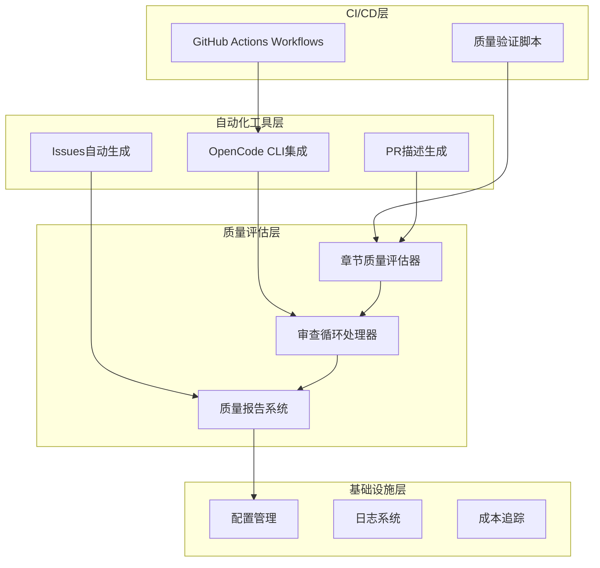
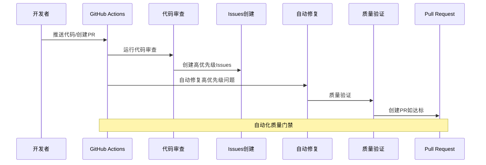
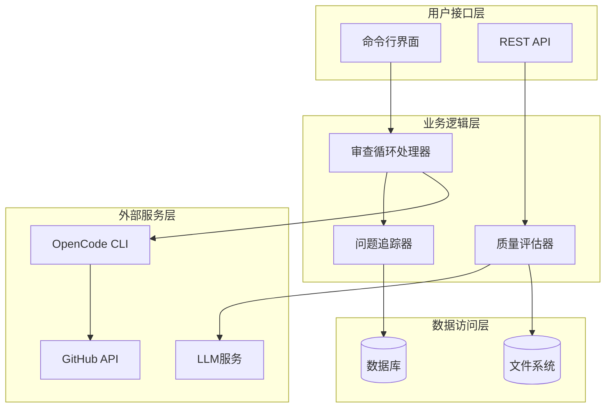
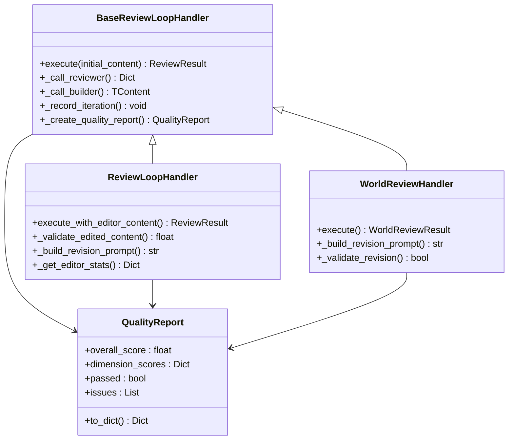
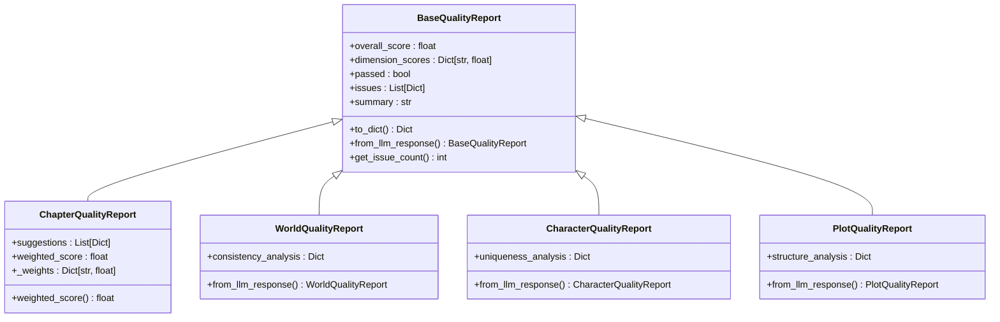
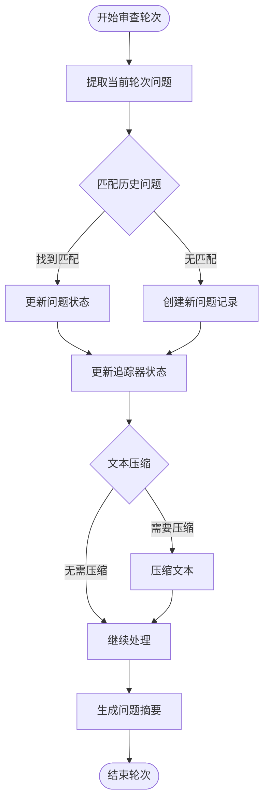
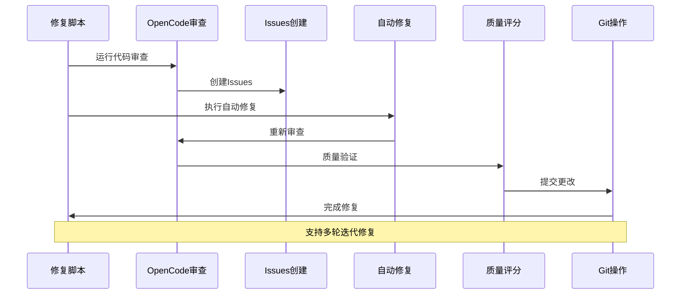
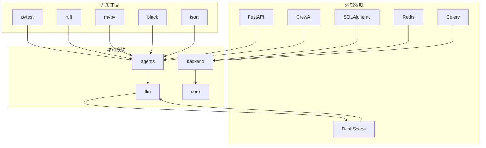

# 代码质量自动化

<cite>
**本文档引用的文件**
- [code-quality.yml](file://.github/workflows/code-quality.yml)
- [CODE_QUALITY_AUTOMATION.md](file://docs/CODE_QUALITY_AUTOMATION.md)
- [auto-review-fix.sh](file://scripts/auto-review-fix.sh)
- [quality-score.sh](file://scripts/quality-score.sh)
- [create-issues-from-review.sh](file://scripts/create-issues-from-review.sh)
- [quality_evaluator.py](file://agents/quality_evaluator.py)
- [quality_report.py](file://agents/base/quality_report.py)
- [review_loop_base.py](file://agents/base/review_loop_base.py)
- [review_result.py](file://agents/base/review_result.py)
- [json_extractor.py](file://agents/base/json_extractor.py)
- [review_loop.py](file://agents/review_loop.py)
- [world_review_loop.py](file://agents/world_review_loop.py)
- [pyproject.toml](file://pyproject.toml)
- [mypy.ini](file://mypy.ini)
</cite>

## 目录
1. [简介](#简介)
2. [项目结构](#项目结构)
3. [核心组件](#核心组件)
4. [架构概览](#架构概览)
5. [详细组件分析](#详细组件分析)
6. [依赖关系分析](#依赖关系分析)
7. [性能考虑](#性能考虑)
8. [故障排除指南](#故障排除指南)
9. [结论](#结论)

## 简介

代码质量自动化系统是一个全面的自动化质量保证解决方案，旨在通过机器学习驱动的审查流程和CI/CD集成来持续提升代码质量。该系统结合了GitHub Actions自动化工作流、OpenCode CLI工具链和智能质量评估算法，实现了从代码审查到自动修复再到质量验证的完整闭环。

系统的核心价值在于：
- **自动化审查**：通过LLM驱动的质量评估，自动识别代码质量问题
- **智能修复**：基于审查结果的自动化修复建议和实施
- **持续监控**：实时质量评分和趋势分析
- **团队协作**：自动生成Issues并跟踪修复进度

## 项目结构

项目采用模块化架构，主要分为以下几个核心部分：

**图表来源**
- [code-quality.yml:1-322](file://.github/workflows/code-quality.yml#L1-L322)
- [pyproject.toml:1-106](file://pyproject.toml#L1-L106)

**章节来源**
- [code-quality.yml:1-322](file://.github/workflows/code-quality.yml#L1-L322)
- [pyproject.toml:1-106](file://pyproject.toml#L1-L106)

## 核心组件

### GitHub Actions自动化工作流

系统的核心是高度集成的GitHub Actions工作流，实现了完整的代码质量自动化流程：

**图表来源**
- [code-quality.yml:16-322](file://.github/workflows/code-quality.yml#L16-L322)

### 质量评估引擎

系统集成了多维度的质量评估机制：

| 评估维度 | 重要性权重 | 评估标准 |
|---------|-----------|----------|
| 代码审查 | 50% | LLM驱动的多维度评分 |
| Pylint分析 | 20% | 静态代码分析 |
| 测试覆盖率 | 30% | 单元测试覆盖度 |
| 代码格式 | 10% | Black格式化检查 |

**章节来源**
- [quality-score.sh:1-79](file://scripts/quality-score.sh#L1-L79)
- [code-quality.yml:256-269](file://.github/workflows/code-quality.yml#L256-L269)

## 架构概览

系统采用分层架构设计，确保了良好的可维护性和扩展性：

**图表来源**
- [review_loop_base.py:639-800](file://agents/base/review_loop_base.py#L639-L800)
- [quality_evaluator.py:83-216](file://agents/quality_evaluator.py#L83-L216)

## 详细组件分析

### 审查循环处理器

审查循环处理器是系统的核心组件，实现了模板方法模式来封装各种审查场景的一致性逻辑：

**图表来源**
- [review_loop_base.py:639-800](file://agents/base/review_loop_base.py#L639-L800)
- [review_loop.py:81-373](file://agents/review_loop.py#L81-L373)
- [world_review_loop.py:166-365](file://agents/world_review_loop.py#L166-L365)

**章节来源**
- [review_loop_base.py:1-800](file://agents/base/review_loop_base.py#L1-L800)
- [review_loop.py:1-733](file://agents/review_loop.py#L1-L733)
- [world_review_loop.py:1-365](file://agents/world_review_loop.py#L1-L365)

### 质量报告系统

质量报告系统提供了统一的数据结构来表示各种类型的审查结果：

**图表来源**
- [quality_report.py:44-340](file://agents/base/quality_report.py#L44-L340)

**章节来源**
- [quality_report.py:1-340](file://agents/base/quality_report.py#L1-L340)

### 问题追踪系统

系统内置了智能问题追踪机制，能够跨轮次追踪问题的生命周期：

**图表来源**
- [review_loop_base.py:177-520](file://agents/base/review_loop_base.py#L177-L520)

**章节来源**
- [review_loop_base.py:177-520](file://agents/base/review_loop_base.py#L177-L520)

### 自动化修复流程

系统提供了完整的自动化修复能力，支持本地和远程执行：

**图表来源**
- [auto-review-fix.sh:18-74](file://scripts/auto-review-fix.sh#L18-L74)

**章节来源**
- [auto-review-fix.sh:1-133](file://scripts/auto-review-fix.sh#L1-L133)

## 依赖关系分析

系统的依赖关系体现了清晰的分层架构：

**图表来源**
- [pyproject.toml:8-42](file://pyproject.toml#L8-L42)

**章节来源**
- [pyproject.toml:1-106](file://pyproject.toml#L1-L106)

## 性能考虑

系统在设计时充分考虑了性能优化：

### 质量评估性能
- **并发处理**：支持异步质量评估，提高处理效率
- **缓存机制**：利用Redis缓存常用数据，减少重复计算
- **成本控制**：通过CostTracker监控LLM使用成本

### 审查循环优化
- **早期终止**：当评分改善小于阈值时提前终止迭代
- **智能重试**：对失败的审查请求进行指数退避重试
- **内存管理**：限制历史上下文大小，防止内存溢出

### CI/CD性能
- **并行执行**：GitHub Actions步骤并行执行
- **增量检查**：只对变更的文件进行质量检查
- **缓存策略**：利用GitHub Actions缓存加速依赖安装

## 故障排除指南

### 常见问题及解决方案

| 问题类型 | 症状 | 解决方案 |
|---------|------|---------|
| GitHub Actions失败 | 工作流无法启动 | 检查工作流语法和Secret配置 |
| OpenCode CLI认证失败 | 审查无法执行 | 重新认证gh CLI和OpenCode CLI |
| LLM响应解析错误 | 质量评估失败 | 检查LLM API密钥和网络连接 |
| 代码格式化冲突 | Black报错 | 运行`black --check backend/`检查格式问题 |
| 测试覆盖率不足 | 质量评分偏低 | 增加单元测试覆盖关键路径 |

### 调试技巧

1. **启用详细日志**：在本地执行时使用`-v`参数获取详细输出
2. **检查环境变量**：确保所有必需的环境变量已正确设置
3. **验证依赖版本**：确认Python包版本与requirements文件一致
4. **网络连通性**：测试LLM服务和GitHub API的连通性

**章节来源**
- [CODE_QUALITY_AUTOMATION.md:156-243](file://docs/CODE_QUALITY_AUTOMATION.md#L156-L243)

## 结论

代码质量自动化系统通过智能化的审查流程、完善的自动化修复机制和持续的质量监控，为大型项目的代码质量管理提供了全面的解决方案。系统的主要优势包括：

1. **全面性**：覆盖代码审查、静态分析、测试验证等多个维度
2. **自动化**：从发现问题到修复验证的全流程自动化
3. **可扩展**：模块化设计支持新类型的审查场景
4. **可观测性**：提供详细的质量报告和趋势分析
5. **团队协作**：通过Issues和PR自动化提升团队效率

该系统特别适合需要持续交付和高质量输出的大型项目，能够显著提升代码质量和开发效率，同时减少人工审查的工作负担。