# 大纲增强演示脚本

<cite>
**本文档引用的文件**
- [demo_outline_enhancement.py](file://scripts/demo_outline_enhancement.py)
- [outline_dynamic_updater.py](file://agents/outline_dynamic_updater.py)
- [character_auto_detector.py](file://backend/services/character_auto_detector.py)
- [generation_service.py](file://backend/services/generation_service.py)
- [config.py](file://backend/config.py)
- [prompt_manager.py](file://llm/prompt_manager.py)
- [crew_manager_enhanced_example.py](file://agents/crew_manager_enhanced_example.py)
- [enhanced_context_manager.py](file://agents/enhanced_context_manager.py)
- [outline_refiner.py](file://agents/outline_refiner.py)
- [outline_validator.py](file://agents/outline_validator.py)
- [outline_iteration_controller.py](file://agents/outline_iteration_controller.py)
- [outline_quality_evaluator.py](file://agents/outline_quality_evaluator.py)
- [continuity_integration_module.py](file://agents/continuity_integration_module.py)
- [continuity_integration.py](file://agents/continuity_integration.py)
- [team_context.py](file://agents/team_context.py)
- [theme_guardian.py](file://agents/theme_guardian.py)
- [chapter_outline_mapper.py](file://agents/chapter_outline_mapper.py)
- [character_consistency_tracker.py](file://agents/character_consistency_tracker.py)
- [foreshadowing_auto_injector.py](file://agents/foreshadowing_auto_injector.py)
- [prevention_continuity_checker.py](file://agents/prevention_continuity_checker.py)
- [plot_outline.py](file://core/models/plot_outline.py)
- [outline_service.py](file://backend/services/outline_service.py)
- [outlines.py](file://backend/api/v1/outlines.py)
- [outline.py](file://backend/schemas/outline.py)
- [2a4218cba9df_add_detailed_outline_to_chapters.py](file://alembic/versions_archived/2a4218cba9df_add_detailed_outline_to_chapters.py)
- [add_outline_enhancements_to_chapters.py](file://alembic/versions_archived/add_outline_enhancements_to_chapters.py)
- [fb6eed83562e_add_outline_dynamic_update_fields.py](file://alembic/versions_archived/fb6eed83562e_add_outline_dynamic_update_fields.py)
</cite>

## 更新摘要
**变更内容**
- 新增动态大纲更新系统，实现基于实际写作内容的智能大纲调整
- 新增详细大纲JSONB字段支持章节级详细大纲存储
- 新增大纲任务跟踪和验证机制
- 新增版本控制系统，支持大纲版本历史管理
- 新增角色自动检测功能，能够从章节内容中自动识别并注册新角色
- 增强了系统的智能化程度，提高了创作效率和质量保障
- 完善了配置管理系统，支持灵活的功能开关和参数调节

## 目录
1. [简介](#简介)
2. [项目结构](#项目结构)
3. [核心组件](#核心组件)
4. [架构概览](#架构概览)
5. [详细组件分析](#详细组件分析)
6. [智能功能增强](#智能功能增强)
7. [数据库架构](#数据库架构)
8. [API接口](#api接口)
9. [依赖关系分析](#依赖关系分析)
10. [性能考虑](#性能考虑)
11. [故障排除指南](#故障排除指南)
12. [结论](#结论)

## 简介

本文档详细介绍小说系统的大纲增强演示脚本，这是一个集成了多个AI代理组件的完整工作流程演示。该系统通过多Agent协作机制，实现了小说大纲的智能完善、质量评估、连贯性保障等功能。

**更新** 系统现已集成三大智能化核心功能：动态大纲更新、详细大纲存储和版本控制管理，显著提升了系统的自适应能力和创作效率。

系统的核心特色包括：
- **多Agent协作架构**：通过专门的Agent处理不同类型的创作任务
- **智能大纲完善**：基于LLM技术的自动化大纲优化
- **质量评估体系**：全面的质量评分和改进建议生成
- **连贯性保障**：多层次的剧情连贯性检查机制
- **上下文管理**：智能的记忆和信息保留策略
- **主题一致性**：确保剧情符合核心主题要求
- **伏笔追踪**：自动管理和追踪伏笔的埋设和回收
- **预防式检查**：在生成前发现潜在问题
- **动态大纲更新**：根据实际写作内容自动调整后续大纲
- **详细大纲存储**：支持章节级详细大纲的JSONB存储
- **版本控制系统**：完整的版本历史管理和回滚机制
- **角色自动检测**：从章节内容中智能识别并注册新角色

## 项目结构

小说系统采用模块化设计，主要分为以下几个核心模块：

```mermaid
graph TB
subgraph "演示脚本层"
Demo[demo_outline_enhancement.py]
CrewDemo[crew_manager_enhanced_example.py]
end
subgraph "Agent管理层"
OutlineRefiner[OutlineRefiner]
OutlineValidator[OutlineValidator]
OutlineController[OutlineIterationController]
QualityEvaluator[OutlineQualityEvaluator]
DynamicUpdater[OutlineDynamicUpdater]
end
subgraph "智能增强层"
CharacterDetector[CharacterAutoDetector]
GenerationService[GenerationService]
Config[Settings]
PromptManager[PromptManager]
end
subgraph "连贯性保障层"
ContinuityModule[ContinuityIntegrationModule]
ThemeGuardian[ThemeGuardian]
ContextManager[EnhancedContextManager]
OutlineMapper[ChapterOutlineMapper]
CharacterTracker[CharacterConsistencyTracker]
ForeshadowingInjector[ForeshadowingAutoInjector]
PreventionChecker[PreventionContinuityChecker]
end
subgraph "团队协作层"
TeamContext[NovelTeamContext]
ContinuityIntegration[ContinuityIntegration]
end
subgraph "数据持久化层"
PlotOutline[PlotOutline模型]
OutlineService[OutlineService]
end
subgraph "API接口层"
OutlinesAPI[Outlines API]
end
Demo --> OutlineRefiner
Demo --> OutlineValidator
Demo --> OutlineController
Demo --> QualityEvaluator
Demo --> DynamicUpdater
Demo --> CharacterDetector
CrewDemo --> ContinuityModule
DynamicUpdater --> GenerationService
CharacterDetector --> GenerationService
GenerationService --> Config
GenerationService --> PromptManager
ContinuityModule --> ThemeGuardian
ContinuityModule --> ContextManager
ContinuityModule --> OutlineMapper
ContinuityModule --> CharacterTracker
ContinuityModule --> ForeshadowingInjector
ContinuityModule --> PreventionChecker
ContinuityModule --> TeamContext
ContinuityIntegration --> TeamContext
PlotOutline --> OutlineService
OutlineService --> OutlinesAPI
```

**图表来源**
- [demo_outline_enhancement.py:1-273](file://scripts/demo_outline_enhancement.py#L1-L273)
- [outline_dynamic_updater.py:1-745](file://agents/outline_dynamic_updater.py#L1-L745)
- [character_auto_detector.py:1-422](file://backend/services/character_auto_detector.py#L1-L422)
- [generation_service.py:790-1419](file://backend/services/generation_service.py#L790-L1419)
- [crew_manager_enhanced_example.py:1-424](file://agents/crew_manager_enhanced_example.py#L1-L424)
- [plot_outline.py:1-114](file://core/models/plot_outline.py#L1-L114)
- [outline_service.py:1-932](file://backend/services/outline_service.py#L1-L932)
- [outlines.py:1-871](file://backend/api/v1/outlines.py#L1-L871)

**章节来源**
- [demo_outline_enhancement.py:1-273](file://scripts/demo_outline_enhancement.py#L1-L273)
- [crew_manager_enhanced_example.py:1-424](file://agents/crew_manager_enhanced_example.py#L1-L424)

## 核心组件

### 大纲完善Agent系统

系统的核心是基于OutlineRefiner的大纲完善功能，它能够：

1. **细化完整大纲**：基于世界观设定生成包含主线、支线、卷大纲的完整结构
2. **生成详细主线剧情**：构建起承转合的详细主线框架
3. **设计卷级大纲**：为不同卷设计合适的张力循环和关键事件
4. **确保结局连贯性**：检查主线剧情和卷大纲的逻辑一致性

### 质量评估体系

OutlineQualityEvaluator提供了全面的质量评估维度：

- **结构完整性**：检查大纲结构的完整性和合理性
- **世界观一致性**：验证设定与剧情的契合度
- **角色连贯性**：评估角色发展和行为的一致性
- **张力节奏控制**：分析故事节奏和冲突层次
- **逻辑连贯性**：检查因果关系和时间线的合理性
- **创意新颖性**：评估设定和情节的独特性

### 连贯性保障系统

**更新** 连续性保障系统现在是一个完整的集成模块，将多个连贯性保障组件集成在一起：

#### 增强上下文管理器（EnhancedContextManager）

采用四层记忆架构来智能管理上下文信息：

1. **核心层**：始终携带的主题、核心冲突、主角终极目标
2. **关键层**：动态保留的伏笔、未解决冲突、角色重大决策
3. **近期层**：最近3章的详细摘要和结尾原文
4. **历史层**：更早章节的卷级摘要和关键事件索引

#### 主题守护者（ThemeGuardian）

确保剧情符合核心主题：

- **主题定义**：从小说数据中提取核心主题和主线冲突
- **一致性审查**：检查章节计划是否符合主题要求
- **评分系统**：从四个维度评估主题表达效果
- **改进建议**：提供具体的修正建议

#### 伏笔自动注入器（ForeshadowingAutoInjector）

管理和追踪伏笔的埋设和回收：

- **状态追踪**：跟踪每个伏笔的埋设、回收状态
- **紧急程度**：基于重要性和超期程度计算优先级
- **任务生成**：为每章生成具体的伏笔任务
- **自动注入**：将伏笔要求自动注入到创作流程

#### 预防式连贯性检查器（PreventionContinuityChecker）

在生成前发现潜在问题：

- **约束推断**：从上一章内容推断读者期待
- **冲突检测**：识别策划与上一章的潜在冲突
- **进度检查**：确保必要的剧情得到推进
- **自动修正**：提供修正建议并自动修正策划

### 团队协作上下文（NovelTeamContext）

实现了Agent之间的信息共享和状态追踪：

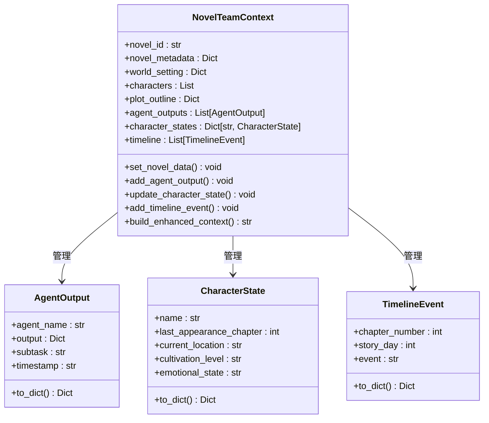

**图表来源**
- [team_context.py:162-591](file://agents/team_context.py#L162-L591)

**章节来源**
- [outline_refiner.py:1-705](file://agents/outline_refiner.py#L1-L705)
- [outline_quality_evaluator.py:1-440](file://agents/outline_quality_evaluator.py#L1-L440)
- [continuity_integration_module.py:1-483](file://agents/continuity_integration_module.py#L1-L483)
- [enhanced_context_manager.py:1-536](file://agents/enhanced_context_manager.py#L1-L536)
- [theme_guardian.py:1-625](file://agents/theme_guardian.py#L1-L625)
- [foreshadowing_auto_injector.py:1-635](file://agents/foreshadowing_auto_injector.py#L1-L635)
- [prevention_continuity_checker.py:1-715](file://agents/prevention_continuity_checker.py#L1-L715)

## 架构概览

**更新** 系统现在采用分层架构设计，从底层的数据模型到顶层的业务逻辑形成了完整的处理链路，新增了智能增强层和版本控制系统：

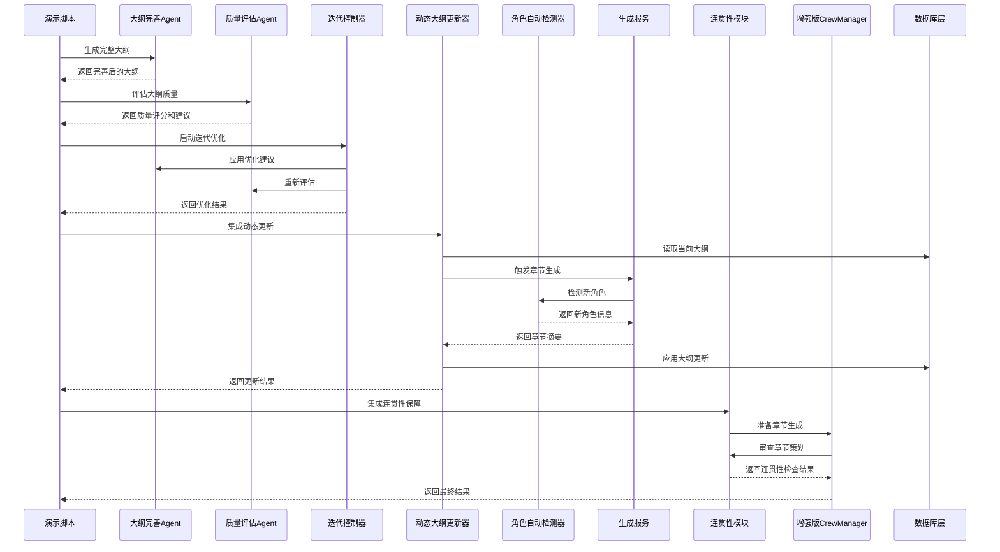

**图表来源**
- [demo_outline_enhancement.py:23-273](file://scripts/demo_outline_enhancement.py#L23-L273)
- [outline_dynamic_updater.py:82-195](file://agents/outline_dynamic_updater.py#L82-L195)
- [character_auto_detector.py:44-105](file://backend/services/character_auto_detector.py#L44-L105)
- [generation_service.py:790-1419](file://backend/services/generation_service.py#L790-L1419)
- [outline_iteration_controller.py:197-290](file://agents/outline_iteration_controller.py#L197-L290)
- [crew_manager_enhanced_example.py:44-124](file://agents/crew_manager_enhanced_example.py#L44-L124)

## 详细组件分析

### 大纲完善Agent (OutlineRefiner)

OutlineRefiner是系统的核心组件，负责将基础的设定转化为完整的小说大纲：

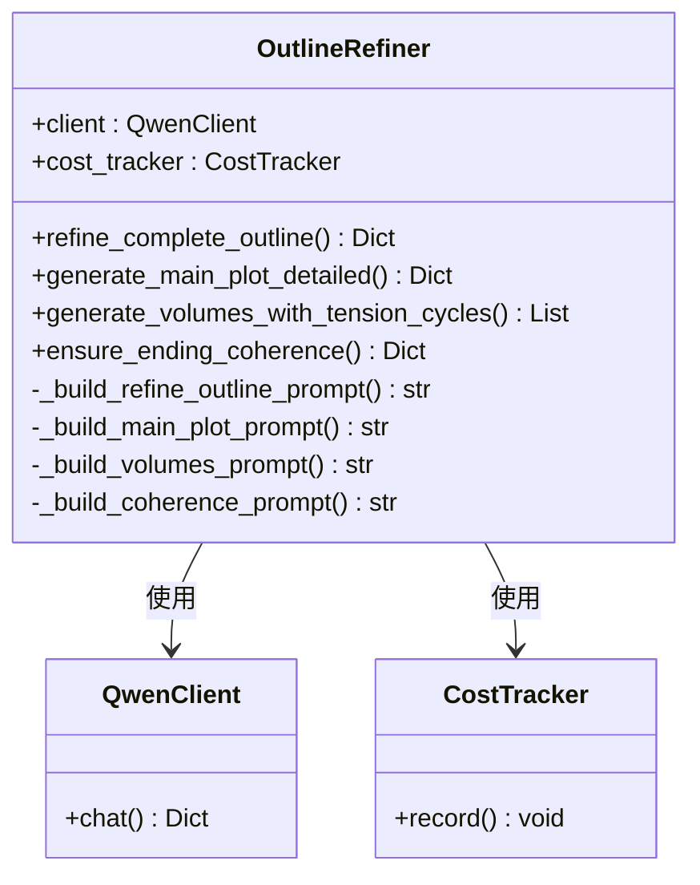

**图表来源**
- [outline_refiner.py:18-705](file://agents/outline_refiner.py#L18-L705)

OutlineRefiner的主要功能包括：

1. **完整大纲细化**：基于世界观设定生成包含所有必要元素的完整大纲
2. **主线剧情生成**：构建详细的起承转合结构
3. **卷级大纲设计**：为不同卷设计合适的张力循环
4. **结局连贯性检查**：确保故事逻辑的完整性

**章节来源**
- [outline_refiner.py:18-705](file://agents/outline_refiner.py#L18-L705)

### 增强上下文管理器 (EnhancedContextManager)

**更新** EnhancedContextManager采用了四层记忆架构来智能管理上下文信息：

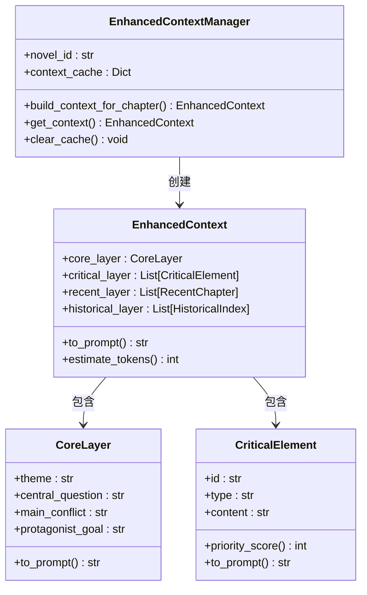

**图表来源**
- [enhanced_context_manager.py:196-536](file://agents/enhanced_context_manager.py#L196-L536)

四层记忆架构的设计原理：

1. **核心层**：始终携带的主题、核心冲突、主角终极目标
2. **关键层**：动态保留的伏笔、未解决冲突、角色重大决策
3. **近期层**：最近3章的详细摘要和结尾原文
4. **历史层**：更早章节的卷级摘要和关键事件索引

**章节来源**
- [enhanced_context_manager.py:1-536](file://agents/enhanced_context_manager.py#L1-L536)

### 连贯性保障集成模块

**更新** ContinuityIntegrationModule将所有连贯性保障组件集成到统一的接口中：


**图表来源**
- [continuity_integration_module.py:176-352](file://agents/continuity_integration_module.py#L176-L352)

**章节来源**
- [continuity_integration_module.py:74-483](file://agents/continuity_integration_module.py#L74-L483)

### 团队协作上下文 (NovelTeamContext)

NovelTeamContext实现了Agent之间的信息共享和状态追踪：


**图表来源**
- [team_context.py:162-591](file://agents/team_context.py#L162-L591)

**章节来源**
- [team_context.py:1-591](file://agents/team_context.py#L1-L591)

### 增强版CrewManager示例

**更新** 增强版CrewManager展示了如何将连贯性保障组件集成到现有的CrewManager中：

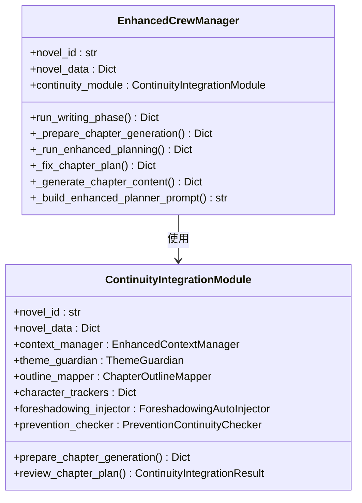

**图表来源**
- [crew_manager_enhanced_example.py:18-424](file://agents/crew_manager_enhanced_example.py#L18-L424)

## 智能功能增强

### 动态大纲更新系统

**新增** 动态大纲更新系统是本次更新的核心智能功能，能够根据实际写作内容自动调整后续大纲：

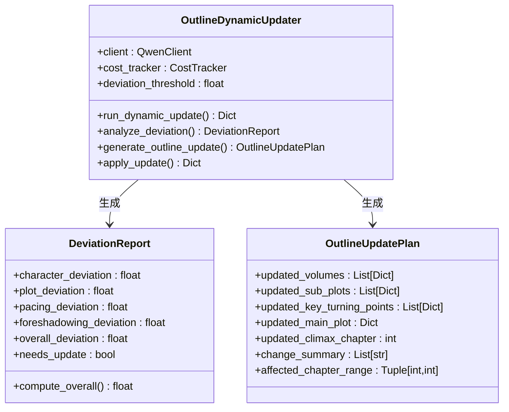

**图表来源**
- [outline_dynamic_updater.py:25-195](file://agents/outline_dynamic_updater.py#L25-L195)

动态大纲更新的核心流程：

1. **偏差分析**：分析最近N章内容与大纲的偏差，从角色、情节、节奏、伏笔四个维度评估
2. **阈值判断**：根据偏差综合分和推荐更新标志决定是否需要调整
3. **更新方案生成**：基于偏差分析结果生成后续章节的更新方案
4. **安全应用**：仅更新未写章节，保持已写章节不变

#### 偏差分析维度

- **角色偏差**：评估角色变化、新角色出现、角色关系变动等
- **情节偏差**：分析情节走向偏离、新情节线出现、事件发生与否等
- **节奏偏差**：检查张力循环推进、压抑/释放节奏偏离等
- **伏笔偏差**：追踪伏笔埋设/回收、意外新伏笔等

#### 更新策略

- **章节范围限制**：仅调整第(current_chapter+1)章及之后的内容
- **伏笔保持**：保持已埋设伏笔的回收计划，可调整回收时机
- **连贯性优先**：在保持故事整体连贯性的前提下灵活调整
- **渐进式调整**：避免大幅改动，采用渐进式的优化策略

**章节来源**
- [outline_dynamic_updater.py:62-745](file://agents/outline_dynamic_updater.py#L62-L745)

### 详细大纲存储系统

**新增** 详细大纲存储系统支持章节级详细大纲的JSONB存储：

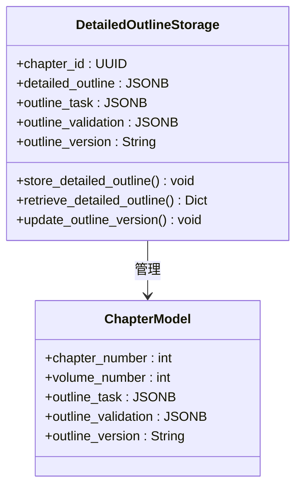

**图表来源**
- [2a4218cba9df_add_detailed_outline_to_chapters.py:22-27](file://alembic/versions_archived/2a4218cba9df_add_detailed_outline_to_chapters.py#L22-L27)
- [add_outline_enhancements_to_chapters.py:22-35](file://alembic/versions_archived/add_outline_enhancements_to_chapters.py#L22-L35)

详细大纲存储的特点：

1. **JSONB格式**：支持复杂的数据结构存储
2. **版本控制**：每个章节都有独立的版本号
3. **任务跟踪**：记录每个章节的大纲任务和验证结果
4. **增量更新**：支持章节级的增量更新和同步

**章节来源**
- [2a4218cba9df_add_detailed_outline_to_chapters.py:22-27](file://alembic/versions_archived/2a4218cba9df_add_detailed_outline_to_chapters.py#L22-L27)
- [add_outline_enhancements_to_chapters.py:22-35](file://alembic/versions_archived/add_outline_enhancements_to_chapters.py#L22-L35)

### 版本控制系统

**新增** 版本控制系统支持完整的大纲版本历史管理和回滚：

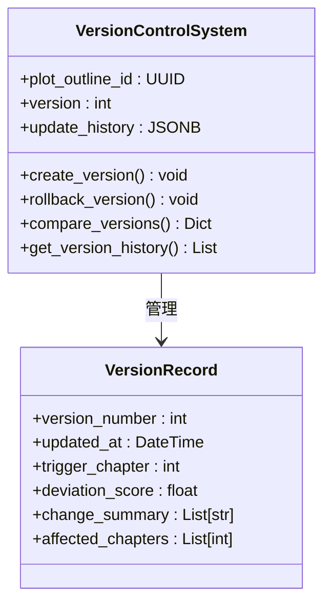

**图表来源**
- [fb6eed83562e_add_outline_dynamic_update_fields.py:21-36](file://alembic/versions_archived/fb6eed83562e_add_outline_dynamic_update_fields.py#L21-L36)
- [plot_outline.py:95-108](file://core/models/plot_outline.py#L95-L108)

版本控制的核心功能：

1. **版本号管理**：每次更新自动递增版本号
2. **历史记录**：完整记录每次更新的详细信息
3. **变更摘要**：自动生成更新摘要和影响范围
4. **回滚支持**：支持版本回滚和差异对比

**章节来源**
- [fb6eed83562e_add_outline_dynamic_update_fields.py:21-36](file://alembic/versions_archived/fb6eed83562e_add_outline_dynamic_update_fields.py#L21-L36)
- [plot_outline.py:95-108](file://core/models/plot_outline.py#L95-L108)

### 角色自动检测系统

**新增** 角色自动检测系统能够从章节内容中智能识别并注册新角色：

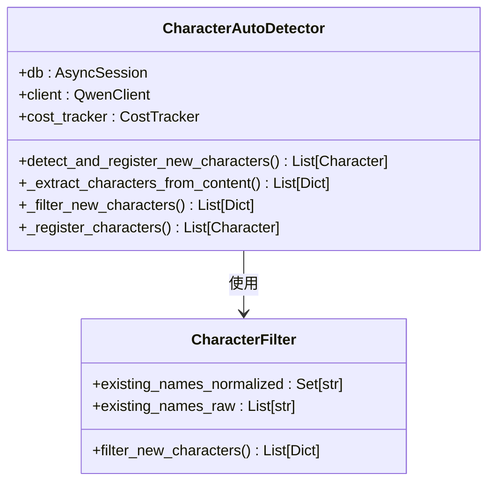

**图表来源**
- [character_auto_detector.py:24-105](file://backend/services/character_auto_detector.py#L24-L105)

角色检测的四层去重过滤机制：

1. **精确名字匹配**：标准化后进行精确匹配，避免重复
2. **子串包含检查**：处理"小明"与"李小明"等相似名字的情况
3. **别名交叉检查**：利用name_variants字段进行交叉验证
4. **置信度阈值过滤**：只有高于阈值的检测结果才会被注册

#### 检测流程

1. **内容提取**：调用LLM从章节内容中提取角色信息
2. **多层过滤**：通过四层去重机制确保只返回真正新角色
3. **批量注册**：将新角色批量注册到数据库并更新章节信息
4. **异常处理**：所有异常都会被捕获，确保不影响章节生成流程

**章节来源**
- [character_auto_detector.py:24-422](file://backend/services/character_auto_detector.py#L24-L422)

### 配置管理系统

**新增** 系统提供了灵活的配置管理，支持智能功能的开关和参数调节：

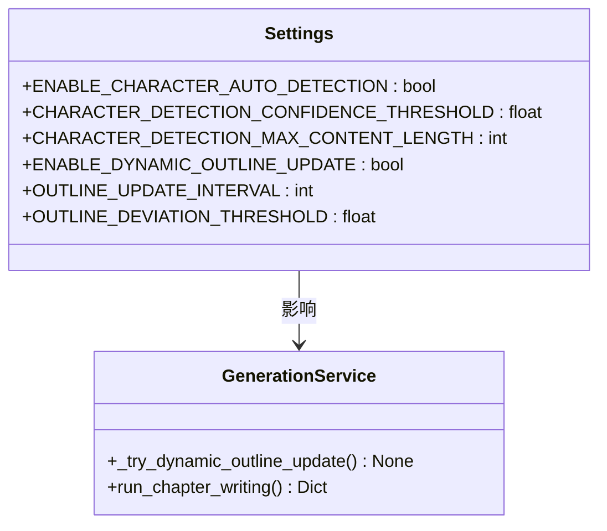

**图表来源**
- [config.py:123-146](file://backend/config.py#L123-L146)

配置参数说明：

- **角色自动检测**：
  - `ENABLE_CHARACTER_AUTO_DETECTION`: 是否启用角色自动检测
  - `CHARACTER_DETECTION_CONFIDENCE_THRESHOLD`: 置信度阈值（0-1）
  - `CHARACTER_DETECTION_MAX_CONTENT_LENGTH`: LLM输入内容最大长度

- **动态大纲更新**：
  - `ENABLE_DYNAMIC_OUTLINE_UPDATE`: 是否启用动态更新
  - `OUTLINE_UPDATE_INTERVAL`: 每N章触发一次更新
  - `OUTLINE_DEVIATION_THRESHOLD`: 偏差阈值（0-10）

**章节来源**
- [config.py:123-146](file://backend/config.py#L123-L146)

## 数据库架构

**更新** 系统的数据库架构支持动态大纲更新和详细大纲存储：

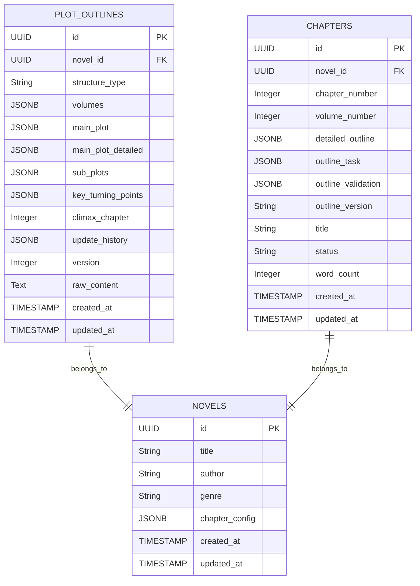

**图表来源**
- [plot_outline.py:11-114](file://core/models/plot_outline.py#L11-L114)
- [2a4218cba9df_add_detailed_outline_to_chapters.py:22-27](file://alembic/versions_archived/2a4218cba9df_add_detailed_outline_to_chapters.py#L22-L27)
- [add_outline_enhancements_to_chapters.py:22-35](file://alembic/versions_archived/add_outline_enhancements_to_chapters.py#L22-L35)

### 核心数据模型

#### PlotOutline模型

PlotOutline模型支持动态大纲更新和详细大纲存储：

- **update_history**: JSONB格式存储更新历史记录
- **version**: 整数类型存储版本号
- **main_plot_detailed**: JSONB格式存储详细主线剧情
- **raw_content**: 文本格式存储原始LLM输出

#### Chapter模型

Chapter模型支持详细大纲存储和版本控制：

- **detailed_outline**: JSONB格式存储章节详细大纲
- **outline_task**: JSONB格式存储大纲任务
- **outline_validation**: JSONB格式存储验证结果
- **outline_version**: 字符串格式存储版本号

**章节来源**
- [plot_outline.py:11-114](file://core/models/plot_outline.py#L11-L114)

## API接口

**更新** 系统提供了完整的API接口支持动态大纲更新和版本管理：

```mermaid
graph TB
subgraph "大纲管理API"
GetOutline[GET /novels/{novel_id}/outline]
UpdateOutline[PATCH /novels/{novel_id}/outline]
GenerateOutline[POST /novels/{novel_id}/outline/generate]
DecomposeOutline[POST /novels/{novel_id}/outline/decompose]
EnhancePreview[POST /novels/{novel_id}/outline/enhance-preview]
ApplyEnhancement[POST /novels/{novel_id}/outline/{outline_id}/apply-enhancement]
GetVersions[GET /novels/{novel_id}/outline/versions]
end
subgraph "章节大纲API"
GetChapterTask[GET /novels/{novel_id}/chapters/{chapter_number}/outline-task]
ValidateOutline[POST /novels/{novel_id}/chapters/{chapter_number}/validate-outline]
end
subgraph "辅助功能API"
AIAssist[POST /novels/{novel_id}/outline/ai-assist]
end
```

**图表来源**
- [outlines.py:122-871](file://backend/api/v1/outlines.py#L122-L871)

### 大纲管理接口

#### 获取大纲
- **URL**: `GET /novels/{novel_id}/outline`
- **功能**: 获取小说的完整大纲信息
- **返回**: PlotOutlineResponse格式

#### 更新大纲
- **URL**: `PATCH /novels/{novel_id}/outline`
- **功能**: 更新小说大纲（支持版本管理）
- **参数**: PlotOutlineUpdate

#### 生成大纲
- **URL**: `POST /novels/{novel_id}/outline/generate`
- **功能**: 基于世界观设定生成完整大纲
- **参数**: OutlineGenerateRequest

#### 大纲分解
- **URL**: `POST /novels/{novel_id}/outline/decompose`
- **功能**: 将大纲分解为章节配置并持久化到章节表
- **参数**: OutlineDecomposeRequest

#### 智能完善预览
- **URL**: `POST /novels/{novel_id}/outline/enhance-preview`
- **功能**: 预览大纲智能完善结果（不修改数据库）
- **参数**: EnhancementOptions

#### 应用完善结果
- **URL**: `POST /novels/{novel_id}/outline/{outline_id}/apply-enhancement`
- **功能**: 将智能完善结果应用到数据库

#### 获取版本历史
- **URL**: `GET /novels/{novel_id}/outline/versions`
- **功能**: 获取大纲版本历史信息
- **返回**: List[OutlineVersionInfo]

### 章节大纲接口

#### 获取章节大纲任务
- **URL**: `GET /novels/{novel_id}/chapters/{chapter_number}/outline-task`
- **功能**: 获取指定章节的大纲任务
- **返回**: ChapterOutlineTaskResponse

#### 验证章节大纲
- **URL**: `POST /novels/{novel_id}/chapters/{chapter_number}/validate-outline`
- **功能**: 验证章节大纲的一致性
- **参数**: OutlineValidationRequest
- **返回**: OutlineValidationResponse

### 辅助功能接口

#### AI辅助生成
- **URL**: `POST /novels/{novel_id}/outline/ai-assist`
- **功能**: AI辅助生成大纲字段内容
- **参数**: AIAssistRequest
- **返回**: AIAssistResponse

**章节来源**
- [outlines.py:122-871](file://backend/api/v1/outlines.py#L122-L871)
- [outline_service.py:28-932](file://backend/services/outline_service.py#L28-L932)
- [outline.py:129-434](file://backend/schemas/outline.py#L129-434)

## 依赖关系分析

**更新** 系统中的组件依赖关系体现了清晰的分层架构，新增了智能增强层和版本控制系统：

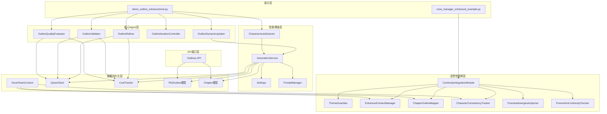

**图表来源**
- [demo_outline_enhancement.py:16-21](file://scripts/demo_outline_enhancement.py#L16-L21)
- [crew_manager_enhanced_example.py:8-15](file://agents/crew_manager_enhanced_example.py#L8-L15)

**章节来源**
- [demo_outline_enhancement.py:16-21](file://scripts/demo_outline_enhancement.py#L16-L21)
- [crew_manager_enhanced_example.py:8-15](file://agents/crew_manager_enhanced_example.py#L8-L15)

## 性能考虑

**更新** 系统在设计时充分考虑了性能优化，新增智能功能均采用异步处理和缓存机制：

1. **智能缓存机制**：EnhancedContextManager使用缓存减少重复计算
2. **成本控制**：通过CostTracker监控LLM调用成本
3. **异步处理**：大量使用async/await提高并发性能
4. **分层架构**：通过分层设计减少不必要的组件调用
5. **批量处理**：ContinuityIntegrationModule支持批量处理多个组件
6. **延迟初始化**：组件按需初始化，减少启动时间
7. **动态更新节流**：通过OUTLINE_UPDATE_INTERVAL避免频繁更新
8. **角色检测优化**：通过置信度阈值和内容截断减少无效调用
9. **异常隔离**：智能功能异常不会影响主创作流程
10. **内存管理**：定期清理过期计数器防止内存泄漏
11. **JSONB存储优化**：使用PostgreSQL的JSONB特性提高查询性能
12. **版本历史压缩**：定期清理旧版本历史减少存储开销

## 故障排除指南

### 常见问题及解决方案

**更新** 针对新增智能功能的常见问题：

1. **LLM调用失败**
   - 检查网络连接和API密钥配置
   - 查看CostTracker的调用统计
   - 确认QwenClient的初始化参数

2. **大纲质量评估异常**
   - 检查输入的大纲数据格式
   - 验证世界观设定的完整性
   - 确认角色数据的有效性

3. **连贯性检查失败**
   - 检查上一章的结束状态数据
   - 验证约束条件的正确性
   - 确认章节计划的完整性

4. **动态大纲更新异常**
   - 检查OUTLINE_UPDATE_INTERVAL配置
   - 验证偏差阈值设置是否合理
   - 确认章节摘要数据的完整性
   - 查看更新历史记录
   - 检查数据库连接和权限

5. **详细大纲存储异常**
   - 验证JSONB字段的数据格式
   - 检查章节ID的正确性
   - 确认版本号的递增逻辑
   - 查看数据库迁移状态

6. **版本控制系统异常**
   - 检查版本号的自增机制
   - 验证更新历史记录的完整性
   - 确认回滚操作的安全性
   - 查看版本比较功能的准确性

7. **角色自动检测失败**
   - 检查CHARACTER_DETECTION_CONFIDENCE_THRESHOLD设置
   - 验证章节内容长度是否超过限制
   - 确认角色名称标准化逻辑
   - 查看去重过滤日志

8. **智能功能性能问题**
   - 检查异步处理是否正常
   - 验证缓存机制是否生效
   - 确认异常处理是否正确
   - 查看内存使用情况

9. **配置参数错误**
   - 检查配置值的合理性范围
   - 验证功能开关状态
   - 确认阈值设置是否合适
   - 查看配置验证日志

10. **API接口异常**
    - 检查请求参数的格式和类型
    - 验证数据库连接状态
    - 确认权限认证是否通过
    - 查看错误响应的具体原因

**章节来源**
- [outline_refiner.py:81-84](file://agents/outline_refiner.py#L81-L84)
- [outline_validator.py:74-77](file://agents/outline_validator.py#L74-L77)
- [outline_dynamic_updater.py:117-142](file://agents/outline_dynamic_updater.py#L117-L142)
- [character_auto_detector.py:103-105](file://backend/services/character_auto_detector.py#L103-L105)
- [config.py:137-145](file://backend/config.py#L137-L145)

## 结论

**更新** 大纲增强演示脚本展示了小说系统强大的多Agent协作能力和智能化的创作辅助功能。通过精心设计的架构和完善的组件体系，系统能够：

1. **自动化程度高**：从大纲生成到质量评估全程自动化
2. **质量保障严格**：多维度的质量评估和连贯性检查
3. **扩展性强**：模块化设计便于功能扩展和定制
4. **性能优异**：智能缓存和异步处理提升效率
5. **主题一致性强**：确保剧情符合核心主题要求
6. **连贯性保障完善**：多层次的剧情连贯性检查机制
7. **创作流程优化**：预防式检查在生成前发现潜在问题
8. **智能适应性强**：动态大纲更新和角色自动检测提升创作效率
9. **数据持久化完善**：详细大纲存储和版本控制确保数据安全
10. **API接口丰富**：完整的RESTful API支持各种操作场景

**更新** 新增的动态大纲更新系统、详细大纲存储和版本控制系统，为AI辅助小说创作提供了更加完整和强大的解决方案。这些智能功能不仅能够提高创作效率，更重要的是能够保证作品的质量和连贯性。

动态大纲更新系统通过四个维度的偏差分析，能够及时发现创作过程中的问题并自动调整后续大纲，确保故事按照最优轨迹发展。详细大纲存储系统支持章节级的详细信息存储，为创作过程提供了更好的数据支撑。版本控制系统则确保了创作过程的可追溯性和安全性。

该系统为AI辅助创作提供了完整的解决方案，通过持续的迭代优化，将在AI辅助创作领域发挥越来越重要的作用。新的智能功能体系使得系统能够更好地处理复杂的创作需求，为创作者提供更加智能和可靠的辅助工具。

**主要创新点**：
- **自适应创作流程**：动态调整确保创作过程的顺畅和高效
- **智能角色管理**：自动识别和维护角色信息，减少人工维护成本
- **灵活配置系统**：支持功能开关和参数调节，适应不同创作需求
- **异常容错机制**：智能功能异常不影响主创作流程，确保稳定性
- **性能优化设计**：异步处理和缓存机制提升整体性能表现
- **数据持久化增强**：JSONB存储和版本控制确保数据安全可靠
- **API接口完善**：丰富的RESTful接口支持各种操作场景

这些创新功能的集成，标志着小说系统向真正的智能化创作助手迈出了重要一步，为未来的AI辅助创作奠定了坚实的技术基础。