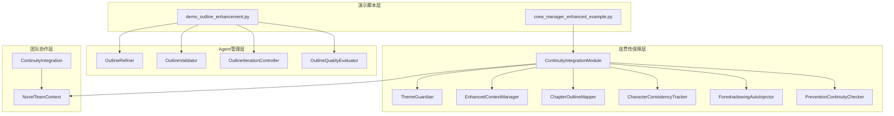
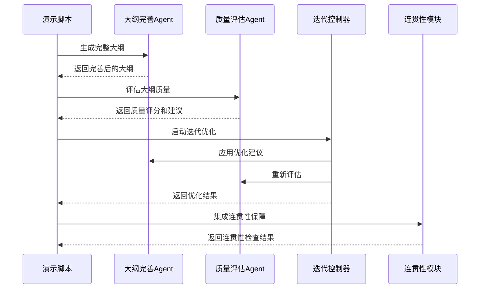
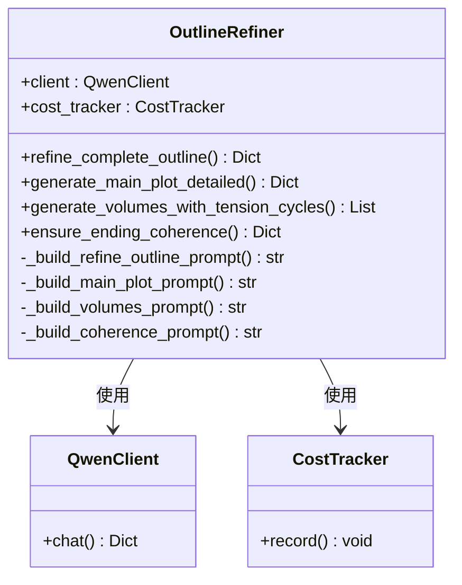
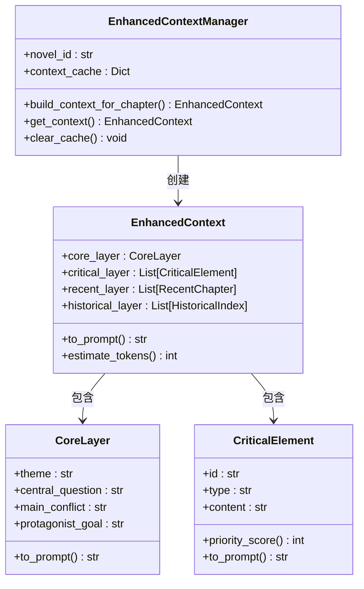
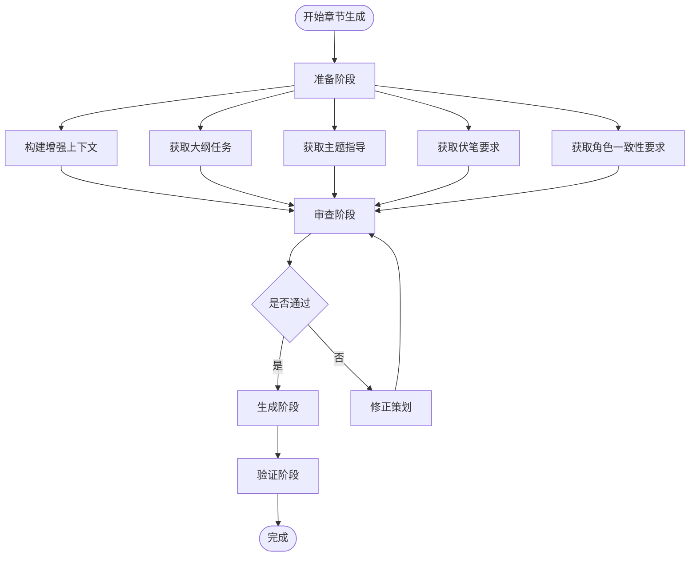
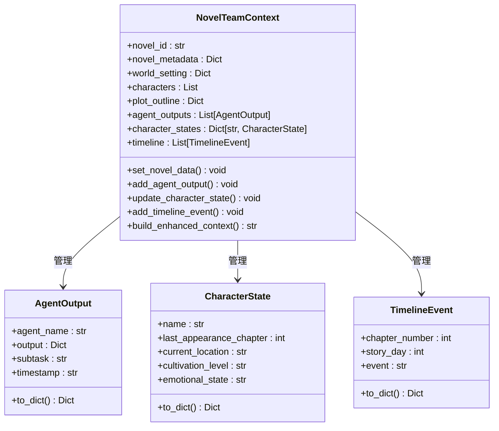
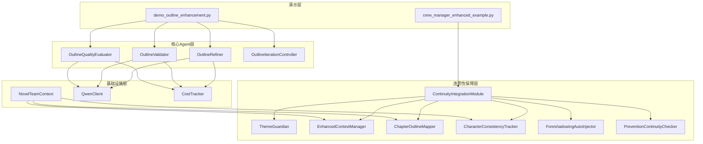

# 大纲增强演示脚本

<cite>
**本文档引用的文件**
- [demo_outline_enhancement.py](file://scripts/demo_outline_enhancement.py)
- [crew_manager_enhanced_example.py](file://agents/crew_manager_enhanced_example.py)
- [enhanced_context_manager.py](file://agents/enhanced_context_manager.py)
- [outline_refiner.py](file://agents/outline_refiner.py)
- [outline_validator.py](file://agents/outline_validator.py)
- [outline_iteration_controller.py](file://agents/outline_iteration_controller.py)
- [outline_quality_evaluator.py](file://agents/outline_quality_evaluator.py)
- [continuity_integration_module.py](file://agents/continuity_integration_module.py)
- [continuity_integration.py](file://agents/continuity_integration.py)
- [team_context.py](file://agents/team_context.py)
- [theme_guardian.py](file://agents/theme_guardian.py)
- [chapter_outline_mapper.py](file://agents/chapter_outline_mapper.py)
- [character_consistency_tracker.py](file://agents/character_consistency_tracker.py)
- [foreshadowing_auto_injector.py](file://agents/foreshadowing_auto_injector.py)
- [prevention_continuity_checker.py](file://agents/prevention_continuity_checker.py)
</cite>

## 目录
1. [简介](#简介)
2. [项目结构](#项目结构)
3. [核心组件](#核心组件)
4. [架构概览](#架构概览)
5. [详细组件分析](#详细组件分析)
6. [依赖关系分析](#依赖关系分析)
7. [性能考虑](#性能考虑)
8. [故障排除指南](#故障排除指南)
9. [结论](#结论)

## 简介

本文档详细介绍小说系统的大纲增强演示脚本，这是一个集成了多个AI代理组件的完整工作流程演示。该系统通过多Agent协作机制，实现了小说大纲的智能完善、质量评估、连贯性保障等功能。

系统的核心特色包括：
- **多Agent协作架构**：通过专门的Agent处理不同类型的创作任务
- **智能大纲完善**：基于LLM技术的自动化大纲优化
- **质量评估体系**：全面的质量评分和改进建议生成
- **连贯性保障**：多层次的剧情连贯性检查机制
- **上下文管理**：智能的记忆和信息保留策略

## 项目结构

小说系统采用模块化设计，主要分为以下几个核心模块：

**图表来源**
- [demo_outline_enhancement.py:1-273](file://scripts/demo_outline_enhancement.py#L1-L273)
- [crew_manager_enhanced_example.py:1-424](file://agents/crew_manager_enhanced_example.py#L1-L424)

**章节来源**
- [demo_outline_enhancement.py:1-273](file://scripts/demo_outline_enhancement.py#L1-L273)
- [crew_manager_enhanced_example.py:1-424](file://agents/crew_manager_enhanced_example.py#L1-L424)

## 核心组件

### 大纲完善Agent系统

系统的核心是基于OutlineRefiner的大纲完善功能，它能够：

1. **细化完整大纲**：基于世界观设定生成包含主线、支线、卷大纲的完整结构
2. **生成详细主线剧情**：构建起承转合的详细主线框架
3. **设计卷级大纲**：为不同卷设计合适的张力循环和关键事件
4. **确保结局连贯性**：检查主线剧情和卷大纲的逻辑一致性

### 质量评估体系

OutlineQualityEvaluator提供了全面的质量评估维度：

- **结构完整性**：检查大纲结构的完整性和合理性
- **世界观一致性**：验证设定与剧情的契合度
- **角色连贯性**：评估角色发展和行为的一致性
- **张力节奏控制**：分析故事节奏和冲突层次
- **逻辑连贯性**：检查因果关系和时间线的合理性
- **创意新颖性**：评估设定和情节的独特性

### 连贯性保障系统

ContinuityIntegrationModule将多个连贯性保障组件集成在一起：

1. **增强上下文管理**：智能记忆和信息保留策略
2. **主题守护者**：确保剧情符合核心主题
3. **章节大纲映射**：将卷级大纲分解为章节级任务
4. **角色一致性追踪**：监控角色行为的一致性
5. **伏笔自动注入**：管理和追踪伏笔的埋设和回收
6. **预防式检查**：在生成前发现潜在问题

**章节来源**
- [outline_refiner.py:1-705](file://agents/outline_refiner.py#L1-L705)
- [outline_quality_evaluator.py:1-440](file://agents/outline_quality_evaluator.py#L1-L440)
- [continuity_integration_module.py:1-483](file://agents/continuity_integration_module.py#L1-L483)

## 架构概览

系统采用分层架构设计，从底层的数据模型到顶层的业务逻辑形成了完整的处理链路：

**图表来源**
- [demo_outline_enhancement.py:23-273](file://scripts/demo_outline_enhancement.py#L23-L273)
- [outline_iteration_controller.py:197-290](file://agents/outline_iteration_controller.py#L197-L290)

## 详细组件分析

### 大纲完善Agent (OutlineRefiner)

OutlineRefiner是系统的核心组件，负责将基础的设定转化为完整的小说大纲：

**图表来源**
- [outline_refiner.py:18-705](file://agents/outline_refiner.py#L18-L705)

OutlineRefiner的主要功能包括：

1. **完整大纲细化**：基于世界观设定生成包含所有必要元素的完整大纲
2. **主线剧情生成**：构建详细的起承转合结构
3. **卷级大纲设计**：为不同卷设计合适的张力循环
4. **结局连贯性检查**：确保故事逻辑的完整性

**章节来源**
- [outline_refiner.py:18-705](file://agents/outline_refiner.py#L18-L705)

### 增强上下文管理器 (EnhancedContextManager)

EnhancedContextManager采用了四层记忆架构来智能管理上下文信息：

**图表来源**
- [enhanced_context_manager.py:196-536](file://agents/enhanced_context_manager.py#L196-L536)

四层记忆架构的设计原理：

1. **核心层**：始终携带的主题、核心冲突、主角终极目标
2. **关键层**：动态保留的伏笔、未解决冲突、角色重大决策
3. **近期层**：最近3章的详细摘要和结尾原文
4. **历史层**：更早章节的卷级摘要和关键事件索引

**章节来源**
- [enhanced_context_manager.py:1-536](file://agents/enhanced_context_manager.py#L1-L536)

### 连贯性保障集成模块

ContinuityIntegrationModule将所有连贯性保障组件集成到统一的接口中：

**图表来源**
- [continuity_integration_module.py:176-352](file://agents/continuity_integration_module.py#L176-L352)

**章节来源**
- [continuity_integration_module.py:74-483](file://agents/continuity_integration_module.py#L74-L483)

### 团队协作上下文 (NovelTeamContext)

NovelTeamContext实现了Agent之间的信息共享和状态追踪：

**图表来源**
- [team_context.py:162-591](file://agents/team_context.py#L162-L591)

**章节来源**
- [team_context.py:1-591](file://agents/team_context.py#L1-L591)

## 依赖关系分析

系统中的组件依赖关系体现了清晰的分层架构：

**图表来源**
- [demo_outline_enhancement.py:16-21](file://scripts/demo_outline_enhancement.py#L16-L21)
- [crew_manager_enhanced_example.py:8-15](file://agents/crew_manager_enhanced_example.py#L8-L15)

**章节来源**
- [demo_outline_enhancement.py:16-21](file://scripts/demo_outline_enhancement.py#L16-L21)
- [crew_manager_enhanced_example.py:8-15](file://agents/crew_manager_enhanced_example.py#L8-L15)

## 性能考虑

系统在设计时充分考虑了性能优化：

1. **智能缓存机制**：EnhancedContextManager使用缓存减少重复计算
2. **成本控制**：通过CostTracker监控LLM调用成本
3. **异步处理**：大量使用async/await提高并发性能
4. **分层架构**：通过分层设计减少不必要的组件调用

## 故障排除指南

### 常见问题及解决方案

1. **LLM调用失败**
   - 检查网络连接和API密钥配置
   - 查看CostTracker的调用统计
   - 确认QwenClient的初始化参数

2. **大纲质量评估异常**
   - 检查输入的大纲数据格式
   - 验证世界观设定的完整性
   - 确认角色数据的有效性

3. **连贯性检查失败**
   - 检查上一章的结束状态数据
   - 验证约束条件的正确性
   - 确认章节计划的完整性

4. **内存使用过高**
   - 清理EnhancedContextManager的缓存
   - 检查NovelTeamContext的存储容量
   - 优化大规模数据的处理流程

**章节来源**
- [outline_refiner.py:81-84](file://agents/outline_refiner.py#L81-L84)
- [outline_validator.py:74-77](file://agents/outline_validator.py#L74-L77)
- [enhanced_context_manager.py:521-525](file://agents/enhanced_context_manager.py#L521-L525)

## 结论

大纲增强演示脚本展示了小说系统强大的多Agent协作能力和智能化的创作辅助功能。通过精心设计的架构和完善的组件体系，系统能够：

1. **自动化程度高**：从大纲生成到质量评估全程自动化
2. **质量保障严格**：多维度的质量评估和连贯性检查
3. **扩展性强**：模块化设计便于功能扩展和定制
4. **性能优异**：智能缓存和异步处理提升效率

该系统为AI辅助小说创作提供了完整的解决方案，不仅能够提高创作效率，更重要的是能够保证作品的质量和连贯性。通过持续的迭代优化，系统将在AI辅助创作领域发挥越来越重要的作用。