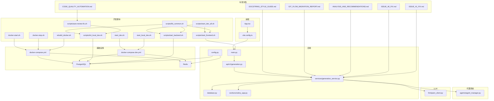
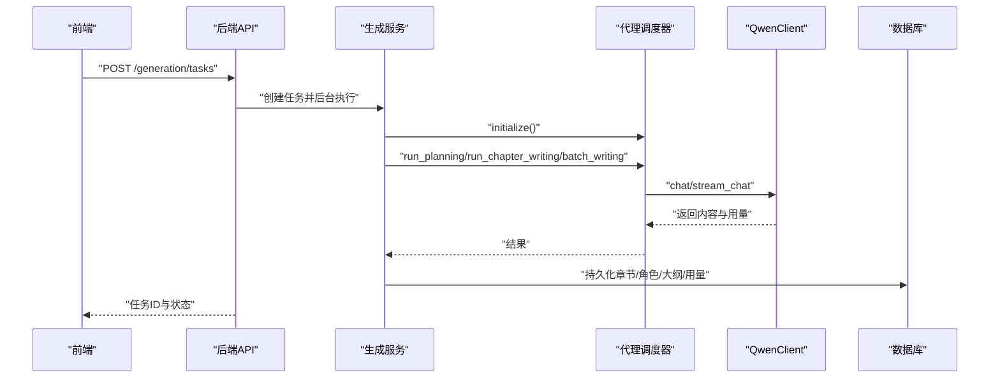
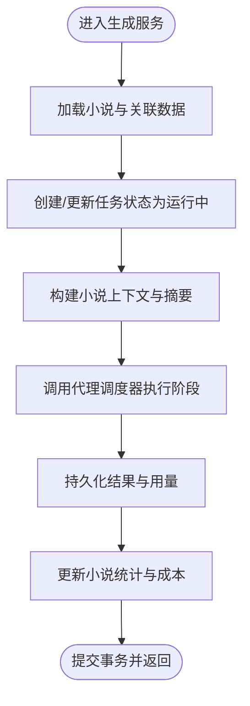
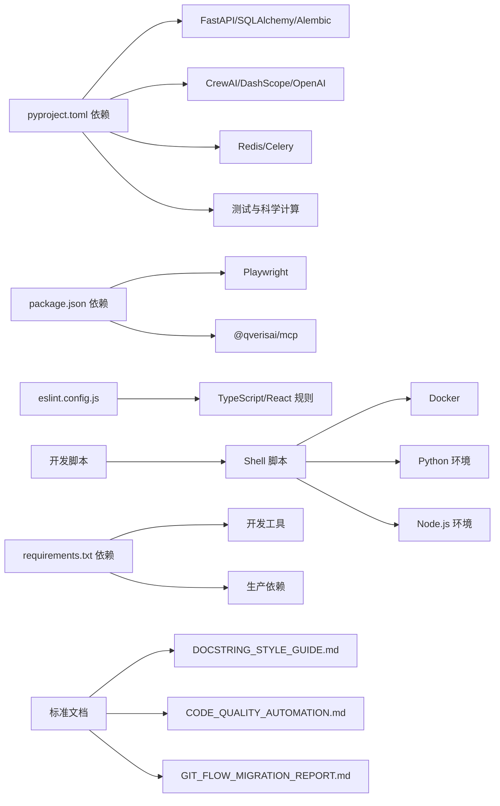

# 开发者指南

<cite>
**本文引用的文件**
- [README.md](file://README.md)
- [README.en.md](file://README.en.md)
- [pyproject.toml](file://pyproject.toml)
- [package.json](file://package.json)
- [playwright.config.ts](file://playwright.config.ts)
- [frontend/eslint.config.js](file://frontend/eslint.config.js)
- [backend/main.py](file://backend/main.py)
- [backend/config.py](file://backend/config.py)
- [core/database.py](file://core/database.py)
- [agents/agent_manager.py](file://agents/agent_manager.py)
- [workers/celery_app.py](file://workers/celery_app.py)
- [llm/qwen_client.py](file://llm/qwen_client.py)
- [backend/services/generation_service.py](file://backend/services/generation_service.py)
- [backend/api/v1/generation.py](file://backend/api/v1/generation.py)
- [frontend/src/App.tsx](file://frontend/src/App.tsx)
- [frontend/vite.config.ts](file://frontend/vite.config.ts)
- [scripts/start_agents.sh](file://scripts/start_agents.sh)
- [docker-compose.yml](file://docker-compose.yml)
- [start_dev.sh](file://start_dev.sh)
- [start_local_dev.sh](file://start_local_dev.sh)
- [scripts/init_local_dev.sh](file://scripts/init_local_dev.sh)
- [docker-compose.dev.yml](file://docker-compose.dev.yml)
- [LOCAL_DEV_GUIDE.md](file://LOCAL_DEV_GUIDE.md)
- [QUICK_START.md](file://QUICK_START.md)
- [scripts/start_backend.sh](file://scripts/start_backend.sh)
- [scripts/start_frontend.sh](file://scripts/start_frontend.sh)
- [docker-start.sh](file://docker-start.sh)
- [docker-stop.sh](file://docker-stop.sh)
- [rebuild_docker.sh](file://rebuild_docker.sh)
- [scripts/start_dev_all.sh](file://scripts/start_dev_all.sh)
- [scripts/lib_common.sh](file://scripts/lib_common.sh)
- [scripts/auto-review-fix.sh](file://scripts/auto-review-fix.sh)
- [CHANGELOG.md](file://CHANGELOG.md)
- [RELEASE_PLAN.md](file://RELEASE_PLAN.md)
- [docs/DOCSTRING_STYLE_GUIDE.md](file://docs/DOCSTRING_STYLE_GUIDE.md)
- [docs/CODE_QUALITY_AUTOMATION.md](file://docs/CODE_QUALITY_AUTOMATION.md)
- [docs/GIT_FLOW_MIGRATION_REPORT.md](file://docs/GIT_FLOW_MIGRATION_REPORT.md)
- [docs/ANALYSIS_AND_RECOMMENDATIONS.md](file://docs/ANALYSIS_AND_RECOMMENDATIONS.md)
- [docs/ISSUE_40_FIX.md](file://docs/ISSUE_40_FIX.md)
- [docs/ISSUE_41_FIX.md](file://docs/ISSUE_41_FIX.md)
</cite>

## 目录
1. [引言](#引言)
2. [项目结构](#项目结构)
3. [核心组件](#核心组件)
4. [架构总览](#架构总览)
5. [详细组件分析](#详细组件分析)
6. [开发环境设置](#开发环境设置)
7. [启动脚本生态系统](#启动脚本生态系统)
8. [依赖关系分析](#依赖关系分析)
9. [性能考虑](#性能考虑)
10. [故障排查指南](#故障排查指南)
11. [版本发布与标准文档](#版本发布与标准文档)
12. [结论](#结论)
13. [附录](#附录)

## 引言
本指南面向所有层级的开发者，帮助您快速理解并高效参与"小说生成系统"的开发。内容涵盖代码规范与最佳实践（Python 与 TypeScript）、开发流程与工作流管理（Git 分支策略、代码评审、版本发布）、项目结构与模块化设计、调试与开发工具、扩展开发方法（新增功能模块、插件与第三方集成）、常见问题与性能优化、安全编码实践以及贡献指南。

**更新** 本版本反映了版本2.1.1发布准备，包含新的版本号、Token动态管理、JSON提取增强以及开发标准文档的改进。

## 项目结构
项目采用前后端分离与多子系统协同的模块化设计：
- 后端（Python/FastAPI）：提供 REST API、业务服务、数据库访问、任务队列与代理编排。
- 前端（TypeScript/React/Vite）：提供管理界面与交互，通过代理访问后端 API。
- 代理系统（Agents）：基于 CrewAI 的多智能体编排，负责创作流程的分层执行。
- LLM 客户端（LLM/QwenClient）：统一接入 DashScope/OpenAI 兼容接口，支持重试与流式输出。
- 数据库（SQLAlchemy Async）：异步 ORM 访问 PostgreSQL，配合 Alembic 迁移。
- 任务队列（Celery/Redis）：异步任务处理与状态追踪。
- 测试与校验：Pytest 单元测试、Playwright 端到端测试、Ruff/Lint 规则。
- **开发脚本**：Shell 脚本生态系统，支持 Docker 开发模式和本地开发模式。
- **标准文档**：包含文档字符串风格指南、代码质量自动化系统、Git Flow迁移报告等。

**图表来源**
- [backend/main.py:1-53](file://backend/main.py#L1-L53)
- [backend/api/v1/generation.py:1-171](file://backend/api/v1/generation.py#L1-L171)
- [backend/services/generation_service.py:1-689](file://backend/services/generation_service.py#L1-L689)
- [agents/agent_manager.py:1-227](file://agents/agent_manager.py#L1-L227)
- [llm/qwen_client.py:1-232](file://llm/qwen_client.py#L1-L232)
- [core/database.py:1-35](file://core/database.py#L1-L35)
- [workers/celery_app.py:1-26](file://workers/celery_app.py#L1-L26)
- [backend/config.py:1-59](file://backend/config.py#L1-L59)
- [docker-compose.yml:1-25](file://docker-compose.yml#L1-L25)
- [docker-compose.dev.yml:1-103](file://docker-compose.dev.yml#L1-L103)
- [start_dev.sh:1-58](file://start_dev.sh#L1-L58)
- [start_local_dev.sh:1-53](file://start_local_dev.sh#L1-L53)
- [scripts/init_local_dev.sh:1-83](file://scripts/init_local_dev.sh#L1-L83)
- [scripts/start_backend.sh:1-51](file://scripts/start_backend.sh#L1-L51)
- [scripts/start_frontend.sh:1-44](file://scripts/start_frontend.sh#L1-L44)
- [docker-start.sh:1-29](file://docker-start.sh#L1-L29)
- [docker-stop.sh:1-23](file://docker-stop.sh#L1-L23)
- [rebuild_docker.sh:1-38](file://rebuild_docker.sh#L1-L38)
- [scripts/start_dev_all.sh:1-95](file://scripts/start_dev_all.sh#L1-L95)
- [scripts/lib_common.sh:1-180](file://scripts/lib_common.sh#L1-L180)
- [scripts/auto-review-fix.sh:1-133](file://scripts/auto-review-fix.sh#L1-L133)
- [docs/DOCSTRING_STYLE_GUIDE.md:1-325](file://docs/DOCSTRING_STYLE_GUIDE.md#L1-L325)
- [docs/CODE_QUALITY_AUTOMATION.md:1-243](file://docs/CODE_QUALITY_AUTOMATION.md#L1-L243)
- [docs/GIT_FLOW_MIGRATION_REPORT.md:1-203](file://docs/GIT_FLOW_MIGRATION_REPORT.md#L1-L203)
- [docs/ANALYSIS_AND_RECOMMENDATIONS.md:1-1073](file://docs/ANALYSIS_AND_RECOMMENDATIONS.md#L1-L1073)
- [docs/ISSUE_40_FIX.md:1-76](file://docs/ISSUE_40_FIX.md#L1-L76)
- [docs/ISSUE_41_FIX.md:1-181](file://docs/ISSUE_41_FIX.md#L1-L181)

**章节来源**
- [backend/main.py:1-53](file://backend/main.py#L1-L53)
- [backend/config.py:1-59](file://backend/config.py#L1-L59)
- [core/database.py:1-35](file://core/database.py#L1-L35)
- [agents/agent_manager.py:1-227](file://agents/agent_manager.py#L1-L227)
- [workers/celery_app.py:1-26](file://workers/celery_app.py#L1-L26)
- [llm/qwen_client.py:1-232](file://llm/qwen_client.py#L1-L232)
- [backend/services/generation_service.py:1-689](file://backend/services/generation_service.py#L1-L689)
- [backend/api/v1/generation.py:1-171](file://backend/api/v1/generation.py#L1-L171)
- [frontend/src/App.tsx:1-16](file://frontend/src/App.tsx#L1-L16)
- [frontend/vite.config.ts:1-23](file://frontend/vite.config.ts#L1-L23)
- [docker-compose.yml:1-25](file://docker-compose.yml#L1-L25)
- [docker-compose.dev.yml:1-103](file://docker-compose.dev.yml#L1-L103)
- [start_dev.sh:1-58](file://start_dev.sh#L1-L58)
- [start_local_dev.sh:1-53](file://start_local_dev.sh#L1-L53)
- [scripts/init_local_dev.sh:1-83](file://scripts/init_local_dev.sh#L1-L83)
- [scripts/start_backend.sh:1-51](file://scripts/start_backend.sh#L1-L51)
- [scripts/start_frontend.sh:1-44](file://scripts/start_frontend.sh#L1-L44)
- [docker-start.sh:1-29](file://docker-start.sh#L1-L29)
- [docker-stop.sh:1-23](file://docker-stop.sh#L1-L23)
- [rebuild_docker.sh:1-38](file://rebuild_docker.sh#L1-L38)
- [scripts/start_dev_all.sh:1-95](file://scripts/start_dev_all.sh#L1-L95)
- [scripts/lib_common.sh:1-180](file://scripts/lib_common.sh#L1-L180)
- [scripts/auto-review-fix.sh:1-133](file://scripts/auto-review-fix.sh#L1-L133)

## 核心组件
- FastAPI 应用入口与中间件：CORS、路由挂载、健康检查。
- 配置中心：集中管理 LLM、数据库、Redis、Celery、应用与爬虫参数。
- 数据库层：异步引擎、会话工厂、依赖注入。
- 生成服务：编排代理系统与 LLM，执行企划、单章与批量写作，并持久化结果。
- 代理管理器：单例模式，负责代理生命周期与状态查询。
- LLM 客户端：统一 DashScope/OpenAI 兼容调用，支持重试与流式输出。
- 任务队列：Celery 任务配置与自动发现。
- 前端应用：React + Ant Design，Vite 代理后端 API。
- **开发脚本系统**：提供多种开发模式的自动化启动和管理能力。
- **标准文档系统**：包含文档字符串风格、代码质量自动化、Git Flow等开发标准。

**章节来源**
- [backend/main.py:1-53](file://backend/main.py#L1-L53)
- [backend/config.py:1-59](file://backend/config.py#L1-L59)
- [core/database.py:1-35](file://core/database.py#L1-L35)
- [backend/services/generation_service.py:1-689](file://backend/services/generation_service.py#L1-L689)
- [agents/agent_manager.py:1-227](file://agents/agent_manager.py#L1-L227)
- [llm/qwen_client.py:1-232](file://llm/qwen_client.py#L1-L232)
- [workers/celery_app.py:1-26](file://workers/celery_app.py#L1-L26)
- [frontend/src/App.tsx:1-16](file://frontend/src/App.tsx#L1-L16)
- [frontend/vite.config.ts:1-23](file://frontend/vite.config.ts#L1-L23)

## 架构总览
系统采用"前端渲染 + 后端 API + 代理编排 + LLM + 数据库 + 任务队列"的分层架构。前端通过 Vite 代理访问后端；后端通过服务层编排代理与 LLM，将结果写入数据库；异步任务通过 Celery 在 Redis 中排队执行；配置由 Pydantic Settings 统一读取环境变量。

**图表来源**
- [backend/api/v1/generation.py:23-103](file://backend/api/v1/generation.py#L23-L103)
- [backend/services/generation_service.py:36-205](file://backend/services/generation_service.py#L36-L205)
- [llm/qwen_client.py:46-161](file://llm/qwen_client.py#L46-L161)
- [core/database.py:25-35](file://core/database.py#L25-L35)

## 详细组件分析

### 后端入口与路由
- 应用初始化：设置日志、CORS、挂载 API 路由。
- 根与健康检查端点：对外暴露基础信息与健康状态。

**章节来源**
- [backend/main.py:1-53](file://backend/main.py#L1-L53)

### 配置与环境
- 设置项：LLM 凭证与模型、数据库连接、Redis/Celery、应用环境与调试开关、爬虫参数、加密密钥等。
- 动态构建数据库 URL 与同步 URL，便于迁移与同步操作。

**章节来源**
- [backend/config.py:1-59](file://backend/config.py#L1-L59)

### 数据库与依赖注入
- 异步引擎与会话工厂：连接池大小、溢出、回滚与关闭逻辑。
- 依赖注入：在请求生命周期内提供会话，保证事务一致性。

**章节来源**
- [core/database.py:1-35](file://core/database.py#L1-L35)

### 生成服务（核心编排）
- 企划阶段：加载小说，更新任务状态，调用代理调度器执行规划，持久化世界观、角色、大纲，记录 Token 用量与成本。
- 单章写作：构建小说上下文，拼接前序章节摘要，调用代理生成章节正文，持久化章节与统计信息。
- 批量写作：循环执行单章写作，汇总结果与错误，更新任务进度与状态。
- 内部方法：不创建任务记录的章节生成，供内部流程复用。

**图表来源**
- [backend/services/generation_service.py:36-205](file://backend/services/generation_service.py#L36-L205)
- [backend/services/generation_service.py:206-386](file://backend/services/generation_service.py#L206-L386)
- [backend/services/generation_service.py:387-563](file://backend/services/generation_service.py#L387-L563)

**章节来源**
- [backend/services/generation_service.py:1-689](file://backend/services/generation_service.py#L1-L689)

### API 层（生成任务）
- 创建任务：校验小说存在性与批量参数，创建任务记录，使用后台任务执行具体阶段。
- 列表与详情：支持按小说 ID 与状态过滤，分页查询任务。
- 取消任务：仅允许对未完成的任务进行取消。

**章节来源**
- [backend/api/v1/generation.py:1-171](file://backend/api/v1/generation.py#L1-L171)

### 代理管理器
- 单例模式：全局唯一实例，避免重复初始化。
- 初始化：创建通信器、调度器、LLM 客户端与成本跟踪器，注册市场分析、内容策划、写作、编辑、发布等代理。
- 生命周期：启动/停止，状态查询与代理检索。

**章节来源**
- [agents/agent_manager.py:1-227](file://agents/agent_manager.py#L1-L227)

### LLM 客户端（QwenClient）
- 模式切换：支持 DashScope 标准模式与 OpenAI 兼容模式（通过 base_url 判定）。
- 能力：同步/异步聊天、流式输出、指数退避重试、用量统计。
- 线程池：在异步环境中调用同步 SDK，避免阻塞事件循环。

**章节来源**
- [llm/qwen_client.py:1-232](file://llm/qwen_client.py#L1-L232)

### 任务队列（Celery）
- Broker/Backend：Redis。
- 配置：序列化、时区、UTC、任务超时、并发与预取策略、自动发现任务包。

**章节来源**
- [workers/celery_app.py:1-26](file://workers/celery_app.py#L1-L26)

### 前端应用与开发工具
- 应用入口：Ant Design 国际化、路由与错误边界。
- Vite：本地开发服务器端口、路径别名、后端 API 代理。
- ESLint：TypeScript/React Hooks/React Refresh 推荐规则。

**章节来源**
- [frontend/src/App.tsx:1-16](file://frontend/src/App.tsx#L1-L16)
- [frontend/vite.config.ts:1-23](file://frontend/vite.config.ts#L1-L23)
- [frontend/eslint.config.js:1-24](file://frontend/eslint.config.js#L1-L24)

### 测试与质量保障
- Playwright：跨浏览器端到端测试配置，HTML 报告与首次重试追踪。
- Pytest：标记分类（单元/网络/真实爬取/集成/慢），异步模式。
- Ruff：Python Lint 规则与行宽、目标版本。

**章节来源**
- [playwright.config.ts:1-80](file://playwright.config.ts#L1-L80)
- [pyproject.toml:54-63](file://pyproject.toml#L54-L63)
- [pyproject.toml:47-52](file://pyproject.toml#L47-L52)

### 启动与部署
- Agent 启动脚本：Poetry 环境下运行 Python 脚本，输出 PID 与日志文件。
- Docker Compose：PostgreSQL 与 Redis 容器化服务与数据卷。

**章节来源**
- [scripts/start_agents.sh:1-35](file://scripts/start_agents.sh#L1-L35)
- [docker-compose.yml:1-25](file://docker-compose.yml#L1-L25)

## 开发环境设置

### Docker 开发模式
推荐使用 Docker 开发模式，该模式提供完整的开发环境容器化解决方案：

#### 特点
- **容器化服务**：PostgreSQL、Redis、Neo4j、后端、前端全部容器化
- **热重载**：代码挂载实现热更新，无需手动重启
- **一键启动**：简化开发环境搭建流程
- **健康检查**：内置服务健康检查机制
- **完整图数据库支持**：包含 Neo4j 图数据库服务

#### 启动流程
1. **基础服务启动**：PostgreSQL、Redis、Neo4j 容器启动
2. **数据库检查**：自动检测数据库可用性
3. **表结构初始化**：根据需要自动创建数据库表
4. **应用服务启动**：后端和前端服务启动
5. **服务验证**：显示服务状态和访问地址

#### 访问地址
- **前端**：http://localhost:3000
- **后端 API**：http://localhost:8000
- **API 文档**：http://localhost:8000/docs
- **Neo4j 浏览器**：http://localhost:7474

**章节来源**
- [start_dev.sh:1-58](file://start_dev.sh#L1-L58)
- [docker-compose.dev.yml:1-117](file://docker-compose.dev.yml#L1-L117)

### 本地开发模式
本地开发模式适合希望直接在本地环境中运行的开发者：

#### 特点
- **无容器依赖**：直接使用本地 Python 和 Node.js 环境
- **灵活配置**：可根据本地环境调整配置
- **独立服务**：数据库和缓存服务需要手动启动
- **自定义路径**：支持自定义项目路径配置
- **完整开发工具链**：支持 Poetry 和 pip 两种安装方式

#### 启动流程
1. **基础服务检查**：检查并启动 PostgreSQL 和 Redis
2. **数据库表检查**：验证数据库表结构
3. **服务启动**：分别启动后端和前端服务
4. **访问验证**：显示各服务的访问地址

#### 服务启动命令
- **后端**：`uvicorn backend.main:app --reload --host 0.0.0.0 --port 8000`
- **前端**：`npm run dev -- --host 0.0.0.0 --port 3000`

**章节来源**
- [start_local_dev.sh:1-53](file://start_local_dev.sh#L1-L53)

### 环境初始化脚本
提供自动化的环境初始化能力，简化开发环境搭建：

#### 主要功能
- **Python 环境检查**：自动检测和创建虚拟环境
- **依赖安装**：支持 Poetry 和 pip 两种安装方式
- **配置文件创建**：自动生成 .env 配置文件
- **数据库迁移**：自动执行数据库表结构初始化
- **前端依赖**：可选安装前端依赖包

#### 初始化流程
1. **环境检查**：检查 Python 版本和依赖工具
2. **虚拟环境创建**：创建并激活 Python 虚拟环境
3. **依赖安装**：安装后端 Python 依赖
4. **配置文件准备**：创建 .env 配置文件
5. **数据库初始化**：执行 Alembic 迁移
6. **前端准备**：可选安装前端依赖

**章节来源**
- [scripts/init_local_dev.sh:1-74](file://scripts/init_local_dev.sh#L1-L74)

### 开发脚本生态系统
提供完整的开发环境管理能力：

#### 核心脚本
- **start_dev_all.sh**：统一启动脚本，支持单独启动后端或前端
- **lib_common.sh**：共享函数库，提供通用的检查和启动功能
- **auto-review-fix.sh**：自动化代码审查修复脚本

#### 脚本功能
- **环境检查**：PostgreSQL、Redis、后端服务健康检查
- **依赖管理**：自动安装缺失的依赖
- **服务监控**：实时显示服务状态
- **错误处理**：完善的错误提示和解决方案

**章节来源**
- [scripts/start_dev_all.sh:1-95](file://scripts/start_dev_all.sh#L1-L95)
- [scripts/lib_common.sh:1-180](file://scripts/lib_common.sh#L1-L180)
- [scripts/auto-review-fix.sh:1-133](file://scripts/auto-review-fix.sh#L1-L133)

## 启动脚本生态系统

### Docker 开发脚本
提供完整的 Docker 开发环境管理能力：

#### start_dev.sh
- **功能**：一键启动完整的 Docker 开发环境
- **特点**：自动检查现有容器、启动基础服务、初始化数据库、启动应用服务
- **输出**：显示服务状态和访问地址

#### docker-start.sh
- **功能**：启动 Docker 服务（带镜像构建）
- **特点**：停止现有容器、构建新镜像、启动服务
- **适用场景**：需要重新构建镜像时使用

#### docker-stop.sh
- **功能**：停止所有 Docker 服务
- **特点**：可选择清理未使用的 Docker 资源
- **适用场景**：开发结束或需要清理环境时

#### rebuild_docker.sh
- **功能**：完全重建 Docker 环境
- **特点**：清理旧容器、删除悬空镜像、无缓存重建、重新启动
- **适用场景**：Docker 环境出现严重问题时

**章节来源**
- [start_dev.sh:1-58](file://start_dev.sh#L1-L58)
- [docker-start.sh:1-29](file://docker-start.sh#L1-L29)
- [docker-stop.sh:1-23](file://docker-stop.sh#L1-L23)
- [rebuild_docker.sh:1-38](file://rebuild_docker.sh#L1-L38)

### 本地开发脚本
提供本地开发环境的自动化管理：

#### start_local_dev.sh
- **功能**：启动本地开发环境
- **特点**：检查基础服务、初始化数据库、显示启动命令
- **适用场景**：使用本地 Python 和 Node.js 环境开发

#### scripts/start_backend.sh
- **功能**：启动后端服务
- **特点**：检查 .env 配置、验证数据库连接、执行数据库迁移、启动 Uvicorn
- **适用场景**：后端服务独立启动

#### scripts/start_frontend.sh
- **功能**：启动前端服务
- **特点**：检查前端依赖、验证后端服务、启动 Vite 开发服务器
- **适用场景**：前端服务独立启动

**章节来源**
- [start_local_dev.sh:1-53](file://start_local_dev.sh#L1-L53)
- [scripts/start_backend.sh:1-51](file://scripts/start_backend.sh#L1-L51)
- [scripts/start_frontend.sh:1-44](file://scripts/start_frontend.sh#L1-L44)

### 脚本生态系统优势
- **模块化设计**：每个脚本专注于特定功能
- **自动化程度高**：减少手动操作步骤
- **错误处理完善**：提供详细的错误信息和解决方案
- **灵活性强**：支持不同的开发模式和场景
- **易于扩展**：可以轻松添加新的启动脚本

## 依赖关系分析
- 后端依赖：FastAPI、SQLAlchemy Async、Alembic、Pydantic/Settings、Redis/Celery、CrewAI、DashScope、OpenAI、HTTPX、加密库、Playwright、Scikit-learn 等。
- 前端依赖：Playwright（测试）、@qverisai/mcp（可选）等。
- 工具链：Ruff（Python Lint）、ESLint（TypeScript/React）、Vite（前端打包与代理）。
- **开发脚本依赖**：Shell 脚本依赖 Docker、Python、Node.js 环境。
- **标准文档依赖**：pydocstyle（文档字符串检查）、GitHub Actions（CI/CD）、OpenCode CLI（代码审查）。

**图表来源**
- [pyproject.toml:8-36](file://pyproject.toml#L8-L36)
- [package.json:1-12](file://package.json#L1-L12)
- [frontend/eslint.config.js:1-24](file://frontend/eslint.config.js#L1-L24)
- [docker-compose.dev.yml:37-96](file://docker-compose.dev.yml#L37-L96)
- [requirements.txt:1-35](file://requirements.txt#L1-L35)
- [docs/DOCSTRING_STYLE_GUIDE.md:1-325](file://docs/DOCSTRING_STYLE_GUIDE.md#L1-L325)
- [docs/CODE_QUALITY_AUTOMATION.md:1-243](file://docs/CODE_QUALITY_AUTOMATION.md#L1-L243)
- [docs/GIT_FLOW_MIGRATION_REPORT.md:1-203](file://docs/GIT_FLOW_MIGRATION_REPORT.md#L1-L203)

**章节来源**
- [pyproject.toml:1-64](file://pyproject.toml#L1-L64)
- [package.json:1-12](file://package.json#L1-L12)
- [frontend/eslint.config.js:1-24](file://frontend/eslint.config.js#L1-L24)
- [requirements.txt:1-35](file://requirements.txt#L1-L35)

## 性能考虑
- 异步数据库：使用 SQLAlchemy Async 与连接池，减少阻塞。
- 任务队列：Celery 配置合理并发与预取，长任务避免预取，设置软/硬超时。
- LLM 调用：指数退避重试、流式输出降低等待、用量统计与成本控制。
- 前端代理：Vite 代理后端，避免跨域与额外握手开销。
- 缓存与会话：Redis 作为 Broker/Backend，注意键空间与过期策略。
- **开发脚本优化**：使用 Docker 挂载卷实现热重载，减少重启时间。
- **Token 管理优化**：新增 TokenCalculator 实现动态 token 管理，优化 LLM 调用成本。

## 故障排查指南

### 启动与日志
- Agent 启动脚本输出 PID 与日志文件位置，可通过尾随日志查看运行状态。
- Docker Compose 启动数据库与缓存服务，确认端口映射与数据卷。
- **开发脚本故障排查**：
  - 检查脚本执行权限：`chmod +x script_name.sh`
  - 查看脚本输出：使用 `-x` 选项调试脚本执行
  - 验证依赖工具：确保 Docker、Python、Node.js 正确安装

### 数据库连接
- 检查 DATABASE_URL 与同步 URL 构造是否正确，连接池参数是否合理。
- **Docker 环境**：确认容器网络连接和端口映射
- **本地环境**：检查本地数据库服务状态和连接参数

### LLM 调用
- 确认 API Key、Base URL 与模型配置；OpenAI 兼容模式需正确设置 base_url。
- **配置验证**：检查 .env 文件中的 API Key 设置
- **Token 限制处理**：优化模型调用的 token 限制处理，使用新的 TokenCalculator

### 任务执行
- 检查 Celery Broker/Backend 地址、时区与并发配置；关注任务超时与重试策略。
- **Docker 环境**：确认 Redis 服务可用性和连接配置

### 前端联调
- 确认 Vite 代理 /api 到后端地址，Ant Design 国际化与路由配置。
- **本地开发**：检查后端服务是否在 8000 端口运行

### 开发脚本相关问题
- **脚本执行失败**：检查脚本权限和依赖工具
- **Docker 环境问题**：使用 `docker-compose ps` 检查容器状态
- **端口冲突**：使用 `lsof -i :port` 查找占用进程
- **依赖安装问题**：检查网络连接和镜像源配置

### 标准文档相关问题
- **文档字符串检查失败**：使用 pydocstyle 检查，遵循 DOCSTRING_STYLE_GUIDE.md 规范
- **代码质量自动化失败**：检查 GitHub Actions 配置和 OpenCode CLI 安装
- **Git Flow 迁移问题**：参考 GIT_FLOW_MIGRATION_REPORT.md 进行问题排查

**章节来源**
- [scripts/start_agents.sh:1-35](file://scripts/start_agents.sh#L1-L35)
- [docker-compose.yml:1-25](file://docker-compose.yml#L1-L25)
- [backend/config.py:18-33](file://backend/config.py#L18-L33)
- [workers/celery_app.py:12-23](file://workers/celery_app.py#L12-L23)
- [frontend/vite.config.ts:15-21](file://frontend/vite.config.ts#L15-L21)
- [start_dev.sh:1-58](file://start_dev.sh#L1-L58)
- [start_local_dev.sh:1-53](file://start_local_dev.sh#L1-L53)
- [scripts/init_local_dev.sh:1-83](file://scripts/init_local_dev.sh#L1-L83)
- [docs/DOCSTRING_STYLE_GUIDE.md:1-325](file://docs/DOCSTRING_STYLE_GUIDE.md#L1-L325)
- [docs/CODE_QUALITY_AUTOMATION.md:1-243](file://docs/CODE_QUALITY_AUTOMATION.md#L1-L243)
- [docs/GIT_FLOW_MIGRATION_REPORT.md:1-203](file://docs/GIT_FLOW_MIGRATION_REPORT.md#L1-L203)

## 版本发布与标准文档

### 版本2.1.1发布准备
**更新** 项目已更新至版本 2.1.1，包含以下重要改进：

#### 新增功能
- **Token 动态管理**：新增 TokenCalculator 实现动态 token 管理，优化 LLM 调用成本控制
- **JSON 提取增强**：增强多策略 JSON 提取器的鲁棒性，改进 LLM 响应解析能力

#### 质量改进
- **文档完善**：更新和扩展编码规范文档，包含最新的开发标准
- **质量评估优化**：优化质量评估器的配置处理，提升代码质量

#### 发布计划
- **版本管理**：遵循语义化版本控制，变更日志与发布说明同步更新
- **CI/CD 集成**：GitHub Actions 工作流支持版本发布自动化
- **质量门禁**：代码质量自动化系统确保发布前的质量标准

**章节来源**
- [pyproject.toml:3](file://pyproject.toml#L3)
- [CHANGELOG.md:1-152](file://CHANGELOG.md#L1-L152)
- [RELEASE_PLAN.md:1-180](file://RELEASE_PLAN.md#L1-L180)

### 开发标准文档体系

#### 文档字符串风格指南
- **Google Style**：采用 Google Style 文档字符串格式，简洁易读且广泛支持
- **中文支持**：对中文文档友好，适合国际化团队协作
- **工具集成**：pydocstyle 自动检查，IDE 支持良好

#### 代码质量自动化系统
- **自动化流程**：代码提交 → 自动审查 → 创建 Issues → 自动修复 → 验证评分 → 提交 PR
- **GitHub Actions**：CI/CD 自动化工作流，支持定时触发和手动触发
- **质量评分**：综合评分 = 代码审查 (50%) + Pylint (20%) + 测试覆盖率 (30%)

#### Git Flow 迁移报告
- **标准流程**：feature/* → develop → release/* → main 的标准 Git Flow
- **分支策略**：CI 触发配置，确保开发流程的规范性
- **问题修复**：P1 问题 100% 修复完成，为稳定发布奠定基础

#### 架构分析与优化建议
- **问题识别**：发现大纲版本管理、角色关系管理、上下文管理等关键问题
- **优化建议**：提供短期、中期优化方案，涵盖性能、用户体验和功能完整性
- **实施优先级**：P0-P2 优先级划分，确保关键问题优先解决

#### 具体问题修复方案
- **Issue #40**：大纲完善预览成本高，提供快速预览、增量预览和缓存优化方案
- **Issue #41**：角色关系可视化后端支持不足，增强关系分析、过滤和统计功能

**章节来源**
- [docs/DOCSTRING_STYLE_GUIDE.md:1-325](file://docs/DOCSTRING_STYLE_GUIDE.md#L1-L325)
- [docs/CODE_QUALITY_AUTOMATION.md:1-243](file://docs/CODE_QUALITY_AUTOMATION.md#L1-L243)
- [docs/GIT_FLOW_MIGRATION_REPORT.md:1-203](file://docs/GIT_FLOW_MIGRATION_REPORT.md#L1-L203)
- [docs/ANALYSIS_AND_RECOMMENDATIONS.md:1-1073](file://docs/ANALYSIS_AND_RECOMMENDATIONS.md#L1-L1073)
- [docs/ISSUE_40_FIX.md:1-76](file://docs/ISSUE_40_FIX.md#L1-L76)
- [docs/ISSUE_41_FIX.md:1-181](file://docs/ISSUE_41_FIX.md#L1-L181)

## 结论
本指南提供了从项目结构、核心组件到开发流程、调试与扩展的全栈参考。新增的开发环境脚本生态系统、标准文档体系和版本2.1.1发布准备大大提升了开发效率和代码质量。建议在开发中遵循统一的代码规范、严格的测试与质量门禁、清晰的分支与发布流程，以确保系统的稳定性与可维护性。

**更新** 版本2.1.1包含 Token 动态管理、JSON 提取增强等重要改进，配合完善的开发标准文档，为项目的稳定发展奠定了坚实基础。

## 附录

### 代码规范与最佳实践

- Python（后端）
  - 风格与 Lint：使用 Ruff，行宽 100，目标版本 3.12，启用 E/F/I/W 规则集。
  - 命名约定：模块与类使用 PascalCase，函数与变量使用 snake_case；常量大写。
  - 注释规范：遵循 DOCSTRING_STYLE_GUIDE.md 的 Google Style 规范，使用 pydocstyle 检查。
  - 异常处理：明确捕获与转换异常，保留原始错误信息，必要时记录上下文。
  - 依赖注入：通过 FastAPI Depends 与 SQLAlchemy AsyncSession 管理会话生命周期。
  - 配置管理：使用 Pydantic Settings 读取 .env，区分开发/生产环境。

- TypeScript（前端）
  - ESLint：启用推荐规则与 React Hooks、React Refresh 插件。
  - 命名约定：组件首字母大写，hooks 使用 use 前缀，类型使用 PascalCase。
  - 注释规范：公共 API 与复杂逻辑添加 JSDoc；UI 组件属性与行为清晰注释。
  - 代理与路由：保持 /api 代理一致，避免硬编码后端地址。

- Git 分支与工作流
  - 分支策略：采用标准 Git Flow，feature/* → develop → release/* → main。
  - 提交信息：采用约定式提交（如 feat/fix/docs：简要描述），并在 PR 描述中说明变更动机与影响范围。
  - 代码评审：至少一名 reviewer，关注安全性、性能与可维护性。
  - 版本发布：语义化版本号，变更日志与发布说明同步更新。

- 测试与质量
  - 单元测试：Pytest 标记分类明确，覆盖关键路径与边界条件。
  - 端到端测试：Playwright 跨浏览器验证，报告与追踪开启。
  - Lint 与格式：Ruff（Python）、ESLint（TypeScript）自动化检查。
  - 代码质量自动化：GitHub Actions 自动化审查与修复流程。

- 安全编码实践
  - 密钥与敏感信息：通过环境变量注入，禁止硬编码；加密存储平台凭据。
  - 输入校验：API 层严格校验参数类型与范围；数据库层使用 ORM 防 SQL 注入。
  - CORS 与中间件：最小权限开放，仅允许受信源访问。
  - LLM 调用：限制提示长度与频率，避免泄露用户隐私；记录用量与成本。

- 扩展开发方法
  - 新增后端 API：在 backend/api 下新增模块，定义 Pydantic 模型与服务层方法，注册路由。
  - 新增服务：在 backend/services 下新增服务类，注入依赖与会话，编写单元测试。
  - 新增前端页面：在 frontend/src/pages 下新增页面组件，注册路由与菜单。
  - 插件与第三方集成：通过配置中心集中管理外部服务参数，统一异常处理与日志记录。

- 常见问题与解决方案
  - 数据库连接失败：检查 DATABASE_URL、端口映射与容器状态。
  - LLM 调用超时：调整重试次数与退避策略，检查网络与限流。
  - Celery 任务不执行：确认 Broker/Backend 地址、worker 启动与 autodiscover。
  - 前端无法访问后端：确认 Vite 代理配置与 CORS 设置。
  - **开发脚本问题**：检查脚本权限、依赖工具和环境变量配置。
  - **Token 管理问题**：使用新的 TokenCalculator 进行动态 token 管理。

- 调试与开发工具
  - IDE：VSCode（Python 使用 Ruff/Lint 插件，TypeScript 使用 ESLint 插件）。
  - 断点调试：后端使用 uvicorn --reload，前端使用 Vite Dev Server。
  - 性能分析：后端使用 cProfile/Py-Spy，前端使用 React DevTools 与性能面板。
  - 日志：统一使用 core/logging_config，按模块与级别输出。
  - **开发脚本调试**：使用 `bash -x script_name.sh` 查看脚本执行过程。

- 贡献指南
  - Fork 仓库，创建特性分支，提交 PR，等待评审与 CI 通过。
  - 变更需附带测试与文档更新，遵循本指南的规范与流程。
  - **开发脚本贡献**：新增或修改脚本时，确保跨平台兼容性和错误处理。
  - **标准文档贡献**：按照 DOCSTRING_STYLE_GUIDE.md 规范编写文档字符串。

**章节来源**
- [pyproject.toml:47-63](file://pyproject.toml#L47-L63)
- [frontend/eslint.config.js:1-24](file://frontend/eslint.config.js#L1-L24)
- [README.md:24-30](file://README.md#L24-L30)
- [README.en.md:21-27](file://README.en.md#L21-L27)
- [LOCAL_DEV_GUIDE.md:1-367](file://LOCAL_DEV_GUIDE.md#L1-L367)
- [QUICK_START.md:1-120](file://QUICK_START.md#L1-L120)
- [docs/DOCSTRING_STYLE_GUIDE.md:1-325](file://docs/DOCSTRING_STYLE_GUIDE.md#L1-L325)
- [docs/CODE_QUALITY_AUTOMATION.md:1-243](file://docs/CODE_QUALITY_AUTOMATION.md#L1-L243)
- [docs/GIT_FLOW_MIGRATION_REPORT.md:1-203](file://docs/GIT_FLOW_MIGRATION_REPORT.md#L1-L203)
- [docs/ANALYSIS_AND_RECOMMENDATIONS.md:1-1073](file://docs/ANALYSIS_AND_RECOMMENDATIONS.md#L1-L1073)
- [docs/ISSUE_40_FIX.md:1-76](file://docs/ISSUE_40_FIX.md#L1-L76)
- [docs/ISSUE_41_FIX.md:1-181](file://docs/ISSUE_41_FIX.md#L1-L181)