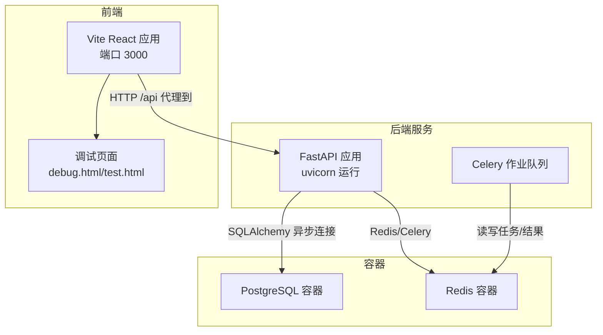
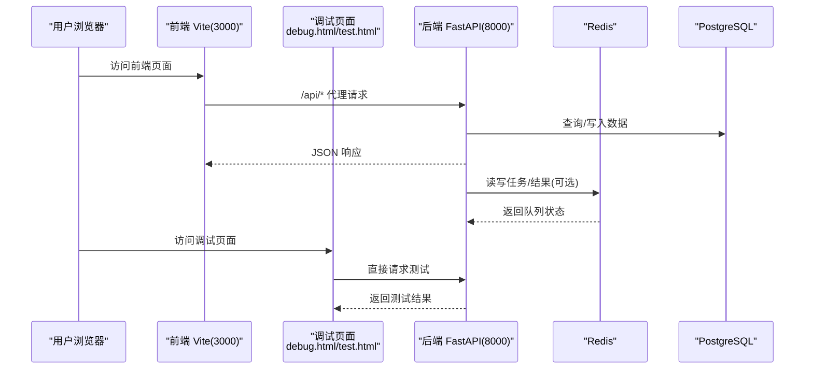
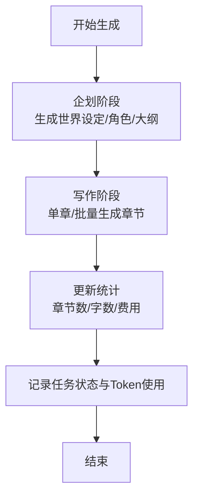
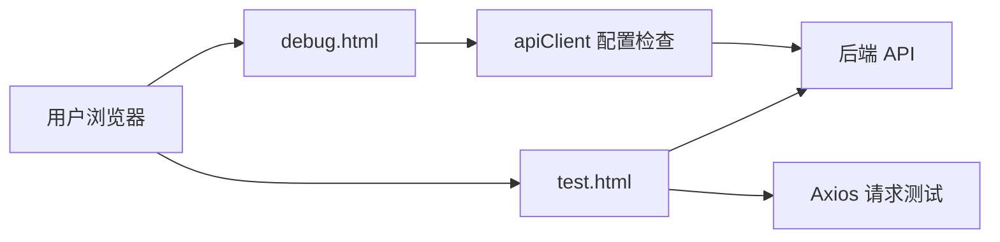
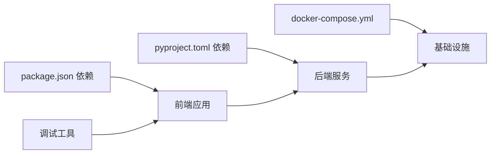

# 快速开始

<cite>
**本文引用的文件**
- [README.md](file://README.md)
- [docker-compose.yml](file://docker-compose.yml)
- [.env.example](file://.env.example)
- [.env](file://.env)
- [pyproject.toml](file://pyproject.toml)
- [package.json](file://package.json)
- [backend/main.py](file://backend/main.py)
- [backend/config.py](file://backend/config.py)
- [core/database.py](file://core/database.py)
- [workers/celery_app.py](file://workers/celery_app.py)
- [scripts/start_agents.sh](file://scripts/start_agents.sh)
- [scripts/run_auto_novel.sh](file://scripts/run_auto_novel.sh)
- [backend/api/v1/novels.py](file://backend/api/v1/novels.py)
- [backend/services/generation_service.py](file://backend/services/generation_service.py)
- [frontend/package.json](file://frontend/package.json)
- [frontend/vite.config.ts](file://frontend/vite.config.ts)
- [frontend/src/api/client.ts](file://frontend/src/api/client.ts)
- [frontend/public/debug.html](file://frontend/public/debug.html)
- [frontend/public/test.html](file://frontend/public/test.html)
- [frontend/docker-entrypoint.sh](file://frontend/docker-entrypoint.sh)
- [Dockerfile.frontend](file://Dockerfile.frontend)
- [CHANGELOG.md](file://CHANGELOG.md)
- [LOCAL_DEV_GUIDE.md](file://LOCAL_DEV_GUIDE.md)
</cite>

## 更新摘要
**所做更改**
- 更新版本信息：从 1.0.0 升级到 1.3.1，反映最新生产版本
- 更新配置说明：APP_DEBUG 默认值从 True 改为 False，禁用开发环境调试模式
- 增加安全配置说明：环境变量命名规范化和敏感信息处理
- 更新功能特性：Docker 完整容器化部署支持、内存服务增强等
- 修正 API 根端点版本信息：从 1.0.0 更新为 1.3.1

## 目录
1. [简介](#简介)
2. [项目结构](#项目结构)
3. [核心组件](#核心组件)
4. [架构总览](#架构总览)
5. [详细组件分析](#详细组件分析)
6. [调试工具与辅助页面](#调试工具与辅助页面)
7. [依赖关系分析](#依赖关系分析)
8. [性能考虑](#性能考虑)
9. [故障排除指南](#故障排除指南)
10. [结论](#结论)
11. [附录](#附录)

## 简介
本指南面向首次部署"小说生成系统"的用户，目标是在约30分钟内完成从环境准备、容器化部署、数据库初始化、智能体启动到前端访问的全流程，并体验核心功能。系统采用 Python 3.12+、FastAPI 后端、React 前端、PostgreSQL 数据库、Redis 缓存与 Celery 异步队列，配合 Docker Compose 进行一键部署。**版本升级**：当前版本为 1.3.1，这是最新的生产发布版本，包含完整的功能集和生产就绪的安全配置。

## 项目结构
该仓库采用前后端分离与多模块组织方式：
- 后端：FastAPI 应用、API 路由、服务层、数据库模型与配置
- 前端：React + Vite 应用，通过代理访问后端 API
- 作业与智能体：Celery 作业、Agent 启动脚本与自动化流程脚本
- 数据库迁移：Alembic 版本化迁移
- 容器化：Docker Compose 管理 PostgreSQL 与 Redis
- **新增**：调试工具与辅助页面，用于开发和故障排查

**图表来源**
- [docker-compose.yml:1-25](file://docker-compose.yml#L1-L25)
- [backend/main.py:15-32](file://backend/main.py#L15-L32)
- [workers/celery_app.py:6-25](file://workers/celery_app.py#L6-L25)
- [frontend/vite.config.ts:12-21](file://frontend/vite.config.ts#L12-L21)
- [frontend/public/debug.html:1-29](file://frontend/public/debug.html#L1-L29)
- [frontend/public/test.html:1-25](file://frontend/public/test.html#L1-L25)

**章节来源**
- [docker-compose.yml:1-25](file://docker-compose.yml#L1-L25)
- [backend/main.py:15-32](file://backend/main.py#L15-L32)
- [workers/celery_app.py:6-25](file://workers/celery_app.py#L6-L25)
- [frontend/vite.config.ts:12-21](file://frontend/vite.config.ts#L12-L21)

## 核心组件
- 后端应用入口与中间件：FastAPI 应用、CORS、路由注册、健康检查
- 配置系统：基于 Pydantic Settings 的环境变量加载与数据库/Redis/Celery URL 动态拼接
- 数据库：异步 SQLAlchemy 引擎与会话工厂
- 作业队列：Celery 应用与任务配置
- 前端：Vite + React，本地开发代理到后端 8000 端口
- 智能体与自动化：Agent 启动脚本与自动创作流程脚本
- **新增**：调试工具：apiClient 配置检查与 Axios 请求测试页面
- **版本升级**：1.3.1 版本包含完整的生产就绪配置，禁用开发调试模式

**章节来源**
- [backend/main.py:5-53](file://backend/main.py#L5-L53)
- [backend/config.py:5-59](file://backend/config.py#L5-L59)
- [core/database.py:1-35](file://core/database.py#L1-L35)
- [workers/celery_app.py:1-26](file://workers/celery_app.py#L1-L26)
- [frontend/package.json:1-42](file://frontend/package.json#L1-L42)
- [frontend/vite.config.ts:1-23](file://frontend/vite.config.ts#L1-L23)
- [frontend/public/debug.html:1-29](file://frontend/public/debug.html#L1-L29)
- [frontend/public/test.html:1-25](file://frontend/public/test.html#L1-L25)

## 架构总览
系统采用"容器化基础设施 + 微服务后端 + 前端 SPA"的架构。容器提供数据库与缓存；后端提供 REST API；前端通过代理访问后端；Celery 通过 Redis 承载异步任务。**版本升级**：1.3.1 版本提供生产就绪的完整功能集，包含 Docker 完整容器化部署支持、内存服务增强、AI 聊天会话隔离等功能。

**图表来源**
- [frontend/vite.config.ts:15-20](file://frontend/vite.config.ts#L15-L20)
- [backend/main.py:35-52](file://backend/main.py#L35-L52)
- [core/database.py:11-22](file://core/database.py#L11-L22)
- [workers/celery_app.py:6-25](file://workers/celery_app.py#L6-L25)
- [frontend/public/debug.html:1-29](file://frontend/public/debug.html#L1-L29)
- [frontend/public/test.html:1-25](file://frontend/public/test.html#L1-L25)

## 详细组件分析

### 环境与依赖准备
- Python 3.12+：项目要求 Python >=3.12,<3.13，使用 Poetry 管理依赖
- Node.js：前端使用 Vite，需安装 Node.js 以运行前端
- PostgreSQL：容器镜像为 postgres:17，默认端口映射至宿主 5434
- Redis：容器镜像为 redis:6-alpine，默认端口映射至宿主 6379
- 可选：Poetry（用于后端依赖安装）
- **版本升级**：1.3.1 版本包含完整的依赖管理配置

**章节来源**
- [pyproject.toml:8-36](file://pyproject.toml#L8-L36)
- [docker-compose.yml:2-20](file://docker-compose.yml#L2-L20)
- [package.json:1-12](file://package.json#L1-L12)

### Docker 容器化部署
- 启动数据库与缓存
  - 使用 docker-compose 启动 postgres 与 redis 服务
  - 数据卷持久化：postgres_data、redis_data
  - 默认端口：PostgreSQL 5434 → 5432，Redis 6379
- 初始化数据库
  - 使用 Alembic 迁移数据库版本
  - 建议在后端服务启动前执行迁移
- 启动后端服务
  - 后端监听 0.0.0.0:8000，**版本升级**：1.3.1 版本默认禁用调试模式（APP_DEBUG=false）
- 启动前端
  - 前端监听 0.0.0.0:3000，通过代理转发 /api 到后端 8000
  - **新增**：使用 docker-entrypoint.sh 确保环境变量在 Vite 启动时可用
- 启动智能体
  - 使用脚本启动 Agent 系统后台进程
  - 日志输出到 logs 目录，PID 写入 agent.pid

**章节来源**
- [docker-compose.yml:1-25](file://docker-compose.yml#L1-L25)
- [backend/main.py:15-32](file://backend/main.py#L15-L32)
- [frontend/vite.config.ts:12-21](file://frontend/vite.config.ts#L12-L21)
- [scripts/start_agents.sh:1-35](file://scripts/start_agents.sh#L1-L35)
- [frontend/docker-entrypoint.sh:1-11](file://frontend/docker-entrypoint.sh#L1-L11)
- [Dockerfile.frontend:1-22](file://Dockerfile.frontend#L1-L22)

### 环境变量与数据库连接
- 环境变量示例
  - LLM：DASHSCOPE_API_KEY、DASHSCOPE_MODEL
  - 数据库：DATABASE_URL、DATABASE_URL_SYNC
  - Redis：REDIS_URL
  - Celery：CELERY_BROKER_URL、CELERY_RESULT_BACKEND
  - 应用：APP_ENV、APP_DEBUG、APP_HOST、APP_PORT
  - **新增**：前端代理：API_PROXY_TARGET（默认 http://localhost:8000）
- 配置加载
  - 后端通过 Settings 类加载 .env，动态拼接数据库与同步数据库 URL
  - 数据库引擎使用异步驱动，连接池参数可在数据库模块中调整
  - **新增**：前端 Vite 配置支持动态代理目标，优先使用环境变量 API_PROXY_TARGET
  - **版本升级**：1.3.1 版本默认禁用调试模式（APP_DEBUG=false），提升安全性
- 端口与主机
  - Settings 中默认 DB_HOST=127.0.0.1、DB_PORT=5434，与 docker-compose 映射一致

**章节来源**
- [.env.example:1-21](file://.env.example#L1-L21)
- [.env:1-22](file://.env#L1-L22)
- [backend/config.py:5-59](file://backend/config.py#L5-L59)
- [core/database.py:11-22](file://core/database.py#L11-L22)
- [frontend/vite.config.ts:5-10](file://frontend/vite.config.ts#L5-L10)

### 首次配置向导
- AI 模型 API 密钥
  - 在 .env 中设置 DASHSCOPE_API_KEY 与 DASHSCOPE_MODEL
  - 如需自定义基础 URL，可设置 DASHSCOPE_BASE_URL
- 发布平台账户绑定
  - 平台账户信息存储于数据库，可通过后端接口进行绑定与管理
  - 建议在系统初始化后，先创建一个测试小说，再配置发布平台
- 健康检查
  - 访问后端根路径与 /health 端点确认服务运行正常
  - **版本升级**：1.3.1 版本提供完整的健康检查接口

**章节来源**
- [.env.example:1-21](file://.env.example#L1-L21)
- [.env:1-22](file://.env#L1-L22)
- [backend/main.py:35-52](file://backend/main.py#L35-L52)

### 常用命令行操作
- 启动容器
  - docker-compose up -d postgres redis
- 数据库迁移
  - 在后端容器内或宿主执行 Alembic 迁移命令
- 启动后端
  - uvicorn --host 0.0.0.0 --port 8000 backend.main:app
- 启动前端
  - npm install && npm run dev
- 启动智能体
  - ./scripts/start_agents.sh
- 自动创作流程
  - ./scripts/run_auto_novel.sh -g <类型> -t "<标签1,标签2>" -p <平台>

**章节来源**
- [docker-compose.yml:1-25](file://docker-compose.yml#L1-L25)
- [backend/main.py:15-32](file://backend/main.py#L15-L32)
- [scripts/start_agents.sh:1-35](file://scripts/start_agents.sh#L1-L35)
- [scripts/run_auto_novel.sh:1-113](file://scripts/run_auto_novel.sh#L1-L113)

### 关键业务流程：小说生成服务
- 企划阶段
  - 生成世界观、角色、情节大纲，更新小说状态为"写作中"
  - 记录 Token 使用与费用
- 单章/批量写作
  - 读取小说上下文（世界观、角色、大纲、已写章节摘要）
  - 调度 Agent 完成章节生成并持久化
  - 更新章节计数、字数与费用
- 任务状态管理
  - GenerationTask 记录任务生命周期、输入输出、Token 与费用

**图表来源**
- [backend/services/generation_service.py:36-205](file://backend/services/generation_service.py#L36-L205)
- [backend/services/generation_service.py:206-386](file://backend/services/generation_service.py#L206-L386)
- [backend/services/generation_service.py:387-563](file://backend/services/generation_service.py#L387-L563)

**章节来源**
- [backend/services/generation_service.py:27-35](file://backend/services/generation_service.py#L27-L35)

### API 示例：小说 CRUD
- 列表查询：支持分页与状态筛选
- 创建/更新/删除：标准 CRUD 操作
- 详情查询：包含世界设定、角色、章节的关联加载

**章节来源**
- [backend/api/v1/novels.py:25-150](file://backend/api/v1/novels.py#L25-L150)

## 调试工具与辅助页面

### 新增调试HTML页面
系统提供了两个专用的调试页面，帮助开发者快速诊断和测试系统功能：

#### debug.html - apiClient 配置调试
- **用途**：检查前端 apiClient 的配置状态
- **功能**：显示 baseURL、timeout、headers 等配置信息
- **使用方法**：访问 http://localhost:3000/debug.html
- **特点**：自动执行配置检查，支持手动刷新

#### test.html - Axios 请求测试
- **用途**：测试前端到后端的 HTTP 请求
- **功能**：发送 /api/v1/novels/?page=1&page_size=1 请求
- **使用方法**：访问 http://localhost:3000/test.html
- **特点**：显示成功响应或详细的错误信息，包含完整的请求 URL

**图表来源**
- [frontend/public/debug.html:1-29](file://frontend/public/debug.html#L1-L29)
- [frontend/public/test.html:1-25](file://frontend/public/test.html#L1-L25)
- [frontend/src/api/client.ts:1-24](file://frontend/src/api/client.ts#L1-L24)

**章节来源**
- [frontend/public/debug.html:1-29](file://frontend/public/debug.html#L1-L29)
- [frontend/public/test.html:1-25](file://frontend/public/test.html#L1-L25)
- [frontend/src/api/client.ts:1-24](file://frontend/src/api/client.ts#L1-L24)

### 增强的前端容器启动流程
**新增**：docker-entrypoint.sh 脚本确保环境变量在 Vite 启动时可用

- **功能**：输出环境变量用于调试，然后启动 Vite 开发服务器
- **环境变量**：API_PROXY_TARGET（默认 http://localhost:8000）
- **启动命令**：npm run dev -- --host 0.0.0.0
- **容器集成**：在 Dockerfile.frontend 中设置执行权限并暴露端口

**章节来源**
- [frontend/docker-entrypoint.sh:1-11](file://frontend/docker-entrypoint.sh#L1-L11)
- [Dockerfile.frontend:1-22](file://Dockerfile.frontend#L1-L22)
- [frontend/vite.config.ts:5-10](file://frontend/vite.config.ts#L5-L10)

## 依赖关系分析
- 后端依赖
  - FastAPI、SQLAlchemy(异步)、Alembic、Pydantic Settings、Redis、Celery、DashScope、CrewAI 等
- 前端依赖
  - React、Ant Design、Axios、React Router、Zustand 等
- 容器依赖
  - PostgreSQL 17、Redis 6-alpine
- **新增**：调试工具依赖
  - 无需额外依赖，直接使用浏览器内置功能
- **版本升级**：1.3.1 版本包含完整的依赖管理配置

**图表来源**
- [pyproject.toml:8-36](file://pyproject.toml#L8-L36)
- [package.json:12-40](file://package.json#L12-L40)
- [docker-compose.yml:1-25](file://docker-compose.yml#L1-L25)
- [frontend/public/debug.html:1-29](file://frontend/public/debug.html#L1-L29)
- [frontend/public/test.html:1-25](file://frontend/public/test.html#L1-L25)

**章节来源**
- [pyproject.toml:8-36](file://pyproject.toml#L8-L36)
- [package.json:12-40](file://package.json#L12-L40)
- [docker-compose.yml:1-25](file://docker-compose.yml#L1-L25)

## 性能考虑
- 数据库连接池
  - 异步引擎默认池大小与溢出值可在数据库模块中调整
- 任务并发与超时
  - Celery 工作线程数、软硬超时、prefetch 控制长任务吞吐
- 前端开发体验
  - Vite 代理仅在开发环境启用，生产构建后通过 Nginx/反向代理提供静态资源
  - **新增**：调试页面无需构建，直接通过浏览器访问
- **版本升级**：1.3.1 版本优化了性能配置，禁用调试模式提升生产环境性能

**章节来源**
- [core/database.py:14-16](file://core/database.py#L14-L16)
- [workers/celery_app.py:12-23](file://workers/celery_app.py#L12-L23)
- [frontend/vite.config.ts:12-21](file://frontend/vite.config.ts#L12-L21)

## 故障排除指南
- 无法连接数据库
  - 检查 .env 中 DATABASE_URL 与 Settings 中 DB_HOST/DB_PORT 是否与 docker-compose 映射一致
  - 确认容器已启动且端口映射正确
- 前端无法访问后端 API
  - 确认前端代理配置指向 http://localhost:8000
  - 检查后端 CORS 配置允许前端源
  - **新增**：使用 test.html 页面测试请求，查看详细错误信息
- 智能体无法启动
  - 查看 logs/agent_startup.log 与 logs/agent_system.log
  - 确认 Python 环境与依赖安装完成
- 自动创作流程失败
  - 查看 logs/auto_novel_output.log，定位具体失败步骤
  - 检查 LLM API 密钥是否正确设置
- Celery 任务无响应
  - 确认 Redis 正常运行，Broker 与 Backend URL 正确
  - 检查工作线程数与超时设置
- **新增**：调试页面无法访问
  - 确认前端容器已启动且端口 3000 可用
  - 检查 docker-entrypoint.sh 是否正确执行
  - 使用 debug.html 检查 apiClient 配置
- **版本升级**：1.3.1 版本增加了安全配置，如禁用调试模式、规范化环境变量命名

**章节来源**
- [backend/config.py:18-26](file://backend/config.py#L18-L26)
- [frontend/vite.config.ts:15-20](file://frontend/vite.config.ts#L15-L20)
- [scripts/start_agents.sh:9-34](file://scripts/start_agents.sh#L9-L34)
- [scripts/run_auto_novel.sh:68-112](file://scripts/run_auto_novel.sh#L68-L112)
- [workers/celery_app.py:6-25](file://workers/celery_app.py#L6-L25)
- [frontend/public/debug.html:1-29](file://frontend/public/debug.html#L1-L29)
- [frontend/public/test.html:1-25](file://frontend/public/test.html#L1-L25)
- [frontend/docker-entrypoint.sh:1-11](file://frontend/docker-entrypoint.sh#L1-L11)

## 结论
通过本指南，您可以在约 30 分钟内完成从环境准备到系统可用的全部步骤。**版本升级**：1.3.1 版本作为最新的生产发布版本，提供了完整的功能集和生产就绪的安全配置。新增的调试工具进一步简化了开发和故障排查过程。建议在首次部署后，先创建一个测试小说并执行一次自动创作流程，以验证 LLM、数据库、Redis 与 Celery 的协同工作情况。后续可根据需要扩展发布平台与监控能力。

## 附录

### 环境变量清单（摘录）
- LLM：DASHSCOPE_API_KEY、DASHSCOPE_MODEL、DASHSCOPE_BASE_URL
- 数据库：DATABASE_URL、DATABASE_URL_SYNC、DB_HOST、DB_PORT、DB_USER、DB_NAME
- Redis：REDIS_URL
- Celery：CELERY_BROKER_URL、CELERY_RESULT_BACKEND
- 应用：APP_ENV、APP_DEBUG、APP_HOST、APP_PORT
- **新增**：前端代理：API_PROXY_TARGET（默认 http://localhost:8000）
- **版本升级**：1.3.1 版本包含完整的环境变量配置，禁用调试模式提升安全性

**章节来源**
- [.env.example:1-21](file://.env.example#L1-L21)
- [.env:1-22](file://.env#L1-L22)
- [backend/config.py:6-48](file://backend/config.py#L6-L48)
- [frontend/vite.config.ts:5-10](file://frontend/vite.config.ts#L5-L10)

### 调试页面使用指南
- **debug.html**：访问 http://localhost:3000/debug.html
  - 自动显示 apiClient 配置信息
  - 点击"检查配置"按钮手动刷新
  - 用于验证 baseURL、timeout、headers 设置
- **test.html**：访问 http://localhost:3000/test.html
  - 自动发送测试请求
  - 显示成功响应或详细错误信息
  - 包含完整的请求 URL 和错误堆栈

**章节来源**
- [frontend/public/debug.html:1-29](file://frontend/public/debug.html#L1-L29)
- [frontend/public/test.html:1-25](file://frontend/public/test.html#L1-L25)
- [frontend/src/api/client.ts:1-24](file://frontend/src/api/client.ts#L1-L24)

### 版本变更历史
**1.3.1 版本（2026-03-19）**
- **新增**：JSON解析鲁棒性增强，改进 _extract_json_from_response、_find_json_by_brackets 和 _extract_fields_manually 方法的错误处理
- **新增**：代码质量提升，增强异常处理和输入验证机制
- **修复**：Critical Bug修复，修复了 LLM 响应解析中的异常传播问题
- **修复**：数据库迁移修复，解决 Alembic 多头部修订版本问题

**1.2.0 版本（2026-03-02）**
- **新增**：审查循环框架，引入基于模板方法模式的审查循环基础框架
- **新增**：统一基础模块，新增 agents/base目录，包含质量报告和审查结果数据结构
- **新增**：多策略JSON提取，增强LLM响应解析能力，支持多种提取策略
- **新增**：质量评估系统，实现多阶段质量评估与迭代控制机制
- **新增**：连续性增强模块，改进章节连续性检查和内容相似度检测
- **变更**：智能体架构优化，重构审查循环处理器，支持多种具体审查处理器扩展
- **变更**：任务调度改进，修正任务依赖检查逻辑，添加详细警告日志
- **变更**：团队上下文管理，增强 NovelCrewManager 中的团队上下文处理能力
- **修复**：调度器逻辑，修复 agent_scheduler.py 中的任务依赖检查问题
- **修复**：审查循环集成，优化 character_review_loop、plot_review_loop、world_review_loop 的实现

**1.1.0 版本（2026-02-28）**
- **新增**：AgentMesh 集成，实现 Agent 间信息共享与持久化记忆系统
- **新增**：TeamContext 上下文管理，新增 NovelTeamContext 类，支持跨章节状态跟踪
- **新增**：持久化记忆存储，集成 SQLite + FTS5 存储系统，支持章节摘要、角色状态、伏笔追踪
- **新增**：智能上下文增强，AI 聊天和小说分析中集成持久化记忆上下文
- **新增**：角色状态管理，实时跟踪角色在不同章节中的状态变化
- **新增**：伏笔追踪系统，自动识别和管理故事情节中的伏笔元素
- **新增**：连续性检查增强，基于持久化记忆的智能连续性校验
- **变更**：优化 GenerationService 架构，支持持久化记忆适配器
- **变更**：改进 NovelCrewManager，集成 TeamContext 进行上下文管理
- **变更**：增强 AgentDispatcher，支持 team_context 参数传递
- **变更**：重构 AI 聊天服务，集成持久化记忆增强分析能力
- **修复**：修复角色状态初始化和格式化处理问题
- **修复**：优化持久化记忆系统的异常处理和日志记录

**1.0.0 版本（2026-02-26）**
- **新增**：Docker 完整容器化部署支持
- **新增**：内存服务增强：小说分析增量合并功能
- **新增**：AI 聊天会话按小说 ID 隔离
- **新增**：自动生成聊天标题功能
- **新增**：结构化修订建议提取与应用
- **新增**：完善的日志级别配置
- **新增**：系统监控和健康检查接口
- **新增**：平台账号和发布管理功能
- **变更**：优化前端代理配置，解决网络连接问题
- **变更**：改进数据库 SSL 连接配置
- **变更**：环境变量配置规范化
- **变更**：Docker 部署文档完善
- **变更**：禁用开发环境调试模式
- **修复**：修复小说信息为空时的重新加载逻辑
- **修复**：解决前端无法访问后端服务的问题
- **修复**：优化建议数据处理与字段验证
- **修复**：修复三个菜单（平台账号、发布管理、系统监控）的 API 路由问题
- **安全**：禁用开发环境调试模式
- **安全**：优化敏感信息处理
- **安全**：规范化环境变量命名避免客户端代码冲突

**0.1.0 版本（2026-02-23）**
- **新增**：初始版本发布
- **新增**：基础小说生成功能
- **新增**：AI 聊天对话系统
- **新增**：章节管理和编辑功能
- **新增**：用户认证系统

**章节来源**
- [CHANGELOG.md:1-89](file://CHANGELOG.md#L1-L89)
- [pyproject.toml](file://pyproject.toml#L3)
- [backend/main.py](file://backend/main.py#L64)
- [backend/main.py](file://backend/main.py#L113)
- [LOCAL_DEV_GUIDE.md](file://LOCAL_DEV_GUIDE.md#L350)

### 生产环境部署建议
- **版本选择**：使用 1.3.1 版本进行生产部署
- **安全配置**：确保 APP_DEBUG=false，禁用调试模式
- **环境变量**：使用 .env.production 文件管理生产环境配置
- **监控**：启用系统监控和健康检查接口
- **备份**：定期备份数据库和 Redis 数据
- **日志**：配置适当的日志级别和轮转策略

**章节来源**
- [docker-compose.yml](file://docker-compose.yml#L53)
- [backend/config.py](file://backend/config.py#L66)
- [CHANGELOG.md:3-12](file://CHANGELOG.md#L3-L12)