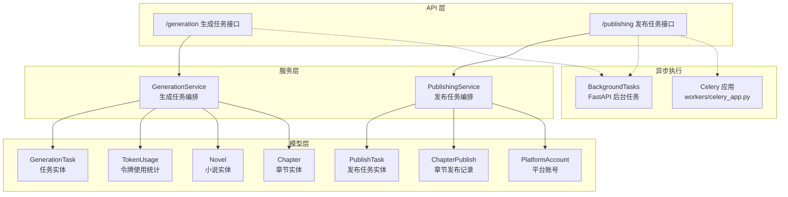
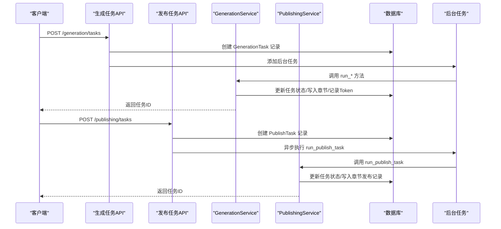
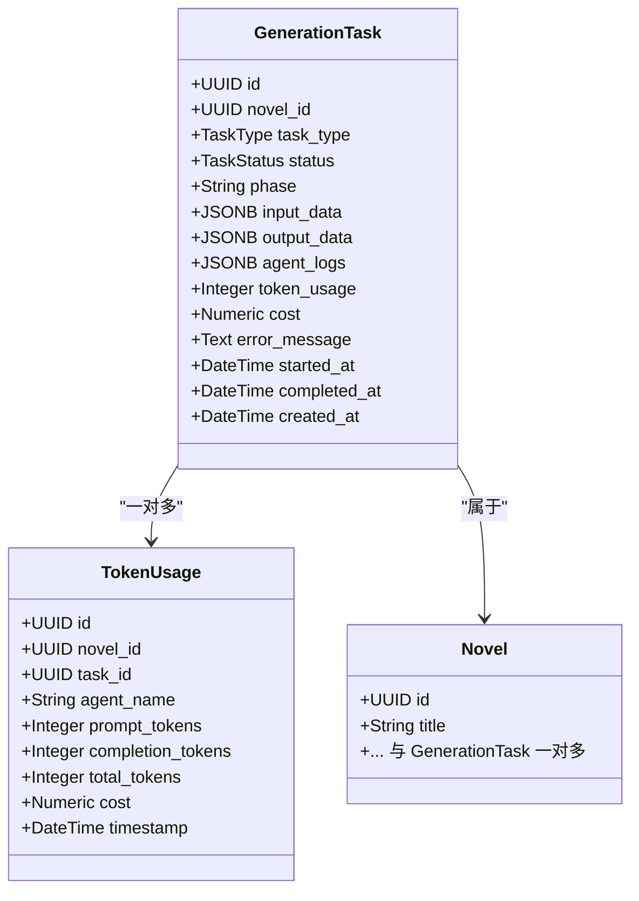
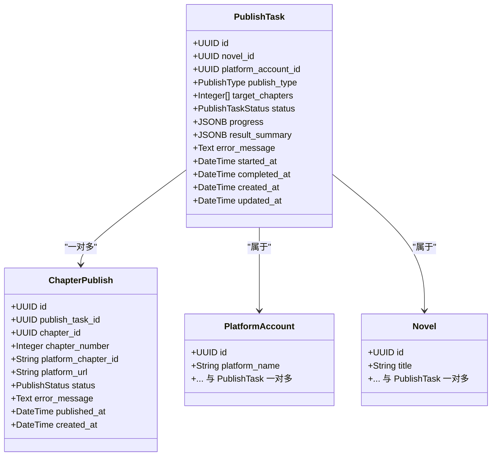
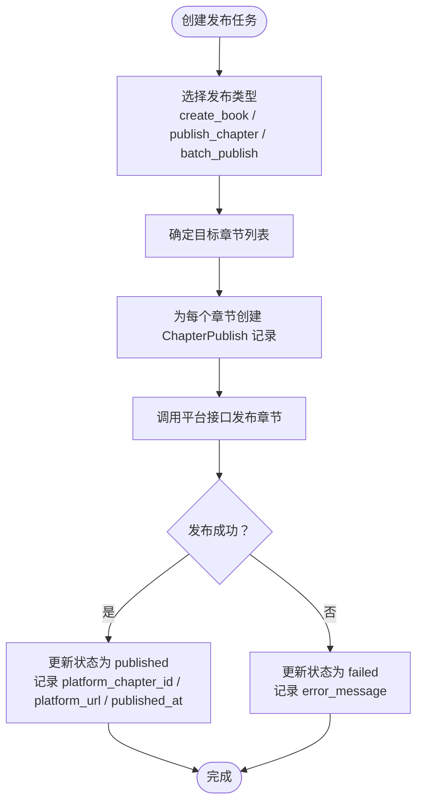
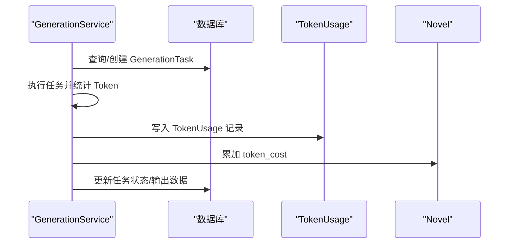
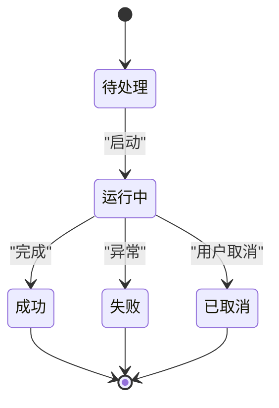
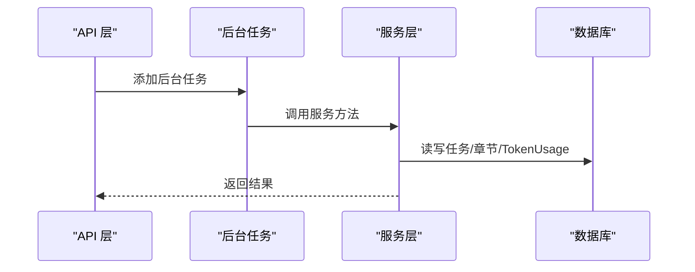
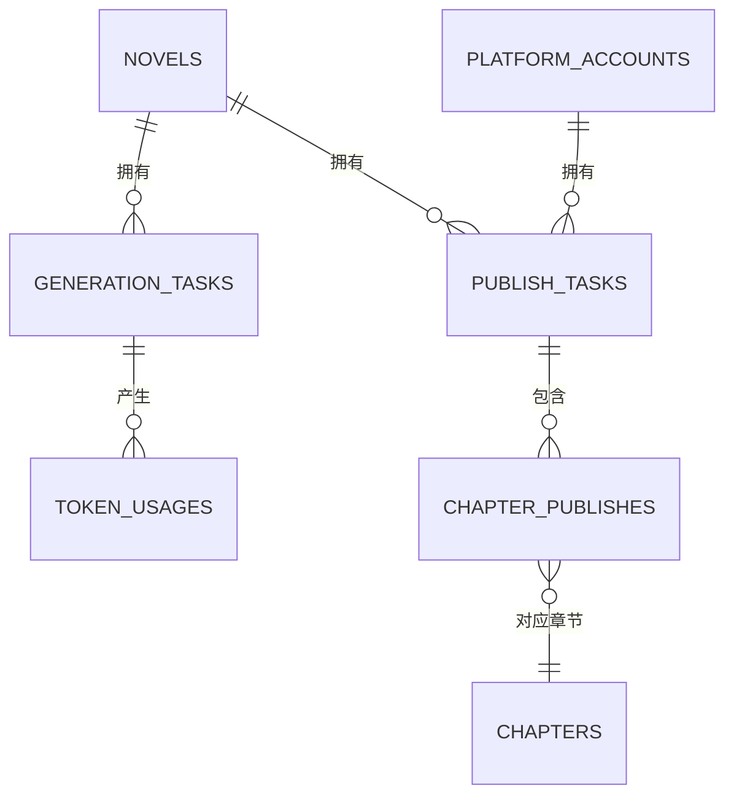

# 任务管理模型

<cite>
**本文引用的文件**
- [core/models/generation_task.py](file://core/models/generation_task.py)
- [core/models/publish_task.py](file://core/models/publish_task.py)
- [core/models/chapter_publish.py](file://core/models/chapter_publish.py)
- [core/models/token_usage.py](file://core/models/token_usage.py)
- [core/models/novel.py](file://core/models/novel.py)
- [core/models/platform_account.py](file://core/models/platform_account.py)
- [core/models/chapter.py](file://core/models/chapter.py)
- [backend/services/generation_service.py](file://backend/services/generation_service.py)
- [backend/services/publishing_service.py](file://backend/services/publishing_service.py)
- [backend/api/v1/generation.py](file://backend/api/v1/generation.py)
- [backend/api/v1/publishing.py](file://backend/api/v1/publishing.py)
- [workers/celery_app.py](file://workers/celery_app.py)
- [core/database.py](file://core/database.py)
- [alembic/versions/fc4ecf252bbb_add_crawler_and_publishing_system.py](file://alembic/versions/fc4ecf252bbb_add_crawler_and_publishing_system.py)
</cite>

## 目录
1. [简介](#简介)
2. [项目结构](#项目结构)
3. [核心组件](#核心组件)
4. [架构总览](#架构总览)
5. [详细组件分析](#详细组件分析)
6. [依赖分析](#依赖分析)
7. [性能考虑](#性能考虑)
8. [故障排查指南](#故障排查指南)
9. [结论](#结论)
10. [附录](#附录)

## 简介
本文件围绕小说生成系统的“任务管理”相关模型进行系统化文档化，重点覆盖以下实体与流程：
- 生成任务 GenerationTask：涵盖任务类型、状态、输入输出、日志、成本统计与生命周期管理。
- 发布任务 PublishTask：涵盖发布类型、状态、目标章节、平台账号绑定与结果汇总。
- 章节发布 ChapterPublish：涵盖章节与平台的发布记录、状态与平台侧标识。
- 令牌使用 TokenUsage：用于成本追踪与预算控制，支持按任务与小说维度统计。
- 生命周期与状态机：统一的状态枚举与状态转换规则。
- 异步执行与调度：基于 FastAPI 后台任务与 Celery 的异步处理模式。
- 平台账号与发布预览：账号凭证安全存储、发布预览与批量发布支持。

## 项目结构
任务管理相关代码主要分布在以下模块：
- 数据模型层：位于 core/models，定义 GenerationTask、PublishTask、ChapterPublish、TokenUsage 等。
- 业务服务层：位于 backend/services，实现 GenerationService 与 PublishingService 的具体逻辑。
- API 层：位于 backend/api/v1，提供任务创建、查询、取消等接口。
- 异步任务：workers/celery_app.py 提供 Celery 配置；API 层通过 BackgroundTasks 或 asyncio.create_task 触发异步执行。
- 数据库与迁移：core/database.py 定义异步引擎与会话；alembic 迁移文件定义表结构与索引。

图表来源
- [backend/api/v1/generation.py](file://backend/api/v1/generation.py#L23-L103)
- [backend/api/v1/publishing.py](file://backend/api/v1/publishing.py#L157-L231)
- [backend/services/generation_service.py](file://backend/services/generation_service.py#L27-L689)
- [backend/services/publishing_service.py](file://backend/services/publishing_service.py#L21-L275)
- [workers/celery_app.py](file://workers/celery_app.py#L1-L26)
- [core/models/generation_task.py](file://core/models/generation_task.py#L27-L47)
- [core/models/publish_task.py](file://core/models/publish_task.py#L29-L51)
- [core/models/chapter_publish.py](file://core/models/chapter_publish.py#L21-L39)
- [core/models/token_usage.py](file://core/models/token_usage.py#L11-L25)
- [core/models/novel.py](file://core/models/novel.py#L37-L66)
- [core/models/platform_account.py](file://core/models/platform_account.py#L21-L38)
- [core/models/chapter.py](file://core/models/chapter.py#L18-L45)

章节来源
- [backend/api/v1/generation.py](file://backend/api/v1/generation.py#L1-L171)
- [backend/api/v1/publishing.py](file://backend/api/v1/publishing.py#L1-L369)
- [backend/services/generation_service.py](file://backend/services/generation_service.py#L1-L689)
- [backend/services/publishing_service.py](file://backend/services/publishing_service.py#L1-L275)
- [workers/celery_app.py](file://workers/celery_app.py#L1-L26)
- [core/models/generation_task.py](file://core/models/generation_task.py#L1-L47)
- [core/models/publish_task.py](file://core/models/publish_task.py#L1-L51)
- [core/models/chapter_publish.py](file://core/models/chapter_publish.py#L1-L39)
- [core/models/token_usage.py](file://core/models/token_usage.py#L1-L25)
- [core/models/novel.py](file://core/models/novel.py#L1-L66)
- [core/models/platform_account.py](file://core/models/platform_account.py#L1-L38)
- [core/models/chapter.py](file://core/models/chapter.py#L1-L45)
- [core/database.py](file://core/database.py#L1-L35)
- [alembic/versions/fc4ecf252bbb_add_crawler_and_publishing_system.py](file://alembic/versions/fc4ecf252bbb_add_crawler_and_publishing_system.py#L21-L172)

## 核心组件
本节对四大核心任务模型进行深入解析，包括字段设计、关系映射、约束与用途。

- GenerationTask（生成任务）
  - 关键字段：任务ID、所属小说、任务类型、状态、阶段、输入输出、代理日志、Token用量、成本、错误信息、起止时间、创建时间。
  - 关系：与 Novel（一对多）、TokenUsage（一对多，级联删除）。
  - 用途：统一承载规划、单章写作、批量写作等任务的生命周期与结果。

- PublishTask（发布任务）
  - 关键字段：任务ID、所属小说、平台账号、发布类型、目标章节列表、状态、进度、结果汇总、错误信息、起止时间、创建/更新时间。
  - 关系：与 Novel、PlatformAccount（一对多），与 ChapterPublish（一对多，级联删除）。
  - 用途：统一承载创建书籍、发布章节、批量发布的任务编排。

- ChapterPublish（章节发布）
  - 关键字段：记录ID、所属发布任务、章节、章节号、平台侧章节ID与URL、状态、错误信息、发布时间、创建时间。
  - 关系：与 PublishTask、Chapter（多对一）。
  - 用途：细粒度记录每个章节在各平台的发布状态与结果。

- TokenUsage（令牌使用）
  - 关键字段：记录ID、所属小说、任务、代理名称、提示Token、补全Token、总Token、成本、时间戳。
  - 关系：与 GenerationTask（多对一）。
  - 用途：按任务与小说维度统计Token消耗与费用，支撑成本控制与预算管理。

章节来源
- [core/models/generation_task.py](file://core/models/generation_task.py#L27-L47)
- [core/models/publish_task.py](file://core/models/publish_task.py#L29-L51)
- [core/models/chapter_publish.py](file://core/models/chapter_publish.py#L21-L39)
- [core/models/token_usage.py](file://core/models/token_usage.py#L11-L25)

## 架构总览
任务管理采用“API → 服务 → 模型”的分层架构，结合异步执行与数据库事务，确保高可靠与可观测性。

图表来源
- [backend/api/v1/generation.py](file://backend/api/v1/generation.py#L23-L103)
- [backend/api/v1/publishing.py](file://backend/api/v1/publishing.py#L157-L231)
- [backend/services/generation_service.py](file://backend/services/generation_service.py#L36-L205)
- [backend/services/publishing_service.py](file://backend/services/publishing_service.py#L144-L209)

## 详细组件分析

### GenerationTask 实体设计
- 任务类型（TaskType）：planning、writing、editing、batch_writing。
- 任务状态（TaskStatus）：pending、running、completed、failed、cancelled。
- 输入输出：input_data、output_data 支持 JSONB 存储复杂上下文；agent_logs 记录代理交互。
- 成本与统计：token_usage、cost 字段用于累计 Token 用量与费用；与 TokenUsage 建立一对多关系。
- 时间戳：started_at、completed_at、created_at 精确记录生命周期节点。
- 关系：与 Novel（back_populates）与 TokenUsage（back_populates，级联删除）。

图表来源
- [core/models/generation_task.py](file://core/models/generation_task.py#L27-L47)
- [core/models/token_usage.py](file://core/models/token_usage.py#L11-L25)
- [core/models/novel.py](file://core/models/novel.py#L37-L66)

章节来源
- [core/models/generation_task.py](file://core/models/generation_task.py#L12-L47)
- [backend/api/v1/generation.py](file://backend/api/v1/generation.py#L23-L103)
- [backend/services/generation_service.py](file://backend/services/generation_service.py#L36-L205)

### PublishTask 实体设计
- 发布类型（PublishType）：create_book、publish_chapter、batch_publish。
- 发布状态（PublishTaskStatus）：pending、running、completed、failed、cancelled。
- 目标章节：target_chapters 数组，用于批量发布场景。
- 结果汇总：progress、result_summary 用于记录执行进度与最终结果。
- 关系：与 Novel、PlatformAccount（一对多），与 ChapterPublish（一对多，级联删除）。

图表来源
- [core/models/publish_task.py](file://core/models/publish_task.py#L29-L51)
- [core/models/chapter_publish.py](file://core/models/chapter_publish.py#L21-L39)
- [core/models/platform_account.py](file://core/models/platform_account.py#L21-L38)
- [core/models/novel.py](file://core/models/novel.py#L37-L66)

章节来源
- [core/models/publish_task.py](file://core/models/publish_task.py#L13-L51)
- [backend/api/v1/publishing.py](file://backend/api/v1/publishing.py#L157-L231)
- [backend/services/publishing_service.py](file://backend/services/publishing_service.py#L144-L209)

### ChapterPublish 实体设计
- 发布状态（PublishStatus）：pending、publishing、published、failed。
- 平台侧标识：platform_chapter_id、platform_url 记录平台返回的章节ID与链接。
- 关联关系：与 PublishTask（多对一）、Chapter（多对一）。
- 用途：跟踪每个章节在不同平台的发布状态，支持回溯与重试。

图表来源
- [core/models/chapter_publish.py](file://core/models/chapter_publish.py#L13-L39)
- [backend/services/publishing_service.py](file://backend/services/publishing_service.py#L144-L209)

章节来源
- [core/models/chapter_publish.py](file://core/models/chapter_publish.py#L13-L39)
- [backend/api/v1/publishing.py](file://backend/api/v1/publishing.py#L305-L339)
- [backend/services/publishing_service.py](file://backend/services/publishing_service.py#L212-L275)

### TokenUsage 实体与成本控制
- 字段：按任务维度统计 prompt_tokens、completion_tokens、total_tokens、cost，便于成本归集与预算控制。
- 关系：与 GenerationTask（多对一），支持按任务聚合统计。
- 与小说成本集成：服务层在任务完成后累加 Novel.token_cost，形成全局成本视图。

图表来源
- [backend/services/generation_service.py](file://backend/services/generation_service.py#L164-L196)
- [backend/services/generation_service.py](file://backend/services/generation_service.py#L340-L370)
- [backend/services/generation_service.py](file://backend/services/generation_service.py#L525-L543)
- [core/models/token_usage.py](file://core/models/token_usage.py#L11-L25)
- [core/models/novel.py](file://core/models/novel.py#L54-L55)

章节来源
- [core/models/token_usage.py](file://core/models/token_usage.py#L11-L25)
- [backend/services/generation_service.py](file://backend/services/generation_service.py#L164-L196)
- [backend/services/generation_service.py](file://backend/services/generation_service.py#L340-L370)
- [backend/services/generation_service.py](file://backend/services/generation_service.py#L525-L543)

### 任务生命周期与状态转换
- 通用规则：任务从 pending → running → completed/failed/cancelled；不可逆地进入终态。
- GenerationTask：支持 planning、writing、batch_writing 三类任务；状态由服务层驱动更新。
- PublishTask：支持 create_book、publish_chapter、batch_publish 三类任务；状态由服务层驱动更新。
- 取消规则：仅在非终态时允许取消，否则拒绝操作。

图表来源
- [core/models/generation_task.py](file://core/models/generation_task.py#L19-L25)
- [core/models/publish_task.py](file://core/models/publish_task.py#L20-L27)
- [backend/api/v1/generation.py](file://backend/api/v1/generation.py#L152-L171)
- [backend/api/v1/publishing.py](file://backend/api/v1/publishing.py#L284-L303)

章节来源
- [backend/api/v1/generation.py](file://backend/api/v1/generation.py#L152-L171)
- [backend/api/v1/publishing.py](file://backend/api/v1/publishing.py#L284-L303)

### 任务调度机制与异步处理
- 生成任务：API 层通过 BackgroundTasks 将任务放入后台队列，服务层在独立会话中执行 run_planning/run_chapter_writing/run_batch_writing。
- 发布任务：API 层通过 asyncio.create_task 异步触发 PublishingService.run_publish_task。
- Celery：workers/celery_app.py 提供 Celery 应用配置（序列化、时区、超时、并发等），可用于扩展长耗时任务的分布式执行。

图表来源
- [backend/api/v1/generation.py](file://backend/api/v1/generation.py#L72-L103)
- [backend/api/v1/publishing.py](file://backend/api/v1/publishing.py#L222-L231)
- [workers/celery_app.py](file://workers/celery_app.py#L6-L23)

章节来源
- [backend/api/v1/generation.py](file://backend/api/v1/generation.py#L23-L103)
- [backend/api/v1/publishing.py](file://backend/api/v1/publishing.py#L157-L231)
- [workers/celery_app.py](file://workers/celery_app.py#L1-L26)

## 依赖分析
- 数据库关系
  - GenerationTask ←→ TokenUsage：一对多，任务级成本统计。
  - PublishTask ←→ ChapterPublish：一对多，章节级发布记录。
  - PublishTask ←→ PlatformAccount：多对一，平台账号绑定。
  - GenerationTask ←→ Novel：多对一，任务归属小说。
  - PublishTask ←→ Novel：多对一，任务归属小说。
  - ChapterPublish ←→ Chapter：多对一，章节归属。
- 外键约束与级联删除：所有任务相关子表均设置 CASCADE 删除，避免悬挂数据。
- 索引与查询优化：迁移脚本为常用过滤字段建立索引（如 publish_tasks 的 novel_id、status）。

图表来源
- [alembic/versions/fc4ecf252bbb_add_crawler_and_publishing_system.py](file://alembic/versions/fc4ecf252bbb_add_crawler_and_publishing_system.py#L77-L116)
- [core/models/novel.py](file://core/models/novel.py#L63-L66)
- [core/models/publish_task.py](file://core/models/publish_task.py#L48-L51)
- [core/models/chapter_publish.py](file://core/models/chapter_publish.py#L37-L39)
- [core/models/generation_task.py](file://core/models/generation_task.py#L45-L46)
- [core/models/token_usage.py](file://core/models/token_usage.py#L24-L25)

章节来源
- [alembic/versions/fc4ecf252bbb_add_crawler_and_publishing_system.py](file://alembic/versions/fc4ecf252bbb_add_crawler_and_publishing_system.py#L21-L172)
- [core/models/novel.py](file://core/models/novel.py#L37-L66)
- [core/models/publish_task.py](file://core/models/publish_task.py#L29-L51)
- [core/models/chapter_publish.py](file://core/models/chapter_publish.py#L21-L39)
- [core/models/generation_task.py](file://core/models/generation_task.py#L27-L47)
- [core/models/token_usage.py](file://core/models/token_usage.py#L11-L25)

## 性能考虑
- 异步执行：生成与发布任务通过后台任务异步执行，避免阻塞请求线程。
- 会话管理：服务层使用独立的异步会话工厂，确保任务执行与主请求会话隔离。
- 数据库连接池：异步引擎配置了合理的 pool_size 与 max_overflow，满足并发需求。
- 索引优化：迁移脚本为高频查询字段建立索引，降低查询延迟。
- Celery 参数：workers/celery_app.py 设置了任务序列化、UTC 时区、软/硬超时、prefetch 控制与并发，适合长任务场景。

章节来源
- [core/database.py](file://core/database.py#L11-L22)
- [alembic/versions/fc4ecf252bbb_add_crawler_and_publishing_system.py](file://alembic/versions/fc4ecf252bbb_add_crawler_and_publishing_system.py#L41-L42)
- [alembic/versions/fc4ecf252bbb_add_crawler_and_publishing_system.py](file://alembic/versions/fc4ecf252bbb_add_crawler_and_publishing_system.py#L97-L98)
- [alembic/versions/fc4ecf252bbb_add_crawler_and_publishing_system.py](file://alembic/versions/fc4ecf252bbb_add_crawler_and_publishing_system.py#L117-L117)
- [workers/celery_app.py](file://workers/celery_app.py#L12-L23)

## 故障排查指南
- 任务状态异常
  - 确认任务当前状态是否为终态（completed/failed/cancelled），若已是终态则无法取消。
  - 检查服务层是否正确捕获异常并设置 error_message。
- 发布任务失败
  - 核对平台账号状态是否为 active，确认凭证解密是否成功。
  - 检查发布类型与目标章节配置是否正确。
- Token 成本统计不一致
  - 确认服务层在任务完成后是否正确累加 Novel.token_cost。
  - 检查 TokenUsage 是否按任务维度正确写入。
- 数据一致性
  - 确保外键约束与 CASCADE 删除生效，避免孤儿记录。
  - 如需回滚，检查数据库事务是否正确提交/回滚。

章节来源
- [backend/api/v1/generation.py](file://backend/api/v1/generation.py#L152-L171)
- [backend/api/v1/publishing.py](file://backend/api/v1/publishing.py#L284-L303)
- [backend/services/publishing_service.py](file://backend/services/publishing_service.py#L114-L139)
- [backend/services/generation_service.py](file://backend/services/generation_service.py#L198-L204)
- [backend/services/generation_service.py](file://backend/services/generation_service.py#L557-L563)

## 结论
该任务管理模型以清晰的实体边界与强一致的关系设计，配合异步执行与成本统计能力，为小说生成与发布的自动化提供了稳健基础。建议在生产环境中：
- 明确任务超时与重试策略，结合 Celery 的可靠性特性扩展长任务处理。
- 对高频查询字段持续监控索引命中率，必要时增加复合索引。
- 强化异常与审计日志，确保任务失败可追溯、成本可核算。

## 附录
- 平台账号管理：支持创建、更新、验证与凭证加密存储，保障发布任务的安全性。
- 发布预览：根据小说与章节状态生成发布预览，辅助用户决策批量发布范围。
- 批量发布：支持按章节区间批量发布，自动汇总结果并更新任务状态。

章节来源
- [backend/api/v1/publishing.py](file://backend/api/v1/publishing.py#L38-L151)
- [backend/api/v1/publishing.py](file://backend/api/v1/publishing.py#L212-L275)
- [backend/services/publishing_service.py](file://backend/services/publishing_service.py#L32-L139)
- [backend/services/publishing_service.py](file://backend/services/publishing_service.py#L212-L275)