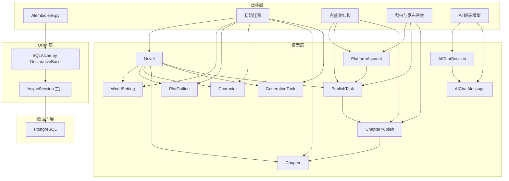
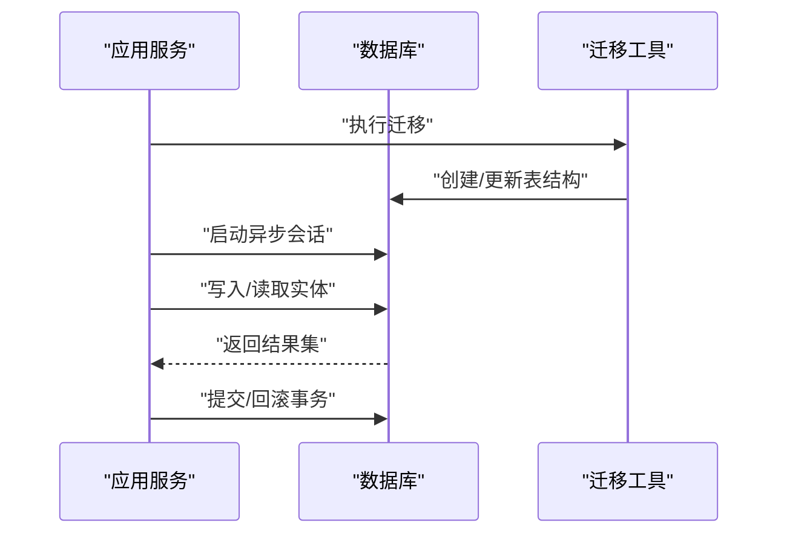
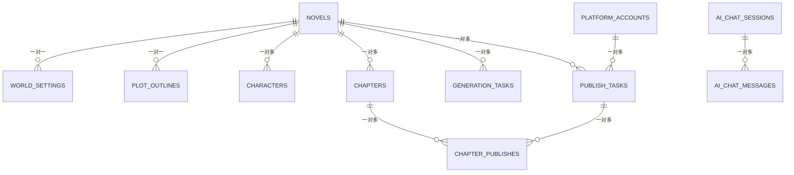
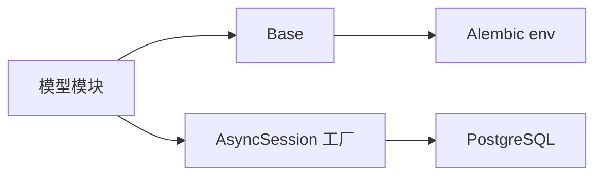

# 实体关系映射

<cite>
**本文引用的文件**
- [core/models/__init__.py](file://core/models/__init__.py)
- [core/database.py](file://core/database.py)
- [alembic/env.py](file://alembic/env.py)
- [alembic/versions/5badc20e064a_initial_tables.py](file://alembic/versions/5badc20e064a_initial_tables.py)
- [alembic/versions/186700edca0b_fix_complete_database_tables.py](file://alembic/versions/186700edca0b_fix_complete_database_tables.py)
- [alembic/versions/fc4ecf252bbb_add_crawler_and_publishing_system.py](file://alembic/versions/fc4ecf252bbb_add_crawler_and_publishing_system.py)
- [alembic/versions/b5dd1dd83814_add_ai_chat_session_models.py](file://alembic/versions/b5dd1dd83814_add_ai_chat_session_models.py)
- [core/models/novel.py](file://core/models/novel.py)
- [core/models/character.py](file://core/models/character.py)
- [core/models/chapter.py](file://core/models/chapter.py)
- [core/models/world_setting.py](file://core/models/world_setting.py)
- [core/models/plot_outline.py](file://core/models/plot_outline.py)
- [core/models/generation_task.py](file://core/models/generation_task.py)
- [core/models/platform_account.py](file://core/models/platform_account.py)
- [core/models/publish_task.py](file://core/models/publish_task.py)
- [core/models/chapter_publish.py](file://core/models/chapter_publish.py)
- [core/models/ai_chat_session.py](file://core/models/ai_chat_session.py)
</cite>

## 目录
1. [简介](#简介)
2. [项目结构](#项目结构)
3. [核心组件](#核心组件)
4. [架构总览](#架构总览)
5. [详细组件分析](#详细组件分析)
6. [依赖分析](#依赖分析)
7. [性能考量](#性能考量)
8. [故障排查指南](#故障排查指南)
9. [结论](#结论)
10. [附录](#附录)

## 简介
本文件为小说生成系统提供全面的数据实体关系映射与优化指导，覆盖小说、角色、章节、任务、平台账户等核心实体及其关联关系。文档从 ERD 图、外键与级联策略、查询优化、数据完整性保障、数据访问模式、迁移与版本兼容、反规范化设计等方面进行系统化梳理，面向数据库管理员与系统架构师。

## 项目结构
后端采用 SQLAlchemy ORM + PostgreSQL，通过 Alembic 进行迁移管理；数据库层以异步会话提供连接池与事务控制；模型定义集中在 core/models 下，并在 Alembic 迁移脚本中逐步演进。

图表来源
- [core/database.py](file://core/database.py#L7-L35)
- [alembic/env.py](file://alembic/env.py#L15-L31)
- [alembic/versions/5badc20e064a_initial_tables.py](file://alembic/versions/5badc20e064a_initial_tables.py#L24-L166)
- [alembic/versions/186700edca0b_fix_complete_database_tables.py](file://alembic/versions/186700edca0b_fix_complete_database_tables.py#L40-L246)
- [alembic/versions/fc4ecf252bbb_add_crawler_and_publishing_system.py](file://alembic/versions/fc4ecf252bbb_add_crawler_and_publishing_system.py#L24-L134)
- [alembic/versions/b5dd1dd83814_add_ai_chat_session_models.py](file://alembic/versions/b5dd1dd83814_add_ai_chat_session_models.py#L24-L46)

章节来源
- [core/database.py](file://core/database.py#L1-L35)
- [alembic/env.py](file://alembic/env.py#L1-L66)

## 核心组件
- 小说：核心实体，聚合世界观、大纲、角色、章节、生成任务、发布任务。
- 角色：属于小说，描述人物设定与关系。
- 章节：属于小说，承载内容与质量度量。
- 世界设定：一对一绑定小说，存储世界观全量信息。
- 故事大纲：一对一绑定小说，存储结构化剧情。
- 生成任务：属于小说，记录生成过程与成本。
- 平台账号：独立实体，用于发布凭证与状态管理。
- 发布任务：属于小说与平台账号，驱动发布流程。
- 章节发布记录：属于发布任务与章节，跟踪发布状态。
- AI 聊天会话与消息：独立实体，支持对话上下文与检索。

章节来源
- [core/models/__init__.py](file://core/models/__init__.py#L13-L40)
- [core/models/novel.py](file://core/models/novel.py#L37-L66)
- [core/models/character.py](file://core/models/character.py#L31-L54)
- [core/models/chapter.py](file://core/models/chapter.py#L18-L45)
- [core/models/world_setting.py](file://core/models/world_setting.py#L11-L29)
- [core/models/plot_outline.py](file://core/models/plot_outline.py#L11-L27)
- [core/models/generation_task.py](file://core/models/generation_task.py#L27-L47)
- [core/models/platform_account.py](file://core/models/platform_account.py#L21-L38)
- [core/models/publish_task.py](file://core/models/publish_task.py#L29-L51)
- [core/models/chapter_publish.py](file://core/models/chapter_publish.py#L21-L39)
- [core/models/ai_chat_session.py](file://core/models/ai_chat_session.py#L17-L36)

## 架构总览
系统采用“模型即契约”的设计：模型文件定义实体与关系，Alembic 迁移确保数据库结构与模型一致；异步会话提供高并发下的事务与连接池能力。

图表来源
- [alembic/env.py](file://alembic/env.py#L46-L65)
- [core/database.py](file://core/database.py#L25-L35)

## 详细组件分析

### 实体关系图（ERD）

图表来源
- [core/models/novel.py](file://core/models/novel.py#L60-L66)
- [core/models/world_setting.py](file://core/models/world_setting.py#L15-L28)
- [core/models/plot_outline.py](file://core/models/plot_outline.py#L15-L26)
- [core/models/character.py](file://core/models/character.py#L35-L53)
- [core/models/chapter.py](file://core/models/chapter.py#L22-L39)
- [core/models/generation_task.py](file://core/models/generation_task.py#L31-L46)
- [core/models/platform_account.py](file://core/models/platform_account.py#L25-L37)
- [core/models/publish_task.py](file://core/models/publish_task.py#L34-L50)
- [core/models/chapter_publish.py](file://core/models/chapter_publish.py#L26-L38)
- [core/models/ai_chat_session.py](file://core/models/ai_chat_session.py#L21-L35)

### 外键与级联策略
- 小说到子实体（世界设定、故事大纲、角色、章节、生成任务、发布任务）：ondelete="CASCADE"，删除小说时级联删除子实体。
- 发布任务到平台账号：ondelete="CASCADE"，删除账号将级联删除相关发布任务。
- 发布任务到章节发布记录：ondelete="CASCADE"，删除任务级联删除发布记录。
- 章节发布记录到章节：ondelete="CASCADE"，删除章节级联删除发布记录。
- AI 聊天消息到会话：外键约束，会话删除策略由会话侧决定（无 CASCADE）。

章节来源
- [core/models/world_setting.py](file://core/models/world_setting.py#L15-L28)
- [core/models/plot_outline.py](file://core/models/plot_outline.py#L15-L26)
- [core/models/character.py](file://core/models/character.py#L35-L53)
- [core/models/chapter.py](file://core/models/chapter.py#L22-L39)
- [core/models/generation_task.py](file://core/models/generation_task.py#L31-L46)
- [core/models/publish_task.py](file://core/models/publish_task.py#L34-L50)
- [core/models/chapter_publish.py](file://core/models/chapter_publish.py#L26-L38)
- [alembic/versions/5badc20e064a_initial_tables.py](file://alembic/versions/5badc20e064a_initial_tables.py#L148-L151)
- [alembic/versions/186700edca0b_fix_complete_database_tables.py](file://alembic/versions/186700edca0b_fix_complete_database_tables.py#L214-L232)
- [alembic/versions/fc4ecf252bbb_add_crawler_and_publishing_system.py](file://alembic/versions/fc4ecf252bbb_add_crawler_and_publishing_system.py#L93-L115)

### 查询优化策略
- 索引设计
  - AI 聊天：会话表的 session_id、scene；消息表的 created_at、session_id。
  - 爬虫任务：platform、status 组合索引；created_at 索引。
  - 发布任务：novel_id、status 索引。
  - 章节发布：publish_task_id 索引。
- 连接策略
  - 使用关系属性进行急加载（back_populates）以减少 N+1 查询。
  - 对于大体量列表（如章节、角色），建议在查询时显式选择需要的列或分页。
- 性能优化技巧
  - 利用数组字段（characters_appeared）快速过滤章节涉及的角色。
  - 使用 JSONB 字段存储结构化数据，配合 PostgreSQL 的 JSONB 操作符与 GIN/BRIN 索引（可按需扩展）。
  - 对高频过滤字段（如 status、chapter_number）建立复合索引。

章节来源
- [core/models/ai_chat_session.py](file://core/models/ai_chat_session.py#L21-L35)
- [alembic/versions/b5dd1dd83814_add_ai_chat_session_models.py](file://alembic/versions/b5dd1dd83814_add_ai_chat_session_models.py#L33-L45)
- [alembic/versions/fc4ecf252bbb_add_crawler_and_publishing_system.py](file://alembic/versions/fc4ecf252bbb_add_crawler_and_publishing_system.py#L41-L42)
- [alembic/versions/fc4ecf252bbb_add_crawler_and_publishing_system.py](file://alembic/versions/fc4ecf252bbb_add_crawler_and_publishing_system.py#L97-L98)
- [alembic/versions/fc4ecf252bbb_add_crawler_and_publishing_system.py](file://alembic/versions/fc4ecf252bbb_add_crawler_and_publishing_system.py#L117-L117)

### 数据完整性保障
- 约束检查
  - 唯一性：世界设定、故事大纲对 novel_id 的唯一约束。
  - 非空：标题、类型枚举、章节号等关键字段非空。
- 触发器与审计
  - 未发现显式触发器；通过 onupdate 与 server_default 记录时间戳。
- 事务处理
  - 异步会话在请求生命周期内自动提交或回滚，异常时回滚并抛出。

章节来源
- [core/models/world_setting.py](file://core/models/world_setting.py#L15-L28)
- [core/models/plot_outline.py](file://core/models/plot_outline.py#L15-L26)
- [core/models/chapter.py](file://core/models/chapter.py#L22-L39)
- [core/database.py](file://core/database.py#L25-L35)

### 数据访问模式
- 急加载：通过 relationship/back_populates 在查询主实体时一次性加载关联集合。
- 懒加载：默认延迟加载，适合仅访问主实体字段的场景。
- 批量获取：对角色、章节等集合型关系，建议分页或批量查询以降低内存压力。
- 关系维护：使用级联删除/孤儿删除（delete-orphan）确保子实体生命周期与父实体一致。

章节来源
- [core/models/novel.py](file://core/models/novel.py#L60-L66)
- [core/models/generation_task.py](file://core/models/generation_task.py#L46-L46)

### 数据迁移路径与版本兼容
- 初始版本：创建小说、角色、章节、生成任务、世界设定、故事大纲、令牌用量等核心表。
- 完善版本：新增爬虫任务、爬取结果、平台账号、发布任务、章节发布记录、读者偏好扩展。
- AI 聊天版本：新增 AI 聊天会话与消息表，并建立相应索引。
- 版本兼容：迁移脚本按修订 ID 顺序执行，降级时按依赖逆序删除，枚举类型安全删除。

章节来源
- [alembic/versions/5badc20e064a_initial_tables.py](file://alembic/versions/5badc20e064a_initial_tables.py#L21-L181)
- [alembic/versions/186700edca0b_fix_complete_database_tables.py](file://alembic/versions/186700edca0b_fix_complete_database_tables.py#L21-L267)
- [alembic/versions/fc4ecf252bbb_add_crawler_and_publishing_system.py](file://alembic/versions/fc4ecf252bbb_add_crawler_and_publishing_system.py#L21-L172)
- [alembic/versions/b5dd1dd83814_add_ai_chat_session_models.py](file://alembic/versions/b5dd1dd83814_add_ai_chat_session_models.py#L21-L59)

### 反规范化设计考虑
- 章节表保留 characters_appeared 数组，便于快速筛选章节涉及角色，减少 JOIN。
- 世界设定与故事大纲以 JSONB 存储复杂结构，避免过度拆分导致查询复杂度上升。
- 令牌用量与生成任务以 JSONB 存储日志与中间结果，利于后期分析但需注意查询性能。

章节来源
- [core/models/chapter.py](file://core/models/chapter.py#L30-L30)
- [core/models/world_setting.py](file://core/models/world_setting.py#L18-L24)
- [core/models/plot_outline.py](file://core/models/plot_outline.py#L17-L22)
- [core/models/generation_task.py](file://core/models/generation_task.py#L35-L40)

## 依赖分析
- 模块耦合
  - 模型层通过统一 Base 继承，集中注册到 Alembic 元数据。
  - 数据库层提供异步会话工厂，贯穿应用生命周期。
- 外部依赖
  - SQLAlchemy ORM 与 PostgreSQL JSONB/数组类型。
  - Alembic 迁移工具链。

图表来源
- [core/models/__init__.py](file://core/models/__init__.py#L13-L40)
- [core/database.py](file://core/database.py#L7-L22)
- [alembic/env.py](file://alembic/env.py#L15-L31)

章节来源
- [core/models/__init__.py](file://core/models/__init__.py#L13-L40)
- [core/database.py](file://core/database.py#L1-L35)
- [alembic/env.py](file://alembic/env.py#L1-L66)

## 性能考量
- 连接池与并发
  - 异步引擎配置了连接池大小，适合高并发场景。
- 查询路径
  - 建议对高频过滤字段建立复合索引；对 JSONB 字段使用合适的操作符与索引策略。
- 写入路径
  - 批量写入章节/发布记录时，优先使用批量插入以减少往返。
- 缓存与归档
  - 历史生成任务与发布记录可定期归档至冷存储，降低热表膨胀。

## 故障排查指南
- 迁移失败
  - 检查 DATABASE_URL 与同步 URL 设置是否一致；确认 Alembic 目标元数据已注册。
- 级联删除异常
  - 确认父实体删除前已断开子实体引用；检查 ondelete 策略是否符合预期。
- 查询慢
  - 分析索引使用情况；对大集合查询增加分页与选择性过滤条件。
- 事务问题
  - 确保异常时会话回滚；避免在事务中执行长时间阻塞操作。

章节来源
- [alembic/env.py](file://alembic/env.py#L24-L25)
- [core/database.py](file://core/database.py#L25-L35)

## 结论
该系统以清晰的实体边界与严格的外键/级联策略构建了小说生成的完整数据骨架。通过 Alembic 的版本化管理与异步 ORM 的并发能力，既保证了演进的可控性，也兼顾了运行时性能。建议在后续迭代中持续完善索引策略与 JSONB 查询优化，并对历史数据实施合理的归档与压缩策略。

## 附录
- 关键字段与类型
  - UUID 主键、JSONB 结构化数据、数组字段、枚举类型、数值与文本字段。
- 常用查询模式
  - 通过 novel_id 快速定位子实体；利用 status、chapter_number 等字段进行过滤与排序。
- 维护建议
  - 定期审查索引使用率；对热点表进行分区或物化视图优化；对 JSONB 字段建立表达式索引以提升查询效率。