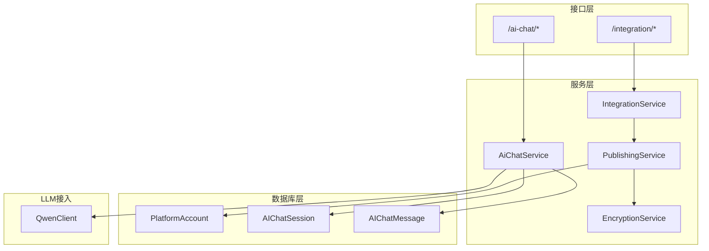
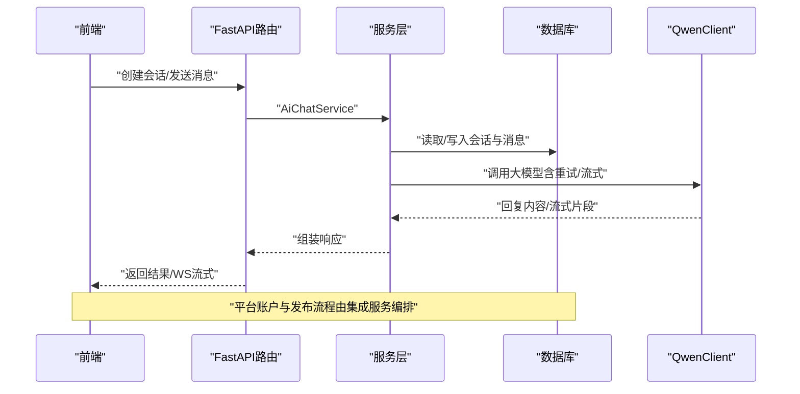
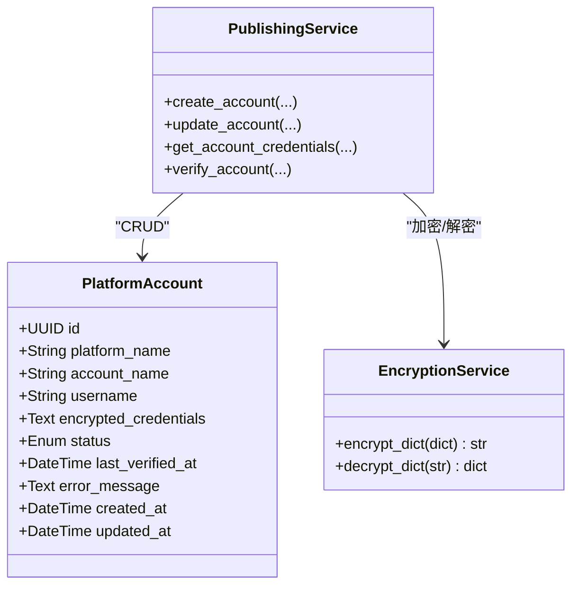
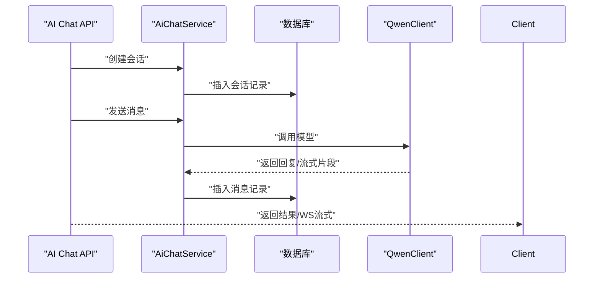
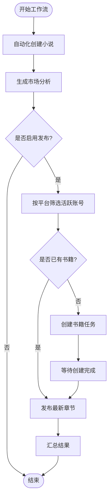
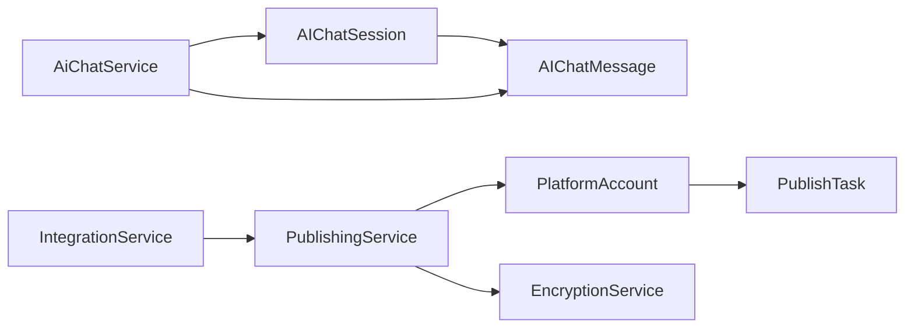

# 平台集成模型

<cite>
**本文引用的文件**
- [core/models/platform_account.py](file://core/models/platform_account.py)
- [core/models/ai_chat_session.py](file://core/models/ai_chat_session.py)
- [core/models/__init__.py](file://core/models/__init__.py)
- [alembic/versions/b5dd1dd83814_add_ai_chat_session_models.py](file://alembic/versions/b5dd1dd83814_add_ai_chat_session_models.py)
- [alembic/versions/5badc20e064a_initial_tables.py](file://alembic/versions/5badc20e064a_initial_tables.py)
- [backend/services/integration_service.py](file://backend/services/integration_service.py)
- [backend/services/ai_chat_service.py](file://backend/services/ai_chat_service.py)
- [backend/api/v1/integration.py](file://backend/api/v1/integration.py)
- [backend/api/v1/ai_chat.py](file://backend/api/v1/ai_chat.py)
- [core/database.py](file://core/database.py)
- [backend/services/publishing_service.py](file://backend/services/publishing_service.py)
- [llm/qwen_client.py](file://llm/qwen_client.py)
- [backend/schemas/ai_chat.py](file://backend/schemas/ai_chat.py)
- [backend/services/encryption_service.py](file://backend/services/encryption_service.py)
</cite>

## 目录
1. [引言](#引言)
2. [项目结构](#项目结构)
3. [核心组件](#核心组件)
4. [架构总览](#架构总览)
5. [详细组件分析](#详细组件分析)
6. [依赖关系分析](#依赖关系分析)
7. [性能考量](#性能考量)
8. [故障排查指南](#故障排查指南)
9. [结论](#结论)
10. [附录](#附录)

## 引言
本文件聚焦小说生成系统的“平台集成与AI聊天”两大主题，围绕平台账户（PlatformAccount）与AI聊天会话（AIChatSession/AIChatMessage）两类核心模型展开，系统性阐述其数据结构、业务语义、与系统其他模块的集成方式，以及在第三方平台对接、用户认证授权、消息路由、数据安全与一致性保障等方面的实践要点。文档同时提供面向系统集成工程师与安全架构师的专业指导。

## 项目结构
本项目采用分层清晰的组织方式：
- 数据库层：通过SQLAlchemy ORM定义模型，Alembic迁移脚本管理表结构演进
- 服务层：封装业务逻辑，如集成服务、AI聊天服务、发布服务、加密服务等
- 接口层：FastAPI路由暴露REST与WebSocket接口
- LLM接入：统一的通义千问客户端封装，支持重试与流式输出
- 前端：平台账户管理界面与聊天交互界面

图表来源
- [backend/api/v1/integration.py](file://backend/api/v1/integration.py#L1-L61)
- [backend/api/v1/ai_chat.py](file://backend/api/v1/ai_chat.py#L1-L400)
- [backend/services/integration_service.py](file://backend/services/integration_service.py#L1-L334)
- [backend/services/ai_chat_service.py](file://backend/services/ai_chat_service.py#L1-L800)
- [backend/services/publishing_service.py](file://backend/services/publishing_service.py#L1-L275)
- [backend/services/encryption_service.py](file://backend/services/encryption_service.py#L1-L85)
- [core/models/platform_account.py](file://core/models/platform_account.py#L1-L38)
- [core/models/ai_chat_session.py](file://core/models/ai_chat_session.py#L1-L36)
- [llm/qwen_client.py](file://llm/qwen_client.py#L1-L232)

章节来源
- [backend/api/v1/integration.py](file://backend/api/v1/integration.py#L1-L61)
- [backend/api/v1/ai_chat.py](file://backend/api/v1/ai_chat.py#L1-L400)
- [backend/services/integration_service.py](file://backend/services/integration_service.py#L1-L334)
- [backend/services/ai_chat_service.py](file://backend/services/ai_chat_service.py#L1-L800)
- [backend/services/publishing_service.py](file://backend/services/publishing_service.py#L1-L275)
- [backend/services/encryption_service.py](file://backend/services/encryption_service.py#L1-L85)
- [core/models/platform_account.py](file://core/models/platform_account.py#L1-L38)
- [core/models/ai_chat_session.py](file://core/models/ai_chat_session.py#L1-L36)
- [llm/qwen_client.py](file://llm/qwen_client.py#L1-L232)

## 核心组件
- 平台账户模型（PlatformAccount）
  - 字段设计：平台标识、账号备注名、用户名、加密凭证存储、状态、最近验证时间、错误信息、创建/更新时间
  - 关系：与发布任务（PublishTask）一对多关联，支持按平台与状态筛选
  - 状态枚举：active/inactive/expired/error
- AI聊天会话与消息模型（AIChatSession/AIChatMessage）
  - 会话：唯一会话ID、场景、上下文JSON、创建/更新时间
  - 消息：角色（user/assistant）、内容、时间索引
  - 支持按场景与会话ID建立索引，便于查询与清理

章节来源
- [core/models/platform_account.py](file://core/models/platform_account.py#L13-L38)
- [core/models/ai_chat_session.py](file://core/models/ai_chat_session.py#L17-L36)
- [core/models/__init__.py](file://core/models/__init__.py#L8-L11)
- [alembic/versions/b5dd1dd83814_add_ai_chat_session_models.py](file://alembic/versions/b5dd1dd83814_add_ai_chat_session_models.py#L21-L59)

## 架构总览
平台集成与AI聊天的端到端流程如下：

图表来源
- [backend/api/v1/ai_chat.py](file://backend/api/v1/ai_chat.py#L54-L152)
- [backend/services/ai_chat_service.py](file://backend/services/ai_chat_service.py#L359-L460)
- [llm/qwen_client.py](file://llm/qwen_client.py#L46-L162)
- [core/database.py](file://core/database.py#L25-L35)

## 详细组件分析

### 平台账户模型（PlatformAccount）
- 设计要点
  - 凭证加密存储：通过加密服务对用户名、密码及附加凭据进行序列化与加密，存入Text字段
  - 状态管理：支持激活、未激活、过期、异常等状态，便于统一治理
  - 时间戳与审计：创建/更新时间、最近验证时间、错误信息，支撑审计与排障
  - 关系映射：与发布任务一对多，便于追踪各平台账号的发布行为
- 字段与约束
  - 平台名、账号名、用户名、加密凭据、状态、时间戳等
- 安全与合规
  - 敏感信息不以明文形式落地；密钥来源于配置，必要时可生成临时密钥用于开发提示
- 生命周期
  - 创建：接收平台、账号名、用户名、密码与附加凭据，加密后入库
  - 更新：支持增量更新密码与附加凭据，内部自动解密-合并-加密
  - 验证：模拟登录验证，成功置为active，失败置为invalid并记录错误

图表来源
- [core/models/platform_account.py](file://core/models/platform_account.py#L21-L38)
- [backend/services/publishing_service.py](file://backend/services/publishing_service.py#L32-L139)
- [backend/services/encryption_service.py](file://backend/services/encryption_service.py#L10-L74)

章节来源
- [core/models/platform_account.py](file://core/models/platform_account.py#L13-L38)
- [backend/services/publishing_service.py](file://backend/services/publishing_service.py#L32-L139)
- [backend/services/encryption_service.py](file://backend/services/encryption_service.py#L10-L74)

### AI聊天会话与消息模型（AIChatSession/AIChatMessage）
- 设计要点
  - 会话：唯一session_id，场景（创作/爬虫/修订/分析），上下文JSON，便于跨轮次保留上下文
  - 消息：角色与内容，带时间索引，支持按会话检索
  - 数据持久化：会话与消息分别独立表，消息外键关联会话
- 生命周期
  - 创建：生成session_id，注入欢迎语与场景，必要时加载小说上下文
  - 运行：按轮次追加消息，支持流式回复
  - 保存：异步保存至数据库，避免阻塞主流程
  - 加载：从数据库恢复会话与消息，支持继续对话
  - 清理：按需删除会话及其消息
- 与LLM集成
  - 通过QwenClient调用大模型，支持重试与流式输出
  - 支持WebSocket流式推送，提升交互体验

图表来源
- [backend/api/v1/ai_chat.py](file://backend/api/v1/ai_chat.py#L54-L152)
- [backend/services/ai_chat_service.py](file://backend/services/ai_chat_service.py#L359-L460)
- [llm/qwen_client.py](file://llm/qwen_client.py#L163-L228)

章节来源
- [core/models/ai_chat_session.py](file://core/models/ai_chat_session.py#L17-L36)
- [backend/services/ai_chat_service.py](file://backend/services/ai_chat_service.py#L359-L460)
- [backend/api/v1/ai_chat.py](file://backend/api/v1/ai_chat.py#L54-L152)
- [llm/qwen_client.py](file://llm/qwen_client.py#L163-L228)

### 平台集成与发布流程
- 端到端工作流
  - 自动化创建小说 → 市场分析 → 多平台发布（可选）
  - 发布阶段：按平台筛选活跃账号，创建书籍或发布章节，异步等待任务完成
- 平台账号管理
  - 创建/更新/验证账号，支持解密查看与重加密更新
  - 发布任务驱动账号与平台的对接，记录结果与错误

图表来源
- [backend/services/integration_service.py](file://backend/services/integration_service.py#L26-L293)
- [backend/services/publishing_service.py](file://backend/services/publishing_service.py#L144-L200)

章节来源
- [backend/services/integration_service.py](file://backend/services/integration_service.py#L26-L293)
- [backend/services/publishing_service.py](file://backend/services/publishing_service.py#L144-L200)

## 依赖关系分析
- 模型依赖
  - 平台账户与发布任务存在一对多关系，便于按账号追踪发布行为
  - 聊天会话与消息存在一对多关系，便于按会话管理消息历史
- 服务依赖
  - AI聊天服务依赖QwenClient与记忆服务，负责会话生命周期与消息持久化
  - 集成服务编排自动化流程，依赖发布服务与生成服务
  - 发布服务依赖加密服务对敏感凭证进行加密/解密
- 接口依赖
  - FastAPI路由依赖服务层，服务层依赖数据库会话工厂

图表来源
- [core/models/ai_chat_session.py](file://core/models/ai_chat_session.py#L17-L36)
- [core/models/platform_account.py](file://core/models/platform_account.py#L21-L38)
- [backend/services/ai_chat_service.py](file://backend/services/ai_chat_service.py#L359-L460)
- [backend/services/integration_service.py](file://backend/services/integration_service.py#L17-L25)
- [backend/services/publishing_service.py](file://backend/services/publishing_service.py#L21-L27)
- [backend/services/encryption_service.py](file://backend/services/encryption_service.py#L10-L74)

章节来源
- [core/models/ai_chat_session.py](file://core/models/ai_chat_session.py#L17-L36)
- [core/models/platform_account.py](file://core/models/platform_account.py#L21-L38)
- [backend/services/ai_chat_service.py](file://backend/services/ai_chat_service.py#L359-L460)
- [backend/services/integration_service.py](file://backend/services/integration_service.py#L17-L25)
- [backend/services/publishing_service.py](file://backend/services/publishing_service.py#L21-L27)
- [backend/services/encryption_service.py](file://backend/services/encryption_service.py#L10-L74)

## 性能考量
- 数据库连接与事务
  - 使用异步引擎与会话工厂，开启连接池，减少连接开销
  - 事务在接口层统一提交/回滚，避免长事务占用资源
- 会话持久化
  - 保存会话与消息采用异步写入，避免阻塞主流程
  - 仅保存新增消息，减少重复写入
- LLM调用
  - 支持指数退避重试，降低外部依赖抖动影响
  - 流式输出降低首字延迟，提升交互体验
- 查询优化
  - 为场景与会话ID建立索引，加速查询与清理

章节来源
- [core/database.py](file://core/database.py#L11-L35)
- [backend/services/ai_chat_service.py](file://backend/services/ai_chat_service.py#L359-L460)
- [llm/qwen_client.py](file://llm/qwen_client.py#L54-L162)
- [alembic/versions/b5dd1dd83814_add_ai_chat_session_models.py](file://alembic/versions/b5dd1dd83814_add_ai_chat_session_models.py#L33-L46)

## 故障排查指南
- 平台账户
  - 凭证无法解密：检查ENCRYPTION_KEY配置是否正确
  - 账号状态异常：核对最近验证时间与错误信息字段
  - 发布任务失败：检查任务状态、错误摘要与平台返回结果
- AI聊天
  - 会话加载失败：确认session_id是否存在，数据库连接是否正常
  - LLM调用失败：检查API密钥、模型名称、基础地址与网络连通性
  - WebSocket流式异常：检查客户端连接与服务端异常捕获
- 集成工作流
  - 端到端工作流中断：查看各阶段日志与错误返回，定位失败环节

章节来源
- [backend/services/encryption_service.py](file://backend/services/encryption_service.py#L13-L25)
- [backend/services/publishing_service.py](file://backend/services/publishing_service.py#L114-L139)
- [backend/services/ai_chat_service.py](file://backend/services/ai_chat_service.py#L414-L460)
- [llm/qwen_client.py](file://llm/qwen_client.py#L19-L45)
- [backend/services/integration_service.py](file://backend/services/integration_service.py#L103-L111)

## 结论
平台账户与AI聊天模型在本系统中承担着“凭证安全存储”与“智能对话编排”的双重职责。通过明确的数据结构、完善的生命周期管理、严格的加密策略与稳健的LLM集成，系统实现了对第三方平台的可靠对接与对用户的流畅交互。建议在生产环境中强化密钥轮换、审计日志与限流熔断策略，持续优化消息持久化与会话恢复的性能与一致性。

## 附录

### 数据安全与合规要点
- 敏感信息加密
  - 凭证以JSON序列化后经Fernet对称加密，避免明文落库
  - 密钥来自配置，开发环境可生成临时密钥提示，生产必须配置强密钥
- 访问权限控制
  - 接口层基于FastAPI依赖注入获取数据库会话，避免全局共享状态
  - 发布服务在执行前解密凭证，执行后立即释放内存
- 审计与可观测性
  - 平台账户与聊天会话均具备创建/更新时间与错误信息字段，便于审计
  - LLM调用返回token用量，可用于成本与用量统计

章节来源
- [backend/services/encryption_service.py](file://backend/services/encryption_service.py#L10-L74)
- [core/models/platform_account.py](file://core/models/platform_account.py#L29-L34)
- [backend/services/ai_chat_service.py](file://backend/services/ai_chat_service.py#L359-L460)
- [llm/qwen_client.py](file://llm/qwen_client.py#L142-L147)

### 平台账户管理流程
- 创建：提供平台、账号名、用户名、密码与附加凭据，自动加密入库
- 更新：支持增量更新密码与附加凭据，内部自动解密-合并-加密
- 验证：模拟登录验证，成功置为active，失败置为invalid并记录错误
- 删除：通过发布服务删除账号，确保无残留敏感信息

章节来源
- [backend/services/publishing_service.py](file://backend/services/publishing_service.py#L32-L139)

### 会话生命周期管理
- 创建：生成session_id，注入欢迎语与场景，必要时加载小说上下文
- 运行：按轮次追加消息，支持流式回复
- 保存：异步保存至数据库，避免阻塞主流程
- 加载：从数据库恢复会话与消息，支持继续对话
- 清理：按需删除会话及其消息

章节来源
- [backend/services/ai_chat_service.py](file://backend/services/ai_chat_service.py#L518-L561)
- [backend/services/ai_chat_service.py](file://backend/services/ai_chat_service.py#L414-L460)
- [backend/services/ai_chat_service.py](file://backend/services/ai_chat_service.py#L359-L413)

### 消息处理策略
- 结构化消息：角色与内容分离，便于渲染与审计
- 流式输出：WebSocket逐块推送，提升交互体验
- 历史保留：按会话ID聚合，支持按时间索引检索

章节来源
- [core/models/ai_chat_session.py](file://core/models/ai_chat_session.py#L28-L36)
- [backend/api/v1/ai_chat.py](file://backend/api/v1/ai_chat.py#L106-L152)
- [backend/services/ai_chat_service.py](file://backend/services/ai_chat_service.py#L111-L180)

### 错误处理与重连策略
- LLM调用：指数退避重试，失败后抛出统一错误
- 数据库：接口层统一提交/回滚，异常时回滚并关闭会话
- WebSocket：异常时发送错误消息并优雅关闭

章节来源
- [llm/qwen_client.py](file://llm/qwen_client.py#L54-L162)
- [core/database.py](file://core/database.py#L25-L35)
- [backend/api/v1/ai_chat.py](file://backend/api/v1/ai_chat.py#L143-L151)