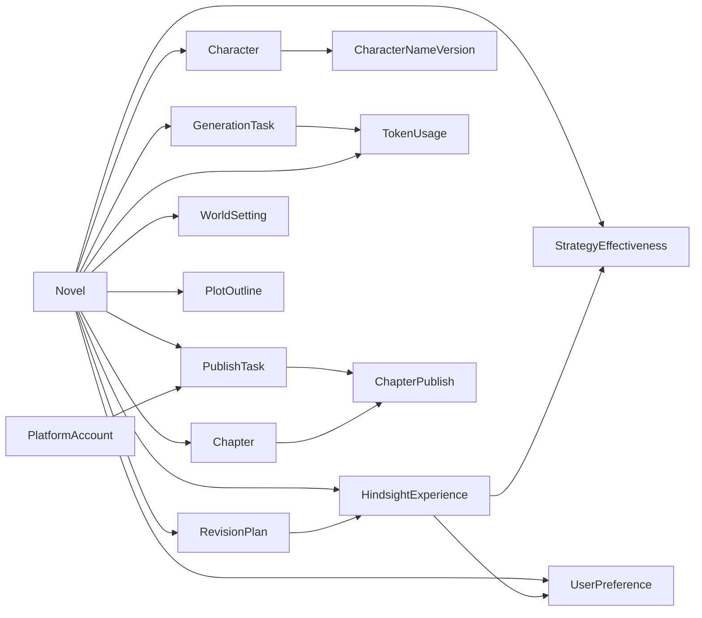
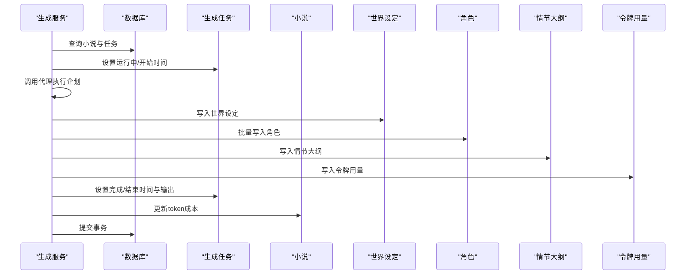

# 数据模型设计

<cite>
**本文引用的文件**
- [core/models/novel.py](file://core/models/novel.py)
- [core/models/character.py](file://core/models/character.py)
- [core/models/chapter.py](file://core/models/chapter.py)
- [core/models/generation_task.py](file://core/models/generation_task.py)
- [core/models/publish_task.py](file://core/models/publish_task.py)
- [core/models/world_setting.py](file://core/models/world_setting.py)
- [core/models/plot_outline.py](file://core/models/plot_outline.py)
- [core/models/chapter_publish.py](file://core/models/chapter_publish.py)
- [core/models/platform_account.py](file://core/models/platform_account.py)
- [core/models/token_usage.py](file://core/models/token_usage.py)
- [core/models/character_name_version.py](file://core/models/character_name_version.py)
- [core/models/revision_plan.py](file://core/models/revision_plan.py)
- [core/models/hindsight_memory.py](file://core/models/hindsight_memory.py)
- [core/database.py](file://core/database.py)
- [alembic/versions/5badc20e064a_initial_tables.py](file://alembic/versions/5badc20e064a_initial_tables.py)
- [alembic/versions_archived/c5d6e7f8a9b0_fix_all_remaining_model_db_mismatches.py](file://alembic/versions_archived/c5d6e7f8a9b0_fix_all_remaining_model_db_mismatches.py)
- [alembic/versions_archived/fb6eed83562e_add_outline_dynamic_update_fields.py](file://alembic/versions_archived/fb6eed83562e_add_outline_dynamic_update_fields.py)
- [alembic/versions/add_revision_and_memory_tables.py](file://alembic/versions/add_revision_and_memory_tables.py)
- [alembic/env.py](file://alembic/env.py)
- [backend/services/generation_service.py](file://backend/services/generation_service.py)
- [backend/services/publishing_service.py](file://backend/services/publishing_service.py)
- [backend/services/revision_understanding_service.py](file://backend/services/revision_understanding_service.py)
- [backend/services/revision_execution_service.py](file://backend/services/revision_execution_service.py)
- [backend/services/hindsight_service.py](file://backend/services/hindsight_service.py)
- [backend/services/revision_data_validator.py](file://backend/services/revision_data_validator.py)
- [backend/api/v1/characters.py](file://backend/api/v1/characters.py)
- [backend/api/v1/outlines.py](file://backend/api/v1/outlines.py)
- [backend/api/v1/revision.py](file://backend/api/v1/revision.py)
- [tests/test_character_name_version.py](file://tests/test_character_name_version.py)
- [tests/unit/test_revision_models.py](file://tests/unit/test_revision_models.py)
- [tests/unit/test_hindsight_service.py](file://tests/unit/test_hindsight_service.py)
</cite>

## 更新摘要
**变更内容**
- 新增修订计划数据模型，支持人机协作修订流程
- 新增后见之明记忆数据模型，支持Agent事后回顾学习
- 新增修订数据验证器，验证用户反馈中的实体是否存在
- 增强数据验证与业务规则，确保修订过程的准确性
- 完善服务层架构，支持智能修订与学习机制

## 目录
1. [简介](#简介)
2. [项目结构](#项目结构)
3. [核心组件](#核心组件)
4. [架构总览](#架构总览)
5. [详细组件分析](#详细组件分析)
6. [依赖分析](#依赖分析)
7. [性能考虑](#性能考虑)
8. [故障排查指南](#故障排查指南)
9. [结论](#结论)
10. [附录](#附录)

## 简介
本文件面向数据库设计师与后端开发者，系统性梳理小说生成系统的数据模型设计。重点覆盖以下核心实体：小说（Novel）、角色（Character）、章节（Chapter）、生成任务（GenerationTask）、发布任务（PublishTask）、平台账号（PlatformAccount）、章节发布记录（ChapterPublish）、世界设定（WorldSetting）、情节大纲（PlotOutline）、令牌用量（TokenUsage）、角色名称版本（CharacterNameVersion）、修订计划（RevisionPlan）、后见之明记忆（HindsightMemory）。文档从实体关系、字段定义、数据类型、约束、外键与级联、索引、数据验证与完整性、查询与缓存策略、生命周期与归档等方面进行深入解析，并提供数据库 schema 图与 ER 关系图，帮助读者快速理解并高效落地。

## 项目结构
围绕数据模型的核心文件位于 core/models 下，采用 SQLAlchemy ORM 映射 PostgreSQL 表；数据库连接与会话由 core/database.py 提供；迁移脚本通过 Alembic 在 alembic/versions 和 alembic/versions_archived 中维护；服务层在 backend/services 中体现典型的数据访问与业务流程。

```mermaid
graph TB
subgraph "数据层"
M1["core/models/novel.py"]
M2["core/models/character.py"]
M3["core/models/chapter.py"]
M4["core/models/generation_task.py"]
M5["core/models/publish_task.py"]
M6["core/models/world_setting.py"]
M7["core/models/plot_outline.py"]
M8["core/models/chapter_publish.py"]
M9["core/models/platform_account.py"]
M10["core/models/token_usage.py"]
M11["core/models/character_name_version.py"]
M12["core/models/revision_plan.py"]
M13["core/models/hindsight_memory.py"]
D["core/database.py"]
end
subgraph "迁移与环境"
A1["alembic/versions/5badc20e064a_initial_tables.py"]
A2["alembic/env.py"]
A3["alembic/versions_archived/c5d6e7f8a9b0_fix_all_remaining_model_db_mismatches.py"]
A4["alembic/versions_archived/fb6eed83562e_add_outline_dynamic_update_fields.py"]
A5["alembic/versions/add_revision_and_memory_tables.py"]
end
subgraph "服务层"
S1["backend/services/generation_service.py"]
S2["backend/services/publishing_service.py"]
S3["backend/services/revision_understanding_service.py"]
S4["backend/services/revision_execution_service.py"]
S5["backend/services/hindsight_service.py"]
S6["backend/services/revision_data_validator.py"]
end
subgraph "API层"
API1["backend/api/v1/characters.py"]
API2["backend/api/v1/outlines.py"]
API3["backend/api/v1/revision.py"]
end
M1 --- D
M2 --- D
M3 --- D
M4 --- D
M5 --- D
M6 --- D
M7 --- D
M8 --- D
M9 --- D
M10 --- D
M11 --- D
M12 --- D
M13 --- D
A1 --- A2
A3 --- A2
A4 --- A2
A5 --- A2
A2 --> D
S1 --> D
S2 --> D
S3 --> D
S4 --> D
S5 --> D
S6 --> D
API1 --> D
API2 --> D
API3 --> D
```



**图示来源**
- [core/models/novel.py:37-66](file://core/models/novel.py#L37-L66)
- [core/models/character.py:31-54](file://core/models/character.py#L31-L54)
- [core/models/chapter.py:18-45](file://core/models/chapter.py#L18-L45)
- [core/models/generation_task.py:27-47](file://core/models/generation_task.py#L27-L47)
- [core/models/publish_task.py:29-51](file://core/models/publish_task.py#L29-L51)
- [core/models/world_setting.py:11-29](file://core/models/world_setting.py#L11-L29)
- [core/models/plot_outline.py:11-27](file://core/models/plot_outline.py#L11-L27)
- [core/models/chapter_publish.py:21-39](file://core/models/chapter_publish.py#L21-L39)
- [core/models/platform_account.py:21-38](file://core/models/platform_account.py#L21-L38)
- [core/models/token_usage.py:11-25](file://core/models/token_usage.py#L11-L25)
- [core/models/character_name_version.py:12-25](file://core/models/character_name_version.py#L12-L25)
- [core/models/revision_plan.py:33-116](file://core/models/revision_plan.py#L33-L116)
- [core/models/hindsight_memory.py:29-233](file://core/models/hindsight_memory.py#L29-L233)
- [core/database.py:1-35](file://core/database.py#L1-L35)
- [alembic/versions/5badc20e064a_initial_tables.py:21-181](file://alembic/versions/5badc20e064a_initial_tables.py#L21-L181)
- [alembic/env.py:15-30](file://alembic/env.py#L15-L30)
- [alembic/versions_archived/c5d6e7f8a9b0_fix_all_remaining_model_db_mismatches.py:134-147](file://alembic/versions_archived/c5d6e7f8a9b0_fix_all_remaining_model_db_mismatches.py#L134-L147)
- [alembic/versions_archived/fb6eed83562e_add_outline_dynamic_update_fields.py:21-42](file://alembic/versions_archived/fb6eed83562e_add_outline_dynamic_update_fields.py#L21-L42)
- [alembic/versions/add_revision_and_memory_tables.py:22-157](file://alembic/versions/add_revision_and_memory_tables.py#L22-L157)
- [backend/services/generation_service.py:27-200](file://backend/services/generation_service.py#L27-L200)
- [backend/services/publishing_service.py:21-200](file://backend/services/publishing_service.py#L21-L200)
- [backend/services/revision_understanding_service.py:17-511](file://backend/services/revision_understanding_service.py#L17-L511)
- [backend/services/revision_execution_service.py:34-458](file://backend/services/revision_execution_service.py#L34-L458)
- [backend/services/hindsight_service.py:20-698](file://backend/services/hindsight_service.py#L20-L698)
- [backend/services/revision_data_validator.py:43-619](file://backend/services/revision_data_validator.py#L43-L619)
- [backend/api/v1/characters.py:249-410](file://backend/api/v1/characters.py#L249-L410)
- [backend/api/v1/outlines.py:627-683](file://backend/api/v1/outlines.py#L627-L683)
- [backend/api/v1/revision.py:17-463](file://backend/api/v1/revision.py#L17-L463)

**章节来源**
- [core/database.py:1-35](file://core/database.py#L1-L35)
- [alembic/versions/5badc20e064a_initial_tables.py:21-181](file://alembic/versions/5badc20e064a_initial_tables.py#L21-L181)
- [alembic/env.py:15-30](file://alembic/env.py#L15-L30)

## 核心组件
本节对关键实体进行逐项解析，涵盖字段语义、数据类型、约束、枚举值、默认值、关系映射与级联策略。

- 小说（Novel）
  - 关键字段：标题、作者、题材、标签数组、状态、长度类型、字数、章节数、封面、简介、目标平台、预估/实际收益、token 成本、元数据 JSONB、时间戳。
  - 枚举：状态（规划/写作/完稿/已发布）、长度类型（短/中/长）。
  - 关系：一对一/一对多（世界设定、角色、情节大纲、章节、生成任务、发布任务），级联删除孤儿对象。
  - 约束：UUID 主键，JSONB 元数据默认空字典，时间默认当前时间。

- 角色（Character）
  - 关键字段：所属小说、姓名、角色类型（主角/配角/反派/路人）、性别、年龄、外貌/性格/背景/目标、能力/关系/成长弧 JSONB、状态（存活/死亡/未知）、首次出场章节数、头像 URL、时间戳。
  - 枚举：角色类型、性别、状态。
  - 关系：属于一个小说，级联删除；**新增**：与角色名称版本的一对多关系，支持名称历史追踪。
  - 约束：外键指向 novels.id，JSONB 字段默认空字典。

- 角色名称版本（CharacterNameVersion）
  - **新增**：用于记录角色名称的历史变更，包括旧名称、新名称、变更时间、变更人、原因、活动状态等。
  - 关键字段：角色ID、旧名称、新名称、变更时间、变更人、原因、活动状态。
  - 关系：属于一个角色，级联删除。
  - 约束：UUID 主键，布尔字段默认 true，时间默认当前时间。

- 章节（Chapter）
  - 关键字段：所属小说、章节号、卷号、标题、正文、字数、状态、大纲/剧情点/伏笔/连续性问题 JSONB、质量评分、发布时间、时间戳。
  - 枚举：状态（草稿/审核中/已发布）。
  - 关系：属于一个小说，级联删除。
  - 约束：唯一性约束（章节号在小说内唯一）。

- 生成任务（GenerationTask）
  - 关键字段：所属小说、任务类型（企划/写作/编辑/批量写作）、状态、阶段、输入/输出 JSONB、代理日志、token 使用量、成本、错误信息、开始/完成时间、创建时间。
  - 枚举：任务类型、状态。
  - 关系：属于一个小说，一对多关联 TokenUsage，级联删除孤儿用量记录。
  - 约束：JSONB 默认空字典/数组，时间可空表示未开始。

- 发布任务（PublishTask）
  - 关键字段：所属小说、平台账号、发布类型（创建书籍/发布章节/批量发布）、目标章节号数组、状态、进度/结果摘要 JSONB、错误信息、开始/完成时间、时间戳。
  - 枚举：发布类型、状态。
  - 关系：属于一个小说与一个平台账号，一对多关联章节发布记录，级联删除孤儿记录。
  - 约束：JSONB 默认空字典/数组。

- 平台账号（PlatformAccount）
  - 关键字段：平台名称、备注名、用户名、加密凭证文本、状态、最后校验时间、错误信息、时间戳。
  - 枚举：状态（正常/未激活/已过期/异常）。
  - 关系：一对多关联发布任务，级联删除。
  - 约束：凭证以加密文本存储，便于安全访问。

- 章节发布记录（ChapterPublish）
  - 关键字段：所属发布任务、章节、章节号、平台返回的章节 ID/URL、状态、错误信息、发布时间、创建时间。
  - 枚举：状态（待发布/发布中/已发布/失败）。
  - 关系：属于一个发布任务与一个章节，级联删除。
  - 约束：JSONB 字段默认空字典。

- 世界设定（WorldSetting）
  - 关键字段：所属小说、世界名称/类型、力量体系/地理/势力/规则/时间线/特殊元素 JSONB、原始内容、时间戳。
  - 关系：一对一（小说唯一对应一个世界设定），级联删除。
  - 约束：唯一约束 novel_id，JSONB 默认空字典。

- 情节大纲（PlotOutline）
  - **增强**：新增详细主线剧情字段和动态更新功能。
  - 关键字段：所属小说、结构类型、卷列表/主线/支线/关键转折点 JSONB、高潮章节、原始内容、版本号、更新历史、时间戳。
  - 关系：一对一（小说唯一对应一个情节大纲），级联删除。
  - 约束：唯一约束 novel_id，JSONB 默认空字典/数组，版本号默认 1。

- 令牌用量（TokenUsage）
  - 关键字段：所属小说、任务、代理名、提示/补全/总计 token、成本、时间戳。
  - 关系：属于一个小说与一个生成任务。
  - 约束：数值型精度满足成本统计，时间默认当前时间。

- **修订计划（RevisionPlan）**
  - **新增**：支持人机协作修订流程，记录用户反馈 → AI理解 → 修改方案的完整流程。
  - 关键字段：小说ID、用户反馈原文、AI理解结果、目标类型、提议的修改方案、影响范围评估、状态、用户调整、确认/执行时间。
  - 枚举：修订计划状态（待确认/已确认/已执行/已拒绝）、修订目标类型（角色/章节/世界观/大纲/情节）。
  - 关系：属于一个小说，支持状态跟踪与影响评估。
  - 约束：UUID 主键，JSONB 字段默认空数组/字典，时间默认当前时间。

- **后见之明记忆（HindsightMemory）**
  - **新增**：支持Agent事后回顾学习，包含经验记录、策略有效性追踪、用户偏好管理。
  - 关键实体：
    - HindsightExperience：事后回顾经验表，记录初始目标 vs 实际结果、偏差分析、经验教训、成功/失败策略。
    - StrategyEffectiveness：策略有效性追踪表，统计各策略的实际效果。
    - UserPreference：用户偏好表，记录用户显式偏好和Hindsight推断的偏好。
  - 枚举：任务类型（企划/写作/修订）、策略趋势（上升/下降/稳定）。
  - 关系：与修订计划关联，支持学习机制与个性化推荐。
  - 约束：UUID 主键，JSONB 字段默认空数组/字典，时间默认当前时间。

**章节来源**
- [core/models/novel.py:37-66](file://core/models/novel.py#L37-L66)
- [core/models/character.py:31-54](file://core/models/character.py#L31-L54)
- [core/models/chapter.py:18-45](file://core/models/chapter.py#L18-L45)
- [core/models/generation_task.py:27-47](file://core/models/generation_task.py#L27-L47)
- [core/models/publish_task.py:29-51](file://core/models/publish_task.py#L29-L51)
- [core/models/world_setting.py:11-29](file://core/models/world_setting.py#L11-L29)
- [core/models/plot_outline.py:11-27](file://core/models/plot_outline.py#L11-L27)
- [core/models/chapter_publish.py:21-39](file://core/models/chapter_publish.py#L21-L39)
- [core/models/platform_account.py:21-38](file://core/models/platform_account.py#L21-L38)
- [core/models/token_usage.py:11-25](file://core/models/token_usage.py#L11-L25)
- [core/models/character_name_version.py:12-25](file://core/models/character_name_version.py#L12-L25)
- [core/models/revision_plan.py:33-116](file://core/models/revision_plan.py#L33-L116)
- [core/models/hindsight_memory.py:29-233](file://core/models/hindsight_memory.py#L29-L233)

## 架构总览
下图展示核心实体之间的关系与依赖，映射至实际模型文件：

```mermaid
erDiagram
NOVELS {
uuid id PK
string title
string author
string genre
string[] tags
enum status
enum length_type
int word_count
int chapter_count
string cover_url
text synopsis
string target_platform
numeric estimated_revenue
numeric actual_revenue
numeric token_cost
jsonb metadata
timestamptz created_at
timestamptz updated_at
}
CHARACTERS {
uuid id PK
uuid novel_id FK
string name
enum role_type
enum gender
int age
text appearance
text personality
text background
text goals
jsonb abilities
jsonb relationships
jsonb growth_arc
enum status
int first_appearance_chapter
string avatar_url
timestamptz created_at
timestamptz updated_at
}
CHARACTER_NAME_VERSIONS {
uuid id PK
uuid character_id FK
string old_name
string new_name
timestamptz changed_at
string changed_by
text reason
boolean is_active
timestamptz created_at
timestamptz updated_at
}
CHAPTERS {
uuid id PK
uuid novel_id FK
int chapter_number
int volume_number
string title
text content
int word_count
enum status
jsonb outline
uuid[] characters_appeared
jsonb plot_points
jsonb foreshadowing
float quality_score
jsonb continuity_issues
timestamptz created_at
timestamptz updated_at
timestamptz published_at
}
GENERATION_TASKS {
uuid id PK
uuid novel_id FK
enum task_type
enum status
string phase
jsonb input_data
jsonb output_data
jsonb agent_logs
int token_usage
numeric cost
text error_message
timestamptz started_at
timestamptz completed_at
timestamptz created_at
}
WORLD_SETTINGS {
uuid id PK
uuid novel_id FK UK
string world_name
string world_type
jsonb power_system
jsonb geography
jsonb factions
jsonb rules
jsonb timeline
jsonb special_elements
text raw_content
timestamptz created_at
timestamptz updated_at
}
PLOT_OUTLINES {
uuid id PK
uuid novel_id FK UK
string structure_type
jsonb volumes
jsonb main_plot
jsonb main_plot_detailed
jsonb sub_plots
jsonb key_turning_points
int climax_chapter
text raw_content
jsonb update_history
int version
timestamptz created_at
timestamptz updated_at
}
TOKEN_USAGES {
uuid id PK
uuid novel_id FK
uuid task_id FK
string agent_name
int prompt_tokens
int completion_tokens
int total_tokens
numeric cost
timestamptz timestamp
}
PLATFORM_ACCOUNTS {
uuid id PK
string platform_name
string account_name
string username
text encrypted_credentials
enum status
timestamptz last_verified_at
text error_message
timestamptz created_at
timestamptz updated_at
}
PUBLISH_TASKS {
uuid id PK
uuid novel_id FK
uuid platform_account_id FK
enum publish_type
int[] target_chapters
enum status
jsonb progress
jsonb result_summary
text error_message
timestamptz started_at
timestamptz completed_at
timestamptz created_at
timestamptz updated_at
}
CHAPTER_PUBLISHES {
uuid id PK
uuid publish_task_id FK
uuid chapter_id FK
int chapter_number
string platform_chapter_id
string platform_url
enum status
text error_message
timestamptz published_at
timestamptz created_at
}
REVISION_PLANS {
uuid id PK
uuid novel_id FK
text feedback_text
text understood_intent
float confidence
jsonb targets
jsonb proposed_changes
jsonb impact_assessment
string status
jsonb user_modifications
timestamptz confirmed_at
timestamptz executed_at
timestamptz created_at
timestamptz updated_at
}
HINDSIGHT_EXPERIENCES {
uuid id PK
uuid novel_id FK
uuid revision_plan_id FK
string task_type
int chapter_number
string agent_name
text original_feedback
float user_satisfaction
text initial_goal
jsonb initial_plan
text actual_result
float outcome_score
jsonb deviations
jsonb deviation_reasons
jsonb lessons_learned
jsonb successful_strategies
jsonb failed_strategies
string recurring_pattern
float pattern_confidence
jsonb improvement_suggestions
int is_archived
timestamptz created_at
timestamptz updated_at
}
STRATEGY_EFFECTIVENESS {
uuid id PK
uuid novel_id FK
string strategy_name
string strategy_type
string target_dimension
int application_count
int success_count
float avg_effectiveness
jsonb recent_results
string trend
int last_applied_chapter
timestamptz last_applied_at
timestamptz created_at
timestamptz updated_at
}
USER_PREFERENCES {
uuid id PK
string user_id
uuid novel_id
string preference_type
string preference_key
jsonb preference_value
float confidence
string source
int times_activated
timestamptz last_activated_at
timestamptz created_at
timestamptz updated_at
}
NOVELS ||--o{ CHARACTERS : "拥有"
NOVELS ||--o{ CHARACTER_NAME_VERSIONS : "拥有"
NOVELS ||--o{ CHAPTERS : "拥有"
NOVELS ||--o{ GENERATION_TASKS : "拥有"
NOVELS ||--|| WORLD_SETTINGS : "拥有"
NOVELS ||--|| PLOT_OUTLINES : "拥有"
CHARACTERS ||--o{ CHARACTER_NAME_VERSIONS : "拥有"
GENERATION_TASKS ||--o{ TOKEN_USAGES : "产生"
NOVELS ||--o{ TOKEN_USAGES : "拥有"
PLATFORM_ACCOUNTS ||--o{ PUBLISH_TASKS : "拥有"
NOVELS ||--o{ PUBLISH_TASKS : "拥有"
PUBLISH_TASKS ||--o{ CHAPTER_PUBLISHES : "产生"
CHAPTERS ||--o{ CHAPTER_PUBLISHES : "被发布"
NOVELS ||--o{ REVISION_PLANS : "拥有"
REVISION_PLANS ||--o{ HINDSIGHT_EXPERIENCES : "触发"
NOVELS ||--o{ HINDSIGHT_EXPERIENCES : "拥有"
NOVELS ||--o{ STRATEGY_EFFECTIVENESS : "拥有"
NOVELS ||--o{ USER_PREFERENCES : "拥有"
```

**图示来源**
- [core/models/novel.py:37-66](file://core/models/novel.py#L37-L66)
- [core/models/character.py:31-54](file://core/models/character.py#L31-L54)
- [core/models/chapter.py:18-45](file://core/models/chapter.py#L18-L45)
- [core/models/generation_task.py:27-47](file://core/models/generation_task.py#L27-L47)
- [core/models/world_setting.py:11-29](file://core/models/world_setting.py#L11-L29)
- [core/models/plot_outline.py:11-27](file://core/models/plot_outline.py#L11-L27)
- [core/models/token_usage.py:11-25](file://core/models/token_usage.py#L11-L25)
- [core/models/platform_account.py:21-38](file://core/models/platform_account.py#L21-L38)
- [core/models/publish_task.py:29-51](file://core/models/publish_task.py#L29-L51)
- [core/models/chapter_publish.py:21-39](file://core/models/chapter_publish.py#L21-L39)
- [core/models/character_name_version.py:12-25](file://core/models/character_name_version.py#L12-L25)
- [core/models/revision_plan.py:33-116](file://core/models/revision_plan.py#L33-L116)
- [core/models/hindsight_memory.py:29-233](file://core/models/hindsight_memory.py#L29-L233)

## 详细组件分析

### 实体关系与级联策略
- 外键与级联
  - 小说到角色/章节/生成任务/发布任务：一对多，删除小说时级联删除子对象（delete-orphan）。
  - 小说到世界设定/情节大纲：一对一（unique 约束），删除小说时级联删除。
  - **新增**：角色到角色名称版本：一对多，删除角色时级联删除所有版本记录。
  - **新增**：小说到修订计划：一对多，支持修订流程跟踪。
  - **新增**：修订计划到后见之明经验：一对多，支持学习机制。
  - **新增**：小说到后见之明经验/策略有效性/用户偏好：一对多，支持学习与个性化。
  - 生成任务到令牌用量：一对多，删除任务时级联删除用量记录。
  - 发布任务到章节发布记录：一对多，删除任务时级联删除发布记录。
  - 平台账号到发布任务：一对多，删除账号时级联删除任务。
  - 章节到章节发布记录：一对多，删除章节时级联删除发布记录。
- 索引与唯一性
  - 初始迁移脚本中明确创建了章节号在小说内的唯一性约束，确保章节编号不重复。
  - 发布任务与平台账号表在后续版本中新增了若干索引（如按状态、novel_id、平台名等），有助于查询性能。
  - **新增**：修订计划与后见之明记忆表的复合索引，支持按小说ID、任务类型、创建时间等高效查询。
  - **新增**：角色名称版本表的 character_id 外键约束，确保版本记录与角色的关联性。
- 时间戳与审计
  - 多数实体包含 created_at 与 updated_at，部分实体还包含 published_at，用于审计与生命周期追踪。
  - **新增**：修订计划包含确认/执行时间戳，支持修订流程跟踪。
  - **新增**：后见之明记忆包含归档状态与激活时间，支持学习机制管理。
  - **新增**：角色名称版本包含变更时间戳，支持历史追踪。

**章节来源**
- [core/models/novel.py:60-65](file://core/models/novel.py#L60-L65)
- [core/models/character.py:35-54](file://core/models/character.py#L35-L54)
- [core/models/chapter.py:22-39](file://core/models/chapter.py#L22-L39)
- [core/models/generation_task.py:31-46](file://core/models/generation_task.py#L31-L46)
- [core/models/publish_task.py:34-50](file://core/models/publish_task.py#L34-L50)
- [core/models/chapter_publish.py:26-38](file://core/models/chapter_publish.py#L26-L38)
- [core/models/character_name_version.py:16-25](file://core/models/character_name_version.py#L16-L25)
- [core/models/revision_plan.py:39-44](file://core/models/revision_plan.py#L39-L44)
- [core/models/hindsight_memory.py:40-46](file://core/models/hindsight_memory.py#L40-L46)
- [alembic/versions/5badc20e064a_initial_tables.py:74-76](file://alembic/versions/5badc20e064a_initial_tables.py#L74-L76)
- [alembic/versions_archived/c5d6e7f8a9b0_fix_all_remaining_model_db_mismatches.py:134-147](file://alembic/versions_archived/c5d6e7f8a9b0_fix_all_remaining_model_db_mismatches.py#L134-L147)
- [alembic/versions/add_revision_and_memory_tables.py:49-91](file://alembic/versions/add_revision_and_memory_tables.py#L49-91)

### 数据验证与业务规则
- 枚举约束：状态、类型等均使用 Python enum 定义，ORM 层自动限制取值范围。
- JSONB 结构：角色/章节/发布任务/情节大纲/修订计划/后见之明记忆等使用 JSONB 存储动态结构，需在写入前进行结构校验与默认值填充。
- 数值精度：收益、成本、token 成本使用 Numeric 类型，确保财务计算精度。
- 时间字段：统一使用带时区的时间类型，避免跨时区问题。
- 外键一致性：所有外键均指向主键，删除策略统一为 CASCADE，保证数据一致性。
- **新增**：修订计划验证：支持用户反馈的实体验证，确保修订目标的有效性。
- **新增**：后见之明验证：支持策略效果统计与趋势分析，确保学习机制的准确性。
- **新增**：角色名称版本验证：支持名称变更合理性检查，防止重复和相似名称的滥用。

**章节来源**
- [core/models/novel.py:24-57](file://core/models/novel.py#L24-L57)
- [core/models/character.py:12-51](file://core/models/character.py#L12-L51)
- [core/models/chapter.py:12-37](file://core/models/chapter.py#L12-L37)
- [core/models/generation_task.py:12-43](file://core/models/generation_task.py#L12-L43)
- [core/models/publish_task.py:13-44](file://core/models/publish_task.py#L13-L44)
- [core/models/world_setting.py:11-26](file://core/models/world_setting.py#L11-L26)
- [core/models/plot_outline.py:11-24](file://core/models/plot_outline.py#L11-L24)
- [core/models/character_name_version.py:12-25](file://core/models/character_name_version.py#L12-L25)
- [core/models/revision_plan.py:14-31](file://core/models/revision_plan.py#L14-L31)
- [core/models/hindsight_memory.py:13-27](file://core/models/hindsight_memory.py#L13-L27)

### 查询与缓存策略
- 查询模式
  - 服务层使用 select + scalar_one_or_none 进行单对象检索，结合 selectinload 或关系属性懒加载。
  - 生成服务在执行企划阶段时，先读取小说与任务，再批量写入角色、世界设定、情节大纲与令牌用量。
  - **新增**：修订理解服务在处理用户反馈时，先进行实体验证，再加载小说上下文，最后使用LLM分析反馈意图。
  - **新增**：修订执行服务在执行修订计划时，支持用户确认与修改调整，逐项执行修改并跟踪影响范围。
  - **新增**：后见之明服务在执行事后回顾时，支持LLM分析与简化分析双模式，自动检测反复模式并更新策略有效性。
  - **新增**：角色名称版本服务提供历史查询、版本对比、回溯等功能，支持复杂的历史数据检索。
- 缓存建议
  - 对高频读取的小说元数据、角色列表、章节概览可引入应用层缓存（如 Redis）。
  - 对发布任务状态与平台账号凭证可短期缓存，但需在变更时失效。
  - 对章节内容建议按需缓存，避免大文本频繁命中缓存。
  - **新增**：修订计划与后见之明记忆可考虑短期缓存，但需注意修订执行与学习更新时的缓存失效。
  - **新增**：角色名称版本历史可考虑短期缓存，但需注意版本变更时的缓存失效。

**章节来源**
- [backend/services/generation_service.py:36-200](file://backend/services/generation_service.py#L36-L200)
- [backend/services/publishing_service.py:32-200](file://backend/services/publishing_service.py#L32-L200)
- [backend/services/revision_understanding_service.py:63-511](file://backend/services/revision_understanding_service.py#L63-L511)
- [backend/services/revision_execution_service.py:45-458](file://backend/services/revision_execution_service.py#L45-L458)
- [backend/services/hindsight_service.py:70-698](file://backend/services/hindsight_service.py#L70-L698)
- [backend/api/v1/characters.py:249-410](file://backend/api/v1/characters.py#L249-L410)
- [backend/api/v1/outlines.py:627-683](file://backend/api/v1/outlines.py#L627-L683)
- [backend/api/v1/revision.py:136-463](file://backend/api/v1/revision.py#L136-L463)

### 生命周期与数据归档
- 生命周期
  - 小说：规划 → 写作 → 完稿 → 已发布。
  - 章节：草稿 → 审核中 → 已发布。
  - 任务：待处理 → 运行中 → 完成/失败/取消。
  - 账号：未激活/正常/已过期/异常。
  - **新增**：修订计划：待确认 → 已确认 → 已执行/已拒绝。
  - **新增**：后见之明经验：活跃 → 归档（支持手动归档与自动清理）。
  - **新增**：角色名称版本：支持版本历史追踪，可回溯到任意历史版本。
  - **新增**：情节大纲：支持动态更新和版本管理，每次更新创建新版本。
- 归档与软删除
  - **新增**：后见之明记忆包含归档状态字段，支持经验记录的长期保存与清理。
  - 当前模型未实现软删除字段（如 deleted_at），建议在需要保留历史审计时，为关键表添加软删除标志位与归档策略。
  - 对于已完成的发布任务与章节发布记录，可在归档后清理敏感凭证字段（如平台账号加密凭证）。
  - **新增**：修订计划与后见之明记忆的版本历史可用于审计归档。
  - **新增**：角色名称版本和情节大纲的版本历史可用于审计归档。

**章节来源**
- [core/models/novel.py:24-28](file://core/models/novel.py#L24-L28)
- [core/models/chapter.py:12-16](file://core/models/chapter.py#L12-L16)
- [core/models/generation_task.py:19-24](file://core/models/generation_task.py#L19-L24)
- [core/models/publish_task.py:20-26](file://core/models/publish_task.py#L20-L26)
- [core/models/platform_account.py:13-18](file://core/models/platform_account.py#L13-L18)
- [core/models/character_name_version.py:20-23](file://core/models/character_name_version.py#L20-L23)
- [core/models/plot_outline.py:95-111](file://core/models/plot_outline.py#L95-L111)
- [core/models/revision_plan.py:82-86](file://core/models/revision_plan.py#L82-L86)
- [core/models/hindsight_memory.py:85-86](file://core/models/hindsight_memory.py#L85-86)

## 依赖分析
- 组件耦合
  - 小说为核心聚合根，角色、章节、生成任务、发布任务、世界设定、情节大纲均依赖其存在。
  - **新增**：修订计划依赖小说存在，支持修订流程跟踪。
  - **新增**：后见之明记忆依赖小说存在，支持学习机制与个性化推荐。
  - **新增**：修订计划与后见之明记忆相互关联，形成完整的智能修订闭环。
  - **新增**：角色名称版本依赖角色存在，支持角色名称的历史追踪。
  - 令牌用量与发布任务分别与生成任务、小说建立强依赖，用于成本与进度追踪。
  - 平台账号独立管理，通过发布任务间接影响章节发布。
  - **新增**：情节大纲与小说建立一对一关系，支持详细的故事结构管理。
- 外部依赖
  - 数据库：PostgreSQL（UUID、JSONB、数组、枚举类型）。
  - 连接池：SQLAlchemy 异步引擎与会话工厂。
  - 迁移：Alembic 管理 schema 版本演进。
  - **新增**：LLM客户端（QwenClient）用于智能分析与学习。



**图示来源**
- [core/models/novel.py:60-65](file://core/models/novel.py#L60-L65)
- [core/models/character.py:53-54](file://core/models/character.py#L53-L54)
- [core/models/chapter.py:39-39](file://core/models/chapter.py#L39-L39)
- [core/models/generation_task.py:46-46](file://core/models/generation_task.py#L46-L46)
- [core/models/publish_task.py:49-50](file://core/models/publish_task.py#L49-L50)
- [core/models/chapter_publish.py:37-38](file://core/models/chapter_publish.py#L37-L38)
- [core/models/world_setting.py:28-28](file://core/models/world_setting.py#L28-L28)
- [core/models/plot_outline.py:26-26](file://core/models/plot_outline.py#L26-L26)
- [core/models/token_usage.py:24-24](file://core/models/token_usage.py#L24-L24)
- [core/models/platform_account.py:37-37](file://core/models/platform_account.py#L37-L37)
- [core/models/character_name_version.py:25-25](file://core/models/character_name_version.py#L25-L25)
- [core/models/revision_plan.py:47-47](file://core/models/revision_plan.py#L47-L47)
- [core/models/hindsight_memory.py:48-49](file://core/models/hindsight_memory.py#L48-L49)

**章节来源**
- [core/models/novel.py:37-66](file://core/models/novel.py#L37-L66)
- [core/models/generation_task.py:27-47](file://core/models/generation_task.py#L27-L47)
- [core/models/publish_task.py:29-51](file://core/models/publish_task.py#L29-L51)
- [core/models/chapter_publish.py:21-39](file://core/models/chapter_publish.py#L21-L39)
- [core/models/token_usage.py:11-25](file://core/models/token_usage.py#L11-L25)
- [core/models/platform_account.py:21-38](file://core/models/platform_account.py#L21-L38)
- [core/models/character_name_version.py:12-25](file://core/models/character_name_version.py#L12-L25)
- [core/models/revision_plan.py:33-116](file://core/models/revision_plan.py#L33-L116)
- [core/models/hindsight_memory.py:29-233](file://core/models/hindsight_memory.py#L29-L233)

## 性能考虑
- 索引建议
  - 发布任务：按 novel_id、status 建立复合索引，加速任务筛选与状态统计。
  - 平台账号：按 platform_name 建立索引，提升账号查询效率。
  - 章节发布：按 publish_task_id 建立索引，提升按任务批量查询性能。
  - **新增**：修订计划：按 novel_id、status、created_at 建立复合索引，加速修订流程查询。
  - **新增**：后见之明经验：按 novel_id、task_type、chapter_number、created_at 建立复合索引，加速学习机制查询。
  - **新增**：策略有效性：按 novel_id、target_dimension、strategy_name 建立复合索引，加速策略推荐查询。
  - **新增**：用户偏好：按 user_id、novel_id、preference_type 建立复合索引，加速个性化推荐查询。
  - **新增**：角色名称版本：按 character_id 建立索引，提升版本历史查询性能。
- 查询优化
  - 使用 selectinload 或 joinedload 减少 N+1 查询。
  - 对大字段（如章节正文、JSONB）按需加载，避免不必要的网络传输。
  - **新增**：修订计划查询支持按状态过滤与时间排序，优化修订流程管理。
  - **新增**：后见之明记忆查询支持按任务类型与章节号过滤，优化学习机制性能。
  - **新增**：角色名称版本查询支持按时间排序和限制返回数量，优化历史记录查询性能。
- 连接池与事务
  - 异步引擎与会话工厂减少阻塞，合理设置 pool_size 与 overflow。
  - 事务边界清晰，异常时及时回滚，避免长时间持有连接。
  - **新增**：LLM调用与数据库操作分离，避免阻塞数据库连接。

**章节来源**
- [core/database.py:11-22](file://core/database.py#L11-L22)
- [alembic/versions/4b47062db094_add_douyin_crawl_types.py:42-48](file://alembic/versions/4b47062db094_add_douyin_crawl_types.py#L42-L48)
- [alembic/versions_archived/c5d6e7f8a9b0_fix_all_remaining_model_db_mismatches.py:134-147](file://alembic/versions_archived/c5d6e7f8a9b0_fix_all_remaining_model_db_mismatches.py#L134-L147)
- [alembic/versions/add_revision_and_memory_tables.py:49-121](file://alembic/versions/add_revision_and_memory_tables.py#L49-121)

## 故障排查指南
- 常见问题
  - 外键约束失败：检查父对象是否存在，确认删除策略是否符合预期。
  - 章节号冲突：确认唯一性约束是否生效，必要时重建唯一索引。
  - 任务状态异常：核对服务层状态更新逻辑，确保 started_at/completed_at 正确设置。
  - 凭证解密失败：检查加密服务与凭证格式，确保字段非空且格式正确。
  - **新增**：修订计划执行失败：检查修订目标的有效性与用户确认状态。
  - **新增**：后见之明分析失败：检查LLM配置与网络连接，确保分析服务正常运行。
  - **新增**：角色名称版本查询失败：检查 character_id 是否有效，确认版本记录是否正确创建。
  - **新增**：情节大纲版本管理异常：检查版本号递增逻辑和更新历史记录。
- 排查步骤
  - 使用 Alembic 环境读取元数据，确认迁移是否一致。
  - 在服务层捕获异常并记录日志，定位具体失败环节。
  - 对关键表执行 EXPLAIN 分析慢查询，针对性加索引或重写查询。
  - **新增**：检查修订计划的状态流转与影响范围评估是否正确。
  - **新增**：检查后见之明记忆的归档状态与学习效果统计是否正常。
  - **新增**：检查角色名称版本的 is_active 字段是否正确设置为布尔值。

**章节来源**
- [alembic/env.py:15-30](file://alembic/env.py#L15-L30)
- [backend/services/generation_service.py:198-200](file://backend/services/generation_service.py#L198-L200)
- [backend/services/publishing_service.py:114-138](file://backend/services/publishing_service.py#L114-L138)
- [backend/services/revision_understanding_service.py:63-511](file://backend/services/revision_understanding_service.py#L63-L511)
- [backend/services/revision_execution_service.py:45-458](file://backend/services/revision_execution_service.py#L45-L458)
- [backend/services/hindsight_service.py:70-698](file://backend/services/hindsight_service.py#L70-L698)
- [backend/api/v1/characters.py:249-410](file://backend/api/v1/characters.py#L249-L410)
- [backend/api/v1/outlines.py:627-683](file://backend/api/v1/outlines.py#L627-L683)
- [backend/api/v1/revision.py:136-463](file://backend/api/v1/revision.py#L136-L463)

## 结论
该数据模型以小说为核心聚合根，围绕生成与发布两条主线构建，通过枚举、JSONB、UUID、数组与级联策略实现了高扩展性与强一致性。**新增的修订计划模型**提供了智能修订流程，**新增的后见之明记忆模型**支持Agent学习与个性化推荐，**新增的修订数据验证器**确保修订过程的准确性。配合 Alembic 的版本化迁移与异步数据库连接，能够支撑从企划到发布的全流程自动化。建议在生产环境中补充软删除与归档策略、完善索引与缓存、持续监控任务状态与成本，以保障系统长期稳定运行。

## 附录
- 数据库 schema 与迁移
  - 初始迁移脚本定义了核心表结构、枚举类型、外键与唯一约束。
  - Alembic 环境注册所有模型，确保迁移元数据与代码一致。
  - **新增**：修订计划与后见之明记忆表的迁移脚本，包含复合索引与外键约束。
- 服务层流程示意
  - 生成服务：加载小说与任务 → 初始化代理 → 写入世界设定/角色/情节大纲/令牌用量 → 更新任务状态与小说成本。
  - 发布服务：创建/更新平台账号 → 启动发布任务 → 模拟发布流程 → 更新任务状态与结果。
  - **新增**：修订理解服务：验证用户反馈 → 加载小说上下文 → LLM分析反馈意图 → 定位修改目标 → 生成修改方案 → 保存修订计划。
  - **新增**：修订执行服务：获取修订计划 → 用户确认 → 合并用户调整 → 逐项执行修改 → 跟踪影响范围 → 更新计划状态。
  - **新增**：后见之明服务：执行事后回顾 → LLM分析结果 → 检测反复模式 → 记录经验教训 → 更新策略有效性 → 推荐最佳策略。
  - **新增**：角色名称版本服务：提供名称变更记录、历史查询、版本对比、回溯等功能。
  - **新增**：情节大纲服务：支持详细主线剧情管理、动态更新和版本控制。



**图示来源**
- [backend/services/generation_service.py:36-196](file://backend/services/generation_service.py#L36-L196)
- [core/models/generation_task.py:31-46](file://core/models/generation_task.py#L31-L46)
- [core/models/novel.py:52-54](file://core/models/novel.py#L52-L54)