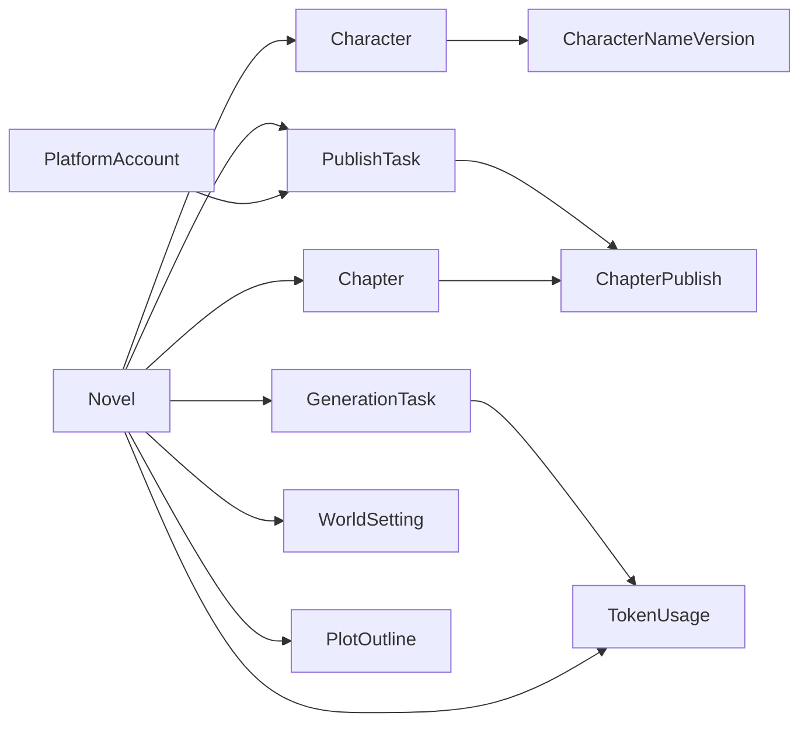
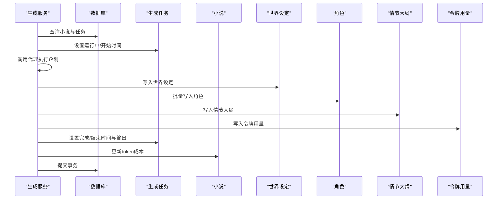

# 数据模型设计

<cite>
**本文引用的文件**
- [core/models/novel.py](file://core/models/novel.py)
- [core/models/character.py](file://core/models/character.py)
- [core/models/character_name_version.py](file://core/models/character_name_version.py)
- [core/models/chapter.py](file://core/models/chapter.py)
- [core/models/generation_task.py](file://core/models/generation_task.py)
- [core/models/publish_task.py](file://core/models/publish_task.py)
- [core/models/world_setting.py](file://core/models/world_setting.py)
- [core/models/plot_outline.py](file://core/models/plot_outline.py)
- [core/models/chapter_publish.py](file://core/models/chapter_publish.py)
- [core/models/platform_account.py](file://core/models/platform_account.py)
- [core/models/token_usage.py](file://core/models/token_usage.py)
- [core/database.py](file://core/database.py)
- [alembic/versions/5badc20e064a_initial_tables.py](file://alembic/versions/5badc20e064a_initial_tables.py)
- [alembic/versions/2a4218cba9df_add_detailed_outline_to_chapters.py](file://alembic/versions/2a4218cba9df_add_detailed_outline_to_chapters.py)
- [alembic/versions/add_outline_enhancements_to_chapters.py](file://alembic/versions/add_outline_enhancements_to_chapters.py)
- [alembic/env.py](file://alembic/env.py)
- [backend/services/generation_service.py](file://backend/services/generation_service.py)
- [backend/services/publishing_service.py](file://backend/services/publishing_service.py)
- [backend/api/v1/characters.py](file://backend/api/v1/characters.py)
- [migrations/add_chapter_config_and_main_plot_detailed.py](file://migrations/add_chapter_config_and_main_plot_detailed.py)
</cite>

## 更新摘要
**变更内容**
- 新增角色名称版本管理模型（CharacterNameVersion）和相关服务
- 增强章节配置功能，支持灵活的章节数设置
- 扩展情节大纲功能，新增详细主线剧情描述字段
- 增强章节大纲管理，支持详细大纲、任务、验证和版本控制

## 目录
1. [简介](#简介)
2. [项目结构](#项目结构)
3. [核心组件](#核心组件)
4. [架构总览](#架构总览)
5. [详细组件分析](#详细组件分析)
6. [依赖分析](#依赖分析)
7. [性能考虑](#性能考虑)
8. [故障排查指南](#故障排查指南)
9. [结论](#结论)
10. [附录](#附录)

## 简介
本文件面向数据库设计师与后端开发者，系统性梳理小说生成系统的数据模型设计。重点覆盖以下核心实体：小说（Novel）、角色（Character）、章节（Chapter）、生成任务（GenerationTask）、发布任务（PublishTask）、平台账号（PlatformAccount）、章节发布记录（ChapterPublish）、世界设定（WorldSetting）、情节大纲（PlotOutline）、令牌用量（TokenUsage）、角色名称版本（CharacterNameVersion）。文档从实体关系、字段定义、数据类型、约束、外键与级联、索引、数据验证与完整性、查询与缓存策略、生命周期与归档等方面进行深入解析，并提供数据库 schema 图与 ER 关系图，帮助读者快速理解并高效落地。

## 项目结构
围绕数据模型的核心文件位于 core/models 下，采用 SQLAlchemy ORM 映射 PostgreSQL 表；数据库连接与会话由 core/database.py 提供；迁移脚本通过 Alembic 在 alembic/versions 中维护；服务层在 backend/services 中体现典型的数据访问与业务流程。

```mermaid
graph TB
subgraph "数据层"
M1["core/models/novel.py"]
M2["core/models/character.py"]
M3["core/models/character_name_version.py"]
M4["core/models/chapter.py"]
M5["core/models/generation_task.py"]
M6["core/models/publish_task.py"]
M7["core/models/world_setting.py"]
M8["core/models/plot_outline.py"]
M9["core/models/chapter_publish.py"]
M10["core/models/platform_account.py"]
M11["core/models/token_usage.py"]
D["core/database.py"]
end
subgraph "迁移与环境"
A1["alembic/versions/5badc20e064a_initial_tables.py"]
A2["alembic/env.py"]
A3["alembic/versions/2a4218cba9df_add_detailed_outline_to_chapters.py"]
A4["alembic/versions/add_outline_enhancements_to_chapters.py"]
end
subgraph "服务层"
S1["backend/services/generation_service.py"]
S2["backend/services/publishing_service.py"]
end
M1 --- D
M2 --- D
M3 --- D
M4 --- D
M5 --- D
M6 --- D
M7 --- D
M8 --- D
M9 --- D
M10 --- D
M11 --- D
A1 --- A2
A2 --> D
A3 --> D
A4 --> D
S1 --> D
S2 --> D
```



**图示来源**
- [core/models/novel.py:37-77](file://core/models/novel.py#L37-L77)
- [core/models/character.py:31-55](file://core/models/character.py#L31-L55)
- [core/models/character_name_version.py:12-26](file://core/models/character_name_version.py#L12-L26)
- [core/models/chapter.py:18-49](file://core/models/chapter.py#L18-L49)
- [core/models/generation_task.py:27-47](file://core/models/generation_task.py#L27-L47)
- [core/models/publish_task.py:29-51](file://core/models/publish_task.py#L29-L51)
- [core/models/world_setting.py:11-29](file://core/models/world_setting.py#L11-L29)
- [core/models/plot_outline.py:11-43](file://core/models/plot_outline.py#L11-L43)
- [core/models/chapter_publish.py:21-39](file://core/models/chapter_publish.py#L21-L39)
- [core/models/platform_account.py:21-38](file://core/models/platform_account.py#L21-L38)
- [core/models/token_usage.py:11-25](file://core/models/token_usage.py#L11-L25)
- [core/database.py:1-35](file://core/database.py#L1-L35)
- [alembic/versions/5badc20e064a_initial_tables.py:21-181](file://alembic/versions/5badc20e064a_initial_tables.py#L21-L181)
- [alembic/versions/2a4218cba9df_add_detailed_outline_to_chapters.py:22-27](file://alembic/versions/2a4218cba9df_add_detailed_outline_to_chapters.py#L22-L27)
- [alembic/versions/add_outline_enhancements_to_chapters.py:22-35](file://alembic/versions/add_outline_enhancements_to_chapters.py#L22-L35)
- [alembic/env.py:15-30](file://alembic/env.py#L15-L30)
- [backend/services/generation_service.py:27-200](file://backend/services/generation_service.py#L27-L200)
- [backend/services/publishing_service.py:21-200](file://backend/services/publishing_service.py#L21-L200)

**章节来源**
- [core/database.py:1-35](file://core/database.py#L1-L35)
- [alembic/versions/5badc20e064a_initial_tables.py:21-181](file://alembic/versions/5badc20e064a_initial_tables.py#L21-L181)
- [alembic/env.py:15-30](file://alembic/env.py#L15-L30)

## 核心组件
本节对关键实体进行逐项解析，涵盖字段语义、数据类型、约束、枚举值、默认值、关系映射与级联策略。

- 小说（Novel）
  - 关键字段：标题、作者、题材、标签数组、状态、长度类型、字数、章节数、封面、简介、目标平台、预估/实际收益、token 成本、元数据 JSONB、**章节配置 JSONB**、时间戳。
  - 枚举：状态（规划/写作/完稿/已发布）、长度类型（短/中/长）。
  - 关系：一对一/一对多（世界设定、角色、情节大纲、章节、生成任务、发布任务），级联删除孤儿对象。
  - 约束：UUID 主键，JSONB 元数据默认空字典，**章节配置默认包含总章节数、最小/最大章节数、灵活设置等参数**，时间默认当前时间。

- 角色（Character）
  - 关键字段：所属小说、姓名、角色类型（主角/配角/反派/路人）、性别、年龄、外貌/性格/背景/目标、能力/关系/成长弧 JSONB、状态（存活/死亡/未知）、首次出场章节数、头像 URL、时间戳。
  - 枚举：角色类型、性别、状态。
  - 关系：属于一个小说，**一对多关联角色名称版本**，级联删除。
  - 约束：外键指向 novels.id，JSONB 字段默认空字典。

- **角色名称版本（CharacterNameVersion）**
  - 关键字段：所属角色、旧名字、新名字、变更时间、变更人、原因、活动状态标记。
  - 关系：属于一个角色，级联删除。
  - 约束：字符串长度限制，时间默认当前时间，活动状态默认 True。

- 章节（Chapter）
  - 关键字段：所属小说、章节号、卷号、标题、正文、字数、状态、大纲/剧情点/伏笔/连续性问题 JSONB、质量评分、发布时间、**详细大纲/大纲任务/验证结果/版本号**、时间戳。
  - 枚举：状态（草稿/审核中/已发布）。
  - 关系：属于一个小说，级联删除。
  - 约束：唯一性约束（章节号在小说内唯一），**新增详细大纲字段支持复杂剧情结构描述**。

- 生成任务（GenerationTask）
  - 关键字段：所属小说、任务类型（企划/写作/编辑/批量写作）、状态、阶段、输入/输出 JSONB、代理日志、token 使用量、成本、错误信息、开始/完成时间、创建时间。
  - 枚举：任务类型、状态。
  - 关系：属于一个小说，一对多关联 TokenUsage，级联删除孤儿用量记录。
  - 约束：JSONB 默认空字典/数组，时间可空表示未开始。

- 发布任务（PublishTask）
  - 关键字段：所属小说、平台账号、发布类型（创建书籍/发布章节/批量发布）、目标章节号数组、状态、进度/结果摘要 JSONB、错误信息、开始/完成时间、时间戳。
  - 枚举：发布类型、状态。
  - 关系：属于一个小说与一个平台账号，一对多关联章节发布记录，级联删除孤儿记录。
  - 约束：JSONB 默认空字典/数组。

- 平台账号（PlatformAccount）
  - 关键字段：平台名称、备注名、用户名、加密凭证文本、状态、最后校验时间、错误信息、时间戳。
  - 枚举：状态（正常/未激活/已过期/异常）。
  - 关系：一对多关联发布任务，级联删除。
  - 约束：凭证以加密文本存储，便于安全访问。

- 章节发布记录（ChapterPublish）
  - 关键字段：所属发布任务、章节、章节号、平台返回的章节 ID/URL、状态、错误信息、发布时间、创建时间。
  - 枚举：状态（待发布/发布中/已发布/失败）。
  - 关系：属于一个发布任务与一个章节，级联删除。
  - 约束：JSONB 字段默认空字典。

- 世界设定（WorldSetting）
  - 关键字段：所属小说、世界名称/类型、力量体系/地理/势力/规则/时间线/特殊元素 JSONB、原始内容、时间戳。
  - 关系：一对一（小说唯一对应一个世界设定），级联删除。
  - 约束：唯一约束 novel_id，JSONB 默认空字典。

- **情节大纲（PlotOutline）**
  - 关键字段：所属小说、结构类型、卷列表/主线/支线/关键转折点 JSONB、**详细主线剧情 JSONB**、高潮章节、原始内容、时间戳。
  - 关系：一对一（小说唯一对应一个情节大纲），级联删除。
  - 约束：唯一约束 novel_id，**主线剧情包含核心冲突、主题、角色成长等详细描述**，JSONB 默认空字典/数组。

- 令牌用量（TokenUsage）
  - 关键字段：所属小说、任务、代理名、提示/补全/总计 token、成本、时间戳。
  - 关系：属于一个小说与一个生成任务。
  - 约束：数值型精度满足成本统计，时间默认当前时间。

**章节来源**
- [core/models/novel.py:37-77](file://core/models/novel.py#L37-L77)
- [core/models/character.py:31-55](file://core/models/character.py#L31-L55)
- [core/models/character_name_version.py:12-26](file://core/models/character_name_version.py#L12-L26)
- [core/models/chapter.py:18-49](file://core/models/chapter.py#L18-L49)
- [core/models/generation_task.py:27-47](file://core/models/generation_task.py#L27-L47)
- [core/models/publish_task.py:29-51](file://core/models/publish_task.py#L29-L51)
- [core/models/world_setting.py:11-29](file://core/models/world_setting.py#L11-L29)
- [core/models/plot_outline.py:11-43](file://core/models/plot_outline.py#L11-L43)
- [core/models/chapter_publish.py:21-39](file://core/models/chapter_publish.py#L21-L39)
- [core/models/platform_account.py:21-38](file://core/models/platform_account.py#L21-L38)
- [core/models/token_usage.py:11-25](file://core/models/token_usage.py#L11-L25)

## 架构总览
下图展示核心实体之间的关系与依赖，映射至实际模型文件：

```mermaid
erDiagram
NOVELS {
uuid id PK
string title
string author
string genre
string[] tags
enum status
enum length_type
int word_count
int chapter_count
string cover_url
text synopsis
string target_platform
numeric estimated_revenue
numeric actual_revenue
numeric token_cost
jsonb metadata
jsonb chapter_config
timestamptz created_at
timestamptz updated_at
}
CHARACTERS {
uuid id PK
uuid novel_id FK
string name
enum role_type
enum gender
int age
text appearance
text personality
text background
text goals
jsonb abilities
jsonb relationships
jsonb growth_arc
enum status
int first_appearance_chapter
string avatar_url
timestamptz created_at
timestamptz updated_at
}
CHARACTER_NAME_VERSIONS {
uuid id PK
uuid character_id FK
string old_name
string new_name
timestamptz changed_at
string changed_by
text reason
boolean is_active
}
CHAPTERS {
uuid id PK
uuid novel_id FK
int chapter_number
int volume_number
string title
text content
int word_count
enum status
jsonb outline
uuid[] characters_appeared
jsonb plot_points
jsonb foreshadowing
float quality_score
jsonb continuity_issues
jsonb detailed_outline
jsonb outline_task
jsonb outline_validation
string outline_version
timestamptz created_at
timestamptz updated_at
timestamptz published_at
}
GENERATION_TASKS {
uuid id PK
uuid novel_id FK
enum task_type
enum status
string phase
jsonb input_data
jsonb output_data
jsonb agent_logs
int token_usage
numeric cost
text error_message
timestamptz started_at
timestamptz completed_at
timestamptz created_at
}
WORLD_SETTINGS {
uuid id PK
uuid novel_id FK UK
string world_name
string world_type
jsonb power_system
jsonb geography
jsonb factions
jsonb rules
jsonb timeline
jsonb special_elements
text raw_content
timestamptz created_at
timestamptz updated_at
}
PLOT_OUTLINES {
uuid id PK
uuid novel_id FK UK
string structure_type
jsonb volumes
jsonb main_plot
jsonb main_plot_detailed
jsonb sub_plots
jsonb key_turning_points
int climax_chapter
text raw_content
timestamptz created_at
timestamptz updated_at
}
TOKEN_USAGES {
uuid id PK
uuid novel_id FK
uuid task_id FK
string agent_name
int prompt_tokens
int completion_tokens
int total_tokens
numeric cost
timestamptz timestamp
}
PLATFORM_ACCOUNTS {
uuid id PK
string platform_name
string account_name
string username
text encrypted_credentials
enum status
timestamptz last_verified_at
text error_message
timestamptz created_at
timestamptz updated_at
}
PUBLISH_TASKS {
uuid id PK
uuid novel_id FK
uuid platform_account_id FK
enum publish_type
int[] target_chapters
enum status
jsonb progress
jsonb result_summary
text error_message
timestamptz started_at
timestamptz completed_at
timestamptz created_at
timestamptz updated_at
}
CHAPTER_PUBLISHES {
uuid id PK
uuid publish_task_id FK
uuid chapter_id FK
int chapter_number
string platform_chapter_id
string platform_url
enum status
text error_message
timestamptz published_at
timestamptz created_at
}
NOVELS ||--o{ CHARACTERS : "拥有"
NOVELS ||--o{ CHAPTERS : "拥有"
NOVELS ||--o{ GENERATION_TASKS : "拥有"
NOVELS ||--|| WORLD_SETTINGS : "拥有"
NOVELS ||--|| PLOT_OUTLINES : "拥有"
CHARACTERS ||--o{ CHARACTER_NAME_VERSIONS : "拥有"
GENERATION_TASKS ||--o{ TOKEN_USAGES : "产生"
NOVELS ||--o{ TOKEN_USAGES : "拥有"
PLATFORM_ACCOUNTS ||--o{ PUBLISH_TASKS : "拥有"
NOVELS ||--o{ PUBLISH_TASKS : "拥有"
PUBLISH_TASKS ||--o{ CHAPTER_PUBLISHES : "产生"
CHAPTERS ||--o{ CHAPTER_PUBLISHES : "被发布"
```

**图示来源**
- [core/models/novel.py:37-77](file://core/models/novel.py#L37-L77)
- [core/models/character.py:31-55](file://core/models/character.py#L31-L55)
- [core/models/character_name_version.py:12-26](file://core/models/character_name_version.py#L12-L26)
- [core/models/chapter.py:18-49](file://core/models/chapter.py#L18-L49)
- [core/models/generation_task.py:27-47](file://core/models/generation_task.py#L27-L47)
- [core/models/world_setting.py:11-29](file://core/models/world_setting.py#L11-L29)
- [core/models/plot_outline.py:11-43](file://core/models/plot_outline.py#L11-L43)
- [core/models/token_usage.py:11-25](file://core/models/token_usage.py#L11-L25)
- [core/models/platform_account.py:21-38](file://core/models/platform_account.py#L21-L38)
- [core/models/publish_task.py:29-51](file://core/models/publish_task.py#L29-L51)
- [core/models/chapter_publish.py:21-39](file://core/models/chapter_publish.py#L21-L39)

## 详细组件分析

### 实体关系与级联策略
- 外键与级联
  - 小说到角色/章节/生成任务/发布任务：一对多，删除小说时级联删除子对象（delete-orphan）。
  - 小说到世界设定/情节大纲：一对一（unique 约束），删除小说时级联删除。
  - **角色到角色名称版本：一对多，删除角色时级联删除版本记录**。
  - 生成任务到令牌用量：一对多，删除任务时级联删除用量记录。
  - 发布任务到章节发布记录：一对多，删除任务时级联删除发布记录。
  - 平台账号到发布任务：一对多，删除账号时级联删除任务。
  - 章节到章节发布记录：一对多，删除章节时级联删除发布记录。
- 索引与唯一性
  - 初始迁移脚本中明确创建了章节号在小说内的唯一性约束，确保章节编号不重复。
  - 发布任务与平台账号表在后续版本中新增了若干索引（如按状态、novel_id、平台名等），有助于查询性能。
- 时间戳与审计
  - 多数实体包含 created_at 与 updated_at，部分实体还包含 published_at，用于审计与生命周期追踪。

**章节来源**
- [core/models/novel.py:60-77](file://core/models/novel.py#L60-L77)
- [core/models/character.py:53-55](file://core/models/character.py#L53-L55)
- [core/models/character_name_version.py:16-25](file://core/models/character_name_version.py#L16-L25)
- [core/models/chapter.py:22-49](file://core/models/chapter.py#L22-L49)
- [core/models/generation_task.py:31-47](file://core/models/generation_task.py#L31-L47)
- [core/models/publish_task.py:34-51](file://core/models/publish_task.py#L34-L51)
- [core/models/chapter_publish.py:26-39](file://core/models/chapter_publish.py#L26-L39)
- [alembic/versions/5badc20e064a_initial_tables.py:74-76](file://alembic/versions/5badc20e064a_initial_tables.py#L74-L76)
- [alembic/versions/4b47062db094_add_douyin_crawl_types.py:42-48](file://alembic/versions/4b47062db094_add_douyin_crawl_types.py#L42-L48)

### 数据验证与业务规则
- 枚举约束：状态、类型等均使用 Python enum 定义，ORM 层自动限制取值范围。
- JSONB 结构：角色/章节/发布任务等使用 JSONB 存储动态结构，需在写入前进行结构校验与默认值填充。
- 数值精度：收益、成本、token 成本使用 Numeric 类型，确保财务计算精度。
- 时间字段：统一使用带时区的时间类型，避免跨时区问题。
- 外键一致性：所有外键均指向主键，删除策略统一为 CASCADE，保证数据一致性。
- **角色名称版本验证**：新增的服务包含名称变更验证逻辑，防止重复和相似名称的滥用。

**章节来源**
- [core/models/novel.py:24-77](file://core/models/novel.py#L24-L77)
- [core/models/character.py:12-55](file://core/models/character.py#L12-L55)
- [core/models/character_name_version.py:28-195](file://core/models/character_name_version.py#L28-L195)
- [core/models/chapter.py:12-49](file://core/models/chapter.py#L12-L49)
- [core/models/generation_task.py:12-47](file://core/models/generation_task.py#L12-L47)
- [core/models/publish_task.py:13-51](file://core/models/publish_task.py#L13-L51)
- [core/models/world_setting.py:11-29](file://core/models/world_setting.py#L11-L29)
- [core/models/plot_outline.py:11-43](file://core/models/plot_outline.py#L11-L43)

### 查询与缓存策略
- 查询模式
  - 服务层使用 select + scalar_one_or_none 进行单对象检索，结合 selectinload 或关系属性懒加载。
  - 生成服务在执行企划阶段时，先读取小说与任务，再批量写入角色、世界设定、情节大纲与令牌用量。
  - **角色名称版本服务提供历史查询、版本对比、回溯等功能**。
- 缓存建议
  - 对高频读取的小说元数据、角色列表、章节概览可引入应用层缓存（如 Redis）。
  - 对发布任务状态与平台账号凭证可短期缓存，但需在变更时失效。
  - 对章节内容建议按需缓存，避免大文本频繁命中缓存。

**章节来源**
- [backend/services/generation_service.py:36-200](file://backend/services/generation_service.py#L36-L200)
- [backend/services/publishing_service.py:32-200](file://backend/services/publishing_service.py#L32-L200)
- [backend/api/v1/characters.py:214-379](file://backend/api/v1/characters.py#L214-L379)

### 生命周期与数据归档
- 生命周期
  - 小说：规划 → 写作 → 完稿 → 已发布。
  - 章节：草稿 → 审核中 → 已发布。
  - 任务：待处理 → 运行中 → 完成/失败/取消。
  - 账号：未激活/正常/已过期/异常。
  - **角色名称版本：每次名称变更都会创建新的版本记录，支持历史追溯**。
- 归档与软删除
  - 当前模型未实现软删除字段（如 deleted_at），建议在需要保留历史审计时，为关键表添加软删除标志位与归档策略。
  - 对于已完成的发布任务与章节发布记录，可在归档后清理敏感凭证字段（如平台账号加密凭证）。
  - **角色名称版本记录可用于审计追踪，支持版本回溯和合规要求**。

**章节来源**
- [core/models/novel.py:24-28](file://core/models/novel.py#L24-L28)
- [core/models/chapter.py:12-16](file://core/models/chapter.py#L12-L16)
- [core/models/generation_task.py:19-24](file://core/models/generation_task.py#L19-L24)
- [core/models/publish_task.py:20-26](file://core/models/publish_task.py#L20-L26)
- [core/models/platform_account.py:13-18](file://core/models/platform_account.py#L13-L18)
- [core/models/character_name_version.py:12-26](file://core/models/character_name_version.py#L12-L26)

### 新增功能详解

#### 角色名称版本管理系统
**更新** 新增角色名称版本管理功能，支持详细的角色名称变更追踪和管理。

- **核心模型**：CharacterNameVersion
  - 字段：id、character_id、old_name、new_name、changed_at、changed_by、reason、is_active
  - 约束：字符串长度限制（100字符）、默认系统变更、活动状态标记
  - 关系：与 Character 一对多，级联删除

- **服务功能**：
  - 创建版本记录：记录每次名称变更
  - 历史查询：获取角色名称变更历史
  - 版本对比：比较两个版本的差异
  - 版本回溯：将角色名称恢复到历史版本
  - 当前名称获取：获取角色当前有效名称
  - 名称验证：验证名称变更的合理性

- **API 接口**：
  - GET /{character_id}/name-versions：获取名称版本历史
  - POST /{character_id}/name-versions：创建名称版本记录
  - GET /{character_id}/name-versions/compare：对比两个版本
  - POST /{character_id}/name-versions/revert：回溯到指定版本

**章节来源**
- [core/models/character_name_version.py:12-195](file://core/models/character_name_version.py#L12-L195)
- [backend/api/v1/characters.py:214-379](file://backend/api/v1/characters.py#L214-L379)

#### 章节配置增强功能
**更新** 新增灵活的章节配置管理，支持不同类型的章节结构需求。

- **章节配置字段**：chapter_config（JSONB）
  - 默认值：包含 total_chapters、min_chapters、max_chapters、flexible 参数
  - 功能：支持灵活的章节数设置，适应不同类型的小说需求
  - 应用场景：根据小说类型调整章节数量和结构

- **迁移脚本**：add_chapter_config_and_main_plot_detailed.py
  - 为 novels 表添加 chapter_config 字段
  - 为 plot_outlines 表添加 main_plot_detailed 字段
  - 支持迁移、回滚和状态检查

**章节来源**
- [core/models/novel.py:55-64](file://core/models/novel.py#L55-L64)
- [migrations/add_chapter_config_and_main_plot_detailed.py:24-55](file://migrations/add_chapter_config_and_main_plot_detailed.py#L24-L55)

#### 情节大纲详细描述
**更新** 扩展情节大纲功能，新增详细主线剧情描述字段。

- **详细主线剧情字段**：main_plot_detailed（JSONB）
  - 结构：包含核心冲突、主角目标、反派力量、冲突升级路径、情感弧光、主题表达、关键揭示点、角色成长、结局描述等
  - 目标：提供更丰富的剧情指导信息
  - 兼容性：保留原有的 main_plot 字段确保向后兼容

**章节来源**
- [core/models/plot_outline.py:19-33](file://core/models/plot_outline.py#L19-L33)

#### 章节大纲管理增强
**更新** 增强章节大纲管理功能，支持详细大纲、任务、验证和版本控制。

- **详细大纲字段**：detailed_outline（JSONB）
  - 功能：存储细化后的详细章节大纲
  - 应用：为章节写作提供更具体的指导

- **大纲任务字段**：outline_task（JSONB）
  - 功能：存储本章的大纲任务
  - 应用：指导章节写作的具体要求

- **大纲验证字段**：outline_validation（JSONB）
  - 功能：存储大纲验证结果
  - 应用：确保章节内容符合整体剧情要求

- **大纲版本字段**：outline_version（String）
  - 功能：标识使用的纲版本号
  - 应用：支持大纲版本管理和追踪

- **迁移支持**：add_outline_enhancements_to_chapters.py
  - 为章节表添加上述四个新字段
  - 支持迁移和回滚操作

**章节来源**
- [core/models/chapter.py:35-38](file://core/models/chapter.py#L35-L38)
- [alembic/versions/2a4218cba9df_add_detailed_outline_to_chapters.py:22-27](file://alembic/versions/2a4218cba9df_add_detailed_outline_to_chapters.py#L22-L27)
- [alembic/versions/add_outline_enhancements_to_chapters.py:22-35](file://alembic/versions/add_outline_enhancements_to_chapters.py#L22-L35)

## 依赖分析
- 组件耦合
  - 小说为核心聚合根，角色、章节、生成任务、发布任务、世界设定、情节大纲均依赖其存在。
  - **角色名称版本作为角色的子实体，提供额外的审计和追踪能力**。
  - 令牌用量与发布任务分别与生成任务、小说建立强依赖，用于成本与进度追踪。
  - 平台账号独立管理，通过发布任务间接影响章节发布。
- 外部依赖
  - 数据库：PostgreSQL（UUID、JSONB、数组、枚举类型）。
  - 连接池：SQLAlchemy 异步引擎与会话工厂。
  - 迁移：Alembic 管理 schema 版本演进。



**图示来源**
- [core/models/novel.py:60-77](file://core/models/novel.py#L60-L77)
- [core/models/character.py:53-55](file://core/models/character.py#L53-L55)
- [core/models/character_name_version.py:25-25](file://core/models/character_name_version.py#L25-L25)
- [core/models/chapter.py:43-43](file://core/models/chapter.py#L43-L43)
- [core/models/generation_task.py:46-46](file://core/models/generation_task.py#L46-L46)
- [core/models/publish_task.py:49-51](file://core/models/publish_task.py#L49-L51)
- [core/models/chapter_publish.py:37-38](file://core/models/chapter_publish.py#L37-L38)
- [core/models/world_setting.py:28-28](file://core/models/world_setting.py#L28-L28)
- [core/models/plot_outline.py:42-42](file://core/models/plot_outline.py#L42-L42)
- [core/models/token_usage.py:24-24](file://core/models/token_usage.py#L24-L24)
- [core/models/platform_account.py:37-37](file://core/models/platform_account.py#L37-L37)

**章节来源**
- [core/models/novel.py:37-77](file://core/models/novel.py#L37-L77)
- [core/models/generation_task.py:27-47](file://core/models/generation_task.py#L27-L47)
- [core/models/publish_task.py:29-51](file://core/models/publish_task.py#L29-L51)
- [core/models/chapter_publish.py:21-39](file://core/models/chapter_publish.py#L21-L39)
- [core/models/token_usage.py:11-25](file://core/models/token_usage.py#L11-L25)
- [core/models/platform_account.py:21-38](file://core/models/platform_account.py#L21-L38)

## 性能考虑
- 索引建议
  - 发布任务：按 novel_id、status 建立复合索引，加速任务筛选与状态统计。
  - 平台账号：按 platform_name 建立索引，提升账号查询效率。
  - 章节发布：按 publish_task_id 建立索引，提升按任务批量查询性能。
  - **角色名称版本：按 character_id、changed_at 建立索引，提升历史查询性能**。
- 查询优化
  - 使用 selectinload 或 joinedload 减少 N+1 查询。
  - 对大字段（如章节正文、JSONB）按需加载，避免不必要的网络传输。
  - **角色名称版本查询支持分页和时间范围过滤**。
- 连接池与事务
  - 异步引擎与会话工厂减少阻塞，合理设置 pool_size 与 overflow。
  - 事务边界清晰，异常时及时回滚，避免长时间持有连接。

**章节来源**
- [core/database.py:11-22](file://core/database.py#L11-L22)
- [alembic/versions/4b47062db094_add_douyin_crawl_types.py:42-48](file://alembic/versions/4b47062db094_add_douyin_crawl_types.py#L42-L48)

## 故障排查指南
- 常见问题
  - 外键约束失败：检查父对象是否存在，确认删除策略是否符合预期。
  - 章节号冲突：确认唯一性约束是否生效，必要时重建唯一索引。
  - 任务状态异常：核对服务层状态更新逻辑，确保 started_at/completed_at 正确设置。
  - 凭证解密失败：检查加密服务与凭证格式，确保字段非空且格式正确。
  - **角色名称版本冲突：检查名称变更的合理性，避免重复或相似名称**。
  - **章节配置无效：验证 JSONB 结构的正确性，确保必需字段存在**。
- 排查步骤
  - 使用 Alembic 环境读取元数据，确认迁移是否一致。
  - 在服务层捕获异常并记录日志，定位具体失败环节。
  - 对关键表执行 EXPLAIN 分析慢查询，针对性加索引或重写查询。
  - **使用角色名称版本服务的验证功能检查名称变更的合理性**。

**章节来源**
- [alembic/env.py:15-30](file://alembic/env.py#L15-L30)
- [backend/services/generation_service.py:198-200](file://backend/services/generation_service.py#L198-L200)
- [backend/services/publishing_service.py:114-138](file://backend/services/publishing_service.py#L114-L138)
- [core/models/character_name_version.py:169-195](file://core/models/character_name_version.py#L169-L195)

## 结论
该数据模型以小说为核心聚合根，围绕生成与发布两条主线构建，通过枚举、JSONB、UUID、数组与级联策略实现了高扩展性与强一致性。**新增的角色名称版本管理、章节配置增强和情节大纲详细描述功能进一步提升了系统的灵活性和可审计性**。配合 Alembic 的版本化迁移与异步数据库连接，能够支撑从企划到发布的全流程自动化。建议在生产环境中补充软删除与归档策略、完善索引与缓存、持续监控任务状态与成本，以保障系统长期稳定运行。

## 附录
- 数据库 schema 与迁移
  - 初始迁移脚本定义了核心表结构、枚举类型、外键与唯一约束。
  - Alembic 环境注册所有模型，确保迁移元数据与代码一致。
  - **新增迁移支持角色名称版本、章节配置和详细大纲功能**。
- 服务层流程示意
  - 生成服务：加载小说与任务 → 初始化代理 → 写入世界设定/角色/情节大纲/令牌用量 → 更新任务状态与小说成本。
  - 发布服务：创建/更新平台账号 → 启动发布任务 → 模拟发布流程 → 更新任务状态与结果。
  - **角色名称版本服务：提供名称变更的完整生命周期管理**。



**图示来源**
- [backend/services/generation_service.py:36-196](file://backend/services/generation_service.py#L36-L196)
- [core/models/generation_task.py:31-46](file://core/models/generation_task.py#L31-L46)
- [core/models/novel.py:52-54](file://core/models/novel.py#L52-L54)