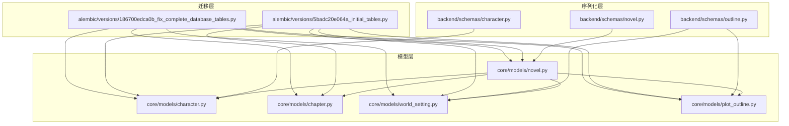
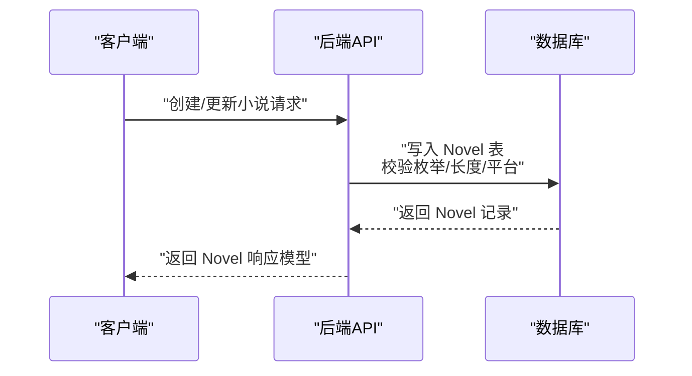
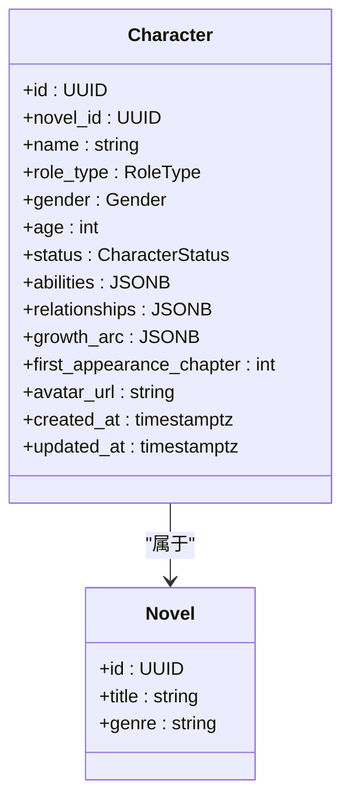
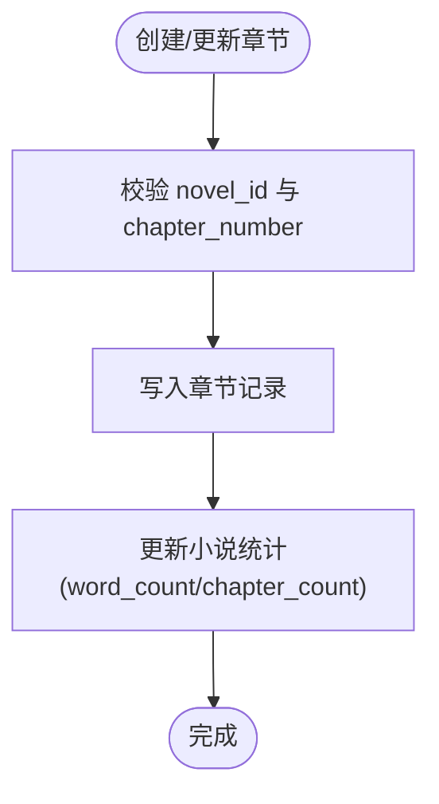
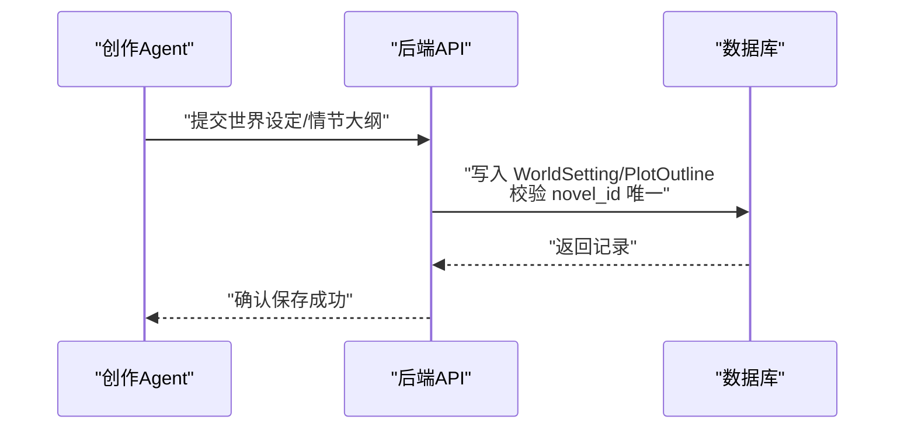
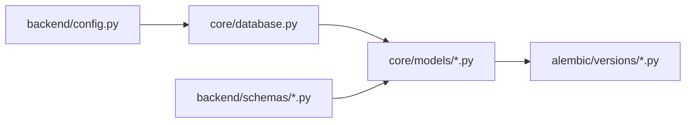

# 核心实体模型

<cite>
**本文引用的文件**
- [core/models/novel.py](file://core/models/novel.py)
- [core/models/character.py](file://core/models/character.py)
- [core/models/chapter.py](file://core/models/chapter.py)
- [core/models/world_setting.py](file://core/models/world_setting.py)
- [core/models/plot_outline.py](file://core/models/plot_outline.py)
- [core/database.py](file://core/database.py)
- [alembic/versions/5badc20e064a_initial_tables.py](file://alembic/versions/5badc20e064a_initial_tables.py)
- [alembic/versions/186700edca0b_fix_complete_database_tables.py](file://alembic/versions/186700edca0b_fix_complete_database_tables.py)
- [backend/schemas/novel.py](file://backend/schemas/novel.py)
- [backend/schemas/character.py](file://backend/schemas/character.py)
- [backend/schemas/outline.py](file://backend/schemas/outline.py)
- [backend/config.py](file://backend/config.py)
</cite>

## 目录
1. [简介](#简介)
2. [项目结构](#项目结构)
3. [核心组件](#核心组件)
4. [架构总览](#架构总览)
5. [详细组件分析](#详细组件分析)
6. [依赖分析](#依赖分析)
7. [性能考虑](#性能考虑)
8. [故障排查指南](#故障排查指南)
9. [结论](#结论)
10. [附录](#附录)

## 简介
本文件面向数据库与后端开发人员，系统化梳理小说生成系统的核心业务实体模型，覆盖以下实体：小说（Novel）、角色（Character）、章节（Chapter）、世界设定（WorldSetting）、情节大纲（PlotOutline）。文档从数据结构、字段语义、数据类型选择、业务约束、实体关系、外键与索引策略等方面进行深入解析，并给出面向生产的建模建议与最佳实践。

## 项目结构
围绕核心实体，系统采用“模型层（SQLAlchemy ORM）+ 迁移（Alembic）+ 序列化层（Pydantic Schemas）”的分层设计：
- 模型层：定义实体与关系，使用 PostgreSQL 类型（UUID、JSONB、数组、枚举等）
- 迁移层：通过 Alembic 定义表结构、约束与注释
- 序列化层：定义 API 输入输出模型，确保前后端契约一致



图表来源
- [core/models/novel.py](file://core/models/novel.py#L37-L66)
- [core/models/character.py](file://core/models/character.py#L31-L54)
- [core/models/chapter.py](file://core/models/chapter.py#L18-L45)
- [core/models/world_setting.py](file://core/models/world_setting.py#L11-L29)
- [core/models/plot_outline.py](file://core/models/plot_outline.py#L11-L27)
- [alembic/versions/5badc20e064a_initial_tables.py](file://alembic/versions/5badc20e064a_initial_tables.py#L24-L151)
- [alembic/versions/186700edca0b_fix_complete_database_tables.py](file://alembic/versions/186700edca0b_fix_complete_database_tables.py#L40-L217)

章节来源
- [core/models/novel.py](file://core/models/novel.py#L1-L66)
- [core/models/character.py](file://core/models/character.py#L1-L54)
- [core/models/chapter.py](file://core/models/chapter.py#L1-L45)
- [core/models/world_setting.py](file://core/models/world_setting.py#L1-L29)
- [core/models/plot_outline.py](file://core/models/plot_outline.py#L1-L27)
- [alembic/versions/5badc20e064a_initial_tables.py](file://alembic/versions/5badc20e064a_initial_tables.py#L1-L181)
- [alembic/versions/186700edca0b_fix_complete_database_tables.py](file://alembic/versions/186700edca0b_fix_complete_database_tables.py#L1-L267)

## 核心组件
本节对各实体进行字段级说明、类型选择依据、业务约束与关系映射的系统性梳理。

- 小说（Novel）
  - 字段与类型
    - id: UUID 主键
    - title: String(200)，必填
    - author: String(100)，默认“AI创作”
    - genre: String(50)，必填
    - tags: ARRAY(String)，默认空数组
    - status: 枚举 NovelStatus，默认 planning
    - length_type: 枚举 NovelLengthType，默认 medium
    - word_count: Integer，默认 0
    - chapter_count: Integer，默认 0
    - cover_url: String(500)，可空
    - synopsis: Text，可空
    - target_platform: String(50)，默认“番茄小说”
    - estimated_revenue/actual_revenue/token_cost: Numeric(10,2)/(10,4)，默认 0
    - metadata: JSONB，默认 {}
    - created_at/updated_at: DateTime(timezone)，服务端默认值与更新触发
  - 业务约束
    - status 与 length_type 为强约束枚举，便于状态机与统计口径统一
    - revenue 与 token_cost 使用高精度数值类型，避免浮点误差
    - metadata 作为通用扩展位，支持后续灵活扩展
  - 关系
    - 一对多：chapters（按 chapter_number 排序）
    - 一对一：world_setting、plot_outline（唯一约束）
    - 多对多：characters（通过外键关联）
    - 一对多：generation_tasks、publish_tasks

- 角色（Character）
  - 字段与类型
    - id: UUID 主键
    - novel_id: UUID(FK)，必填，级联删除
    - name: String(100)，必填
    - role_type: 枚举 RoleType，默认 minor
    - gender: 枚举 Gender，可空
    - age: Integer，可空
    - appearance/personality/background/goals: Text，可空
    - abilities/relationships/growth_arc: JSONB，默认 {}
    - status: 枚举 CharacterStatus，默认 alive
    - first_appearance_chapter: Integer，可空
    - avatar_url: String(500)，可空
    - created_at/updated_at: DateTime(timezone)
  - 业务约束
    - 通过枚举控制角色类型与状态，保证一致性
    - relationships 与 growth_arc 采用 JSONB，便于复杂关系建模
  - 关系
    - 属于小说（ManyToOne）

- 章节（Chapter）
  - 字段与类型
    - id: UUID 主键
    - novel_id: UUID(FK)，必填，级联删除
    - chapter_number: Integer，必填（迁移层注释为“章节”）
    - volume_number: Integer，默认 1
    - title: String(200)，可空
    - content: Text，可空
    - word_count: Integer，默认 0
    - status: 枚举 ChapterStatus，默认 draft
    - outline/plot_points/foreshadowing/continuity_issues: JSONB，默认 {}
    - quality_score: Float，可空
    - characters_appeared: ARRAY(UUID)，记录出场角色
    - created_at/updated_at/published_at: DateTime(timezone)
  - 业务约束
    - 通过 UniqueConstraint 或唯一性设计确保每部小说的章节号唯一性（见迁移）
    - quality_score 支持质量评估与回溯
  - 关系
    - 属于小说（ManyToOne）

- 世界设定（WorldSetting）
  - 字段与类型
    - id: UUID 主键
    - novel_id: UUID(FK，唯一），必填，级联删除
    - world_name/world_type: String(200)/(50)，可空
    - power_system/geography/factions/rules/timeline/special_elements: JSONB，默认 {}
    - raw_content: Text，可空
    - created_at/updated_at: DateTime(timezone)
  - 业务约束
    - novel_id 唯一约束，确保每部小说仅有一个世界设定
  - 关系
    - 属于小说（OneToOne）

- 情节大纲（PlotOutline）
  - 字段与类型
    - id: UUID 主键
    - novel_id: UUID(FK，唯一)，必填，级联删除
    - structure_type: String(50)，默认“three_act”
    - volumes/volumes/main_plot/sub_plots/key_turning_points: JSONB/列表，默认 {}
    - climax_chapter: Integer，可空
    - raw_content: Text，可空
    - created_at/updated_at: DateTime(timezone)
  - 业务约束
    - novel_id 唯一约束，确保每部小说仅有一个大纲
  - 关系
    - 属于小说（OneToOne）

章节来源
- [core/models/novel.py](file://core/models/novel.py#L24-L66)
- [core/models/character.py](file://core/models/character.py#L12-L54)
- [core/models/chapter.py](file://core/models/chapter.py#L12-L45)
- [core/models/world_setting.py](file://core/models/world_setting.py#L11-L29)
- [core/models/plot_outline.py](file://core/models/plot_outline.py#L11-L27)

## 架构总览
下图展示核心实体之间的关系与外键约束，以及与迁移脚本的一致性验证。

```mermaid
erDiagram
NOVELS {
uuid id PK
string title
string author
string genre
string[] tags
enum status
enum length_type
int word_count
int chapter_count
string cover_url
text synopsis
string target_platform
numeric estimated_revenue
numeric actual_revenue
numeric token_cost
jsonb metadata
timestamptz created_at
timestamptz updated_at
}
CHARACTERS {
uuid id PK
uuid novel_id FK
string name
enum role_type
enum gender
int age
text appearance
text personality
text background
text goals
jsonb abilities
jsonb relationships
jsonb growth_arc
enum status
int first_appearance_chapter
string avatar_url
timestamptz created_at
timestamptz updated_at
}
CHAPTERS {
uuid id PK
uuid novel_id FK
int chapter_number
int volume_number
string title
text content
int word_count
enum status
jsonb outline
jsonb plot_points
jsonb foreshadowing
float quality_score
jsonb continuity_issues
timestamptz created_at
timestamptz updated_at
timestamptz published_at
}
WORLD_SETTINGS {
uuid id PK
uuid novel_id FK UK
string world_name
string world_type
jsonb power_system
jsonb geography
jsonb factions
jsonb rules
jsonb timeline
jsonb special_elements
text raw_content
timestamptz created_at
timestamptz updated_at
}
PLOT_OUTLINES {
uuid id PK
uuid novel_id FK UK
string structure_type
jsonb volumes
jsonb main_plot
jsonb sub_plots
jsonb key_turning_points
int climax_chapter
text raw_content
timestamptz created_at
timestamptz updated_at
}
NOVELS ||--o{ CHARACTERS : "拥有"
NOVELS ||--o{ CHAPTERS : "拥有"
NOVELS ||--|| WORLD_SETTINGS : "拥有"
NOVELS ||--|| PLOT_OUTLINES : "拥有"
```

图表来源
- [alembic/versions/5badc20e064a_initial_tables.py](file://alembic/versions/5badc20e064a_initial_tables.py#L24-L151)
- [alembic/versions/186700edca0b_fix_complete_database_tables.py](file://alembic/versions/186700edca0b_fix_complete_database_tables.py#L40-L217)
- [core/models/novel.py](file://core/models/novel.py#L37-L66)
- [core/models/character.py](file://core/models/character.py#L31-L54)
- [core/models/chapter.py](file://core/models/chapter.py#L18-L45)
- [core/models/world_setting.py](file://core/models/world_setting.py#L11-L29)
- [core/models/plot_outline.py](file://core/models/plot_outline.py#L11-L27)

## 详细组件分析

### 小说（Novel）实体
- 设计理念
  - 统一的状态机（planning/writing/completed/published）与长度类型（short/medium/long）枚举，便于前端与后端一致处理
  - 收益与成本使用高精度数值类型，避免累计误差
  - metadata 作为开放扩展位，承载未来可能的动态元数据
- 关键字段与约束
  - status/length_type：枚举约束，保证取值域收敛
  - word_count/chapter_count：统计指标，便于仪表盘与报表
  - target_platform：平台维度，便于后续发布链路扩展
- 关系与排序
  - chapters 按 chapter_number 升序排列，确保阅读顺序稳定
  - world_setting/plot_outline 一对一，保证创作流程的完整性
- 数据流示意



图表来源
- [backend/schemas/novel.py](file://backend/schemas/novel.py#L8-L51)
- [core/models/novel.py](file://core/models/novel.py#L37-L66)

章节来源
- [core/models/novel.py](file://core/models/novel.py#L24-L66)
- [backend/schemas/novel.py](file://backend/schemas/novel.py#L8-L51)

### 角色（Character）实体
- 设计理念
  - 角色类型（RoleType）与性别（Gender）、状态（CharacterStatus）均采用枚举，确保数据一致性
  - abilities/relationships/growth_arc 使用 JSONB，支持复杂关系与动态扩展
- 关键字段与约束
  - role_type 默认 minor，便于新角色快速入库
  - first_appearance_chapter 提供出场时序线索
  - novel_id 外键 + 级联删除，保证数据一致性
- 关系与查询
  - 通过 novel_id 快速筛选角色归属
  - relationships 可用于构建角色关系图（详见关系图响应模型）



图表来源
- [core/models/character.py](file://core/models/character.py#L31-L54)
- [core/models/novel.py](file://core/models/novel.py#L37-L66)

章节来源
- [core/models/character.py](file://core/models/character.py#L12-L54)
- [backend/schemas/character.py](file://backend/schemas/character.py#L8-L76)

### 章节（Chapter）实体
- 设计理念
  - 章节号唯一性与卷号配合，满足长篇小说的分级阅读体验
  - outline/plot_points/foreshadowing 等字段承载创作过程中的结构化信息
  - quality_score 与 continuity_issues 支持质量评估与问题追踪
- 关键字段与约束
  - chapter_number 必填，配合唯一性约束确保章节序号不冲突
  - status 枚举驱动工作流（draft/reviewing/published）
  - characters_appeared 采用数组存储 UUID，便于快速检索出场角色
- 关系与排序
  - 属于小说（ManyToOne）
  - 小说侧按 chapter_number 排序，保证阅读顺序



图表来源
- [core/models/chapter.py](file://core/models/chapter.py#L18-L45)
- [core/models/novel.py](file://core/models/novel.py#L37-L66)

章节来源
- [core/models/chapter.py](file://core/models/chapter.py#L12-L45)
- [backend/schemas/outline.py](file://backend/schemas/outline.py#L64-L99)

### 世界设定（WorldSetting）与情节大纲（PlotOutline）
- 设计理念
  - 世界设定与情节大纲均采用 JSONB 承载复杂结构，便于 AI Agent 输出的直接落库
  - 两者均为 OneToOne（novel_id 唯一），确保创作流程的完整性
- 关键字段与约束
  - structure_type 默认“three_act”，便于后续扩展不同结构模板
  - climax_chapter 提供高潮定位，便于章节调度与发布节奏控制
- 关系与使用
  - 与小说形成强绑定，便于创作阶段的数据聚合与导出



图表来源
- [core/models/world_setting.py](file://core/models/world_setting.py#L11-L29)
- [core/models/plot_outline.py](file://core/models/plot_outline.py#L11-L27)

章节来源
- [core/models/world_setting.py](file://core/models/world_setting.py#L11-L29)
- [core/models/plot_outline.py](file://core/models/plot_outline.py#L11-L27)
- [backend/schemas/outline.py](file://backend/schemas/outline.py#L8-L62)

## 依赖分析
- 数据库引擎与会话
  - 使用异步 SQLAlchemy 引擎与会话工厂，支持高并发场景
  - 数据库连接参数由配置模块动态拼接
- 迁移一致性
  - 初始迁移与修复迁移均定义了主键、外键、唯一约束与注释，确保表结构稳定
- 实体耦合度
  - Novel 为核心枢纽，与 Character/Chapter/WorldSetting/PlotOutline 存在强关联
  - Character 与 Chapter 通过 JSONB 与数组间接关联，降低硬编码耦合



图表来源
- [backend/config.py](file://backend/config.py#L11-L27)
- [core/database.py](file://core/database.py#L11-L22)
- [alembic/versions/5badc20e064a_initial_tables.py](file://alembic/versions/5badc20e064a_initial_tables.py#L24-L151)
- [alembic/versions/186700edca0b_fix_complete_database_tables.py](file://alembic/versions/186700edca0b_fix_complete_database_tables.py#L40-L217)

章节来源
- [core/database.py](file://core/database.py#L1-L35)
- [backend/config.py](file://backend/config.py#L11-L27)
- [alembic/versions/5badc20e064a_initial_tables.py](file://alembic/versions/5badc20e064a_initial_tables.py#L21-L181)
- [alembic/versions/186700edca0b_fix_complete_database_tables.py](file://alembic/versions/186700edca0b_fix_complete_database_tables.py#L21-L267)

## 性能考虑
- 数据类型选择
  - 数值类字段使用 Numeric，避免浮点误差；Float 仅用于可选的质量评分
  - JSONB 适合动态结构，但需注意大对象的读写开销，建议对高频访问字段建立二级索引或拆表
- 查询路径
  - 按 novel_id 的过滤广泛存在于角色与章节查询中，建议在 novel_id 上建立索引（迁移脚本未显式创建，但外键已存在）
  - 章节按 chapter_number 排序，建议在该列上建立索引以优化排序与分页
- 并发与事务
  - 异步引擎与会话工厂支持高并发；注意批量写入时的事务边界与回滚策略

## 故障排查指南
- 常见错误与定位
  - 枚举值非法：检查 NovelStatus/RoleType/Gender/CharacterStatus/ChapterStatus 的取值是否符合枚举定义
  - 唯一性冲突：章节号重复或 novel_id 重复（世界设定/情节大纲唯一约束）
  - 外键缺失：创建角色或章节时未提供 novel_id 或 novel_id 不存在
- 排查步骤
  - 核对迁移脚本中的表结构与约束定义
  - 检查序列化层输入模型的字段与默认值
  - 使用数据库客户端查看具体约束与索引情况

章节来源
- [alembic/versions/5badc20e064a_initial_tables.py](file://alembic/versions/5badc20e064a_initial_tables.py#L21-L181)
- [alembic/versions/186700edca0b_fix_complete_database_tables.py](file://alembic/versions/186700edca0b_fix_complete_database_tables.py#L21-L267)
- [backend/schemas/novel.py](file://backend/schemas/novel.py#L8-L51)
- [backend/schemas/character.py](file://backend/schemas/character.py#L8-L76)
- [backend/schemas/outline.py](file://backend/schemas/outline.py#L64-L99)

## 结论
本模型以“强枚举 + JSONB 扩展 + 明确外键约束”为核心设计原则，既保证了数据一致性，又保留了创作流程中的灵活性。Novel 作为中枢实体，串联角色、章节、世界设定与情节大纲，形成完整的创作闭环。建议在生产环境中补充必要的索引与监控，持续优化查询与写入性能。

## 附录
- 字段与类型对照（摘要）
  - UUID：主键与外键统一使用 UUID，便于跨服务与分布式场景
  - JSONB：abilities/relationships/growth_arc/outline/plot_points 等动态结构
  - 数组：characters_appeared 存储出场角色集合
  - 枚举：状态与类型枚举，确保取值域收敛
- 建议的索引策略（待实施）
  - novel_id：角色与章节查询高频
  - chapter_number：章节排序与分页
  - novel_id + status：任务与发布状态过滤
  - novel_id + created_at：创作时间线查询