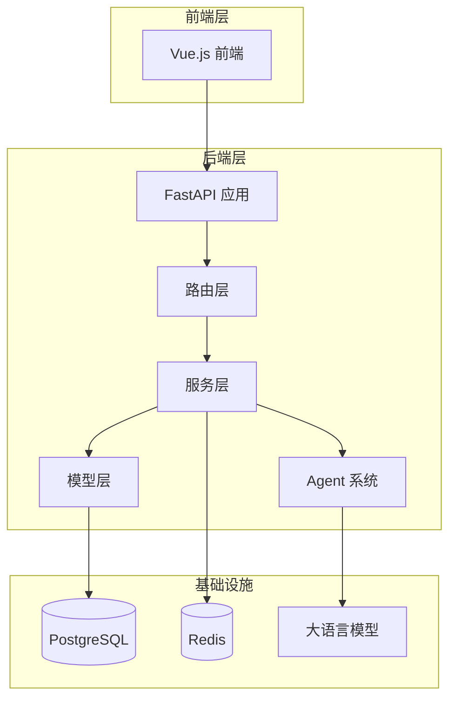
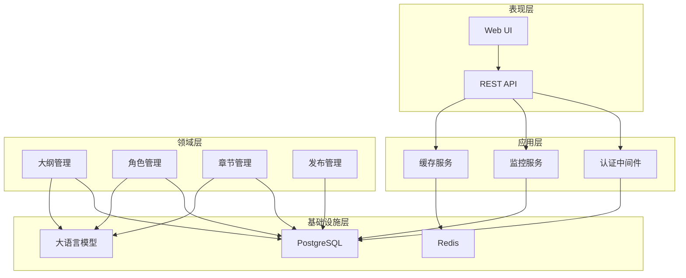
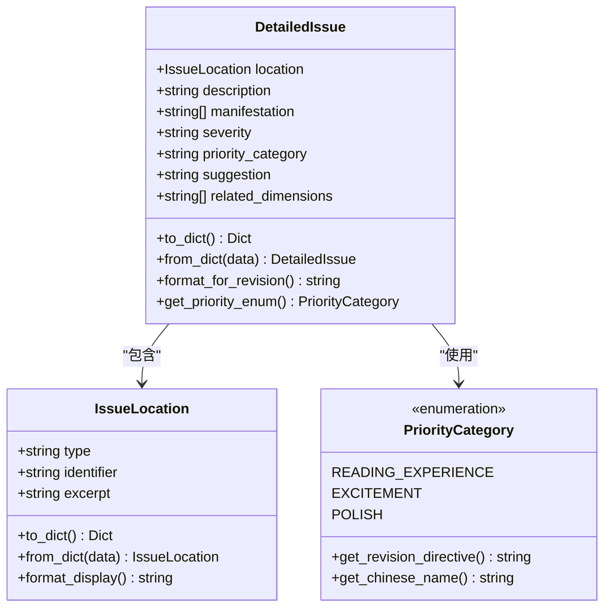
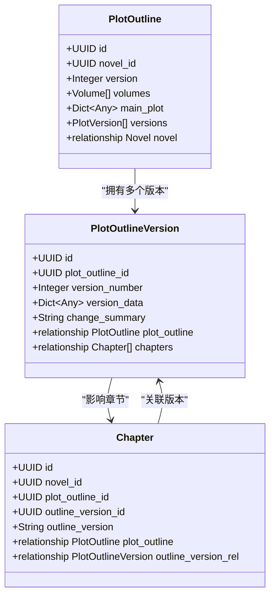
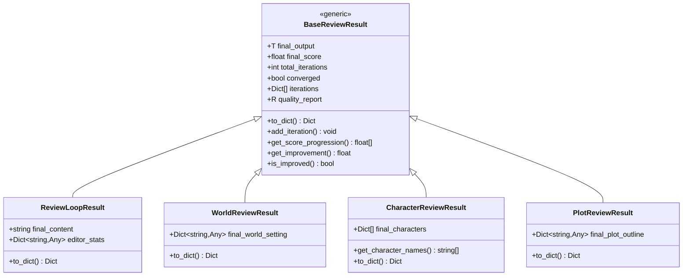
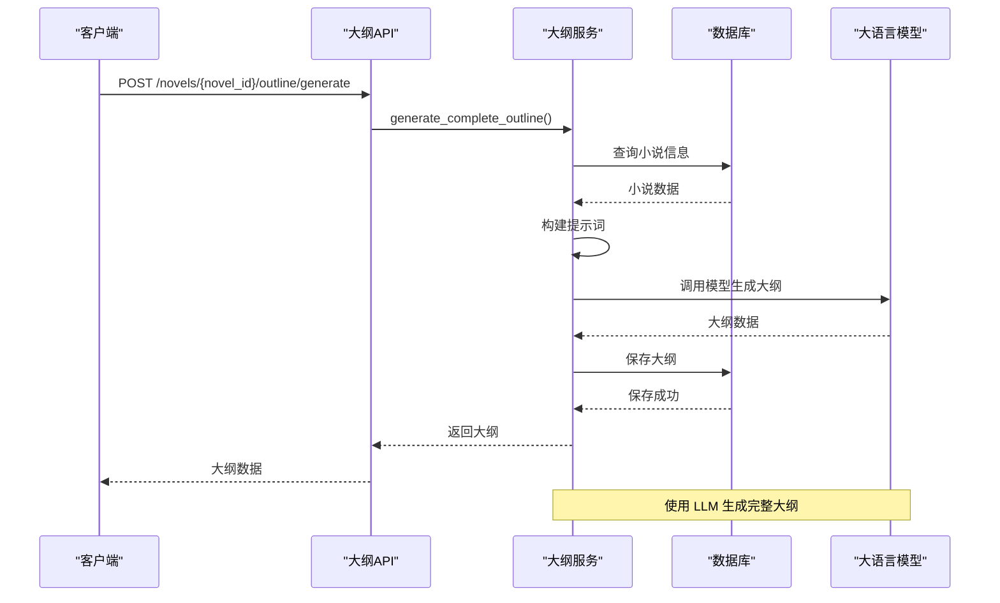
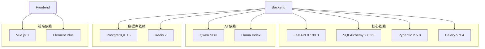
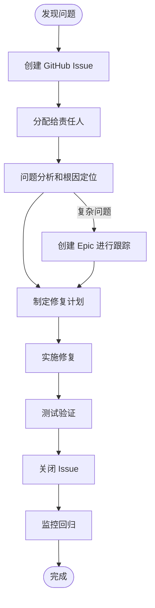

# 详细问题跟踪系统

<cite>
**本文档引用的文件**
- [backend/main.py](file://backend/main.py)
- [core/models/__init__.py](file://core/models/__init__.py)
- [agents/base/detailed_issue.py](file://agents/base/detailed_issue.py)
- [docs/ISSUES_CREATED_REPORT.md](file://docs/ISSUES_CREATED_REPORT.md)
- [docs/P1_FIX_PLAN.md](file://docs/P1_FIX_PLAN.md)
- [core/models/chapter.py](file://core/models/chapter.py)
- [backend/api/v1/outlines.py](file://backend/api/v1/outlines.py)
- [backend/services/outline_service.py](file://backend/services/outline_service.py)
- [alembic/versions/90162718523f_initial_schema_from_models.py](file://alembic/versions/90162718523f_initial_schema_from_models.py)
- [scripts/create-github-issues.sh](file://scripts/create-github-issues.sh)
- [core/models/plot_outline.py](file://core/models/plot_outline.py)
- [core/models/plot_outline_version.py](file://core/models/plot_outline_version.py)
- [agents/base/review_result.py](file://agents/base/review_result.py)
- [docs/REFACTOR_PLAN_34.md](file://docs/REFACTOR_PLAN_34.md)
- [scripts/issue-manager.sh](file://scripts/issue-manager.sh)
</cite>

## 目录
1. [简介](#简介)
2. [项目结构](#项目结构)
3. [核心组件](#核心组件)
4. [架构总览](#架构总览)
5. [详细组件分析](#详细组件分析)
6. [依赖关系分析](#依赖关系分析)
7. [性能考量](#性能考量)
8. [故障排除指南](#故障排除指南)
9. [结论](#结论)
10. [附录](#附录)

## 简介
本系统是一个基于 FastAPI 的 AI 驱动小说生成平台，提供从世界观设定、角色管理、剧情大纲到章节生成与发布的完整工作流。系统采用多 Agent 协作架构，支持流式响应的 AI 对话、质量审查与自动优化、以及完整任务状态追踪。

系统的核心目标是：
- 提供小说创作的全流程自动化支持
- 通过 AI Agent 协作提升内容质量和创作效率
- 建立完善的版本管理与问题跟踪机制
- 支持多平台发布与监控

## 项目结构
项目采用模块化分层架构，主要包含以下层次：

**图表来源**
- [backend/main.py:1-159](file://backend/main.py#L1-L159)
- [core/models/__init__.py:1-52](file://core/models/__init__.py#L1-L52)

**章节来源**
- [backend/main.py:1-159](file://backend/main.py#L1-L159)
- [core/models/__init__.py:1-52](file://core/models/__init__.py#L1-L52)

## 核心组件
系统的核心组件包括：

### 1. API 网关层
- FastAPI 应用入口，配置 CORS、中间件和路由
- 提供统一的 OpenAPI 文档和健康检查
- 支持多标签分类的 API 接口

### 2. 业务服务层
- 大纲服务：负责剧情大纲的生成、分解、验证和版本管理
- 角色服务：管理角色档案和关系
- 章节服务：处理章节内容生成和状态管理
- 发布服务：支持多平台内容发布

### 3. 数据模型层
- 基于 SQLAlchemy 的 ORM 模型
- 支持 JSONB 字段存储复杂数据结构
- 完整的外键约束和关系映射

### 4. Agent 系统
- 多 Agent 协作架构
- 支持审查循环和质量评估
- 提供详细的问题跟踪和修复建议

**章节来源**
- [backend/main.py:62-90](file://backend/main.py#L62-L90)
- [backend/services/outline_service.py:30-46](file://backend/services/outline_service.py#L30-L46)
- [core/models/__init__.py:19-51](file://core/models/__init__.py#L19-L51)

## 架构总览
系统采用分层架构设计，确保各层职责清晰、耦合度低：

**图表来源**
- [backend/main.py:92-107](file://backend/main.py#L92-L107)
- [backend/api/v1/outlines.py:46](file://backend/api/v1/outlines.py#L46)

## 详细组件分析

### 详细问题跟踪数据结构

系统实现了完整的详细问题跟踪机制，包含以下核心组件：

**图表来源**
- [agents/base/detailed_issue.py:14-26](file://agents/base/detailed_issue.py#L14-L26)
- [agents/base/detailed_issue.py:66-108](file://agents/base/detailed_issue.py#L66-L108)
- [agents/base/detailed_issue.py:111-161](file://agents/base/detailed_issue.py#L111-L161)

系统支持三种优先级分类：
- **影响阅读体验**：必须修改的问题
- **提升精彩度**：建议增强的问题  
- **细节打磨**：可考虑优化的问题

**章节来源**
- [agents/base/detailed_issue.py:14-44](file://agents/base/detailed_issue.py#L14-L44)
- [agents/base/detailed_issue.py:46-63](file://agents/base/detailed_issue.py#L46-L63)
- [agents/base/detailed_issue.py:111-161](file://agents/base/detailed_issue.py#L111-L161)

### 大纲版本管理系统

系统实现了完整的版本管理机制，支持大纲的版本控制和回滚：

**图表来源**
- [core/models/plot_outline.py:13-134](file://core/models/plot_outline.py#L13-L134)
- [core/models/plot_outline_version.py:13-37](file://core/models/plot_outline_version.py#L13-L37)
- [core/models/chapter.py:22-79](file://core/models/chapter.py#L22-L79)

**章节来源**
- [core/models/plot_outline.py:13-134](file://core/models/plot_outline.py#L13-L134)
- [core/models/plot_outline_version.py:13-37](file://core/models/plot_outline_version.py#L13-L37)
- [core/models/chapter.py:22-79](file://core/models/chapter.py#L22-L79)

### 审查循环结果管理

系统提供了统一的审查结果管理机制：

**图表来源**
- [agents/base/review_result.py:24-127](file://agents/base/review_result.py#L24-L127)
- [agents/base/review_result.py:130-157](file://agents/base/review_result.py#L130-L157)
- [agents/base/review_result.py:160-182](file://agents/base/review_result.py#L160-L182)
- [agents/base/review_result.py:185-207](file://agents/base/review_result.py#L185-L207)
- [agents/base/review_result.py:214-237](file://agents/base/review_result.py#L214-L237)

**章节来源**
- [agents/base/review_result.py:24-127](file://agents/base/review_result.py#L24-L127)
- [agents/base/review_result.py:130-237](file://agents/base/review_result.py#L130-L237)

### 大纲服务工作流程

**图表来源**
- [backend/api/v1/outlines.py:210-260](file://backend/api/v1/outlines.py#L210-L260)
- [backend/services/outline_service.py:47-114](file://backend/services/outline_service.py#L47-L114)

**章节来源**
- [backend/api/v1/outlines.py:210-260](file://backend/api/v1/outlines.py#L210-L260)
- [backend/services/outline_service.py:47-114](file://backend/services/outline_service.py#L47-L114)

## 依赖关系分析

系统采用模块化设计，各组件间依赖关系清晰：

**图表来源**
- [backend/main.py:5-11](file://backend/main.py#L5-L11)
- [alembic/versions/90162718523f_initial_schema_from_models.py:11-13](file://alembic/versions/90162718523f_initial_schema_from_models.py#L11-L13)

**章节来源**
- [backend/main.py:5-11](file://backend/main.py#L5-L11)
- [alembic/versions/90162718523f_initial_schema_from_models.py:11-13](file://alembic/versions/90162718523f_initial_schema_from_models.py#L11-L13)

## 性能考量
系统在设计时充分考虑了性能优化：

### 数据库性能优化
- 使用 JSONB 字段存储复杂数据结构，支持高效查询
- 建立合理的索引策略，优化常用查询
- 支持异步数据库连接，提高并发处理能力

### 缓存策略
- Redis 缓存热点数据，减少数据库压力
- LRU 缓存机制，控制内存使用
- TTL 过期机制，保证数据新鲜度

### 大模型调用优化
- Token 使用统计和成本控制
- 批量处理和缓存机制
- 异步调用避免阻塞

## 故障排除指南

### 常见问题诊断

#### 1. 数据库连接问题
**症状**：应用启动失败，数据库连接异常
**排查步骤**：
1. 检查数据库连接字符串配置
2. 验证数据库服务状态
3. 查看连接池配置和限制

#### 2. 大模型调用失败
**症状**：AI 功能不可用，API 调用超时
**排查步骤**：
1. 验证 API Key 配置
2. 检查网络连接和代理设置
3. 查看调用频率限制

#### 3. 缓存失效问题
**症状**：缓存命中率低，性能下降
**排查步骤**：
1. 检查缓存配置和大小限制
2. 验证 TTL 设置是否合理
3. 分析缓存淘汰策略

**章节来源**
- [backend/main.py:136-158](file://backend/main.py#L136-L158)
- [scripts/issue-manager.sh:88-94](file://scripts/issue-manager.sh#L88-L94)

### 问题跟踪流程

**图表来源**
- [scripts/create-github-issues.sh:1-465](file://scripts/create-github-issues.sh#L1-L465)
- [docs/ISSUES_CREATED_REPORT.md:109-153](file://docs/ISSUES_CREATED_REPORT.md#L109-L153)

**章节来源**
- [scripts/create-github-issues.sh:1-465](file://scripts/create-github-issues.sh#L1-L465)
- [docs/ISSUES_CREATED_REPORT.md:109-153](file://docs/ISSUES_CREATED_REPORT.md#L109-L153)

## 结论
本详细问题跟踪系统通过以下关键特性实现了高效的开发和运维管理：

### 核心优势
1. **完整的版本管理**：支持大纲版本控制和回滚
2. **统一的问题跟踪**：标准化的问题分类和优先级管理
3. **自动化的工作流程**：从问题创建到解决的完整闭环
4. **多维度的监控**：涵盖性能、质量、安全等多个方面

### 技术亮点
- 基于 FastAPI 的高性能 API 框架
- 多 Agent 协作的智能内容生成
- 完善的数据模型和关系映射
- 灵活的扩展架构设计

### 未来发展方向
1. **智能化增强**：引入更多 AI 能力提升系统智能化水平
2. **性能优化**：持续优化数据库查询和缓存策略
3. **监控完善**：扩展监控指标和告警机制
4. **用户体验**：改善前端交互和操作流程

该系统为小说创作平台提供了坚实的技术基础，通过完善的版本管理和问题跟踪机制，确保了项目的可持续发展和高质量交付。

## 附录

### 问题分类标准
系统采用三层优先级分类：
- **P0（严重）**：影响核心功能，必须立即修复
- **P1（中等）**：影响用户体验，需要尽快修复  
- **P2（轻微）**：影响较小，可延后处理

### 工作流程规范
1. **问题创建**：使用标准化模板描述问题
2. **优先级评估**：根据影响范围和紧急程度确定优先级
3. **任务分配**：指派给合适的开发人员
4. **进度跟踪**：定期更新修复进度
5. **质量验证**：修复后进行测试验证

### 最佳实践
- 保持问题描述的清晰和完整
- 及时更新问题状态和进展
- 重视问题的根本原因分析
- 建立知识库和经验分享机制