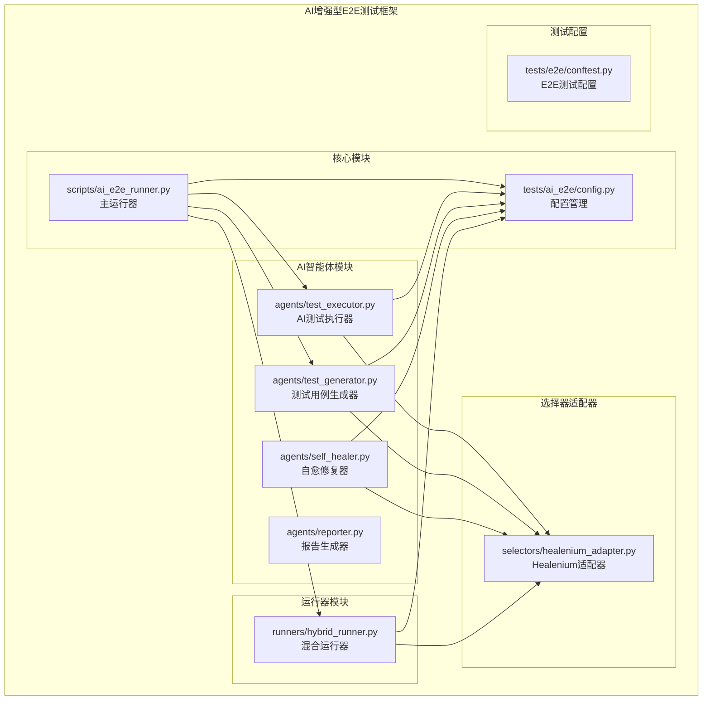
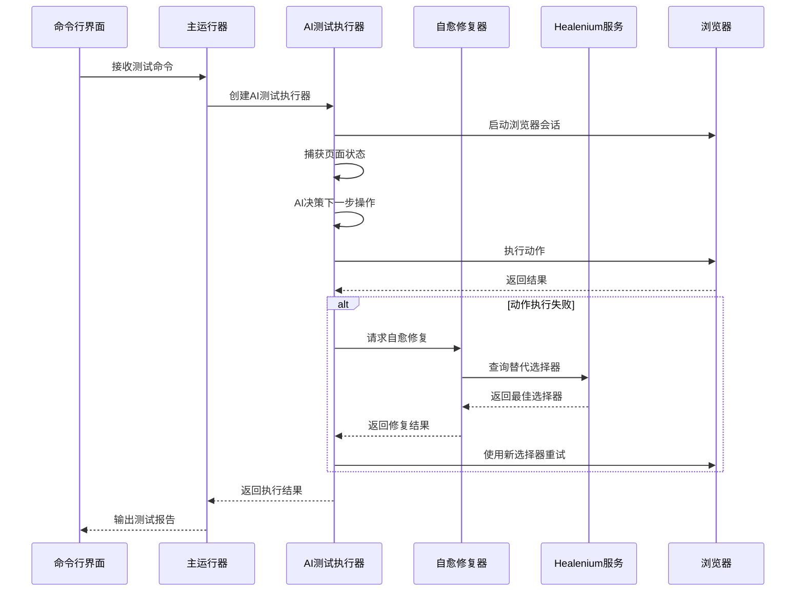
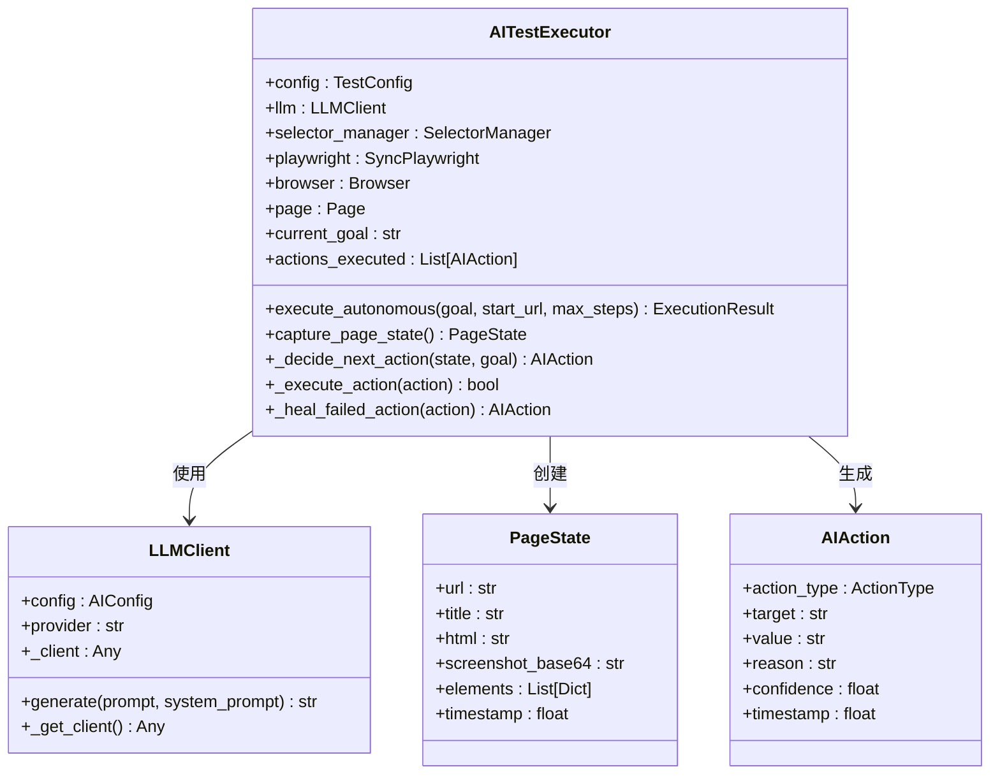
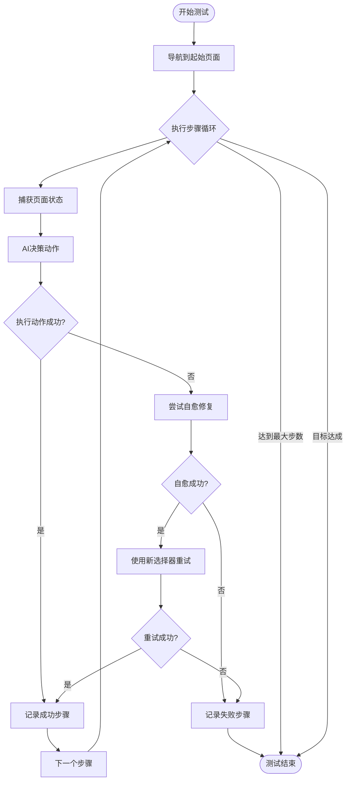
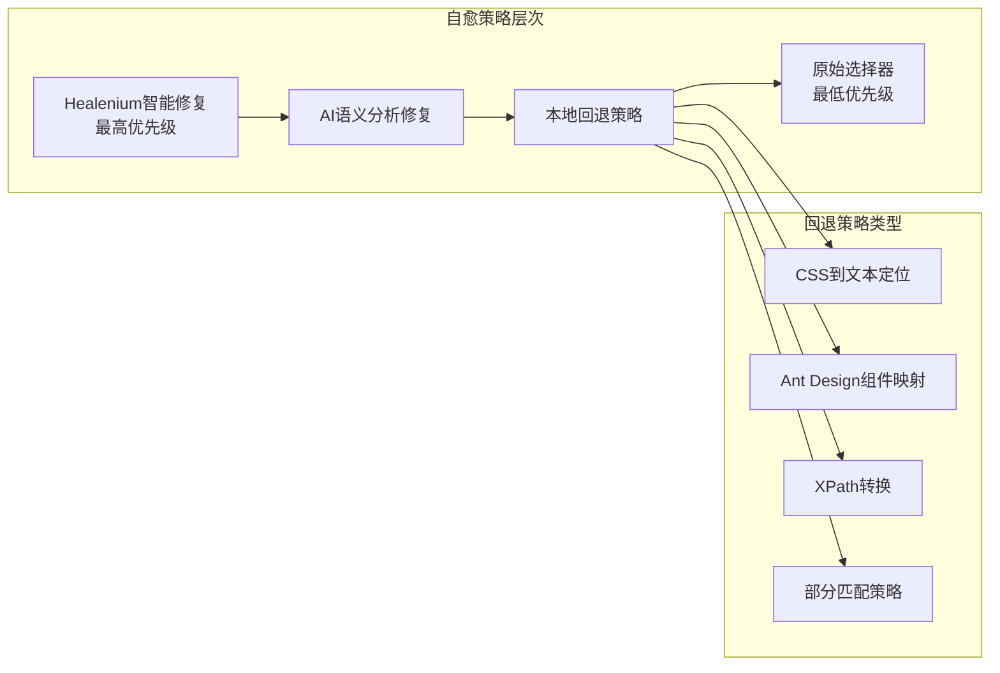
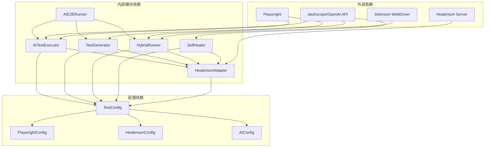

# AI增强型E2E测试框架

<cite>
**本文档引用的文件**
- [ai_e2e_runner.py](file://scripts/ai_e2e_runner.py)
- [config.py](file://tests/ai_e2e/config.py)
- [hybrid_runner.py](file://tests/ai_e2e/runners/hybrid_runner.py)
- [test_executor.py](file://tests/ai_e2e/agents/test_executor.py)
- [test_generator.py](file://tests/ai_e2e/agents/test_generator.py)
- [self_healer.py](file://tests/ai_e2e/agents/self_healer.py)
- [healenium_adapter.py](file://tests/ai_e2e/selectors/healenium_adapter.py)
- [reporter.py](file://tests/ai_e2e/agents/reporter.py)
- [conftest.py](file://tests/e2e/conftest.py)
</cite>

## 目录
1. [简介](#简介)
2. [项目结构](#项目结构)
3. [核心组件](#核心组件)
4. [架构概览](#架构概览)
5. [详细组件分析](#详细组件分析)
6. [依赖关系分析](#依赖关系分析)
7. [性能考虑](#性能考虑)
8. [故障排除指南](#故障排除指南)
9. [结论](#结论)

## 简介

AI增强型E2E测试框架是一个基于Playwright + Healenium混合架构的智能测试解决方案。该框架支持AI自动生成测试用例、全AI自动执行测试、测试自愈机制等功能，旨在解决传统E2E测试中选择器脆弱性问题，提高测试的稳定性和维护效率。

框架的核心特点包括：
- **AI自主测试执行**：无需预定义测试步骤，AI可根据页面状态自主决策操作序列
- **智能自愈机制**：当元素定位失败时，自动寻找替代选择器并修复
- **测试用例生成**：基于页面分析和需求描述，自动生成可执行的E2E测试代码
- **混合运行器**：协调Playwright和Selenium/Healenium的测试执行

## 项目结构

**图表来源**
- [ai_e2e_runner.py:1-630](file://scripts/ai_e2e_runner.py#L1-L630)
- [config.py:1-92](file://tests/ai_e2e/config.py#L1-L92)

**章节来源**
- [ai_e2e_runner.py:1-630](file://scripts/ai_e2e_runner.py#L1-L630)
- [config.py:1-92](file://tests/ai_e2e/config.py#L1-L92)

## 核心组件

### 主运行器 (AIE2ERunner)

主运行器是整个框架的入口点，提供统一的命令行接口，支持四种运行模式：

- **自主测试模式**：AI完全自主执行测试，无需预定义步骤
- **测试生成模式**：基于需求描述自动生成测试用例
- **元素修复模式**：修复失效的选择器
- **混合运行器模式**：协调Playwright和Selenium的测试执行

### 配置管理系统

框架采用分层配置管理：
- **Playwright配置**：控制浏览器行为和超时设置
- **Healenium配置**：管理自愈服务连接和阈值
- **AI配置**：设置大语言模型提供商和参数
- **测试配置**：统一管理测试运行时参数

### AI智能体模块

#### AI测试执行器 (AITestExecutor)
基于大语言模型的全AI自动测试执行引擎，具备以下核心功能：
- 页面状态分析和元素提取
- AI决策制定和动作执行
- 自愈机制集成
- 执行结果评估

#### 测试用例生成器 (TestGenerator)
智能生成可执行的E2E测试代码：
- 页面结构分析
- 功能点识别
- 测试场景设计
- 代码模板生成

#### 自愈修复器 (SelfHealer)
多策略自愈修复机制：
- Healenium智能修复
- AI语义分析修复
- 本地回退策略
- 修复历史记录

**章节来源**
- [test_executor.py:1-654](file://tests/ai_e2e/agents/test_executor.py#L1-L654)
- [test_generator.py:1-758](file://tests/ai_e2e/agents/test_generator.py#L1-L758)
- [self_healer.py:1-592](file://tests/ai_e2e/agents/self_healer.py#L1-L592)

## 架构概览

**图表来源**
- [ai_e2e_runner.py:507-630](file://scripts/ai_e2e_runner.py#L507-L630)
- [test_executor.py:365-477](file://tests/ai_e2e/agents/test_executor.py#L365-L477)
- [self_healer.py:95-172](file://tests/ai_e2e/agents/self_healer.py#L95-L172)

## 详细组件分析

### AI测试执行器架构

**图表来源**
- [test_executor.py:237-654](file://tests/ai_e2e/agents/test_executor.py#L237-L654)

### 混合运行器工作流程

**图表来源**
- [hybrid_runner.py:376-410](file://tests/ai_e2e/runners/hybrid_runner.py#L376-L410)

### 自愈修复策略

**图表来源**
- [self_healer.py:174-407](file://tests/ai_e2e/agents/self_healer.py#L174-L407)
- [healenium_adapter.py:253-397](file://tests/ai_e2e/selectors/healenium_adapter.py#L253-L397)

**章节来源**
- [hybrid_runner.py:1-470](file://tests/ai_e2e/runners/hybrid_runner.py#L1-L470)
- [self_healer.py:1-592](file://tests/ai_e2e/agents/self_healer.py#L1-L592)

## 依赖关系分析

**图表来源**
- [ai_e2e_runner.py:29-33](file://scripts/ai_e2e_runner.py#L29-L33)
- [config.py:18-92](file://tests/ai_e2e/config.py#L18-L92)

**章节来源**
- [config.py:1-92](file://tests/ai_e2e/config.py#L1-L92)

## 性能考虑

### 优化策略

1. **选择器缓存机制**
   - 缓存已修复的选择器，避免重复查询
   - 支持选择器历史记录和学习

2. **异步处理**
   - Healenium请求使用异步非阻塞方式
   - AI调用支持超时控制

3. **资源管理**
   - 浏览器会话生命周期管理
   - 内存使用优化和及时释放

4. **网络优化**
   - Healenium服务健康检查
   - 请求重试机制和超时配置

### 性能监控

框架内置性能监控指标：
- 执行时间统计
- 自愈成功率
- 选择器修复耗时
- API调用统计

## 故障排除指南

### 常见问题及解决方案

#### Healenium服务不可用
**症状**：自愈功能失效，选择器修复失败
**解决方案**：
1. 检查Healenium服务端口连通性
2. 验证服务健康状态
3. 调整超时配置参数

#### AI API密钥问题
**症状**：测试生成和AI决策失败
**解决方案**：
1. 检查API密钥配置
2. 验证网络连接
3. 使用本地回退生成器

#### 选择器定位失败
**症状**：元素点击或填充操作失败
**解决方案**：
1. 检查页面加载状态
2. 验证选择器有效性
3. 启用自愈机制

**章节来源**
- [self_healer.py:436-475](file://tests/ai_e2e/agents/self_healer.py#L436-L475)
- [healenium_adapter.py:69-84](file://tests/ai_e2e/selectors/healenium_adapter.py#L69-L84)

## 结论

AI增强型E2E测试框架通过集成AI智能体、自愈机制和混合运行器技术，有效解决了传统E2E测试中的选择器脆弱性问题。框架的主要优势包括：

1. **智能化程度高**：AI自主决策减少人工干预
2. **稳定性强**：多层自愈机制提高测试成功率
3. **可扩展性好**：模块化设计便于功能扩展
4. **维护成本低**：智能修复降低维护工作量

该框架适用于复杂的Web应用测试场景，特别是那些UI频繁变化、选择器容易失效的项目。通过合理配置和使用，可以显著提高测试效率和质量。