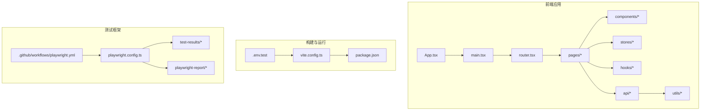
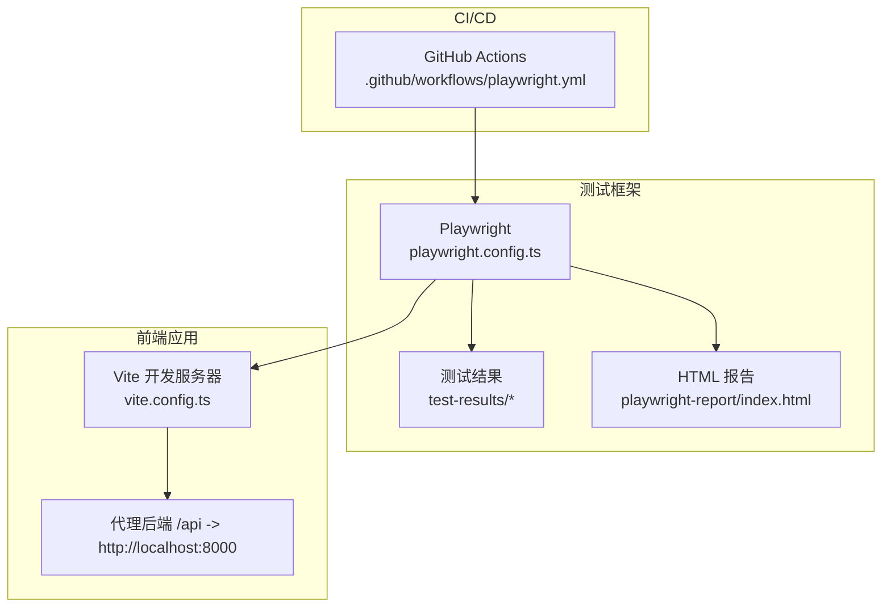
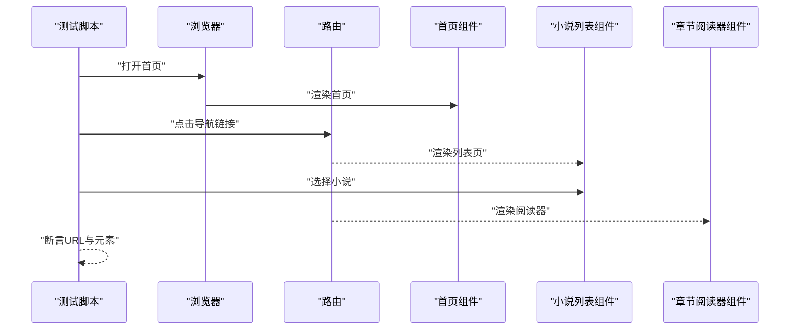
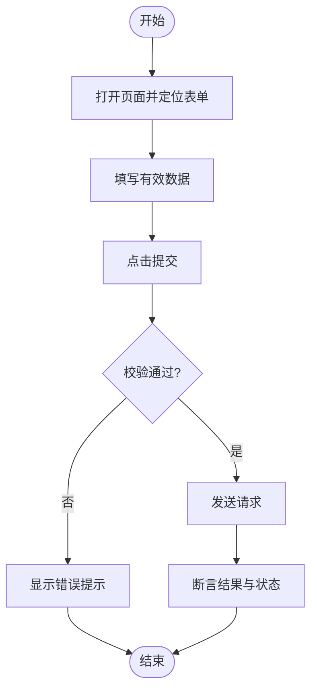
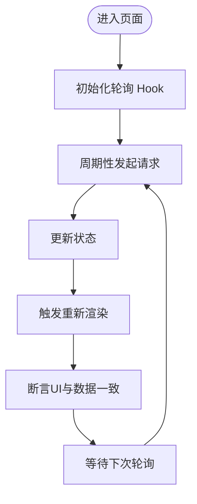
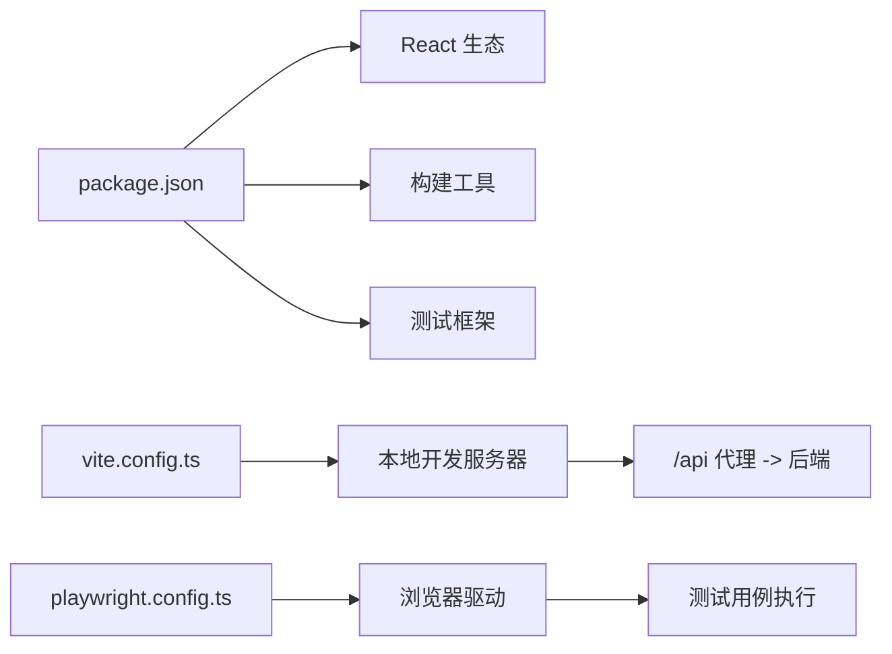

# 前端测试

<cite>
**本文引用的文件**
- [playwright.config.ts](file://playwright.config.ts)
- [.github/workflows/playwright.yml](file://.github/workflows/playwright.yml)
- [frontend/vite.config.ts](file://frontend/vite.config.ts)
- [frontend/.env.test](file://frontend/.env.test)
- [frontend/package.json](file://frontend/package.json)
- [frontend/src/App.tsx](file://frontend/src/App.tsx)
- [frontend/src/main.tsx](file://frontend/src/main.tsx)
- [frontend/src/router.tsx](file://frontend/src/router.tsx)
- [frontend/src/components/Layout/MainLayout.tsx](file://frontend/src/components/Layout/MainLayout.tsx)
- [frontend/src/pages/Dashboard.tsx](file://frontend/src/pages/Dashboard.tsx)
- [frontend/src/pages/NovelList.tsx](file://frontend/src/pages/NovelList.tsx)
- [frontend/src/pages/ChapterReader.tsx](file://frontend/src/pages/ChapterReader.tsx)
- [frontend/src/stores/useGenerationStore.ts](file://frontend/src/stores/useGenerationStore.ts)
- [frontend/src/hooks/usePolling.ts](file://frontend/src/hooks/usePolling.ts)
- [frontend/src/api/client.ts](file://frontend/src/api/client.ts)
- [frontend/src/api/novels.ts](file://frontend/src/api/novels.ts)
- [frontend/src/api/chapters.ts](file://frontend/src/api/chapters.ts)
- [frontend/src/api/characters.ts](file://frontend/src/api/characters.ts)
- [frontend/src/api/outlines.ts](file://frontend/src/api/outlines.ts)
- [frontend/src/api/generation.ts](file://frontend/src/api/generation.ts)
- [frontend/src/api/publishing.ts](file://frontend/src/api/publishing.ts)
- [frontend/src/api/aiChat.ts](file://frontend/src/api/aiChat.ts)
- [frontend/src/utils/constants.ts](file://frontend/src/utils/constants.ts)
- [frontend/src/utils/format.ts](file://frontend/src/utils/format.ts)
- [frontend/test-results/results.json](file://frontend/test-results/results.json)
- [frontend/playwright-report/index.html](file://frontend/playwright-report/index.html)
</cite>

## 目录
1. [简介](#简介)
2. [项目结构](#项目结构)
3. [核心组件](#核心组件)
4. [架构总览](#架构总览)
5. [详细组件分析](#详细组件分析)
6. [依赖分析](#依赖分析)
7. [性能考虑](#性能考虑)
8. [故障排查指南](#故障排查指南)
9. [结论](#结论)
10. [附录](#附录)

## 简介
本文件面向前端开发者，系统化梳理小说生成系统的前端测试实践，覆盖以下主题：
- 测试策略：组件测试、用户交互测试、路由测试
- Playwright 框架配置与使用：浏览器自动化、截图对比、视频录制
- 组件测试方法：UI 组件测试、状态管理测试、异步数据加载测试
- 具体用例示例：页面导航、表单提交、实时更新
- 测试数据 mock、API 拦截、用户行为模拟
- 测试报告分析、失败用例调试、测试环境配置

## 项目结构
前端位于 frontend 目录，采用 Vite + React + TypeScript 技术栈；测试以 Playwright 为主，结合本地开发服务器代理后端接口，实现端到端测试。

图表来源
- [frontend/src/App.tsx](file://frontend/src/App.tsx#L1-L50)
- [frontend/src/main.tsx](file://frontend/src/main.tsx#L1-L50)
- [frontend/src/router.tsx](file://frontend/src/router.tsx#L1-L120)
- [frontend/vite.config.ts](file://frontend/vite.config.ts#L1-L23)
- [frontend/package.json](file://frontend/package.json#L1-L42)
- [frontend/.env.test](file://frontend/.env.test#L1-L23)
- [playwright.config.ts](file://playwright.config.ts#L1-L80)
- [.github/workflows/playwright.yml](file://.github/workflows/playwright.yml#L1-L28)

章节来源
- [frontend/src/App.tsx](file://frontend/src/App.tsx#L1-L50)
- [frontend/src/main.tsx](file://frontend/src/main.tsx#L1-L50)
- [frontend/src/router.tsx](file://frontend/src/router.tsx#L1-L120)
- [frontend/vite.config.ts](file://frontend/vite.config.ts#L1-L23)
- [frontend/package.json](file://frontend/package.json#L1-L42)
- [frontend/.env.test](file://frontend/.env.test#L1-L23)
- [playwright.config.ts](file://playwright.config.ts#L1-L80)
- [.github/workflows/playwright.yml](file://.github/workflows/playwright.yml#L1-L28)

## 核心组件
- 应用入口与路由
  - 应用根组件与挂载点负责渲染路由与全局布局。
  - 路由定义了页面级组件的导航关系，是端到端测试的导航目标。
- 页面组件
  - 包含仪表盘、小说列表、章节阅读器等页面，是交互与数据加载测试的主要对象。
- 布局与通用组件
  - 主布局组件承载导航与侧边栏等通用 UI，适合进行导航一致性测试。
- 状态与钩子
  - 使用 Zustand 状态库管理生成任务状态；使用轮询 Hook 实现异步数据刷新。
- API 层
  - 统一的客户端与各业务模块 API 文件，便于在测试中进行请求拦截与数据 mock。
- 工具与常量
  - 提供格式化与常量定义，保障测试断言的一致性。

章节来源
- [frontend/src/App.tsx](file://frontend/src/App.tsx#L1-L50)
- [frontend/src/main.tsx](file://frontend/src/main.tsx#L1-L50)
- [frontend/src/router.tsx](file://frontend/src/router.tsx#L1-L120)
- [frontend/src/components/Layout/MainLayout.tsx](file://frontend/src/components/Layout/MainLayout.tsx#L1-L120)
- [frontend/src/pages/Dashboard.tsx](file://frontend/src/pages/Dashboard.tsx#L1-L120)
- [frontend/src/pages/NovelList.tsx](file://frontend/src/pages/NovelList.tsx#L1-L120)
- [frontend/src/pages/ChapterReader.tsx](file://frontend/src/pages/ChapterReader.tsx#L1-L120)
- [frontend/src/stores/useGenerationStore.ts](file://frontend/src/stores/useGenerationStore.ts#L1-L120)
- [frontend/src/hooks/usePolling.ts](file://frontend/src/hooks/usePolling.ts#L1-L120)
- [frontend/src/api/client.ts](file://frontend/src/api/client.ts#L1-L120)
- [frontend/src/api/novels.ts](file://frontend/src/api/novels.ts#L1-L120)
- [frontend/src/api/chapters.ts](file://frontend/src/api/chapters.ts#L1-L120)
- [frontend/src/api/characters.ts](file://frontend/src/api/characters.ts#L1-L120)
- [frontend/src/api/outlines.ts](file://frontend/src/api/outlines.ts#L1-L120)
- [frontend/src/api/generation.ts](file://frontend/src/api/generation.ts#L1-L120)
- [frontend/src/api/publishing.ts](file://frontend/src/api/publishing.ts#L1-L120)
- [frontend/src/api/aiChat.ts](file://frontend/src/api/aiChat.ts#L1-L120)
- [frontend/src/utils/constants.ts](file://frontend/src/utils/constants.ts#L1-L120)
- [frontend/src/utils/format.ts](file://frontend/src/utils/format.ts#L1-L120)

## 架构总览
下图展示了前端测试的整体架构：Playwright 驱动浏览器执行端到端测试，Vite 启动本地开发服务器并代理后端接口，测试结果与媒体资源输出至 test-results 与 playwright-report。

图表来源
- [.github/workflows/playwright.yml](file://.github/workflows/playwright.yml#L1-L28)
- [playwright.config.ts](file://playwright.config.ts#L1-L80)
- [frontend/vite.config.ts](file://frontend/vite.config.ts#L1-L23)
- [frontend/test-results/results.json](file://frontend/test-results/results.json#L1-L120)
- [frontend/playwright-report/index.html](file://frontend/playwright-report/index.html#L1-L200)

## 详细组件分析

### 测试策略与分层
- 组件测试
  - 针对 UI 组件（如卡片、徽章、抽屉）进行渲染与交互断言，验证 props 与事件回调。
- 用户交互测试
  - 覆盖页面导航、点击、输入、滚动等用户行为，确保路由与状态变更正确。
- 路由测试
  - 验证路径匹配、参数解析、嵌套路由与错误页行为。
- 端到端测试
  - 通过 Playwright 在真实浏览器中执行，覆盖从启动到关键业务流程的完整链路。

### Playwright 配置与使用
- 配置要点
  - 测试目录与并行策略：启用完全并行与按项目并行，提升 CI 效率。
  - 失败重试：仅在 CI 环境启用重试，减少噪声。
  - 工作进程：CI 环境串行执行，避免资源竞争。
  - 报告器：HTML 报告便于定位失败用例与媒体资源。
  - Trace 收集：首次重试时收集 trace，辅助调试。
  - 设备矩阵：包含 Chromium、Firefox、WebKit，覆盖主流桌面浏览器。
- 运行与集成
  - GitHub Actions 中安装依赖、安装浏览器、执行测试，并上传报告与媒体资源。
- 本地开发
  - 通过 Vite 本地服务提供前端访问地址，Playwright 可直接连接或通过 webServer 配置自动启动。

章节来源
- [playwright.config.ts](file://playwright.config.ts#L14-L80)
- [.github/workflows/playwright.yml](file://.github/workflows/playwright.yml#L1-L28)
- [frontend/vite.config.ts](file://frontend/vite.config.ts#L12-L22)

### 浏览器自动化、截图对比、视频录制
- 截图与视频
  - 测试失败时会生成截图与视频，保存在对应项目目录下，便于回溯问题。
- 截图对比
  - 可在 Playwright 中启用视觉回归对比（需额外配置），建议在 CI 中统一管理基准图像。
- Trace 与报告
  - trace 与 HTML 报告可帮助定位失败原因与交互序列。

章节来源
- [frontend/test-results/results.json](file://frontend/test-results/results.json#L1-L120)
- [frontend/playwright-report/index.html](file://frontend/playwright-report/index.html#L60-L80)

### 组件测试方法
- UI 组件测试
  - 使用 React 组件测试工具（如 React Testing Library 或 Jest + React Test Renderer）渲染组件，断言 DOM 结构与交互事件。
- 状态管理测试
  - 针对状态存储（Zustand）编写单元测试，验证状态变更与派生逻辑。
- 异步数据加载测试
  - 对轮询 Hook 与 API 请求进行 mock，验证加载态、成功态与错误态的 UI 表现。

章节来源
- [frontend/src/stores/useGenerationStore.ts](file://frontend/src/stores/useGenerationStore.ts#L1-L120)
- [frontend/src/hooks/usePolling.ts](file://frontend/src/hooks/usePolling.ts#L1-L120)
- [frontend/src/api/client.ts](file://frontend/src/api/client.ts#L1-L120)

### 具体测试用例示例

#### 页面导航测试
- 目标：验证从首页到小说列表、再到章节阅读器的导航链路。
- 步骤：
  - 打开首页，等待关键元素出现。
  - 点击导航链接进入小说列表。
  - 在列表中选择某本小说，跳转到详情页。
  - 在详情页切换到章节标签，进入章节阅读器。
- 断言：
  - 当前 URL 与目标一致。
  - 关键页面元素可见且内容正确。

图表来源
- [frontend/src/router.tsx](file://frontend/src/router.tsx#L1-L120)
- [frontend/src/pages/Dashboard.tsx](file://frontend/src/pages/Dashboard.tsx#L1-L120)
- [frontend/src/pages/NovelList.tsx](file://frontend/src/pages/NovelList.tsx#L1-L120)
- [frontend/src/pages/ChapterReader.tsx](file://frontend/src/pages/ChapterReader.tsx#L1-L120)

#### 表单提交测试
- 目标：验证表单输入、校验与提交流程。
- 步骤：
  - 打开相关页面，定位表单控件。
  - 输入有效/无效数据，触发校验。
  - 点击提交按钮，等待响应。
- 断言：
  - 校验提示显示符合预期。
  - 提交后页面状态或路由变化正确。

图表来源
- [frontend/src/pages/PlatformAccounts.tsx](file://frontend/src/pages/PlatformAccounts.tsx#L1-L120)
- [frontend/src/api/client.ts](file://frontend/src/api/client.ts#L1-L120)

#### 实时更新功能测试
- 目标：验证轮询机制与状态变更后的 UI 更新。
- 步骤：
  - 启动轮询 Hook，观察数据拉取频率与条件。
  - 触发状态变更（如切换任务状态），确认 UI 即时更新。
- 断言：
  - 数据项数量、状态标识与时间戳符合预期。

图表来源
- [frontend/src/hooks/usePolling.ts](file://frontend/src/hooks/usePolling.ts#L1-L120)
- [frontend/src/stores/useGenerationStore.ts](file://frontend/src/stores/useGenerationStore.ts#L1-L120)

### 测试数据 Mock 与 API 拦截
- Mock 方案
  - 使用 Playwright 的 request interception 拦截 /api 请求，返回预设响应。
  - 在测试中注入假数据，覆盖正常、异常与边界场景。
- 常见场景
  - 列表加载：返回不同长度的数据集，验证分页与空态。
  - 详情加载：返回完整实体与部分字段，验证容错。
  - 错误处理：返回 4xx/5xx，验证错误提示与重试逻辑。

章节来源
- [frontend/src/api/client.ts](file://frontend/src/api/client.ts#L1-L120)
- [frontend/src/api/novels.ts](file://frontend/src/api/novels.ts#L1-L120)
- [frontend/src/api/chapters.ts](file://frontend/src/api/chapters.ts#L1-L120)
- [frontend/src/api/characters.ts](file://frontend/src/api/characters.ts#L1-L120)
- [frontend/src/api/outlines.ts](file://frontend/src/api/outlines.ts#L1-L120)
- [frontend/src/api/generation.ts](file://frontend/src/api/generation.ts#L1-L120)
- [frontend/src/api/publishing.ts](file://frontend/src/api/publishing.ts#L1-L120)
- [frontend/src/api/aiChat.ts](file://frontend/src/api/aiChat.ts#L1-L120)

### 用户行为模拟
- 点击与导航
  - 定位菜单项与按钮，模拟点击事件，断言路由变化。
- 输入与表单
  - 使用 fill、type 等操作输入文本，模拟键盘事件。
- 滚动与视口
  - 模拟滚动到底部触发加载更多，或调整窗口大小验证响应式。

章节来源
- [frontend/src/components/Layout/MainLayout.tsx](file://frontend/src/components/Layout/MainLayout.tsx#L1-L120)
- [frontend/src/pages/Dashboard.tsx](file://frontend/src/pages/Dashboard.tsx#L1-L120)
- [frontend/src/pages/NovelList.tsx](file://frontend/src/pages/NovelList.tsx#L1-L120)
- [frontend/src/pages/ChapterReader.tsx](file://frontend/src/pages/ChapterReader.tsx#L1-L120)

## 依赖分析
- 前端依赖
  - React、React Router、Ant Design、Axios、Zustand、Day.js 等。
- 构建与开发
  - Vite 提供开发服务器与代理配置，便于联调后端。
- 测试依赖
  - Playwright 作为核心测试框架，配合 GitHub Actions 实现 CI 自动化。

图表来源
- [frontend/package.json](file://frontend/package.json#L1-L42)
- [frontend/vite.config.ts](file://frontend/vite.config.ts#L1-L23)
- [playwright.config.ts](file://playwright.config.ts#L1-L80)

章节来源
- [frontend/package.json](file://frontend/package.json#L1-L42)
- [frontend/vite.config.ts](file://frontend/vite.config.ts#L1-L23)
- [playwright.config.ts](file://playwright.config.ts#L1-L80)

## 性能考虑
- 并行与重试
  - 在本地开发时充分利用并行能力；在 CI 中适度重试，避免瞬时失败影响整体质量。
- 资源隔离
  - 将测试媒体与报告输出分离，便于清理与归档。
- 代理与缓存
  - 合理配置 Vite 代理，避免重复请求；在测试中使用缓存策略减少网络波动。

## 故障排查指南
- 查看测试报告
  - 打开 HTML 报告，定位失败用例与错误上下文。
- 分析媒体资源
  - 检查截图与视频，确认失败时刻的界面状态。
- 解析 trace
  - 在首次重试时生成的 trace 中回放交互序列，快速定位问题。
- 环境变量与端口
  - 确认测试环境变量与本地端口一致，避免跨环境差异。
- 代理与后端连通性
  - 确保 /api 代理指向正确的后端地址，必要时在本地启动后端服务。

章节来源
- [frontend/playwright-report/index.html](file://frontend/playwright-report/index.html#L60-L80)
- [frontend/test-results/results.json](file://frontend/test-results/results.json#L1-L120)
- [frontend/.env.test](file://frontend/.env.test#L1-L23)
- [frontend/vite.config.ts](file://frontend/vite.config.ts#L15-L20)

## 结论
通过 Playwright 与 Vite 的组合，小说生成系统的前端测试实现了从组件到端到端的全链路覆盖。建议在现有基础上完善：
- 增加视觉回归对比与更细粒度的状态测试
- 优化 CI 中的并行与重试策略，平衡速度与稳定性
- 建立统一的测试数据与 API Mock 管理规范

## 附录
- 测试环境配置要点
  - 设置 NODE_ENV 为 test，配置 BASE_URL 与超时时间
  - 在 CI 中安装浏览器并执行测试，上传报告与媒体资源
- 推荐的测试组织方式
  - 按页面与功能模块划分测试文件，命名清晰、断言明确
- 最佳实践
  - 优先断言用户可见的行为与状态，避免过度依赖实现细节
  - 在失败用例中保留足够的上下文信息，便于复现与修复