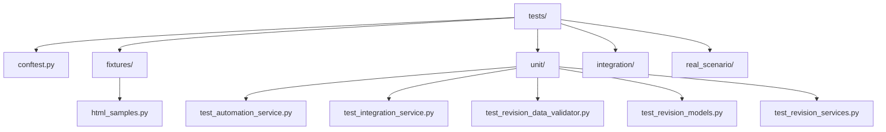
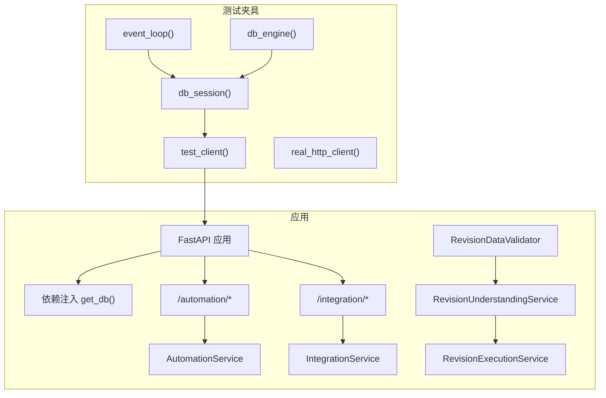
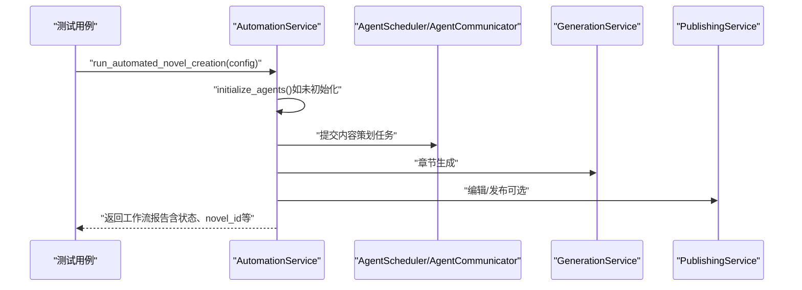
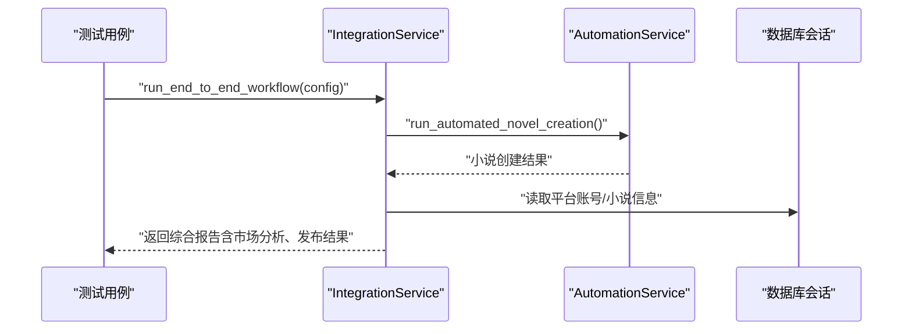
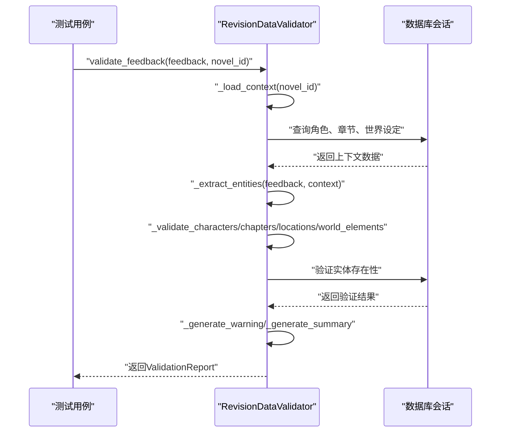
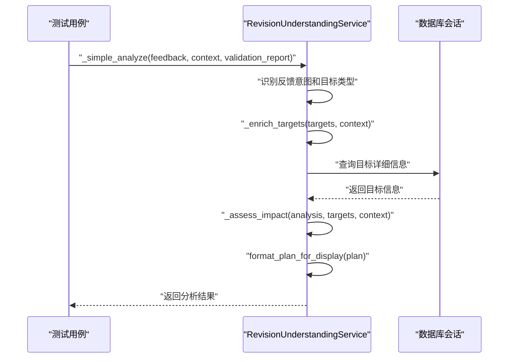
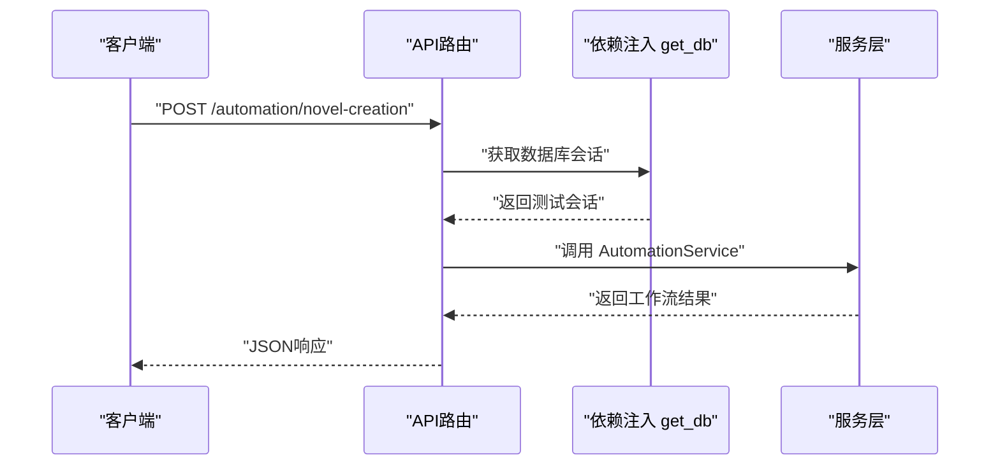
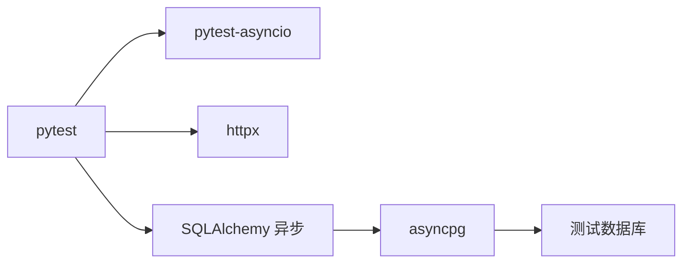

# 单元测试

<cite>
**本文引用的文件**
- [tests/conftest.py](file://tests/conftest.py)
- [tests/unit/test_automation_service.py](file://tests/unit/test_automation_service.py)
- [tests/unit/test_integration_service.py](file://tests/unit/test_integration_service.py)
- [tests/unit/test_revision_data_validator.py](file://tests/unit/test_revision_data_validator.py)
- [tests/unit/test_revision_models.py](file://tests/unit/test_revision_models.py)
- [tests/unit/test_revision_services.py](file://tests/unit/test_revision_services.py)
- [tests/fixtures/html_samples.py](file://tests/fixtures/html_samples.py)
- [pyproject.toml](file://pyproject.toml)
- [backend/main.py](file://backend/main.py)
- [backend/dependencies.py](file://backend/dependencies.py)
- [backend/api/v1/automation.py](file://backend/api/v1/automation.py)
- [backend/api/v1/integration.py](file://backend/api/v1/integration.py)
- [backend/services/automation_service.py](file://backend/services/automation_service.py)
- [backend/services/integration_service.py](file://backend/services/integration_service.py)
- [backend/services/revision_data_validator.py](file://backend/services/revision_data_validator.py)
- [backend/services/revision_understanding_service.py](file://backend/services/revision_understanding_service.py)
- [backend/services/revision_execution_service.py](file://backend/services/revision_execution_service.py)
</cite>

## 目录
1. [简介](#简介)
2. [项目结构](#项目结构)
3. [核心组件](#核心组件)
4. [架构总览](#架构总览)
5. [详细组件分析](#详细组件分析)
6. [依赖分析](#依赖分析)
7. [性能考虑](#性能考虑)
8. [故障排查指南](#故障排查指南)
9. [结论](#结论)
10. [附录](#附录)

## 简介
本文件面向开发者，系统化梳理小说生成系统的单元测试设计与实施指南。内容涵盖测试组织结构、测试夹具（fixtures）设计、Mock策略、依赖注入测试配置、自动化与集成服务的测试方法（含边界条件与异常处理）、**修订数据验证服务的全面测试覆盖**、性能基准建议、测试命名与断言策略，并提供可直接参考的测试代码路径与图示。

**更新** 新增了290行的修订数据验证测试套件，包含全面的pytest测试覆盖各种验证场景，显著增强了系统的测试完整性。

## 项目结构
测试目录采用按"功能域+层次"混合组织方式：
- tests/
  - conftest.py：全局测试夹具与事件循环配置
  - fixtures/：测试数据与样本（如HTML解析样例）
  - unit/：单元测试（按服务或模块划分）
  - integration/：集成测试（端到端或跨模块）
  - real_scenario/：真实场景测试（如网络爬取）

pytest通过配置文件启用异步模式与自定义标记，便于区分不同类型的测试。

**图表来源**
- [tests/conftest.py:1-99](file://tests/conftest.py#L1-L99)
- [tests/unit/test_automation_service.py:1-87](file://tests/unit/test_automation_service.py#L1-L87)
- [tests/unit/test_integration_service.py:1-59](file://tests/unit/test_integration_service.py#L1-L59)
- [tests/unit/test_revision_data_validator.py:1-291](file://tests/unit/test_revision_data_validator.py#L1-L291)
- [tests/unit/test_revision_models.py:1-352](file://tests/unit/test_revision_models.py#L1-L352)
- [tests/unit/test_revision_services.py:1-225](file://tests/unit/test_revision_services.py#L1-L225)
- [tests/fixtures/html_samples.py:1-135](file://tests/fixtures/html_samples.py#L1-L135)

**章节来源**
- [pyproject.toml:54-64](file://pyproject.toml#L54-L64)

## 核心组件
- 全局夹具（conftest）
  - 事件循环：为异步测试提供稳定的事件循环实例，避免第三方驱动（如asyncpg）的事件循环问题。
  - 数据库引擎与会话：为每个测试函数创建独立的异步数据库引擎与事务性会话，确保隔离与回滚。
  - FastAPI测试客户端：重写依赖注入中的数据库会话，使用内存式测试客户端访问API端点。
  - 真实HTTP客户端：用于需要真实网络访问的场景测试。
- 服务层测试
  - 自动化服务：覆盖工作流启动、代理初始化、批量任务等。
  - 集成服务：覆盖端到端工作流、历史查询、详情查询等。
  - **修订数据验证服务**：**新增** 全面覆盖角色、章节、地点、世界元素的实体验证，包含章节号提取、中文数字转换、相似名称查找等功能。
  - **修订理解与执行服务**：覆盖反馈分析、目标解析、影响评估、修订计划生成等功能。
- 夹具数据
  - HTML样本：模拟起点、标签、详情、分类、空页、部分字段缺失等边界场景，支撑解析逻辑的单元测试。

**章节来源**
- [tests/conftest.py:21-99](file://tests/conftest.py#L21-L99)
- [tests/unit/test_automation_service.py:1-87](file://tests/unit/test_automation_service.py#L1-L87)
- [tests/unit/test_integration_service.py:1-59](file://tests/unit/test_integration_service.py#L1-L59)
- [tests/unit/test_revision_data_validator.py:1-291](file://tests/unit/test_revision_data_validator.py#L1-L291)
- [tests/unit/test_revision_models.py:1-352](file://tests/unit/test_revision_models.py#L1-L352)
- [tests/unit/test_revision_services.py:1-225](file://tests/unit/test_revision_services.py#L1-L225)
- [tests/fixtures/html_samples.py:1-135](file://tests/fixtures/html_samples.py#L1-L135)

## 架构总览
下图展示了测试夹具与被测对象之间的关系，以及API端点与服务层的交互。

**图表来源**
- [tests/conftest.py:21-99](file://tests/conftest.py#L21-L99)
- [backend/main.py:15-32](file://backend/main.py#L15-L32)
- [backend/dependencies.py:12-19](file://backend/dependencies.py#L12-L19)
- [backend/api/v1/automation.py:13-28](file://backend/api/v1/automation.py#L13-L28)
- [backend/api/v1/integration.py:13-28](file://backend/api/v1/integration.py#L13-L28)
- [backend/services/automation_service.py:27-40](file://backend/services/automation_service.py#L27-L40)
- [backend/services/integration_service.py:17-25](file://backend/services/integration_service.py#L17-L25)
- [backend/services/revision_data_validator.py:43-57](file://backend/services/revision_data_validator.py#L43-L57)
- [backend/services/revision_understanding_service.py:1-200](file://backend/services/revision_understanding_service.py#L1-L200)
- [backend/services/revision_execution_service.py:1-200](file://backend/services/revision_execution_service.py#L1-L200)

## 详细组件分析

### 自动化服务单元测试
- 测试目标
  - run_automated_novel_creation：验证工作流返回结构、关键字段存在性。
  - initialize_agents：验证代理集合初始化与关键代理键存在。
  - get_workflow_status：验证状态查询返回结构。
  - run_batch_automation：验证批量任务统计与结果长度。
- 断言策略
  - 结构断言：检查返回字典的关键键是否存在。
  - 类型断言：确认返回值类型符合预期。
- 异常处理
  - 服务内部对异常进行捕获并返回标准化错误结构，测试应覆盖失败分支（例如通过构造异常路径或外部依赖失败）。
- 性能与并发
  - 服务内部使用异步任务与调度器，测试可通过控制外部依赖耗时或使用Mock来评估关键路径耗时。

**图表来源**
- [tests/unit/test_automation_service.py:6-86](file://tests/unit/test_automation_service.py#L6-L86)
- [backend/services/automation_service.py:80-166](file://backend/services/automation_service.py#L80-L166)

**章节来源**
- [tests/unit/test_automation_service.py:1-87](file://tests/unit/test_automation_service.py#L1-L87)
- [backend/services/automation_service.py:27-200](file://backend/services/automation_service.py#L27-L200)

### 集成服务单元测试
- 测试目标
  - run_end_to_end_workflow：验证端到端工作流返回结构、市场分析报告与发布结果。
  - get_workflow_history：验证历史记录结构与分页参数。
  - get_workflow_detail：验证详情结构与workflow_id一致性。
- 断言策略
  - 字段存在性与类型断言。
  - 对novel_info、summary等聚合字段进行结构断言。
- 异常处理
  - 当子流程失败时，集成服务返回失败状态与错误信息；测试需覆盖失败路径。

**图表来源**
- [tests/unit/test_integration_service.py:6-59](file://tests/unit/test_integration_service.py#L6-L59)
- [backend/services/integration_service.py:26-111](file://backend/services/integration_service.py#L26-L111)

**章节来源**
- [tests/unit/test_integration_service.py:1-59](file://tests/unit/test_integration_service.py#L1-L59)
- [backend/services/integration_service.py:17-200](file://backend/services/integration_service.py#L17-L200)

### 修订数据验证服务单元测试

**新增** 修订数据验证服务是系统的重要组成部分，负责验证用户反馈中的实体是否存在，确保修订建议的有效性。

- 测试目标
  - validate_feedback：验证用户反馈中的角色、章节、地点、世界元素是否存在。
  - _extract_entities：测试实体提取功能，包括章节号、角色名、世界元素、地点关键词。
  - _chinese_to_number：测试中文数字转换功能。
  - _find_similar_names：测试相似名称查找功能。
  - _generate_warning：测试警告信息生成。
  - _generate_summary：测试验证总结生成。
- 测试场景
  - 无实体引用的反馈验证
  - 存在角色的反馈验证
  - 未知角色（数据库中不存在）的反馈验证
  - 章节引用验证（存在与不存在）
  - 世界元素关键词提取
  - 中文数字转换测试
  - 相似名称查找测试
  - 警告信息生成测试
  - 验证总结生成测试
- 断言策略
  - 结构断言：检查ValidationReport和EntityValidationResult的结构。
  - 实体存在性断言：验证exists字段和matched_item。
  - 建议断言：验证suggestions列表的生成。
  - 统计断言：验证entity_count、valid_count、invalid_count的计算。
- Mock策略
  - 使用AsyncMock模拟数据库会话。
  - 使用MagicMock模拟查询结果。
  - 使用side_effect模拟多次查询的不同结果。

**图表来源**
- [tests/unit/test_revision_data_validator.py:28-132](file://tests/unit/test_revision_data_validator.py#L28-L132)
- [backend/services/revision_data_validator.py:58-132](file://backend/services/revision_data_validator.py#L58-L132)

**章节来源**
- [tests/unit/test_revision_data_validator.py:1-291](file://tests/unit/test_revision_data_validator.py#L1-L291)
- [backend/services/revision_data_validator.py:1-619](file://backend/services/revision_data_validator.py#L1-L619)

### 修订理解与执行服务单元测试

**新增** 修订理解与执行服务负责处理用户反馈并生成相应的修订计划。

- 测试目标
  - _simple_analyze：测试简化分析功能，识别反馈意图和目标类型。
  - _enrich_targets：测试目标补充功能，为目标添加ID和当前值。
  - _assess_impact：测试影响评估功能，分析修订对章节的影响。
  - format_plan_for_display：测试修订计划格式化功能。
  - _build_analysis_prompt：测试分析提示构建功能。
- 测试场景
  - 带章节引用的反馈分析
  - 世界观反馈分析
  - 大纲反馈分析
  - 章节反馈分析
  - 角色目标ID补充
  - 章节目标ID补充
  - 角色修改影响评估
  - 修订计划格式化
  - 分析提示构建
- 断言策略
  - 意图断言：验证understood_intent的正确性。
  - 目标类型断言：验证target_type的识别准确性。
  - ID断言：验证目标ID的补充。
  - 影响范围断言：验证受影响章节的识别。
  - 格式断言：验证修订计划的格式化输出。
- Mock策略
  - 使用AsyncMock模拟数据库会话。
  - 使用MagicMock模拟查询结果。
  - 使用side_effect模拟多次查询的不同结果。

**图表来源**
- [tests/unit/test_revision_services.py:31-194](file://tests/unit/test_revision_services.py#L31-L194)
- [backend/services/revision_understanding_service.py:1-200](file://backend/services/revision_understanding_service.py#L1-L200)

**章节来源**
- [tests/unit/test_revision_services.py:1-225](file://tests/unit/test_revision_services.py#L1-L225)
- [backend/services/revision_understanding_service.py:1-200](file://backend/services/revision_understanding_service.py#L1-L200)

### 修订模型单元测试

**新增** 修订模型单元测试确保修订计划和记忆模型的正确性。

- 测试目标
  - 枚举值测试：验证修订计划状态和目标类型的枚举值。
  - 模型列测试：验证修订计划和记忆模型的列定义。
  - 模型创建测试：验证模型实例的创建和属性设置。
  - 字典转换测试：验证模型到字典的转换功能。
- 测试场景
  - RevisionPlanStatus枚举值测试
  - RevisionTargetType枚举值测试
  - HindsightExperience模型列测试
  - StrategyEffectiveness模型列测试
  - UserPreference模型列测试
  - 各种模型的创建和属性测试
  - 模型字典转换测试
- 断言策略
  - 枚举值断言：验证枚举值的字符串表示。
  - 列存在性断言：验证模型表列的存在性。
  - 属性断言：验证模型属性的正确设置。
  - 字典结构断言：验证to_dict()方法的输出结构。

**章节来源**
- [tests/unit/test_revision_models.py:1-352](file://tests/unit/test_revision_models.py#L1-L352)

### 测试夹具与依赖注入配置
- 事件循环
  - 使用session级fixture创建独立事件循环，避免异步驱动的事件循环共享问题。
- 数据库引擎与会话
  - 每个测试函数拥有独立引擎与事务，测试结束后回滚，保证数据隔离。
- FastAPI测试客户端
  - 通过依赖覆盖将get_db替换为测试会话，使API端点在测试中直接使用内存数据库。
- 真实HTTP客户端
  - 用于需要真实网络访问的场景测试，如爬虫或外部接口调用。

**图表来源**
- [tests/conftest.py:21-99](file://tests/conftest.py#L21-L99)

**章节来源**
- [tests/conftest.py:1-99](file://tests/conftest.py#L1-L99)

### API端点与服务层交互
- 自动化API
  - /automation/novel-creation：触发自动化小说创建流程。
  - /automation/workflow-status/{workflow_id}：查询工作流状态。
  - /automation/batch-automation：批量自动化任务。
  - /automation/initialize-agents：初始化代理。
- 集成API
  - /integration/end-to-end-workflow：端到端工作流。
  - /integration/workflow-history：工作流历史。
  - /integration/workflow-detail/{workflow_id}：工作流详情。

**图表来源**
- [backend/api/v1/automation.py:13-28](file://backend/api/v1/automation.py#L13-L28)
- [backend/dependencies.py:12-19](file://backend/dependencies.py#L12-L19)
- [backend/main.py:31-32](file://backend/main.py#L31-L32)

**章节来源**
- [backend/api/v1/automation.py:1-89](file://backend/api/v1/automation.py#L1-L89)
- [backend/api/v1/integration.py:1-61](file://backend/api/v1/integration.py#L1-L61)
- [backend/dependencies.py:1-23](file://backend/dependencies.py#L1-L23)
- [backend/main.py:1-53](file://backend/main.py#L1-L53)

## 依赖分析
- 测试框架与异步支持
  - pytest与pytest-asyncio配置，支持async/await测试。
  - 自定义标记：unit、network、real_crawl、integration、slow，便于分组执行与过滤。
- 外部依赖
  - httpx用于构建ASGI测试客户端。
  - SQLAlchemy异步引擎与会话，配合Alembic迁移脚本进行数据库初始化与清理。
- 服务层耦合
  - AutomationService与IntegrationService均依赖数据库会话与各子服务（生成、发布），测试通过夹具注入会话，避免真实数据库依赖。
  - **修订数据验证服务**与**修订理解服务**形成完整的修订处理链路。

**图表来源**
- [pyproject.toml:38-42](file://pyproject.toml#L38-L42)
- [tests/conftest.py:6-8](file://tests/conftest.py#L6-L8)
- [backend/dependencies.py:7-19](file://backend/dependencies.py#L7-L19)

**章节来源**
- [pyproject.toml:54-64](file://pyproject.toml#L54-L64)
- [tests/conftest.py:1-99](file://tests/conftest.py#L1-L99)

## 性能考虑
- 异步事件循环与数据库事务
  - 使用session级事件循环与function级引擎/会话，减少上下文切换开销，提升测试执行效率。
- Mock与外部依赖
  - 对LLM客户端、代理通信器等外部依赖进行Mock，避免真实网络与计算开销，聚焦业务逻辑断言。
- 批量任务与并发
  - 在批量自动化测试中，通过控制外部依赖耗时或使用Mock，评估关键路径耗时与并发稳定性。
- **修订数据验证性能**
  - **新增** 使用并行查询加载小说上下文，减少数据库查询次数。
  - **新增** 通过side_effect模拟多次查询，提高测试执行效率。
- 建议
  - 使用pytest标记筛选慢测试，结合缓存与并行执行（在隔离条件下）优化整体测试时长。

## 故障排查指南
- 事件循环相关错误
  - 症状：异步驱动报错或事件循环未就绪。
  - 排查：确认使用了session级event_loop夹具。
- 数据库事务未回滚
  - 症状：测试间数据污染。
  - 排查：确认db_session夹具正确创建事务并在测试后回滚。
- API测试无法注入测试会话
  - 症状：API端点仍使用生产数据库。
  - 排查：确认test_client夹具正确覆盖get_db依赖，并在测试结束后清理覆盖。
- 真实HTTP客户端超时或被拒
  - 症状：网络请求失败。
  - 排查：调整超时与follow_redirects参数，或在可控环境下使用Mock。
- **修订数据验证测试失败**
  - **新增** 症状：实体验证结果不符合预期。
  - **新增** 排查：检查_mock_db_session的side_effect配置，确认execute方法的返回值设置正确。

**章节来源**
- [tests/conftest.py:21-99](file://tests/conftest.py#L21-L99)

## 结论
本测试体系以夹具为核心，结合pytest异步支持与FastAPI依赖注入，实现了对自动化与集成服务的高效、隔离、可维护的单元测试。**新增的修订数据验证测试套件显著增强了系统的测试完整性，覆盖了角色、章节、地点、世界元素的全面验证场景**。通过Mock策略与边界数据样例，测试覆盖了正常流程、异常处理与关键边界条件。建议持续完善性能基准与覆盖率指标，逐步引入API端点的单元测试与更丰富的边界场景。

## 附录

### 测试命名规范
- 服务层测试文件：tests/unit/test_{service_name}.py
- API端点测试文件：tests/unit/test_api_{endpoint}.py（可选）
- 场景测试文件：tests/real_scenario/test_{scenario}.py（可选）
- 标记使用
  - @pytest.mark.unit：纯单元测试（Mock为主）
  - @pytest.mark.integration：需要数据库或外部服务
  - @pytest.mark.network：需要网络访问
  - @pytest.mark.real_crawl：真实爬取场景
  - @pytest.mark.slow：耗时较长的测试

**章节来源**
- [pyproject.toml:57-63](file://pyproject.toml#L57-L63)

### 断言策略
- 结构断言：检查返回字典的关键键是否存在。
- 类型断言：确认返回值类型（字符串、字典、列表、UUID等）。
- 状态断言：校验状态码、success标志与错误字段。
- 边界断言：针对空数据、部分字段缺失、异常输入进行断言。
- **修订数据验证断言**：**新增** 验证实体存在性、建议生成、统计计算的准确性。

### 测试覆盖率与基准
- 覆盖率工具：pytest-cov（在dev依赖中可用）
- 建议
  - 关键服务与API端点达到较高覆盖率（如≥80%）。
  - 对异常路径与边界条件单独统计覆盖率。
  - 使用基准测试（如pytest-benchmark）对关键路径进行回归对比。
  - **修订数据验证服务**：**新增** 建议达到90%以上的测试覆盖率。

**章节来源**
- [pyproject.toml:38-42](file://pyproject.toml#L38-L42)

### 示例：测试异步函数、数据库操作、API端点
- 异步函数
  - 参考：tests/unit/test_automation_service.py 中的 run_automated_novel_creation、initialize_agents、run_batch_automation。
  - **修订数据验证**：**新增** 参考：tests/unit/test_revision_data_validator.py 中的 validate_feedback、_extract_entities、_chinese_to_number等异步方法。
- 数据库操作
  - 参考：tests/conftest.py 中的 db_session夹具与事务回滚。
  - **修订数据验证**：**新增** 参考：tests/unit/test_revision_data_validator.py 中的 mock_db_session fixture和side_effect配置。
- API端点
  - 参考：tests/conftest.py 中的 test_client夹具与依赖覆盖；backend/api/v1/automation.py 与 backend/api/v1/integration.py 的端点定义。

**章节来源**
- [tests/unit/test_automation_service.py:1-87](file://tests/unit/test_automation_service.py#L1-L87)
- [tests/unit/test_integration_service.py:1-59](file://tests/unit/test_integration_service.py#L1-L59)
- [tests/unit/test_revision_data_validator.py:1-291](file://tests/unit/test_revision_data_validator.py#L1-L291)
- [tests/conftest.py:55-73](file://tests/conftest.py#L55-L73)
- [backend/api/v1/automation.py:13-28](file://backend/api/v1/automation.py#L13-L28)
- [backend/api/v1/integration.py:13-28](file://backend/api/v1/integration.py#L13-L28)