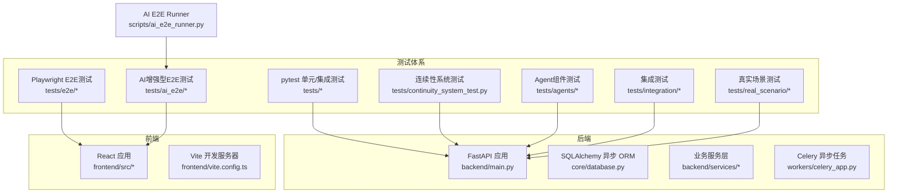
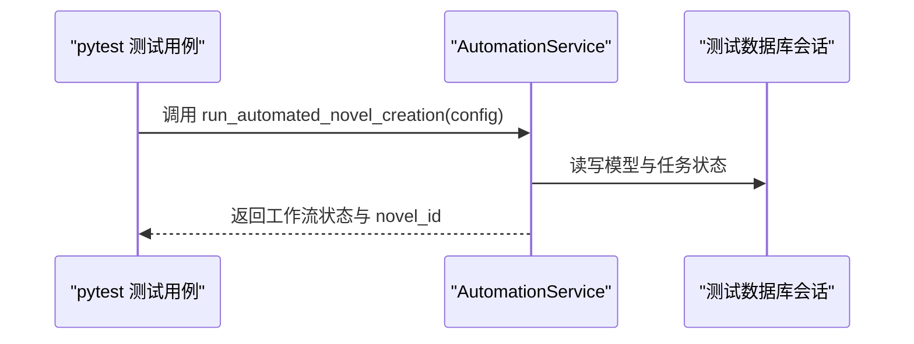
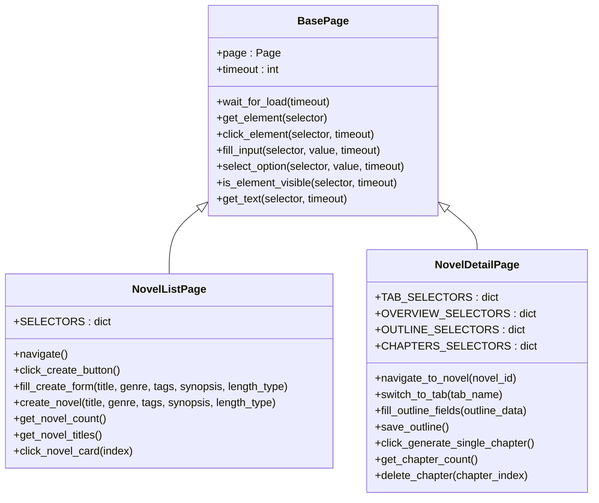
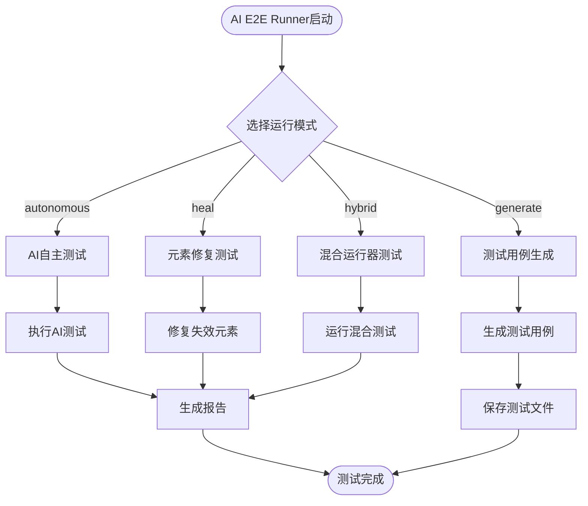
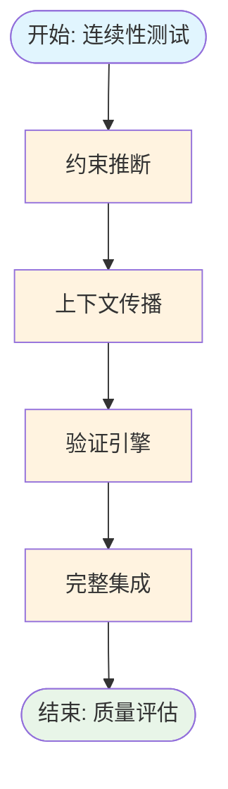
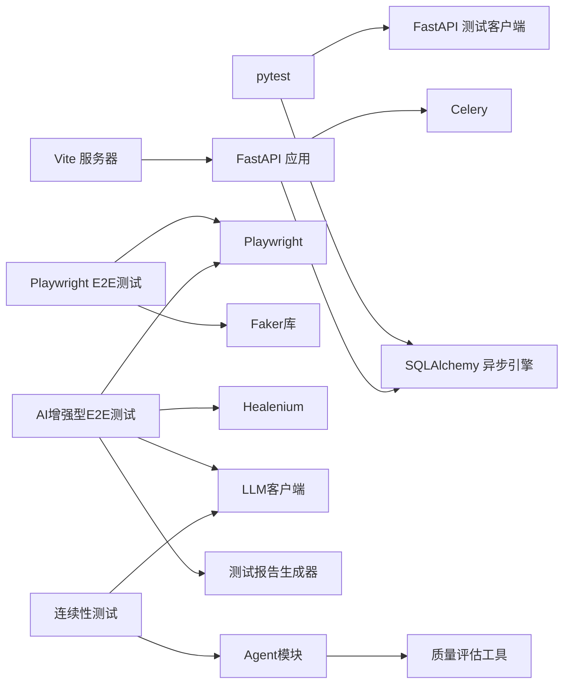

# 测试策略

<cite>
**本文引用的文件**
- [pyproject.toml](file://pyproject.toml)
- [tests/conftest.py](file://tests/conftest.py)
- [tests/unit/test_automation_service.py](file://tests/unit/test_automation_service.py)
- [tests/unit/test_integration_service.py](file://tests/unit/test_integration_service.py)
- [tests/unit/test_review_loop_enhancements.py](file://tests/unit/test_review_loop_enhancements.py)
- [tests/integration/test_outline_system.py](file://tests/integration/test_outline_system.py)
- [tests/agents/test_context_compression_enhancement.py](file://tests/agents/test_context_compression_enhancement.py)
- [tests/agents/test_dynamic_iteration.py](file://tests/agents/test_dynamic_iteration.py)
- [tests/agents/test_editor_validation.py](file://tests/agents/test_editor_validation.py)
- [tests/agents/test_quality_dimension_unification.py](file://tests/agents/test_quality_dimension_unification.py)
- [tests/continuity_system_test.py](file://tests/continuity_system_test.py)
- [frontend/vite.config.ts](file://frontend/vite.config.ts)
- [frontend/package.json](file://frontend/package.json)
- [.github/workflows/playwright.yml](file://.github/workflows/playwright.yml)
- [tests/e2e/conftest.py](file://tests/e2e/conftest.py)
- [tests/e2e/pages/base_page.py](file://tests/e2e/pages/base_page.py)
- [tests/e2e/pages/novel_list_page.py](file://tests/e2e/pages/novel_list_page.py)
- [tests/e2e/pages/novel_detail_page.py](file://tests/e2e/pages/novel_detail_page.py)
- [tests/e2e/utils/data_generator.py](file://tests/e2e/utils/data_generator.py)
- [tests/e2e/test_scenarios/test_creation_flow.py](file://tests/e2e/test_scenarios/test_creation_flow.py)
- [tests/e2e/test_scenarios/test_outline_flow.py](file://tests/e2e/test_scenarios/test_outline_flow.py)
- [tests/e2e/test_scenarios/test_chapter_flow.py](file://tests/e2e/test_scenarios/test_chapter_flow.py)
- [tests/e2e/USAGE_DOCUMENTATION.md](file://tests/e2e/USAGE_DOCUMENTATION.md)
- [tests/e2e/TEST_REPORT.md](file://tests/e2e/TEST_REPORT.md)
- [requirements.txt](file://requirements.txt)
- [scripts/ai_e2e_runner.py](file://scripts/ai_e2e_runner.py)
- [tests/ai_e2e/config.py](file://tests/ai_e2e/config.py)
- [tests/ai_e2e/agents/self_healer.py](file://tests/ai_e2e/agents/self_healer.py)
- [tests/ai_e2e/runners/hybrid_runner.py](file://tests/ai_e2e/runners/hybrid_runner.py)
- [tests/ai_e2e/selectors/healenium_adapter.py](file://tests/ai_e2e/selectors/healenium_adapter.py)
- [tests/ai_e2e/agents/reporter.py](file://tests/ai_e2e/agents/reporter.py)
- [tests/ai_e2e/agents/test_executor.py](file://tests/ai_e2e/agents/test_executor.py)
- [tests/ai_e2e/agents/test_generator.py](file://tests/ai_e2e/agents/test_generator.py)
</cite>

## 更新摘要
**所做更改**
- 新增完整的AI增强型E2E测试框架，包括AI E2E Runner、SelfHealer代理、混合运行器等全新测试能力
- 集成AI自动执行、测试生成、自愈机制的智能测试体系
- 提供基于Healenium和LLM的双重自愈策略，显著提升测试稳定性
- 新增AI测试执行器、测试生成器、测试报告生成器等核心组件
- 建立从传统E2E测试到AI增强测试的完整演进路径

## 目录
1. [引言](#引言)
2. [项目结构](#项目结构)
3. [核心组件](#核心组件)
4. [架构总览](#架构总览)
5. [详细组件分析](#详细组件分析)
6. [依赖关系分析](#依赖关系分析)
7. [性能考虑](#性能考虑)
8. [故障排查指南](#故障排查指南)
9. [结论](#结论)
10. [附录](#附录)

## 引言
本测试策略文档面向测试工程师与开发人员，围绕小说生成系统的多层次测试体系进行系统化设计与落地指导。涵盖单元测试、集成测试、端到端测试的组织结构与实施策略；明确测试框架选择与配置（pytest、Playwright）；制定Mock策略（外部依赖模拟、数据库隔离、异步任务测试）；给出测试用例设计指南（边界条件、异常处理、性能测试）；覆盖前端组件测试、用户交互测试、自动化测试流程；并包含测试数据管理、测试环境配置、持续集成中的测试执行、测试覆盖率与质量门禁、回归测试策略。

**更新** 新增完整的AI增强型E2E测试框架，提供基于AI的全自动化测试执行、智能测试生成、Healenium自愈机制等全新测试能力，形成从传统测试到AI增强测试的完整演进路径。

## 项目结构
该仓库采用前后端分离与多模块协同的结构：后端基于 FastAPI，数据库使用 SQLAlchemy 异步 ORM，消息队列与异步任务由 Celery 驱动；前端基于 Vite + React；测试体系主要集中在后端 pytest 单元/集成测试、新增的E2E端到端测试、AI增强型E2E测试框架、Agent组件测试和连续性系统测试。AI增强型E2E测试框架基于Playwright + Healenium + LLM构建，提供智能测试执行、自动生成测试用例、元素定位自愈等高级功能。



**图表来源**
- [pyproject.toml:8-36](file://pyproject.toml#L8-L36)
- [frontend/vite.config.ts:12-22](file://frontend/vite.config.ts#L12-L22)
- [workers/celery_app.py:1-26](file://workers/celery_app.py#L1-L26)
- [tests/continuity_system_test.py:1-309](file://tests/continuity_system_test.py#L1-L309)
- [tests/agents/test_context_compression_enhancement.py:1-401](file://tests/agents/test_context_compression_enhancement.py#L1-L401)
- [tests/e2e/conftest.py:1-173](file://tests/e2e/conftest.py#L1-L173)
- [scripts/ai_e2e_runner.py:1-630](file://scripts/ai_e2e_runner.py#L1-L630)

**章节来源**
- [pyproject.toml:8-64](file://pyproject.toml#L8-L64)
- [frontend/vite.config.ts:1-23](file://frontend/vite.config.ts#L1-L23)

## 核心组件
- 后端测试基础设施
  - pytest 配置与标记：支持单元、网络、真实爬取、集成、慢测试等标记，统一测试路径与异步模式。
  - 数据库隔离：通过 session 级别引擎与事务回滚，确保每个测试用例的数据隔离与可重复性。
  - FastAPI 测试客户端：重写依赖注入以指向测试数据库会话，避免真实数据库污染。
- E2E测试基础设施
  - Playwright配置：支持无头模式、慢动作演示、浏览器参数配置。
  - 页面对象模型：BasePage、NovelListPage、NovelDetailPage提供稳定的UI交互封装。
  - 测试数据生成器：TestDataGenerator使用Faker库生成真实的中文测试数据。
  - 测试场景：创建流程、大纲流程、章节生成流程的完整端到端测试。
- AI增强型E2E测试框架
  - **AI E2E Runner**：统一的AI测试运行器，支持自主测试、测试生成、元素修复、混合运行等模式。
  - **AI测试执行器**：基于LLM的全AI自动执行引擎，无需预定义测试步骤，AI自主决策操作序列。
  - **SelfHealer自愈器**：集成Healenium和AI的双重自愈机制，自动修复失效的元素定位。
  - **混合运行器**：协调Playwright和Selenium/Healenium的测试执行，实现元素定位失败时的自动修复。
  - **测试生成器**：基于页面分析和需求描述，自动生成E2E测试用例代码。
  - **Healenium适配器**：连接Healenium自愈服务，实现元素定位的智能修复和评分。
  - **配置管理**：统一管理Playwright、Healenium、AI大模型等配置参数。
- 前端测试基础设施
  - Vite 开发服务器：本地代理转发 /api 到后端，便于测试联调。
  - 简化的前端测试：移除了Playwright端到端测试，保留基础的组件测试能力。
- 新增测试模块
  - 连续性系统测试：验证章节连贯性保障功能的完整流程
  - Agent组件测试：覆盖上下文压缩、动态迭代、Editor验证、质量维度统一等核心功能
  - 增强审查循环测试：完善IssueTracker、ReviewProgressSummary和ReviewLoopConfig的测试

**更新** 新增完整的AI增强型E2E测试框架，包括AI E2E Runner、SelfHealer代理、混合运行器、测试生成器等全新测试能力，提供基于AI的智能测试执行和自愈机制。

**章节来源**
- [pyproject.toml:38-64](file://pyproject.toml#L38-L64)
- [tests/conftest.py:14-84](file://tests/conftest.py#L14-L84)
- [tests/continuity_system_test.py:1-309](file://tests/continuity_system_test.py#L1-L309)
- [tests/agents/test_context_compression_enhancement.py:1-401](file://tests/agents/test_context_compression_enhancement.py#L1-L401)
- [tests/e2e/conftest.py:1-173](file://tests/e2e/conftest.py#L1-L173)
- [tests/e2e/pages/base_page.py:1-230](file://tests/e2e/pages/base_page.py#L1-L230)
- [tests/e2e/utils/data_generator.py:1-238](file://tests/e2e/utils/data_generator.py#L1-L238)
- [scripts/ai_e2e_runner.py:43-506](file://scripts/ai_e2e_runner.py#L43-L506)
- [tests/ai_e2e/config.py:18-92](file://tests/ai_e2e/config.py#L18-L92)
- [tests/ai_e2e/agents/self_healer.py:46-592](file://tests/ai_e2e/agents/self_healer.py#L46-L592)
- [tests/ai_e2e/runners/hybrid_runner.py:82-470](file://tests/ai_e2e/runners/hybrid_runner.py#L82-L470)
- [tests/ai_e2e/agents/test_generator.py:321-758](file://tests/ai_e2e/agents/test_generator.py#L321-L758)

## 架构总览
下图展示测试体系在系统中的位置与交互关系，突出后端 pytest、E2E Playwright测试、AI增强型E2E测试以及 CI 的协同，包括新增的AI测试框架。

```mermaid
graph TB
subgraph "CI"
GHA["GitHub Actions 工作流<br/>.github/workflows/*"]
end
subgraph "后端测试"
PYCFG["pytest 配置<br/>pyproject.toml"]
PYFIX["测试夹具<br/>tests/conftest.py"]
PYUNIT["单元/集成测试<br/>tests/unit/*"]
PYAGENTS["Agent组件测试<br/>tests/agents/*"]
PYCONTINUITY["连续性系统测试<br/>tests/continuity_system_test.py"]
PYINTEGRATION["集成测试<br/>tests/integration/*"]
E2ECONF["E2E配置<br/>tests/e2e/conftest.py"]
E2EPAGES["页面对象模型<br/>tests/e2e/pages/*"]
E2EDATA["数据生成器<br/>tests/e2e/utils/data_generator.py"]
E2ESCENARIOS["测试场景<br/>tests/e2e/test_scenarios/*"]
AI_CONFIG["AI配置<br/>tests/ai_e2e/config.py"]
AI_RUNNER["AI E2E Runner<br/>scripts/ai_e2e_runner.py"]
AI_EXECUTOR["AI测试执行器<br/>tests/ai_e2e/agents/test_executor.py"]
AI_SELFHEALER["SelfHealer自愈器<br/>tests/ai_e2e/agents/self_healer.py"]
AI_HYBRID["混合运行器<br/>tests/ai_e2e/runners/hybrid_runner.py"]
AI_GENERATOR["测试生成器<br/>tests/ai_e2e/agents/test_generator.py"]
END
GHA --> PYUNIT
GHA --> PYAGENTS
GHA --> PYCONTINUITY
GHA --> PYINTEGRATION
GHA --> E2ECONF
GHA --> E2EPAGES
GHA --> E2EDATA
GHA --> E2ESCENARIOS
GHA --> AI_RUNNER
GHA --> AI_EXECUTOR
GHA --> AI_SELFHEALER
GHA --> AI_HYBRID
GHA --> AI_GENERATOR
PYUNIT --> BEAPI
PYAGENTS --> BEAPI
PYCONTINUITY --> BEAPI
PYINTEGRATION --> BEAPI
E2ECONF --> FEAPP
E2EPAGES --> FEAPP
E2EDATA --> FEAPP
E2ESCENARIOS --> FEAPP
AI_CONFIG --> AI_RUNNER
AI_RUNNER --> AI_EXECUTOR
AI_RUNNER --> AI_SELFHEALER
AI_RUNNER --> AI_HYBRID
AI_RUNNER --> AI_GENERATOR
AI_EXECUTOR --> FEAPP
AI_SELFHEALER --> FEAPP
AI_HYBRID --> FEAPP
AI_GENERATOR --> FEAPP
PYFIX --> BEAPI
CELERY -.-> BEAPI
```

**图表来源**
- [pyproject.toml:54-64](file://pyproject.toml#L54-L64)
- [tests/conftest.py:55-73](file://tests/conftest.py#L55-L73)
- [frontend/vite.config.ts:12-22](file://frontend/vite.config.ts#L12-L22)
- [workers/celery_app.py:1-26](file://workers/celery_app.py#L1-L26)
- [tests/continuity_system_test.py:1-309](file://tests/continuity_system_test.py#L1-L309)
- [tests/e2e/conftest.py:1-173](file://tests/e2e/conftest.py#L1-L173)
- [tests/e2e/pages/base_page.py:1-230](file://tests/e2e/pages/base_page.py#L1-L230)
- [tests/e2e/utils/data_generator.py:1-238](file://tests/e2e/utils/data_generator.py#L1-L238)
- [scripts/ai_e2e_runner.py:1-630](file://scripts/ai_e2e_runner.py#L1-L630)
- [tests/ai_e2e/config.py:18-92](file://tests/ai_e2e/config.py#L18-L92)
- [tests/ai_e2e/agents/self_healer.py:1-592](file://tests/ai_e2e/agents/self_healer.py#L1-L592)
- [tests/ai_e2e/runners/hybrid_runner.py:1-470](file://tests/ai_e2e/runners/hybrid_runner.py#L1-L470)
- [tests/ai_e2e/agents/test_generator.py:1-758](file://tests/ai_e2e/agents/test_generator.py#L1-L758)

## 详细组件分析

### 后端测试组件
- pytest 配置与标记
  - 支持单元、网络、真实爬取、集成、慢测试等标记，便于按需筛选与分层执行。
  - 统一测试目录与异步模式，提升一致性与可维护性。
- 数据库隔离与依赖注入
  - session 级事件循环、异步引擎、metadata 创建/销毁，保证测试前后的数据库一致性。
  - 通过重写 get_db 依赖，将测试客户端绑定到测试会话，避免真实数据库污染。
- 单元测试样例
  - 自动化服务：覆盖工作流启动、代理初始化、状态查询、批量任务执行等关键路径。
  - 集成服务：覆盖端到端工作流、历史查询、详情查询等业务闭环。



**图表来源**
- [tests/unit/test_automation_service.py:6-24](file://tests/unit/test_automation_service.py#L6-L24)
- [tests/conftest.py:55-73](file://tests/conftest.py#L55-L73)

**章节来源**
- [pyproject.toml:54-64](file://pyproject.toml#L54-L64)
- [tests/conftest.py:14-84](file://tests/conftest.py#L14-L84)
- [tests/unit/test_automation_service.py:1-87](file://tests/unit/test_automation_service.py#L1-L87)
- [tests/unit/test_integration_service.py:1-59](file://tests/unit/test_integration_service.py#L1-L59)

### E2E测试框架
新增的E2E测试框架提供了完整的UI自动化测试能力，基于Playwright构建，支持端到端业务流程验证。

#### 页面对象模型 (Page Object Model)
- **BasePage**：提供通用的UI交互方法，包括元素定位、点击、输入、等待等基础操作。
- **NovelListPage**：专门处理小说列表页面的业务逻辑，包括创建小说、筛选、排序等功能。
- **NovelDetailPage**：处理小说详情页面的复杂业务流程，包括标签页切换、大纲梳理、章节生成等。



**图表来源**
- [tests/e2e/pages/base_page.py:7-230](file://tests/e2e/pages/base_page.py#L7-L230)
- [tests/e2e/pages/novel_list_page.py:6-285](file://tests/e2e/pages/novel_list_page.py#L6-L285)
- [tests/e2e/pages/novel_detail_page.py:6-337](file://tests/e2e/pages/novel_detail_page.py#L6-L337)

#### 测试数据生成器
- **TestDataGenerator**：使用Faker库生成真实的中文测试数据，支持小说、角色、大纲、章节等各种类型的测试数据。
- **常量数据**：预定义了小说类型、标签、角色类型、性别、篇幅类型等常用数据集合。
- **批量数据生成**：支持生成批量章节数据，满足章节生成测试的需求。

#### 测试场景
- **创建流程测试**：验证小说创建的完整业务流程，包括成功创建、表单验证、取消创建、重复标题处理等场景。
- **大纲流程测试**：覆盖大纲梳理的完整流程，包括智能完善、质量评估、字段验证等功能。
- **章节生成流程测试**：验证章节生成的各种场景，包括单章生成、批量生成、删除功能、并发限制等。

**章节来源**
- [tests/e2e/conftest.py:1-173](file://tests/e2e/conftest.py#L1-L173)
- [tests/e2e/pages/base_page.py:1-230](file://tests/e2e/pages/base_page.py#L1-L230)
- [tests/e2e/pages/novel_list_page.py:1-285](file://tests/e2e/pages/novel_list_page.py#L1-L285)
- [tests/e2e/pages/novel_detail_page.py:1-337](file://tests/e2e/pages/novel_detail_page.py#L1-L337)
- [tests/e2e/utils/data_generator.py:1-238](file://tests/e2e/utils/data_generator.py#L1-L238)
- [tests/e2e/test_scenarios/test_creation_flow.py:1-252](file://tests/e2e/test_scenarios/test_creation_flow.py#L1-L252)
- [tests/e2e/test_scenarios/test_outline_flow.py:1-173](file://tests/e2e/test_scenarios/test_outline_flow.py#L1-L173)
- [tests/e2e/test_scenarios/test_chapter_flow.py:1-242](file://tests/e2e/test_scenarios/test_chapter_flow.py#L1-L242)

### AI增强型E2E测试框架
新增的AI增强型E2E测试框架提供了基于AI的智能测试执行能力，显著提升了测试的自动化程度和稳定性。

#### AI E2E Runner统一运行器
- **多模式支持**：支持自主测试、测试生成、元素修复、混合运行四种模式。
- **统一接口**：提供简洁的命令行接口，支持多种运行模式的灵活切换。
- **报告生成**：自动生成详细的测试执行报告，支持JSON和HTML格式。
- **Healenium集成**：内置Healenium Server启动功能，支持Docker方式部署。



**图表来源**
- [scripts/ai_e2e_runner.py:43-506](file://scripts/ai_e2e_runner.py#L43-L506)

#### AI测试执行器
- **全AI自动执行**：无需预定义测试步骤，AI根据当前页面状态自主决策操作序列。
- **视觉分析**：捕获页面状态，包括URL、标题、HTML、截图、可交互元素等。
- **语义理解**：基于LLM理解测试目标，制定执行策略。
- **自愈机制**：集成Healenium和AI双重自愈策略，自动修复失效的元素定位。

#### SelfHealer自愈器
- **双重自愈策略**：集成Healenium智能修复和AI语义分析修复。
- **本地回退策略**：提供基于Ant Design组件的本地回退方案。
- **修复历史记录**：记录所有修复操作，支持统计分析和历史查询。
- **智能评分**：对修复结果进行置信度评分，支持阈值控制。

#### 混合运行器
- **多框架协调**：协调Playwright和Selenium/Healenium的测试执行。
- **自动修复**：元素定位失败时自动切换到备用策略。
- **选择器缓存**：缓存修复后的选择器，提升后续执行效率。
- **详细报告**：生成包含所有步骤和修复记录的详细报告。

#### 测试生成器
- **页面分析**：自动分析页面结构，识别可测试的功能点。
- **智能生成**：基于页面分析和需求描述，自动生成E2E测试用例。
- **多格式支持**：支持Playwright和混合运行器两种模式的测试代码生成。
- **选择器提取**：自动提取测试代码中的选择器，便于维护和优化。

#### Healenium适配器
- **智能修复**：通过机器学习分析页面结构，推荐最佳选择器。
- **评分系统**：对推荐的选择器进行评分，支持阈值控制。
- **统计分析**：记录Healenium使用统计，支持性能优化。
- **回退策略**：提供多种回退策略，确保修复成功率。

#### 配置管理
- **统一配置**：集中管理Playwright、Healenium、AI大模型等配置参数。
- **环境变量支持**：支持从环境变量加载配置，便于CI/CD集成。
- **默认配置**：提供合理的默认配置，降低使用门槛。
- **动态加载**：支持运行时动态加载和更新配置。

**章节来源**
- [scripts/ai_e2e_runner.py:1-630](file://scripts/ai_e2e_runner.py#L1-L630)
- [tests/ai_e2e/config.py:18-92](file://tests/ai_e2e/config.py#L18-L92)
- [tests/ai_e2e/agents/self_healer.py:46-592](file://tests/ai_e2e/agents/self_healer.py#L46-L592)
- [tests/ai_e2e/runners/hybrid_runner.py:82-470](file://tests/ai_e2e/runners/hybrid_runner.py#L82-L470)
- [tests/ai_e2e/agents/test_generator.py:321-758](file://tests/ai_e2e/agents/test_generator.py#L321-L758)
- [tests/ai_e2e/selectors/healenium_adapter.py:39-397](file://tests/ai_e2e/selectors/healenium_adapter.py#L39-L397)
- [tests/ai_e2e/agents/reporter.py:39-356](file://tests/ai_e2e/agents/reporter.py#L39-L356)
- [tests/ai_e2e/agents/test_executor.py:237-654](file://tests/ai_e2e/agents/test_executor.py#L237-L654)

### 连续性系统测试
新增的连续性系统测试模块提供了完整的章节连贯性保障功能验证：

- 约束推断功能测试：验证从章节结尾内容推断约束条件的能力
- 上下文传播功能测试：测试增强提示词构建和上下文携带机制
- 验证引擎功能测试：评估章节过渡质量，支持好/差两种过渡对比
- 完整集成流程测试：模拟从上一章内容到下一章生成的完整流程



**图表来源**
- [tests/continuity_system_test.py:30-260](file://tests/continuity_system_test.py#L30-L260)

**章节来源**
- [tests/continuity_system_test.py:1-309](file://tests/continuity_system_test.py#L1-L309)

### Agent组件测试增强
新增的多个Agent组件测试模块增强了系统的智能化水平：

#### 上下文压缩优化测试
- CompressedContext数据结构增强：新增伏笔追踪、角色弧光、关键事件、未解决冲突等字段
- 格式化方法测试：验证各种增强信息的格式化输出
- 伏笔提取测试：从章节摘要中提取和追踪伏笔信息
- 角色发展追踪测试：监控角色在故事中的发展轨迹
- 关键事件提取测试：按重要性排序提取关键事件
- 未解决冲突识别测试：识别和追踪故事中的冲突

#### 动态迭代策略测试
- 章节类型枚举测试：支持6种不同的章节类型
- 迭代策略配置测试：为不同章节类型配置合理的迭代策略
- 动态策略判断测试：根据章节类型自动调整迭代阈值
- 章节类型识别测试：支持基于内容的章节类型自动识别

#### Editor验证机制测试
- Editor统计数据结构测试：验证润色效果的统计信息
- 统计计算方法测试：计算编辑应用次数、拒绝次数、平均提升等指标
- 润色内容验证测试：验证润色后内容的质量提升
- 决策逻辑测试：基于质量提升幅度决定是否应用润色

#### 质量维度统一测试
- ChapterQualityReport测试：验证加权分数计算的准确性
- 评分标准测试：验证各维度的详细评分标准
- 评估任务测试：验证包含5个维度的评估任务配置
- 完整评估流程测试：测试从内容到报告的完整评估流程

**章节来源**
- [tests/agents/test_context_compression_enhancement.py:1-401](file://tests/agents/test_context_compression_enhancement.py#L1-L401)
- [tests/agents/test_dynamic_iteration.py:1-254](file://tests/agents/test_dynamic_iteration.py#L1-L254)
- [tests/agents/test_editor_validation.py:1-260](file://tests/agents/test_editor_validation.py#L1-L260)
- [tests/agents/test_quality_dimension_unification.py:1-204](file://tests/agents/test_quality_dimension_unification.py#L1-L204)

### 审查循环增强测试
增强的审查循环测试模块提供了更完善的质量控制机制：

- QualityLevel枚举测试：验证质量等级的分数区间和修订策略
- IssueTracker测试：测试问题追踪的模糊匹配、去重、状态管理
- ReviewProgressSummary测试：验证审查进度的统计和趋势分析
- ReviewLoopConfig扩展测试：验证新增配置字段的默认值和向后兼容性

**章节来源**
- [tests/unit/test_review_loop_enhancements.py:1-486](file://tests/unit/test_review_loop_enhancements.py#L1-L486)

### 大纲系统集成测试
扩大的集成测试模块提供了完整的小说创作流程验证：

- 大纲生成流程测试：验证从世界观到完整大纲的生成过程
- 章节拆分流程测试：测试大纲分解为章节的具体实现
- 大纲验证流程测试：验证章节计划的完成度和质量
- 端到端工作流程测试：完整的创作流程从开始到结束

**章节来源**
- [tests/integration/test_outline_system.py:1-896](file://tests/integration/test_outline_system.py#L1-L896)

### 前端测试组件
- Vite 开发服务器
  - 本地代理将 /api 请求转发至后端，确保测试与开发环境一致。
  - 简化的前端测试架构，移除了Playwright端到端测试依赖。
- 前端测试实践
  - 建议使用React Testing Library进行组件级测试。
  - 使用Jest进行单元测试，覆盖核心组件逻辑。
  - 重点测试页面导航、表单交互、状态管理等功能。

**更新** 前端测试基础设施已简化，移除了Playwright配置文件和相关依赖。

**章节来源**
- [frontend/vite.config.ts:12-22](file://frontend/vite.config.ts#L12-L22)
- [frontend/package.json:1-42](file://frontend/package.json#L1-L42)

### 异步任务与集成测试
- Celery 配置要点
  - 时区、序列化、限时、并发与预取策略，保障长任务稳定执行。
  - 自动发现任务模块，便于扩展新的异步任务。
- 端到端集成验证
  - 提供独立脚本验证从市场分析到发布的完整链路，包含依赖提交、等待与成本统计。
  - 可作为回归测试与性能基线的参考。


**图表来源**
- [workers/celery_app.py:12-25](file://workers/celery_app.py#L12-L25)

**章节来源**
- [workers/celery_app.py:1-26](file://workers/celery_app.py#L1-L26)

## 依赖关系分析
- 测试框架与工具
  - 后端：pytest + pytest-asyncio，配合 SQLAlchemy 异步引擎与 FastAPI 测试客户端。
  - 前端：简化的测试架构，移除了Playwright相关依赖。
  - E2E：Playwright + pytest-playwright，提供UI自动化测试能力。
  - AI增强型E2E：基于Playwright + Healenium + LLM的智能测试框架。
- 外部依赖与隔离
  - 数据库：通过测试夹具创建/销毁表结构，使用事务回滚保证隔离。
  - LLM/第三方接口：AI增强型测试框架使用DashScope/OpenAI等大模型服务。
  - 浏览器测试：通过Playwright配置无头模式和慢动作演示。
  - Healenium服务：支持Docker方式部署和管理。
- 任务系统
  - Celery 在测试中可通过禁用后台任务或使用内存 Broker 进行快速验证。
- 新增测试模块依赖
  - 连续性系统测试依赖Agent模块和LLM客户端
  - Agent组件测试依赖相应的Agent实现和质量评估工具
  - 增强审查循环测试依赖质量报告和评估器
  - E2E测试依赖Playwright、Faker库和前端应用
  - AI增强型E2E测试依赖Healenium服务、LLM客户端和Playwright



**图表来源**
- [pyproject.toml:38-41](file://pyproject.toml#L38-L41)
- [tests/conftest.py:55-73](file://tests/conftest.py#L55-L73)
- [frontend/vite.config.ts:12-22](file://frontend/vite.config.ts#L12-L22)
- [workers/celery_app.py:1-26](file://workers/celery_app.py#L1-L26)
- [tests/continuity_system_test.py:19-27](file://tests/continuity_system_test.py#L19-L27)
- [requirements.txt:21-28](file://requirements.txt#L21-L28)
- [scripts/ai_e2e_runner.py:29-33](file://scripts/ai_e2e_runner.py#L29-L33)

**章节来源**
- [pyproject.toml:38-41](file://pyproject.toml#L38-L41)
- [tests/conftest.py:14-84](file://tests/conftest.py#L14-L84)
- [frontend/vite.config.ts:12-22](file://frontend/vite.config.ts#L12-L22)
- [workers/celery_app.py:1-26](file://workers/celery_app.py#L1-L26)
- [requirements.txt:21-28](file://requirements.txt#L21-L28)
- [scripts/ai_e2e_runner.py:29-33](file://scripts/ai_e2e_runner.py#L29-L33)

## 性能考虑
- 测试执行性能
  - 后端：利用 pytest 标记区分测试类型，CI 中串行或分批执行；本地并行加速。
  - 前端：简化的测试架构，移除Playwright并行执行，降低资源消耗。
  - E2E：通过配置无头模式和慢动作演示平衡速度与可视性；合理设置超时时间。
  - AI增强型E2E：通过选择器缓存和自愈机制提升执行效率；合理配置LLM调用频率。
  - 新增测试模块：连续性系统测试和Agent组件测试可能涉及LLM调用，建议使用Mock或缓存。
- 数据库与任务
  - 使用事务回滚与最小化测试数据，避免真实 IO。
  - Celery 在测试中降低并发与预取，缩短等待时间。
- LLM 调用
  - 使用 Mock 或缓存响应，避免真实计费与延迟波动。
  - 连续性系统测试和Agent组件测试中大量使用LLM，建议配置适当的超时和重试机制。
  - E2E测试中避免频繁的LLM调用，使用Mock数据或缓存响应。
  - AI增强型E2E测试中合理配置LLM调用频率，避免API限流。
- Healenium服务
  - 通过选择器缓存减少Healenium调用次数。
  - 合理设置自愈阈值，平衡修复成功率和性能开销。
  - 支持Docker部署，便于服务管理和扩展。

## 故障排查指南
- 数据库相关
  - 若出现连接/事件循环问题，检查 session 级事件循环与引擎生命周期。
  - 确保每个测试用例结束后回滚事务，避免脏数据影响后续用例。
- FastAPI 测试客户端
  - 确认依赖注入覆盖已正确生效，避免访问真实数据库。
- 前端开发服务器
  - 本地开发时确认 Vite 代理已正确转发 /api 请求。
- 异步任务
  - 检查 Celery 配置的时区、限时与并发设置，必要时在测试中禁用后台任务。
- E2E测试相关
  - Playwright浏览器启动失败：检查浏览器安装和权限设置。
  - 页面元素定位失败：确认选择器的稳定性和唯一性。
  - 测试超时：适当增加等待时间或优化等待条件。
  - 数据生成问题：检查Faker库的locale设置和数据格式。
- AI增强型E2E测试相关
  - Healenium服务不可用：检查Docker服务和网络连接。
  - LLM API密钥配置：确认API密钥正确性和服务可用性。
  - AI测试执行失败：检查页面状态捕获和动作执行逻辑。
  - 自愈机制失效：检查选择器缓存和回退策略配置。
  - 报告生成异常：确认报告目录权限和文件系统空间。
- 新增测试模块
  - 连续性系统测试：检查LLM客户端配置和API密钥
  - Agent组件测试：验证Agent模块的导入和初始化
  - 审查循环测试：确认质量报告和评估器的正确配置
  - E2E测试：验证页面对象模型的元素选择器和交互方法

**章节来源**
- [tests/conftest.py:21-73](file://tests/conftest.py#L21-L73)
- [frontend/vite.config.ts:15-21](file://frontend/vite.config.ts#L15-L21)
- [workers/celery_app.py:12-25](file://workers/celery_app.py#L12-L25)
- [tests/e2e/conftest.py:36-129](file://tests/e2e/conftest.py#L36-L129)
- [scripts/ai_e2e_runner.py:371-427](file://scripts/ai_e2e_runner.py#L371-L427)
- [tests/ai_e2e/config.py:69-88](file://tests/ai_e2e/config.py#L69-L88)
- [tests/ai_e2e/agents/self_healer.py:174-220](file://tests/ai_e2e/agents/self_healer.py#L174-L220)

## 结论
本测试策略以 pytest 为核心，结合数据库隔离与异步任务配置，构建了覆盖单元与集成的多层次测试体系。通过清晰的夹具与标记、严格的隔离与 Mock 策略、完善的 CI 流程，确保系统在演进过程中保持高质量与稳定性。新增的AI增强型E2E测试框架进一步增强了系统的质量保证能力，提供基于AI的全自动化测试执行、智能测试生成、Healenium自愈机制等高级功能，显著提升了测试的自动化程度和稳定性。新增的Agent组件测试和连续性系统测试模块提供了更全面的智能化功能验证，确保章节连贯性和质量评估的准确性。建议在后续迭代中逐步引入覆盖率指标与质量门禁，强化回归测试与性能基线，同时完善AI增强测试的监控和报告机制，建立基于AI的智能测试治理体系。

## 附录

### 测试框架与配置最佳实践
- pytest
  - 使用标记区分测试类型，按需筛选执行。
  - 通过夹具实现数据库与依赖注入的统一管理。
  - 新增测试模块建议使用asyncio.run()处理异步测试。
  - E2E测试使用Playwright配置无头模式和慢动作演示。
- 前端开发服务器
  - 通过代理将 /api 请求转发至后端，保证测试一致性。
- E2E测试最佳实践
  - 使用页面对象模型分离UI逻辑和业务逻辑。
  - 通过测试数据生成器提供稳定的测试数据。
  - 合理使用等待策略，避免固定延时。
  - 使用标记区分测试类型，便于分层执行。
- AI增强型E2E测试最佳实践
  - 合理配置Healenium阈值，平衡修复成功率和性能。
  - 使用选择器缓存提升执行效率。
  - 配置适当的LLM调用频率，避免API限流。
  - 建立测试报告和统计分析机制。
  - 支持Docker部署，便于服务管理和扩展。

**更新** 新增AI增强型E2E测试框架的最佳实践和配置指南。

**章节来源**
- [pyproject.toml:54-64](file://pyproject.toml#L54-L64)
- [frontend/vite.config.ts:12-22](file://frontend/vite.config.ts#L12-L22)
- [tests/e2e/USAGE_DOCUMENTATION.md:196-243](file://tests/e2e/USAGE_DOCUMENTATION.md#L196-L243)
- [scripts/ai_e2e_runner.py:507-627](file://scripts/ai_e2e_runner.py#L507-L627)

### 测试用例设计指南
- 边界条件
  - 输入参数边界（空值、超长、非法格式）、状态机边界（未开始/进行中/已完成）。
  - 连续性测试：极端长度的章节内容、复杂的上下文关系。
  - Agent测试：边界分数、极限迭代次数、异常的章节类型。
  - E2E测试：超长标题、特殊字符、批量数据等边界情况。
  - AI增强型E2E测试：AI决策边界、自愈机制边界、LLM响应边界。
- 异常处理
  - 网络异常、数据库连接失败、LLM 调用失败、任务超时等。
  - 连续性测试：LLM响应格式错误、约束推断失败。
  - Agent测试：质量评估异常、迭代策略配置错误。
  - E2E测试：表单验证错误、页面加载失败、元素定位异常。
  - AI增强型E2E测试：Healenium服务不可用、LLM API错误、自愈失败。
- 性能测试
  - 关键路径的响应时间与吞吐量，异步任务的排队与执行耗时。
  - 连续性测试：约束推断的处理时间、上下文传播的效率。
  - Agent测试：多Agent协作的性能表现。
  - E2E测试：页面加载时间、交互响应时间、测试执行时间。
  - AI增强型E2E测试：AI决策时间、自愈修复时间、LLM调用延迟。
- 前端组件与用户交互
  - 页面加载、路由跳转、表单提交、弹窗与通知、错误态与加载态。
  - E2E测试：用户操作流程、界面响应、数据展示等端到端验证。
  - AI增强型E2E测试：AI决策的可解释性、自愈过程的透明度。

**更新** 新增AI增强型E2E测试的边界条件、异常处理和性能测试指南。

### 测试数据管理与环境配置
- 测试数据
  - 使用夹具创建最小化测试数据，避免真实业务数据污染。
  - 新增测试模块使用Mock数据，减少对外部服务的依赖。
  - E2E测试使用TestDataGenerator生成真实的中文测试数据。
  - AI增强型E2E测试使用多样化测试数据，覆盖不同场景。
- 环境变量
  - 通过 TEST_DATABASE_URL 指向测试数据库，确保隔离。
  - LLM API密钥配置，支持测试环境的Mock模式。
  - E2E测试使用PLAYWRIGHT_*环境变量配置浏览器行为。
  - AI增强型E2E测试使用AI_*环境变量配置大模型服务。
  - Healenium服务配置，支持Docker部署和管理。
- CI 配置
  - 移除了Playwright相关的浏览器安装与报告上传配置。
  - E2E测试在CI中使用无头模式执行，提高执行效率。
  - AI增强型E2E测试在CI中配置API密钥和服务依赖。

**更新** 新增AI增强型E2E测试的数据管理和环境配置指南。

**章节来源**
- [tests/conftest.py:18-18](file://tests/conftest.py#L18-L18)
- [tests/e2e/conftest.py:72-90](file://tests/e2e/conftest.py#L72-L90)
- [tests/ai_e2e/config.py:69-88](file://tests/ai_e2e/config.py#L69-L88)

### 持续集成中的测试执行
- 后端 pytest
  - 在本地与 CI 中统一执行，按标记分层运行。
  - 新增测试模块建议在CI中分批执行，避免LLM调用超时。
- 前端测试
  - 简化的测试架构，移除Playwright端到端测试。
- E2E测试执行
  - 在CI中使用无头模式执行，提高执行效率。
  - 支持按标记分层执行，如creation、outline、chapter等。
  - 可配置慢动作演示模式，便于调试和可视化。
- AI增强型E2E测试执行
  - 支持多种运行模式的CI集成，包括自主测试、测试生成、元素修复。
  - 配置Healenium服务的Docker部署，确保服务可用性。
  - 设置LLM API密钥的安全管理，支持CI环境变量配置。
  - 建立测试报告的自动收集和分析机制。

**更新** 新增AI增强型E2E测试在CI中的执行策略和配置。

**章节来源**
- [.github/workflows/playwright.yml:1-28](file://.github/workflows/playwright.yml#L1-L28)
- [tests/e2e/USAGE_DOCUMENTATION.md:219-243](file://tests/e2e/USAGE_DOCUMENTATION.md#L219-L243)
- [scripts/ai_e2e_runner.py:571-627](file://scripts/ai_e2e_runner.py#L571-L627)

### 覆盖率要求与质量门禁
- 建议目标
  - 行覆盖率与分支覆盖率不低于 80%，关键路径不低于 90%。
  - 新增测试模块覆盖率要求：连续性系统测试85%，Agent组件测试80%，E2E测试70%，AI增强型E2E测试75%。
  - AI增强型E2E测试要求：AI执行成功率不低于85%，自愈成功率不低于70%。
- 质量门禁
  - 未达标的 PR 禁止合并；慢测试与网络测试单独计分。
  - 新增测试模块必须通过所有测试用例才能合并。
  - E2E测试要求冒烟测试全部通过，关键业务流程测试通过率达到90%以上。
  - AI增强型E2E测试要求：自主测试通过率不低于80%，测试生成准确率不低于85%。
  - Healenium自愈机制要求：平均修复时间不超过3秒，修复成功率不低于75%。

### 回归测试策略
- 集成回归
  - 使用 pytest 标记 integration 与 real_crawl，CI 中分批执行。
  - 新增连续性系统测试和Agent组件测试作为回归测试的重要组成部分。
  - AI增强型E2E测试定期执行，确保AI决策和自愈机制的稳定性。
- 多 Agent 回归
  - 使用独立脚本验证端到端链路与成本统计，作为回归基线。
- 连续性保障
  - 定期运行连续性系统测试，确保章节连贯性功能的稳定性。
  - 监控Agent组件的性能和质量指标，及时发现潜在问题。
  - AI增强型E2E测试建立长期回归基线，跟踪AI性能变化趋势。
- E2E回归测试
  - 建立冒烟测试套件，确保核心业务流程的稳定性。
  - 定期执行关键测试场景，防止功能退化。
  - 使用标记区分不同级别的回归测试，优化执行效率。
  - AI增强型E2E测试建立A/B测试机制，评估AI改进效果。

**章节来源**
- [tests/unit/test_automation_service.py:1-87](file://tests/unit/test_automation_service.py#L1-L87)
- [tests/unit/test_integration_service.py:1-59](file://tests/unit/test_integration_service.py#L1-L59)
- [tests/continuity_system_test.py:263-309](file://tests/continuity_system_test.py#L263-L309)
- [tests/agents/test_context_compression_enhancement.py:361-401](file://tests/agents/test_context_compression_enhancement.py#L361-L401)
- [tests/e2e/test_scenarios/test_creation_flow.py:18-64](file://tests/e2e/test_scenarios/test_creation_flow.py#L18-L64)
- [tests/e2e/test_scenarios/test_outline_flow.py:18-48](file://tests/e2e/test_scenarios/test_outline_flow.py#L18-L48)
- [tests/e2e/test_scenarios/test_chapter_flow.py:18-47](file://tests/e2e/test_scenarios/test_chapter_flow.py#L18-L47)
- [scripts/ai_e2e_runner.py:43-506](file://scripts/ai_e2e_runner.py#L43-L506)