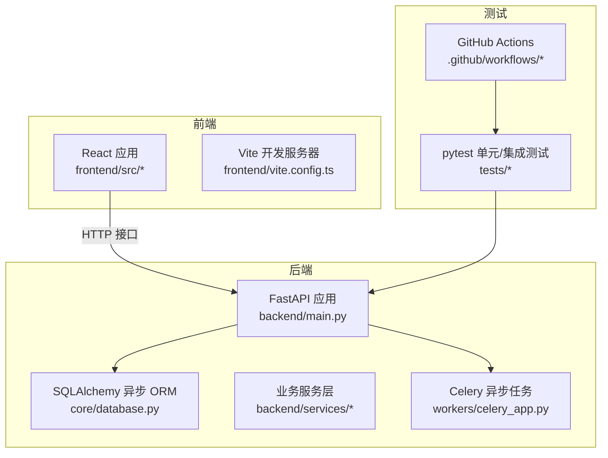
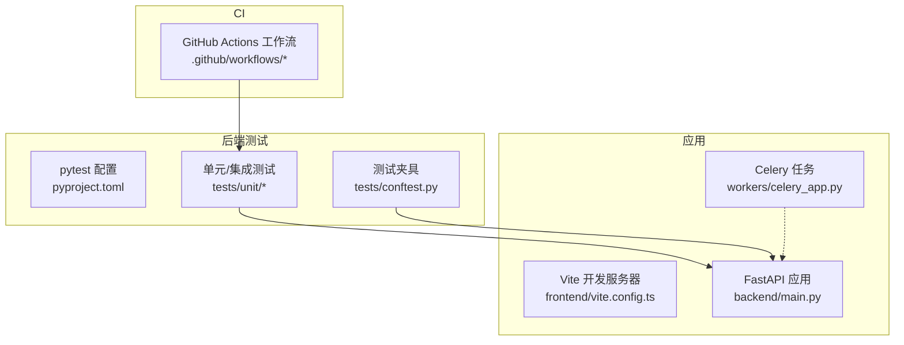
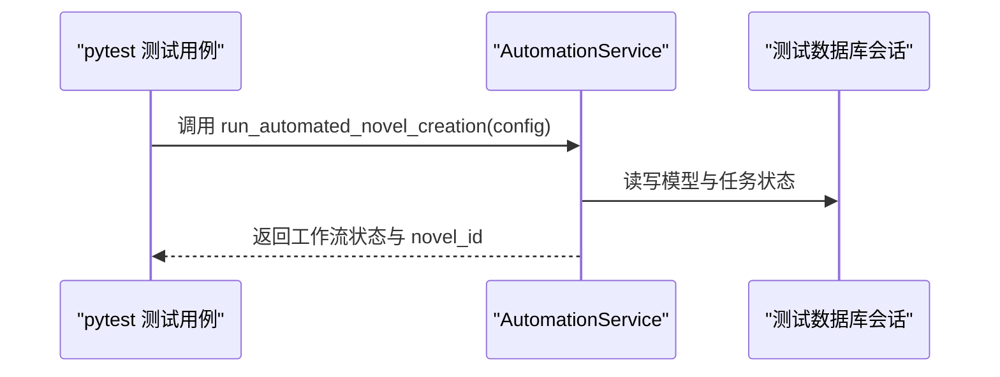
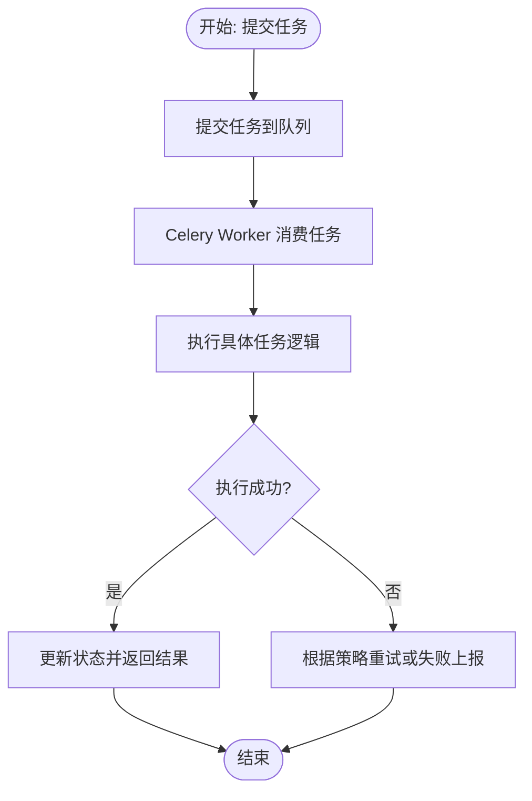
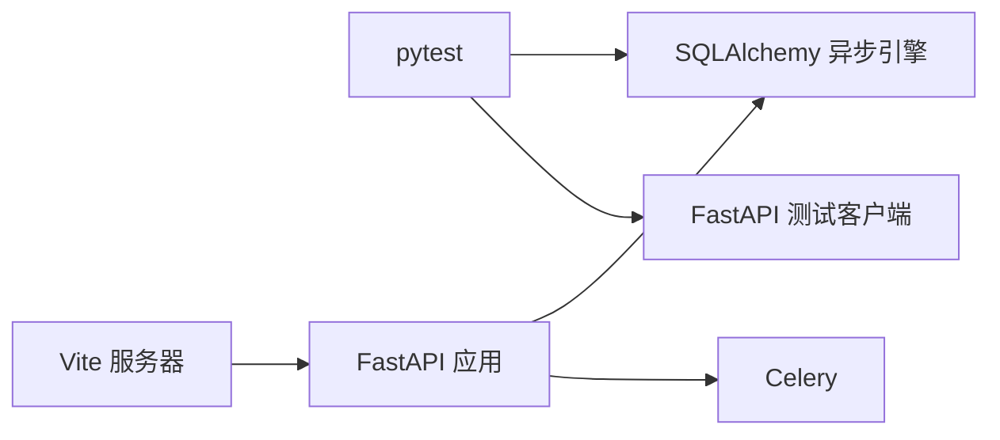

# 测试策略

<cite>
**本文引用的文件**
- [pyproject.toml](file://pyproject.toml)
- [tests/conftest.py](file://tests/conftest.py)
- [tests/unit/test_automation_service.py](file://tests/unit/test_automation_service.py)
- [tests/unit/test_integration_service.py](file://tests/unit/test_integration_service.py)
- [frontend/vite.config.ts](file://frontend/vite.config.ts)
- [frontend/package.json](file://frontend/package.json)
- [.github/workflows/playwright.yml](file://.github/workflows/playwright.yml)
</cite>

## 更新摘要
**所做更改**
- 移除了Playwright前端测试基础设施的相关内容
- 删除了Playwright配置文件、包管理文件和相关测试工具的描述
- 简化了前端测试架构，不再包含Playwright端到端测试
- 更新了测试框架配置，移除了Playwright相关依赖
- 调整了持续集成流程，移除了Playwright测试步骤

## 目录
1. [引言](#引言)
2. [项目结构](#项目结构)
3. [核心组件](#核心组件)
4. [架构总览](#架构总览)
5. [详细组件分析](#详细组件分析)
6. [依赖关系分析](#依赖关系分析)
7. [性能考虑](#性能考虑)
8. [故障排查指南](#故障排查指南)
9. [结论](#结论)
10. [附录](#附录)

## 引言
本测试策略文档面向测试工程师与开发人员，围绕小说生成系统的多层次测试体系进行系统化设计与落地指导。涵盖单元测试、集成测试的组织结构与实施策略；明确测试框架选择与配置（pytest）；制定Mock策略（外部依赖模拟、数据库隔离、异步任务测试）；给出测试用例设计指南（边界条件、异常处理、性能测试）；覆盖前端组件测试、自动化测试流程；并包含测试数据管理、测试环境配置、持续集成中的测试执行、测试覆盖率与质量门禁、回归测试策略。

**更新** 移除了Playwright前端测试基础设施，简化了测试架构，专注于后端pytest测试和基础的前端功能测试。

## 项目结构
该仓库采用前后端分离与多模块协同的结构：后端基于 FastAPI，数据库使用 SQLAlchemy 异步 ORM，消息队列与异步任务由 Celery 驱动；前端基于 Vite + React；测试体系主要集中在后端 pytest 单元/集成测试，前端测试基础设施已简化。

**图表来源**
- [pyproject.toml](file://pyproject.toml#L8-L36)
- [frontend/vite.config.ts](file://frontend/vite.config.ts#L12-L22)
- [workers/celery_app.py](file://workers/celery_app.py#L1-L26)

**章节来源**
- [pyproject.toml](file://pyproject.toml#L8-L64)
- [frontend/vite.config.ts](file://frontend/vite.config.ts#L1-L23)

## 核心组件
- 后端测试基础设施
  - pytest 配置与标记：支持单元、网络、真实爬取、集成、慢测试等标记，统一测试路径与异步模式。
  - 数据库隔离：通过 session 级别引擎与事务回滚，确保每个测试用例的数据隔离与可重复性。
  - FastAPI 测试客户端：重写依赖注入以指向测试数据库会话，避免真实数据库污染。
- 前端测试基础设施
  - Vite 开发服务器：本地代理转发 /api 到后端，便于测试联调。
  - 简化的前端测试：移除了Playwright端到端测试，保留基础的组件测试能力。

**更新** 前端测试基础设施已大幅简化，移除了Playwright配置和相关依赖。

**章节来源**
- [pyproject.toml](file://pyproject.toml#L38-L64)
- [tests/conftest.py](file://tests/conftest.py#L14-L84)
- [frontend/vite.config.ts](file://frontend/vite.config.ts#L12-L22)

## 架构总览
下图展示测试体系在系统中的位置与交互关系，突出后端 pytest 以及 CI 的协同。

**图表来源**
- [pyproject.toml](file://pyproject.toml#L54-L64)
- [tests/conftest.py](file://tests/conftest.py#L55-L73)
- [frontend/vite.config.ts](file://frontend/vite.config.ts#L12-L22)
- [workers/celery_app.py](file://workers/celery_app.py#L1-L26)

## 详细组件分析

### 后端测试组件
- pytest 配置与标记
  - 支持单元、网络、真实爬取、集成、慢测试等标记，便于按需筛选与分层执行。
  - 统一测试目录与异步模式，提升一致性与可维护性。
- 数据库隔离与依赖注入
  - session 级事件循环、异步引擎、metadata 创建/销毁，保证测试前后的数据库一致性。
  - 通过重写 get_db 依赖，将测试客户端绑定到测试会话，避免真实数据库污染。
- 单元测试样例
  - 自动化服务：覆盖工作流启动、代理初始化、状态查询、批量任务执行等关键路径。
  - 集成服务：覆盖端到端工作流、历史查询、详情查询等业务闭环。

**图表来源**
- [tests/unit/test_automation_service.py](file://tests/unit/test_automation_service.py#L6-L24)
- [tests/conftest.py](file://tests/conftest.py#L55-L73)

**章节来源**
- [pyproject.toml](file://pyproject.toml#L54-L64)
- [tests/conftest.py](file://tests/conftest.py#L14-L84)
- [tests/unit/test_automation_service.py](file://tests/unit/test_automation_service.py#L1-L87)
- [tests/unit/test_integration_service.py](file://tests/unit/test_integration_service.py#L1-L59)

### 前端测试组件
- Vite 开发服务器
  - 本地代理将 /api 请求转发至后端，确保测试与开发环境一致。
  - 简化的前端测试架构，移除了Playwright端到端测试依赖。
- 前端测试实践
  - 建议使用React Testing Library进行组件级测试。
  - 使用Jest进行单元测试，覆盖核心组件逻辑。
  - 重点测试页面导航、表单交互、状态管理等功能。

**更新** 前端测试基础设施已简化，移除了Playwright配置文件和相关依赖。

**章节来源**
- [frontend/vite.config.ts](file://frontend/vite.config.ts#L12-L22)
- [frontend/package.json](file://frontend/package.json#L1-L42)

### 异步任务与集成测试
- Celery 配置要点
  - 时区、序列化、限时、并发与预取策略，保障长任务稳定执行。
  - 自动发现任务模块，便于扩展新的异步任务。
- 端到端集成验证
  - 提供独立脚本验证从市场分析到发布的完整链路，包含依赖提交、等待与成本统计。
  - 可作为回归测试与性能基线的参考。

**图表来源**
- [workers/celery_app.py](file://workers/celery_app.py#L12-L25)

**章节来源**
- [workers/celery_app.py](file://workers/celery_app.py#L1-L26)

## 依赖关系分析
- 测试框架与工具
  - 后端：pytest + pytest-asyncio，配合 SQLAlchemy 异步引擎与 FastAPI 测试客户端。
  - 前端：简化的测试架构，移除了Playwright相关依赖。
- 外部依赖与隔离
  - 数据库：通过测试夹具创建/销毁表结构，使用事务回滚保证隔离。
  - LLM/第三方接口：建议在测试中使用 Mock 或 Fake 实现，避免真实调用。
- 任务系统
  - Celery 在测试中可通过禁用后台任务或使用内存 Broker 进行快速验证。

**图表来源**
- [pyproject.toml](file://pyproject.toml#L38-L41)
- [tests/conftest.py](file://tests/conftest.py#L55-L73)
- [frontend/vite.config.ts](file://frontend/vite.config.ts#L12-L22)
- [workers/celery_app.py](file://workers/celery_app.py#L1-L26)

**章节来源**
- [pyproject.toml](file://pyproject.toml#L38-L41)
- [tests/conftest.py](file://tests/conftest.py#L14-L84)
- [frontend/vite.config.ts](file://frontend/vite.config.ts#L12-L22)
- [workers/celery_app.py](file://workers/celery_app.py#L1-L26)

## 性能考虑
- 测试执行性能
  - 后端：利用 pytest 标记区分慢测试，CI 中串行或分批执行；本地并行加速。
  - 前端：简化的测试架构，移除Playwright并行执行，降低资源消耗。
- 数据库与任务
  - 使用事务回滚与最小化测试数据，避免真实 IO。
  - Celery 在测试中降低并发与预取，缩短等待时间。
- LLM 调用
  - 使用 Mock 或缓存响应，避免真实计费与延迟波动。

## 故障排查指南
- 数据库相关
  - 若出现连接/事件循环问题，检查 session 级事件循环与引擎生命周期。
  - 确保每个测试用例结束后回滚事务，避免脏数据影响后续用例。
- FastAPI 测试客户端
  - 确认依赖注入覆盖已正确生效，避免访问真实数据库。
- 前端开发服务器
  - 本地开发时确认 Vite 代理已正确转发 /api 请求。
- 异步任务
  - 检查 Celery 配置的时区、限时与并发设置，必要时在测试中禁用后台任务。

**章节来源**
- [tests/conftest.py](file://tests/conftest.py#L21-L73)
- [frontend/vite.config.ts](file://frontend/vite.config.ts#L15-L21)
- [workers/celery_app.py](file://workers/celery_app.py#L12-L25)

## 结论
本测试策略以 pytest 为核心，结合数据库隔离与异步任务配置，构建了覆盖单元与集成的多层次测试体系。通过清晰的夹具与标记、严格的隔离与 Mock 策略、完善的 CI 流程，确保系统在演进过程中保持高质量与稳定性。前端测试基础设施已简化，专注于基础的功能测试和组件测试。建议在后续迭代中逐步引入覆盖率指标与质量门禁，强化回归测试与性能基线。

## 附录

### 测试框架与配置最佳实践
- pytest
  - 使用标记区分测试类型，按需筛选执行。
  - 通过夹具实现数据库与依赖注入的统一管理。
- 前端开发服务器
  - 通过代理将 /api 请求转发至后端，保证测试一致性。

**更新** 移除了Playwright相关配置和最佳实践。

**章节来源**
- [pyproject.toml](file://pyproject.toml#L54-L64)
- [frontend/vite.config.ts](file://frontend/vite.config.ts#L12-L22)

### 测试用例设计指南
- 边界条件
  - 输入参数边界（空值、超长、非法格式）、状态机边界（未开始/进行中/已完成）。
- 异常处理
  - 网络异常、数据库连接失败、LLM 调用失败、任务超时等。
- 性能测试
  - 关键路径的响应时间与吞吐量，异步任务的排队与执行耗时。
- 前端组件与用户交互
  - 页面加载、路由跳转、表单提交、弹窗与通知、错误态与加载态。

**更新** 前端测试部分已简化，移除了Playwright端到端测试相关内容。

### 测试数据管理与环境配置
- 测试数据
  - 使用夹具创建最小化测试数据，避免真实业务数据污染。
- 环境变量
  - 通过 TEST_DATABASE_URL 指向测试数据库，确保隔离。
- CI 配置
  - 移除了Playwright相关的浏览器安装与报告上传配置。

**更新** CI配置已更新，移除了Playwright测试步骤。

**章节来源**
- [tests/conftest.py](file://tests/conftest.py#L18-L18)

### 持续集成中的测试执行
- 后端 pytest
  - 在本地与 CI 中统一执行，按标记分层运行。
- 前端测试
  - 简化的测试架构，移除Playwright端到端测试。

**更新** CI流程已简化，移除了Playwright测试步骤。

**章节来源**
- [.github/workflows/playwright.yml](file://.github/workflows/playwright.yml#L1-L28)

### 覆盖率要求与质量门禁
- 建议目标
  - 行覆盖率与分支覆盖率不低于 80%，关键路径不低于 90%。
- 质量门禁
  - 未达标的 PR 禁止合并；慢测试与网络测试单独计分。

### 回归测试策略
- 集成回归
  - 使用 pytest 标记 integration 与 real_crawl，CI 中分批执行。
- 多 Agent 回归
  - 使用独立脚本验证端到端链路与成本统计，作为回归基线。

**章节来源**
- [tests/unit/test_automation_service.py](file://tests/unit/test_automation_service.py#L1-L87)
- [tests/unit/test_integration_service.py](file://tests/unit/test_integration_service.py#L1-L59)