# 自动化测试框架

<cite>
**本文档引用的文件**
- [tests/conftest.py](file://tests/conftest.py)
- [tests/e2e/conftest.py](file://tests/e2e/conftest.py)
- [tests/fixtures/html_samples.py](file://tests/fixtures/html_samples.py)
- [tests/continuity_system_test.py](file://tests/continuity_system_test.py)
- [tests/test_continuity_components.py](file://tests/test_continuity_components.py)
- [tests/test_continuity_integration.py](file://tests/test_continuity_integration.py)
- [tests/e2e/test_scenarios/test_creation_flow.py](file://tests/e2e/test_scenarios/test_creation_flow.py)
- [tests/e2e/test_scenarios/test_outline_flow.py](file://tests/e2e/test_scenarios/test_outline_flow.py)
- [tests/e2e/test_scenarios/test_chapter_flow.py](file://tests/e2e/test_scenarios/test_chapter_flow.py)
- [tests/ai_e2e/__init__.py](file://tests/ai_e2e/__init__.py)
- [tests/ai_e2e/config.py](file://tests/ai_e2e/config.py)
- [tests/ai_e2e/agents/test_executor.py](file://tests/ai_e2e/agents/test_executor.py)
- [tests/ai_e2e/agents/test_generator.py](file://tests/ai_e2e/agents/test_generator.py)
- [tests/ai_e2e/agents/self_healer.py](file://tests/ai_e2e/agents/self_healer.py)
- [tests/ai_e2e/agents/reporter.py](file://tests/ai_e2e/agents/reporter.py)
- [tests/ai_e2e/runners/hybrid_runner.py](file://tests/ai_e2e/runners/hybrid_runner.py)
- [tests/ai_e2e/selectors/healenium_adapter.py](file://tests/ai_e2e/selectors/healenium_adapter.py)
- [scripts/ai_e2e_runner.py](file://scripts/ai_e2e_runner.py)
- [pyproject.toml](file://pyproject.toml)
</cite>

## 更新摘要
**变更内容**
- 新增AI驱动的自动化测试框架模块
- 添加智能元素修复和自愈机制
- 引入混合执行模式支持
- 增加测试报告生成功能
- 新增AI测试用例生成器
- 扩展测试运行器功能

## 目录
1. [引言](#引言)
2. [项目结构](#项目结构)
3. [核心组件](#核心组件)
4. [架构概览](#架构概览)
5. [详细组件分析](#详细组件分析)
6. [AI增强测试框架](#ai增强测试框架)
7. [依赖分析](#依赖分析)
8. [性能考虑](#性能考虑)
9. [故障排除指南](#故障排除指南)
10. [结论](#结论)

## 引言

本项目是一个基于Python的自动化测试框架，专门用于测试一个AI小说生成系统。该框架采用了多层次的测试策略，包括单元测试、集成测试、端到端测试和场景测试，确保整个系统的稳定性和可靠性。

**更新** 新增了AI驱动的自动化测试框架，包含智能元素修复、混合执行模式和报告生成功能，显著提升了测试的智能化水平和执行效率。

测试框架的核心特点包括：
- 支持多种测试类型：单元测试、集成测试、端到端测试、场景测试
- 提供丰富的测试夹具（fixtures）和工具
- 包含专门的连贯性保障系统测试
- 支持Playwright进行UI自动化测试
- **新增** AI测试执行器，无需预定义测试步骤，AI自主决策操作序列
- **新增** 混合运行器，协调Playwright和Selenium/Healenium的测试执行
- **新增** 自愈修复机制，基于Healenium和AI的智能修复
- **新增** 测试报告生成器，支持多种格式输出
- **新增** 测试用例生成器，基于页面分析自动生成测试代码
- 具备完善的错误处理和性能监控机制

## 项目结构

测试框架采用模块化的组织方式，按照测试类型和功能特性进行分类：

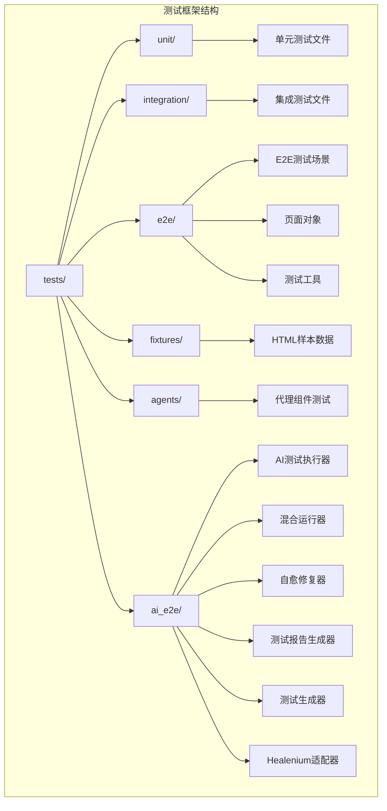

**图表来源**
- [tests/conftest.py:1-84](file://tests/conftest.py#L1-L84)
- [tests/e2e/conftest.py:1-173](file://tests/e2e/conftest.py#L1-L173)
- [tests/ai_e2e/__init__.py:1-18](file://tests/ai_e2e/__init__.py#L1-L18)

**章节来源**
- [tests/conftest.py:1-84](file://tests/conftest.py#L1-L84)
- [tests/e2e/conftest.py:1-173](file://tests/e2e/conftest.py#L1-L173)
- [tests/ai_e2e/__init__.py:1-18](file://tests/ai_e2e/__init__.py#L1-L18)

## 核心组件

### 测试夹具系统

测试框架提供了三个层次的夹具系统：

1. **全局夹具**：提供数据库连接、HTTP客户端等基础服务
2. **E2E夹具**：支持Playwright浏览器自动化测试
3. **专用夹具**：针对特定测试场景的数据准备

### 测试类型分类

框架支持以下测试类型：
- **单元测试**：验证单个组件的功能
- **集成测试**：测试组件间的协作
- **端到端测试**：模拟用户完整操作流程
- **场景测试**：针对特定业务场景的测试

### AI增强测试组件

**新增** AI增强测试框架包含以下核心组件：

1. **AI测试执行器**：无需预定义测试步骤，AI自主决策操作序列
2. **混合运行器**：协调Playwright和Selenium/Healenium的测试执行
3. **自愈修复器**：基于Healenium和AI的智能修复机制
4. **测试报告生成器**：生成多种格式的测试报告
5. **测试用例生成器**：基于页面分析自动生成测试代码
6. **Healenium适配器**：连接Healenium自愈服务

**章节来源**
- [tests/conftest.py:14-84](file://tests/conftest.py#L14-L84)
- [tests/e2e/conftest.py:11-34](file://tests/e2e/conftest.py#L11-L34)

## 架构概览

测试框架的整体架构采用分层设计，确保测试的独立性和可维护性：

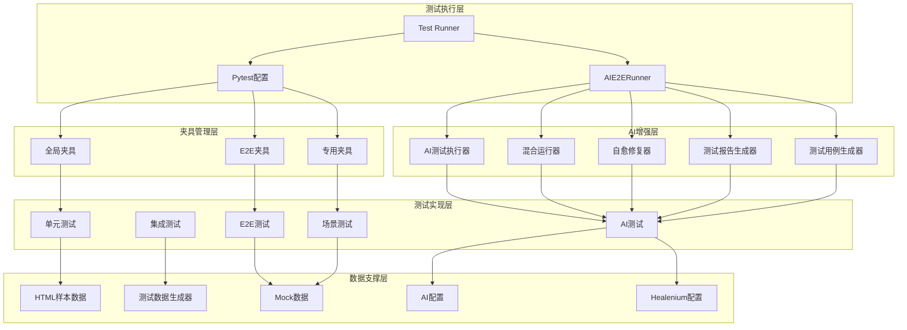

**图表来源**
- [pyproject.toml:54-64](file://pyproject.toml#L54-L64)
- [tests/fixtures/html_samples.py:1-135](file://tests/fixtures/html_samples.py#L1-L135)
- [scripts/ai_e2e_runner.py:43-630](file://scripts/ai_e2e_runner.py#L43-L630)

## 详细组件分析

### 连贯性保障系统测试

连贯性保障系统是测试框架的核心组件之一，负责确保小说章节之间的逻辑连贯性。

#### 组件架构

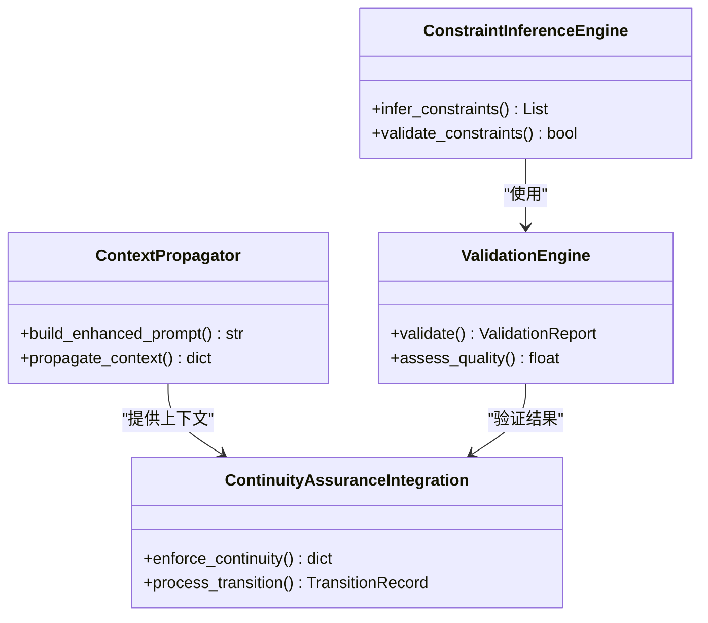

**图表来源**
- [tests/continuity_system_test.py:30-260](file://tests/continuity_system_test.py#L30-L260)

#### 测试流程

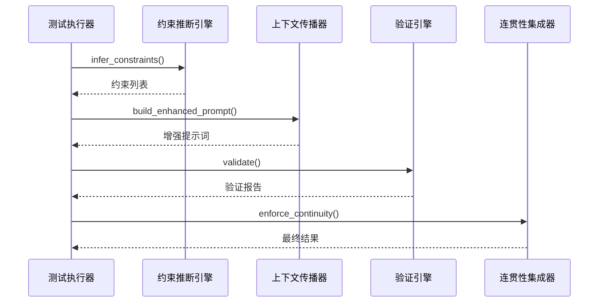

**图表来源**
- [tests/continuity_system_test.py:263-309](file://tests/continuity_system_test.py#L263-L309)

**章节来源**
- [tests/continuity_system_test.py:1-309](file://tests/continuity_system_test.py#L1-L309)

### E2E测试框架

E2E测试框架基于Playwright构建，提供完整的用户界面自动化测试能力。

#### 页面对象模型

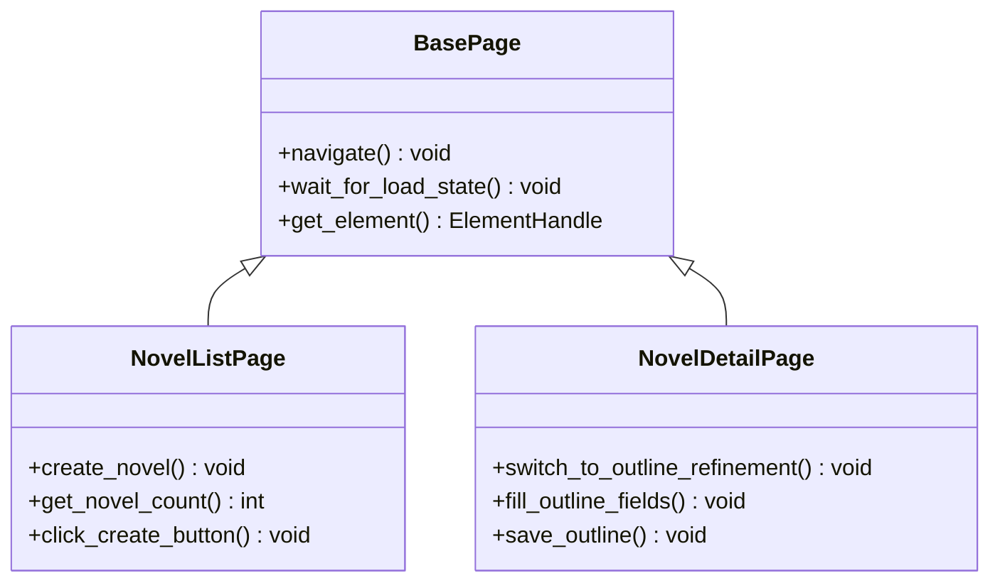

**图表来源**
- [tests/e2e/test_scenarios/test_creation_flow.py:8-252](file://tests/e2e/test_scenarios/test_creation_flow.py#L8-L252)

#### 测试场景设计

E2E测试涵盖了完整的业务流程：

1. **小说创建流程**：从列表页到详情页的完整操作
2. **大纲梳理流程**：从基础信息到智能完善的完整流程
3. **章节生成流程**：单章和批量生成的完整流程

**章节来源**
- [tests/e2e/test_scenarios/test_creation_flow.py:1-252](file://tests/e2e/test_scenarios/test_creation_flow.py#L1-L252)
- [tests/e2e/test_scenarios/test_outline_flow.py:1-173](file://tests/e2e/test_scenarios/test_outline_flow.py#L1-L173)
- [tests/e2e/test_scenarios/test_chapter_flow.py:1-242](file://tests/e2e/test_scenarios/test_chapter_flow.py#L1-L242)

### 测试夹具系统

测试夹具系统提供了灵活的测试数据准备和环境配置能力。

#### 数据准备策略

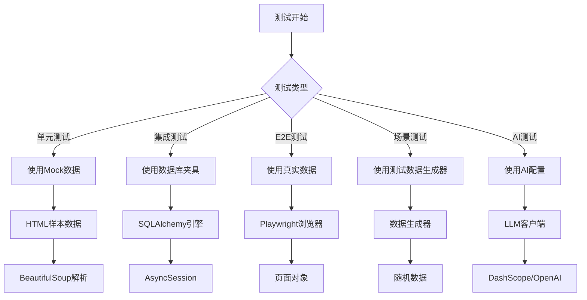

**图表来源**
- [tests/fixtures/html_samples.py:1-135](file://tests/fixtures/html_samples.py#L1-L135)
- [tests/conftest.py:18-84](file://tests/conftest.py#L18-L84)
- [tests/ai_e2e/config.py:18-92](file://tests/ai_e2e/config.py#L18-L92)

**章节来源**
- [tests/fixtures/html_samples.py:1-135](file://tests/fixtures/html_samples.py#L1-L135)
- [tests/conftest.py:14-84](file://tests/conftest.py#L14-L84)

## AI增强测试框架

**新增** AI增强测试框架是本项目的最新创新，提供了智能化的测试执行能力。

### AI测试执行器

AI测试执行器是整个AI测试框架的核心引擎，实现了真正的全AI自动测试。

#### 核心功能

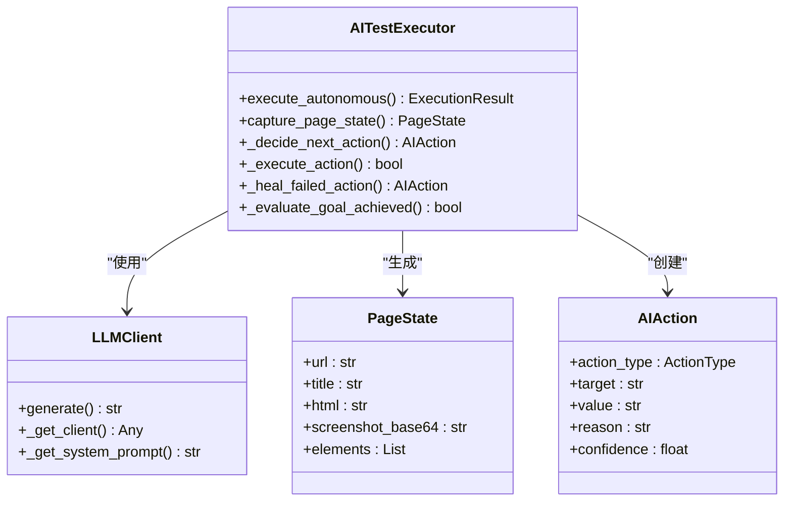

**图表来源**
- [tests/ai_e2e/agents/test_executor.py:237-654](file://tests/ai_e2e/agents/test_executor.py#L237-L654)

#### AI决策流程

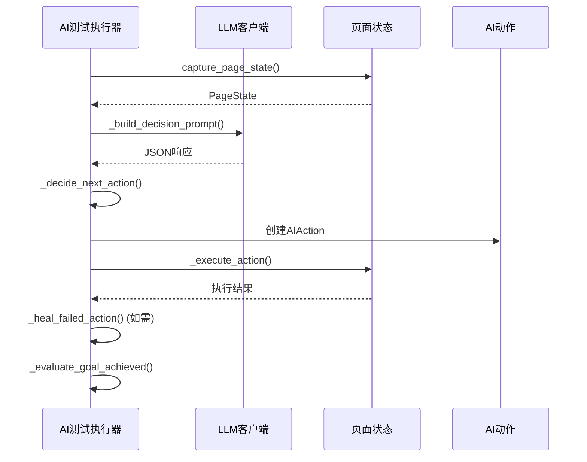

**图表来源**
- [tests/ai_e2e/agents/test_executor.py:479-518](file://tests/ai_e2e/agents/test_executor.py#L479-L518)

### 混合运行器

混合运行器协调Playwright和Selenium/Healenium的测试执行，实现元素定位失败时的自动修复机制。

#### 运行器架构

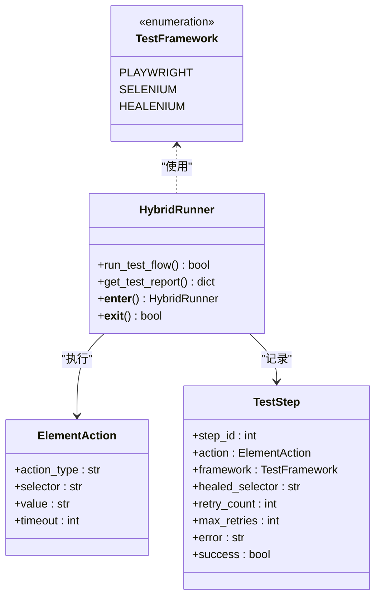

**图表来源**
- [tests/ai_e2e/runners/hybrid_runner.py:82-111](file://tests/ai_e2e/runners/hybrid_runner.py#L82-L111)

#### 混合执行模式

混合运行器支持多种执行模式：

1. **Playwright模式**：使用Playwright进行常规测试步骤
2. **Selenium模式**：当元素定位失败时自动切换到Selenium
3. **Healenium模式**：使用Healenium自动寻找替代选择器
4. **自愈模式**：将修复后的选择器同步到测试中

### 自愈修复器

自愈修复器基于Healenium和AI的智能修复机制，当测试中的元素定位失败时自动寻找有效的替代方案。

#### 修复策略

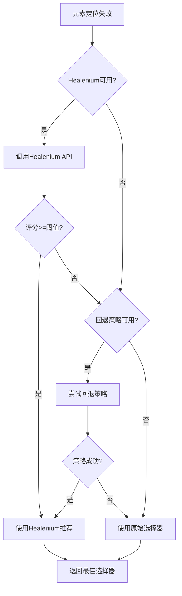

**图表来源**
- [tests/ai_e2e/selectors/healenium_adapter.py:262-304](file://tests/ai_e2e/selectors/healenium_adapter.py#L262-L304)

#### 回退策略

自愈修复器提供多种回退策略：

1. **CSS选择器转文本定位**：从class中提取关键字生成text选择器
2. **Ant Design组件回退**：检测Ant Design组件并使用通用选择器
3. **XPath回退策略**：将CSS选择器转换为XPath表达式
4. **部分匹配策略**：提取选择器核心部分进行模糊匹配

### 测试报告生成器

测试报告生成器生成详细的测试执行报告，支持多种格式输出。

#### 报告格式

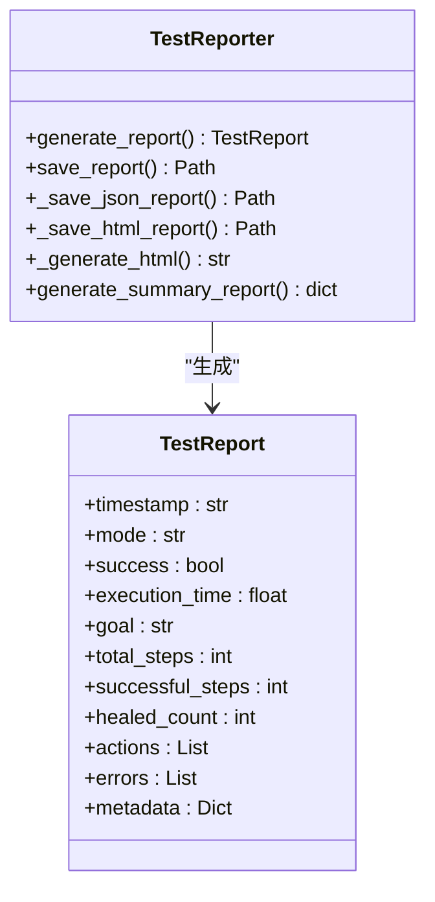

**图表来源**
- [tests/ai_e2e/agents/reporter.py:39-356](file://tests/ai_e2e/agents/reporter.py#L39-L356)

#### 报告内容

测试报告包含以下信息：

1. **基本信息**：测试时间、模式、成功率
2. **执行统计**：总步骤数、成功步骤数、自愈次数
3. **详细步骤**：每个操作的类型、目标、原因、置信度
4. **错误信息**：执行过程中的错误详情
5. **元数据**：额外的测试相关信息

### 测试用例生成器

测试用例生成器基于页面分析和需求描述，自动生成E2E测试用例代码。

#### 生成流程

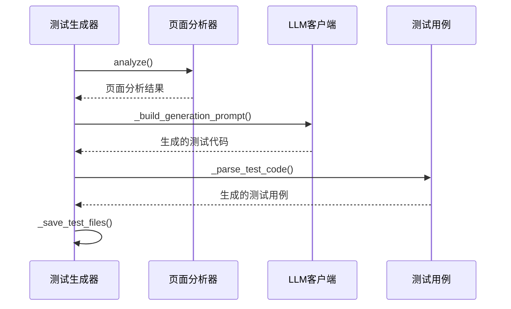

**图表来源**
- [tests/ai_e2e/agents/test_generator.py:321-758](file://tests/ai_e2e/agents/test_generator.py#L321-L758)

#### 页面分析功能

测试生成器能够分析页面的多个方面：

1. **路由和导航**：分析侧边栏导航和面包屑
2. **表单元素**：识别输入框、按钮、表单容器
3. **按钮元素**：收集可点击按钮的信息
4. **表格元素**：分析表格结构和数据
5. **弹窗和模态框**：检测对话框状态
6. **输入元素**：收集各种输入控件信息

### Healenium适配器

Healenium适配器提供与Healenium Server的通信能力，实现元素定位的智能修复和评分。

#### 适配器架构

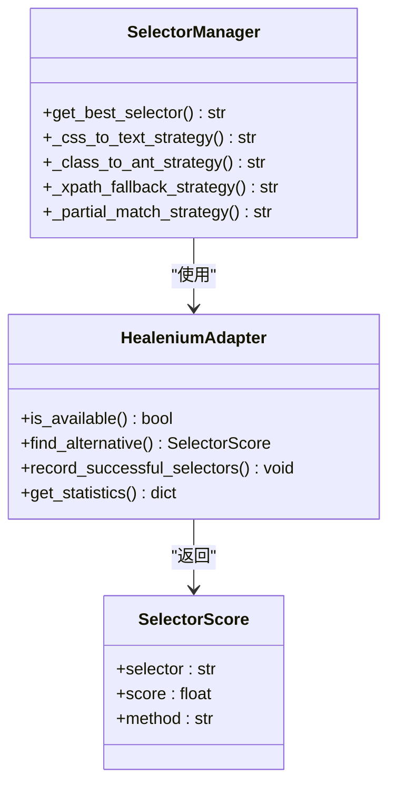

**图表来源**
- [tests/ai_e2e/selectors/healenium_adapter.py:39-232](file://tests/ai_e2e/selectors/healenium_adapter.py#L39-L232)

#### Healenium集成

Healenium适配器支持以下功能：

1. **健康检查**：检查Healenium Server是否可用
2. **替代选择器查找**：调用Healenium API获取最佳替代方案
3. **成功选择器记录**：记录稳定的选择器供学习使用
4. **统计信息获取**：提供Healenium使用情况统计

**章节来源**
- [tests/ai_e2e/agents/test_executor.py:1-654](file://tests/ai_e2e/agents/test_executor.py#L1-L654)
- [tests/ai_e2e/runners/hybrid_runner.py:1-111](file://tests/ai_e2e/runners/hybrid_runner.py#L1-L111)
- [tests/ai_e2e/agents/self_healer.py:1-60](file://tests/ai_e2e/agents/self_healer.py#L1-L60)
- [tests/ai_e2e/agents/reporter.py:1-356](file://tests/ai_e2e/agents/reporter.py#L1-L356)
- [tests/ai_e2e/agents/test_generator.py:1-758](file://tests/ai_e2e/agents/test_generator.py#L1-L758)
- [tests/ai_e2e/selectors/healenium_adapter.py:1-397](file://tests/ai_e2e/selectors/healenium_adapter.py#L1-L397)

## 依赖分析

测试框架的依赖关系相对简单，主要依赖于核心测试工具和第三方库。

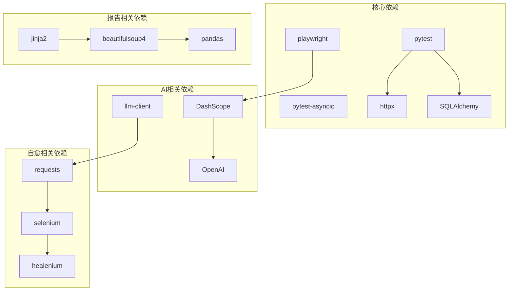

**图表来源**
- [pyproject.toml:8-36](file://pyproject.toml#L8-L36)

**章节来源**
- [pyproject.toml:1-64](file://pyproject.toml#L1-L64)

## 性能考虑

测试框架在设计时充分考虑了性能优化：

### 并发测试支持
- 使用pytest-asyncio支持异步测试
- 数据库连接池优化
- 浏览器实例复用

### AI执行优化
- **新增** LLM客户端缓存机制
- **新增** 选择器历史缓存
- **新增** 自愈统计信息缓存
- **新增** 页面状态快照优化

### 内存管理
- 测试夹具的生命周期管理
- 自动资源清理机制
- 大数据集的分批处理
- **新增** AI模型响应缓存

### 执行效率
- 测试标记系统支持选择性执行
- 缓存机制减少重复计算
- 并行测试执行支持
- **新增** AI决策结果缓存
- **新增** Healenium服务器连接池

## 故障排除指南

### 常见问题及解决方案

#### 数据库连接问题
- **症状**：测试过程中出现数据库连接超时
- **解决方案**：检查TEST_DATABASE_URL环境变量，确保数据库服务正常运行

#### 浏览器测试失败
- **症状**：Playwright测试执行失败或页面加载超时
- **解决方案**：检查浏览器启动参数配置，确认网络连接正常

#### AI测试执行异常
- **症状**：AI测试执行器无法生成决策或执行失败
- **解决方案**：检查AI配置（API密钥、模型参数），确认LLM服务可用

#### Healenium连接问题
- **症状**：Healenium Server不可用或请求超时
- **解决方案**：检查Healenium服务状态，确认端口8088可用，或使用本地回退策略

#### 异步测试异常
- **症状**：asyncio事件循环相关的测试错误
- **解决方案**：使用正确的事件循环配置，确保异步夹具正确初始化

#### Mock数据不匹配
- **症状**：单元测试中Mock数据与实际数据格式不兼容
- **解决方案**：检查HTML样本数据的结构完整性，确保选择器正确

#### AI模型调用失败
- **症状**：LLM客户端无法调用AI模型或返回错误
- **解决方案**：检查API密钥配置，确认网络连接，使用本地回退响应

**章节来源**
- [tests/conftest.py:21-27](file://tests/conftest.py#L21-L27)
- [tests/e2e/conftest.py:36-52](file://tests/e2e/conftest.py#L36-L52)
- [tests/ai_e2e/agents/test_executor.py:100-120](file://tests/ai_e2e/agents/test_executor.py#L100-L120)
- [tests/ai_e2e/selectors/healenium_adapter.py:69-84](file://tests/ai_e2e/selectors/healenium_adapter.py#L69-L84)

## 结论

本自动化测试框架为AI小说生成系统提供了全面的测试保障。通过多层次的测试策略和完善的夹具系统，确保了系统的稳定性、可靠性和可维护性。

**更新** 新增的AI增强测试框架进一步提升了测试的智能化水平，主要优势包括：

### AI测试框架优势
- **全AI自动执行**：无需预定义测试步骤，AI自主决策操作序列
- **智能元素修复**：基于Healenium和AI的自动修复机制
- **混合执行模式**：协调多种测试框架的智能切换
- **多样化报告**：支持JSON和HTML格式的详细测试报告
- **智能测试生成**：基于页面分析自动生成测试用例
- **自愈能力**：自动学习和适应页面变化

### 传统测试框架优势
- **全面的测试覆盖**：从单元测试到端到端测试的完整覆盖
- **灵活的配置系统**：支持多种测试环境和配置选项
- **高效的执行机制**：优化的并发执行和资源管理
- **完善的错误处理**：全面的异常捕获和故障恢复机制

通过持续改进和扩展，该测试框架将继续为系统的高质量发展提供坚实的技术支撑，特别是在AI驱动的智能化测试领域，为未来的测试自动化奠定了坚实的基础。