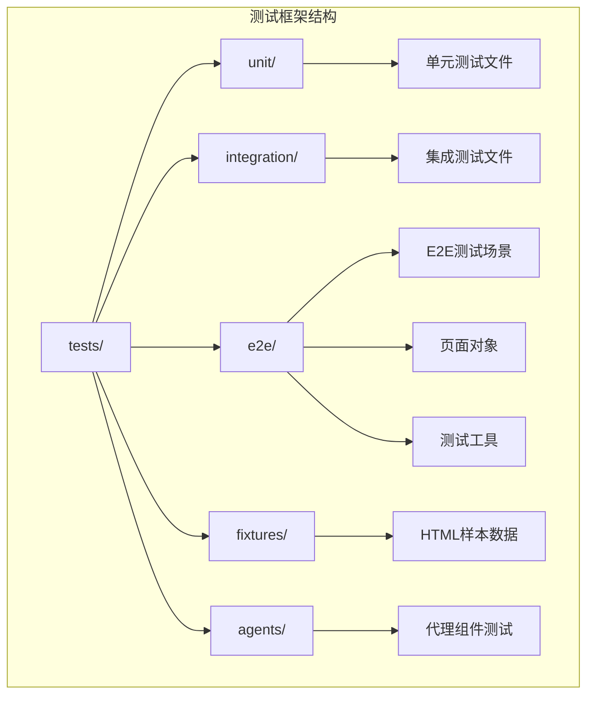
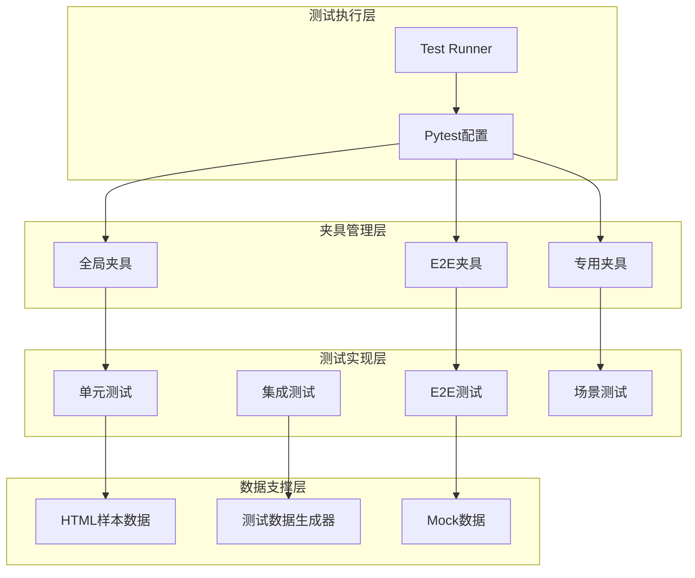
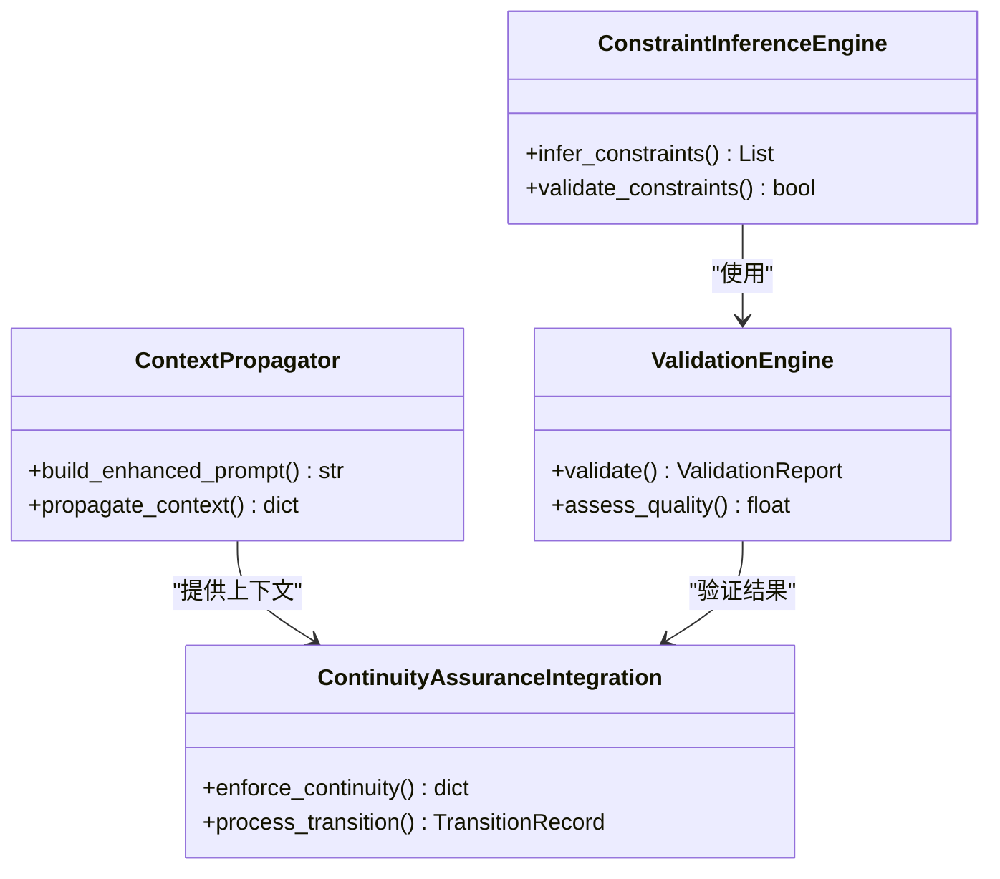
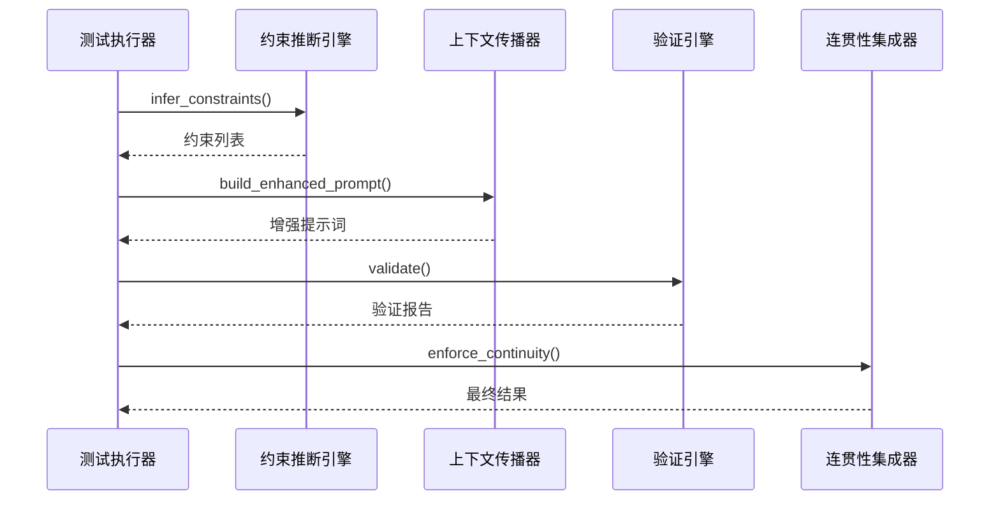
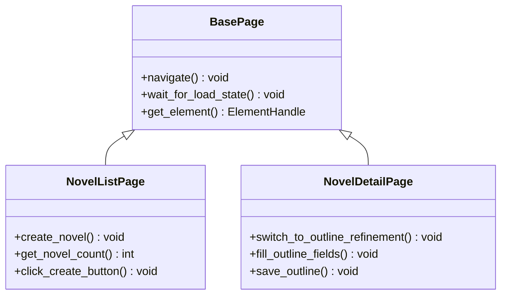
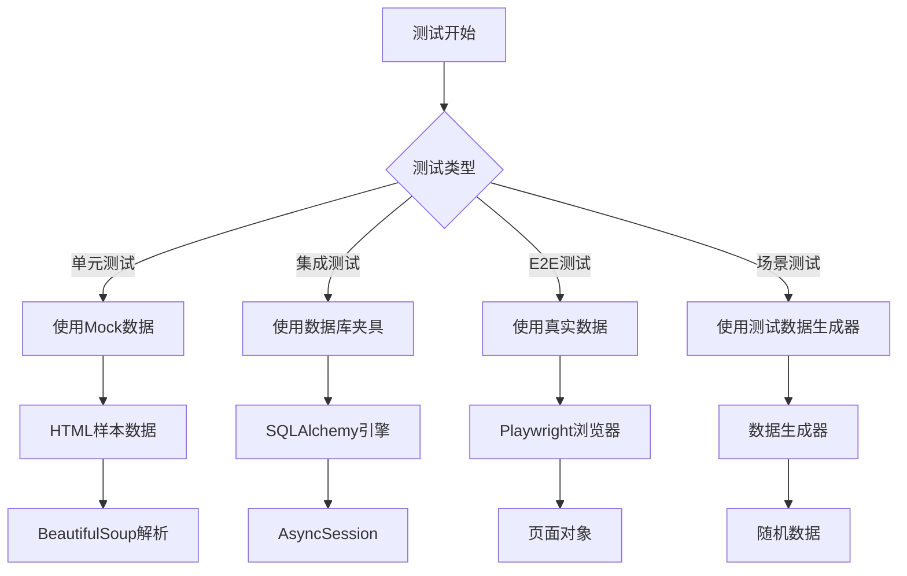
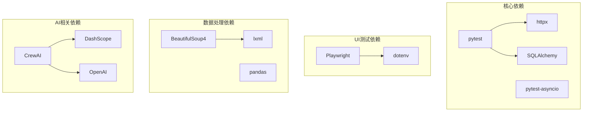

# 自动化测试框架

<cite>
**本文档引用的文件**
- [tests/conftest.py](file://tests/conftest.py)
- [tests/e2e/conftest.py](file://tests/e2e/conftest.py)
- [tests/fixtures/html_samples.py](file://tests/fixtures/html_samples.py)
- [tests/continuity_system_test.py](file://tests/continuity_system_test.py)
- [tests/test_continuity_components.py](file://tests/test_continuity_components.py)
- [tests/test_continuity_integration.py](file://tests/test_continuity_integration.py)
- [tests/e2e/test_scenarios/test_creation_flow.py](file://tests/e2e/test_scenarios/test_creation_flow.py)
- [tests/e2e/test_scenarios/test_outline_flow.py](file://tests/e2e/test_scenarios/test_outline_flow.py)
- [tests/e2e/test_scenarios/test_chapter_flow.py](file://tests/e2e/test_scenarios/test_chapter_flow.py)
- [pyproject.toml](file://pyproject.toml)
</cite>

## 目录
1. [引言](#引言)
2. [项目结构](#项目结构)
3. [核心组件](#核心组件)
4. [架构概览](#架构概览)
5. [详细组件分析](#详细组件分析)
6. [依赖分析](#依赖分析)
7. [性能考虑](#性能考虑)
8. [故障排除指南](#故障排除指南)
9. [结论](#结论)

## 引言

本项目是一个基于Python的自动化测试框架，专门用于测试一个AI小说生成系统。该框架采用了多层次的测试策略，包括单元测试、集成测试、端到端测试和场景测试，确保整个系统的稳定性和可靠性。

测试框架的核心特点包括：
- 支持多种测试类型：单元测试、集成测试、端到端测试、场景测试
- 提供丰富的测试夹具（fixtures）和工具
- 包含专门的连贯性保障系统测试
- 支持Playwright进行UI自动化测试
- 具备完善的错误处理和性能监控机制

## 项目结构

测试框架采用模块化的组织方式，按照测试类型和功能特性进行分类：

**图表来源**
- [tests/conftest.py:1-84](file://tests/conftest.py#L1-L84)
- [tests/e2e/conftest.py:1-173](file://tests/e2e/conftest.py#L1-L173)

**章节来源**
- [tests/conftest.py:1-84](file://tests/conftest.py#L1-L84)
- [tests/e2e/conftest.py:1-173](file://tests/e2e/conftest.py#L1-L173)

## 核心组件

### 测试夹具系统

测试框架提供了三个层次的夹具系统：

1. **全局夹具**：提供数据库连接、HTTP客户端等基础服务
2. **E2E夹具**：支持Playwright浏览器自动化测试
3. **专用夹具**：针对特定测试场景的数据准备

### 测试类型分类

框架支持以下测试类型：
- **单元测试**：验证单个组件的功能
- **集成测试**：测试组件间的协作
- **端到端测试**：模拟用户完整操作流程
- **场景测试**：针对特定业务场景的测试

**章节来源**
- [tests/conftest.py:14-84](file://tests/conftest.py#L14-L84)
- [tests/e2e/conftest.py:11-34](file://tests/e2e/conftest.py#L11-L34)

## 架构概览

测试框架的整体架构采用分层设计，确保测试的独立性和可维护性：

**图表来源**
- [pyproject.toml:54-64](file://pyproject.toml#L54-L64)
- [tests/fixtures/html_samples.py:1-135](file://tests/fixtures/html_samples.py#L1-L135)

## 详细组件分析

### 连贯性保障系统测试

连贯性保障系统是测试框架的核心组件之一，负责确保小说章节之间的逻辑连贯性。

#### 组件架构

**图表来源**
- [tests/continuity_system_test.py:30-260](file://tests/continuity_system_test.py#L30-L260)

#### 测试流程

**图表来源**
- [tests/continuity_system_test.py:263-309](file://tests/continuity_system_test.py#L263-L309)

**章节来源**
- [tests/continuity_system_test.py:1-309](file://tests/continuity_system_test.py#L1-L309)

### E2E测试框架

E2E测试框架基于Playwright构建，提供完整的用户界面自动化测试能力。

#### 页面对象模型

**图表来源**
- [tests/e2e/test_scenarios/test_creation_flow.py:8-252](file://tests/e2e/test_scenarios/test_creation_flow.py#L8-L252)

#### 测试场景设计

E2E测试涵盖了完整的业务流程：

1. **小说创建流程**：从列表页到详情页的完整操作
2. **大纲梳理流程**：从基础信息到智能完善的完整流程
3. **章节生成流程**：单章和批量生成的完整流程

**章节来源**
- [tests/e2e/test_scenarios/test_creation_flow.py:1-252](file://tests/e2e/test_scenarios/test_creation_flow.py#L1-L252)
- [tests/e2e/test_scenarios/test_outline_flow.py:1-173](file://tests/e2e/test_scenarios/test_outline_flow.py#L1-L173)
- [tests/e2e/test_scenarios/test_chapter_flow.py:1-242](file://tests/e2e/test_scenarios/test_chapter_flow.py#L1-L242)

### 测试夹具系统

测试夹具系统提供了灵活的测试数据准备和环境配置能力。

#### 数据准备策略

**图表来源**
- [tests/fixtures/html_samples.py:1-135](file://tests/fixtures/html_samples.py#L1-L135)
- [tests/conftest.py:18-84](file://tests/conftest.py#L18-L84)

**章节来源**
- [tests/fixtures/html_samples.py:1-135](file://tests/fixtures/html_samples.py#L1-L135)
- [tests/conftest.py:14-84](file://tests/conftest.py#L14-L84)

## 依赖分析

测试框架的依赖关系相对简单，主要依赖于核心测试工具和第三方库。

**图表来源**
- [pyproject.toml:8-36](file://pyproject.toml#L8-L36)

**章节来源**
- [pyproject.toml:1-64](file://pyproject.toml#L1-L64)

## 性能考虑

测试框架在设计时充分考虑了性能优化：

### 并发测试支持
- 使用pytest-asyncio支持异步测试
- 数据库连接池优化
- 浏览器实例复用

### 内存管理
- 测试夹具的生命周期管理
- 自动资源清理机制
- 大数据集的分批处理

### 执行效率
- 测试标记系统支持选择性执行
- 缓存机制减少重复计算
- 并行测试执行支持

## 故障排除指南

### 常见问题及解决方案

#### 数据库连接问题
- **症状**：测试过程中出现数据库连接超时
- **解决方案**：检查TEST_DATABASE_URL环境变量，确保数据库服务正常运行

#### 浏览器测试失败
- **症状**：Playwright测试执行失败或页面加载超时
- **解决方案**：检查浏览器启动参数配置，确认网络连接正常

#### 异步测试异常
- **症状**：asyncio事件循环相关的测试错误
- **解决方案**：使用正确的事件循环配置，确保异步夹具正确初始化

#### Mock数据不匹配
- **症状**：单元测试中Mock数据与实际数据格式不兼容
- **解决方案**：检查HTML样本数据的结构完整性，确保选择器正确

**章节来源**
- [tests/conftest.py:21-27](file://tests/conftest.py#L21-L27)
- [tests/e2e/conftest.py:36-52](file://tests/e2e/conftest.py#L36-L52)

## 结论

本自动化测试框架为AI小说生成系统提供了全面的测试保障。通过多层次的测试策略和完善的夹具系统，确保了系统的稳定性、可靠性和可维护性。

框架的主要优势包括：
- **全面的测试覆盖**：从单元测试到端到端测试的完整覆盖
- **灵活的配置系统**：支持多种测试环境和配置选项
- **高效的执行机制**：优化的并发执行和资源管理
- **完善的错误处理**：全面的异常捕获和故障恢复机制

通过持续改进和扩展，该测试框架将继续为系统的高质量发展提供坚实的技术支撑。