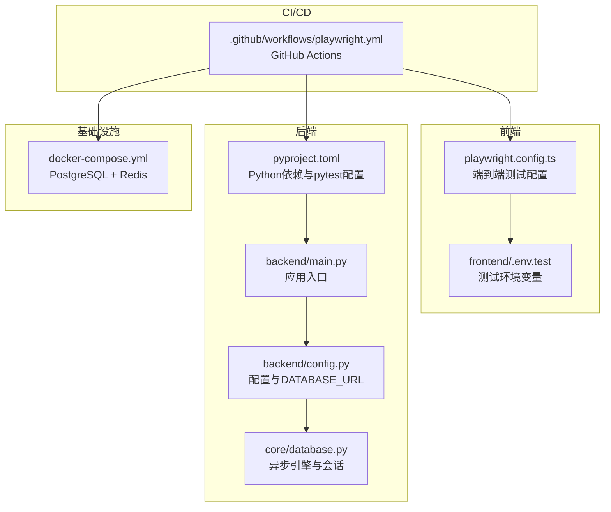
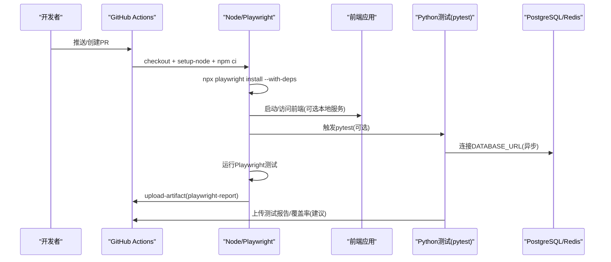
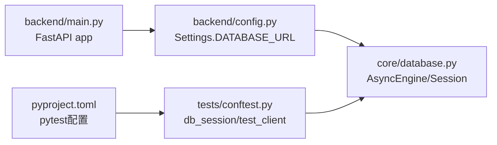

# 自动化测试流程

<cite>
**本文引用的文件**
- [.github/workflows/playwright.yml](file://.github/workflows/playwright.yml)
- [playwright.config.ts](file://playwright.config.ts)
- [docker-compose.yml](file://docker-compose.yml)
- [pyproject.toml](file://pyproject.toml)
- [package.json](file://package.json)
- [tests/conftest.py](file://tests/conftest.py)
- [tests/unit/test_automation_service.py](file://tests/unit/test_automation_service.py)
- [tests/unit/test_integration_service.py](file://tests/unit/test_integration_service.py)
- [frontend/.env.test](file://frontend/.env.test)
- [backend/config.py](file://backend/config.py)
- [core/database.py](file://core/database.py)
- [backend/main.py](file://backend/main.py)
- [scripts/run_auto_novel.sh](file://scripts/run_auto_novel.sh)
</cite>

## 目录
1. [简介](#简介)
2. [项目结构](#项目结构)
3. [核心组件](#核心组件)
4. [架构总览](#架构总览)
5. [详细组件分析](#详细组件分析)
6. [依赖关系分析](#依赖关系分析)
7. [性能考量](#性能考量)
8. [故障排查指南](#故障排查指南)
9. [结论](#结论)
10. [附录](#附录)

## 简介
本实施文档面向DevOps工程师，系统性阐述小说生成系统的自动化测试流程与CI/CD实践，涵盖以下要点：
- GitHub Actions流水线配置与触发机制（PR检查、分支保护、测试失败处理）
- 测试环境自动化（Docker容器化依赖服务、数据库迁移、本地服务启动）
- 测试执行策略（Python单元/集成测试、Playwright端到端测试、并行与重试）
- 测试报告与覆盖率（HTML报告、Artifacts归档、覆盖率统计建议）
- 测试数据管理与环境隔离（数据库隔离、测试客户端注入、环境变量）
- 安全与稳定性（密钥管理、超时与重试、健康检查）

## 项目结构
该仓库采用前后端分离与多语言技术栈：
- 后端：Python/FastAPI + SQLAlchemy异步ORM + Alembic迁移
- 前端：TypeScript/Vue + Playwright E2E测试
- 测试：pytest（单元/集成）+ Playwright（端到端）
- 依赖服务：PostgreSQL + Redis（Docker Compose）
- CI：GitHub Actions（Playwright测试）

图表来源
- [.github/workflows/playwright.yml](file://.github/workflows/playwright.yml#L1-L28)
- [playwright.config.ts](file://playwright.config.ts#L1-L80)
- [frontend/.env.test](file://frontend/.env.test#L1-L23)
- [pyproject.toml](file://pyproject.toml#L1-L64)
- [backend/main.py](file://backend/main.py#L1-L53)
- [backend/config.py](file://backend/config.py#L1-L59)
- [core/database.py](file://core/database.py#L1-L35)
- [docker-compose.yml](file://docker-compose.yml#L1-L25)

章节来源
- [.github/workflows/playwright.yml](file://.github/workflows/playwright.yml#L1-L28)
- [playwright.config.ts](file://playwright.config.ts#L1-L80)
- [frontend/.env.test](file://frontend/.env.test#L1-L23)
- [pyproject.toml](file://pyproject.toml#L1-L64)
- [backend/main.py](file://backend/main.py#L1-L53)
- [backend/config.py](file://backend/config.py#L1-L59)
- [core/database.py](file://core/database.py#L1-L35)
- [docker-compose.yml](file://docker-compose.yml#L1-L25)

## 核心组件
- GitHub Actions流水线：负责在推送与PR上触发Playwright测试，上传报告Artifacts。
- Playwright配置：定义并行策略、重试次数、报告器、浏览器设备集、本地服务启动钩子等。
- Python测试框架：pytest + asyncio，通过conftest提供数据库引擎、会话与HTTP测试客户端。
- Docker Compose：提供PostgreSQL与Redis的稳定测试依赖环境。
- FastAPI应用：提供健康检查与路由，供E2E测试访问。
- 配置与数据库：统一读取环境变量，动态拼接DATABASE_URL，支持异步会话。

章节来源
- [.github/workflows/playwright.yml](file://.github/workflows/playwright.yml#L1-L28)
- [playwright.config.ts](file://playwright.config.ts#L14-L79)
- [tests/conftest.py](file://tests/conftest.py#L1-L84)
- [docker-compose.yml](file://docker-compose.yml#L1-L25)
- [backend/main.py](file://backend/main.py#L15-L53)
- [backend/config.py](file://backend/config.py#L11-L27)
- [core/database.py](file://core/database.py#L11-L35)

## 架构总览
下图展示了CI/CD中测试执行的关键路径：Actions拉取代码 → 安装Node与Playwright → 运行E2E测试 → 上传报告Artifacts；同时pytest在本地或CI中运行Python测试，使用Docker提供的数据库与Redis服务。

图表来源
- [.github/workflows/playwright.yml](file://.github/workflows/playwright.yml#L12-L27)
- [playwright.config.ts](file://playwright.config.ts#L24-L33)
- [backend/config.py](file://backend/config.py#L18-L27)
- [core/database.py](file://core/database.py#L11-L22)

## 详细组件分析

### GitHub Actions流水线（Playwright）
- 触发条件：push到main/master，pull_request到main/master
- 运行环境：ubuntu-latest
- 步骤要点：
  - checkout仓库
  - setup-node（Node LTS）
  - npm ci安装依赖
  - 安装Playwright浏览器依赖
  - 运行Playwright测试
  - 上传Artifacts（playwright-report），保留30天
- 超时：单作业最大60分钟

建议增强：
- 在CI中启用pytest并行与重试，上传测试报告与覆盖率
- 针对不同分支设置不同的测试矩阵（如PR仅运行关键测试）

章节来源
- [.github/workflows/playwright.yml](file://.github/workflows/playwright.yml#L1-L28)

### Playwright配置与执行策略
- 并行：fullyParallel开启
- 重试：CI环境启用retries=2
- 工作器：CI环境workers=1（避免并发竞争）
- 报告器：HTML报告
- 设备集：chromium/firefox/webkit
- 本地服务：注释掉webServer，可在CI中通过Docker或外部服务提供前端/后端
- 追踪：首次重试收集trace

建议增强：
- 在CI中添加webServer配置指向已启动的后端服务
- 添加Junit XML报告以便与CI平台集成

章节来源
- [playwright.config.ts](file://playwright.config.ts#L14-L79)

### Python测试环境与数据库隔离
- 事件循环：session级event_loop修复asyncpg事件循环问题
- 数据库引擎：每个测试函数创建独立引擎，创建所有表并在结束时清理
- 会话：每个测试函数使用独立事务，测试结束后回滚
- 测试客户端：覆盖FastAPI依赖get_db，使用httpx ASGITransport进行异步HTTP测试
- 标记：pytest.ini定义unit/network/real_crawl/integration/slow标记

建议增强：
- 在CI中为每个测试进程分配独立数据库实例或schema
- 使用pytest-xdist并结合数据库隔离策略

章节来源
- [tests/conftest.py](file://tests/conftest.py#L21-L84)
- [pyproject.toml](file://pyproject.toml#L54-L63)

### Docker容器化测试依赖服务
- PostgreSQL：映射本地5434:5432，持久化卷
- Redis：映射本地6379:6379，持久化卷
- 通过环境变量DATABASE_URL连接，确保CI与本地一致

建议增强：
- 在CI中使用docker-compose up -d启动服务，等待健康检查后再运行测试
- 使用独立测试网络隔离

章节来源
- [docker-compose.yml](file://docker-compose.yml#L1-L25)
- [backend/config.py](file://backend/config.py#L18-L27)

### FastAPI应用与健康检查
- 提供根路径与健康检查接口，便于E2E测试验证服务可用性
- CORS限制为前端开发服务器地址

建议增强：
- 在CI中先调用健康检查endpoint，确认服务就绪再运行测试

章节来源
- [backend/main.py](file://backend/main.py#L15-L53)

### 前端测试环境变量
- NODE_ENV=test
- BASE_URL=http://localhost:3000
- 测试数据库与账号信息（用于前端E2E）
- TEST_TIMEOUT与TEST_MODE

建议增强：
- 将敏感信息放入GitHub Secrets并在CI中注入

章节来源
- [frontend/.env.test](file://frontend/.env.test#L1-L23)

### 单元/集成测试示例
- 自动化服务测试：验证工作流执行、代理初始化、状态查询、批量任务
- 集成服务测试：端到端工作流、历史记录与详情查询

建议增强：
- 为每个测试模块增加覆盖率统计（pytest-cov）
- 对慢测试使用标记并控制CI运行范围

章节来源
- [tests/unit/test_automation_service.py](file://tests/unit/test_automation_service.py#L6-L87)
- [tests/unit/test_integration_service.py](file://tests/unit/test_integration_service.py#L6-L59)

## 依赖关系分析
后端配置与数据库层的依赖关系如下：

图表来源
- [backend/config.py](file://backend/config.py#L18-L27)
- [core/database.py](file://core/database.py#L11-L22)
- [backend/main.py](file://backend/main.py#L15-L32)
- [pyproject.toml](file://pyproject.toml#L54-L63)
- [tests/conftest.py](file://tests/conftest.py#L30-L73)

章节来源
- [backend/config.py](file://backend/config.py#L1-L59)
- [core/database.py](file://core/database.py#L1-L35)
- [backend/main.py](file://backend/main.py#L1-L53)
- [pyproject.toml](file://pyproject.toml#L54-L63)
- [tests/conftest.py](file://tests/conftest.py#L1-L84)

## 性能考量
- Playwright并行与重试：在CI中适度降低并发以减少资源争用
- 数据库连接池：合理设置pool_size与max_overflow，避免连接耗尽
- 测试超时：为慢测试设置独立标记与超时，避免阻塞主流水线
- 缓存与复用：利用Docker卷持久化PostgreSQL/Redis，减少重复初始化时间

## 故障排查指南
- Playwright报告缺失：确认Artifacts上传步骤未被取消，且路径正确
- 数据库连接失败：核对DATABASE_URL与端口映射，确保Docker服务已启动
- E2E测试不稳定：启用trace收集，检查重试策略与超时设置
- pytest会话异常：确认event_loop与事务回滚逻辑正常
- 健康检查失败：先调用/health端点，确认服务就绪

章节来源
- [.github/workflows/playwright.yml](file://.github/workflows/playwright.yml#L22-L27)
- [playwright.config.ts](file://playwright.config.ts#L20-L23)
- [backend/main.py](file://backend/main.py#L46-L53)
- [tests/conftest.py](file://tests/conftest.py#L21-L53)
- [docker-compose.yml](file://docker-compose.yml#L1-L25)

## 结论
通过将Playwright端到端测试与pytest单元/集成测试结合，并借助Docker Compose提供稳定的依赖服务，可以在CI中实现高效、可靠的自动化测试流程。建议进一步完善覆盖率统计、报告标准化与环境变量安全化，以提升测试质量与可维护性。

## 附录

### CI/CD流水线配置建议（示例思路）
- 触发策略：仅在main/master分支启用完整测试；PR仅运行关键测试
- 服务准备：docker-compose up -d，等待健康检查
- 测试阶段：
  - Python：pytest + 并行 + 重试 + 覆盖率
  - 前端：Playwright + HTML报告 + Artifacts
- 失败处理：失败邮件通知、自动重试一次、降级运行
- 报告与归档：上传HTML报告、Junit XML、playwright-report

### 测试数据管理与环境隔离
- 数据库：每个测试函数使用独立引擎与事务回滚
- 测试客户端：覆盖依赖注入，避免真实数据库写入
- 环境变量：区分开发/测试/生产，敏感信息使用Secrets

### 安全考虑
- 不在仓库中存储API密钥与密码
- 使用GitHub Secrets管理敏感变量
- 限制CORS与访问权限，仅允许受信来源
- 定期轮换密钥与最小权限原则