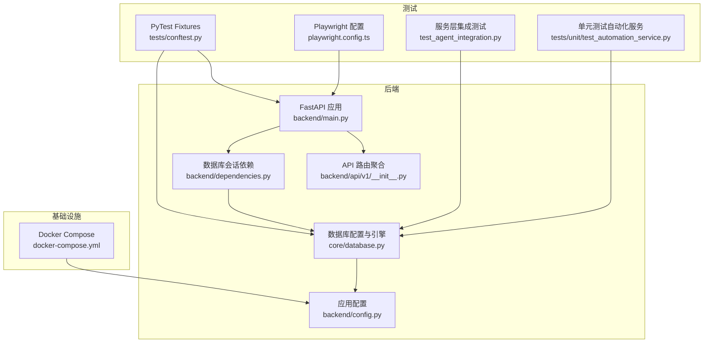
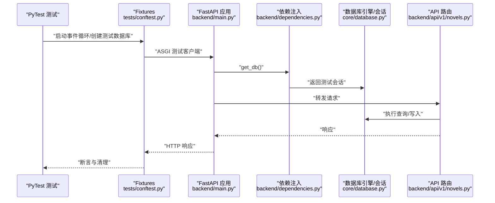
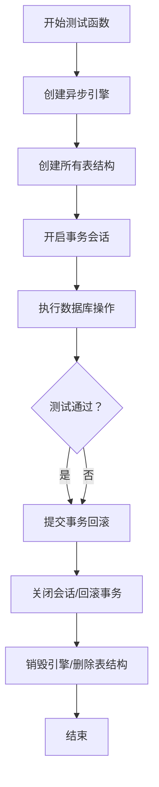
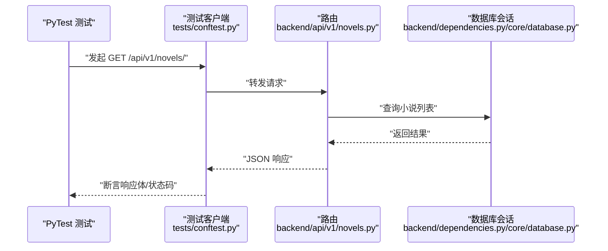
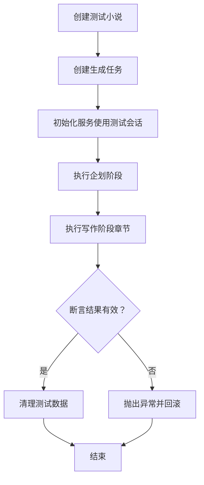
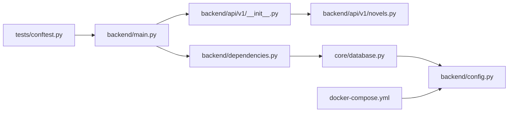

# 集成测试

<cite>
**本文引用的文件**
- [tests/conftest.py](file://tests/conftest.py)
- [backend/main.py](file://backend/main.py)
- [backend/config.py](file://backend/config.py)
- [core/database.py](file://core/database.py)
- [backend/api/v1/__init__.py](file://backend/api/v1/__init__.py)
- [backend/api/v1/novels.py](file://backend/api/v1/novels.py)
- [backend/dependencies.py](file://backend/dependencies.py)
- [docker-compose.yml](file://docker-compose.yml)
- [playwright.config.ts](file://playwright.config.ts)
- [test_agent_integration.py](file://test_agent_integration.py)
- [tests/unit/test_automation_service.py](file://tests/unit/test_automation_service.py)
</cite>

## 目录
1. [简介](#简介)
2. [项目结构](#项目结构)
3. [核心组件](#核心组件)
4. [架构总览](#架构总览)
5. [详细组件分析](#详细组件分析)
6. [依赖分析](#依赖分析)
7. [性能考虑](#性能考虑)
8. [故障排查指南](#故障排查指南)
9. [结论](#结论)
10. [附录](#附录)

## 简介
本文件为小说生成系统的集成测试实施指南，聚焦端到端测试的设计理念与落地策略，涵盖数据库集成测试、API 接口测试、服务层集成测试。文档同时给出测试环境搭建（测试数据库、依赖服务、环境变量）、测试数据管理（准备、清理、隔离）、具体集成测试示例（完整业务流程、错误处理链路、并发场景）、测试执行策略与结果验证、性能监控建议，帮助测试工程师高效落地。

## 项目结构
系统采用前后端分离架构：后端基于 FastAPI 提供 REST API；数据库使用 PostgreSQL（通过 Alembic 管理迁移）；Redis 作为缓存与消息队列中间件；前端使用 Vite + TypeScript + Playwright 进行端到端测试与界面交互验证。测试体系由 PyTest 驱动，配合 httpx ASGI 客户端进行 API 层集成测试；同时提供独立的服务层集成测试脚本与单元测试。

图表来源
- [backend/main.py](file://backend/main.py#L1-L53)
- [backend/api/v1/__init__.py](file://backend/api/v1/__init__.py#L1-L29)
- [backend/dependencies.py](file://backend/dependencies.py#L1-L23)
- [core/database.py](file://core/database.py#L1-L35)
- [backend/config.py](file://backend/config.py#L1-L59)
- [tests/conftest.py](file://tests/conftest.py#L1-L84)
- [docker-compose.yml](file://docker-compose.yml#L1-L25)
- [playwright.config.ts](file://playwright.config.ts#L1-L80)
- [test_agent_integration.py](file://test_agent_integration.py#L1-L97)
- [tests/unit/test_automation_service.py](file://tests/unit/test_automation_service.py#L1-L87)

章节来源
- [backend/main.py](file://backend/main.py#L1-L53)
- [backend/api/v1/__init__.py](file://backend/api/v1/__init__.py#L1-L29)
- [backend/dependencies.py](file://backend/dependencies.py#L1-L23)
- [core/database.py](file://core/database.py#L1-L35)
- [backend/config.py](file://backend/config.py#L1-L59)
- [tests/conftest.py](file://tests/conftest.py#L1-L84)
- [docker-compose.yml](file://docker-compose.yml#L1-L25)
- [playwright.config.ts](file://playwright.config.ts#L1-L80)
- [test_agent_integration.py](file://test_agent_integration.py#L1-L97)
- [tests/unit/test_automation_service.py](file://tests/unit/test_automation_service.py#L1-L87)

## 核心组件
- 测试夹具（Fixtures）
  - 事件循环：确保异步数据库驱动在 PyTest 中正确运行。
  - 数据库引擎与会话：按测试函数粒度创建/销毁表结构，提供事务级回滚，保证测试隔离。
  - FastAPI 测试客户端：通过依赖覆盖将数据库依赖替换为测试会话，实现端到端 API 集成测试。
  - 真实 HTTP 客户端：用于需要真实网络请求的场景测试。
- 应用入口与路由
  - FastAPI 应用注册 CORS、根与健康检查端点，包含 v1 路由集合。
  - v1 路由聚合器统一挂载各模块子路由。
- 数据库与配置
  - 异步 SQLAlchemy 引擎与会话工厂，支持调试输出与连接池参数。
  - 动态构建数据库连接串，支持同步/异步两种 URL。
- 基础设施编排
  - Docker Compose 提供 Postgres 与 Redis 服务，映射本地端口便于开发与测试。

章节来源
- [tests/conftest.py](file://tests/conftest.py#L1-L84)
- [backend/main.py](file://backend/main.py#L1-L53)
- [backend/api/v1/__init__.py](file://backend/api/v1/__init__.py#L1-L29)
- [core/database.py](file://core/database.py#L1-L35)
- [backend/config.py](file://backend/config.py#L1-L59)
- [docker-compose.yml](file://docker-compose.yml#L1-L25)

## 架构总览
下图展示了集成测试的关键路径：PyTest 通过 fixtures 启动测试数据库与应用，使用 httpx ASGI 客户端访问 FastAPI 路由，路由调用依赖注入的数据库会话，最终访问模型层完成 CRUD 操作。服务层集成测试则直接使用会话工厂，绕过 HTTP 层，专注于业务流程与错误处理。

图表来源
- [tests/conftest.py](file://tests/conftest.py#L30-L73)
- [backend/main.py](file://backend/main.py#L15-L32)
- [backend/dependencies.py](file://backend/dependencies.py#L12-L19)
- [core/database.py](file://core/database.py#L25-L35)
- [backend/api/v1/novels.py](file://backend/api/v1/novels.py#L25-L63)

## 详细组件分析

### 数据库集成测试
- 设计理念
  - 以测试函数为粒度创建/销毁表结构，避免跨用例污染。
  - 使用事务包裹测试会话，在测试结束时回滚，确保隔离性与可重复性。
- 实施要点
  - 通过环境变量覆盖测试数据库连接串，支持自定义测试库。
  - 在会话工厂外层封装事务，确保异常时自动回滚。
- 关键路径
  - 引擎创建与元数据初始化：[tests/conftest.py](file://tests/conftest.py#L31-L39)
  - 事务会话与回滚：[tests/conftest.py](file://tests/conftest.py#L43-L52)
  - 引擎与元数据清理：[tests/conftest.py](file://tests/conftest.py#L37-L39)

图表来源
- [tests/conftest.py](file://tests/conftest.py#L31-L52)

章节来源
- [tests/conftest.py](file://tests/conftest.py#L18-L52)
- [core/database.py](file://core/database.py#L11-L22)

### API 接口测试
- 设计理念
  - 使用 httpx ASGI 测试客户端，覆盖依赖注入，确保路由层与数据库层联动。
  - 对关键端点（列表、创建、详情、更新、删除）进行正向与边界条件测试。
- 实施要点
  - 通过依赖覆盖将 get_db 替换为测试会话，避免真实数据库耦合。
  - 使用分页、过滤、错误码等场景验证路由行为。
- 关键路径
  - 测试客户端与依赖覆盖：[tests/conftest.py](file://tests/conftest.py#L56-L72)
  - 小说列表端点（分页/筛选）：[backend/api/v1/novels.py](file://backend/api/v1/novels.py#L25-L63)
  - 小说 CRUD 端点：[backend/api/v1/novels.py](file://backend/api/v1/novels.py#L66-L150)

图表来源
- [tests/conftest.py](file://tests/conftest.py#L56-L72)
- [backend/api/v1/novels.py](file://backend/api/v1/novels.py#L25-L63)
- [backend/dependencies.py](file://backend/dependencies.py#L12-L19)
- [core/database.py](file://core/database.py#L25-L35)

章节来源
- [tests/conftest.py](file://tests/conftest.py#L56-L72)
- [backend/api/v1/novels.py](file://backend/api/v1/novels.py#L25-L150)
- [backend/dependencies.py](file://backend/dependencies.py#L12-L19)
- [core/database.py](file://core/database.py#L25-L35)

### 服务层集成测试
- 设计理念
  - 绕过 HTTP 层，直接使用会话工厂实例化服务类，验证业务流程与错误处理。
  - 适用于复杂工作流（如创作规划、章节生成）的端到端验证。
- 实施要点
  - 在测试中构造最小必要数据（如小说、任务），执行服务方法，断言结果字段与长度。
  - 最终清理测试数据，确保数据库整洁。
- 关键路径
  - 服务层集成测试脚本：[test_agent_integration.py](file://test_agent_integration.py#L21-L94)
  - 自动化服务单元测试（参考）：[tests/unit/test_automation_service.py](file://tests/unit/test_automation_service.py#L6-L87)

图表来源
- [test_agent_integration.py](file://test_agent_integration.py#L21-L94)

章节来源
- [test_agent_integration.py](file://test_agent_integration.py#L21-L94)
- [tests/unit/test_automation_service.py](file://tests/unit/test_automation_service.py#L6-L87)

### 错误处理链路与并发场景
- 错误处理
  - 路由层对不存在资源返回 404，服务层对异常进行回滚与上抛。
  - 建议在测试中模拟缺失资源、非法输入、数据库异常等场景，验证错误码与消息。
- 并发场景
  - 利用多线程/多进程并发触发相同业务流程，验证幂等性与锁策略。
  - 对关键写入操作（创建/更新）进行竞态检测，结合数据库约束与业务校验。

章节来源
- [backend/api/v1/novels.py](file://backend/api/v1/novels.py#L101-L102)
- [core/database.py](file://core/database.py#L25-L35)

## 依赖分析
- 组件耦合
  - 测试夹具与应用入口解耦：通过依赖覆盖实现测试隔离。
  - 路由与依赖层清晰分离，便于针对不同层级进行测试。
- 外部依赖
  - Postgres 与 Redis 通过 Docker Compose 提供，测试前需确保容器可用。
  - LLM 与爬虫配置在应用配置中集中管理，测试时可通过环境变量覆盖。

图表来源
- [tests/conftest.py](file://tests/conftest.py#L56-L72)
- [backend/main.py](file://backend/main.py#L15-L32)
- [backend/api/v1/__init__.py](file://backend/api/v1/__init__.py#L11-L28)
- [backend/api/v1/novels.py](file://backend/api/v1/novels.py#L22-L22)
- [backend/dependencies.py](file://backend/dependencies.py#L12-L19)
- [core/database.py](file://core/database.py#L11-L22)
- [backend/config.py](file://backend/config.py#L18-L26)
- [docker-compose.yml](file://docker-compose.yml#L1-L25)

章节来源
- [tests/conftest.py](file://tests/conftest.py#L56-L72)
- [backend/main.py](file://backend/main.py#L15-L32)
- [backend/api/v1/__init__.py](file://backend/api/v1/__init__.py#L11-L28)
- [backend/api/v1/novels.py](file://backend/api/v1/novels.py#L22-L22)
- [backend/dependencies.py](file://backend/dependencies.py#L12-L19)
- [core/database.py](file://core/database.py#L11-L22)
- [backend/config.py](file://backend/config.py#L18-L26)
- [docker-compose.yml](file://docker-compose.yml#L1-L25)

## 性能考虑
- 数据库连接池与超时
  - 合理设置连接池大小与溢出，避免高并发下的连接争用。
  - 为长耗时任务（如批量生成）设置超时与重试策略。
- API 层优化
  - 分页查询与条件筛选减少单次查询负载。
  - 使用 selectinload 等策略降低 N+1 查询风险。
- 测试并发
  - 使用 PyTest 的并发执行能力，但需确保测试间无共享状态。
  - 对数据库与外部服务（LLM/爬虫）增加限流与熔断保护。

## 故障排查指南
- 数据库连接失败
  - 检查测试数据库 URL 是否正确，确认 Docker Compose 已启动并映射端口。
  - 确认环境变量 TEST_DATABASE_URL 或默认 DATABASE_URL 设置正确。
- 依赖注入异常
  - 确保测试客户端已正确覆盖 get_db 依赖，避免使用真实会话。
- 路由 404/422
  - 核对 UUID 参数格式、查询参数范围与必填字段。
- 服务层异常
  - 检查测试数据是否完整（如关联实体是否存在），异常时查看回滚日志。

章节来源
- [tests/conftest.py](file://tests/conftest.py#L18-L18)
- [tests/conftest.py](file://tests/conftest.py#L61-L64)
- [backend/api/v1/novels.py](file://backend/api/v1/novels.py#L101-L102)
- [core/database.py](file://core/database.py#L25-L35)

## 结论
通过测试夹具、ASGI 客户端与依赖覆盖，系统实现了数据库、API 与服务层的端到端集成测试。配合 Docker Compose 提供的基础设施与明确的数据管理策略，测试具备良好的隔离性与可重复性。建议在持续集成中引入并发与性能指标监控，进一步提升测试质量与稳定性。

## 附录

### 测试环境搭建
- 启动依赖服务
  - 使用 Docker Compose 启动 Postgres 与 Redis，确认端口映射与数据卷。
- 配置数据库
  - 设置测试数据库 URL（优先使用环境变量），确保与生产隔离。
- 启动应用
  - 后端应用在开发模式下运行，CORS 仅允许前端开发服务器访问。

章节来源
- [docker-compose.yml](file://docker-compose.yml#L1-L25)
- [backend/config.py](file://backend/config.py#L18-L26)
- [backend/main.py](file://backend/main.py#L22-L29)

### 测试数据管理策略
- 准备
  - 在测试开始时创建最小必要数据（如小说、任务），避免冗余。
- 清理
  - 使用事务回滚或显式删除，确保测试结束后数据库状态一致。
- 隔离
  - 每个测试函数拥有独立引擎与会话，避免跨用例干扰。

章节来源
- [tests/conftest.py](file://tests/conftest.py#L31-L52)
- [test_agent_integration.py](file://test_agent_integration.py#L82-L94)

### 测试执行策略与结果验证
- 执行策略
  - 使用 PyTest 并行执行，CI 环境下适当降低并发度。
  - 对关键端点与服务流程分别编写集成测试与单元测试。
- 结果验证
  - 断言响应状态码、结构与字段，结合数据库一致性验证。
  - 记录测试报告与截图，定位失败用例。

章节来源
- [playwright.config.ts](file://playwright.config.ts#L16-L23)
- [tests/unit/test_automation_service.py](file://tests/unit/test_automation_service.py#L6-L87)