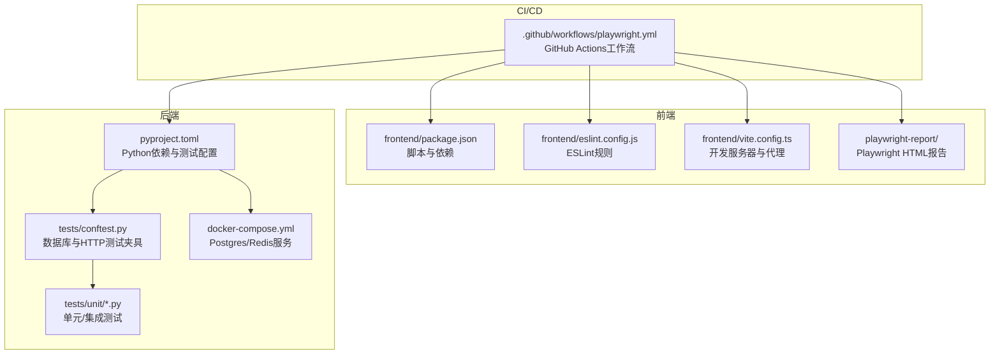
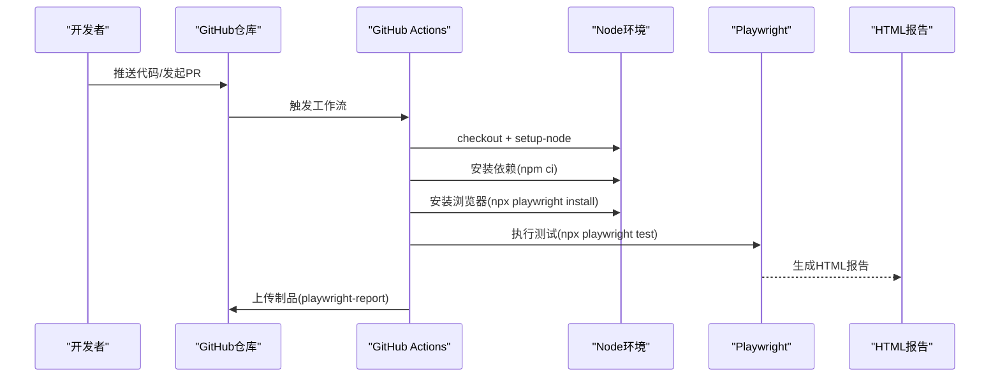
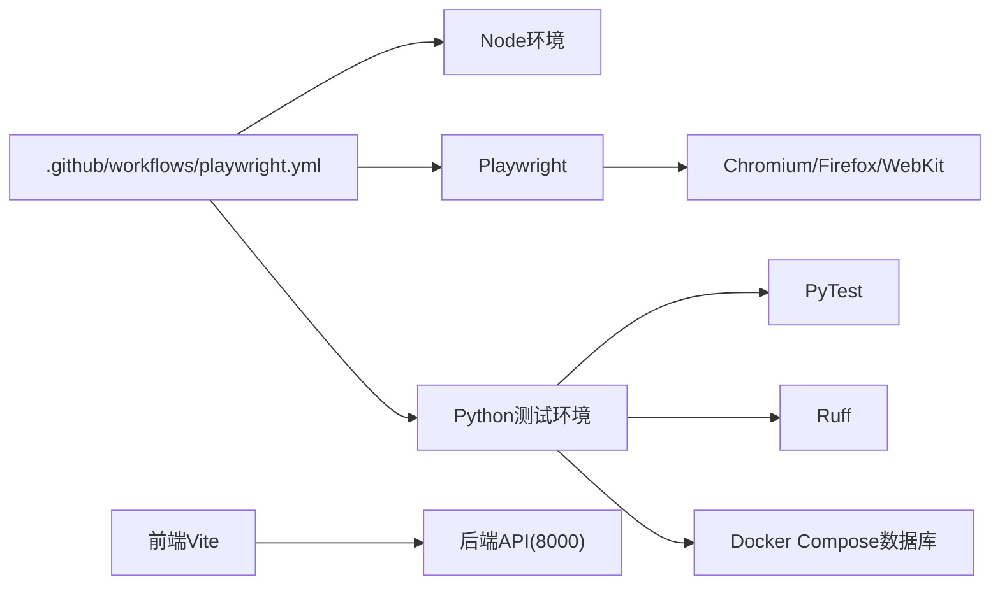
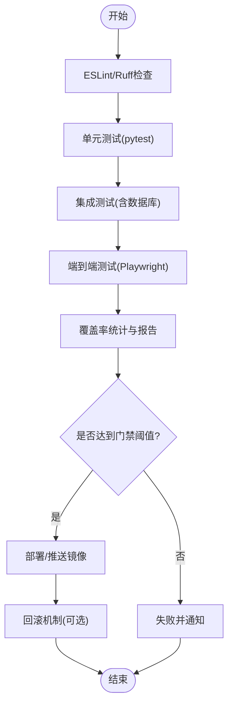

# CI/CD持续集成流水线

<cite>
**本文档引用的文件**
- [.github/workflows/playwright.yml](file://.github/workflows/playwright.yml)
- [playwright.config.ts](file://playwright.config.ts)
- [pyproject.toml](file://pyproject.toml)
- [docker-compose.yml](file://docker-compose.yml)
- [tests/conftest.py](file://tests/conftest.py)
- [tests/unit/test_automation_service.py](file://tests/unit/test_automation_service.py)
- [tests/unit/test_integration_service.py](file://tests/unit/test_integration_service.py)
- [frontend/package.json](file://frontend/package.json)
- [frontend/vite.config.ts](file://frontend/vite.config.ts)
- [frontend/eslint.config.js](file://frontend/eslint.config.js)
</cite>

## 目录
1. [简介](#简介)
2. [项目结构](#项目结构)
3. [核心组件](#核心组件)
4. [架构总览](#架构总览)
5. [详细组件分析](#详细组件分析)
6. [依赖关系分析](#依赖关系分析)
7. [性能考虑](#性能考虑)
8. [故障排除指南](#故障排除指南)
9. [结论](#结论)
10. [附录](#附录)

## 简介
本指南面向小说系统项目的CI/CD持续集成与部署实践，围绕以下目标展开：  
- GitHub Actions工作流配置与执行流程  
- 代码质量检查、单元测试、集成测试、端到端测试的自动化  
- Playwright测试框架的配置与使用（测试环境、浏览器配置、报告生成）  
- 前端与后端测试策略（静态代码分析、API测试、数据库测试）  
- 自动化部署流程（构建镜像、推送仓库、服务更新）  
- 覆盖率报告、代码质量门禁、部署回滚机制  
- 流水线监控与通知配置  

当前仓库已具备基础的Playwright端到端测试工作流与配置，以及后端Python测试与依赖管理配置。后续可在此基础上扩展前端测试、覆盖率统计、质量门禁与自动化部署。

## 项目结构
项目采用前后端分离与多模块组织方式：  
- 后端：FastAPI应用、数据库模型与服务层、测试夹具与测试用例  
- 前端：React/Vite应用、ESLint配置、Playwright测试报告产物  
- 工作流：GitHub Actions Playwright测试工作流  
- 基础设施：Docker Compose数据库与缓存服务

**图表来源**
- [.github/workflows/playwright.yml](file://.github/workflows/playwright.yml#L1-L28)
- [frontend/package.json](file://frontend/package.json#L1-L42)
- [frontend/eslint.config.js](file://frontend/eslint.config.js#L1-L24)
- [frontend/vite.config.ts](file://frontend/vite.config.ts#L1-L23)
- [playwright.config.ts](file://playwright.config.ts#L1-L80)
- [pyproject.toml](file://pyproject.toml#L1-L64)
- [tests/conftest.py](file://tests/conftest.py#L1-L84)
- [docker-compose.yml](file://docker-compose.yml#L1-L25)

**章节来源**
- [.github/workflows/playwright.yml](file://.github/workflows/playwright.yml#L1-L28)
- [playwright.config.ts](file://playwright.config.ts#L1-L80)
- [pyproject.toml](file://pyproject.toml#L1-L64)
- [docker-compose.yml](file://docker-compose.yml#L1-L25)
- [tests/conftest.py](file://tests/conftest.py#L1-L84)
- [frontend/package.json](file://frontend/package.json#L1-L42)
- [frontend/vite.config.ts](file://frontend/vite.config.ts#L1-L23)
- [frontend/eslint.config.js](file://frontend/eslint.config.js#L1-L24)

## 核心组件
- GitHub Actions工作流：在主分支推送与拉取请求时触发，执行Playwright端到端测试，并上传HTML报告作为制品。  
- Playwright配置：定义测试目录、并行策略、重试策略、报告器、浏览器项目与追踪设置。  
- Python测试生态：Ruff静态检查、PyTest测试框架、数据库夹具与HTTP测试客户端。  
- Docker Compose：本地/CI数据库与缓存服务，支持测试数据库隔离。  
- 前端工具链：Vite开发服务器、ESLint静态分析、包脚本与代理配置。

**章节来源**
- [.github/workflows/playwright.yml](file://.github/workflows/playwright.yml#L1-L28)
- [playwright.config.ts](file://playwright.config.ts#L14-L79)
- [pyproject.toml](file://pyproject.toml#L38-L63)
- [docker-compose.yml](file://docker-compose.yml#L1-L25)
- [frontend/package.json](file://frontend/package.json#L6-L11)
- [frontend/eslint.config.js](file://frontend/eslint.config.js#L8-L23)

## 架构总览
下图展示从代码提交到测试执行与报告产出的整体流程：

**图表来源**
- [.github/workflows/playwright.yml](file://.github/workflows/playwright.yml#L11-L27)
- [playwright.config.ts](file://playwright.config.ts#L24-L33)

**章节来源**
- [.github/workflows/playwright.yml](file://.github/workflows/playwright.yml#L1-L28)
- [playwright.config.ts](file://playwright.config.ts#L14-L79)

## 详细组件分析

### GitHub Actions工作流配置
- 触发条件：主分支push与pull_request  
- 运行环境：ubuntu-latest  
- 步骤概要：检出代码、安装Node、安装依赖、安装Playwright浏览器、运行测试、上传报告  
- 制品：将playwright-report目录作为Artifacts上传，保留30天

建议增强点：
- 添加质量检查步骤（如Ruff、ESLint）  
- 添加测试覆盖率收集与报告  
- 配置质量门禁（阈值失败）  
- 增加邮件/Slack通知  
- 将报告上传为PR评论或专用页面

**章节来源**
- [.github/workflows/playwright.yml](file://.github/workflows/playwright.yml#L1-L28)

### Playwright测试框架配置
- 测试目录：./e2e  
- 并行策略：完全并行；CI中限制workers数量  
- 重试策略：CI启用重试，本地禁用  
- 报告器：HTML报告  
- 浏览器项目：chromium/firefox/webkit  
- 追踪：首次重试时开启  
- 开发服务器：注释掉的webServer配置，可在本地自定义启动命令与URL

建议增强点：
- 在CI中通过webServer自动启动后端服务  
- 配置baseURL或环境变量以指向测试服务  
- 为移动端设备添加可选项目  
- 使用GitHub Pages或制品存储报告

**章节来源**
- [playwright.config.ts](file://playwright.config.ts#L14-L79)

### 前端测试与质量策略
- ESLint配置：基于TypeScript推荐规则与React Hooks/React Refresh插件  
- Vite开发服务器：端口3000，代理到后端8000端口  
- 包脚本：dev/build/lint/preview  
- 当前缺少前端Playwright测试文件与覆盖率统计

建议增强点：
- 在前端根目录添加e2e测试目录与示例测试  
- 集成Playwright到前端工作流，统一报告  
- 添加ESLint与TSC检查到CI  
- 配置前端覆盖率与质量门禁

**章节来源**
- [frontend/eslint.config.js](file://frontend/eslint.config.js#L8-L23)
- [frontend/vite.config.ts](file://frontend/vite.config.ts#L12-L21)
- [frontend/package.json](file://frontend/package.json#L6-L11)

### 后端测试策略
- PyTest配置：测试路径tests，标记unit/network/real_crawl/integration/slow  
- Ruff配置：行宽、目标版本、选择规则  
- 数据库夹具：会话级事件循环、异步引擎、事务回滚、HTTP测试客户端  
- 单元/集成测试：覆盖自动化服务与集成服务的关键流程

建议增强点：
- 添加覆盖率统计（pytest-cov）与报告  
- 在CI中启用覆盖率门禁  
- 为真实爬取场景添加网络访问标记与隔离  
- 将数据库测试与Docker Compose集成到工作流

**章节来源**
- [pyproject.toml](file://pyproject.toml#L54-L63)
- [pyproject.toml](file://pyproject.toml#L47-L52)
- [tests/conftest.py](file://tests/conftest.py#L21-L84)
- [tests/unit/test_automation_service.py](file://tests/unit/test_automation_service.py#L1-L87)
- [tests/unit/test_integration_service.py](file://tests/unit/test_integration_service.py#L1-L59)

### 数据库与测试环境
- Docker Compose：Postgres与Redis容器，暴露必要端口并挂载数据卷  
- 测试数据库：通过TEST_DATABASE_URL或settings.DATABASE_URL注入  
- 夹具行为：创建所有表、单测结束删除，连接事务回滚保证隔离

建议增强点：
- 在CI中自动拉起Docker Compose并等待服务就绪  
- 为不同测试类型（单元/集成）准备独立数据库实例或schema  
- 添加Alembic迁移脚本以确保测试数据库结构一致

**章节来源**
- [docker-compose.yml](file://docker-compose.yml#L1-L25)
- [tests/conftest.py](file://tests/conftest.py#L18-L52)

### 自动化部署流程（建议）
以下为通用建议流程，便于与现有工作流衔接：  
- 构建镜像：在工作流末尾添加构建步骤，使用Dockerfile输出镜像  
- 推送仓库：使用带标签的版本号推送到镜像仓库  
- 服务更新：通过Kubernetes/Helm或Docker Compose进行滚动更新  
- 回滚机制：保存上一版本镜像标签，失败时回滚  
- 监控与通知：在部署阶段发送通知至Slack/邮件，记录部署日志与制品链接

[本节为概念性指导，不直接分析具体文件，故无“章节来源”]

## 依赖关系分析
- 工作流对前端与后端的依赖：需要Node环境、Playwright、Python测试环境  
- Playwright对浏览器的依赖：通过npx playwright install安装  
- 后端测试对数据库的依赖：Docker Compose或外部测试数据库  
- 前端开发对Vite代理的依赖：代理后端API端口

**图表来源**
- [.github/workflows/playwright.yml](file://.github/workflows/playwright.yml#L10-L19)
- [playwright.config.ts](file://playwright.config.ts#L35-L71)
- [docker-compose.yml](file://docker-compose.yml#L1-L25)
- [frontend/vite.config.ts](file://frontend/vite.config.ts#L15-L20)

**章节来源**
- [.github/workflows/playwright.yml](file://.github/workflows/playwright.yml#L1-L28)
- [playwright.config.ts](file://playwright.config.ts#L35-L71)
- [docker-compose.yml](file://docker-compose.yml#L1-L25)
- [frontend/vite.config.ts](file://frontend/vite.config.ts#L15-L20)

## 性能考虑
- 并行策略：CI中限制workers数量，避免资源争用；本地完全并行提升效率  
- 重试策略：仅在CI启用重试，减少偶发失败影响  
- 缓存与复用：利用actions/setup-node与npm ci缓存；Docker Compose复用数据卷  
- 报告与制品：上传HTML报告，便于快速定位失败原因  
- 依赖安装：集中安装浏览器与依赖，避免重复下载

[本节提供一般性建议，不直接分析具体文件，故无“章节来源”]

## 故障排除指南
常见问题与排查要点：  
- Playwright测试失败：检查浏览器安装、webServer配置、baseURL与代理  
- 数据库连接失败：确认Docker Compose服务已启动、端口映射正确、连接字符串有效  
- 测试超时：调整重试次数、增加超时时间、检查网络访问与外部依赖  
- 报告缺失：确认上传Artifacts步骤执行且路径正确  
- 质量门禁：在CI中启用覆盖率与ESLint/Ruff检查，设置失败阈值

**章节来源**
- [playwright.config.ts](file://playwright.config.ts#L24-L33)
- [playwright.config.ts](file://playwright.config.ts#L74-L78)
- [tests/conftest.py](file://tests/conftest.py#L18-L39)
- [docker-compose.yml](file://docker-compose.yml#L5-L10)
- [.github/workflows/playwright.yml](file://.github/workflows/playwright.yml#L22-L27)

## 结论
当前项目已具备基础的端到端测试工作流与后端测试配置，建议在以下方面进一步完善：  
- 统一前端与后端测试到同一工作流，增加质量检查与覆盖率  
- 在CI中自动拉起数据库服务，确保测试环境一致性  
- 配置质量门禁与部署回滚机制，提升交付稳定性  
- 增强监控与通知，保障团队及时获知构建状态

[本节为总结性内容，不直接分析具体文件，故无“章节来源”]

## 附录

### 测试类型与标记说明
- 单元测试：使用mock数据，快速验证逻辑  
- 集成测试：需要数据库，验证服务间协作  
- 网络测试：需要外网访问，谨慎使用  
- 真实爬取场景：模拟真实抓取流程  
- 慢测试：耗时较长，建议在夜间或专用分支运行

**章节来源**
- [pyproject.toml](file://pyproject.toml#L57-L63)

### 建议的测试执行顺序（概念流程）

[本图为概念流程，不直接对应具体源码，故无“图表来源”与“章节来源”]