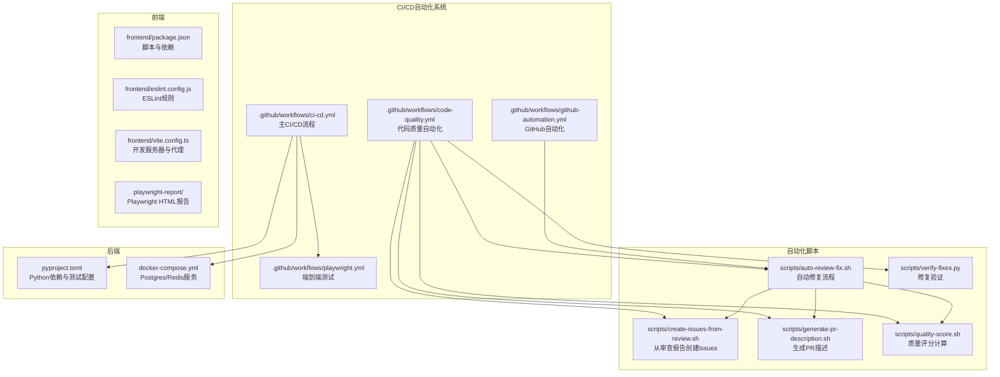
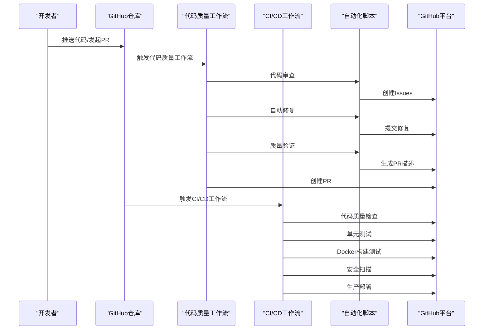
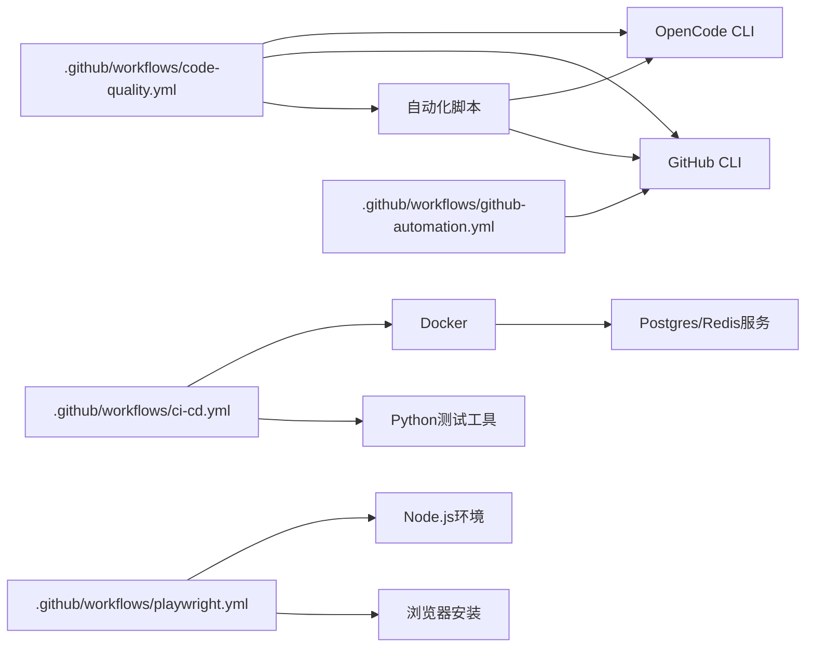
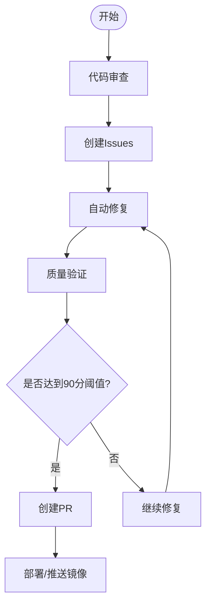

# CI/CD持续集成流水线

<cite>
**本文档引用的文件**
- [.github/workflows/code-quality.yml](file://.github/workflows/code-quality.yml)
- [.github/workflows/ci-cd.yml](file://.github/workflows/ci-cd.yml)
- [.github/workflows/github-automation.yml](file://.github/workflows/github-automation.yml)
- [.github/workflows/playwright.yml](file://.github/workflows/playwright.yml)
- [scripts/create-issues-from-review.sh](file://scripts/create-issues-from-review.sh)
- [scripts/generate-pr-description.sh](file://scripts/generate-pr-description.sh)
- [scripts/auto-review-fix.sh](file://scripts/auto-review-fix.sh)
- [scripts/quality-score.sh](file://scripts/quality-score.sh)
- [scripts/verify-fixes.py](file://scripts/verify-fixes.py)
- [docs/CODE_QUALITY_AUTOMATION.md](file://docs/CODE_QUALITY_AUTOMATION.md)
- [docs/GIT_FLOW_MIGRATION_REPORT.md](file://docs/GIT_FLOW_MIGRATION_REPORT.md)
- [docs/ISSUES_CREATED_REPORT.md](file://docs/ISSUES_CREATED_REPORT.md)
- [docker-compose.yml](file://docker-compose.yml)
- [pyproject.toml](file://pyproject.toml)
- [playwright.config.ts](file://playwright.config.ts)
- [frontend/package.json](file://frontend/package.json)
- [frontend/vite.config.ts](file://frontend/vite.config.ts)
- [frontend/eslint.config.js](file://frontend/eslint.config.js)
</cite>

## 目录
1. [简介](#简介)
2. [项目结构](#项目结构)
3. [核心组件](#核心组件)
4. [架构总览](#架构总览)
5. [详细组件分析](#详细组件分析)
6. [依赖关系分析](#依赖关系分析)
7. [性能考虑](#性能考虑)
8. [故障排除指南](#故障排除指南)
9. [结论](#结论)
10. [附录](#附录)

## 简介
本指南面向小说系统项目的CI/CD持续集成与部署实践，围绕以下目标展开：  
- 基于Applied Changes的完整CI/CD自动化系统，包括代码质量检查、问题创建、自动修复、质量验证、拉取请求自动生成的流水线  
- GitHub Actions工作流配置与执行流程，涵盖code-quality.yml、ci-cd.yml、github-automation.yml三个核心工作流  
- 代码质量检查、单元测试、集成测试、端到端测试的自动化  
- Playwright测试框架的配置与使用（测试环境、浏览器配置、报告生成）  
- 前端与后端测试策略（静态代码分析、API测试、数据库测试）  
- 自动化部署流程（构建镜像、推送仓库、服务更新）  
- 覆盖率报告、代码质量门禁、部署回滚机制  
- 流水线监控与通知配置  

**更新** 新增基于Applied Changes的完整CI/CD自动化系统，实现了从代码审查到自动修复再到PR创建的全流程自动化。

## 项目结构
项目采用前后端分离与多模块组织方式，现已集成完整的自动化CI/CD系统：  
- 后端：FastAPI应用、数据库模型与服务层、测试夹具与测试用例  
- 前端：React/Vite应用、ESLint配置、Playwright测试报告产物  
- 工作流：GitHub Actions三大核心工作流（代码质量、CI/CD、GitHub自动化）  
- 自动化脚本：审查、修复、评分、PR描述生成等辅助脚本  
- 基础设施：Docker Compose数据库与缓存服务

**图表来源**
- [.github/workflows/code-quality.yml:1-322](file://.github/workflows/code-quality.yml#L1-L322)
- [.github/workflows/ci-cd.yml:1-212](file://.github/workflows/ci-cd.yml#L1-L212)
- [.github/workflows/github-automation.yml:1-119](file://.github/workflows/github-automation.yml#L1-L119)
- [scripts/create-issues-from-review.sh:1-159](file://scripts/create-issues-from-review.sh#L1-L159)
- [scripts/generate-pr-description.sh:1-198](file://scripts/generate-pr-description.sh#L1-L198)
- [scripts/auto-review-fix.sh:1-133](file://scripts/auto-review-fix.sh#L1-L133)
- [scripts/quality-score.sh:1-79](file://scripts/quality-score.sh#L1-L79)
- [scripts/verify-fixes.py:1-154](file://scripts/verify-fixes.py#L1-L154)

**章节来源**
- [.github/workflows/code-quality.yml:1-322](file://.github/workflows/code-quality.yml#L1-L322)
- [.github/workflows/ci-cd.yml:1-212](file://.github/workflows/ci-cd.yml#L1-L212)
- [.github/workflows/github-automation.yml:1-119](file://.github/workflows/github-automation.yml#L1-L119)
- [scripts/create-issues-from-review.sh:1-159](file://scripts/create-issues-from-review.sh#L1-L159)
- [scripts/generate-pr-description.sh:1-198](file://scripts/generate-pr-description.sh#L1-L198)
- [scripts/auto-review-fix.sh:1-133](file://scripts/auto-review-fix.sh#L1-L133)
- [scripts/quality-score.sh:1-79](file://scripts/quality-score.sh#L1-L79)
- [scripts/verify-fixes.py:1-154](file://scripts/verify-fixes.py#L1-L154)

## 核心组件
- **代码质量自动化工作流**：完整的代码审查、问题创建、自动修复、质量验证、PR生成流水线，支持定时执行和手动触发  
- **主CI/CD工作流**：代码质量检查、单元测试、Docker构建测试、安全扫描、生产部署的完整流水线  
- **GitHub自动化工作流**：每日GitHub仓库统计报告、自动关闭已完成Issue、仓库状态监控  
- **自动化脚本系统**：从审查报告创建Issues、生成PR描述、自动修复、质量评分计算、修复验证等  
- **Playwright测试框架**：端到端测试配置，支持多种浏览器和报告生成  
- **Docker Compose基础设施**：Postgres数据库和Redis缓存服务的完整配置  
- **质量门禁系统**：基于综合评分的质量阈值控制，支持90分及以上的质量标准

**章节来源**
- [.github/workflows/code-quality.yml:1-322](file://.github/workflows/code-quality.yml#L1-L322)
- [.github/workflows/ci-cd.yml:1-212](file://.github/workflows/ci-cd.yml#L1-L212)
- [.github/workflows/github-automation.yml:1-119](file://.github/workflows/github-automation.yml#L1-L119)
- [scripts/create-issues-from-review.sh:1-159](file://scripts/create-issues-from-review.sh#L1-L159)
- [scripts/generate-pr-description.sh:1-198](file://scripts/generate-pr-description.sh#L1-L198)
- [scripts/auto-review-fix.sh:1-133](file://scripts/auto-review-fix.sh#L1-L133)
- [scripts/quality-score.sh:1-79](file://scripts/quality-score.sh#L1-L79)
- [playwright.config.ts:1-80](file://playwright.config.ts#L1-L80)
- [docker-compose.yml:1-113](file://docker-compose.yml#L1-L113)

## 架构总览
下图展示从代码提交到自动化修复与PR创建的完整流程：

**图表来源**
- [.github/workflows/code-quality.yml:16-322](file://.github/workflows/code-quality.yml#L16-L322)
- [.github/workflows/ci-cd.yml:18-212](file://.github/workflows/ci-cd.yml#L18-L212)
- [scripts/auto-review-fix.sh:18-133](file://scripts/auto-review-fix.sh#L18-L133)

**章节来源**
- [.github/workflows/code-quality.yml:1-322](file://.github/workflows/code-quality.yml#L1-L322)
- [.github/workflows/ci-cd.yml:1-212](file://.github/workflows/ci-cd.yml#L1-L212)
- [scripts/auto-review-fix.sh:1-133](file://scripts/auto-review-fix.sh#L1-L133)

## 详细组件分析

### 代码质量自动化工作流（code-quality.yml）
- **触发条件**：主分支推送、拉取请求、每天UTC 2:00（北京时间10:00）、手动触发  
- **核心阶段**：代码审查 → 创建Issues → 自动修复 → 质量验证 → 创建PR  
- **质量评分**：综合评分 = 代码审查(50%) + Pylint(20%) + 测试覆盖率(30%)  
- **质量阈值**：90分及以上的质量标准  
- **自动化能力**：支持高优先级问题的自动修复和PR创建

**更新** 新增完整的代码质量自动化流水线，实现了从问题发现到自动修复的全流程。

**章节来源**
- [.github/workflows/code-quality.yml:1-322](file://.github/workflows/code-quality.yml#L1-L322)

### 主CI/CD工作流（ci-cd.yml）
- **触发条件**：主分支推送、拉取请求、手动触发  
- **核心阶段**：代码质量检查 → 单元测试 → Docker构建测试 → 安全扫描 → 生产部署  
- **质量工具**：Flake8、Black、Pydocstyle代码检查  
- **测试覆盖**：PyTest单元测试，Codecov覆盖率报告  
- **安全扫描**：Dependency Scanning、CodeQL静态分析  
- **部署流程**：Docker Hub镜像构建与推送，支持生产环境部署

**更新** 新增主CI/CD工作流，提供完整的持续集成与部署能力。

**章节来源**
- [.github/workflows/ci-cd.yml:1-212](file://.github/workflows/ci-cd.yml#L1-L212)

### GitHub自动化工作流（github-automation.yml）
- **触发条件**：主分支推送、拉取请求、每天UTC 23:00（北京时间8:00）、手动触发  
- **核心功能**：GitHub仓库统计报告生成、自动关闭已完成Issue、仓库状态监控  
- **报告内容**：Issues统计、最近Commits、Pull Requests状态  
- **自动化维护**：基于commit信息自动关闭相关Issue

**更新** 新增GitHub自动化工作流，提供仓库状态监控和自动化维护能力。

**章节来源**
- [.github/workflows/github-automation.yml:1-119](file://.github/workflows/github-automation.yml#L1-L119)

### 自动化脚本系统
- **create-issues-from-review.sh**：从OpenCode审查报告解析并创建GitHub Issues  
- **generate-pr-description.sh**：AI自动生成Pull Request描述，支持OpenCode和模板两种模式  
- **auto-review-fix.sh**：完整的自动化代码审查修复流程，支持多次迭代修复  
- **quality-score.sh**：计算代码质量综合评分，支持权重配置和阈值判断  
- **verify-fixes.py**：验证高优先级问题修复，包括数据库密码硬编码、Redis连接泄漏等

**更新** 新增完整的自动化脚本系统，支撑整个CI/CD自动化的各个环节。

**章节来源**
- [scripts/create-issues-from-review.sh:1-159](file://scripts/create-issues-from-review.sh#L1-L159)
- [scripts/generate-pr-description.sh:1-198](file://scripts/generate-pr-description.sh#L1-L198)
- [scripts/auto-review-fix.sh:1-133](file://scripts/auto-review-fix.sh#L1-L133)
- [scripts/quality-score.sh:1-79](file://scripts/quality-score.sh#L1-L79)
- [scripts/verify-fixes.py:1-154](file://scripts/verify-fixes.py#L1-L154)

### Playwright测试框架配置
- **测试目录**：./e2e  
- **并行策略**：完全并行；CI中限制workers数量  
- **重试策略**：CI启用重试，本地禁用  
- **报告器**：HTML报告  
- **浏览器项目**：chromium/firefox/webkit  
- **追踪**：首次重试时开启  
- **开发服务器**：注释掉的webServer配置，可在本地自定义启动命令与URL

**章节来源**
- [playwright.config.ts:14-79](file://playwright.config.ts#L14-L79)

### 前端测试与质量策略
- **ESLint配置**：基于TypeScript推荐规则与React Hooks/React Refresh插件  
- **Vite开发服务器**：端口3000，代理到后端8000端口  
- **包脚本**：dev/build/lint/preview  
- **测试集成**：与Playwright工作流集成，支持端到端测试

**章节来源**
- [frontend/eslint.config.js:8-23](file://frontend/eslint.config.js#L8-L23)
- [frontend/vite.config.ts:12-21](file://frontend/vite.config.ts#L12-L21)
- [frontend/package.json:6-11](file://frontend/package.json#L6-L11)

### 后端测试策略
- **PyTest配置**：测试路径tests，标记unit/network/real_crawl/integration/slow  
- **Ruff配置**：行宽100、目标版本py312、选择规则E、F、I、W  
- **覆盖率配置**：支持HTML和XML报告输出  
- **测试类型**：单元测试、集成测试、网络测试、真实爬取场景、慢测试

**章节来源**
- [pyproject.toml:52-106](file://pyproject.toml#L52-L106)

### 数据库与测试环境
- **Docker Compose**：Postgres与Redis容器，暴露必要端口并挂载数据卷  
- **环境配置**：支持开发、测试、生产三种环境配置  
- **健康检查**：数据库和缓存服务的健康检查配置

**章节来源**
- [docker-compose.yml:1-113](file://docker-compose.yml#L1-L113)

### Git Flow分支策略
- **标准流程**：feature/* → develop → release/* → main  
- **CI触发**：main和develop分支触发所有CI，feature分支无CI  
- **分支管理**：v2.0.0-release分支合并到develop，建立标准Git Flow

**更新** 基于Git Flow迁移报告，建立了标准化的分支管理策略。

**章节来源**
- [docs/GIT_FLOW_MIGRATION_REPORT.md:88-112](file://docs/GIT_FLOW_MIGRATION_REPORT.md#L88-L112)

## 依赖关系分析
- **工作流依赖**：code-quality.yml依赖GitHub CLI和OpenCode CLI，ci-cd.yml依赖Docker和各种质量工具  
- **脚本依赖**：自动化脚本依赖OpenCode CLI、GitHub CLI、Python测试工具链  
- **测试依赖**：Playwright测试依赖Node.js环境和浏览器安装  
- **基础设施依赖**：Docker Compose依赖Postgres和Redis服务

**图表来源**
- [.github/workflows/code-quality.yml:31-38](file://.github/workflows/code-quality.yml#L31-L38)
- [.github/workflows/ci-cd.yml:27-37](file://.github/workflows/ci-cd.yml#L27-L37)
- [.github/workflows/github-automation.yml:28-39](file://.github/workflows/github-automation.yml#L28-L39)

**章节来源**
- [.github/workflows/code-quality.yml:1-322](file://.github/workflows/code-quality.yml#L1-L322)
- [.github/workflows/ci-cd.yml:1-212](file://.github/workflows/ci-cd.yml#L1-L212)
- [.github/workflows/github-automation.yml:1-119](file://.github/workflows/github-automation.yml#L1-L119)

## 性能考虑
- **并行策略**：CI中限制workers数量，避免资源争用；本地完全并行提升效率  
- **重试策略**：仅在CI启用重试，减少偶发失败影响  
- **缓存与复用**：利用actions/setup-node与npm ci缓存；Docker Compose复用数据卷  
- **质量门禁**：90分质量阈值确保代码质量，避免低质量代码进入主分支  
- **自动化效率**：脚本化处理重复性任务，减少人工干预

## 故障排除指南
常见问题与排查要点：  
- **代码质量工作流失败**：检查OpenCode CLI和GitHub CLI认证状态，确认质量阈值设置  
- **CI/CD工作流失败**：确认Docker环境、Python依赖、测试覆盖率配置  
- **GitHub自动化失败**：检查GitHub CLI认证，确认仓库权限设置  
- **Playwright测试失败**：检查浏览器安装、webServer配置、baseURL与代理  
- **质量门禁**：在CI中启用覆盖率与ESLint/Ruff检查，设置失败阈值

**章节来源**
- [.github/workflows/code-quality.yml:158-214](file://.github/workflows/code-quality.yml#L158-L214)
- [.github/workflows/ci-cd.yml:135-155](file://.github/workflows/ci-cd.yml#L135-L155)
- [scripts/auto-review-fix.sh:176-202](file://scripts/auto-review-fix.sh#L176-L202)

## 结论
当前项目已建立完整的基于Applied Changes的CI/CD自动化系统，实现了从代码审查到自动修复再到PR创建的全流程自动化。系统特点包括：  
- **全流程自动化**：代码质量检查、问题创建、自动修复、质量验证、PR生成的完整流水线  
- **质量门禁严格**：90分质量阈值确保代码质量  
- **多维度监控**：代码质量、测试覆盖率、安全扫描的全方位保障  
- **Git Flow标准化**：基于v2.0.0-release分支的标准化分支管理策略  
- **持续改进机制**：支持定时执行和手动触发，确保代码质量持续提升

## 附录

### 测试类型与标记说明
- **单元测试**：使用mock数据，快速验证逻辑  
- **集成测试**：需要数据库，验证服务间协作  
- **网络测试**：需要外网访问，谨慎使用  
- **真实爬取场景**：模拟真实抓取流程  
- **慢测试**：耗时较长，建议在夜间或专用分支运行

**章节来源**
- [pyproject.toml:63-77](file://pyproject.toml#L63-L77)

### 质量评分计算方法
- **综合评分** = 代码审查评分 × 50% + Pylint评分 × 20% + 测试覆盖率 × 30%  
- **质量阈值**：90分及以上  
- **评分权重**：可根据项目需求调整各部分权重

**章节来源**
- [.github/workflows/code-quality.yml:256-269](file://.github/workflows/code-quality.yml#L256-L269)
- [scripts/quality-score.sh:10-16](file://scripts/quality-score.sh#L10-L16)

### 建议的测试执行顺序（概念流程）

[本图为概念流程，不直接对应具体源码，故无"图表来源"与"章节来源"]