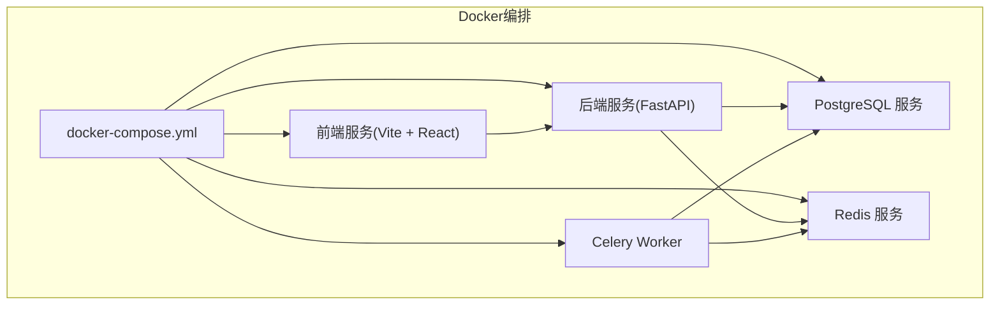
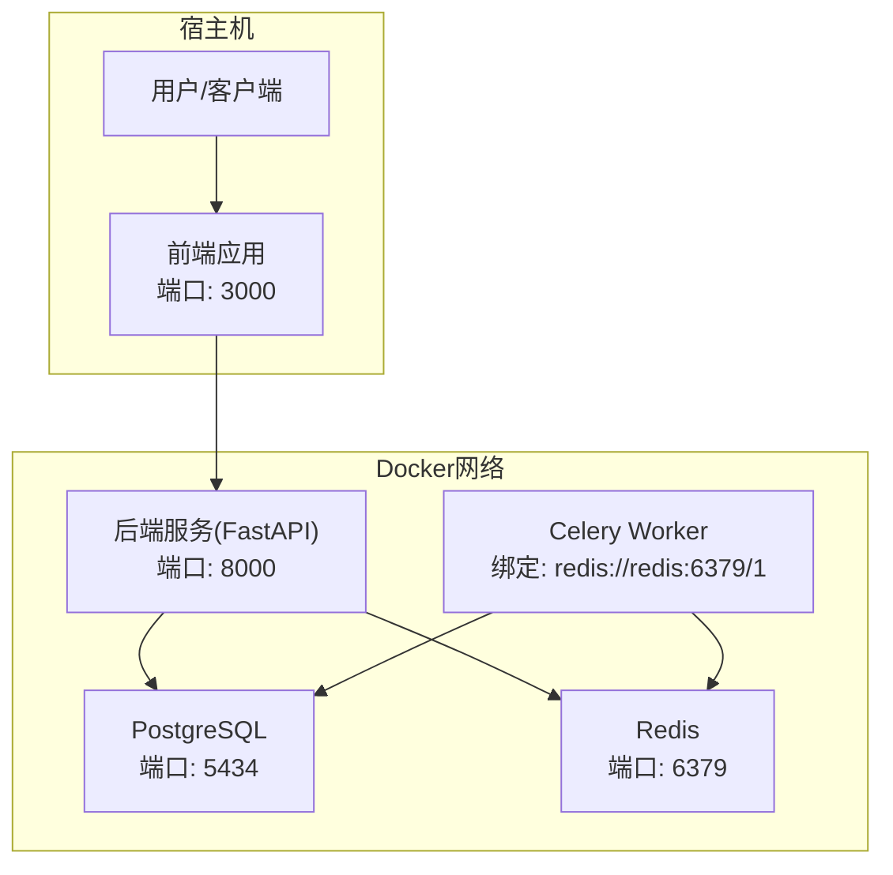
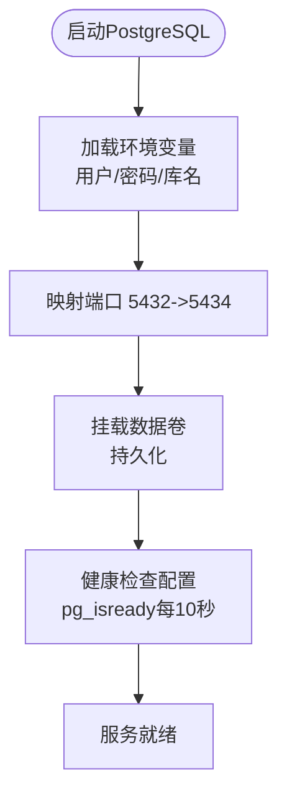
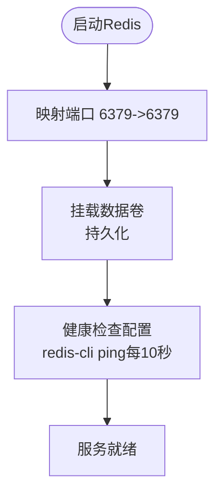
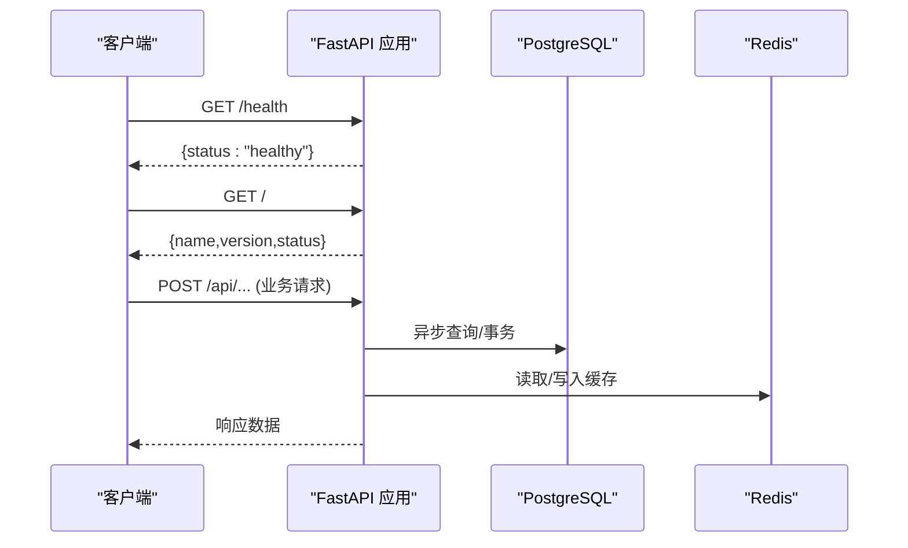
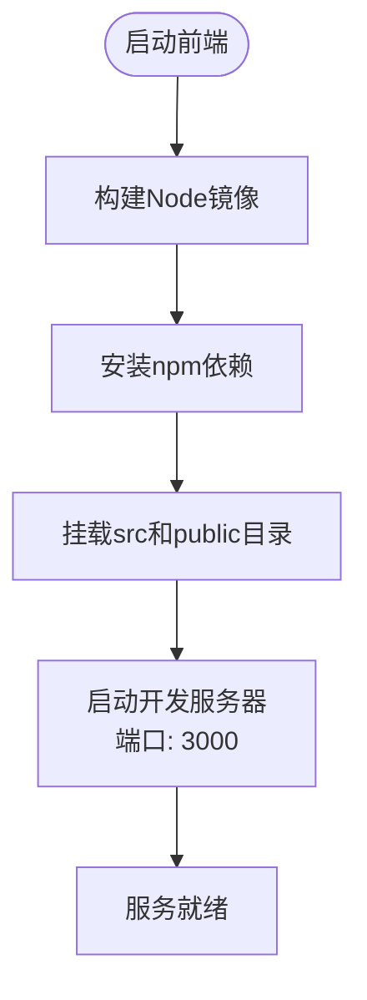
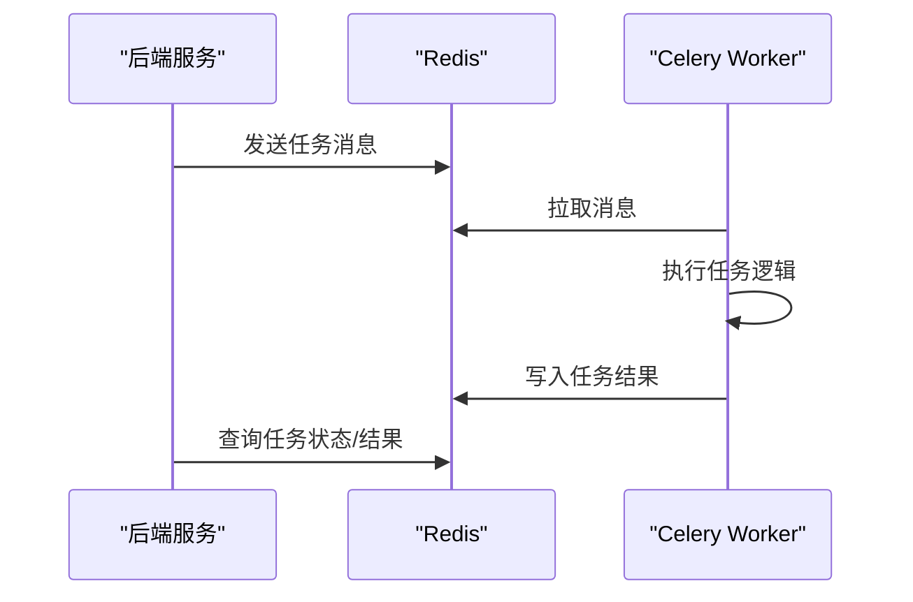
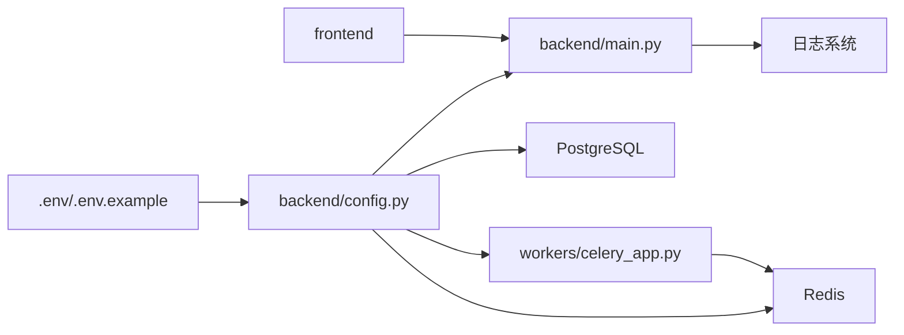

# Docker容器化部署

<cite>
**本文引用的文件**
- [docker-compose.yml](file://docker-compose.yml)
- [DOCKER_DEPLOY.md](file://DOCKER_DEPLOY.md)
- [docker-start.sh](file://docker-start.sh)
- [docker-stop.sh](file://docker-stop.sh)
- [Dockerfile.backend](file://Dockerfile.backend)
- [Dockerfile.frontend](file://Dockerfile.frontend)
- [.env](file://.env)
- [.env.example](file://.env.example)
- [backend/main.py](file://backend/main.py)
- [backend/config.py](file://backend/config.py)
- [workers/celery_app.py](file://workers/celery_app.py)
- [frontend/public/debug.html](file://frontend/public/debug.html)
- [frontend/public/test.html](file://frontend/public/test.html)
</cite>

## 更新摘要
**变更内容**
- 新增完整的Docker部署说明文档（DOCKER_DEPLOY.md），替代原有的README.md和README.en.md
- 添加浏览器缓存清除、容器通信配置、SSL连接禁用等故障排除指南
- 新增动态代理配置和调试HTML页面的使用说明
- 完善健康检查配置和环境变量说明
- 增强前端代理配置的安全性说明（避免VITE_前缀暴露）
- 新增调试页面帮助诊断前端网络连接问题

## 目录
1. [简介](#简介)
2. [项目结构](#项目结构)
3. [核心组件](#核心组件)
4. [架构总览](#架构总览)
5. [详细组件分析](#详细组件分析)
6. [自动化部署脚本](#自动化部署脚本)
7. [依赖关系分析](#依赖关系分析)
8. [性能考虑](#性能考虑)
9. [故障排除指南](#故障排除指南)
10. [调试工具](#调试工具)
11. [结论](#结论)
12. [附录](#附录)

## 简介
本指南面向希望以Docker方式部署"AI小说生成系统"的工程团队与运维人员，围绕完整的Docker Compose配置和服务编排进行深入解析。该系统现已提供从环境准备到服务启动的完整自动化部署方案，包括：

- **服务组件**：PostgreSQL数据库、Redis缓存、后端服务（FastAPI）、前端服务（Vite + React）、Celery任务队列
- **环境变量配置**：完整的LLM、数据库、Redis、应用配置
- **端口映射与数据卷挂载**：容器间通信与持久化存储
- **自动化部署脚本**：一键启动/停止服务的Shell脚本
- **健康检查配置**：各服务的健康状态监控
- **完整部署流程**：从环境准备到服务验证的全流程
- **运维操作**：日志查看、服务重启、数据库迁移等
- **生产环境最佳实践**：资源限制、重启策略、服务发现
- **故障排除指南**：浏览器缓存清除、容器通信配置、SSL连接禁用等
- **调试工具**：动态代理配置和调试HTML页面

## 项目结构
该仓库采用前后端分离与多服务协同的组织方式，Docker编排通过docker-compose.yml集中管理数据库、缓存、应用与任务队列服务；后端服务由FastAPI提供REST API，前端使用Vite + React构建，Celery负责异步任务处理。



**图表来源**
- [docker-compose.yml](file://docker-compose.yml#L1-L86)

**章节来源**
- [docker-compose.yml](file://docker-compose.yml#L1-L86)

## 核心组件
- **PostgreSQL数据库**：使用PostgreSQL 17官方镜像，提供主数据库服务，支持健康检查和数据持久化
- **Redis缓存**：使用Redis 6-alpine镜像，作为消息代理与结果后端，支撑任务队列
- **后端服务（FastAPI）**：基于Python 3.12-slim镜像，提供API入口与健康检查端点，支持热重载开发
- **前端服务（Vite + React）**：基于Node 20-alpine镜像，提供开发服务器与热模块替换
- **Celery任务队列**：基于Redis实现任务分发与结果存储，具备任务超时与并发控制

**章节来源**
- [docker-compose.yml](file://docker-compose.yml#L2-L86)
- [Dockerfile.backend](file://Dockerfile.backend#L1-L29)
- [Dockerfile.frontend](file://Dockerfile.frontend#L1-L22)
- [backend/main.py](file://backend/main.py#L15-L54)
- [workers/celery_app.py](file://workers/celery_app.py#L6-L26)

## 架构总览
下图展示了容器化部署下的系统交互关系：后端服务通过数据库与缓存提供API能力，前端服务与后端交互，Celery Worker从Redis拉取任务并写回结果，所有服务通过Compose统一编排。



**图表来源**
- [docker-compose.yml](file://docker-compose.yml#L32-L82)
- [backend/config.py](file://backend/config.py#L11-L40)
- [workers/celery_app.py](file://workers/celery_app.py#L6-L26)

## 详细组件分析

### PostgreSQL 数据库服务
- **镜像与容器名**：使用官方PostgreSQL 17镜像，容器名为`novel_postgres`
- **环境变量**：设置数据库用户、密码与默认库名
- **端口映射**：将容器内5432映射到宿主机5434，避免与本地服务冲突
- **数据卷**：挂载`postgres_data`命名卷以持久化数据目录
- **健康检查**：使用`pg_isready`命令每10秒检查一次，超时5秒，最多重试5次
- **连接配置**：后端通过异步驱动连接，Alembic使用同步驱动



**图表来源**
- [docker-compose.yml](file://docker-compose.yml#L2-L17)
- [backend/config.py](file://backend/config.py#L11-L27)

**章节来源**
- [docker-compose.yml](file://docker-compose.yml#L2-L17)
- [backend/config.py](file://backend/config.py#L11-L27)

### Redis 缓存服务
- **镜像与容器名**：使用官方Redis 6-alpine镜像，容器名为`novel_redis`
- **端口映射**：将容器内6379映射到宿主机6379
- **数据卷**：挂载`redis_data`命名卷以持久化数据
- **健康检查**：使用`redis-cli ping`命令每10秒检查一次，超时3秒，最多重试5次
- **用途**：作为Celery消息代理与结果后端，区分不同数据库索引



**图表来源**
- [docker-compose.yml](file://docker-compose.yml#L19-L31)
- [backend/config.py](file://backend/config.py#L28-L33)

**章节来源**
- [docker-compose.yml](file://docker-compose.yml#L19-L31)
- [backend/config.py](file://backend/config.py#L28-L33)

### 后端服务（FastAPI）
- **镜像构建**：基于Python 3.12-slim，安装系统依赖和Poetry
- **热重载**：支持代码修改自动重启，便于开发调试
- **挂载目录**：挂载后端、核心、代理、LLM、工作者等模块
- **环境变量**：读取配置类中的应用参数，如主机、端口、调试模式等
- **健康检查**：依赖数据库和Redis健康后启动
- **启动命令**：使用Uvicorn运行FastAPI应用



**图表来源**
- [docker-compose.yml](file://docker-compose.yml#L32-L66)
- [backend/main.py](file://backend/main.py#L15-L54)
- [Dockerfile.backend](file://Dockerfile.backend#L1-L29)

**章节来源**
- [docker-compose.yml](file://docker-compose.yml#L32-L66)
- [backend/main.py](file://backend/main.py#L15-L54)
- [Dockerfile.backend](file://Dockerfile.backend#L1-L29)

### 前端服务（Vite + React）
- **镜像构建**：基于Node 20-alpine，安装npm依赖
- **热重载**：支持HMR（热模块替换），提升开发体验
- **挂载目录**：挂载前端src和public目录
- **环境变量**：配置API基础URL指向后端服务
- **启动命令**：使用npm run dev启动开发服务器



**图表来源**
- [docker-compose.yml](file://docker-compose.yml#L68-L82)
- [Dockerfile.frontend](file://Dockerfile.frontend#L1-L22)

**章节来源**
- [docker-compose.yml](file://docker-compose.yml#L68-L82)
- [Dockerfile.frontend](file://Dockerfile.frontend#L1-L22)

### Celery 任务队列
- **应用配置**：基于Redis作为broker与result backend，启用UTC与JSON序列化
- **任务超时**：设置硬性超时600秒（10分钟）和软性超时540秒
- **并发与预取**：限制并发为2，worker_prefetch_multiplier为1，避免长任务阻塞
- **自动发现**：自动扫描workers模块，确保任务注册生效



**图表来源**
- [workers/celery_app.py](file://workers/celery_app.py#L6-L26)
- [backend/config.py](file://backend/config.py#L31-L33)

**章节来源**
- [workers/celery_app.py](file://workers/celery_app.py#L6-L26)
- [backend/config.py](file://backend/config.py#L31-L33)

## 自动化部署脚本

### 启动脚本（docker-start.sh）
提供一键启动所有服务的功能，包含完整的部署流程：

- **停止现有容器**：自动清理之前的容器实例
- **构建并启动**：使用`--build`参数重新构建镜像
- **等待服务启动**：睡眠10秒确保服务完全启动
- **检查服务状态**：显示所有服务的运行状态
- **健康检查验证**：通过curl验证后端健康端点
- **实时日志监控**：自动跟踪所有服务的日志输出

**章节来源**
- [docker-start.sh](file://docker-start.sh#L1-L33)

### 停止脚本（docker-stop.sh）
提供一键停止所有服务的功能：

- **停止所有服务**：优雅关闭所有容器
- **可选清理**：询问用户是否清理未使用的Docker资源
- **资源清理**：支持系统级和卷级清理

**章节来源**
- [docker-stop.sh](file://docker-stop.sh#L1-L20)

## 依赖关系分析
- **配置统一**：后端与Celery均从同一配置类读取环境变量，确保数据库、Redis与Celery连接一致
- **容器间通信**：使用服务名进行容器间通信，避免硬编码IP地址
- **数据持久化**：PostgreSQL和Redis使用命名卷进行数据持久化
- **开发体验**：后端和前端支持热重载，提升开发效率



**图表来源**
- [.env](file://.env#L1-L22)
- [.env.example](file://.env.example#L1-L21)
- [backend/config.py](file://backend/config.py#L50-L59)
- [docker-compose.yml](file://docker-compose.yml#L32-L82)

**章节来源**
- [.env](file://.env#L1-L22)
- [.env.example](file://.env.example#L1-L21)
- [backend/config.py](file://backend/config.py#L50-L59)
- [docker-compose.yml](file://docker-compose.yml#L32-L82)

## 性能考虑
- **数据库连接池**：后端异步引擎配置了连接池大小与溢出，建议根据并发与实例规格调整
- **Celery并发与预取**：针对长任务场景，降低预取与并发可减少阻塞风险
- **容器资源**：建议为关键服务设置CPU和内存限制，避免资源争用
- **健康检查**：合理的健康检查间隔和超时设置，平衡响应速度和资源消耗
- **日志轮转**：文件日志采用滚动策略，避免磁盘膨胀

**章节来源**
- [workers/celery_app.py](file://workers/celery_app.py#L12-L23)
- [docker-compose.yml](file://docker-compose.yml#L13-L30)

## 故障排除指南

### 基础连接问题
- **数据库无法连接**
  - 检查PostgreSQL容器是否运行且端口映射正确（5434:5432）
  - 确认数据库URL与端口、凭据一致
  - 如需迁移，确认Alembic同步URL与异步URL一致
  - **新增**：数据库连接已禁用SSL，使用`connect_args={"ssl": False}`
- **Redis无法连接**
  - 检查Redis容器状态与端口映射
  - 确认Celery broker与result backend指向同一Redis实例
- **后端服务启动失败**
  - 检查依赖服务（PostgreSQL、Redis）是否健康
  - 查看后端日志获取具体错误信息

### 前端网络连接问题
- **问题现象**：浏览器控制台显示 `net::ERR_NAME_NOT_RESOLVED` 错误
- **解决方案**：
  1. 检查前端容器环境变量：`docker-compose logs frontend | grep "API_PROXY_TARGET"`
  2. 重启前端服务：`docker-compose restart frontend`
  3. **新增**：清除浏览器缓存（重要！）- 按 `F12` 打开开发者工具 → 右键刷新按钮 → 选择 "清空缓存并硬性重新加载"

### 容器通信配置
- **容器间通信**：使用服务名（如 `postgres`、`redis`）进行通信
- **端口使用**：容器间通信使用容器内部端口（5432、6379）
- **网络隔离**：所有服务在同一Docker网络中，避免跨网络通信问题

### 健康检查失败
- **访问后端健康端点**：`curl http://localhost:8000/health`
- **查看服务状态**：`docker-compose ps`
- **检查依赖服务**：确保PostgreSQL和Redis健康检查通过

### 日志和调试
- **查看所有服务日志**：`docker-compose logs -f`
- **查看特定服务日志**：`docker-compose logs -f [service_name]`
- **进入容器Shell**：`docker exec -it [container_name] bash/sh`

### 环境变量配置
- **LLM配置**：确保DASHSCOPE_API_KEY和模型名称正确
- **数据库配置**：确认DATABASE_URL和DATABASE_URL_SYNC格式正确
- **Redis配置**：检查REDIS_URL、CELERY_BROKER_URL、CELERY_RESULT_BACKEND
- **前端代理配置**：使用 `API_PROXY_TARGET` 而非 `VITE_API_PROXY_TARGET` 避免客户端代码冲突

### 端口冲突
- **修改端口映射**：在docker-compose.yml中调整端口映射
- **避免冲突**：确保宿主机端口未被其他服务占用

**章节来源**
- [docker-compose.yml](file://docker-compose.yml#L9-L17)
- [docker-compose.yml](file://docker-compose.yml#L22-L30)
- [backend/main.py](file://backend/main.py#L46-L54)
- [DOCKER_DEPLOY.md](file://DOCKER_DEPLOY.md#L147-L217)

## 调试工具

### 动态代理配置调试
- **调试页面**：访问 `http://localhost:3000/debug.html`
- **功能**：检查apiClient的baseURL、timeout、headers等配置
- **使用方法**：打开页面后自动执行配置检查，或点击"检查配置"按钮

### Axios请求测试
- **测试页面**：访问 `http://localhost:3000/test.html`
- **功能**：测试向 `/api/v1/novels/?page=1&page_size=1` 发起请求
- **使用方法**：点击"测试请求"按钮查看响应结果或错误信息

### 前端代理配置说明
- **环境变量**：使用 `API_PROXY_TARGET=http://backend:8000` 而非 `VITE_API_PROXY_TARGET`
- **安全考虑**：以 `VITE_` 开头的环境变量会被Vite暴露给客户端代码，可能导致敏感信息泄露
- **容器通信**：前端通过代理将请求转发到后端服务，避免直接使用localhost

**章节来源**
- [DOCKER_DEPLOY.md](file://DOCKER_DEPLOY.md#L264-L269)
- [frontend/public/debug.html](file://frontend/public/debug.html#L1-L29)
- [frontend/public/test.html](file://frontend/public/test.html#L1-L25)

## 结论
通过完整的Docker部署方案，包括自动化脚本、健康检查配置、详细的部署文档和调试工具，能够快速搭建稳定可靠的AI小说生成系统。新版本的部署指南提供了从环境准备到服务验证的完整流程，大大降低了部署门槛。新增的浏览器缓存清除、容器通信配置、SSL连接禁用等故障排除指南，以及动态代理配置和调试HTML页面的使用说明，进一步提升了系统的可维护性和用户体验。建议在生产环境中进一步引入资源限制、健康探针、服务网格与密钥管理等高级特性，以提升系统的稳定性、安全性和可维护性。

## 附录

### 完整部署步骤

#### 1. 环境准备
- 安装Docker和Docker Compose
- 复制`.env.example`为`.env`并配置LLM API密钥
- 确保宿主机端口未被占用（5434、6379、8000、3000）

#### 2. 启动服务
```bash
# 方法一：使用自动化脚本
./docker-start.sh

# 方法二：手动启动
docker-compose up -d --build
```

#### 3. 验证部署
```bash
# 检查服务状态
docker-compose ps

# 验证后端健康
curl http://localhost:8000/health

# 查看日志
docker-compose logs -f
```

#### 4. 数据库初始化
```bash
# 执行数据库迁移
docker-compose exec backend alembic upgrade head
```

**章节来源**
- [DOCKER_DEPLOY.md](file://DOCKER_DEPLOY.md#L14-L56)
- [docker-start.sh](file://docker-start.sh#L1-L33)

### 环境变量配置详解

#### LLM配置
- `DASHSCOPE_API_KEY`：通义千问API密钥
- `DASHSCOPE_MODEL`：LLM模型名称（如qwen3-coder-plus）
- `DASHSCOPE_BASE_URL`：API基础URL（Coding Plan Pro兼容）

#### 数据库配置
- `DATABASE_URL`：异步数据库连接URL（用于应用）
- `DATABASE_URL_SYNC`：同步数据库连接URL（用于Alembic迁移）

#### 缓存配置
- `REDIS_URL`：Redis连接URL（用于应用）
- `CELERY_BROKER_URL`：Celery消息代理URL
- `CELERY_RESULT_BACKEND`：Celery结果后端URL

#### 应用配置
- `APP_ENV`：应用环境（development/production）
- `APP_DEBUG`：调试模式开关
- `APP_HOST`：监听地址
- `APP_PORT`：监听端口

#### 前端代理配置
- `API_PROXY_TARGET`：前端代理目标地址（使用http://backend:8000）
- **重要**：不要使用 `VITE_API_PROXY_TARGET`，避免暴露给客户端

**章节来源**
- [.env](file://.env#L1-L22)
- [.env.example](file://.env.example#L1-L21)
- [backend/config.py](file://backend/config.py#L5-L59)
- [docker-compose.yml](file://docker-compose.yml#L73-L75)

### 运维操作清单

#### 健康检查
- **后端服务**：`curl http://localhost:8000/health`
- **数据库服务**：检查PostgreSQL健康检查状态
- **缓存服务**：检查Redis健康检查状态

#### 日志管理
```bash
# 查看所有服务日志
docker-compose logs -f

# 查看特定服务日志
docker-compose logs -f backend

# 实时监控日志
docker-compose logs -f --tail=100
```

#### 服务重启
```bash
# 重启特定服务
docker-compose restart backend
docker-compose restart frontend

# 重新构建并重启
docker-compose up -d --build backend
```

#### 数据库管理
```bash
# 进入数据库容器
docker-compose exec postgres psql -U novel_user -d novel_system

# 执行数据库迁移
docker-compose exec backend alembic upgrade head
```

**章节来源**
- [DOCKER_DEPLOY.md](file://DOCKER_DEPLOY.md#L102-L139)
- [docker-compose.yml](file://docker-compose.yml#L57-L66)

### 生产环境最佳实践

#### 资源限制
```yaml
backend:
  deploy:
    resources:
      limits:
        cpus: '0.5'
        memory: 512M
      reservations:
        cpus: '0.25'
        memory: 256M
```

#### 重启策略
```yaml
backend:
  restart: unless-stopped
  healthcheck:
    test: ["CMD", "curl", "-f", "http://localhost:8000/health"]
    interval: 30s
    timeout: 10s
    retries: 3
```

#### 网络配置
- 使用自定义网络隔离服务
- 避免使用`host`网络模式
- 配置适当的DNS解析

#### 安全配置
- 使用环境变量文件而非明文配置
- 配置只读文件系统
- 使用非root用户运行容器
- **新增**：避免使用VITE_前缀的环境变量，防止敏感信息泄露

#### 监控和日志
- 配置集中式日志收集
- 设置适当的日志轮转策略
- 监控容器资源使用情况

**章节来源**
- [docker-compose.yml](file://docker-compose.yml#L1-L86)
- [DOCKER_DEPLOY.md](file://DOCKER_DEPLOY.md#L102-L139)