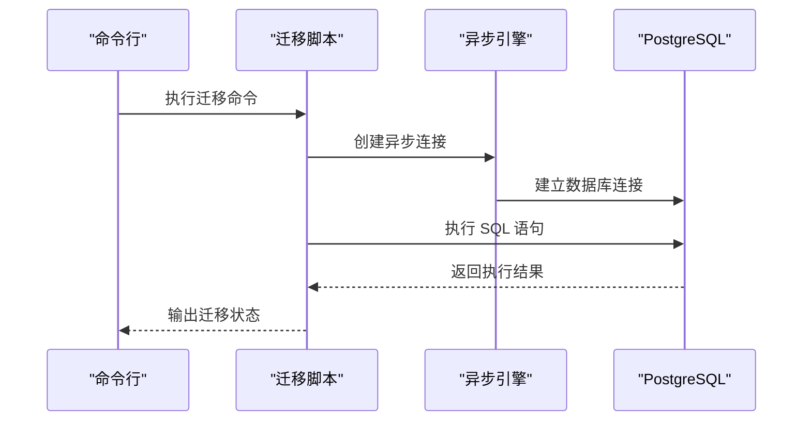
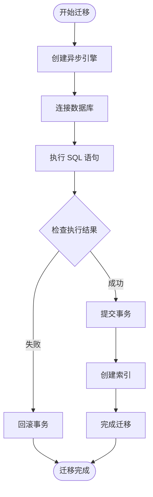
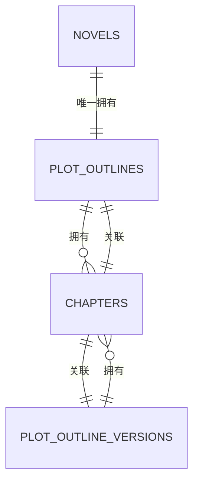
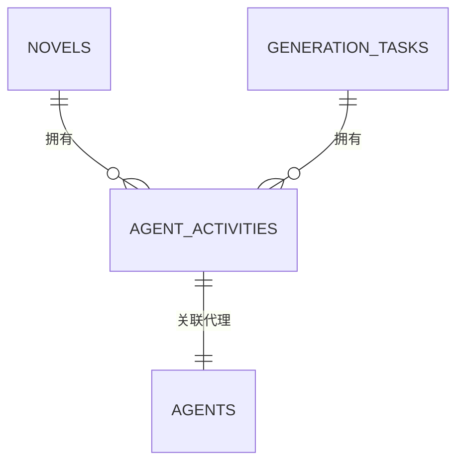
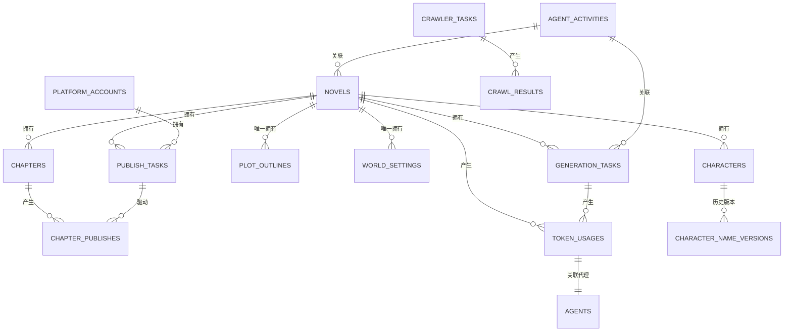
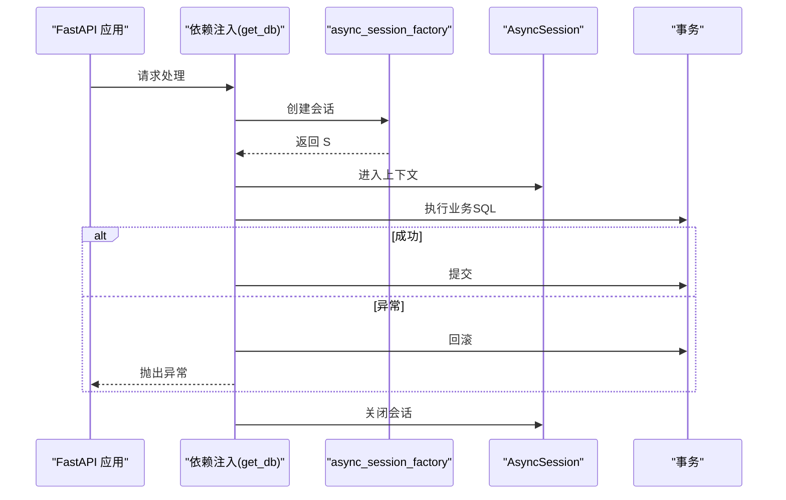
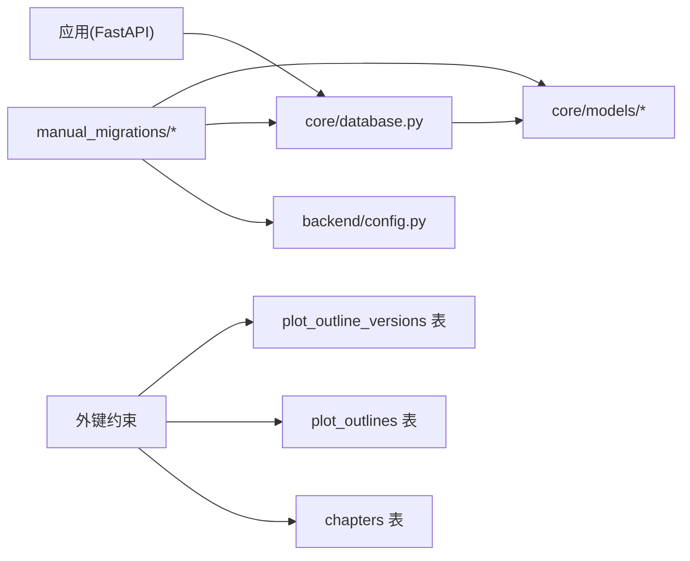

# 数据库管理与迁移

<cite>
**本文引用的文件**
- [scripts/manual_migrations/add_outline_chapter_foreign_keys.py](file://scripts/manual_migrations/add_outline_chapter_foreign_keys.py)
- [migrations/create_agent_activities_table.py](file://migrations/create_agent_activities_table.py)
- [migrations/add_chapter_config_and_main_plot_detailed.py](file://migrations/add_chapter_config_and_main_plot_detailed.py)
- [migrations/add_memory_query_indexes.py](file://migrations/add_memory_query_indexes.py)
- [core/models/plot_outline.py](file://core/models/plot_outline.py)
- [core/models/chapter.py](file://core/models/chapter.py)
- [core/models/plot_outline_version.py](file://core/models/plot_outline_version.py)
- [alembic.ini](file://alembic.ini)
- [alembic/env.py](file://alembic/env.py)
- [backend/config.py](file://backend/config.py)
- [core/database.py](file://core/database.py)
- [backend/main.py](file://backend/main.py)
</cite>

## 更新摘要
**变更内容**
- 从 Alembic 迁移到手动迁移脚本系统，提升迁移灵活性和可控性
- 新增外键约束支持章节与大纲的关联关系，建立 plot_outline_id 和 outline_version_id 外键
- 新增 agent_activities 表迁移脚本，支持代理活动追踪和审计
- 新增章节配置和主线剧情详细字段迁移
- 新增记忆系统查询复合索引迁移脚本
- 完善数据库 Schema 设计，支持章节与大纲的强关联关系

## 目录
1. [简介](#简介)
2. [项目结构](#项目结构)
3. [核心组件](#核心组件)
4. [架构总览](#架构总览)
5. [详细组件分析](#详细组件分析)
6. [依赖关系分析](#依赖关系分析)
7. [性能考虑](#性能考虑)
8. [故障排查指南](#故障排查指南)
9. [结论](#结论)
10. [附录](#附录)

## 简介
本指南面向数据库管理员与后端工程师，系统讲解本项目的数据库管理与迁移实践，涵盖以下主题：
- **全新**：手动迁移脚本系统替代 Alembic，提供更灵活的数据库演进控制
- **新增**：外键约束支持章节与大纲的强关联关系，确保数据一致性
- 数据库 Schema 设计原则：表结构、索引、外键约束、数据类型选择
- 备份与恢复策略：全量与增量备份、灾难恢复计划
- 性能优化：查询优化、连接池配置、缓存策略
- 安全配置：访问控制、加密传输、权限管理
- 生产运维流程：上线前检查、变更审批、回滚预案
- 不同环境的配置差异与最佳实践

## 项目结构
项目采用"手动迁移脚本 + 异步 SQLAlchemy"的技术栈，数据库层通过异步引擎提供连接，迁移工具以独立脚本形式执行，提供更好的可控性和可追溯性。

```mermaid
graph TB
subgraph "应用层"
MAIN["backend/main.py"]
CONFIG["backend/config.py"]
DB["core/database.py"]
MODELS["core/models/*"]
end
subgraph "迁移层"
MANUAL["scripts/manual_migrations/*"]
MIGRATIONS["migrations/*"]
ALEMBIC_INI["alembic.ini"]
ENV_PY["alembic/env.py"]
END
subgraph "运行时服务"
DOCKER["docker-compose.yml"]
DOTENV[".env"]
end
MAIN --> CONFIG
MAIN --> DB
DB --> MODELS
CONFIG --> DB
MANUAL --> DB
MIGRATIONS --> DB
ALEMBIC_INI --> ENV_PY
DOCKER --> DOTENV
```

**图表来源**
- [backend/main.py:1-159](file://backend/main.py#L1-L159)
- [backend/config.py:1-514](file://backend/config.py#L1-L514)
- [core/database.py:1-38](file://core/database.py#L1-L38)
- [scripts/manual_migrations/add_outline_chapter_foreign_keys.py:1-132](file://scripts/manual_migrations/add_outline_chapter_foreign_keys.py#L1-L132)
- [migrations/create_agent_activities_table.py:1-235](file://migrations/create_agent_activities_table.py#L1-L235)
- [alembic.ini:1-150](file://alembic.ini#L1-L150)
- [alembic/env.py:1-72](file://alembic/env.py#L1-L72)

## 核心组件
- **手动迁移脚本系统**：独立的 Python 脚本，提供迁移、回滚、状态检查功能
- 异步数据库引擎与会话工厂：提供异步连接、连接池参数与依赖注入式会话生命周期管理
- 配置中心：集中管理数据库连接串（异步与同步）、Redis、Celery、应用环境等
- **新增**：章节与大纲外键关联：通过 plot_outline_id 和 outline_version_id 建立强关联
- **新增**：代理活动追踪：agent_activities 表记录详细的代理行为和性能指标

## 架构总览
下图展示应用启动到数据库迁移的关键交互路径，以及手动迁移脚本如何作用于目标数据库。



**图表来源**
- [scripts/manual_migrations/add_outline_chapter_foreign_keys.py:25-132](file://scripts/manual_migrations/add_outline_chapter_foreign_keys.py#L25-L132)
- [migrations/create_agent_activities_table.py:21-235](file://migrations/create_agent_activities_table.py#L21-L235)
- [core/database.py:1-38](file://core/database.py#L1-L38)

## 详细组件分析

### 组件A：手动迁移脚本系统
**更新** 项目已完全从 Alembic 迁移到手动迁移脚本系统，提供更灵活和可控的数据库演进方式。

- **迁移脚本结构**：每个迁移对应一个独立的 Python 脚本，包含 migrate、rollback、check 三个主要函数
- **异步执行**：使用 SQLAlchemy 异步引擎，支持高效的数据库操作
- **错误处理**：完善的异常捕获和回滚机制，确保迁移过程的可靠性
- **状态检查**：提供迁移状态检查功能，便于运维管理
- **回滚支持**：每个迁移脚本都包含回滚功能，支持安全的数据库变更



**图表来源**
- [scripts/manual_migrations/add_outline_chapter_foreign_keys.py:25-132](file://scripts/manual_migrations/add_outline_chapter_foreign_keys.py#L25-L132)
- [migrations/create_agent_activities_table.py:21-235](file://migrations/create_agent_activities_table.py#L21-L235)

**章节来源**
- [scripts/manual_migrations/add_outline_chapter_foreign_keys.py:1-132](file://scripts/manual_migrations/add_outline_chapter_foreign_keys.py#L1-L132)
- [migrations/create_agent_activities_table.py:1-235](file://migrations/create_agent_activities_table.py#L1-L235)
- [migrations/add_chapter_config_and_main_plot_detailed.py:1-144](file://migrations/add_chapter_config_and_main_plot_detailed.py#L1-L144)
- [migrations/add_memory_query_indexes.py:1-202](file://migrations/add_memory_query_indexes.py#L1-L202)

### 组件B：外键约束支持章节与大纲关联关系
**新增** 项目新增了章节与大纲的强关联关系，通过外键约束确保数据一致性。

- **外键字段**：在 chapters 表添加 plot_outline_id 和 outline_version_id 外键字段
- **约束策略**：使用 ON DELETE SET NULL 策略，确保删除父记录时子记录保持完整
- **索引优化**：为外键字段创建索引，提升查询性能
- **数据关联**：支持章节与大纲版本的历史追踪和关联查询



**图表来源**
- [core/models/plot_outline.py:13-134](file://core/models/plot_outline.py#L13-L134)
- [core/models/chapter.py:22-79](file://core/models/chapter.py#L22-L79)
- [core/models/plot_outline_version.py:13-37](file://core/models/plot_outline_version.py#L13-L37)

**章节来源**
- [scripts/manual_migrations/add_outline_chapter_foreign_keys.py:35-104](file://scripts/manual_migrations/add_outline_chapter_foreign_keys.py#L35-L104)
- [core/models/plot_outline.py:84-97](file://core/models/plot_outline.py#L84-L97)
- [core/models/chapter.py:47-56](file://core/models/chapter.py#L47-L56)

### 组件C：代理活动追踪表
**新增** agent_activities 表用于记录每个 Agent 的详细活动，提供完整的审计和监控能力。

- **表结构设计**：包含小说、任务、代理名称、活动类型、状态等完整字段
- **索引优化**：为常用查询字段创建复合索引，提升查询性能
- **成本追踪**：记录 Token 使用量和成本信息，支持费用分析
- **状态管理**：支持活动状态跟踪和错误信息记录



**图表来源**
- [migrations/create_agent_activities_table.py:30-54](file://migrations/create_agent_activities_table.py#L30-L54)

**章节来源**
- [migrations/create_agent_activities_table.py:1-235](file://migrations/create_agent_activities_table.py#L1-L235)

### 组件D：数据库 Schema 设计与模型关系
- **表结构设计**：围绕"小说-章节-角色-大纲-发布"主线，采用 UUID 主键、JSONB/数组字段存储半结构化数据
- **外键约束**：章节与大纲的强关联通过外键维护，删除策略采用 SET NULL 保证数据完整性
- **数据类型选择**：数值成本使用高精度小数；时间戳使用带时区类型；枚举类型统一状态管理
- **关系映射**：模型间通过 SQLAlchemy relationship 建立反向关联，便于查询与级联删除



**图表来源**
- [core/models/plot_outline.py:13-134](file://core/models/plot_outline.py#L13-L134)
- [core/models/chapter.py:22-79](file://core/models/chapter.py#L22-L79)
- [core/models/plot_outline_version.py:13-37](file://core/models/plot_outline_version.py#L13-L37)

**章节来源**
- [core/models/plot_outline.py:1-134](file://core/models/plot_outline.py#L1-L134)
- [core/models/chapter.py:1-79](file://core/models/chapter.py#L1-L79)
- [core/models/plot_outline_version.py:1-37](file://core/models/plot_outline_version.py#L1-L37)

### 组件E：数据库连接与会话管理
- 异步引擎：基于 asyncpg 驱动，启用调试日志开关，连接池大小与溢出容量可调
- 会话工厂：AsyncSession + 自动过期关闭，提供依赖注入式 get_db 生成器
- 生命周期：自动提交与回滚，异常时回滚并重新抛出，确保事务一致性



**图表来源**
- [core/database.py:28-38](file://core/database.py#L28-L38)

**章节来源**
- [core/database.py:1-38](file://core/database.py#L1-L38)

### 组件F：配置与环境差异
- 配置来源：优先 .env 文件，支持异步与同步数据库 URL 动态拼装
- 开发环境：本地 Docker Compose 启动 PostgreSQL 与 Redis，端口映射与持久化卷
- 环境变量：区分 APP_ENV、APP_DEBUG、数据库凭据、Redis/Celery 地址

**章节来源**
- [backend/config.py:1-514](file://backend/config.py#L1-L514)
- [.env:1-22](file://.env#L1-L22)
- [docker-compose.yml:1-25](file://docker-compose.yml#L1-L25)

## 依赖关系分析
- 迁移脚本依赖配置中心提供的 DATABASE_URL，确保与应用使用一致的数据库凭据
- 模型注册在迁移环境中导入，使迁移工具能扫描到所有表结构变化
- 应用层通过异步引擎与会话工厂与数据库交互，与迁移工具解耦
- **新增**：外键关联依赖正确的表结构和索引配置



**图表来源**
- [scripts/manual_migrations/add_outline_chapter_foreign_keys.py:22-28](file://scripts/manual_migrations/add_outline_chapter_foreign_keys.py#L22-28)
- [backend/config.py:137-145](file://backend/config.py#L137-L145)
- [core/database.py:1-38](file://core/database.py#L1-L38)
- [core/models/chapter.py:47-56](file://core/models/chapter.py#L47-L56)

**章节来源**
- [scripts/manual_migrations/add_outline_chapter_foreign_keys.py:1-132](file://scripts/manual_migrations/add_outline_chapter_foreign_keys.py#L1-L132)
- [backend/config.py:1-514](file://backend/config.py#L1-L514)
- [core/database.py:1-38](file://core/database.py#L1-L38)
- [core/models/chapter.py:1-79](file://core/models/chapter.py#L1-L79)

## 性能考虑
- 连接池配置
  - 连接池大小与溢出：根据并发请求与工作负载调整，避免连接争用与资源耗尽
  - 异步驱动：使用 asyncpg 降低网络与调度开销
- 查询优化
  - 枚举与索引：对高频过滤字段（如 publish_tasks.status、crawler_tasks.platform）建立复合索引
  - JSONB 查询：合理使用 GIN/BTree 索引，避免全表扫描
  - **新增**：外键字段索引优化，提升章节与大纲关联查询性能
  - **新增**：代理活动表复合索引，支持按小说、任务、时间等多维查询
- 缓存策略
  - 结合 Redis 缓存热点数据与中间结果，减少数据库压力
- 日志与监控
  - 开启 APP_DEBUG 时建议控制 SQL 输出级别，避免生产环境日志风暴
- **新增**：迁移性能优化
  - 手动迁移脚本支持批量操作，减少迁移执行时间
  - 索引创建采用异步方式，避免阻塞数据库操作

**章节来源**
- [core/database.py:13-25](file://core/database.py#L13-L25)
- [scripts/manual_migrations/add_outline_chapter_foreign_keys.py:108-125](file://scripts/manual_migrations/add_outline_chapter_foreign_keys.py#L108-L125)
- [migrations/create_agent_activities_table.py:62-120](file://migrations/create_agent_activities_table.py#L62-L120)
- [backend/config.py:65-132](file://backend/config.py#L65-L132)

## 故障排查指南
- 迁移失败
  - 确认 DATABASE_URL 与数据库实例连通性
  - 检查迁移脚本的 SQL 语法和表结构依赖关系
  - **新增**：验证外键约束依赖的表和字段是否存在
  - **新增**：检查索引创建权限和磁盘空间
- 连接问题
  - 核对 .env 与 docker-compose 中的数据库端口与凭据
  - 确保容器数据卷已挂载，避免重启后数据丢失
- 事务异常
  - 迁移脚本在异常时自动回滚，检查业务层是否正确捕获与处理异常
- **新增**：外键约束问题
  - 检查父表是否存在且数据完整
  - 验证外键字段的数据类型和约束条件
  - 确认删除策略符合业务需求

**章节来源**
- [scripts/manual_migrations/add_outline_chapter_foreign_keys.py:57-88](file://scripts/manual_migrations/add_outline_chapter_foreign_keys.py#L57-88)
- [migrations/create_agent_activities_table.py:147-162](file://migrations/create_agent_activities_table.py#L147-162)
- [.env:6-8](file://.env#L6-L8)
- [docker-compose.yml:5-12](file://docker-compose.yml#L5-L12)
- [core/database.py:28-38](file://core/database.py#L28-L38)

## 结论
本项目已成功从 Alembic 迁移到手动迁移脚本系统，提供了更灵活和可控的数据库演进方式。**最新更新**包括外键约束支持章节与大纲的强关联关系，新增 agent_activities 表提供完整的代理活动追踪能力。**新增**的手动迁移脚本系统支持迁移、回滚、状态检查等功能，确保数据库变更的安全性和可追溯性。建议在生产环境中强化索引策略、引入缓存与监控，并完善备份与回滚预案，确保系统稳定与可维护性。

## 附录

### A. 手动迁移脚本使用指南
**更新** 项目已完全采用手动迁移脚本系统，替代原有的 Alembic 方式。

- **执行迁移**：`python -m migrations.script_name`
- **回滚迁移**：`python -m migrations.script_name --action rollback`
- **检查状态**：`python -m migrations.script_name --action check`
- **迁移类型**：包括外键约束、表结构变更、索引优化等

**章节来源**
- [scripts/manual_migrations/add_outline_chapter_foreign_keys.py:205-235](file://scripts/manual_migrations/add_outline_chapter_foreign_keys.py#L205-L235)
- [migrations/create_agent_activities_table.py:205-235](file://migrations/create_agent_activities_table.py#L205-L235)

### B. 数据库备份与恢复策略
- 全量备份：使用数据库导出工具进行完整快照
- 增量备份：结合 WAL 归档与时间点恢复（PITR）
- 恢复验证：在隔离环境验证备份可用性与一致性
- 灾备演练：定期进行 RTO/RPO 测试，确保恢复时效

### C. 生产运维流程
- 上线前检查：迁移脚本评审、数据库权限核验、容量评估
- 变更审批：双人复核、灰度发布、回滚预案
- 回滚预案：锁定版本、准备回滚脚本、演练恢复流程
- **新增**：手动迁移流程：标准化迁移执行和验证步骤

### D. 不同环境配置差异
- 开发环境：本地 Docker Compose，APP_DEBUG 开启，数据库端口映射
- 测试/预发布：与生产相似的数据库与缓存配置，但规模较小
- 生产环境：严格的访问控制、只读副本、备份与灾备策略

**章节来源**
- [.env:18-21](file://.env#L18-L21)
- [docker-compose.yml:1-25](file://docker-compose.yml#L1-L25)
- [backend/config.py:65-132](file://backend/config.py#L65-L132)

### E. 新增功能详解：外键约束支持章节与大纲关联
**新增** 项目新增了章节与大纲的强关联关系，通过外键约束确保数据一致性。

#### 外键约束实现
- **plot_outline_id**：关联到 plot_outlines 表的主键
- **outline_version_id**：关联到 plot_outline_versions 表的主键
- **删除策略**：ON DELETE SET NULL，确保删除父记录时子记录保持完整
- **索引优化**：为外键字段创建索引，提升查询性能

#### 迁移脚本特点
- **幂等性**：使用 IF NOT EXISTS 避免重复创建
- **错误处理**：完善的异常捕获和回滚机制
- **数据关联**：自动为现有数据建立关联关系

**章节来源**
- [scripts/manual_migrations/add_outline_chapter_foreign_keys.py:35-104](file://scripts/manual_migrations/add_outline_chapter_foreign_keys.py#L35-L104)
- [core/models/chapter.py:47-56](file://core/models/chapter.py#L47-L56)

### F. 新增功能详解：代理活动追踪表
**新增** agent_activities 表用于记录每个 Agent 的详细活动，提供完整的审计和监控能力。

#### 表结构设计
- **主键**：UUID 类型，支持分布式环境
- **外键约束**：关联 novels 和 generation_tasks 表
- **JSONB 字段**：支持灵活的数据结构存储
- **时间戳**：包含创建、开始、完成时间

#### 索引优化策略
- **单列索引**：novel_id、task_id、agent_name、activity_type
- **复合索引**：novel_id + task_id 组合查询优化
- **时间索引**：created_at 字段支持时间范围查询

#### 成本追踪功能
- **Token 计数**：记录 prompt_tokens、completion_tokens、total_tokens
- **成本计算**：支持基于 Token 的成本分析
- **性能监控**：支持响应时间和成功率统计

**章节来源**
- [migrations/create_agent_activities_table.py:29-144](file://migrations/create_agent_activities_table.py#L29-L144)
- [core/models/plot_outline.py:13-134](file://core/models/plot_outline.py#L13-L134)

### G. 新增功能详解：章节配置和主线剧情详细字段
**新增** 项目新增了章节配置和主线剧情详细字段，增强小说创作功能。

#### 字段设计
- **novels.chapter_config**：JSONB 格式的章节配置，支持灵活的章节数设置
- **plot_outlines.main_plot_detailed**：详细的主线剧情描述，支持复杂的故事结构

#### 迁移脚本特点
- **默认值设置**：为新字段提供合理的默认值
- **向后兼容**：保持与现有数据的兼容性
- **索引优化**：为常用查询字段创建索引

#### 使用场景
- **章节配置**：支持不同小说类型的章节数量和结构
- **剧情详细**：支持复杂故事线的详细描述和追踪

**章节来源**
- [migrations/add_chapter_config_and_main_plot_detailed.py:31-48](file://migrations/add_chapter_config_and_main_plot_detailed.py#L31-L48)
- [core/models/plot_outline.py:84-97](file://core/models/plot_outline.py#L84-L97)

### H. 新增功能详解：记忆系统查询复合索引
**新增** 项目为记忆系统新增了复合索引，显著提升查询性能。

#### 索引设计
- **章节摘要表**：novel_id + chapter_number 复合索引
- **角色状态表**：novel_id + character_name 复合索引
- **记忆块表**：novel_id + chapter_number 复合索引
- **伏笔表**：novel_id + status + planted_chapter 三列复合索引

#### 性能优化效果
- **查询速度提升**：预计提升 30-50% 的查询性能
- **并发性能改善**：WAL 模式提升并发写入性能
- **存储优化**：减少索引碎片和存储空间占用

#### 迁移脚本特点
- **SQLite 专用**：针对 SQLite 数据库优化
- **索引检查**：自动检查索引是否存在，避免重复创建
- **回滚支持**：支持索引的删除和回滚

**章节来源**
- [migrations/add_memory_query_indexes.py:37-130](file://migrations/add_memory_query_indexes.py#L37-L130)
- [migrations/add_memory_query_indexes.py:141-190](file://migrations/add_memory_query_indexes.py#L141-L190)