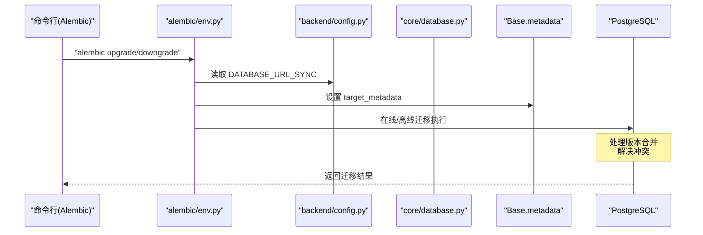
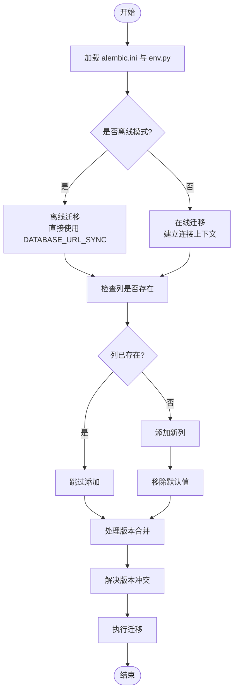
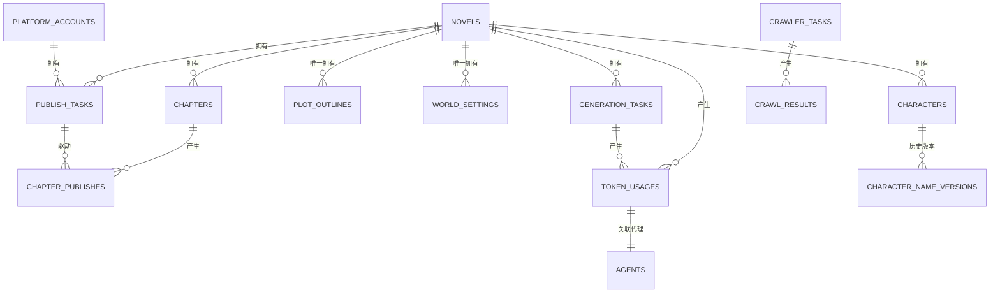
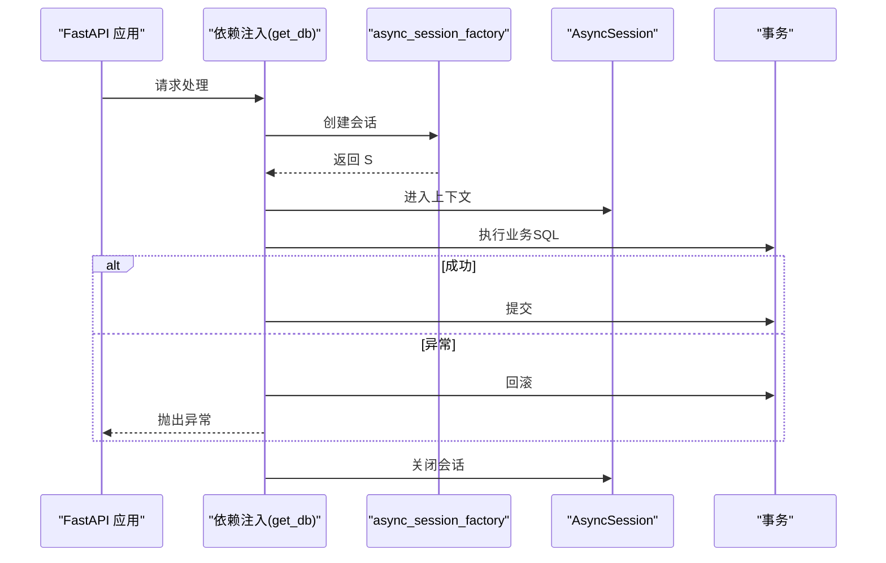
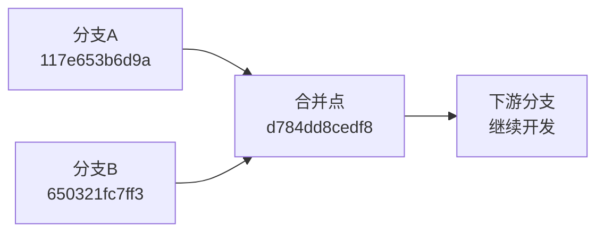
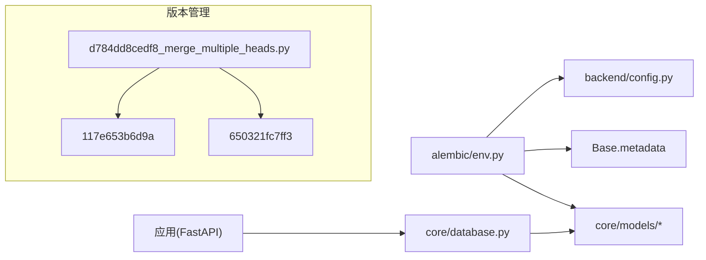

# 数据库管理与迁移

<cite>
**本文引用的文件**
- [alembic/env.py](file://alembic/env.py)
- [alembic/script.py.mako](file://alembic/script.py.mako)
- [alembic/versions/5badc20e064a_initial_tables.py](file://alembic/versions/5badc20e064a_initial_tables.py)
- [alembic/versions/186700edca0b_fix_complete_database_tables.py](file://alembic/versions/186700edca0b_fix_complete_database_tables.py)
- [alembic/versions/4b47062db094_add_douyin_crawl_types.py](file://alembic/versions/4b47062db094_add_douyin_crawl_types.py)
- [alembic/versions/117e653b6d9a_add_agent_name_column_to_token_usages_.py](file://alembic/versions/117e653b6d9a_add_agent_name_column_to_token_usages_.py)
- [alembic/versions/650321fc7ff3_add_missing_columns_to_characters_and_.py](file://alembic/versions/650321fc7ff3_add_missing_columns_to_characters_and_.py)
- [alembic/versions/d784dd8cedf8_merge_multiple_heads.py](file://alembic/versions/d784dd8cedf8_merge_multiple_heads.py)
- [alembic/versions/ff3082519b6d_merge_migration.py](file://alembic/versions/ff3082519b6d_merge_migration.py)
- [alembic.ini](file://alembic.ini)
- [core/database.py](file://core/database.py)
- [backend/config.py](file://backend/config.py)
- [.env](file://.env)
- [docker-compose.yml](file://docker-compose.yml)
- [core/models/__init__.py](file://core/models/__init__.py)
- [core/models/novel.py](file://core/models/novel.py)
- [core/models/chapter.py](file://core/models/chapter.py)
- [core/models/character.py](file://core/models/character.py)
- [core/models/publish_task.py](file://core/models/publish_task.py)
- [core/models/token_usage.py](file://core/models/token_usage.py)
- [backend/main.py](file://backend/main.py)
</cite>

## 更新摘要
**变更内容**
- 新增 `agent_name` 列到 `token_usages` 表的迁移管理
- 新增版本合并迁移 `d784dd8cedf8_merge_multiple_heads.py` 解决版本冲突问题
- 更新数据库 Schema 设计章节以反映最新的表结构
- 增强迁移脚本的安全性，包含重复列检查机制
- 完善 Alembic 迁移环境配置说明
- 新增版本合并与冲突解决的最佳实践指导

## 目录
1. [简介](#简介)
2. [项目结构](#项目结构)
3. [核心组件](#核心组件)
4. [架构总览](#架构总览)
5. [详细组件分析](#详细组件分析)
6. [依赖关系分析](#依赖关系分析)
7. [性能考虑](#性能考虑)
8. [故障排查指南](#故障排查指南)
9. [结论](#结论)
10. [附录](#附录)

## 简介
本指南面向数据库管理员与后端工程师，系统讲解本项目的数据库管理与迁移实践，涵盖以下主题：
- 使用 Alembic 进行数据库迁移：迁移脚本生成、版本控制、数据库升级与降级
- 数据库 Schema 设计原则：表结构、索引、外键约束、数据类型选择
- 备份与恢复策略：全量与增量备份、灾难恢复计划
- 性能优化：查询优化、连接池配置、缓存策略
- 安全配置：访问控制、加密传输、权限管理
- 生产运维流程：上线前检查、变更审批、回滚预案
- 不同环境的配置差异与最佳实践
- **新增**：版本合并与冲突解决策略，确保多分支并行开发的稳定性

## 项目结构
项目采用"异步 SQLAlchemy + Alembic 迁移"的技术栈，数据库层通过异步引擎提供连接，迁移工具在独立的 Alembic 配置中完成版本化演进。新增的版本合并机制确保了多分支开发场景下的版本一致性。

```mermaid
graph TB
subgraph "应用层"
MAIN["backend/main.py"]
CONFIG["backend/config.py"]
DB["core/database.py"]
MODELS["core/models/*"]
end
subgraph "迁移层"
ALEMBIC_INI["alembic.ini"]
ENV_PY["alembic/env.py"]
SCRIPT_MAKO["alembic/script.py.mako"]
V1["alembic/versions/5badc20e064a_initial_tables.py"]
V2["alembic/versions/186700edca0b_fix_complete_database_tables.py"]
V3["alembic/versions/4b47062db094_add_douyin_crawl_types.py"]
V4["alembic/versions/117e653b6d9a_add_agent_name_column_to_token_usages_.py"]
V5["alembic/versions/650321fc7ff3_add_missing_columns_to_characters_and_.py"]
V6["alembic/versions/d784dd8cedf8_merge_multiple_heads.py"]
V7["alembic/versions/ff3082519b6d_merge_migration.py"]
end
subgraph "运行时服务"
DOCKER["docker-compose.yml"]
DOTENV[".env"]
end
MAIN --> CONFIG
MAIN --> DB
DB --> MODELS
ENV_PY --> MODELS
ENV_PY --> CONFIG
ALEMBIC_INI --> ENV_PY
SCRIPT_MAKO --> V1
SCRIPT_MAKO --> V2
SCRIPT_MAKO --> V3
SCRIPT_MAKO --> V4
SCRIPT_MAKO --> V5
SCRIPT_MAKO --> V6
SCRIPT_MAKO --> V7
DOCKER --> DOTENV
```



**图表来源**
- [backend/main.py:1-53](file://backend/main.py#L1-L53)
- [backend/config.py:1-132](file://backend/config.py#L1-L132)
- [core/database.py:1-35](file://core/database.py#L1-L35)
- [core/models/__init__.py:1-42](file://core/models/__init__.py#L1-L42)
- [alembic.ini:1-150](file://alembic.ini#L1-L150)
- [alembic/env.py:1-75](file://alembic/env.py#L1-L75)
- [alembic/script.py.mako:1-29](file://alembic/script.py.mako#L1-L29)
- [alembic/versions/5badc20e064a_initial_tables.py:1-181](file://alembic/versions/5badc20e064a_initial_tables.py#L1-L181)
- [alembic/versions/186700edca0b_fix_complete_database_tables.py:1-190](file://alembic/versions/186700edca0b_fix_complete_database_tables.py#L1-L190)
- [alembic/versions/4b47062db094_add_douyin_crawl_types.py:1-60](file://alembic/versions/4b47062db094_add_douyin_crawl_types.py#L1-L60)
- [alembic/versions/117e653b6d9a_add_agent_name_column_to_token_usages_.py:1-42](file://alembic/versions/117e653b6d9a_add_agent_name_column_to_token_usages_.py#L1-L42)
- [alembic/versions/650321fc7ff3_add_missing_columns_to_characters_and_.py:1-45](file://alembic/versions/650321fc7ff3_add_missing_columns_to_characters_and_.py#L1-L45)
- [alembic/versions/d784dd8cedf8_merge_multiple_heads.py:1-29](file://alembic/versions/d784dd8cedf8_merge_multiple_heads.py#L1-L29)
- [alembic/versions/ff3082519b6d_merge_migration.py:1-29](file://alembic/versions/ff3082519b6d_merge_migration.py#L1-L29)
- [docker-compose.yml:1-25](file://docker-compose.yml#L1-L25)
- [.env:1-22](file://.env#L1-L22)

**章节来源**
- [backend/main.py:1-53](file://backend/main.py#L1-L53)
- [backend/config.py:1-132](file://backend/config.py#L1-L132)
- [core/database.py:1-35](file://core/database.py#L1-L35)
- [core/models/__init__.py:1-42](file://core/models/__init__.py#L1-L42)
- [alembic.ini:1-150](file://alembic.ini#L1-L150)
- [alembic/env.py:1-75](file://alembic/env.py#L1-L75)
- [alembic/script.py.mako:1-29](file://alembic/script.py.mako#L1-L29)
- [docker-compose.yml:1-25](file://docker-compose.yml#L1-L25)
- [.env:1-22](file://.env#L1-L22)

## 核心组件
- 异步数据库引擎与会话工厂：提供异步连接、连接池参数与依赖注入式会话生命周期管理
- 配置中心：集中管理数据库连接串（异步与同步）、Redis、Celery、应用环境等
- Alembic 迁移环境：统一迁移执行入口，覆盖离线与在线模式
- 模型注册：在迁移环境中导入所有 ORM 模型以纳入元数据扫描
- **新增**：版本合并机制：支持多分支并行开发，自动解决版本冲突

**章节来源**
- [core/database.py:1-35](file://core/database.py#L1-L35)
- [backend/config.py:1-132](file://backend/config.py#L1-L132)
- [alembic/env.py:1-75](file://alembic/env.py#L1-L75)
- [core/models/__init__.py:1-42](file://core/models/__init__.py#L1-L42)

## 架构总览
下图展示应用启动到数据库迁移的关键交互路径，以及迁移脚本如何作用于目标数据库。新增的版本合并机制确保了多分支开发场景下的版本一致性。



**图表来源**
- [alembic/env.py:24-75](file://alembic/env.py#L24-L75)
- [backend/config.py:37-41](file://backend/config.py#L37-L41)
- [core/database.py:1-35](file://core/database.py#L1-L35)

## 详细组件分析

### 组件A：Alembic 迁移框架与脚本模板
- 迁移脚本生成：基于模板生成 up/down 函数与修订标识，支持自定义升级/降级逻辑
- 版本控制：每个版本脚本记录 up_revision/down_revision，形成线性或分支演进链
- 执行模式：支持离线（直接 URL）与在线（连接上下文）两种模式，确保在 CI/CD 与生产环境的一致性
- **新增**：增强的列存在性检查机制，避免重复添加列导致的迁移失败
- **新增**：版本合并支持，通过 `d784dd8cedf8_merge_multiple_heads.py` 解决多分支冲突



**图表来源**
- [alembic.ini:1-150](file://alembic.ini#L1-L150)
- [alembic/env.py:47-75](file://alembic/env.py#L47-L75)
- [backend/config.py:37-41](file://backend/config.py#L37-L41)
- [alembic/versions/117e653b6d9a_add_agent_name_column_to_token_usages_.py:21-41](file://alembic/versions/117e653b6d9a_add_agent_name_column_to_token_usages_.py#L21-L41)
- [alembic/versions/d784dd8cedf8_merge_multiple_heads.py:21-28](file://alembic/versions/d784dd8cedf8_merge_multiple_heads.py#L21-L28)

**章节来源**
- [alembic/script.py.mako:1-29](file://alembic/script.py.mako#L1-L29)
- [alembic/versions/5badc20e064a_initial_tables.py:1-181](file://alembic/versions/5badc20e064a_initial_tables.py#L1-L181)
- [alembic/versions/186700edca0b_fix_complete_database_tables.py:1-190](file://alembic/versions/186700edca0b_fix_complete_database_tables.py#L1-L190)
- [alembic/versions/4b47062db094_add_douyin_crawl_types.py:1-60](file://alembic/versions/4b47062db094_add_douyin_crawl_types.py#L1-L60)
- [alembic/versions/117e653b6d9a_add_agent_name_column_to_token_usages_.py:1-42](file://alembic/versions/117e653b6d9a_add_agent_name_column_to_token_usages_.py#L1-L42)
- [alembic/versions/650321fc7ff3_add_missing_columns_to_characters_and_.py:1-45](file://alembic/versions/650321fc7ff3_add_missing_columns_to_characters_and_.py#L1-L45)
- [alembic/versions/d784dd8cedf8_merge_multiple_heads.py:1-29](file://alembic/versions/d784dd8cedf8_merge_multiple_heads.py#L1-L29)
- [alembic/env.py:1-75](file://alembic/env.py#L1-L75)
- [alembic.ini:1-150](file://alembic.ini#L1-L150)

### 组件B：数据库 Schema 设计与模型关系
- 表结构设计：围绕"小说-章节-角色-大纲-发布"主线，采用 UUID 主键、JSONB/数组字段存储半结构化数据
- 外键约束：多对一/一对多关系通过外键维护，删除策略采用级联删除保证数据一致性
- 数据类型选择：数值成本使用高精度小数；时间戳使用带时区类型；枚举类型统一状态管理
- 关系映射：模型间通过 SQLAlchemy relationship 建立反向关联，便于查询与级联删除
- **更新**：`token_usages` 表现已包含 `agent_name` 列，用于追踪特定代理的令牌使用情况
- **新增**：版本合并机制确保多分支开发场景下的表结构一致性



**图表来源**
- [core/models/novel.py:37-66](file://core/models/novel.py#L37-L66)
- [core/models/chapter.py:18-45](file://core/models/chapter.py#L18-L45)
- [core/models/character.py:31-54](file://core/models/character.py#L31-L54)
- [core/models/publish_task.py:29-51](file://core/models/publish_task.py#L29-L51)
- [core/models/token_usage.py:11-25](file://core/models/token_usage.py#L11-L25)
- [alembic/versions/186700edca0b_fix_complete_database_tables.py:162-176](file://alembic/versions/186700edca0b_fix_complete_database_tables.py#L162-L176)

**章节来源**
- [core/models/novel.py:1-66](file://core/models/novel.py#L1-L66)
- [core/models/chapter.py:1-45](file://core/models/chapter.py#L1-L45)
- [core/models/character.py:1-54](file://core/models/character.py#L1-L54)
- [core/models/publish_task.py:1-51](file://core/models/publish_task.py#L1-L51)
- [core/models/token_usage.py:1-25](file://core/models/token_usage.py#L1-L25)
- [alembic/versions/5badc20e064a_initial_tables.py:152-165](file://alembic/versions/5badc20e064a_initial_tables.py#L152-L165)
- [alembic/versions/186700edca0b_fix_complete_database_tables.py:162-176](file://alembic/versions/186700edca0b_fix_complete_database_tables.py#L162-L176)

### 组件C：数据库连接与会话管理
- 异步引擎：基于 asyncpg 驱动，启用调试日志开关，连接池大小与溢出容量可调
- 会话工厂：AsyncSession + 自动过期关闭，提供依赖注入式 get_db 生成器
- 生命周期：自动提交与回滚，异常时回滚并重新抛出，确保事务一致性



**图表来源**
- [core/database.py:25-35](file://core/database.py#L25-L35)

**章节来源**
- [core/database.py:1-35](file://core/database.py#L1-L35)

### 组件D：配置与环境差异
- 配置来源：优先 .env 文件，支持异步与同步数据库 URL 动态拼装
- 开发环境：本地 Docker Compose 启动 PostgreSQL 与 Redis，端口映射与持久化卷
- 环境变量：区分 APP_ENV、APP_DEBUG、数据库凭据、Redis/Celery 地址

**章节来源**
- [backend/config.py:1-132](file://backend/config.py#L1-L132)
- [.env:1-22](file://.env#L1-L22)
- [docker-compose.yml:1-25](file://docker-compose.yml#L1-L25)

### 组件E：版本合并与冲突解决策略
**新增** 项目引入了完整的版本合并机制，专门用于解决多分支并行开发中的版本冲突问题。

#### 版本冲突场景
- 多个开发者同时在不同分支上进行数据库变更
- 分支合并时出现重复的表结构修改
- 不同分支对同一张表进行了相互冲突的修改

#### 解决方案架构
- **合并迁移脚本**：使用 `d784dd8cedf8_merge_multiple_heads.py` 作为合并点
- **版本链管理**：明确指定 `down_revision` 为多个上游版本
- **无操作升级**：合并脚本本身不执行任何数据库操作，仅作为版本标记



**图表来源**
- [alembic/versions/d784dd8cedf8_merge_multiple_heads.py:3-18](file://alembic/versions/d784dd8cedf8_merge_multiple_heads.py#L3-L18)
- [alembic/versions/117e653b6d9a_add_agent_name_column_to_token_usages_.py:3-18](file://alembic/versions/117e653b6d9a_add_agent_name_column_to_token_usages_.py#L3-L18)
- [alembic/versions/650321fc7ff3_add_missing_columns_to_characters_and_.py:3-18](file://alembic/versions/650321fc7ff3_add_missing_columns_to_characters_and_.py#L3-L18)

#### 最佳实践
- **定期合并**：建议每日或每周进行版本合并，避免冲突积累
- **冲突预防**：尽量避免对同一张表的重复修改
- **测试验证**：合并后进行全面的数据库迁移测试

**章节来源**
- [alembic/versions/d784dd8cedf8_merge_multiple_heads.py:1-29](file://alembic/versions/d784dd8cedf8_merge_multiple_heads.py#L1-L29)
- [alembic/versions/117e653b6d9a_add_agent_name_column_to_token_usages_.py:1-42](file://alembic/versions/117e653b6d9a_add_agent_name_column_to_token_usages_.py#L1-L42)
- [alembic/versions/650321fc7ff3_add_missing_columns_to_characters_and_.py:1-45](file://alembic/versions/650321fc7ff3_add_missing_columns_to_characters_and_.py#L1-L45)

## 依赖关系分析
- 迁移环境依赖配置中心提供的 DATABASE_URL_SYNC，确保 Alembic 与应用使用一致的数据库凭据
- 模型注册在迁移环境中导入，使 Alembic 能扫描到所有表结构变化
- 应用层通过异步引擎与会话工厂与数据库交互，与迁移工具解耦
- **新增**：版本合并机制依赖正确的 down_revision 配置来识别上游版本



**图表来源**
- [alembic/env.py:12-31](file://alembic/env.py#L12-L31)
- [backend/config.py:37-41](file://backend/config.py#L37-L41)
- [core/database.py:1-35](file://core/database.py#L1-L35)
- [core/models/__init__.py:1-42](file://core/models/__init__.py#L1-L42)
- [alembic/versions/d784dd8cedf8_merge_multiple_heads.py:15-18](file://alembic/versions/d784dd8cedf8_merge_multiple_heads.py#L15-L18)

**章节来源**
- [alembic/env.py:1-75](file://alembic/env.py#L1-L75)
- [backend/config.py:1-132](file://backend/config.py#L1-L132)
- [core/database.py:1-35](file://core/database.py#L1-L35)
- [core/models/__init__.py:1-42](file://core/models/__init__.py#L1-L42)

## 性能考虑
- 连接池配置
  - 连接池大小与溢出：根据并发请求与工作负载调整，避免连接争用与资源耗尽
  - 异步驱动：使用 asyncpg 降低网络与调度开销
- 查询优化
  - 枚举与索引：对高频过滤字段（如 publish_tasks.status、crawler_tasks.platform）建立复合索引
  - JSONB 查询：合理使用 GIN/BTree 索引，避免全表扫描
  - **新增**：`token_usages` 表的 `agent_name` 列可用于按代理维度进行查询优化
- 缓存策略
  - 结合 Redis 缓存热点数据与中间结果，减少数据库压力
- 日志与监控
  - 开启 APP_DEBUG 时建议控制 SQL 输出级别，避免生产环境日志风暴
- **新增**：版本合并性能优化
  - 合并迁移脚本不执行实际数据库操作，避免额外的性能开销
  - 定期合并可减少版本链长度，提高迁移执行效率

**章节来源**
- [core/database.py:11-22](file://core/database.py#L11-L22)
- [alembic/versions/4b47062db094_add_douyin_crawl_types.py:39-49](file://alembic/versions/4b47062db094_add_douyin_crawl_types.py#L39-L49)
- [backend/config.py:65-132](file://backend/config.py#L65-L132)
- [core/models/token_usage.py](file://core/models/token_usage.py#L17)

## 故障排查指南
- 迁移失败
  - 确认 DATABASE_URL_SYNC 与数据库实例连通性
  - 检查 Alembic 版本链是否正确，避免跨版本跳步
  - **新增**：检查版本合并配置，确保 down_revision 正确指向所有上游版本
  - **新增**：版本冲突检测：使用 `alembic heads` 查看当前所有版本头
- 连接问题
  - 核对 .env 与 docker-compose 中的数据库端口与凭据
  - 确保容器数据卷已挂载，避免重启后数据丢失
- 事务异常
  - get_db 在异常时自动回滚，检查业务层是否正确捕获与处理异常
- **新增**：版本合并问题
  - 合并脚本执行失败：检查合并脚本的 down_revision 配置
  - 分支开发中断：使用 `alembic stamp` 手动标记版本状态

**章节来源**
- [alembic/env.py:24-25](file://alembic/env.py#L24-L25)
- [.env:6-8](file://.env#L6-L8)
- [docker-compose.yml:5-12](file://docker-compose.yml#L5-L12)
- [core/database.py:25-35](file://core/database.py#L25-L35)
- [alembic/versions/117e653b6d9a_add_agent_name_column_to_token_usages_.py:23-35](file://alembic/versions/117e653b6d9a_add_agent_name_column_to_token_usages_.py#L23-L35)
- [alembic/versions/d784dd8cedf8_merge_multiple_heads.py:15-18](file://alembic/versions/d784dd8cedf8_merge_multiple_heads.py#L15-18)

## 结论
本项目以 Alembic 为核心实现了数据库版本化演进，配合异步 SQLAlchemy 与清晰的模型设计，满足从开发到生产的数据库管理需求。**最新更新**增加了 `agent_name` 列到 `token_usages` 表，增强了代理使用追踪能力。**新增**的版本合并机制有效解决了多分支并行开发中的版本冲突问题，确保了数据库演进的稳定性和一致性。建议在生产环境中强化索引策略、引入缓存与监控，并完善备份与回滚预案，确保系统稳定与可维护性。

## 附录

### A. Alembic 常用命令参考
- 生成迁移脚本：使用模板生成 up/down 逻辑
- 升级到最新版本：在线/离线模式均可执行
- 降级到指定版本：按修订 ID 回退
- **新增**：版本状态检查：使用 `alembic heads` 查看当前所有版本头
- **新增**：版本合并：使用 `alembic merge` 生成合并迁移脚本

**章节来源**
- [alembic/script.py.mako:21-28](file://alembic/script.py.mako#L21-L28)
- [alembic/env.py:33-75](file://alembic/env.py#L33-L75)
- [alembic/versions/d784dd8cedf8_merge_multiple_heads.py:21-28](file://alembic/versions/d784dd8cedf8_merge_multiple_heads.py#L21-L28)

### B. 数据库备份与恢复策略
- 全量备份：使用数据库导出工具进行完整快照
- 增量备份：结合 WAL 归档与时间点恢复（PITR）
- 恢复验证：在隔离环境验证备份可用性与一致性
- 灾备演练：定期进行 RTO/RPO 测试，确保恢复时效

### C. 生产运维流程
- 上线前检查：迁移脚本评审、数据库权限核验、容量评估
- 变更审批：双人复核、灰度发布、回滚预案
- 回滚预案：锁定版本、准备回滚脚本、演练恢复流程
- **新增**：版本合并流程：定期执行版本合并，确保多分支开发稳定性

### D. 不同环境配置差异
- 开发环境：本地 Docker Compose，APP_DEBUG 开启，数据库端口映射
- 测试/预发布：与生产相似的数据库与缓存配置，但规模较小
- 生产环境：严格的访问控制、只读副本、备份与灾备策略

**章节来源**
- [.env:18-21](file://.env#L18-L21)
- [docker-compose.yml:1-25](file://docker-compose.yml#L1-L25)
- [backend/config.py:65-132](file://backend/config.py#L65-L132)

### E. 新增功能详解：Agent 名称追踪
**更新** 项目新增了 `agent_name` 列到 `token_usages` 表，用于追踪特定代理的令牌使用情况。

#### 迁移实现细节
- **列存在性检查**：迁移脚本包含重复检查逻辑，避免重复添加列
- **默认值处理**：先设置默认值，然后移除以符合模型定义
- **兼容性保证**：使用 `nullable=False` 确保数据完整性

#### 数据模型更新
```python
class TokenUsage(Base):
    __tablename__ = "token_usages"
    
    # ... 其他字段 ...
    agent_name = Column(String(100), nullable=False)
    # ... 其他字段 ...
```

#### 性能影响
- **查询优化**：可按 `agent_name` 进行分组统计和性能分析
- **存储开销**：每个记录增加约 100 字节存储空间
- **索引建议**：建议为 `agent_name` 创建索引以优化查询性能

**章节来源**
- [alembic/versions/117e653b6d9a_add_agent_name_column_to_token_usages_.py:1-42](file://alembic/versions/117e653b6d9a_add_agent_name_column_to_token_usages_.py#L1-L42)
- [core/models/token_usage.py](file://core/models/token_usage.py#L17)
- [alembic/versions/5badc20e064a_initial_tables.py](file://alembic/versions/5badc20e064a_initial_tables.py#L156)

### F. 新增功能详解：版本合并与冲突解决
**新增** 项目引入了完整的版本合并机制，专门用于解决多分支并行开发中的版本冲突问题。

#### 版本合并实现
- **合并脚本**：`d784dd8cedf8_merge_multiple_heads.py` 作为合并点
- **多版本支持**：down_revision 指向多个上游版本 (`117e653b6d9a`, `650321fc7ff3`)
- **无操作设计**：合并脚本本身不执行任何数据库操作

#### 冲突解决策略
- **版本链管理**：明确的版本依赖关系确保迁移顺序正确
- **并行开发支持**：多个分支可以独立开发而不互相干扰
- **定期整合**：通过合并迁移定期整合各分支的变更

#### 最佳实践建议
- **频率控制**：建议每日或每周进行版本合并
- **冲突预防**：尽量避免对同一张表的重复修改
- **测试验证**：合并后进行全面的数据库迁移测试

**章节来源**
- [alembic/versions/d784dd8cedf8_merge_multiple_heads.py:1-29](file://alembic/versions/d784dd8cedf8_merge_multiple_heads.py#L1-L29)
- [alembic/versions/117e653b6d9a_add_agent_name_column_to_token_usages_.py:1-42](file://alembic/versions/117e653b6d9a_add_agent_name_column_to_token_usages_.py#L1-L42)
- [alembic/versions/650321fc7ff3_add_missing_columns_to_characters_and_.py:1-45](file://alembic/versions/650321fc7ff3_add_missing_columns_to_characters_and_.py#L1-L45)