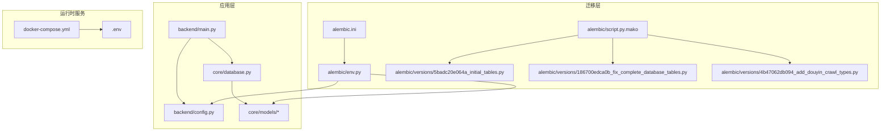
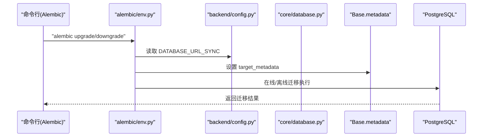
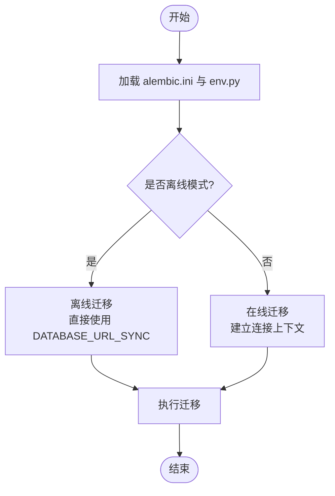
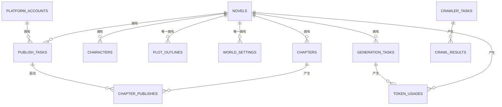
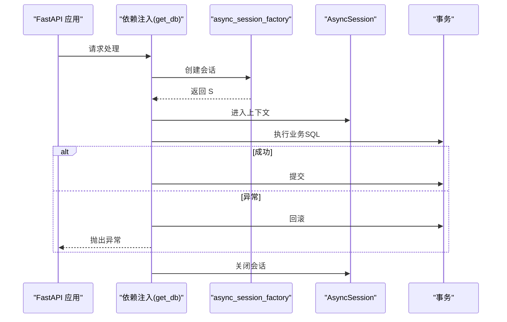
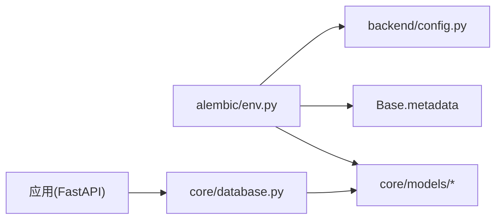

# 数据库管理与迁移

<cite>
**本文引用的文件**
- [alembic/env.py](file://alembic/env.py)
- [alembic/script.py.mako](file://alembic/script.py.mako)
- [alembic/versions/5badc20e064a_initial_tables.py](file://alembic/versions/5badc20e064a_initial_tables.py)
- [alembic/versions/186700edca0b_fix_complete_database_tables.py](file://alembic/versions/186700edca0b_fix_complete_database_tables.py)
- [alembic/versions/4b47062db094_add_douyin_crawl_types.py](file://alembic/versions/4b47062db094_add_douyin_crawl_types.py)
- [alembic.ini](file://alembic.ini)
- [core/database.py](file://core/database.py)
- [backend/config.py](file://backend/config.py)
- [.env](file://.env)
- [docker-compose.yml](file://docker-compose.yml)
- [core/models/__init__.py](file://core/models/__init__.py)
- [core/models/novel.py](file://core/models/novel.py)
- [core/models/chapter.py](file://core/models/chapter.py)
- [core/models/character.py](file://core/models/character.py)
- [core/models/publish_task.py](file://core/models/publish_task.py)
- [backend/main.py](file://backend/main.py)
</cite>

## 目录
1. [简介](#简介)
2. [项目结构](#项目结构)
3. [核心组件](#核心组件)
4. [架构总览](#架构总览)
5. [详细组件分析](#详细组件分析)
6. [依赖关系分析](#依赖关系分析)
7. [性能考虑](#性能考虑)
8. [故障排查指南](#故障排查指南)
9. [结论](#结论)
10. [附录](#附录)

## 简介
本指南面向数据库管理员与后端工程师，系统讲解本项目的数据库管理与迁移实践，涵盖以下主题：
- 使用 Alembic 进行数据库迁移：迁移脚本生成、版本控制、数据库升级与降级
- 数据库 Schema 设计原则：表结构、索引、外键约束、数据类型选择
- 备份与恢复策略：全量与增量备份、灾难恢复计划
- 性能优化：查询优化、连接池配置、缓存策略
- 安全配置：访问控制、加密传输、权限管理
- 生产运维流程：上线前检查、变更审批、回滚预案
- 不同环境的配置差异与最佳实践

## 项目结构
项目采用“异步 SQLAlchemy + Alembic 迁移”的技术栈，数据库层通过异步引擎提供连接，迁移工具在独立的 Alembic 配置中完成版本化演进。

图表来源
- [backend/main.py](file://backend/main.py#L1-L53)
- [backend/config.py](file://backend/config.py#L1-L59)
- [core/database.py](file://core/database.py#L1-L35)
- [core/models/__init__.py](file://core/models/__init__.py#L1-L40)
- [alembic.ini](file://alembic.ini#L1-L150)
- [alembic/env.py](file://alembic/env.py#L1-L66)
- [alembic/script.py.mako](file://alembic/script.py.mako#L1-L29)
- [alembic/versions/5badc20e064a_initial_tables.py](file://alembic/versions/5badc20e064a_initial_tables.py#L1-L181)
- [alembic/versions/186700edca0b_fix_complete_database_tables.py](file://alembic/versions/186700edca0b_fix_complete_database_tables.py#L1-L267)
- [alembic/versions/4b47062db094_add_douyin_crawl_types.py](file://alembic/versions/4b47062db094_add_douyin_crawl_types.py#L1-L60)
- [docker-compose.yml](file://docker-compose.yml#L1-L25)
- [.env](file://.env#L1-L22)

章节来源
- [backend/main.py](file://backend/main.py#L1-L53)
- [backend/config.py](file://backend/config.py#L1-L59)
- [core/database.py](file://core/database.py#L1-L35)
- [core/models/__init__.py](file://core/models/__init__.py#L1-L40)
- [alembic.ini](file://alembic.ini#L1-L150)
- [alembic/env.py](file://alembic/env.py#L1-L66)
- [alembic/script.py.mako](file://alembic/script.py.mako#L1-L29)
- [docker-compose.yml](file://docker-compose.yml#L1-L25)
- [.env](file://.env#L1-L22)

## 核心组件
- 异步数据库引擎与会话工厂：提供异步连接、连接池参数与依赖注入式会话生命周期管理
- 配置中心：集中管理数据库连接串（异步与同步）、Redis、Celery、应用环境等
- Alembic 迁移环境：统一迁移执行入口，覆盖离线与在线模式
- 模型注册：在迁移环境中导入所有 ORM 模型以纳入元数据扫描

章节来源
- [core/database.py](file://core/database.py#L1-L35)
- [backend/config.py](file://backend/config.py#L1-L59)
- [alembic/env.py](file://alembic/env.py#L1-L66)
- [core/models/__init__.py](file://core/models/__init__.py#L1-L40)

## 架构总览
下图展示应用启动到数据库迁移的关键交互路径，以及迁移脚本如何作用于目标数据库。

图表来源
- [alembic/env.py](file://alembic/env.py#L22-L65)
- [backend/config.py](file://backend/config.py#L18-L26)
- [core/database.py](file://core/database.py#L7-L35)

## 详细组件分析

### 组件A：Alembic 迁移框架与脚本模板
- 迁移脚本生成：基于模板生成 up/down 函数与修订标识，支持自定义升级/降级逻辑
- 版本控制：每个版本脚本记录 up_revision/down_revision，形成线性或分支演进链
- 执行模式：支持离线（直接 URL）与在线（连接上下文）两种模式，确保在 CI/CD 与生产环境的一致性

图表来源
- [alembic.ini](file://alembic.ini#L1-L150)
- [alembic/env.py](file://alembic/env.py#L33-L65)
- [backend/config.py](file://backend/config.py#L18-L26)

章节来源
- [alembic/script.py.mako](file://alembic/script.py.mako#L1-L29)
- [alembic/versions/5badc20e064a_initial_tables.py](file://alembic/versions/5badc20e064a_initial_tables.py#L1-L181)
- [alembic/versions/186700edca0b_fix_complete_database_tables.py](file://alembic/versions/186700edca0b_fix_complete_database_tables.py#L1-L267)
- [alembic/versions/4b47062db094_add_douyin_crawl_types.py](file://alembic/versions/4b47062db094_add_douyin_crawl_types.py#L1-L60)
- [alembic/env.py](file://alembic/env.py#L1-L66)
- [alembic.ini](file://alembic.ini#L1-L150)

### 组件B：数据库 Schema 设计与模型关系
- 表结构设计：围绕“小说-章节-角色-大纲-发布”主线，采用 UUID 主键、JSONB/数组字段存储半结构化数据
- 外键约束：多对一/一对多关系通过外键维护，删除策略采用级联删除保证数据一致性
- 数据类型选择：数值成本使用高精度小数；时间戳使用带时区类型；枚举类型统一状态管理
- 关系映射：模型间通过 SQLAlchemy relationship 建立反向关联，便于查询与级联删除

图表来源
- [core/models/novel.py](file://core/models/novel.py#L37-L66)
- [core/models/chapter.py](file://core/models/chapter.py#L18-L45)
- [core/models/character.py](file://core/models/character.py#L31-L54)
- [core/models/publish_task.py](file://core/models/publish_task.py#L29-L51)
- [alembic/versions/186700edca0b_fix_complete_database_tables.py](file://alembic/versions/186700edca0b_fix_complete_database_tables.py#L40-L246)

章节来源
- [core/models/novel.py](file://core/models/novel.py#L1-L66)
- [core/models/chapter.py](file://core/models/chapter.py#L1-L45)
- [core/models/character.py](file://core/models/character.py#L1-L54)
- [core/models/publish_task.py](file://core/models/publish_task.py#L1-L51)
- [alembic/versions/5badc20e064a_initial_tables.py](file://alembic/versions/5badc20e064a_initial_tables.py#L24-L166)
- [alembic/versions/186700edca0b_fix_complete_database_tables.py](file://alembic/versions/186700edca0b_fix_complete_database_tables.py#L24-L246)

### 组件C：数据库连接与会话管理
- 异步引擎：基于 asyncpg 驱动，启用调试日志开关，连接池大小与溢出容量可调
- 会话工厂：AsyncSession + 自动过期关闭，提供依赖注入式 get_db 生成器
- 生命周期：自动提交与回滚，异常时回滚并重新抛出，确保事务一致性

图表来源
- [core/database.py](file://core/database.py#L25-L35)

章节来源
- [core/database.py](file://core/database.py#L1-L35)

### 组件D：配置与环境差异
- 配置来源：优先 .env 文件，支持异步与同步数据库 URL 动态拼装
- 开发环境：本地 Docker Compose 启动 PostgreSQL 与 Redis，端口映射与持久化卷
- 环境变量：区分 APP_ENV、APP_DEBUG、数据库凭据、Redis/Celery 地址

章节来源
- [backend/config.py](file://backend/config.py#L1-L59)
- [.env](file://.env#L1-L22)
- [docker-compose.yml](file://docker-compose.yml#L1-L25)

## 依赖关系分析
- 迁移环境依赖配置中心提供的 DATABASE_URL_SYNC，确保 Alembic 与应用使用一致的数据库凭据
- 模型注册在迁移环境中导入，使 Alembic 能扫描到所有表结构变化
- 应用层通过异步引擎与会话工厂与数据库交互，与迁移工具解耦

图表来源
- [alembic/env.py](file://alembic/env.py#L12-L30)
- [backend/config.py](file://backend/config.py#L18-L26)
- [core/database.py](file://core/database.py#L1-L35)
- [core/models/__init__.py](file://core/models/__init__.py#L1-L40)

章节来源
- [alembic/env.py](file://alembic/env.py#L1-L66)
- [backend/config.py](file://backend/config.py#L1-L59)
- [core/database.py](file://core/database.py#L1-L35)
- [core/models/__init__.py](file://core/models/__init__.py#L1-L40)

## 性能考虑
- 连接池配置
  - 连接池大小与溢出：根据并发请求与工作负载调整，避免连接争用与资源耗尽
  - 异步驱动：使用 asyncpg 降低网络与调度开销
- 查询优化
  - 枚举与索引：对高频过滤字段（如 publish_tasks.status、crawler_tasks.platform）建立复合索引
  - JSONB 查询：合理使用 GIN/BTree 索引，避免全表扫描
- 缓存策略
  - 结合 Redis 缓存热点数据与中间结果，减少数据库压力
- 日志与监控
  - 开启 APP_DEBUG 时建议控制 SQL 输出级别，避免生产环境日志风暴

章节来源
- [core/database.py](file://core/database.py#L11-L22)
- [alembic/versions/4b47062db094_add_douyin_crawl_types.py](file://alembic/versions/4b47062db094_add_douyin_crawl_types.py#L39-L49)
- [backend/config.py](file://backend/config.py#L36-L49)

## 故障排查指南
- 迁移失败
  - 确认 DATABASE_URL_SYNC 与数据库实例连通性
  - 检查 Alembic 版本链是否正确，避免跨版本跳步
- 连接问题
  - 核对 .env 与 docker-compose 中的数据库端口与凭据
  - 确保容器数据卷已挂载，避免重启后数据丢失
- 事务异常
  - get_db 在异常时自动回滚，检查业务层是否正确捕获与处理异常

章节来源
- [alembic/env.py](file://alembic/env.py#L24-L25)
- [.env](file://.env#L6-L8)
- [docker-compose.yml](file://docker-compose.yml#L5-L12)
- [core/database.py](file://core/database.py#L25-L35)

## 结论
本项目以 Alembic 为核心实现了数据库版本化演进，配合异步 SQLAlchemy 与清晰的模型设计，满足从开发到生产的数据库管理需求。建议在生产环境中强化索引策略、引入缓存与监控，并完善备份与回滚预案，确保系统稳定与可维护性。

## 附录

### A. Alembic 常用命令参考
- 生成迁移脚本：使用模板生成 up/down 逻辑
- 升级到最新版本：在线/离线模式均可执行
- 降级到指定版本：按修订 ID 回退

章节来源
- [alembic/script.py.mako](file://alembic/script.py.mako#L21-L28)
- [alembic/env.py](file://alembic/env.py#L33-L65)
- [alembic.ini](file://alembic.ini#L8-L16)

### B. 数据库备份与恢复策略
- 全量备份：使用数据库导出工具进行完整快照
- 增量备份：结合 WAL 归档与时间点恢复（PITR）
- 恢复验证：在隔离环境验证备份可用性与一致性
- 灾备演练：定期进行 RTO/RPO 测试，确保恢复时效

[本节为通用实践指导，不直接分析具体文件]

### C. 生产运维流程
- 上线前检查：迁移脚本评审、数据库权限核验、容量评估
- 变更审批：双人复核、灰度发布、回滚预案
- 回滚预案：锁定版本、准备回滚脚本、演练恢复流程

[本节为通用实践指导，不直接分析具体文件]

### D. 不同环境配置差异
- 开发环境：本地 Docker Compose，APP_DEBUG 开启，数据库端口映射
- 测试/预发布：与生产相似的数据库与缓存配置，但规模较小
- 生产环境：严格的访问控制、只读副本、备份与灾备策略

章节来源
- [.env](file://.env#L18-L21)
- [docker-compose.yml](file://docker-compose.yml#L1-L25)
- [backend/config.py](file://backend/config.py#L36-L39)