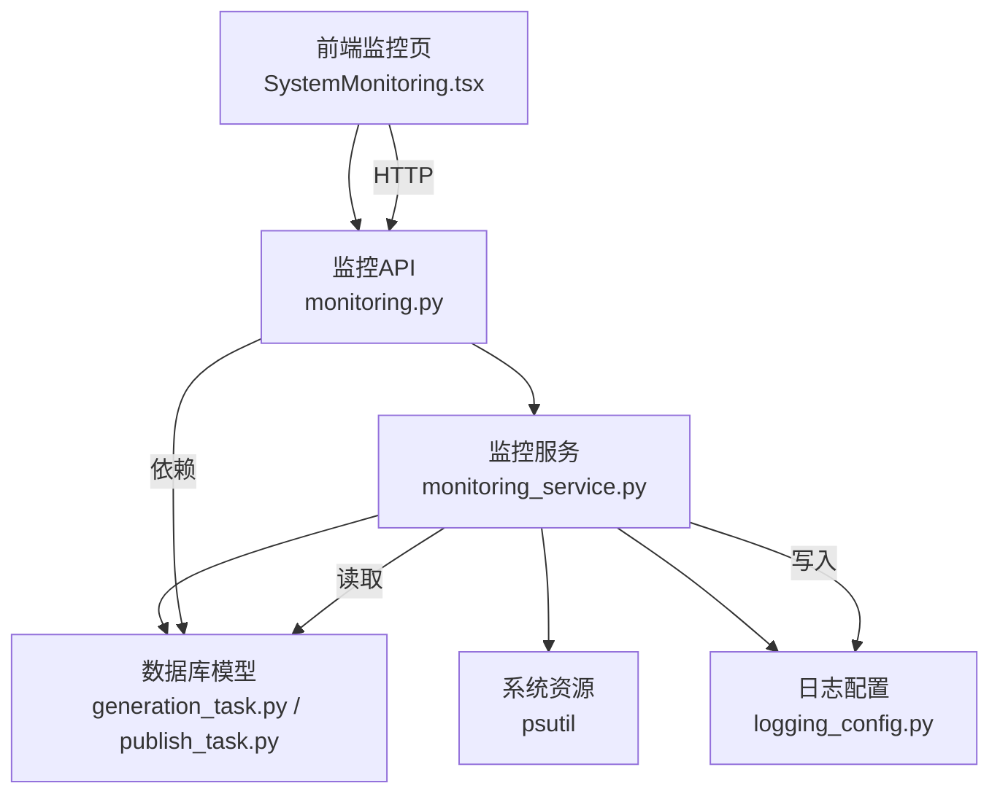
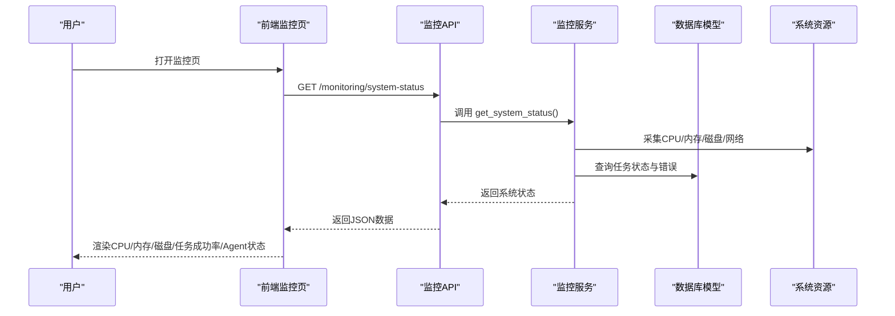
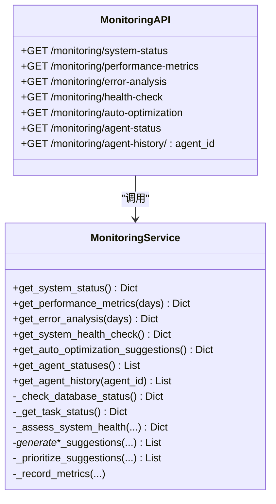
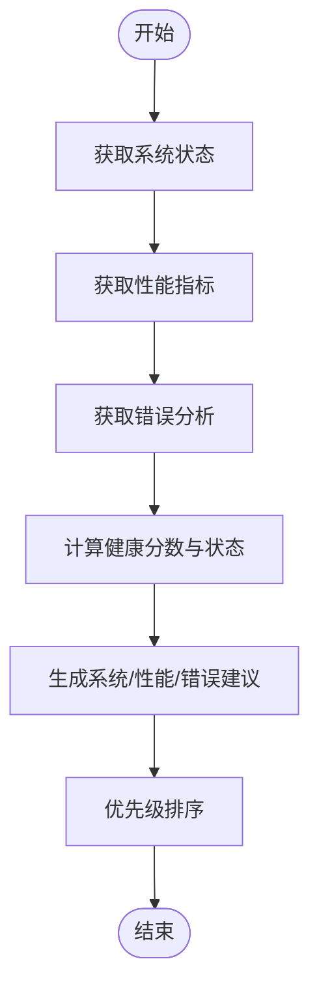
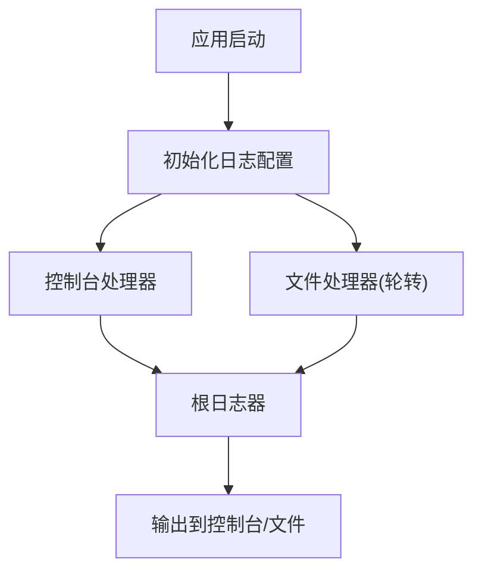
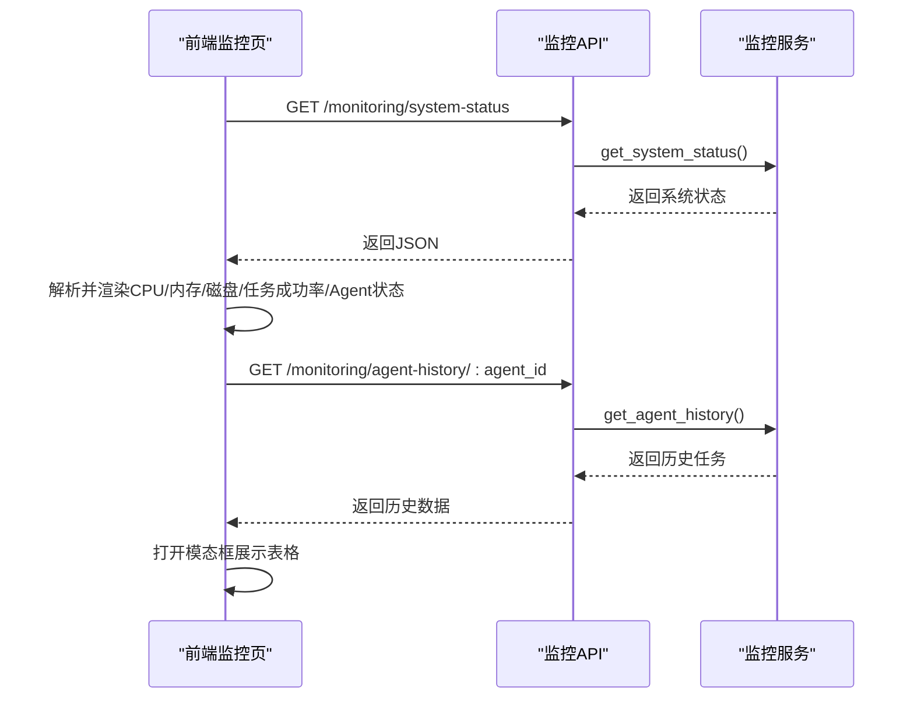
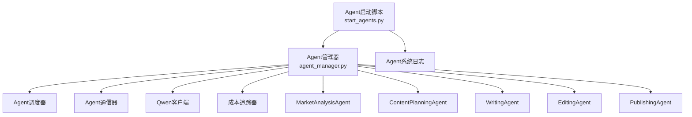
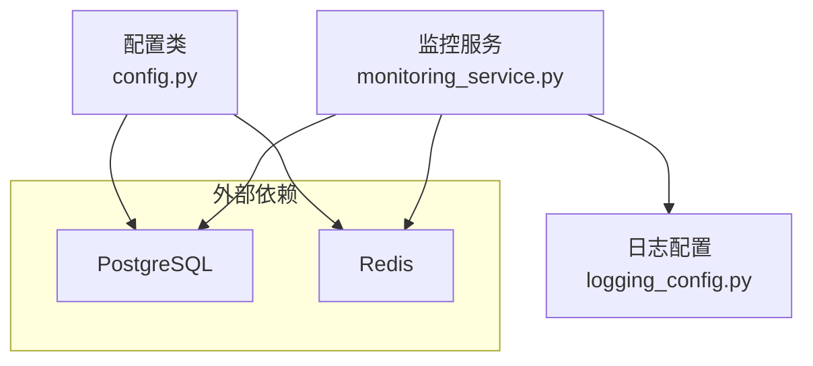

# 系统监控与运维

<cite>
**本文引用的文件**
- [backend/api/v1/monitoring.py](file://backend/api/v1/monitoring.py)
- [backend/services/monitoring_service.py](file://backend/services/monitoring_service.py)
- [backend/main.py](file://backend/main.py)
- [core/logging_config.py](file://core/logging_config.py)
- [frontend/src/pages/SystemMonitoring.tsx](file://frontend/src/pages/SystemMonitoring.tsx)
- [backend/config.py](file://backend/config.py)
- [docker-compose.yml](file://docker-compose.yml)
- [core/models/generation_task.py](file://core/models/generation_task.py)
- [core/models/publish_task.py](file://core/models/publish_task.py)
- [llm/cost_tracker.py](file://llm/cost_tracker.py)
- [agents/agent_manager.py](file://agents/agent_manager.py)
- [scripts/start_agents.py](file://scripts/start_agents.py)
</cite>

## 目录
1. [简介](#简介)
2. [项目结构](#项目结构)
3. [核心组件](#核心组件)
4. [架构总览](#架构总览)
5. [详细组件分析](#详细组件分析)
6. [依赖关系分析](#依赖关系分析)
7. [性能考量](#性能考量)
8. [故障排除指南](#故障排除指南)
9. [结论](#结论)
10. [附录](#附录)

## 简介
本指南面向系统监控与运维场景，围绕小说生成系统的性能指标监控、日志管理、健康检查、智能体（Agent）系统监控、故障排除与运维最佳实践展开。系统通过后端FastAPI接口提供监控数据，前端可视化展示系统状态；同时具备基础的日志轮转与结构化日志能力，并对Agent运行状态与任务执行进行可观测性支持。

## 项目结构
- 后端API层：提供监控相关接口，如系统状态、性能指标、错误分析、健康检查、Agent状态与历史等。
- 监控服务层：封装系统状态采集、性能指标聚合、错误分析、健康评估与自动调优建议生成。
- 日志配置：统一控制台与文件日志输出，支持轮转与级别设置。
- 前端监控页：拉取后端监控接口，展示CPU/内存/磁盘使用率、任务成功率、Agent状态与历史任务。
- 配置与容器编排：数据库与Redis服务通过Docker Compose提供，便于本地与生产环境部署。
- 模型与成本追踪：任务模型承载状态与错误信息，成本追踪模块记录Token用量与费用。

图表来源
- [backend/api/v1/monitoring.py](file://backend/api/v1/monitoring.py#L1-L101)
- [backend/services/monitoring_service.py](file://backend/services/monitoring_service.py#L1-L805)
- [frontend/src/pages/SystemMonitoring.tsx](file://frontend/src/pages/SystemMonitoring.tsx#L1-L411)
- [core/logging_config.py](file://core/logging_config.py#L1-L55)
- [core/models/generation_task.py](file://core/models/generation_task.py#L1-L47)
- [core/models/publish_task.py](file://core/models/publish_task.py#L1-L51)

章节来源
- [backend/api/v1/monitoring.py](file://backend/api/v1/monitoring.py#L1-L101)
- [backend/services/monitoring_service.py](file://backend/services/monitoring_service.py#L1-L805)
- [frontend/src/pages/SystemMonitoring.tsx](file://frontend/src/pages/SystemMonitoring.tsx#L1-L411)
- [core/logging_config.py](file://core/logging_config.py#L1-L55)
- [core/models/generation_task.py](file://core/models/generation_task.py#L1-L47)
- [core/models/publish_task.py](file://core/models/publish_task.py#L1-L51)

## 核心组件
- 监控API路由：提供系统状态、性能指标、错误分析、健康检查、自动调优建议、Agent状态与历史等接口。
- 监控服务：采集系统资源、数据库连通性、任务状态与错误，生成健康评分与优化建议。
- 日志配置：统一日志格式、级别与轮转策略，降低噪声并提升可维护性。
- 前端监控页：定时拉取监控接口，渲染系统指标与Agent状态卡片。
- 配置与容器：集中管理数据库、Redis、Celery等外部依赖，便于部署与扩展。
- 任务模型与成本追踪：记录任务生命周期、错误信息与Token成本，支撑可观测与成本控制。

章节来源
- [backend/api/v1/monitoring.py](file://backend/api/v1/monitoring.py#L1-L101)
- [backend/services/monitoring_service.py](file://backend/services/monitoring_service.py#L1-L805)
- [core/logging_config.py](file://core/logging_config.py#L1-L55)
- [frontend/src/pages/SystemMonitoring.tsx](file://frontend/src/pages/SystemMonitoring.tsx#L1-L411)
- [backend/config.py](file://backend/config.py#L1-L59)
- [docker-compose.yml](file://docker-compose.yml#L1-L25)
- [core/models/generation_task.py](file://core/models/generation_task.py#L1-L47)
- [core/models/publish_task.py](file://core/models/publish_task.py#L1-L51)
- [llm/cost_tracker.py](file://llm/cost_tracker.py#L1-L74)

## 架构总览
系统监控与运维采用“前端展示 + 后端API + 服务层 + 数据库/日志”的分层设计。前端通过HTTP请求访问后端监控接口，后端调用监控服务聚合系统与业务指标，最终在前端以仪表板形式呈现。

图表来源
- [frontend/src/pages/SystemMonitoring.tsx](file://frontend/src/pages/SystemMonitoring.tsx#L60-L90)
- [backend/api/v1/monitoring.py](file://backend/api/v1/monitoring.py#L12-L22)
- [backend/services/monitoring_service.py](file://backend/services/monitoring_service.py#L118-L176)
- [core/models/generation_task.py](file://core/models/generation_task.py#L27-L47)
- [core/models/publish_task.py](file://core/models/publish_task.py#L29-L51)

## 详细组件分析

### 监控API与服务
- 接口覆盖：系统状态、性能指标、错误分析、健康检查、自动调优建议、Agent状态与历史。
- 服务职责：采集系统资源、数据库连通性、任务状态与错误，生成健康评分与优化建议。
- 数据来源：psutil系统指标、数据库模型统计、任务错误消息、模拟Agent状态与历史。

图表来源
- [backend/api/v1/monitoring.py](file://backend/api/v1/monitoring.py#L1-L101)
- [backend/services/monitoring_service.py](file://backend/services/monitoring_service.py#L63-L805)

章节来源
- [backend/api/v1/monitoring.py](file://backend/api/v1/monitoring.py#L1-L101)
- [backend/services/monitoring_service.py](file://backend/services/monitoring_service.py#L118-L407)

### 健康检查与自动调优
- 健康检查：综合系统资源、数据库状态、任务状态与错误，给出健康状态与评分，并附带改进建议。
- 自动调优：基于系统状态、性能指标与错误分布，生成系统、性能与错误三类建议，并按关键词优先级排序。

图表来源
- [backend/services/monitoring_service.py](file://backend/services/monitoring_service.py#L377-L407)
- [backend/services/monitoring_service.py](file://backend/services/monitoring_service.py#L347-L375)
- [backend/services/monitoring_service.py](file://backend/services/monitoring_service.py#L658-L698)

章节来源
- [backend/services/monitoring_service.py](file://backend/services/monitoring_service.py#L377-L407)
- [backend/services/monitoring_service.py](file://backend/services/monitoring_service.py#L347-L375)
- [backend/services/monitoring_service.py](file://backend/services/monitoring_service.py#L658-L698)

### 日志管理与轮转
- 结构化日志：统一格式与级别，区分应用日志与第三方库日志。
- 日志轮转：文件大小达到阈值后自动轮转，保留多个备份，避免单文件过大。
- 前端与后端：前端通过HTTP接口消费后端监控数据；后端通过统一日志配置输出到控制台与文件。

图表来源
- [core/logging_config.py](file://core/logging_config.py#L20-L50)
- [backend/main.py](file://backend/main.py#L11-L13)

章节来源
- [core/logging_config.py](file://core/logging_config.py#L1-L55)
- [backend/main.py](file://backend/main.py#L1-L53)

### 前端监控面板
- 数据拉取：定时请求后端监控接口，解析系统状态与Agent历史。
- 展示维度：CPU/内存/磁盘使用率、系统运行时长、任务成功率、Agent状态卡片与历史任务表格。
- 交互：点击“查看历史”弹出模态框，分页展示任务详情。

图表来源
- [frontend/src/pages/SystemMonitoring.tsx](file://frontend/src/pages/SystemMonitoring.tsx#L60-L109)
- [backend/api/v1/monitoring.py](file://backend/api/v1/monitoring.py#L92-L100)
- [backend/services/monitoring_service.py](file://backend/services/monitoring_service.py#L81-L116)

章节来源
- [frontend/src/pages/SystemMonitoring.tsx](file://frontend/src/pages/SystemMonitoring.tsx#L1-L411)
- [backend/api/v1/monitoring.py](file://backend/api/v1/monitoring.py#L1-L101)
- [backend/services/monitoring_service.py](file://backend/services/monitoring_service.py#L81-L116)

### 智能体（Agent）系统监控策略
- Agent状态：后端提供Agent状态与历史接口，前端以卡片与表格形式展示。
- Agent管理器：负责Agent初始化、注册、启动与停止，便于集中管理。
- Agent启动脚本：独立进程启动Agent系统，记录日志并输出成本统计。

图表来源
- [agents/agent_manager.py](file://agents/agent_manager.py#L22-L227)
- [scripts/start_agents.py](file://scripts/start_agents.py#L37-L204)
- [llm/cost_tracker.py](file://llm/cost_tracker.py#L16-L74)

章节来源
- [agents/agent_manager.py](file://agents/agent_manager.py#L1-L227)
- [scripts/start_agents.py](file://scripts/start_agents.py#L1-L204)
- [llm/cost_tracker.py](file://llm/cost_tracker.py#L1-L74)

## 依赖关系分析
- 外部依赖：PostgreSQL数据库、Redis（用于Celery队列与结果存储）、Docker Compose编排。
- 配置中心：后端配置类集中管理数据库、Redis、Celery、应用参数等。
- 监控数据流：前端 → API → 服务 → 数据库/系统资源 → 日志 → 前端展示。

图表来源
- [backend/config.py](file://backend/config.py#L1-L59)
- [docker-compose.yml](file://docker-compose.yml#L1-L25)
- [backend/services/monitoring_service.py](file://backend/services/monitoring_service.py#L1-L805)
- [core/logging_config.py](file://core/logging_config.py#L1-L55)

章节来源
- [backend/config.py](file://backend/config.py#L1-L59)
- [docker-compose.yml](file://docker-compose.yml#L1-L25)
- [backend/services/monitoring_service.py](file://backend/services/monitoring_service.py#L1-L805)
- [core/logging_config.py](file://core/logging_config.py#L1-L55)

## 性能考量
- 系统资源：通过psutil采集CPU/内存/磁盘/网络指标，结合健康评分与建议，指导扩容与优化。
- 任务成功率：基于任务模型统计生成与发布任务的成功率，辅助识别LLM API、平台账号与网络问题。
- Token成本：通过成本追踪模块记录Prompt/Completion Token与累计费用，支撑成本控制与预算预警。
- 日志轮转：避免日志文件过大影响IO与磁盘，建议结合集中式日志系统（如ELK/Fluentd）长期留存与检索。

章节来源
- [backend/services/monitoring_service.py](file://backend/services/monitoring_service.py#L118-L176)
- [backend/services/monitoring_service.py](file://backend/services/monitoring_service.py#L178-L261)
- [llm/cost_tracker.py](file://llm/cost_tracker.py#L16-L74)
- [core/logging_config.py](file://core/logging_config.py#L35-L43)

## 故障排除指南
- 健康检查入口：通过健康检查接口快速判断系统整体状态与评分，定位问题类别（资源、数据库、任务、错误）。
- 错误分析：查看最近错误与错误模式，结合任务模型中的错误字段定位具体环节（生成/发布/爬虫）。
- 日志定位：根据错误发生时间点，核对应用日志与Agent系统日志，确认异常堆栈与上下文。
- 依赖连通性：检查数据库与Redis连通性，必要时重启对应容器或调整连接参数。
- 前端诊断：若前端无法加载监控数据，检查后端健康接口与API路由是否可达。

章节来源
- [backend/api/v1/monitoring.py](file://backend/api/v1/monitoring.py#L66-L76)
- [backend/services/monitoring_service.py](file://backend/services/monitoring_service.py#L263-L345)
- [core/logging_config.py](file://core/logging_config.py#L20-L50)
- [docker-compose.yml](file://docker-compose.yml#L1-L25)

## 结论
该系统提供了完善的监控与运维基础：后端API与服务层统一采集系统与业务指标，前端可视化直观展示关键指标与Agent状态；日志配置支持结构化与轮转；配置与容器编排简化了部署与扩展。建议后续增强真实Agent状态采集、Redis延迟监控、数据库连接池与慢查询分析、以及告警规则与自动化处置流程，以进一步完善生产级监控体系。

## 附录
- 健康检查接口：/monitoring/health-check
- 系统状态接口：/monitoring/system-status
- 性能指标接口：/monitoring/performance-metrics?days=7
- 错误分析接口：/monitoring/error-analysis?days=7
- 自动调优建议：/monitoring/auto-optimization
- Agent状态：/monitoring/agent-status
- Agent历史：/monitoring/agent-history/:agent_id

章节来源
- [backend/api/v1/monitoring.py](file://backend/api/v1/monitoring.py#L1-L101)