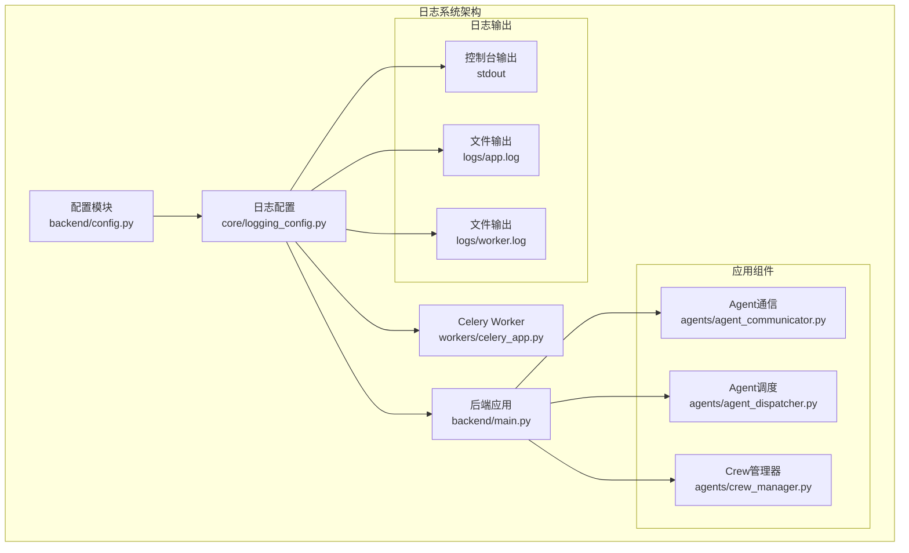
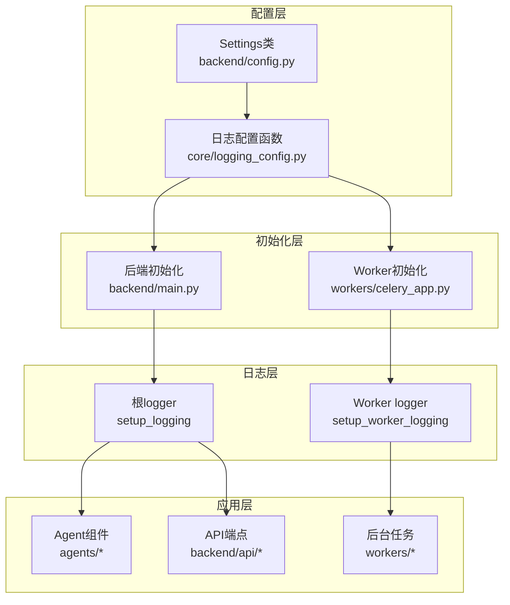
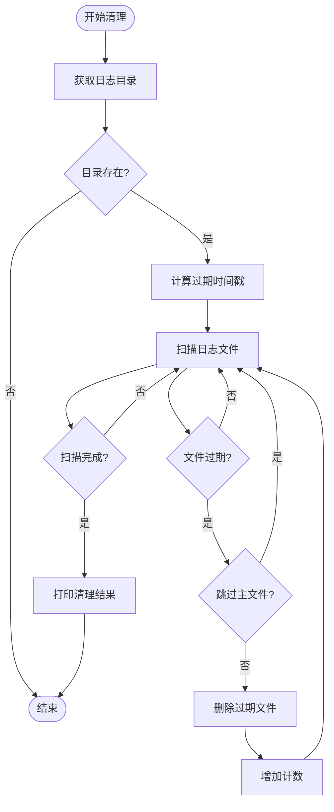
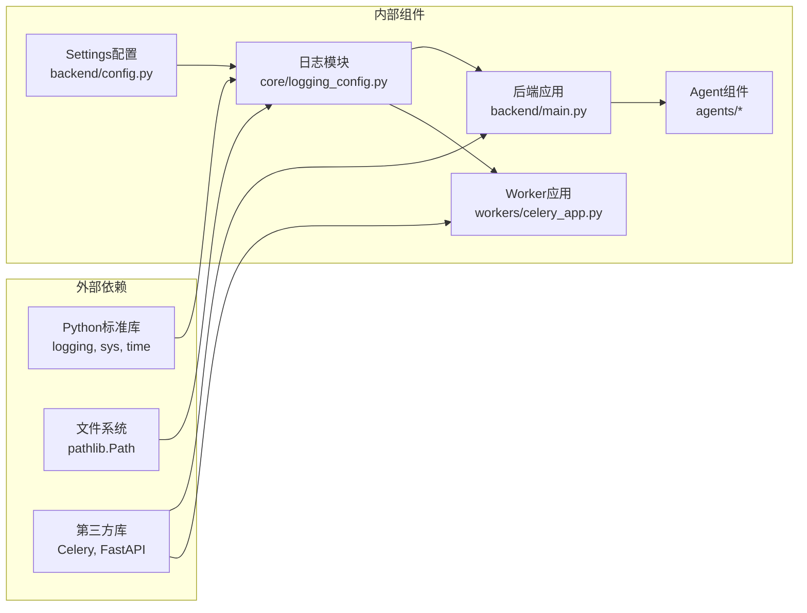

# 统一日志系统

<cite>
**本文档引用的文件**
- [core/logging_config.py](file://core/logging_config.py)
- [backend/config.py](file://backend/config.py)
- [backend/main.py](file://backend/main.py)
- [workers/celery_app.py](file://workers/celery_app.py)
- [agents/agent_communicator.py](file://agents/agent_communicator.py)
- [agents/agent_dispatcher.py](file://agents/agent_dispatcher.py)
- [agents/crew_manager.py](file://agents/crew_manager.py)
- [scripts/start_backend.sh](file://scripts/start_backend.sh)
- [scripts/start_dev_all.sh](file://scripts/start_dev_all.sh)
</cite>

## 目录
1. [简介](#简介)
2. [项目结构](#项目结构)
3. [核心组件](#核心组件)
4. [架构概览](#架构概览)
5. [详细组件分析](#详细组件分析)
6. [依赖关系分析](#依赖关系分析)
7. [性能考虑](#性能考虑)
8. [故障排除指南](#故障排除指南)
9. [结论](#结论)

## 简介

统一日志系统是小说生成系统的重要基础设施，负责在整个分布式架构中提供一致的日志记录和管理能力。该系统采用Python标准库logging模块，结合RotatingFileHandler实现日志文件的自动轮转，并通过专门的配置模块实现了后端和Worker日志的分离管理。

系统的主要特点包括：
- 统一的日志目录管理（logs/）
- 按大小自动轮转的日志文件
- 自动过期清理机制（默认保留7天）
- 后端和Celery Worker日志分离
- 可配置的日志级别（DEBUG/INFO）
- 第三方库日志级别优化

## 项目结构

小说生成系统的日志架构采用分层设计，从底层的配置模块到上层的应用组件，形成了完整的日志管理体系：



**图表来源**
- [core/logging_config.py:112-216](file://core/logging_config.py#L112-L216)
- [backend/config.py:183-189](file://backend/config.py#L183-L189)
- [backend/main.py:13-16](file://backend/main.py#L13-L16)
- [workers/celery_app.py:27-34](file://workers/celery_app.py#L27-L34)

**章节来源**
- [core/logging_config.py:1-216](file://core/logging_config.py#L1-L216)
- [backend/config.py:1-425](file://backend/config.py#L1-L425)

## 核心组件

### 日志配置模块

日志配置模块是整个系统的核心，提供了完整的日志管理功能：

#### 主要功能特性
- **目录管理**：自动创建和管理日志目录
- **轮转机制**：基于文件大小的自动轮转
- **过期清理**：自动删除过期日志文件
- **级别控制**：根据调试模式动态调整日志级别
- **第三方库优化**：降低SQLAlchemy、HTTPX等库的日志噪声

#### 关键配置参数
- `LOG_DIR`: 日志目录路径（默认："logs"）
- `LOG_FILE_MAX_BYTES`: 单文件最大大小（默认：10MB）
- `LOG_FILE_BACKUP_COUNT`: 备份数量（默认：5）
- `LOG_RETENTION_DAYS`: 保留天数（默认：7）
- `LOG_FILE_NAME`: 后端日志文件名（默认："app.log"）
- `LOG_WORKER_FILE_NAME`: Worker日志文件名（默认："worker.log"）

**章节来源**
- [core/logging_config.py:183-189](file://core/logging_config.py#L183-L189)
- [backend/config.py:183-189](file://backend/config.py#L183-L189)

### 后端日志系统

后端应用通过统一入口初始化日志系统，确保所有组件使用一致的日志配置：

#### 初始化流程
1. 调用`setup_logging()`函数
2. 创建日志目录
3. 清理过期日志文件
4. 配置根logger
5. 设置控制台和文件处理器
6. 优化第三方库日志级别

#### 日志输出配置
- **控制台输出**：stdout，格式化显示
- **文件输出**：logs/app.log，按大小轮转
- **日志级别**：根据APP_DEBUG自动选择DEBUG或INFO

**章节来源**
- [backend/main.py:13-16](file://backend/main.py#L13-L16)
- [core/logging_config.py:112-167](file://core/logging_config.py#L112-L167)

### Celery Worker日志系统

Worker组件具有独立的日志配置，与后端日志系统分离：

#### Worker日志特性
- **独立logger**：使用"workers"命名空间
- **文件分离**：输出到logs/worker.log
- **继承配置**：继承根logger的控制台输出
- **专用轮转**：独立的轮转策略

#### 启动顺序
1. 先初始化后端日志系统
2. 再配置Worker专用日志
3. 确保Worker继承根logger的控制台输出

**章节来源**
- [workers/celery_app.py:27-34](file://workers/celery_app.py#L27-L34)
- [core/logging_config.py:170-212](file://core/logging_config.py#L170-L212)

## 架构概览

统一日志系统采用分层架构设计，确保了日志管理的一致性和可维护性：



**图表来源**
- [backend/config.py:48-425](file://backend/config.py#L48-L425)
- [core/logging_config.py:112-216](file://core/logging_config.py#L112-L216)
- [backend/main.py:13-16](file://backend/main.py#L13-L16)
- [workers/celery_app.py:27-34](file://workers/celery_app.py#L27-L34)

## 详细组件分析

### 日志清理机制

系统实现了智能的日志清理功能，确保磁盘空间的有效利用：



**图表来源**
- [core/logging_config.py:53-96](file://core/logging_config.py#L53-L96)

#### 清理规则
- **过期判断**：基于文件修改时间与当前时间的差值
- **主文件保护**：跳过当前正在写入的主日志文件
- **备份文件处理**：删除所有过期的轮转备份文件
- **错误处理**：忽略删除过程中的OS错误

**章节来源**
- [core/logging_config.py:53-96](file://core/logging_config.py#L53-L96)

### 日志格式化系统

系统采用统一的日志格式，确保日志信息的完整性和可读性：

#### 格式规范
- **时间戳**：精确到秒的时间信息
- **组件名称**：记录日志的模块或类名
- **日志级别**：DEBUG/INFO/WARNING/ERROR
- **消息内容**：实际的日志信息

#### 格式模板
```
%(asctime)s - %(name)s - %(levelname)s - %(message)s
```

**章节来源**
- [core/logging_config.py:108-109](file://core/logging_config.py#L108-L109)

### 第三方库日志优化

为了减少日志噪声，系统对常用第三方库进行了日志级别优化：

#### 优化的库列表
- **SQLAlchemy**：降至WARNING级别
- **HTTPX**：降至WARNING级别  
- **asyncio**：降至WARNING级别
- **urllib3**：降至WARNING级别
- **Celery**：降至WARNING级别

这种优化确保了系统核心功能的日志清晰可见，同时避免了大量无关的技术细节干扰。

**章节来源**
- [core/logging_config.py:160-165](file://core/logging_config.py#L160-L165)

### 应用组件中的日志使用

各个应用组件都遵循统一的日志使用规范：

#### Agent通信组件日志
- **注册信息**：记录Agent注册状态
- **消息传输**：记录消息发送和接收
- **异常处理**：记录未注册Agent的警告

#### Agent调度组件日志
- **初始化过程**：记录调度器初始化状态
- **任务执行**：记录任务提交和完成情况
- **错误处理**：记录调度器失败的错误信息

#### Crew管理器日志
- **组件协调**：记录各组件间的协作状态
- **质量控制**：记录审查循环的状态
- **配置信息**：记录系统配置参数

**章节来源**
- [agents/agent_communicator.py:121-144](file://agents/agent_communicator.py#L121-L144)
- [agents/agent_dispatcher.py:95-99](file://agents/agent_dispatcher.py#L95-L99)
- [agents/crew_manager.py:18-19](file://agents/crew_manager.py#L18-L19)

## 依赖关系分析

统一日志系统与其他组件的依赖关系体现了清晰的分层架构：



**图表来源**
- [core/logging_config.py:10-16](file://core/logging_config.py#L10-L16)
- [backend/config.py:19-22](file://backend/config.py#L19-L22)

### 配置依赖

日志系统与配置模块建立了紧密的依赖关系：

#### 配置参数来源
- **日志目录**：LOG_DIR参数
- **文件大小限制**：LOG_FILE_MAX_BYTES参数
- **轮转数量**：LOG_FILE_BACKUP_COUNT参数
- **保留期限**：LOG_RETENTION_DAYS参数
- **文件命名**：LOG_FILE_NAME和LOG_WORKER_FILE_NAME参数

#### 动态配置
- **调试模式**：APP_DEBUG影响日志级别
- **环境检测**：根据运行环境调整配置

**章节来源**
- [backend/config.py:183-189](file://backend/config.py#L183-L189)
- [core/logging_config.py:98-105](file://core/logging_config.py#L98-L105)

### 启动流程依赖

系统的启动流程体现了日志初始化的正确顺序：

#### 后端启动流程
1. 加载配置模块
2. 初始化日志系统
3. 启动FastAPI应用
4. 注册API路由

#### Worker启动流程
1. 初始化Celery应用
2. 加载配置模块
3. 初始化日志系统
4. 配置Worker专用日志

**章节来源**
- [backend/main.py:13-16](file://backend/main.py#L13-L16)
- [workers/celery_app.py:27-34](file://workers/celery_app.py#L27-L34)

## 性能考虑

统一日志系统在设计时充分考虑了性能影响，采用了多项优化措施：

### I/O性能优化

#### 文件轮转策略
- **按大小轮转**：避免频繁的文件切换
- **备份数量控制**：限制轮转文件数量，减少磁盘I/O
- **UTF-8编码**：确保字符编码效率

#### 日志级别优化
- **条件记录**：仅在必要时进行日志记录
- **格式化延迟**：避免不必要的字符串格式化操作
- **异步处理**：控制台输出采用标准输出，减少额外开销

### 内存使用优化

#### 日志缓冲
- **处理器复用**：避免重复创建日志处理器
- **格式化器共享**：多个处理器共享相同的格式化器
- **级别缓存**：缓存日志级别以减少查询开销

### 存储空间管理

#### 智能清理机制
- **过期检测**：只处理过期文件，避免全盘扫描
- **批量删除**：集中处理多个过期文件
- **错误容忍**：忽略删除过程中的临时错误

## 故障排除指南

### 常见问题及解决方案

#### 日志文件未创建
**症状**：应用启动后没有生成日志文件
**原因**：
- 日志目录权限不足
- 配置参数错误
- 文件系统不可写

**解决方案**：
1. 检查日志目录权限（0o755）
2. 验证LOG_DIR配置参数
3. 确认文件系统写入权限

#### 日志轮转不生效
**症状**：日志文件持续增大而不轮转
**原因**：
- LOG_FILE_MAX_BYTES配置过大
- 文件句柄未正确关闭
- 磁盘空间不足

**解决方案**：
1. 调整LOG_FILE_MAX_BYTES参数
2. 检查文件句柄管理
3. 清理磁盘空间

#### 日志清理异常
**症状**：过期日志未被清理
**原因**：
- 文件修改时间异常
- 权限不足
- 文件被其他进程占用

**解决方案**：
1. 检查文件系统时间同步
2. 提升清理程序权限
3. 确保文件未被锁定

### 调试技巧

#### 启用详细日志
- 设置APP_DEBUG=True获取DEBUG级别日志
- 检查控制台输出确认日志系统正常工作
- 验证日志文件写入状态

#### 性能监控
- 监控日志文件大小增长
- 检查磁盘空间使用情况
- 观察日志清理频率

**章节来源**
- [scripts/start_backend.sh:15-22](file://scripts/start_backend.sh#L15-L22)
- [scripts/start_dev_all.sh:48-56](file://scripts/start_dev_all.sh#L48-L56)

## 结论

统一日志系统为小说生成系统提供了完整、可靠、高效的日志管理解决方案。通过标准化的配置接口、智能的文件管理机制和完善的错误处理策略，该系统确保了：

### 核心优势
- **一致性**：所有组件使用统一的日志格式和配置
- **可靠性**：自动化的文件管理和过期清理机制
- **可维护性**：清晰的分层架构和模块化设计
- **性能友好**：优化的I/O策略和资源管理

### 技术特色
- **灵活配置**：支持运行时参数调整
- **智能清理**：自动化的存储空间管理
- **分离管理**：后端和Worker日志独立配置
- **第三方优化**：降低无关日志噪声

### 未来发展
该日志系统为小说生成系统的稳定运行提供了坚实基础，支持系统的持续扩展和优化。通过进一步的监控和分析功能，可以为系统的运维和故障排查提供更强大的支持。