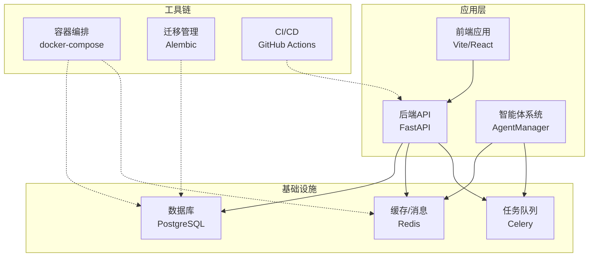
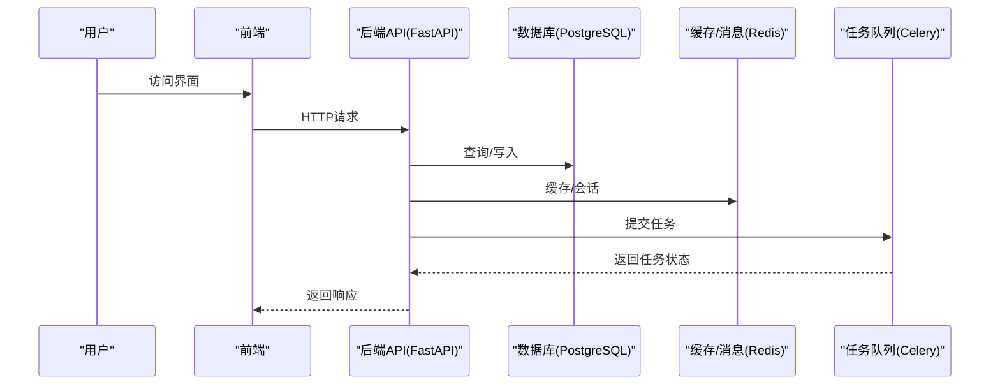
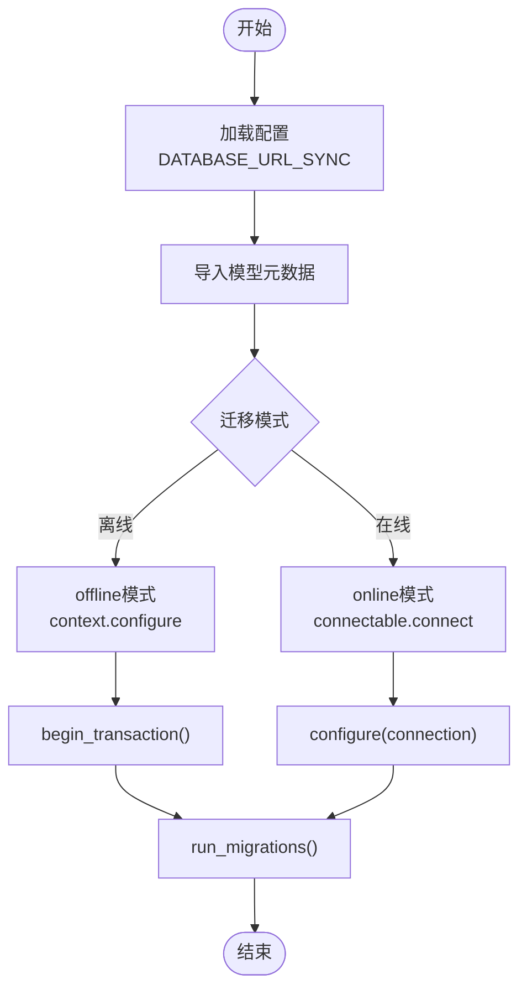
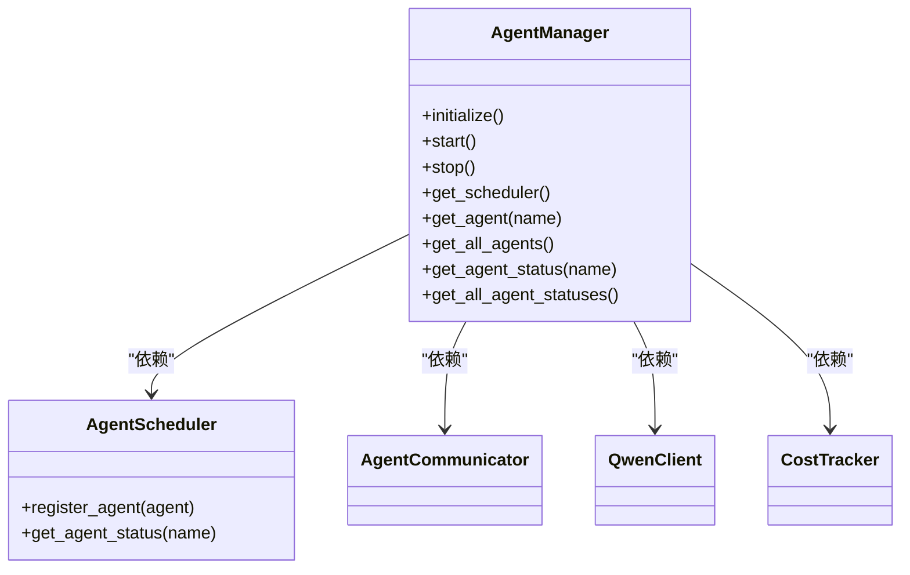
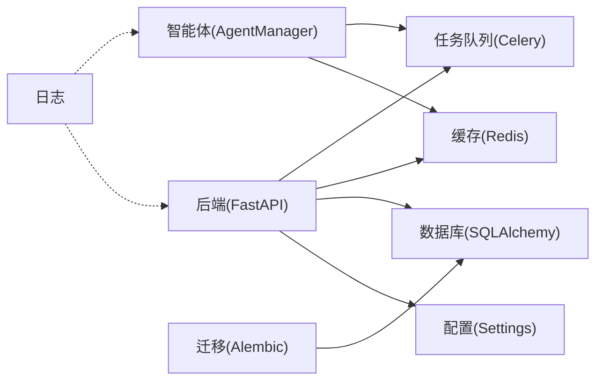

# 部署与运维

<cite>
**本文引用的文件**
- [docker-compose.yml](file://docker-compose.yml)
- [pyproject.toml](file://pyproject.toml)
- [backend/main.py](file://backend/main.py)
- [backend/config.py](file://backend/config.py)
- [core/database.py](file://core/database.py)
- [alembic/env.py](file://alembic/env.py)
- [alembic.ini](file://alembic.ini)
- [workers/celery_app.py](file://workers/celery_app.py)
- [agents/agent_manager.py](file://agents/agent_manager.py)
- [scripts/start_agents.sh](file://scripts/start_agents.sh)
- [.github/workflows/playwright.yml](file://.github/workflows/playwright.yml)
- [core/logging_config.py](file://core/logging_config.py)
- [llm/qwen_client.py](file://llm/qwen_client.py)
- [scripts/auto_novel_process.py](file://scripts/auto_novel_process.py)
- [.env](file://.env)
- [.env.example](file://.env.example)
</cite>

## 更新摘要
**所做变更**
- 更新了生产环境安全配置章节，反映 APP_DEBUG 环境变量已设置为 false
- 新增了环境变量配置最佳实践章节
- 更新了日志管理和安全加固相关内容
- 增强了生产环境部署的安全性指导

## 目录
1. [简介](#简介)
2. [项目结构](#项目结构)
3. [核心组件](#核心组件)
4. [架构总览](#架构总览)
5. [详细组件分析](#详细组件分析)
6. [依赖关系分析](#依赖关系分析)
7. [性能考虑](#性能考虑)
8. [故障排除指南](#故障排除指南)
9. [结论](#结论)
10. [附录](#附录)

## 简介
本指南面向DevOps工程师与系统管理员，提供小说生成系统的部署与运维全栈方案。内容覆盖容器化部署（镜像构建、容器编排、环境配置、服务发现）、CI/CD流水线（GitHub Actions、自动化测试、持续集成、自动化部署）、生产监控（性能指标、日志管理、告警、健康检查）、数据库迁移（Alembic版本控制、备份恢复、滚动更新）、负载均衡与SSL、安全加固、智能体系统的分布式部署与任务调度、故障排除、性能调优与容量规划。

**更新** 本版本特别强调生产环境安全配置，包括 APP_DEBUG 环境变量的安全设置和相关安全加固措施。

## 项目结构
该系统采用前后端分离与后端服务化架构：后端基于FastAPI提供REST API；数据库使用PostgreSQL；缓存使用Redis；任务队列使用Celery + Redis；智能体系统通过AgentManager集中管理；前端使用Vite+React；测试包含Playwright端到端测试；数据库迁移使用Alembic。

**图表来源**
- [docker-compose.yml](file://docker-compose.yml#L1-L25)
- [backend/main.py](file://backend/main.py#L1-L53)
- [workers/celery_app.py](file://workers/celery_app.py#L1-L26)
- [agents/agent_manager.py](file://agents/agent_manager.py#L1-L227)

**章节来源**
- [docker-compose.yml](file://docker-compose.yml#L1-L25)
- [backend/main.py](file://backend/main.py#L1-L53)
- [workers/celery_app.py](file://workers/celery_app.py#L1-L26)
- [agents/agent_manager.py](file://agents/agent_manager.py#L1-L227)

## 核心组件
- 应用入口与路由：后端以FastAPI为主入口，注册CORS中间件与API路由，提供根与健康检查端点。
- 配置中心：统一读取环境变量，动态拼接数据库、Redis、Celery等连接串。
- 数据访问：SQLAlchemy异步引擎与会话工厂，提供数据库连接池与事务管理。
- 任务队列：Celery应用配置，连接Redis作为Broker与结果后端，设置时延、并发与限流参数。
- 智能体系统：AgentManager单例管理多个Agent，通过AgentCommunicator与AgentScheduler协调任务。
- 日志系统：统一日志配置，控制台与文件轮转日志，降低第三方库噪音。
- LLM客户端：QwenClient封装DashScope/OpenAI兼容模式，支持重试与流式输出。
- 数据库迁移：Alembic环境配置覆盖同步URL，导入模型元数据，支持离线/在线迁移。

**章节来源**
- [backend/main.py](file://backend/main.py#L1-L53)
- [backend/config.py](file://backend/config.py#L1-L59)
- [core/database.py](file://core/database.py#L1-L35)
- [workers/celery_app.py](file://workers/celery_app.py#L1-L26)
- [agents/agent_manager.py](file://agents/agent_manager.py#L1-L227)
- [core/logging_config.py](file://core/logging_config.py#L1-L55)
- [llm/qwen_client.py](file://llm/qwen_client.py#L1-L232)
- [alembic/env.py](file://alembic/env.py#L1-L66)

## 架构总览
系统采用微服务风格的单体后端，辅以外部数据库、缓存与任务队列。容器编排通过docker-compose快速拉起PostgreSQL与Redis；后端服务暴露REST API；智能体系统与任务队列解耦；前端通过API与后端交互。

**图表来源**
- [backend/main.py](file://backend/main.py#L1-L53)
- [core/database.py](file://core/database.py#L1-L35)
- [workers/celery_app.py](file://workers/celery_app.py#L1-L26)

## 详细组件分析

### 容器化与编排
- Postgres与Redis服务通过docker-compose定义，挂载卷持久化数据，端口映射便于本地调试。
- 建议在生产环境增加网络隔离、资源限制、健康检查与只读卷策略。

**章节来源**
- [docker-compose.yml](file://docker-compose.yml#L1-L25)

### 配置与环境变量
- Settings类集中管理LLM、数据库、Redis、Celery、应用、加密、爬虫等配置项。
- 动态拼接DATABASE_URL与DATABASE_URL_SYNC，满足异步与同步场景。
- 支持从.env文件加载，APP_DEBUG影响日志级别与SQL回显。

**更新** 生产环境已将 APP_DEBUG 设置为 false，增强了安全性并减少了敏感信息泄露风险。

**章节来源**
- [backend/config.py](file://backend/config.py#L1-L59)
- [core/logging_config.py](file://core/logging_config.py#L1-L55)
- [.env](file://.env#L19)

### 环境变量配置最佳实践
- 开发环境：APP_DEBUG=true，便于调试和问题排查
- 生产环境：APP_DEBUG=false，禁用调试模式，减少安全风险
- 使用 .env.example 作为开发环境模板，确保新环境的一致性
- 所有敏感配置应通过环境变量注入，避免硬编码

**新增章节**

### 数据库与迁移
- SQLAlchemy异步引擎配置连接池与溢出，get_db提供事务与异常回滚。
- Alembic环境覆盖sqlalchemy.url为同步URL，导入模型元数据，支持离线/在线迁移。
- 建议在生产环境使用只读迁移用户、备份策略与灰度发布。

**图表来源**
- [alembic/env.py](file://alembic/env.py#L1-L66)
- [alembic.ini](file://alembic.ini#L1-L150)

**章节来源**
- [core/database.py](file://core/database.py#L1-L35)
- [alembic/env.py](file://alembic/env.py#L1-L66)
- [alembic.ini](file://alembic.ini#L1-L150)

### 任务队列与工作进程
- Celery应用连接Redis，启用UTC、序列化、时延限制与并发控制。
- autodiscover_tasks自动发现workers模块中的任务。
- 建议在生产环境使用独立worker节点、持久化任务、重试策略与死信队列。

**章节来源**
- [workers/celery_app.py](file://workers/celery_app.py#L1-L26)

### 智能体系统与分布式部署
- AgentManager单例初始化AgentCommunicator、AgentScheduler、QwenClient与CostTracker。
- 通过register_agent注册多种Agent，支持查询状态与统一启停。
- 建议将Agent系统拆分为独立服务或容器，结合Kubernetes进行水平扩展与弹性伸缩。

**图表来源**
- [agents/agent_manager.py](file://agents/agent_manager.py#L1-L227)

**章节来源**
- [agents/agent_manager.py](file://agents/agent_manager.py#L1-L227)

### 日志与健康检查
- 统一日志配置，INFO/DEBUG级别由APP_DEBUG控制，文件轮转避免磁盘膨胀。
- 后端提供/health健康检查端点，可用于容器探针与负载均衡健康检查。

**更新** 生产环境 APP_DEBUG=false，日志级别为INFO，减少了敏感信息的日志输出，提高了安全性。

**章节来源**
- [core/logging_config.py](file://core/logging_config.py#L1-L55)
- [backend/main.py](file://backend/main.py#L46-L53)

### LLM客户端与重试
- QwenClient支持DashScope与OpenAI兼容两种模式，内置指数退避重试与流式输出。
- 建议在生产环境配置熔断、降级与速率限制，避免上游波动影响系统稳定性。

**章节来源**
- [llm/qwen_client.py](file://llm/qwen_client.py#L1-L232)

### 自动化流程与脚本
- scripts/auto_novel_process.py定义了从市场分析到发布的完整流程，包含任务提交与等待逻辑。
- scripts/start_agents.sh提供Agent系统启动脚本，记录PID与日志。

**章节来源**
- [scripts/auto_novel_process.py](file://scripts/auto_novel_process.py#L1-L272)
- [scripts/start_agents.sh](file://scripts/start_agents.sh#L1-L35)

### CI/CD与测试
- GitHub Actions Playwright工作流在push/pull_request触发，安装Node与浏览器依赖，运行端到端测试并上传报告。
- 建议补充后端单元/集成测试、静态检查与构建产物发布流程。

**章节来源**
- [.github/workflows/playwright.yml](file://.github/workflows/playwright.yml#L1-L28)

### 生产环境安全配置
- APP_DEBUG 环境变量已设置为 false，确保生产环境不输出调试信息
- FastAPI实例的 debug 参数使用 settings.APP_DEBUG，实现安全的生产部署
- 日志系统根据 APP_DEBUG 动态调整日志级别，生产环境为 INFO 级别
- 建议在生产环境使用只读配置文件、最小权限原则和定期安全审计

**新增章节**

## 依赖关系分析
系统主要依赖关系如下：后端依赖数据库与缓存；任务队列依赖缓存；智能体系统依赖缓存与任务队列；日志系统贯穿各模块；配置中心为所有组件提供统一参数。

**图表来源**
- [backend/main.py](file://backend/main.py#L1-L53)
- [backend/config.py](file://backend/config.py#L1-L59)
- [core/database.py](file://core/database.py#L1-L35)
- [workers/celery_app.py](file://workers/celery_app.py#L1-L26)
- [agents/agent_manager.py](file://agents/agent_manager.py#L1-L227)
- [core/logging_config.py](file://core/logging_config.py#L1-L55)
- [alembic/env.py](file://alembic/env.py#L1-L66)

**章节来源**
- [backend/main.py](file://backend/main.py#L1-L53)
- [backend/config.py](file://backend/config.py#L1-L59)
- [core/database.py](file://core/database.py#L1-L35)
- [workers/celery_app.py](file://workers/celery_app.py#L1-L26)
- [agents/agent_manager.py](file://agents/agent_manager.py#L1-L227)
- [core/logging_config.py](file://core/logging_config.py#L1-L55)
- [alembic/env.py](file://alembic/env.py#L1-L66)

## 性能考虑
- 数据库连接池：合理设置pool_size与max_overflow，避免连接争用；在高并发下启用连接复用与超时控制。
- 异步I/O：保持LLM调用与数据库操作异步化，减少阻塞；对长耗时任务使用Celery后台执行。
- 缓存策略：热点数据放入Redis，设置合理TTL与淘汰策略；对写多读少场景使用延迟删除。
- 任务队列：根据任务特性调整worker_concurrency与prefetch_multiplier；对长任务设置硬/软超时。
- 日志与追踪：生产环境降低日志级别，避免I/O瓶颈；为关键路径打点埋点，配合APM系统。
- 前端性能：构建产物压缩与缓存，CDN分发静态资源。

**更新** 生产环境 APP_DEBUG=false 已优化日志性能，减少了 DEBUG 级别的日志输出开销。

## 故障排除指南
- 健康检查失败
  - 检查/health端点可达性与返回值。
  - 排查数据库连接字符串与端口映射。
- 数据库无法连接
  - 校验DATABASE_URL与DB_HOST/PORT；确认Postgres服务已启动且端口映射正确。
  - 查看容器日志与卷挂载状态。
- 任务队列无响应
  - 确认Redis可用；检查CELERY_BROKER_URL/RESULT_BACKEND。
  - 查看worker日志与并发配置。
- 智能体系统异常
  - 检查AgentManager初始化日志；核对AgentCommunicator与QwenClient配置。
- LLM调用失败
  - 校验DASHSCOPE_API_KEY与BASE_URL；查看重试日志与超时设置。
- 日志过大
  - 检查RotatingFileHandler配置与磁盘空间；必要时调整备份数量与大小阈值。
- 安全配置问题
  - 确认 APP_DEBUG=false 已正确加载；检查环境变量优先级。
  - 验证生产环境日志级别为INFO而非DEBUG。

**更新** 新增了安全配置相关的故障排除指导。

**章节来源**
- [backend/main.py](file://backend/main.py#L46-L53)
- [backend/config.py](file://backend/config.py#L1-L59)
- [core/database.py](file://core/database.py#L1-L35)
- [workers/celery_app.py](file://workers/celery_app.py#L1-L26)
- [agents/agent_manager.py](file://agents/agent_manager.py#L1-L227)
- [llm/qwen_client.py](file://llm/qwen_client.py#L1-L232)
- [core/logging_config.py](file://core/logging_config.py#L1-L55)

## 结论
本指南提供了小说生成系统的端到端部署与运维实践，涵盖容器化、配置管理、任务调度、智能体系统、数据库迁移、CI/CD与监控等关键环节。**更新** 本版本特别强调了生产环境安全配置的重要性，包括 APP_DEBUG 环境变量的安全设置、日志级别的优化以及相关的安全加固措施。建议在生产环境中进一步完善安全加固、负载均衡与SSL、备份恢复与滚动更新策略，并结合容量规划与性能压测，确保系统稳定与可扩展。

## 附录

### Docker容器化部署流程（建议）
- 镜像构建
  - 使用Poetry管理Python依赖，构建轻量镜像。
  - 在镜像中预装数据库迁移工具，启动时自动执行迁移。
- 容器编排
  - 使用docker-compose拉起Postgres与Redis；在生产环境使用Kubernetes管理。
  - 配置环境变量文件与密钥管理，避免明文存储。
- 环境配置
  - 通过Settings集中管理配置，区分development/staging/production。
- 服务发现
  - 生产环境使用服务网格或K8s服务发现，结合负载均衡与健康检查。

**章节来源**
- [docker-compose.yml](file://docker-compose.yml#L1-L25)
- [backend/config.py](file://backend/config.py#L1-L59)
- [pyproject.toml](file://pyproject.toml#L1-L64)

### CI/CD流水线设计（建议）
- GitHub Actions
  - 增加后端测试与静态检查步骤；在PR与main分支分别执行不同粒度的测试。
  - 增加构建与制品发布流程，结合Docker镜像推送。
- 自动化测试
  - 补充后端单元/集成测试；保留Playwright端到端测试。
- 持续集成与部署
  - 使用蓝绿/金丝雀发布策略，结合数据库迁移与滚动更新。

**章节来源**
- [.github/workflows/playwright.yml](file://.github/workflows/playwright.yml#L1-L28)

### 生产环境监控策略（建议）
- 性能指标
  - 收集CPU、内存、磁盘、网络、数据库连接数、任务队列积压等指标。
- 日志管理
  - 统一日志采集与归档，建立索引与检索能力。
- 告警机制
  - 基于阈值与异常检测设置告警，区分严重/警告级别。
- 健康检查
  - 使用/health端点与容器探针，结合外部探测服务。

**章节来源**
- [backend/main.py](file://backend/main.py#L46-L53)
- [core/logging_config.py](file://core/logging_config.py#L1-L55)

### 数据库迁移管理（建议）
- 版本控制
  - 使用Alembic管理迁移脚本，遵循"不可破坏"原则。
- 备份与恢复
  - 定期备份Postgres数据，验证恢复流程。
- 滚动更新策略
  - 使用零停机迁移，先升级Schema再重启服务。

**章节来源**
- [alembic/env.py](file://alembic/env.py#L1-L66)
- [alembic.ini](file://alembic.ini#L1-L150)

### 负载均衡与SSL（建议）
- 负载均衡
  - 使用Nginx或Ingress分发请求，开启健康检查与会话亲和。
- SSL证书
  - 使用Let's Encrypt自动签发与续期，强制HTTPS。
- 安全加固
  - 限制暴露端口、启用WAF、最小权限原则、密钥轮换。

### 智能体系统的分布式部署（建议）
- 任务调度
  - 将Agent系统拆分为独立服务，使用K8s Deployment与HPA。
- 资源监控
  - 为Agent与Worker设置资源配额与监控面板。
- 可靠性
  - 使用任务重试、幂等设计与死信队列保障可靠性。

**章节来源**
- [agents/agent_manager.py](file://agents/agent_manager.py#L1-L227)
- [workers/celery_app.py](file://workers/celery_app.py#L1-L26)

### 环境变量配置管理（建议）
- 开发环境配置
  - APP_DEBUG=true，便于调试和问题排查
  - 使用 .env.example 作为开发环境模板
- 生产环境配置
  - APP_DEBUG=false，禁用调试模式，减少安全风险
  - 使用只读配置文件和环境变量注入
- 安全最佳实践
  - 所有敏感配置通过环境变量注入
  - 避免硬编码任何敏感信息
  - 定期轮换API密钥和数据库密码

**新增章节**