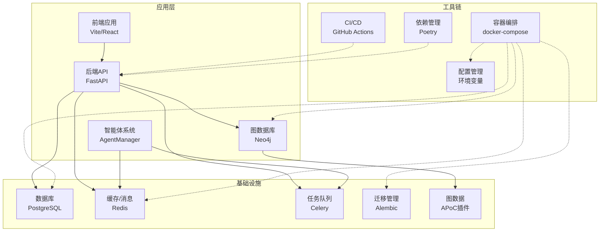
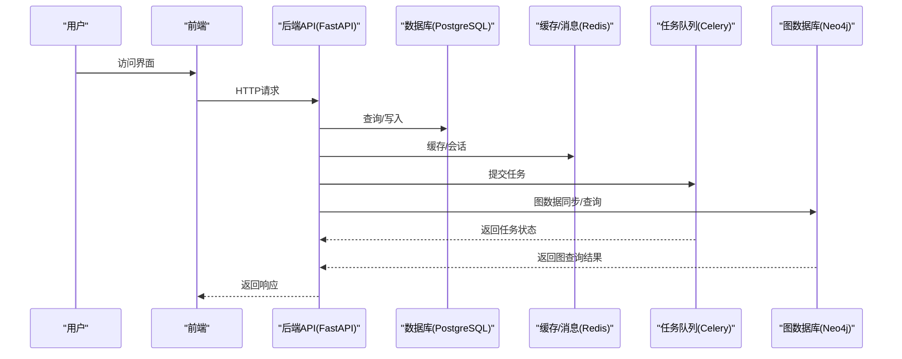
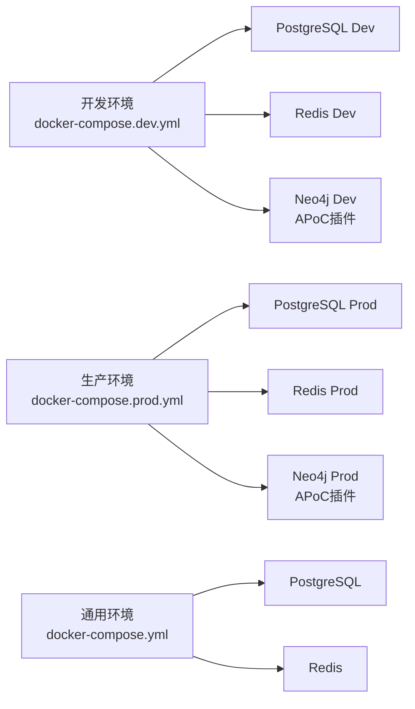
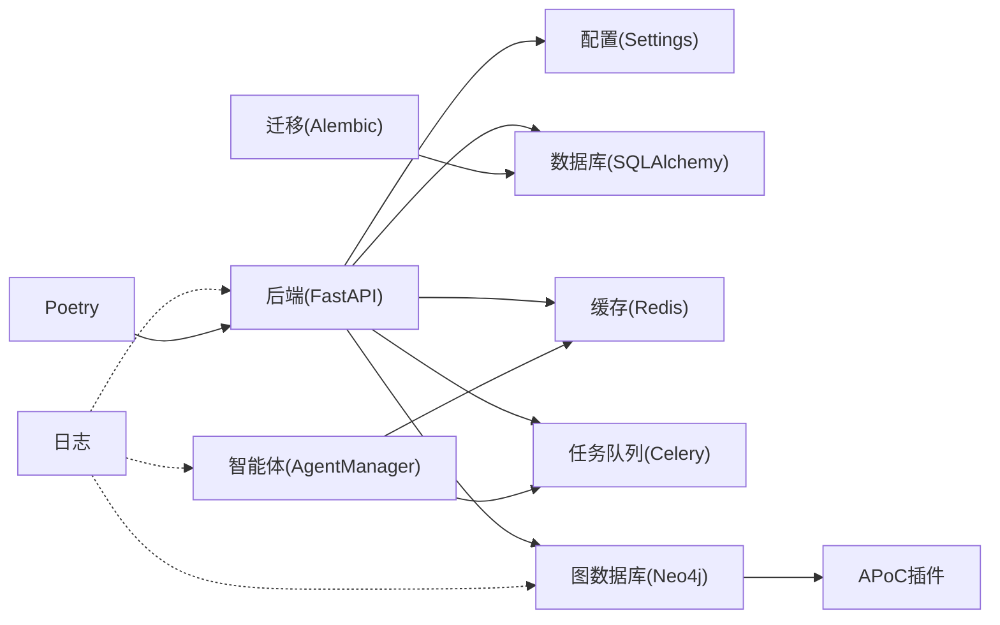

# 部署与运维

<cite>
**本文引用的文件**
- [docker-compose.yml](file://docker-compose.yml)
- [docker-compose.dev.yml](file://docker-compose.dev.yml)
- [docker-compose.prod.yml](file://docker-compose.prod.yml)
- [backend/Dockerfile](file://backend/Dockerfile)
- [core/graph/neo4j_client.py](file://core/graph/neo4j_client.py)
- [core/graph/graph_models.py](file://core/graph/graph_models.py)
- [core/graph/relationship_mapper.py](file://core/graph/relationship_mapper.py)
- [backend/services/graph_sync_service.py](file://backend/services/graph_sync_service.py)
- [backend/api/v1/graph.py](file://backend/api/v1/graph.py)
- [backend/config.py](file://backend/config.py)
- [pyproject.toml](file://pyproject.toml)
- [poetry.lock](file://poetry.lock)
- [requirements.txt](file://requirements.txt)
- [requirements-dev.txt](file://requirements-dev.txt)
- [.github/workflows/playwright.yml](file://.github/workflows/playwright.yml)
- [core/logging_config.py](file://core/logging_config.py)
- [llm/qwen_client.py](file://llm/qwen_client.py)
- [scripts/auto_novel_process.py](file://scripts/auto_novel_process.py)
- [.env](file://.env)
- [.env.example](file://.env.example)
- [CHANGELOG.md](file://CHANGELOG.md)
- [LOCAL_DEV_GUIDE.md](file://LOCAL_DEV_GUIDE.md)
</cite>

## 更新摘要
**所做变更**
- 新增Docker Compose配置文件：docker-compose.dev.yml和docker-compose.prod.yml，提供开发和生产环境的完整容器编排
- 新增图数据库部署支持：完整集成Neo4j图数据库，包括APoC插件、内存配置、持久化卷
- 新增图数据库API端点：提供图数据库健康检查、连接初始化、数据同步、查询等完整功能
- 新增图数据同步服务：支持章节实体同步、角色关系同步、伏笔管理等
- 新增图数据模型：定义角色、地点、事件、势力、伏笔等节点类型和关系类型
- 新增环境变量管理：支持ENABLE_GRAPH_DATABASE、NEO4J_URI、NEO4J_USER、NEO4J_PASSWORD等图数据库配置

## 目录
1. [简介](#简介)
2. [项目结构](#项目结构)
3. [核心组件](#核心组件)
4. [架构总览](#架构总览)
5. [详细组件分析](#详细组件分析)
6. [依赖关系分析](#依赖关系分析)
7. [性能考虑](#性能考虑)
8. [故障排除指南](#故障排除指南)
9. [结论](#结论)
10. [附录](#附录)

## 简介
本指南面向DevOps工程师与系统管理员，提供小说生成系统的部署与运维全栈方案。内容覆盖容器化部署（镜像构建、容器编排、环境配置、服务发现）、CI/CD流水线（GitHub Actions、自动化测试、持续集成、自动化部署）、生产监控（性能指标、日志管理、告警、健康检查）、数据库迁移（Alembic版本控制、备份恢复、滚动更新）、负载均衡与SSL、安全加固、智能体系统的分布式部署与任务调度、图数据库部署与管理、故障排除、性能调优与容量规划。

**更新** 本版本特别强调了Docker Compose多环境配置和图数据库（Neo4j）的完整集成，包括开发环境和生产环境的差异化配置、APoC插件支持、内存优化配置和持久化卷管理。

## 项目结构
该系统采用前后端分离与后端服务化架构：后端基于FastAPI提供REST API；数据库使用PostgreSQL；缓存使用Redis；任务队列使用Celery + Redis；智能体系统通过AgentManager集中管理；前端使用Vite+React；测试包含Playwright端到端测试；数据库迁移使用Alembic；**新增** 图数据库使用Neo4j，提供实体关系图谱分析能力。



**图表来源**
- [docker-compose.yml:1-113](file://docker-compose.yml#L1-L113)
- [docker-compose.dev.yml:1-117](file://docker-compose.dev.yml#L1-L117)
- [docker-compose.prod.yml:1-124](file://docker-compose.prod.yml#L1-L124)
- [backend/main.py:1-53](file://backend/main.py#L1-L53)
- [workers/celery_app.py:1-26](file://workers/celery_app.py#L1-L26)
- [agents/agent_manager.py:1-227](file://agents/agent_manager.py#L1-L227)
- [core/graph/neo4j_client.py:1-549](file://core/graph/neo4j_client.py#L1-L549)

**章节来源**
- [docker-compose.yml:1-113](file://docker-compose.yml#L1-L113)
- [docker-compose.dev.yml:1-117](file://docker-compose.dev.yml#L1-L117)
- [docker-compose.prod.yml:1-124](file://docker-compose.prod.yml#L1-L124)
- [backend/main.py:1-53](file://backend/main.py#L1-L53)
- [workers/celery_app.py:1-26](file://workers/celery_app.py#L1-L26)
- [agents/agent_manager.py:1-227](file://agents/agent_manager.py#L1-L227)
- [core/graph/neo4j_client.py:1-549](file://core/graph/neo4j_client.py#L1-L549)

## 核心组件
- 应用入口与路由：后端以FastAPI为主入口，注册CORS中间件与API路由，提供根与健康检查端点。
- 配置中心：统一读取环境变量，动态拼接数据库、Redis、Celery、**新增** Neo4j等连接串。
- 数据访问：SQLAlchemy异步引擎与会话工厂，提供数据库连接池与事务管理。
- 任务队列：Celery应用配置，连接Redis作为Broker与结果后端，设置时延、并发与限流参数。
- 智能体系统：AgentManager单例管理多个Agent，通过AgentCommunicator与AgentScheduler协调任务。
- 图数据库系统：**新增** Neo4j客户端管理，支持连接池、事务管理、健康检查，提供APoC插件支持。
- 图数据模型：**新增** 定义角色、地点、事件、势力、伏笔等节点类型和关系类型。
- 图同步服务：**新增** 支持章节实体同步、角色关系同步、全量同步等功能。
- 日志系统：统一日志配置，控制台与文件轮转日志，降低第三方库噪音。
- LLM客户端：QwenClient封装DashScope/OpenAI兼容模式，支持重试与流式输出。
- 数据库迁移：Alembic环境配置覆盖同步URL，导入模型元数据，支持离线/在线迁移。

**章节来源**
- [backend/main.py:1-53](file://backend/main.py#L1-L53)
- [backend/config.py:1-59](file://backend/config.py#L1-L59)
- [core/database.py:1-35](file://core/database.py#L1-L35)
- [workers/celery_app.py:1-26](file://workers/celery_app.py#L1-L26)
- [agents/agent_manager.py:1-227](file://agents/agent_manager.py#L1-L227)
- [core/graph/neo4j_client.py:1-549](file://core/graph/neo4j_client.py#L1-L549)
- [core/graph/graph_models.py:1-463](file://core/graph/graph_models.py#L1-L463)
- [core/graph/relationship_mapper.py:1-226](file://core/graph/relationship_mapper.py#L1-L226)
- [backend/services/graph_sync_service.py:1-596](file://backend/services/graph_sync_service.py#L1-L596)
- [core/logging_config.py:1-55](file://core/logging_config.py#L1-L55)
- [llm/qwen_client.py:1-232](file://llm/qwen_client.py#L1-L232)
- [alembic/env.py:1-66](file://alembic/env.py#L1-L66)

## 架构总览
系统采用微服务风格的单体后端，辅以外部数据库、缓存、任务队列和图数据库。容器编排通过docker-compose快速拉起PostgreSQL、Redis和**新增** Neo4j；后端服务暴露REST API；智能体系统与任务队列解耦；前端通过API与后端交互；**新增** 图数据库提供实体关系分析能力。



**图表来源**
- [backend/main.py:1-53](file://backend/main.py#L1-L53)
- [core/database.py:1-35](file://core/database.py#L1-L35)
- [workers/celery_app.py:1-26](file://workers/celery_app.py#L1-L26)
- [core/graph/neo4j_client.py:1-549](file://core/graph/neo4j_client.py#L1-L549)

## 详细组件分析

### Docker Compose多环境配置
- **开发环境**（docker-compose.dev.yml）：提供独立的开发网络，包含PostgreSQL、Redis、**新增** Neo4j开发服务，支持热重载和调试端口映射。
- **生产环境**（docker-compose.prod.yml）：提供生产级配置，包含PostgreSQL、Redis、**新增** Neo4j生产服务，支持健康检查、重启策略和端口映射。
- **通用配置**（docker-compose.yml）：基础容器编排，适用于简单部署场景。



**图表来源**
- [docker-compose.dev.yml:1-117](file://docker-compose.dev.yml#L1-L117)
- [docker-compose.prod.yml:1-124](file://docker-compose.prod.yml#L1-L124)
- [docker-compose.yml:1-113](file://docker-compose.yml#L1-L113)

**章节来源**
- [docker-compose.dev.yml:1-117](file://docker-compose.dev.yml#L1-L117)
- [docker-compose.prod.yml:1-124](file://docker-compose.prod.yml#L1-L124)
- [docker-compose.yml:1-113](file://docker-compose.yml#L1-L113)

### 图数据库部署与配置
- **Neo4j服务配置**：支持APoC插件、内存配置（堆内存、页面缓存）、持久化卷挂载。
- **环境变量管理**：ENABLE_GRAPH_DATABASE控制图数据库开关，NEO4J_URI、NEO4J_USER、NEO4J_PASSWORD提供连接配置。
- **Docker网络**：开发环境使用novel_dev_network，生产环境使用app-network，确保服务间通信。
- **健康检查**：支持Neo4j健康检查，包含启动延迟和重试机制。

**更新** 新增了完整的图数据库部署配置，包括APoC插件支持和内存优化配置。

**章节来源**
- [docker-compose.dev.yml:36-59](file://docker-compose.dev.yml#L36-L59)
- [docker-compose.prod.yml:34-58](file://docker-compose.prod.yml#L34-L58)
- [backend/config.py:307-338](file://backend/config.py#L307-L338)
- [core/graph/neo4j_client.py:1-549](file://core/graph/neo4j_client.py#L1-L549)

### 图数据库API端点
- **健康检查**：/novels/{novel_id}/graph/health，检查图数据库连接状态。
- **连接初始化**：/novels/{novel_id}/graph/init，手动初始化图数据库连接。
- **数据同步**：/novels/{novel_id}/graph/sync，支持全量和增量同步。
- **查询功能**：角色网络、最短路径、关系查询、一致性检查、影响力分析等。
- **实体抽取**：从章节内容中抽取实体，支持批量处理。

```mermaid
classDiagram
class GraphAPI {
+GET /graph/health
+POST /graph/init
+POST /graph/sync
+GET /graph/network/{name}
+GET /graph/path
+GET /graph/relationships
+GET /graph/conflicts
+GET /graph/influence/{name}
+GET /graph/timeline
+GET /graph/foreshadowings/pending
+POST /graph/extract
+POST /graph/extract/batch
}
class GraphSyncService {
+sync_novel_full()
+sync_chapter_entities()
+sync_character_relationships()
+delete_novel_graph()
}
class Neo4jClient {
+connect()
+execute_query()
+create_node()
+create_relationship()
+health_check()
}
GraphAPI --> GraphSyncService : "调用"
GraphSyncService --> Neo4jClient : "使用"
```

**图表来源**
- [backend/api/v1/graph.py:35-581](file://backend/api/v1/graph.py#L35-L581)
- [backend/services/graph_sync_service.py:61-596](file://backend/services/graph_sync_service.py#L61-L596)
- [core/graph/neo4j_client.py:133-549](file://core/graph/neo4j_client.py#L133-L549)

**章节来源**
- [backend/api/v1/graph.py:35-581](file://backend/api/v1/graph.py#L35-L581)
- [backend/services/graph_sync_service.py:61-596](file://backend/services/graph_sync_service.py#L61-L596)
- [core/graph/neo4j_client.py:133-549](file://core/graph/neo4j_client.py#L133-L549)

### 图数据模型与关系映射
- **节点类型**：角色(Character)、地点(Location)、事件(Event)、势力(Faction)、伏笔(Foreshadowing)。
- **关系类型**：角色间关系、角色-地点关系、角色-事件关系、角色-势力关系、事件关系、势力关系、地点关系。
- **关系映射**：支持对称和非对称关系，提供关系反转和分类功能。
- **数据转换**：支持Python模型与Neo4j节点属性的双向转换。

**章节来源**
- [core/graph/graph_models.py:14-463](file://core/graph/graph_models.py#L14-L463)
- [core/graph/relationship_mapper.py:12-226](file://core/graph/relationship_mapper.py#L12-L226)

### 配置与环境变量
- Settings类集中管理LLM、数据库、Redis、Celery、**新增** Neo4j、应用、加密、爬虫等配置项。
- 动态拼接DATABASE_URL与DATABASE_URL_SYNC，满足异步与同步场景。
- **新增** 图数据库配置：ENABLE_GRAPH_DATABASE、NEO4J_URI、NEO4J_USER、NEO4J_PASSWORD、NEO4J_DATABASE等。
- 支持从.env文件加载，APP_DEBUG影响日志级别与SQL回显。

**章节来源**
- [backend/config.py:1-59](file://backend/config.py#L1-L59)
- [core/logging_config.py:1-55](file://core/logging_config.py#L1-L55)
- [.env](file://.env#L19)

### 依赖管理与Poetry集成
- **新增** Poetry作为主要依赖管理工具，支持开发依赖与生产依赖分离。
- **新增** neo4j Python驱动：支持Neo4j连接和查询操作。
- **新增** APoC插件支持：通过Neo4j配置启用APoC功能。
- 依赖锁定文件确保环境一致性，支持多平台兼容性。

**章节来源**
- [pyproject.toml:1-108](file://pyproject.toml#L1-L108)
- [poetry.lock:1-800](file://poetry.lock#L1-L800)
- [requirements.txt:1-28](file://requirements.txt#L1-L28)
- [requirements-dev.txt:1-7](file://requirements-dev.txt#L1-L7)

### 数据库与迁移
- SQLAlchemy异步引擎配置连接池与溢出，get_db提供事务与异常回滚。
- Alembic环境覆盖sqlalchemy.url为同步URL，导入模型元数据，支持离线/在线迁移。
- 建议在生产环境使用只读迁移用户、备份策略与灰度发布。

**章节来源**
- [core/database.py:1-35](file://core/database.py#L1-L35)
- [alembic/env.py:1-66](file://alembic/env.py#L1-L66)
- [alembic.ini:1-150](file://alembic.ini#L1-L150)

### 任务队列与工作进程
- Celery应用连接Redis，启用UTC、序列化、时延限制与并发控制。
- autodiscover_tasks自动发现workers模块中的任务。
- 建议在生产环境使用独立worker节点、持久化任务、重试策略与死信队列。

**章节来源**
- [workers/celery_app.py:1-26](file://workers/celery_app.py#L1-L26)

### 智能体系统与分布式部署
- AgentManager单例初始化AgentCommunicator、AgentScheduler、QwenClient与CostTracker。
- 通过register_agent注册多种Agent，支持查询状态与统一启停。
- 建议将Agent系统拆分为独立服务或容器，结合Kubernetes进行水平扩展与弹性伸缩。

**章节来源**
- [agents/agent_manager.py:1-227](file://agents/agent_manager.py#L1-L227)

### 日志与健康检查
- 统一日志配置，INFO/DEBUG级别由APP_DEBUG控制，文件轮转避免磁盘膨胀。
- 后端提供/health健康检查端点，可用于容器探针与负载均衡健康检查。
- **新增** 图数据库健康检查：支持Neo4j连接状态检查和详细信息获取。

**章节来源**
- [core/logging_config.py:1-55](file://core/logging_config.py#L1-L55)
- [backend/main.py:46-53](file://backend/main.py#L46-L53)
- [backend/api/v1/graph.py:35-70](file://backend/api/v1/graph.py#L35-L70)

### LLM客户端与重试
- QwenClient支持DashScope与OpenAI兼容两种模式，内置指数退避重试与流式输出。
- 建议在生产环境配置熔断、降级与速率限制，避免上游波动影响系统稳定性。

**章节来源**
- [llm/qwen_client.py:1-232](file://llm/qwen_client.py#L1-L232)

### 自动化流程与脚本
- scripts/auto_novel_process.py定义了从市场分析到发布的完整流程，包含任务提交与等待逻辑。
- scripts/start_agents.sh提供Agent系统启动脚本，记录PID与日志。

**章节来源**
- [scripts/auto_novel_process.py:1-272](file://scripts/auto_novel_process.py#L1-L272)
- [scripts/start_agents.sh:1-35](file://scripts/start_agents.sh#L1-L35)

### CI/CD与测试
- GitHub Actions Playwright工作流在push/pull_request触发，安装Node与浏览器依赖，运行端到端测试并上传报告。
- 建议补充后端单元/集成测试、静态检查与构建产物发布流程。

**章节来源**
- [.github/workflows/playwright.yml:1-28](file://.github/workflows/playwright.yml#L1-L28)

### 生产环境安全配置
- APP_DEBUG 环境变量已设置为 false，确保生产环境不输出调试信息
- FastAPI实例的 debug 参数使用 settings.APP_DEBUG，实现安全的生产部署
- 日志系统根据 APP_DEBUG 动态调整日志级别，生产环境为 INFO 级别
- 建议在生产环境使用只读配置文件、最小权限原则和定期安全审计

**新增章节**

### 版本管理与发布策略
- 当前版本：2.0.0（从1.2.0升级）
- **更新** 版本号格式：语义化版本控制（主版本.次版本.修订版）
- **新增** 主要版本改进：Docker Compose多环境配置、图数据库集成、Poetry依赖管理
- 变更日志：详细记录每个版本的功能改进、Bug修复和安全更新
- 发布流程：基于Git标签的自动化发布，包含版本号更新与文档同步

**章节来源**
- [pyproject.toml](file://pyproject.toml#L3)
- [CHANGELOG.md](file://CHANGELOG.md#L3)
- [backend/main.py](file://backend/main.py#L64)
- [LOCAL_DEV_GUIDE.md](file://LOCAL_DEV_GUIDE.md#L350)

## 依赖关系分析
系统主要依赖关系如下：后端依赖数据库与缓存；任务队列依赖缓存；智能体系统依赖缓存与任务队列；**新增** 图数据库依赖APoC插件；日志系统贯穿各模块；配置中心为所有组件提供统一参数。



**图表来源**
- [backend/main.py:1-53](file://backend/main.py#L1-L53)
- [backend/config.py:1-59](file://backend/config.py#L1-L59)
- [core/database.py:1-35](file://core/database.py#L1-L35)
- [workers/celery_app.py:1-26](file://workers/celery_app.py#L1-L26)
- [agents/agent_manager.py:1-227](file://agents/agent_manager.py#L1-L227)
- [core/graph/neo4j_client.py:1-549](file://core/graph/neo4j_client.py#L1-L549)
- [core/logging_config.py:1-55](file://core/logging_config.py#L1-L55)
- [alembic/env.py:1-66](file://alembic/env.py#L1-L66)

**章节来源**
- [backend/main.py:1-53](file://backend/main.py#L1-L53)
- [backend/config.py:1-59](file://backend/config.py#L1-L59)
- [core/database.py:1-35](file://core/database.py#L1-L35)
- [workers/celery_app.py:1-26](file://workers/celery_app.py#L1-L26)
- [agents/agent_manager.py:1-227](file://agents/agent_manager.py#L1-L227)
- [core/graph/neo4j_client.py:1-549](file://core/graph/neo4j_client.py#L1-L549)
- [core/logging_config.py:1-55](file://core/logging_config.py#L1-L55)
- [alembic/env.py:1-66](file://alembic/env.py#L1-L66)

## 性能考虑
- 数据库连接池：合理设置pool_size与max_overflow，避免连接争用；在高并发下启用连接复用与超时控制。
- 异步I/O：保持LLM调用与数据库操作异步化，减少阻塞；对长耗时任务使用Celery后台执行。
- 缓存策略：热点数据放入Redis，设置合理TTL与淘汰策略；对写多读少场景使用延迟删除。
- 任务队列：根据任务特性调整worker_concurrency与prefetch_multiplier；对长任务设置硬/软超时。
- **新增** 图数据库性能优化：合理配置APoC插件、内存分配、连接池大小；对复杂查询使用索引。
- **新增** Docker容器优化：开发环境使用热重载，生产环境使用健康检查与重启策略。
- 日志与追踪：生产环境降低日志级别，避免I/O瓶颈；为关键路径打点埋设，配合APM系统。
- 前端性能：构建产物压缩与缓存，CDN分发静态资源。

**更新** 新增了图数据库和Docker容器的性能优化建议。

## 故障排除指南
- 健康检查失败
  - 检查/health端点可达性与返回值。
  - 排查数据库连接字符串与端口映射。
- 数据库无法连接
  - 校验DATABASE_URL与DB_HOST/PORT；确认Postgres服务已启动且端口映射正确。
  - 查看容器日志与卷挂载状态。
- 任务队列无响应
  - 确认Redis可用；检查CELERY_BROKER_URL/RESULT_BACKEND。
  - 查看worker日志与并发配置。
- 智能体系统异常
  - 检查AgentManager初始化日志；核对AgentCommunicator与QwenClient配置。
- LLM调用失败
  - 校验DASHSCOPE_API_KEY与BASE_URL；查看重试日志与超时设置。
- **新增** 图数据库连接问题
  - 检查ENABLE_GRAPH_DATABASE配置；验证Neo4j URI与端口映射。
  - 确认APoC插件已正确安装和启用。
  - 查看Neo4j容器日志与健康检查状态。
- **新增** Docker容器问题
  - 检查容器网络配置与端口映射。
  - 验证持久化卷挂载与权限设置。
  - 查看容器重启策略与健康检查配置。
- 日志过大
  - 检查RotatingFileHandler配置与磁盘空间；必要时调整备份数量与大小阈值。
- 安全配置问题
  - 确认 APP_DEBUG=false 已正确加载；检查环境变量优先级。
  - 验证生产环境日志级别为INFO而非DEBUG。
- 版本兼容性问题
  - 确认所有组件版本兼容性，特别是FastAPI、SQLAlchemy、Celery、Neo4j等核心依赖。
  - 检查数据库迁移是否与当前版本匹配。

**更新** 新增了图数据库和Docker容器相关的故障排除指导。

**章节来源**
- [backend/main.py:46-53](file://backend/main.py#L46-L53)
- [backend/config.py:1-59](file://backend/config.py#L1-L59)
- [core/database.py:1-35](file://core/database.py#L1-L35)
- [workers/celery_app.py:1-26](file://workers/celery_app.py#L1-L26)
- [agents/agent_manager.py:1-227](file://agents/agent_manager.py#L1-L227)
- [llm/qwen_client.py:1-232](file://llm/qwen_client.py#L1-L232)
- [core/logging_config.py:1-55](file://core/logging_config.py#L1-L55)
- [core/graph/neo4j_client.py:1-549](file://core/graph/neo4j_client.py#L1-L549)
- [docker-compose.dev.yml:1-117](file://docker-compose.dev.yml#L1-L117)
- [docker-compose.prod.yml:1-124](file://docker-compose.prod.yml#L1-L124)

## 结论
本指南提供了小说生成系统的端到端部署与运维实践，涵盖容器化、配置管理、任务调度、智能体系统、**新增** 图数据库、数据库迁移、CI/CD与监控等关键环节。**更新** 本版本特别强调了Docker Compose多环境配置和图数据库（Neo4j）的完整集成，包括开发环境和生产环境的差异化配置、APoC插件支持、内存优化配置和持久化卷管理。建议在生产环境中进一步完善安全加固、负载均衡与SSL、备份恢复与滚动更新策略，并结合容量规划与性能压测，确保系统稳定与可扩展。

## 附录

### Docker容器化部署流程（建议）
- **更新** 镜像构建
  - 使用Poetry管理Python依赖，构建轻量镜像。
  - 在镜像中预装数据库迁移工具，启动时自动执行迁移。
  - **新增** 多阶段构建优化，减少镜像体积。
- 容器编排
  - 使用docker-compose拉起Postgres与Redis；在生产环境使用Kubernetes管理。
  - **新增** 支持Neo4j图数据库服务，包含APoC插件和内存配置。
  - 配置环境变量文件与密钥管理，避免明文存储。
- 环境配置
  - 通过Settings集中管理配置，区分development/staging/production。
  - **新增** 图数据库配置管理，支持ENABLE_GRAPH_DATABASE开关。
- 服务发现
  - 生产环境使用服务网格或K8s服务发现，结合负载均衡与健康检查。

**章节来源**
- [docker-compose.yml:1-113](file://docker-compose.yml#L1-L113)
- [docker-compose.dev.yml:1-117](file://docker-compose.dev.yml#L1-L117)
- [docker-compose.prod.yml:1-124](file://docker-compose.prod.yml#L1-L124)
- [backend/config.py:1-59](file://backend/config.py#L1-L59)
- [pyproject.toml:1-108](file://pyproject.toml#L1-L108)
- [backend/Dockerfile:1-54](file://backend/Dockerfile#L1-L54)

### CI/CD流水线设计（建议）
- GitHub Actions
  - 增加后端测试与静态检查步骤；在PR与main分支分别执行不同粒度的测试。
  - 增加构建与制品发布流程，结合Docker镜像推送。
  - **新增** 图数据库测试集成，验证Neo4j连接与查询功能。
- 自动化测试
  - 补充后端单元/集成测试；保留Playwright端到端测试。
  - **新增** 图数据库API测试与实体抽取测试。
- 持续集成与部署
  - 使用蓝绿/金丝雀发布策略，结合数据库迁移与滚动更新。

**章节来源**
- [.github/workflows/playwright.yml:1-28](file://.github/workflows/playwright.yml#L1-L28)

### 生产环境监控策略（建议）
- 性能指标
  - 收集CPU、内存、磁盘、网络、数据库连接数、任务队列积压等指标。
  - **新增** 图数据库监控：连接数、查询性能、APoC插件使用情况。
- 日志管理
  - 统一日志采集与归档，建立索引与检索能力。
- 告警机制
  - 基于阈值与异常检测设置告警，区分严重/警告级别。
- 健康检查
  - 使用/health端点与容器探针，结合外部探测服务。

**章节来源**
- [backend/main.py:46-53](file://backend/main.py#L46-L53)
- [core/logging_config.py:1-55](file://core/logging_config.py#L1-L55)

### 数据库迁移管理（建议）
- 版本控制
  - 使用Alembic管理迁移脚本，遵循"不可破坏"原则。
- 备份与恢复
  - 定期备份Postgres数据，验证恢复流程。
- 滚动更新策略
  - 使用零停机迁移，先升级Schema再重启服务。

**章节来源**
- [alembic/env.py:1-66](file://alembic/env.py#L1-L66)
- [alembic.ini:1-150](file://alembic.ini#L1-L150)

### 负载均衡与SSL（建议）
- 负载均衡
  - 使用Nginx或Ingress分发请求，开启健康检查与会话亲和。
- SSL证书
  - 使用Let's Encrypt自动签发与续期，强制HTTPS。
- 安全加固
  - 限制暴露端口、启用WAF、最小权限原则、密钥轮换。

### 智能体系统的分布式部署（建议）
- 任务调度
  - 将Agent系统拆分为独立服务，使用K8s Deployment与HPA。
- 资源监控
  - 为Agent与Worker设置资源配额与监控面板。
- 可靠性
  - 使用任务重试、幂等设计与死信队列保障可靠性。

**章节来源**
- [agents/agent_manager.py:1-227](file://agents/agent_manager.py#L1-L227)
- [workers/celery_app.py:1-26](file://workers/celery_app.py#L1-L26)

### 图数据库部署与管理（建议）
- 服务部署
  - 在开发环境使用latest版本，生产环境使用稳定版本（5.15-community）。
  - 配置APoC插件，启用高级图算法功能。
  - 设置合理的内存分配：初始堆内存512m-1G，最大堆内存1G-2G。
- 数据管理
  - 使用独立的数据卷和日志卷，确保数据持久化。
  - 配置健康检查，包含启动延迟和重试机制。
- 性能优化
  - 监控连接池使用情况，调整最大连接数。
  - 优化查询性能，使用适当的索引和查询计划。
- 安全配置
  - 使用强密码，避免使用默认凭据。
  - 配置防火墙规则，限制访问端口。

**新增章节**

### 环境变量配置管理（建议）
- 开发环境配置
  - APP_DEBUG=true，便于调试和问题排查
  - 使用 .env.example 作为开发环境模板
  - **新增** ENABLE_GRAPH_DATABASE=true，启用图数据库功能
- 生产环境配置
  - APP_DEBUG=false，禁用调试模式，减少安全风险
  - 使用只读配置文件和环境变量注入
  - **新增** NEO4J_PASSWORD=your_secure_password，设置图数据库密码
- 安全最佳实践
  - 所有敏感配置通过环境变量注入
  - 避免硬编码任何敏感信息
  - 定期轮换API密钥和数据库密码

### 版本管理最佳实践（建议）
- 版本号规范
  - 遵循语义化版本控制（MAJOR.MINOR.PATCH）
  - 主版本号：重大不兼容的API变更
  - 次版本号：向后兼容的功能新增
  - 修订号：向后兼容的问题修复
- 变更日志维护
  - 每个版本更新都要记录详细的变更内容
  - 包含新增功能、Bug修复、安全更新和性能改进
- 发布流程
  - 基于Git标签的自动化发布流程
  - 确保版本号与代码库同步更新
  - 验证所有测试通过后再发布

### Poetry依赖管理最佳实践（建议）
- 依赖分类
  - 使用 [tool.poetry.dependencies] 管理生产依赖
  - 使用 [tool.poetry.group.dev.dependencies] 管理开发依赖
- 锁定文件管理
  - 使用 poetry.lock 确保环境一致性
  - 定期更新依赖版本，保持安全性和稳定性
- 多平台支持
  - 支持Python 3.12+，确保跨平台兼容性
  - 使用条件依赖处理平台特定需求

### Docker Compose多环境配置最佳实践（建议）
- 环境隔离
  - 开发环境使用独立网络，避免与生产环境冲突
  - 使用不同的端口映射，避免端口冲突
- 配置管理
  - 使用环境变量文件管理敏感配置
  - 支持环境特定的配置覆盖
- 健康检查
  - 为所有服务配置健康检查
  - 设置合理的重启策略和超时时间
- 持久化存储
  - 为数据库和图数据库配置独立的数据卷
  - 确保数据持久化和备份策略