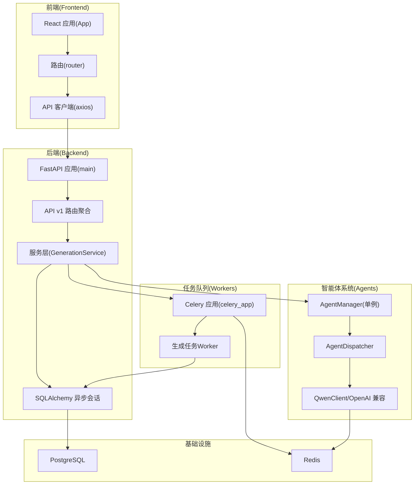
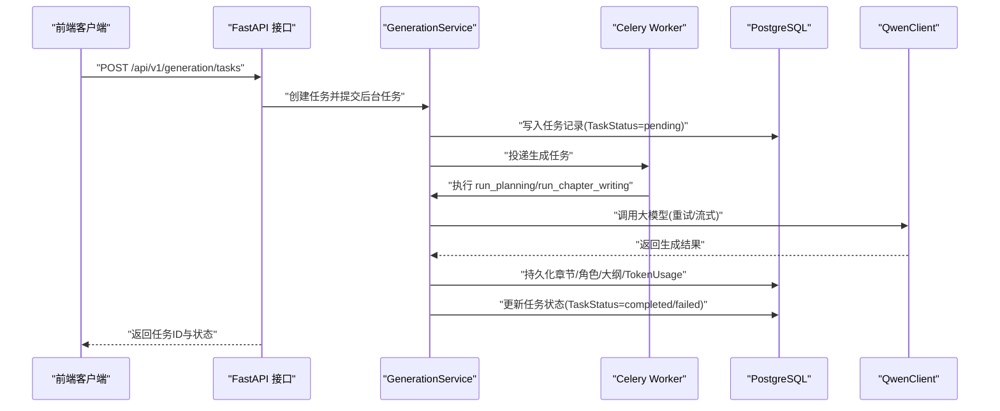
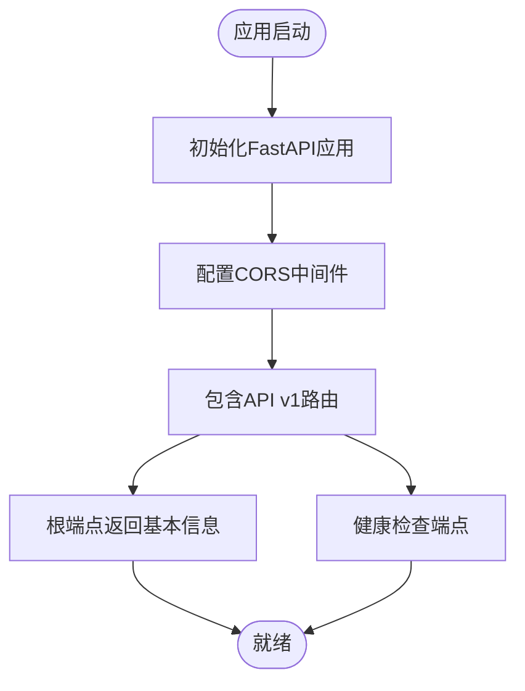
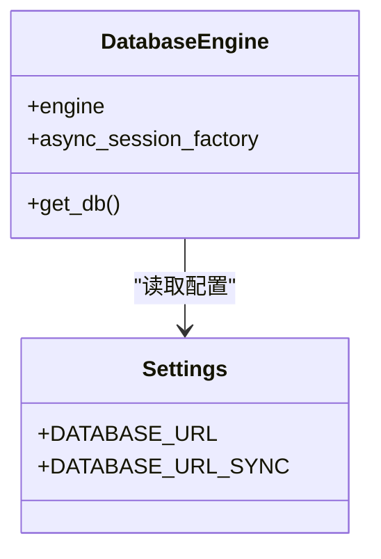
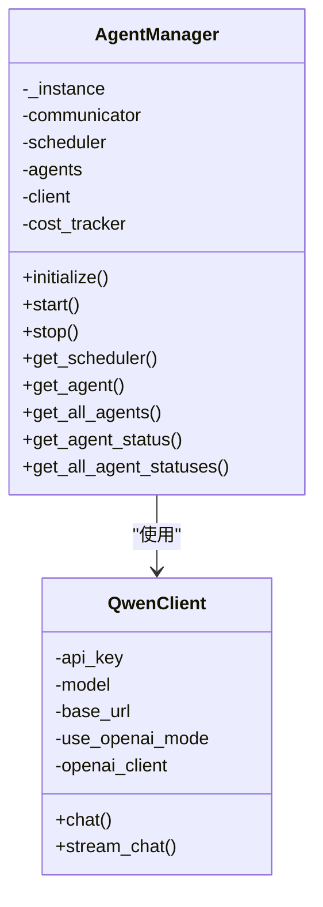
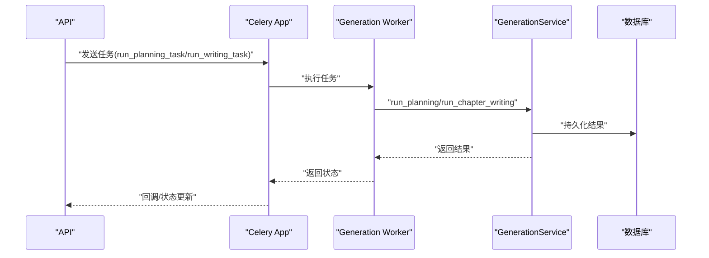
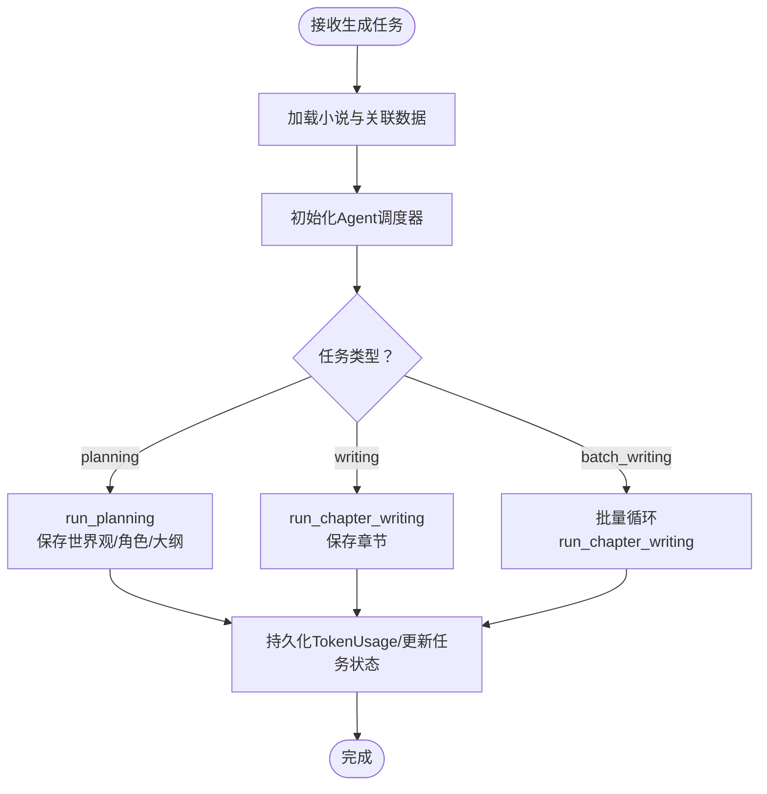
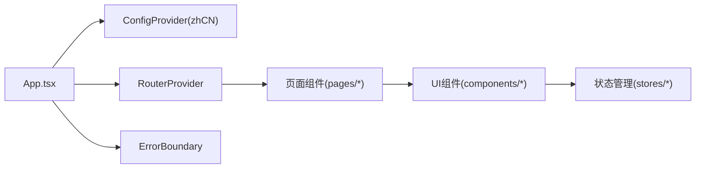
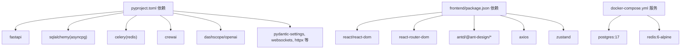

# 技术架构概览

<cite>
**本文档引用的文件**
- [backend/main.py](file://backend/main.py)
- [backend/config.py](file://backend/config.py)
- [backend/api/v1/__init__.py](file://backend/api/v1/__init__.py)
- [backend/api/v1/generation.py](file://backend/api/v1/generation.py)
- [backend/services/generation_service.py](file://backend/services/generation_service.py)
- [core/database.py](file://core/database.py)
- [workers/celery_app.py](file://workers/celery_app.py)
- [workers/generation_worker.py](file://workers/generation_worker.py)
- [agents/agent_manager.py](file://agents/agent_manager.py)
- [llm/qwen_client.py](file://llm/qwen_client.py)
- [scripts/start_agents.py](file://scripts/start_agents.py)
- [docker-compose.yml](file://docker-compose.yml)
- [frontend/src/App.tsx](file://frontend/src/App.tsx)
- [frontend/package.json](file://frontend/package.json)
- [pyproject.toml](file://pyproject.toml)
</cite>

## 目录
1. [引言](#引言)
2. [项目结构](#项目结构)
3. [核心组件](#核心组件)
4. [架构总览](#架构总览)
5. [详细组件分析](#详细组件分析)
6. [依赖关系分析](#依赖关系分析)
7. [性能考量](#性能考量)
8. [故障排查指南](#故障排查指南)
9. [结论](#结论)

## 引言
本项目是一个基于前后端分离架构的AI小说生成系统，采用微服务风格的智能体系统与事件驱动的消息通信机制，结合异步任务处理实现高并发、可扩展的小说创作流水线。系统以Python FastAPI作为后端Web框架，React作为前端界面，CrewAI智能体框架驱动多Agent协作，SQLAlchemy提供异步数据库访问，Celery配合Redis实现任务队列与异步执行，DashScope/OpenAI兼容接口提供大模型推理能力。

## 项目结构
项目采用分层与功能域混合的组织方式：
- 后端（FastAPI）：API路由聚合、服务层编排、数据库会话管理
- 核心模块（Core）：ORM模型、数据库引擎、通用异常与日志配置
- 智能体系统（Agents）：Agent生命周期管理、通信与调度、具体Agent实现
- LLM封装（LLM）：Qwen客户端、成本追踪
- 任务队列（Workers）：Celery应用与生成任务Worker
- 前端（Frontend）：React应用、路由与UI组件
- 部署与环境（Docker/Pyproject）：容器编排、依赖管理

**图表来源**
- [backend/main.py](file://backend/main.py#L15-L32)
- [backend/api/v1/__init__.py](file://backend/api/v1/__init__.py#L11-L26)
- [backend/services/generation_service.py](file://backend/services/generation_service.py#L27-L35)
- [core/database.py](file://core/database.py#L11-L22)
- [workers/celery_app.py](file://workers/celery_app.py#L6-L23)
- [workers/generation_worker.py](file://workers/generation_worker.py#L58-L69)
- [agents/agent_manager.py](file://agents/agent_manager.py#L22-L74)
- [llm/qwen_client.py](file://llm/qwen_client.py#L16-L45)

**章节来源**
- [backend/main.py](file://backend/main.py#L15-L32)
- [backend/api/v1/__init__.py](file://backend/api/v1/__init__.py#L11-L26)
- [backend/config.py](file://backend/config.py#L5-L58)
- [core/database.py](file://core/database.py#L11-L22)
- [workers/celery_app.py](file://workers/celery_app.py#L6-L23)
- [agents/agent_manager.py](file://agents/agent_manager.py#L22-L74)
- [llm/qwen_client.py](file://llm/qwen_client.py#L16-L45)
- [docker-compose.yml](file://docker-compose.yml#L1-L25)
- [frontend/src/App.tsx](file://frontend/src/App.tsx#L7-L15)
- [frontend/package.json](file://frontend/package.json#L12-L24)
- [pyproject.toml](file://pyproject.toml#L8-L36)

## 核心组件
- Web框架与路由
  - FastAPI应用负责CORS配置、根与健康检查端点、API路由聚合
  - API v1路由聚合器统一挂载各业务模块路由
- 数据层
  - SQLAlchemy异步引擎与会话工厂，支持连接池与自动回滚
  - 配置集中管理数据库、Redis、Celery、应用参数
- 智能体系统
  - AgentManager单例管理Agent生命周期，包含通信、调度、成本追踪与LLM客户端
  - QwenClient封装DashScope与OpenAI兼容模式，支持重试与流式输出
- 任务队列
  - Celery应用配置Broker/Backend为Redis，启用UTC与任务超时控制
  - 生成任务Worker在同步任务中运行异步服务逻辑
- 服务编排
  - GenerationService作为API与Agent之间的编排层，负责任务状态管理、数据持久化与成本统计

**章节来源**
- [backend/main.py](file://backend/main.py#L15-L52)
- [backend/api/v1/__init__.py](file://backend/api/v1/__init__.py#L11-L26)
- [backend/config.py](file://backend/config.py#L5-L58)
- [core/database.py](file://core/database.py#L11-L35)
- [agents/agent_manager.py](file://agents/agent_manager.py#L22-L74)
- [llm/qwen_client.py](file://llm/qwen_client.py#L16-L45)
- [workers/celery_app.py](file://workers/celery_app.py#L6-L23)
- [workers/generation_worker.py](file://workers/generation_worker.py#L58-L69)
- [backend/services/generation_service.py](file://backend/services/generation_service.py#L27-L35)

## 架构总览
系统采用“前后端分离 + 微服务风格智能体 + 事件驱动任务队列”的混合架构：
- 前端通过REST/WebSocket与后端交互，后端提供统一API入口
- 生成任务通过BackgroundTasks或Celery异步执行，避免阻塞请求线程
- 智能体系统通过AgentManager统一调度，Agent间通过通信器协作
- 数据一致性通过SQLAlchemy异步事务保证，成本与使用情况通过TokenUsage记录
- 缓存与消息通过Redis实现，Celery作为任务中间件

**图表来源**
- [backend/api/v1/generation.py](file://backend/api/v1/generation.py#L23-L103)
- [backend/services/generation_service.py](file://backend/services/generation_service.py#L36-L196)
- [workers/generation_worker.py](file://workers/generation_worker.py#L58-L69)
- [llm/qwen_client.py](file://llm/qwen_client.py#L46-L161)
- [core/database.py](file://core/database.py#L25-L35)

## 详细组件分析

### 后端Web层（FastAPI）
- 应用初始化：设置标题、版本、描述、调试开关；配置CORS允许本地前端开发服务器；注册API路由
- 根与健康检查：提供基础信息与健康状态
- 路由聚合：将novels、characters、chapters、outlines、generation、ai_chat等子路由挂载至/api/v1前缀

**图表来源**
- [backend/main.py](file://backend/main.py#L15-L32)
- [backend/api/v1/__init__.py](file://backend/api/v1/__init__.py#L11-L26)

**章节来源**
- [backend/main.py](file://backend/main.py#L15-L52)
- [backend/api/v1/__init__.py](file://backend/api/v1/__init__.py#L11-L26)

### 数据层（SQLAlchemy异步）
- 异步引擎与会话工厂：基于配置动态拼接DATABASE_URL，开启连接池与调试日志
- 依赖注入：get_db提供异步上下文，自动commit/rollback/关闭，确保事务安全
- 模型基类：统一的DeclarativeBase，便于迁移与ORM操作

**图表来源**
- [core/database.py](file://core/database.py#L11-L35)
- [backend/config.py](file://backend/config.py#L18-L27)

**章节来源**
- [core/database.py](file://core/database.py#L11-L35)
- [backend/config.py](file://backend/config.py#L18-L27)

### 智能体系统（AgentManager + QwenClient）
- AgentManager：单例模式，负责Agent初始化、注册、启动与状态查询；维护通信器、调度器、LLM客户端与成本追踪
- QwenClient：支持DashScope与OpenAI兼容两种模式；提供chat/stream_chat与指数退避重试；区分同步/异步调用场景

**图表来源**
- [agents/agent_manager.py](file://agents/agent_manager.py#L22-L74)
- [llm/qwen_client.py](file://llm/qwen_client.py#L16-L45)

**章节来源**
- [agents/agent_manager.py](file://agents/agent_manager.py#L22-L227)
- [llm/qwen_client.py](file://llm/qwen_client.py#L16-L232)

### 任务队列（Celery + Worker）
- Celery应用：Broker/Backend指向Redis，启用UTC、序列化、任务时间限制与并发控制
- Worker：在同步任务中运行异步服务逻辑，分别处理企划与单章写作任务，返回结果或错误

**图表来源**
- [workers/celery_app.py](file://workers/celery_app.py#L6-L23)
- [workers/generation_worker.py](file://workers/generation_worker.py#L58-L69)
- [backend/services/generation_service.py](file://backend/services/generation_service.py#L36-L196)

**章节来源**
- [workers/celery_app.py](file://workers/celery_app.py#L6-L26)
- [workers/generation_worker.py](file://workers/generation_worker.py#L58-L70)

### 服务编排（GenerationService）
- 企划阶段：加载小说信息，初始化Agent调度器，调用dispatcher.run_planning，持久化世界观、角色、大纲，记录TokenUsage与成本
- 单章写作：构建novel_data与前几章摘要，调用dispatcher.run_chapter_writing，保存章节与统计信息
- 批量写作：循环执行单章写作，汇总结果与失败数，更新任务状态

**图表来源**
- [backend/services/generation_service.py](file://backend/services/generation_service.py#L36-L196)
- [backend/services/generation_service.py](file://backend/services/generation_service.py#L206-L378)
- [backend/services/generation_service.py](file://backend/services/generation_service.py#L387-L556)

**章节来源**
- [backend/services/generation_service.py](file://backend/services/generation_service.py#L36-L196)
- [backend/services/generation_service.py](file://backend/services/generation_service.py#L206-L378)
- [backend/services/generation_service.py](file://backend/services/generation_service.py#L387-L556)

### 前端架构（React）
- 应用入口：Ant Design国际化配置、路由Provider、错误边界包裹
- 依赖生态：React 19、React Router、Ant Design、Axios、Zustand状态管理等

**图表来源**
- [frontend/src/App.tsx](file://frontend/src/App.tsx#L7-L15)
- [frontend/package.json](file://frontend/package.json#L12-L24)

**章节来源**
- [frontend/src/App.tsx](file://frontend/src/App.tsx#L7-L15)
- [frontend/package.json](file://frontend/package.json#L12-L24)

## 依赖关系分析
- 技术栈选择与集成
  - FastAPI + Uvicorn：高性能ASGI服务，适合高并发API
  - SQLAlchemy asyncio：异步ORM，提升数据库吞吐
  - Celery + Redis：分布式任务队列，解耦耗时任务
  - CrewAI + DashScope/OpenAI：智能体协作与大模型推理
  - React + Ant Design：现代化前端开发体验
- 外部依赖与版本约束：详见pyproject.toml中的依赖声明
- 容器化：docker-compose提供PostgreSQL与Redis服务

**图表来源**
- [pyproject.toml](file://pyproject.toml#L8-L36)
- [frontend/package.json](file://frontend/package.json#L12-L24)
- [docker-compose.yml](file://docker-compose.yml#L1-L25)

**章节来源**
- [pyproject.toml](file://pyproject.toml#L8-L36)
- [docker-compose.yml](file://docker-compose.yml#L1-L25)

## 性能考量
- 异步优先：后端使用SQLAlchemy asyncio与FastAPI异步特性，减少阻塞
- 连接池与事务：合理配置连接池大小与自动回滚，降低数据库压力
- 任务拆分：长耗时任务通过Celery异步执行，避免主线程阻塞
- 智能体重试：QwenClient采用指数退避重试，提升稳定性
- 缓存与中间件：Redis作为Broker/Backend，支持任务状态与缓存
- 前端优化：React 19与按需组件，减少渲染开销

## 故障排查指南
- 健康检查：通过/health端点确认服务可用性
- 日志定位：后端与Agent系统均使用统一日志配置，关注任务状态变更与错误堆栈
- 数据库连接：核对DATABASE_URL与端口映射，确保容器内可达
- 任务失败：查看Celery Worker日志与任务回调，确认任务参数与状态
- LLM调用：检查DASHSCOPE_API_KEY与base_url配置，确认网络连通性

**章节来源**
- [backend/main.py](file://backend/main.py#L46-L52)
- [backend/config.py](file://backend/config.py#L5-L58)
- [workers/generation_worker.py](file://workers/generation_worker.py#L28-L33)
- [llm/qwen_client.py](file://llm/qwen_client.py#L97-L106)

## 结论
该小说生成系统通过前后端分离、微服务风格智能体与事件驱动的任务队列，实现了高扩展性与高可靠性的AI创作流水线。FastAPI提供高性能API入口，SQLAlchemy保障数据一致性，CrewAI与QwenClient支撑智能体协作与大模型推理，Celery与Redis实现异步任务解耦。整体架构在可扩展性、性能与可靠性方面具备良好平衡，适合进一步演进为多租户、多模态的创作平台。