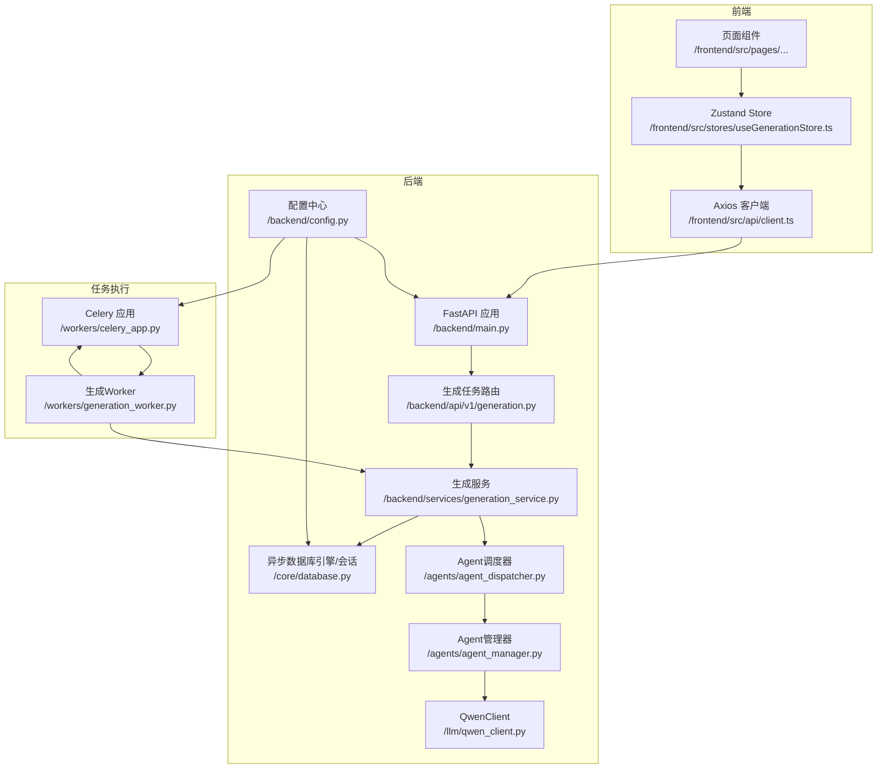
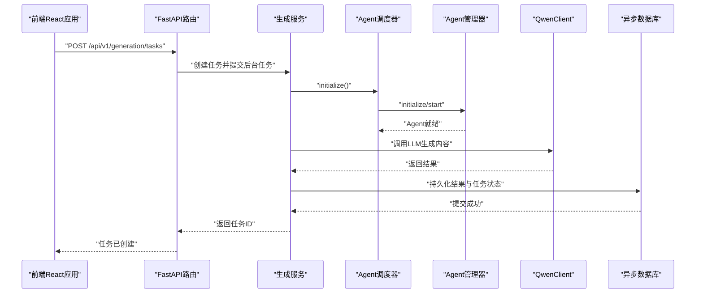
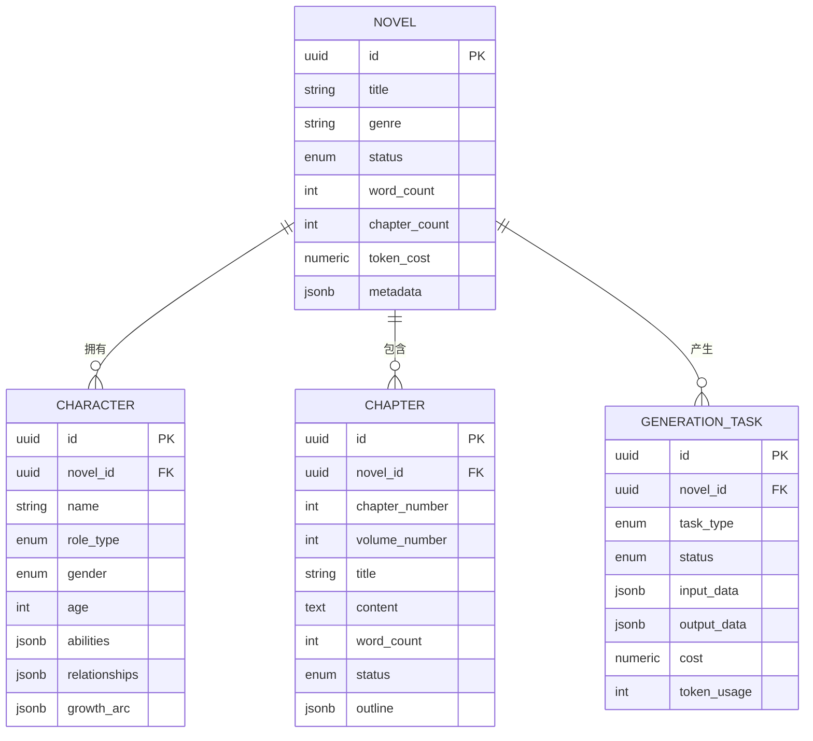
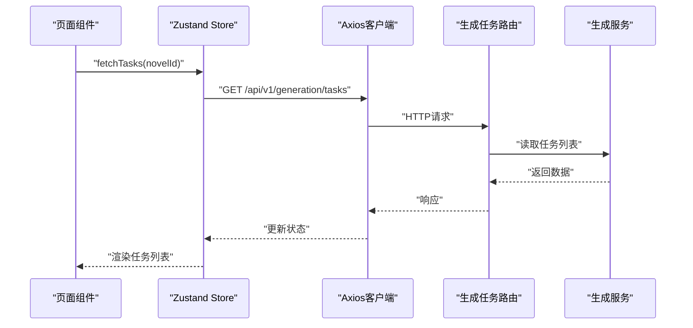
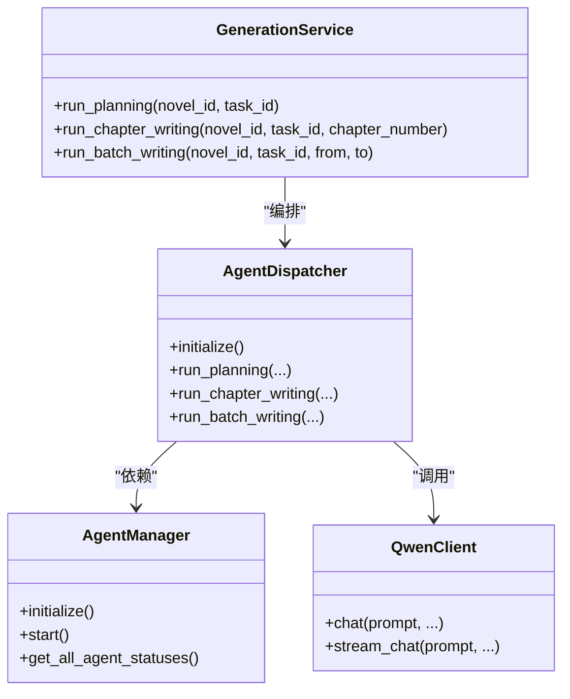
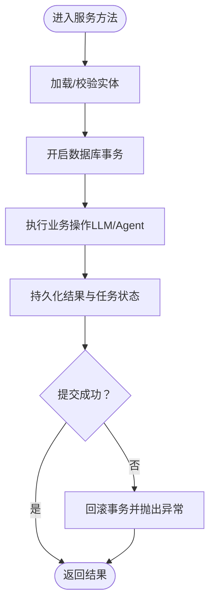
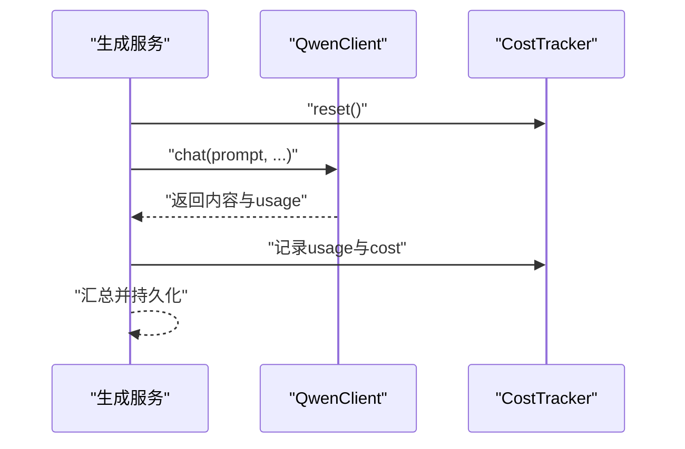
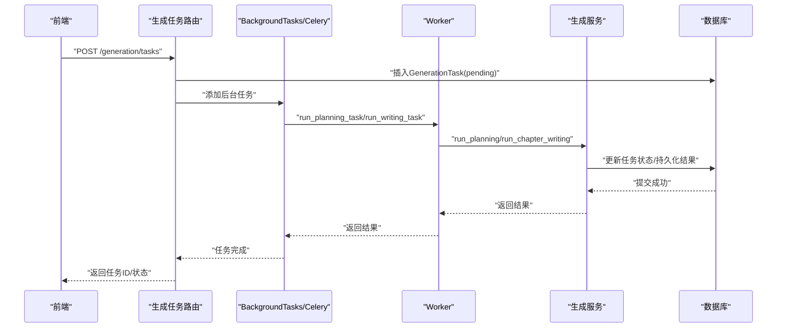
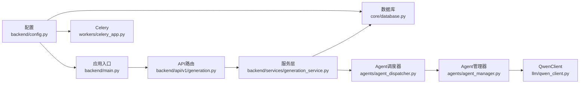

# 核心组件关系

<cite>
**本文引用的文件**
- [backend/main.py](file://backend/main.py)
- [backend/config.py](file://backend/config.py)
- [core/database.py](file://core/database.py)
- [workers/celery_app.py](file://workers/celery_app.py)
- [workers/generation_worker.py](file://workers/generation_worker.py)
- [llm/qwen_client.py](file://llm/qwen_client.py)
- [agents/agent_manager.py](file://agents/agent_manager.py)
- [agents/agent_dispatcher.py](file://agents/agent_dispatcher.py)
- [backend/api/v1/generation.py](file://backend/api/v1/generation.py)
- [backend/services/generation_service.py](file://backend/services/generation_service.py)
- [core/models/novel.py](file://core/models/novel.py)
- [core/models/character.py](file://core/models/character.py)
- [core/models/chapter.py](file://core/models/chapter.py)
- [core/models/generation_task.py](file://core/models/generation_task.py)
- [frontend/src/api/client.ts](file://frontend/src/api/client.ts)
- [frontend/src/stores/useGenerationStore.ts](file://frontend/src/stores/useGenerationStore.ts)
- [frontend/src/pages/NovelDetail/NovelDetail.tsx](file://frontend/src/pages/NovelDetail/NovelDetail.tsx)
</cite>

## 目录
1. [引言](#引言)
2. [项目结构](#项目结构)
3. [核心组件](#核心组件)
4. [架构总览](#架构总览)
5. [详细组件分析](#详细组件分析)
6. [依赖分析](#依赖分析)
7. [性能考虑](#性能考虑)
8. [故障排查指南](#故障排查指南)
9. [结论](#结论)
10. [附录](#附录)

## 引言
本文件聚焦“小说生成系统”的核心组件关系与数据流，面向开发者系统性阐述以下主题：
- 前端React应用与后端FastAPI服务的通信机制
- 智能体系统与服务层的协作模式
- 数据库层的数据持久化策略
- LLM客户端的集成方式
- 主要数据模型关系（小说、角色、章节等）
- 异步任务处理流程（从任务创建到执行完成）
- 组件交互时序图与数据流图
- 组件扩展与定制的实践建议

## 项目结构
系统采用分层架构：前端React应用通过HTTP与后端FastAPI交互；后端以API路由为入口，编排服务层；服务层协调智能体系统与LLM客户端，并通过异步数据库会话持久化；Celery异步任务队列承载耗时任务。

图表来源
- [backend/main.py](file://backend/main.py#L15-L32)
- [backend/api/v1/generation.py](file://backend/api/v1/generation.py#L23-L103)
- [backend/services/generation_service.py](file://backend/services/generation_service.py#L30-L34)
- [agents/agent_dispatcher.py](file://agents/agent_dispatcher.py#L20-L31)
- [agents/agent_manager.py](file://agents/agent_manager.py#L33-L74)
- [llm/qwen_client.py](file://llm/qwen_client.py#L16-L45)
- [core/database.py](file://core/database.py#L11-L22)
- [backend/config.py](file://backend/config.py#L5-L59)
- [workers/celery_app.py](file://workers/celery_app.py#L6-L25)
- [workers/generation_worker.py](file://workers/generation_worker.py#L21-L55)

章节来源
- [backend/main.py](file://backend/main.py#L15-L32)
- [backend/config.py](file://backend/config.py#L18-L26)
- [core/database.py](file://core/database.py#L11-L22)
- [workers/celery_app.py](file://workers/celery_app.py#L6-L25)
- [llm/qwen_client.py](file://llm/qwen_client.py#L16-L45)
- [agents/agent_manager.py](file://agents/agent_manager.py#L33-L74)
- [agents/agent_dispatcher.py](file://agents/agent_dispatcher.py#L20-L31)
- [backend/api/v1/generation.py](file://backend/api/v1/generation.py#L23-L103)
- [backend/services/generation_service.py](file://backend/services/generation_service.py#L30-L34)
- [workers/generation_worker.py](file://workers/generation_worker.py#L21-L55)

## 核心组件
- 前端通信层
  - Axios客户端统一拦截错误并提示，超时设置适配长任务。
  - Zustand Store集中管理生成任务列表与刷新逻辑。
  - 页面组件通过Store与API交互，驱动UI更新。
- 后端服务层
  - GenerationService编排Agent调度器与LLM客户端，负责任务生命周期与数据持久化。
  - AgentDispatcher根据配置选择“调度器风格”或“CrewAI风格”，协调多Agent协作。
  - AgentManager负责Agent生命周期、单例与全局状态查询。
- LLM与智能体
  - QwenClient封装DashScope/OpenAI兼容模式，支持重试与流式输出。
  - Agent系统按阶段拆解任务，支持市场分析、内容策划、写作、编辑等。
- 数据持久化
  - SQLAlchemy异步引擎与会话工厂，统一事务提交/回滚/关闭。
  - GenerationTask、Novel、Character、Chapter等模型定义实体关系。
- 异步任务执行
  - Celery应用配置Broker与Backend，Worker同步包装异步执行，保证任务可靠投递与结果回写。

章节来源
- [frontend/src/api/client.ts](file://frontend/src/api/client.ts#L4-L23)
- [frontend/src/stores/useGenerationStore.ts](file://frontend/src/stores/useGenerationStore.ts#L12-L40)
- [frontend/src/pages/NovelDetail/NovelDetail.tsx](file://frontend/src/pages/NovelDetail/NovelDetail.tsx#L17-L109)
- [backend/services/generation_service.py](file://backend/services/generation_service.py#L27-L35)
- [agents/agent_dispatcher.py](file://agents/agent_dispatcher.py#L17-L32)
- [agents/agent_manager.py](file://agents/agent_manager.py#L22-L74)
- [llm/qwen_client.py](file://llm/qwen_client.py#L16-L45)
- [core/database.py](file://core/database.py#L11-L34)
- [workers/celery_app.py](file://workers/celery_app.py#L6-L25)
- [workers/generation_worker.py](file://workers/generation_worker.py#L21-L55)

## 架构总览
系统采用“API路由 → 服务层 → 智能体/LLM → 数据库”的清晰分层。前端通过REST接口与后台交互，后台通过BackgroundTasks或Celery异步执行长任务，服务层在事务内完成数据落库与任务状态更新。

图表来源
- [backend/api/v1/generation.py](file://backend/api/v1/generation.py#L23-L103)
- [backend/services/generation_service.py](file://backend/services/generation_service.py#L30-L34)
- [agents/agent_dispatcher.py](file://agents/agent_dispatcher.py#L33-L42)
- [agents/agent_manager.py](file://agents/agent_manager.py#L43-L74)
- [llm/qwen_client.py](file://llm/qwen_client.py#L46-L63)
- [core/database.py](file://core/database.py#L25-L34)

## 详细组件分析

### 数据模型关系（ER）
小说、角色、章节、生成任务等核心实体通过外键建立一对多/一对一关系，支撑生成流水线与展示需求。

图表来源
- [core/models/novel.py](file://core/models/novel.py#L37-L65)
- [core/models/character.py](file://core/models/character.py#L31-L53)
- [core/models/chapter.py](file://core/models/chapter.py#L18-L39)
- [core/models/generation_task.py](file://core/models/generation_task.py#L27-L46)

章节来源
- [core/models/novel.py](file://core/models/novel.py#L37-L65)
- [core/models/character.py](file://core/models/character.py#L31-L53)
- [core/models/chapter.py](file://core/models/chapter.py#L18-L39)
- [core/models/generation_task.py](file://core/models/generation_task.py#L27-L46)

### 前端与后端通信机制
- 前端Axios客户端统一设置基础路径、超时与错误拦截，保障用户反馈与调试信息。
- Store集中拉取任务列表与单个任务详情，页面组件订阅状态变化。
- 页面组件触发业务操作（如打开AI助手抽屉），并与后端生成任务API交互。

图表来源
- [frontend/src/pages/NovelDetail/NovelDetail.tsx](file://frontend/src/pages/NovelDetail/NovelDetail.tsx#L17-L109)
- [frontend/src/stores/useGenerationStore.ts](file://frontend/src/stores/useGenerationStore.ts#L16-L39)
- [frontend/src/api/client.ts](file://frontend/src/api/client.ts#L4-L23)
- [backend/api/v1/generation.py](file://backend/api/v1/generation.py#L106-L134)

章节来源
- [frontend/src/api/client.ts](file://frontend/src/api/client.ts#L4-L23)
- [frontend/src/stores/useGenerationStore.ts](file://frontend/src/stores/useGenerationStore.ts#L12-L40)
- [frontend/src/pages/NovelDetail/NovelDetail.tsx](file://frontend/src/pages/NovelDetail/NovelDetail.tsx#L17-L109)
- [backend/api/v1/generation.py](file://backend/api/v1/generation.py#L106-L134)

### 智能体系统与服务层协作
- GenerationService持有QwenClient与AgentDispatcher，负责任务状态管理与结果落库。
- AgentDispatcher支持两种模式：基于Agent调度器的任务编排，或直接委托CrewAI风格流程。
- AgentManager负责Agent生命周期、成本追踪与全局状态查询。

图表来源
- [backend/services/generation_service.py](file://backend/services/generation_service.py#L27-L35)
- [agents/agent_dispatcher.py](file://agents/agent_dispatcher.py#L17-L32)
- [agents/agent_manager.py](file://agents/agent_manager.py#L22-L74)
- [llm/qwen_client.py](file://llm/qwen_client.py#L16-L45)

章节来源
- [backend/services/generation_service.py](file://backend/services/generation_service.py#L27-L35)
- [agents/agent_dispatcher.py](file://agents/agent_dispatcher.py#L17-L32)
- [agents/agent_manager.py](file://agents/agent_manager.py#L22-L74)
- [llm/qwen_client.py](file://llm/qwen_client.py#L16-L45)

### 数据库层持久化策略
- 异步SQLAlchemy引擎与会话工厂，自动事务提交/回滚/关闭，避免资源泄漏。
- GenerationTask记录任务输入/输出、状态、Token用量与成本，便于审计与计费。
- Novel/Character/Chapter模型定义主从关系与默认值，确保一致性与可读性。

图表来源
- [core/database.py](file://core/database.py#L25-L34)
- [backend/services/generation_service.py](file://backend/services/generation_service.py#L68-L66)
- [core/models/generation_task.py](file://core/models/generation_task.py#L27-L46)

章节来源
- [core/database.py](file://core/database.py#L11-L34)
- [backend/services/generation_service.py](file://backend/services/generation_service.py#L68-L66)
- [core/models/generation_task.py](file://core/models/generation_task.py#L27-L46)

### LLM客户端集成方式
- QwenClient支持DashScope与OpenAI兼容两种模式，自动切换并统一返回格式。
- 支持重试与指数退避，保障稳定性；支持流式输出，满足实时渲染场景。
- 与CostTracker结合，记录Prompt/Completion/Total Token与成本，贯穿任务生命周期。

图表来源
- [llm/qwen_client.py](file://llm/qwen_client.py#L46-L161)
- [backend/services/generation_service.py](file://backend/services/generation_service.py#L73-L196)

章节来源
- [llm/qwen_client.py](file://llm/qwen_client.py#L46-L161)
- [backend/services/generation_service.py](file://backend/services/generation_service.py#L73-L196)

### 异步任务处理流程（从创建到完成）
- API路由接收任务请求，创建GenerationTask并标记为pending。
- 使用BackgroundTasks或Celery Worker在后台执行具体阶段（企划/写作/批量写作）。
- 服务层在事务内更新任务状态、持久化结果与Token成本，最终返回状态。

图表来源
- [backend/api/v1/generation.py](file://backend/api/v1/generation.py#L23-L103)
- [workers/generation_worker.py](file://workers/generation_worker.py#L58-L69)
- [workers/celery_app.py](file://workers/celery_app.py#L6-L25)
- [backend/services/generation_service.py](file://backend/services/generation_service.py#L36-L196)

章节来源
- [backend/api/v1/generation.py](file://backend/api/v1/generation.py#L23-L103)
- [workers/generation_worker.py](file://workers/generation_worker.py#L58-L69)
- [workers/celery_app.py](file://workers/celery_app.py#L6-L25)
- [backend/services/generation_service.py](file://backend/services/generation_service.py#L36-L196)

## 依赖分析
- 组件耦合与内聚
  - 服务层对Agent与LLM的依赖通过构造注入，便于替换与测试。
  - 数据库依赖集中在core/database.py，统一由依赖函数提供会话。
  - 配置集中于backend/config.py，被各模块按需读取。
- 外部依赖与集成点
  - LLM：DashScope与OpenAI兼容模式双通道。
  - 任务队列：Redis作为Celery Broker与Backend。
  - 前端：Ant Design组件与Axios，统一错误处理。
- 潜在循环依赖
  - 当前模块间通过显式导入避免循环依赖；若新增模块需遵循“上层调用下层”的原则。

图表来源
- [backend/config.py](file://backend/config.py#L5-L59)
- [backend/main.py](file://backend/main.py#L15-L32)
- [core/database.py](file://core/database.py#L11-L22)
- [workers/celery_app.py](file://workers/celery_app.py#L6-L25)
- [backend/api/v1/generation.py](file://backend/api/v1/generation.py#L23-L103)
- [backend/services/generation_service.py](file://backend/services/generation_service.py#L27-L35)
- [agents/agent_dispatcher.py](file://agents/agent_dispatcher.py#L17-L32)
- [agents/agent_manager.py](file://agents/agent_manager.py#L22-L74)
- [llm/qwen_client.py](file://llm/qwen_client.py#L16-L45)

章节来源
- [backend/config.py](file://backend/config.py#L5-L59)
- [backend/main.py](file://backend/main.py#L15-L32)
- [core/database.py](file://core/database.py#L11-L22)
- [workers/celery_app.py](file://workers/celery_app.py#L6-L25)
- [backend/api/v1/generation.py](file://backend/api/v1/generation.py#L23-L103)
- [backend/services/generation_service.py](file://backend/services/generation_service.py#L27-L35)
- [agents/agent_dispatcher.py](file://agents/agent_dispatcher.py#L17-L32)
- [agents/agent_manager.py](file://agents/agent_manager.py#L22-L74)
- [llm/qwen_client.py](file://llm/qwen_client.py#L16-L45)

## 性能考虑
- 数据库连接池与异步会话
  - 异步引擎与会话工厂减少阻塞，提高并发吞吐。
- LLM调用优化
  - 指数退避重试降低外部波动影响；流式输出提升前端体验。
- 任务执行
  - Celery worker_prefetch_multiplier=1避免长任务抢占；合理设置超时与软超时。
- 前端交互
  - 适当缓存与分页，避免一次性加载过多任务导致UI卡顿。

## 故障排查指南
- 常见问题定位
  - 任务状态异常：检查GenerationTask表状态字段与错误信息字段。
  - LLM调用失败：查看QwenClient日志与重试次数，确认API Key与Base URL配置。
  - 数据库事务异常：确认get_db中间件的commit/rollback逻辑是否正确执行。
  - Celery任务未执行：核对Broker/Backend地址与worker进程状态。
- 日志与监控
  - 后端统一使用core/logging_config，前端Axios拦截器统一错误提示。
- 快速恢复步骤
  - 重启Celery worker与后端服务；检查环境变量与数据库连通性；清理异常任务并重试。

章节来源
- [backend/api/v1/generation.py](file://backend/api/v1/generation.py#L152-L170)
- [llm/qwen_client.py](file://llm/qwen_client.py#L97-L106)
- [core/database.py](file://core/database.py#L25-L34)
- [workers/celery_app.py](file://workers/celery_app.py#L12-L23)
- [frontend/src/api/client.ts](file://frontend/src/api/client.ts#L10-L21)

## 结论
该系统通过清晰的分层与职责划分，实现了从前端交互到智能体编排、LLM调用与数据库持久化的完整闭环。异步任务与成本追踪增强了可观测性与可维护性。建议在扩展时遵循现有依赖注入与配置中心模式，保持模块内聚与低耦合。

## 附录
- 扩展与定制建议
  - 新增Agent：在AgentManager中注册，AgentDispatcher中接入调度或Crew流程。
  - 新增任务类型：在GenerationTask枚举与API路由中扩展，服务层补充对应处理逻辑。
  - LLM替换：通过QwenClient抽象统一接入，保持调用接口一致。
  - 数据模型扩展：遵循现有外键与级联策略，确保关系完整性与查询效率。
  - 前端集成：复用Axios客户端与Store模式，统一错误处理与状态管理。