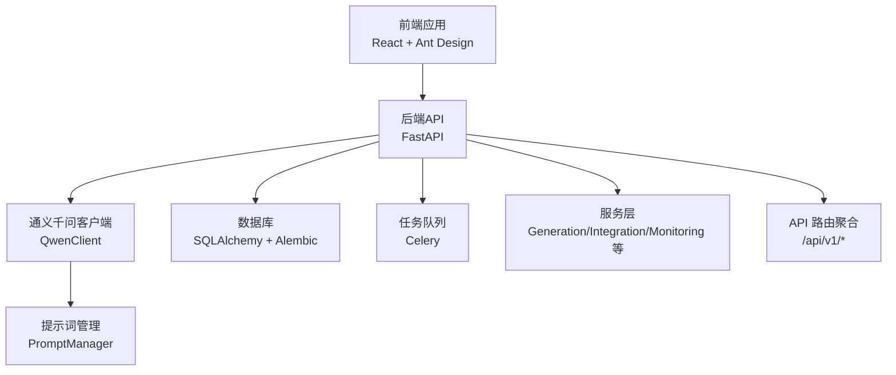
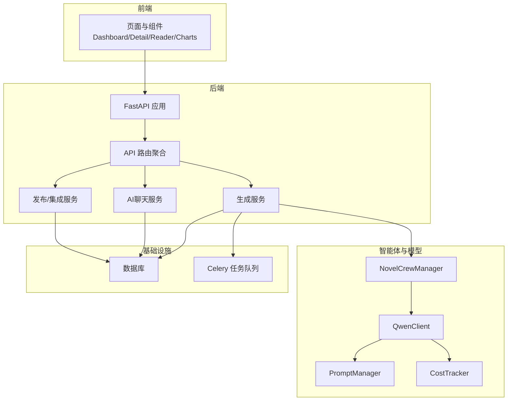
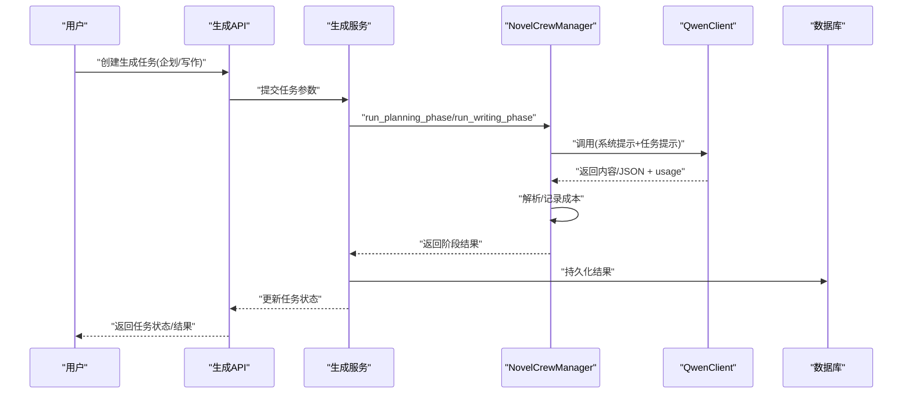
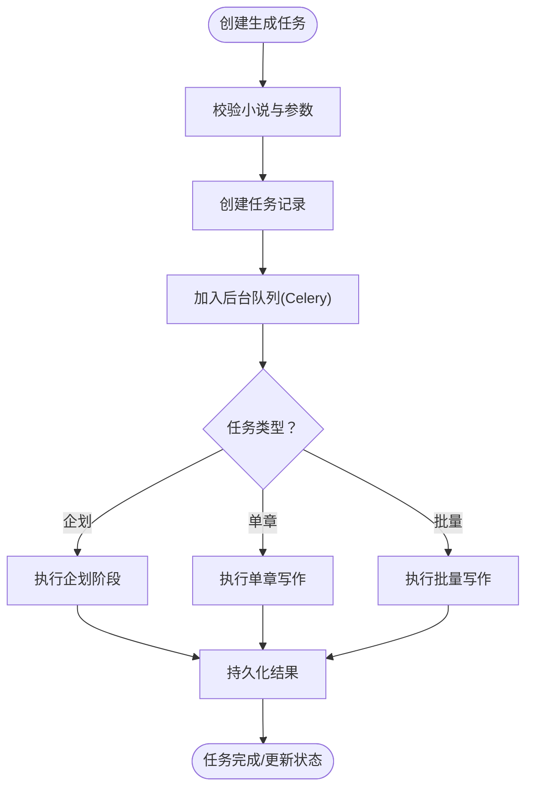
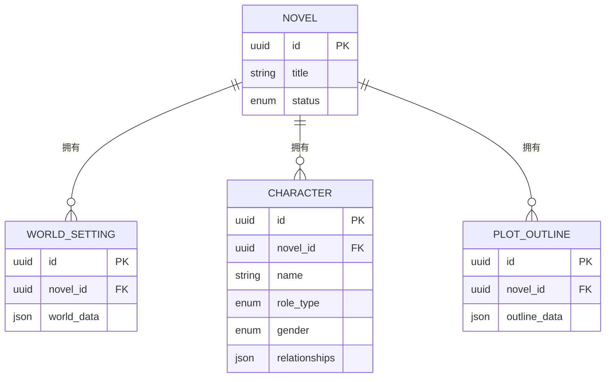
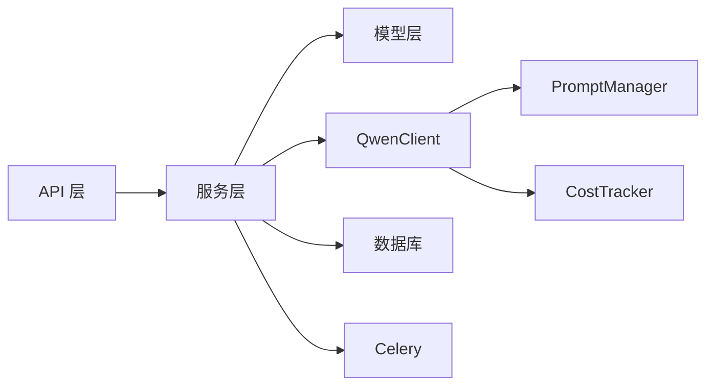

# 系统介绍与特性

<cite>
**本文引用的文件**
- [README.md](file://README.md)
- [README.en.md](file://README.en.md)
- [backend/main.py](file://backend/main.py)
- [frontend/src/App.tsx](file://frontend/src/App.tsx)
- [agents/__init__.py](file://agents/__init__.py)
- [llm/__init__.py](file://llm/__init__.py)
- [agents/crew_manager.py](file://agents/crew_manager.py)
- [llm/qwen_client.py](file://llm/qwen_client.py)
- [workers/celery_app.py](file://workers/celery_app.py)
- [core/models/__init__.py](file://core/models/__init__.py)
- [backend/api/v1/__init__.py](file://backend/api/v1/__init__.py)
- [backend/api/v1/novels.py](file://backend/api/v1/novels.py)
- [backend/api/v1/characters.py](file://backend/api/v1/characters.py)
- [backend/api/v1/chapters.py](file://backend/api/v1/chapters.py)
- [backend/api/v1/outlines.py](file://backend/api/v1/outlines.py)
- [backend/api/v1/generation.py](file://backend/api/v1/generation.py)
- [backend/api/v1/ai_chat.py](file://backend/api/v1/ai_chat.py)
</cite>

## 目录
1. [引言](#引言)
2. [项目结构](#项目结构)
3. [核心组件](#核心组件)
4. [架构总览](#架构总览)
5. [详细组件分析](#详细组件分析)
6. [依赖分析](#依赖分析)
7. [性能考虑](#性能考虑)
8. [故障排查指南](#故障排查指南)
9. [结论](#结论)
10. [附录](#附录)

## 引言
本小说生成系统是一个以AI驱动为核心的创作平台，旨在通过“智能体协作”的方式，实现从需求分析到内容发布的全链路自动化创作。系统覆盖“企划阶段”（主题分析、世界设定、角色塑造、情节大纲）与“写作阶段”（章节策划、初稿撰写、编辑润色、连续性校验）两大阶段，并提供任务编排、成本追踪、流式对话、批处理生成等能力。系统同时具备多平台发布、自动化内容生成、世界设定管理、角色关系可视化、章节管理与历史追踪等功能，帮助内容创作者、平台运营者与技术开发者高效落地高质量的网络文学作品。

## 项目结构
系统采用前后端分离架构，后端基于FastAPI提供REST与WebSocket接口；前端基于React+Ant Design提供可视化界面；核心AI能力由通义千问LLM提供，通过统一客户端封装与成本追踪；任务调度采用Celery异步队列；数据模型与数据库迁移由SQLAlchemy与Alembic管理。

图表来源
- [backend/main.py](file://backend/main.py#L15-L32)
- [frontend/src/App.tsx](file://frontend/src/App.tsx#L1-L16)
- [llm/qwen_client.py](file://llm/qwen_client.py#L16-L64)
- [workers/celery_app.py](file://workers/celery_app.py#L6-L23)
- [backend/api/v1/__init__.py](file://backend/api/v1/__init__.py#L11-L28)

章节来源
- [backend/main.py](file://backend/main.py#L15-L53)
- [frontend/src/App.tsx](file://frontend/src/App.tsx#L1-L16)
- [backend/api/v1/__init__.py](file://backend/api/v1/__init__.py#L1-L29)

## 核心组件
- 智能体编排与任务执行：NovelCrewManager负责将“主题分析—世界设定—角色设计—情节架构”与“章节策划—初稿—编辑—连续性检查”等Agent流程串联，统一调用QwenClient并记录成本。
- 通义千问客户端：QwenClient封装DashScope/OpenAI兼容两种模式，支持重试、流式输出与异步调用，适配不同部署形态。
- 生成任务与批处理：Generation API支持创建“企划/单章/批量写作”任务，结合Celery后台执行，保障长任务稳定性。
- 数据模型与持久化：核心模型涵盖小说、章节、角色、世界设定、情节大纲、生成任务、发布任务、Token用量等，配合数据库迁移脚本。
- 前后端交互：后端提供REST与WebSocket接口，前端提供仪表盘、小说详情、章节阅读、角色关系图、世界设定、发布任务与监控等页面。

章节来源
- [agents/crew_manager.py](file://agents/crew_manager.py#L19-L480)
- [llm/qwen_client.py](file://llm/qwen_client.py#L16-L232)
- [backend/api/v1/generation.py](file://backend/api/v1/generation.py#L23-L171)
- [workers/celery_app.py](file://workers/celery_app.py#L1-L26)
- [core/models/__init__.py](file://core/models/__init__.py#L1-L40)
- [backend/api/v1/novels.py](file://backend/api/v1/novels.py#L25-L150)
- [backend/api/v1/characters.py](file://backend/api/v1/characters.py#L24-L203)
- [backend/api/v1/chapters.py](file://backend/api/v1/chapters.py#L29-L200)
- [backend/api/v1/outlines.py](file://backend/api/v1/outlines.py#L25-L161)
- [backend/api/v1/ai_chat.py](file://backend/api/v1/ai_chat.py#L44-L235)

## 架构总览
系统采用“前端-后端-模型-存储-队列”的分层架构。前端通过REST与WebSocket与后端交互；后端通过服务层协调模型与外部LLM；生成任务通过Celery异步执行；数据库持久化所有创作数据；提示词管理与成本追踪贯穿LLM调用链。

图表来源
- [backend/main.py](file://backend/main.py#L15-L32)
- [backend/api/v1/__init__.py](file://backend/api/v1/__init__.py#L11-L28)
- [agents/crew_manager.py](file://agents/crew_manager.py#L19-L480)
- [llm/qwen_client.py](file://llm/qwen_client.py#L16-L64)
- [workers/celery_app.py](file://workers/celery_app.py#L6-L23)
- [core/models/__init__.py](file://core/models/__init__.py#L1-L40)

## 详细组件分析

### 智能体协作创作（企划与写作）
系统通过NovelCrewManager实现“主题分析—世界设定—角色设计—情节架构”与“章节策划—初稿—编辑—连续性检查”的流水线编排。该流程具备：
- 多Agent角色：主题分析师、世界观架构师、角色设计师、情节架构师、章节策划师、作家、编辑、连续性审查员。
- 动态提示词：根据篇幅类型（长篇/中篇/短文）动态调整提示词与约束，保证产出质量与体量匹配。
- 成本追踪：每次LLM调用后记录prompt/completion tokens，便于成本控制与优化。
- 结果解析：对LLM返回的JSON或文本进行稳健解析，提升鲁棒性。

图表来源
- [backend/api/v1/generation.py](file://backend/api/v1/generation.py#L23-L103)
- [agents/crew_manager.py](file://agents/crew_manager.py#L168-L302)
- [agents/crew_manager.py](file://agents/crew_manager.py#L308-L480)
- [llm/qwen_client.py](file://llm/qwen_client.py#L46-L161)

章节来源
- [agents/crew_manager.py](file://agents/crew_manager.py#L19-L480)

### 多平台发布（概念性说明）
系统预留了发布与集成相关路由与模型，支持后续对接多平台账号、发布任务与收益统计，形成从创作到发布的闭环。当前仓库中相关模块被注释聚合，表明其作为未来扩展点存在。

章节来源
- [backend/api/v1/__init__.py](file://backend/api/v1/__init__.py#L7-L26)
- [core/models/__init__.py](file://core/models/__init__.py#L28-L39)

### 自动化内容生成
- 生成任务API：支持创建“企划/单章/批量写作”任务，自动校验参数并入队。
- 后台执行：通过BackgroundTasks与Celery，将长耗时任务异步执行，避免阻塞请求。
- 批量写作：支持指定卷号与章节范围，自动推进写作流程并回写数据库。

图表来源
- [backend/api/v1/generation.py](file://backend/api/v1/generation.py#L23-L103)
- [workers/celery_app.py](file://workers/celery_app.py#L6-L23)

章节来源
- [backend/api/v1/generation.py](file://backend/api/v1/generation.py#L23-L171)
- [workers/celery_app.py](file://workers/celery_app.py#L1-L26)

### 世界设定管理与角色塑造
- 世界设定：提供查询与更新接口，支持按小说维度维护完整的世界观数据。
- 角色管理：支持角色增删改查、角色关系图（节点与边），便于可视化角色网络。
- 情节大纲：提供大纲查询与更新，支撑章节写作与连续性校验。

图表来源
- [backend/api/v1/outlines.py](file://backend/api/v1/outlines.py#L25-L161)
- [backend/api/v1/characters.py](file://backend/api/v1/characters.py#L24-L203)
- [core/models/__init__.py](file://core/models/__init__.py#L1-L40)

章节来源
- [backend/api/v1/outlines.py](file://backend/api/v1/outlines.py#L25-L161)
- [backend/api/v1/characters.py](file://backend/api/v1/characters.py#L24-L203)

### 章节管理与历史追踪
- 章节列表与分页：支持按状态筛选、分页查看。
- 章节详情：按章节号获取，便于阅读与编辑。
- 批量删除：支持按章节号列表批量删除，提高运营效率。
- 字数统计：内容更新时自动计算字数，便于运营与计费。

章节来源
- [backend/api/v1/chapters.py](file://backend/api/v1/chapters.py#L29-L200)

### AI聊天与意图解析（概念性说明）
系统提供AI聊天会话、WebSocket流式对话、小说与爬虫意图解析等能力，便于用户以自然语言表达创作需求，并转化为结构化输入供智能体使用。

章节来源
- [backend/api/v1/ai_chat.py](file://backend/api/v1/ai_chat.py#L44-L235)

## 依赖分析
- 组件耦合：后端API依赖服务层，服务层依赖模型与LLM客户端；智能体编排依赖提示词管理与成本追踪；任务通过Celery解耦。
- 外部依赖：DashScope/OpenAI兼容接口、数据库、消息队列。
- 潜在风险：LLM调用失败与解析异常需具备重试与降级策略；数据库事务与并发写入需注意一致性。

图表来源
- [backend/api/v1/generation.py](file://backend/api/v1/generation.py#L72-L101)
- [agents/crew_manager.py](file://agents/crew_manager.py#L104-L163)
- [llm/qwen_client.py](file://llm/qwen_client.py#L16-L64)
- [workers/celery_app.py](file://workers/celery_app.py#L6-L23)

章节来源
- [backend/api/v1/generation.py](file://backend/api/v1/generation.py#L72-L101)
- [agents/crew_manager.py](file://agents/crew_manager.py#L104-L163)
- [llm/qwen_client.py](file://llm/qwen_client.py#L16-L64)
- [workers/celery_app.py](file://workers/celery_app.py#L6-L23)

## 性能考虑
- 异步与流式：LLM调用采用异步与流式输出，降低等待时间，提升用户体验。
- 重试与退避：QwenClient提供指数退避重试，增强稳定性。
- 队列与并发：Celery配置较低预取与并发，适合长任务；超时与软超时设置避免资源占用过高。
- 成本控制：CostTracker记录usage，便于成本预算与优化。
- 数据库：分页查询与selectinload减少不必要的JOIN，提升读取性能。

章节来源
- [llm/qwen_client.py](file://llm/qwen_client.py#L46-L161)
- [workers/celery_app.py](file://workers/celery_app.py#L12-L23)

## 故障排查指南
- LLM调用失败：检查API密钥、基础URL、模型名与网络连通性；关注重试日志与错误码。
- JSON解析异常：确认提示词输出格式与解析策略；必要时放宽解析容忍度。
- 任务状态异常：检查Celery工作进程状态、Broker连接与任务序列化配置。
- 数据库事务：确认并发写入与锁策略，避免脏读与死锁。
- WebSocket异常：检查会话ID有效性与连接状态，捕获并上报异常。

章节来源
- [llm/qwen_client.py](file://llm/qwen_client.py#L65-L161)
- [agents/crew_manager.py](file://agents/crew_manager.py#L37-L102)
- [workers/celery_app.py](file://workers/celery_app.py#L6-L23)
- [backend/api/v1/ai_chat.py](file://backend/api/v1/ai_chat.py#L96-L141)

## 结论
本系统通过“智能体协作+LLM+任务队列+数据模型”的组合，实现了从需求到发布的全链路自动化创作。其核心价值在于：
- 降低创作门槛：以自然语言引导生成，减少前期构思成本。
- 提升生产效率：批处理与异步任务显著缩短产出周期。
- 强化质量控制：连续性检查与成本追踪保障内容质量与资源可控。
- 支撑规模化运营：角色关系图、章节管理、发布任务等模块为平台化运营奠定基础。

## 附录
- 用户群体与价值
  - 内容创作者：获得从主题到章节的一站式生成工具，快速推进创作。
  - 平台运营者：通过批处理与发布任务实现规模化内容产出与分发。
  - 技术开发者：统一的LLM客户端、成本追踪与异步任务便于二次开发与扩展。
- 与传统创作方式的区别
  - 传统：人工构思、手写、反复修改、线下沟通。
  - 本系统：AI驱动、流水线编排、成本与质量可视化、可复制的规模化能力。