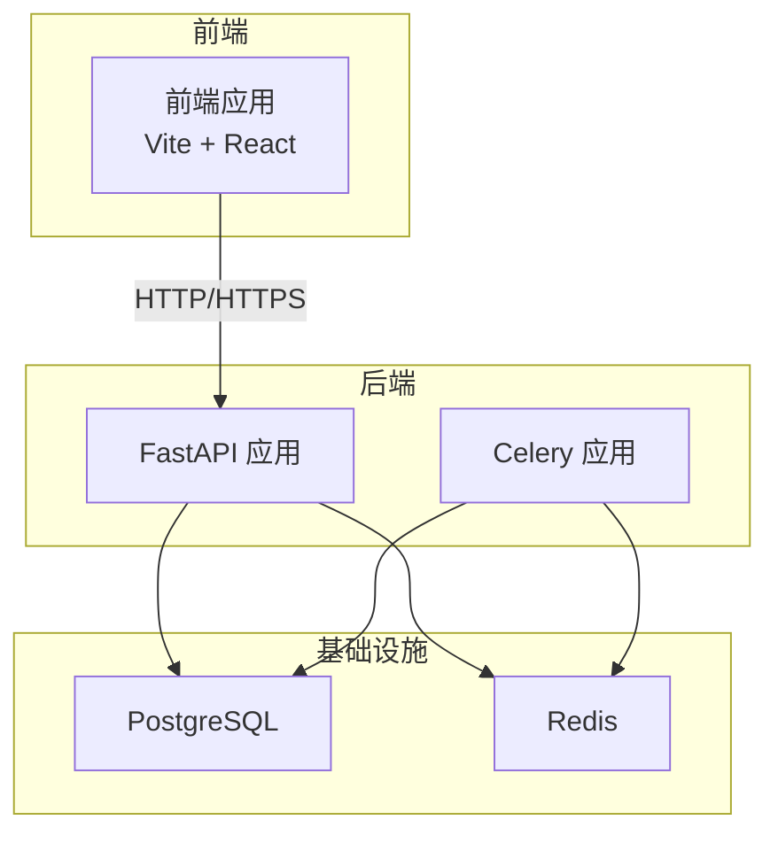
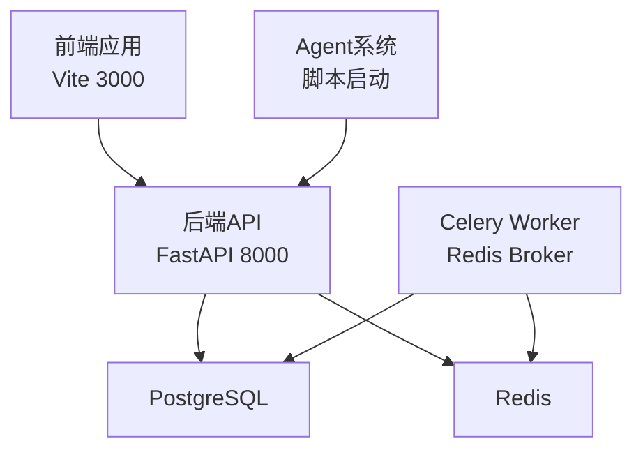
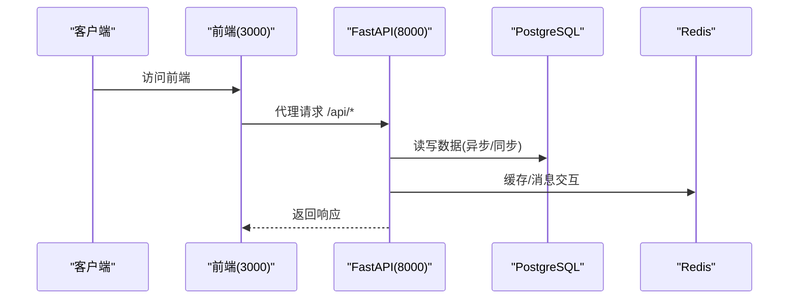
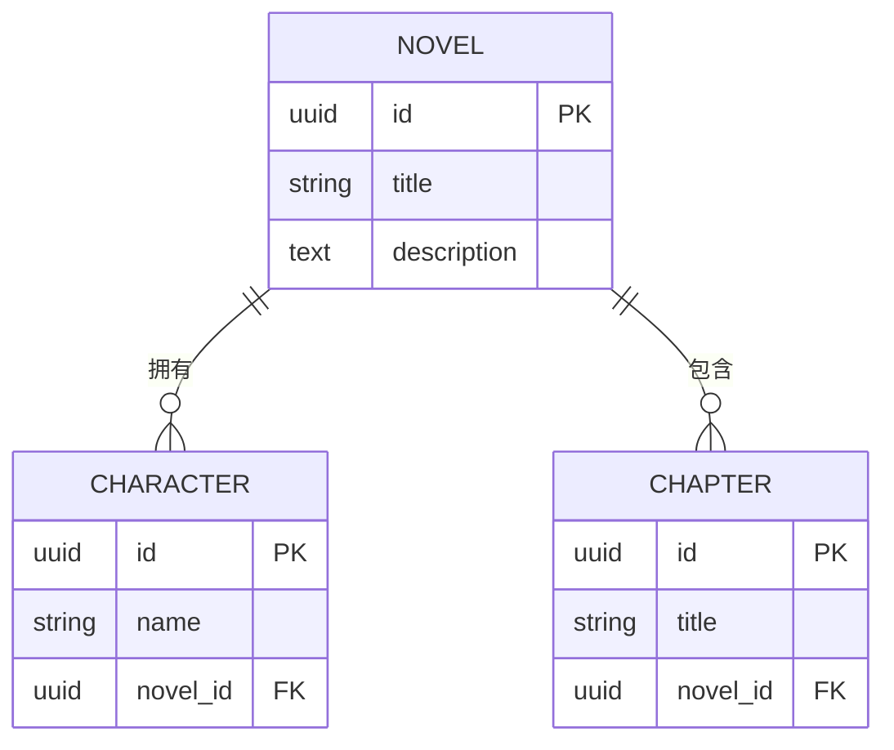
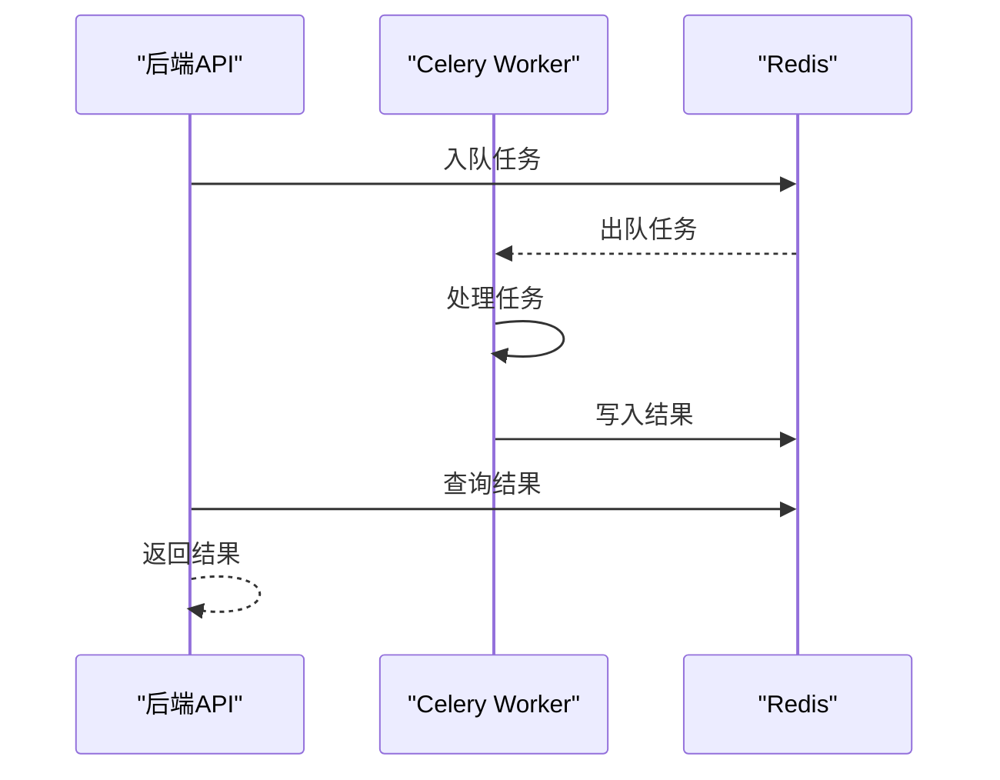
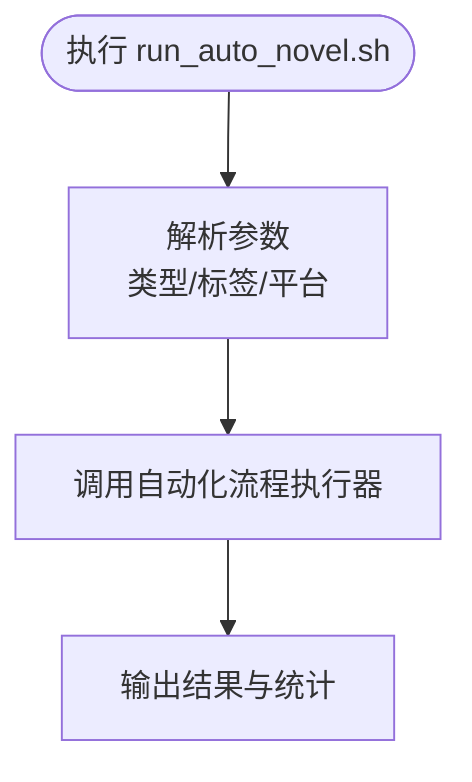
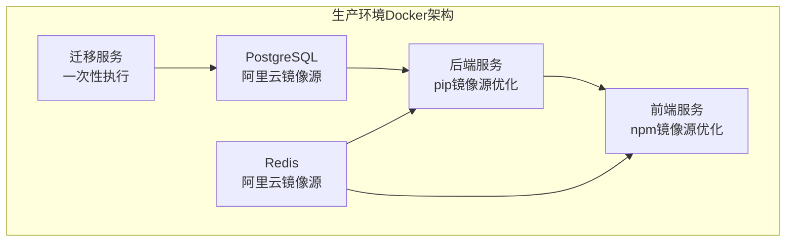
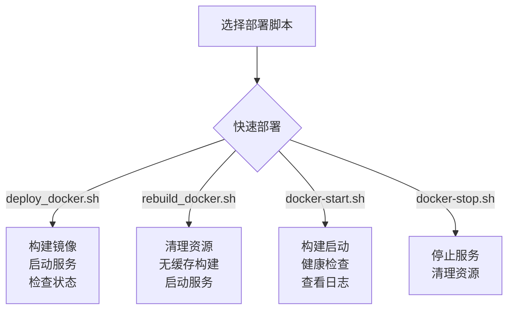
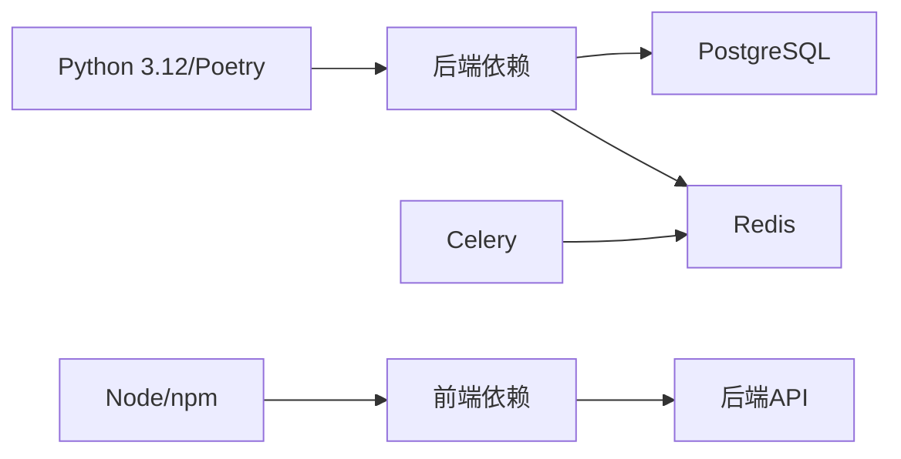

# 部署架构

<cite>
**本文引用的文件**
- [docker-compose.yml](file://docker-compose.yml)
- [docker-compose.dev.yml](file://docker-compose.dev.yml)
- [docker-compose.migration.yml](file://docker-compose.migration.yml)
- [Dockerfile.backend](file://Dockerfile.backend)
- [Dockerfile.frontend](file://Dockerfile.frontend)
- [deploy_docker.sh](file://deploy_docker.sh)
- [rebuild_docker.sh](file://rebuild_docker.sh)
- [redeploy_with_migration.sh](file://redeploy_with_migration.sh)
- [docker-start.sh](file://docker-start.sh)
- [docker-stop.sh](file://docker-stop.sh)
- [run_migration.sh](file://run_migration.sh)
- [migrate_db.sh](file://migrate_db.sh)
- [fix_database.sh](file://fix_database.sh)
- [fix_database_types.sh](file://fix_database_types.sh)
- [frontend/docker-entrypoint.sh](file://frontend/docker-entrypoint.sh)
- [pyproject.toml](file://pyproject.toml)
- [.env.example](file://.env.example)
- [backend/main.py](file://backend/main.py)
- [backend/config.py](file://backend/config.py)
- [workers/celery_app.py](file://workers/celery_app.py)
- [scripts/start_agents.sh](file://scripts/start_agents.sh)
- [scripts/run_auto_novel.sh](file://scripts/run_auto_novel.sh)
- [frontend/vite.config.ts](file://frontend/vite.config.ts)
- [.github/workflows/playwright.yml](file://.github/workflows/playwright.yml)
- [alembic.ini](file://alembic.ini)
- [alembic/env.py](file://alembic/env.py)
- [README.md](file://README.md)
</cite>

## 更新摘要
**所做更改**
- 新增Docker部署架构优化章节，包含开发环境配置、迁移配置、镜像源优化
- 新增多个部署脚本和环境配置文件的详细说明
- 更新容器化部署方案，包含生产环境和开发环境的不同配置
- 新增数据库迁移和修复脚本的完整说明
- 优化Docker镜像构建和部署流程

## 目录
1. [引言](#引言)
2. [项目结构](#项目结构)
3. [核心组件](#核心组件)
4. [架构总览](#架构总览)
5. [详细组件分析](#详细组件分析)
6. [Docker容器化部署架构](#docker容器化部署架构)
7. [部署脚本与自动化](#部署脚本与自动化)
8. [数据库迁移与修复](#数据库迁移与修复)
9. [依赖关系分析](#依赖关系分析)
10. [性能考虑](#性能考虑)
11. [故障排除指南](#故障排除指南)
12. [结论](#结论)
13. [附录](#附录)

## 引言
本文件面向运维与开发团队，提供小说生成系统的部署架构说明与实施指南。内容覆盖容器化部署拓扑、服务编排、环境变量配置、各组件部署方式（后端FastAPI、前端React、智能体Agent系统、数据库PostgreSQL、消息队列Redis、任务队列Celery）、部署流程、CI/CD与自动化测试策略，以及最佳实践与故障排除建议。

**更新** 新增Docker部署架构优化，包括开发环境配置、迁移配置、镜像源优化等，以及新增的部署脚本和环境配置。

## 项目结构
该系统采用前后端分离与多服务协同的架构：
- 后端：基于FastAPI的API服务，负责业务接口、数据模型与服务编排。
- 前端：基于Vite+React的单页应用，通过代理访问后端API。
- 智能体Agent系统：独立脚本与启动脚本，负责自动化流程调度与执行。
- 数据库：PostgreSQL，使用异步驱动与同步驱动分别满足不同场景。
- 缓存与消息：Redis作为Broker与结果存储，支撑Celery任务队列。
- 任务队列：Celery基于Redis实现异步任务处理。
- 迁移工具：Alembic用于数据库版本迁移。
- 测试：Playwright端到端测试，配合GitHub Actions进行CI。

**图表来源**
- [backend/main.py:15-32](file://backend/main.py#L15-L32)
- [workers/celery_app.py:6-23](file://workers/celery_app.py#L6-L23)
- [docker-compose.yml:2-20](file://docker-compose.yml#L2-L20)

**章节来源**
- [backend/main.py:1-53](file://backend/main.py#L1-L53)
- [backend/config.py:1-59](file://backend/config.py#L1-L59)
- [workers/celery_app.py:1-26](file://workers/celery_app.py#L1-L26)
- [docker-compose.yml:1-25](file://docker-compose.yml#L1-L25)

## 核心组件
- 后端FastAPI服务
  - 应用入口与路由注册，CORS中间件配置，健康检查端点。
  - 通过配置模块读取环境变量，构建数据库与Redis/Celery连接。
- 前端React应用
  - Vite开发服务器，默认端口3000；通过代理将/api请求转发至后端。
- 智能体Agent系统
  - 通过启动脚本以守护进程方式运行，日志与PID管理。
- 数据库(PostgreSQL)
  - 提供异步与同步连接字符串，支持迁移与数据持久化。
- 消息队列(Redis)
  - 提供Broker与结果存储，支持高并发与可靠性。
- 任务队列(Celery)
  - 基于Redis，配置序列化、时区、任务超时与并发策略。
- 迁移工具(Alembic)
  - 配置脚本位置、日志级别与数据库URL模板。

**章节来源**
- [backend/main.py:15-53](file://backend/main.py#L15-L53)
- [backend/config.py:5-59](file://backend/config.py#L5-L59)
- [workers/celery_app.py:6-26](file://workers/celery_app.py#L6-L26)
- [alembic.ini:1-150](file://alembic.ini#L1-L150)

## 架构总览
系统采用"前端-后端-API-数据库/缓存"的分层架构。前端通过本地代理访问后端，后端通过异步ORM与同步ORM分别处理业务逻辑与数据库操作；智能体Agent系统通过脚本启动，Celery在Redis上执行后台任务；数据库与缓存通过Compose统一编排。

**图表来源**
- [frontend/vite.config.ts:12-21](file://frontend/vite.config.ts#L12-L21)
- [backend/main.py:15-32](file://backend/main.py#L15-L32)
- [workers/celery_app.py:6-23](file://workers/celery_app.py#L6-L23)
- [docker-compose.yml:2-20](file://docker-compose.yml#L2-L20)

## 详细组件分析

### 后端FastAPI服务
- 应用初始化
  - 标题、版本、描述与调试开关来自配置。
  - 注册CORS中间件，限制前端开发服务器访问。
  - 包含API路由并提供根与健康检查端点。
- 配置加载
  - 通过Pydantic Settings从.env文件加载LLM、数据库、Redis、Celery、应用与爬虫等配置。
  - 动态生成异步与同步数据库连接URL。
- 部署要点
  - 确保端口映射与网络连通性。
  - 在生产环境调整调试与CORS白名单。
  - 配置加密密钥与平台账号凭证加密。

**图表来源**
- [frontend/vite.config.ts:15-20](file://frontend/vite.config.ts#L15-L20)
- [backend/main.py:22-32](file://backend/main.py#L22-L32)
- [backend/config.py:18-26](file://backend/config.py#L18-L26)

**章节来源**
- [backend/main.py:15-53](file://backend/main.py#L15-L53)
- [backend/config.py:5-59](file://backend/config.py#L5-L59)

### 前端React应用
- 开发服务器
  - 默认端口3000，严格端口绑定。
  - 代理将/api前缀转发到后端8000端口。
- 构建与产物
  - 使用Vite构建，产物位于dist目录，包含静态资源与入口HTML。
- 部署要点
  - 生产环境可将dist部署至Nginx或静态托管。
  - 确保代理配置与后端域名一致。

**图表来源**
- [frontend/vite.config.ts:12-22](file://frontend/vite.config.ts#L12-L22)

**章节来源**
- [frontend/vite.config.ts:1-23](file://frontend/vite.config.ts#L1-L23)

### 智能体Agent系统
- 启动脚本
  - 通过Poetry运行Python脚本，重定向标准输出与错误到日志文件。
  - 记录进程ID到agent.pid，便于后续停止与监控。
- 运行模式
  - 以守护进程方式启动，适合长时间运行的自动化流程。
- 部署要点
  - 确保Poetry环境可用与脚本路径正确。
  - 结合日志轮转与进程监控，保障稳定性。

**图表来源**
- [scripts/start_agents.sh:9-35](file://scripts/start_agents.sh#L9-L35)

**章节来源**
- [scripts/start_agents.sh:1-35](file://scripts/start_agents.sh#L1-L35)

### 数据库(PostgreSQL)
- 连接配置
  - 异步驱动与同步驱动分别提供连接字符串，适配不同ORM需求。
  - 默认端口映射为5434，卷挂载保证数据持久化。
- 迁移与版本控制
  - Alembic配置脚本位置与日志级别，支持数据库演进。
- 部署要点
  - 生产环境建议使用独立主机或云数据库，启用备份与只读副本。
  - 控制连接池大小与超时，避免并发峰值导致阻塞。

**图表来源**
- [alembic/versions/:1-50](file://alembic/versions/40555b81bb5d_add_batch_writing_task_type.py#L1-L50)
- [core/models/novel.py:1-50](file://core/models/novel.py#L1-L50)
- [core/models/character.py:1-50](file://core/models/character.py#L1-L50)
- [core/models/chapter.py:1-50](file://core/models/chapter.py#L1-L50)

**章节来源**
- [backend/config.py:11-26](file://backend/config.py#L11-L26)
- [docker-compose.yml:2-12](file://docker-compose.yml#L2-L12)
- [alembic.ini:1-150](file://alembic.ini#L1-L150)

### 消息队列(Redis)
- 角色与用途
  - 作为Celery的Broker与结果存储，支撑异步任务。
  - 提供键值缓存能力，支持会话与临时数据。
- 部署要点
  - 生产环境建议启用持久化与主从复制。
  - 控制内存上限与淘汰策略，避免OOM。

**图表来源**
- [workers/celery_app.py:6-23](file://workers/celery_app.py#L6-L23)
- [docker-compose.yml:14-20](file://docker-compose.yml#L14-L20)

**章节来源**
- [workers/celery_app.py:1-26](file://workers/celery_app.py#L1-L26)
- [docker-compose.yml:14-20](file://docker-compose.yml#L14-L20)

### 任务队列(Celery)
- 配置要点
  - Broker与结果后端指向Redis。
  - 序列化、时区、UTC、任务超时、并发与预取策略。
  - 自动发现任务模块。
- 部署要点
  - 根据CPU与任务特性调整并发与预取。
  - 监控任务积压与失败率，及时扩容或优化任务。

**图表来源**
- [workers/celery_app.py:12-26](file://workers/celery_app.py#L12-L26)

**章节来源**
- [workers/celery_app.py:1-26](file://workers/celery_app.py#L1-L26)

### 自动化创作流程脚本
- 功能概述
  - 支持类型、标签、平台参数解析，调用自动化流程执行器。
  - 输出执行结果、耗时与成本统计。
- 部署要点
  - 确保Poetry环境与依赖安装。
  - 结合日志轮转与告警，监控流程成功率。

**图表来源**
- [scripts/run_auto_novel.sh:17-53](file://scripts/run_auto_novel.sh#L17-L53)
- [scripts/run_auto_novel.sh:72-106](file://scripts/run_auto_novel.sh#L72-L106)

**章节来源**
- [scripts/run_auto_novel.sh:1-113](file://scripts/run_auto_novel.sh#L1-L113)

## Docker容器化部署架构

### 生产环境部署配置
生产环境使用优化的Docker Compose配置，包含镜像源优化和健康检查：

- **PostgreSQL配置**
  - 使用阿里云镜像源：`m.daocloud.io/docker.io/postgres:17`
  - 健康检查：`pg_isready` 命令每10秒检查一次
  - 数据卷：`postgres_data` 持久化数据
  - 端口映射：`5434:5432`

- **Redis配置**
  - 使用阿里云镜像源：`m.daocloud.io/docker.io/redis:6-alpine`
  - 健康检查：`redis-cli ping` 命令
  - 数据卷：`redis_data` 持久化数据
  - 端口映射：`6379:6379`

- **后端服务配置**
  - 使用阿里云pip镜像源：`https://mirrors.aliyun.com/pypi/simple/`
  - 健康检查：`curl http://localhost:8000/health`
  - 依赖挂载：`./backend:/app/backend` 实现热更新
  - 环境变量：包含完整的LLM配置和数据库连接信息

- **前端服务配置**
  - 使用阿里云npm镜像源：`https://registry.npmmirror.com`
  - 端口映射：`3000:3000`
  - 环境变量：`API_PROXY_TARGET=http://backend:8000`

**图表来源**
- [docker-compose.yml:3-41](file://docker-compose.yml#L3-L41)
- [docker-compose.yml:21-34](file://docker-compose.yml#L21-L34)
- [docker-compose.yml:36-83](file://docker-compose.yml#L36-L83)
- [docker-compose.yml:85-103](file://docker-compose.yml#L85-L103)

**章节来源**
- [docker-compose.yml:1-112](file://docker-compose.yml#L1-L112)

### 开发环境部署配置
开发环境使用挂载卷实现代码热更新，提供更好的开发体验：

- **开发专用配置**
  - 使用Python 3.12 Slim镜像作为基础
  - 挂载所有源代码目录：`./:/app:cached`
  - 持久化依赖包到独立卷：`backend_packages:/usr/local/lib/python3.12/site-packages`
  - 后端使用`uvicorn --reload`实现热重载

- **前端开发配置**
  - 使用Node 20 Alpine镜像
  - 挂载前端源代码和配置文件
  - 持久化node_modules到独立卷
  - 使用阿里云npm镜像源

- **开发环境优势**
  - 实时代码更新，无需重启容器
  - 更快的开发迭代速度
  - 独立的依赖管理，避免冲突

**章节来源**
- [docker-compose.dev.yml:1-103](file://docker-compose.dev.yml#L1-L103)

### 迁移配置架构
专门的迁移服务配置，支持数据库版本管理：

- **一次性迁移服务**
  - 服务名称：`migrate`
  - 依赖：`postgres` 容器健康检查通过后启动
  - 命令：`alembic upgrade head` 自动执行数据库迁移
  - 网络：使用外部网络 `novel_system_default`

- **迁移流程**
  - 启动数据库和Redis
  - 执行迁移服务，自动应用最新数据库版本
  - 启动后端和前端服务

**章节来源**
- [docker-compose.migration.yml:1-127](file://docker-compose.migration.yml#L1-L127)

### Docker镜像构建优化
两个Dockerfile针对不同环境进行了优化：

- **后端Dockerfile优化**
  - 阿里云apt镜像源替换：`mirrors.aliyun.com`
  - Poetry使用阿里云仓库：`https://mirrors.aliyun.com/pypi/simple/`
  - 多次重试机制确保依赖安装成功
  - 编译gcc和postgresql-client依赖

- **前端Dockerfile优化**
  - 阿里云apk镜像源替换：`mirrors.aliyun.com`
  - npm使用阿里云registry：`https://registry.npmmirror.com`
  - 优化的构建流程和启动脚本

**章节来源**
- [Dockerfile.backend:1-42](file://Dockerfile.backend#L1-L42)
- [Dockerfile.frontend:1-28](file://Dockerfile.frontend#L1-L28)

## 部署脚本与自动化

### 快速部署脚本
提供多个一键部署脚本，简化部署流程：

- **deploy_docker.sh**
  - 停止旧容器
  - 构建新镜像（使用缓存）
  - 启动服务（后台运行）
  - 检查服务状态
  - 显示访问地址和日志查看方法

- **rebuild_docker.sh**
  - 停止并清理旧容器
  - 清理悬空镜像
  - 无缓存重新构建所有镜像
  - 启动所有服务
  - 提供完整的日志查看和重启选项

- **docker-start.sh**
  - 构建并启动所有服务
  - 等待服务启动
  - 检查后端健康状态
  - 实时查看服务日志

- **docker-stop.sh**
  - 停止所有服务
  - 可选清理未使用的Docker资源

**图表来源**
- [deploy_docker.sh:1-51](file://deploy_docker.sh#L1-L51)
- [rebuild_docker.sh:1-66](file://rebuild_docker.sh#L1-L66)
- [docker-start.sh:1-33](file://docker-start.sh#L1-L33)
- [docker-stop.sh:1-20](file://docker-stop.sh#L1-L20)

**章节来源**
- [deploy_docker.sh:1-51](file://deploy_docker.sh#L1-L51)
- [rebuild_docker.sh:1-66](file://rebuild_docker.sh#L1-L66)
- [docker-start.sh:1-33](file://docker-start.sh#L1-L33)
- [docker-stop.sh:1-20](file://docker-stop.sh#L1-L20)

### 完整重新部署脚本
`redeploy_with_migration.sh` 提供包含数据库迁移的完整部署流程：

- **分阶段部署**
  - 停止旧容器
  - 清理旧镜像
  - 分别构建后端和前端镜像
  - 启动基础服务（PostgreSQL和Redis）
  - 执行数据库迁移（优先使用Alembic，失败时使用SQL）
  - 启动所有服务
  - 验证迁移结果

- **迁移策略**
  - 自动迁移：`alembic upgrade head`
  - 备用迁移：手动执行SQL语句
  - 迁移验证：检查新字段是否存在

**章节来源**
- [redeploy_with_migration.sh:1-173](file://redeploy_with_migration.sh#L1-L173)

### 前端启动脚本
`frontend/docker-entrypoint.sh` 确保环境变量在Vite启动时可用：

- **环境变量调试**
  - 输出API_PROXY_TARGET环境变量
  - 确保代理配置正确传递
  - 启动Vite开发服务器

**章节来源**
- [frontend/docker-entrypoint.sh:1-11](file://frontend/docker-entrypoint.sh#L1-L11)

## 数据库迁移与修复

### 数据库迁移脚本
提供多种数据库迁移方案：

- **run_migration.sh**
  - 优先使用Alembic自动迁移
  - 失败时回退到手动SQL迁移
  - 支持直接在运行容器中执行
  - 提供详细的迁移统计和验证

- **migrate_db.sh**
  - 使用asyncpg驱动的Python脚本
  - 支持异步数据库操作
  - 自动检测表是否存在
  - 提供完整的错误处理和回滚机制

- **fix_database.sh**
  - 修复数据库表缺失问题
  - 支持Alembic迁移和SQLAlchemy表创建两种方式
  - 完整的数据库状态检查和验证
  - 自动重启后端服务

**章节来源**
- [run_migration.sh:1-171](file://run_migration.sh#L1-L171)
- [migrate_db.sh:1-168](file://migrate_db.sh#L1-L168)
- [fix_database.sh:1-144](file://fix_database.sh#L1-L144)

### 数据库类型修复脚本
`fix_database_types.sh` 专门处理数据库类型和字段修复：

- **枚举类型创建**
  - 创建TaskStatus枚举类型
  - 支持重复执行而不报错
  - 提供详细的创建状态反馈

- **字段修复**
  - 为novels表添加缺失字段：cover_url、synopsis、target_platform等
  - 为generation_tasks表修复status字段类型
  - 添加适当的字段注释和默认值

- **批量修复**
  - 支持同时修复多个表的结构问题
  - 提供完整的修复结果验证
  - 自动生成修复报告

**章节来源**
- [fix_database_types.sh:1-137](file://fix_database_types.sh#L1-L137)

## 依赖关系分析
- 语言与包管理
  - Python 3.12，Poetry管理依赖；前端使用npm。
- 关键依赖
  - 后端：FastAPI、SQLAlchemy异步、asyncpg、Alembic、Redis、Celery、CrewAI、DashScope/OpenAI等。
  - 前端：React、Playwright（测试）。
- 组件耦合
  - 后端对数据库与Redis存在直接依赖；Celery依赖Redis；前端依赖后端API。
- 外部依赖
  - LLM服务（DashScope/OpenAI），爬虫与第三方平台。

**图表来源**
- [pyproject.toml:8-36](file://pyproject.toml#L8-L36)
- [package.json:1-12](file://package.json#L1-L12)

**章节来源**
- [pyproject.toml:1-64](file://pyproject.toml#L1-L64)
- [package.json:1-12](file://package.json#L1-L12)

## 性能考虑
- 数据库
  - 使用异步ORM减少阻塞；合理设置连接池与查询超时。
  - 对高频表建立索引，避免全表扫描。
- 缓存与队列
  - Redis内存与淘汰策略需结合业务峰值评估。
  - Celery并发与预取应与任务类型匹配（CPU密集/IO密集）。
- 前端
  - 生产构建开启压缩与Tree-shaking；CDN加速静态资源。
- 监控与日志
  - 建议接入APM与日志聚合，设置关键指标阈值告警。
- **Docker优化**
  - 使用阿里云镜像源提升下载速度
  - 健康检查确保服务可用性
  - 持久化卷保证数据安全

## 故障排除指南
- 健康检查
  - 后端提供健康检查端点，优先验证服务可用性。
- 数据库连接
  - 检查端口映射与凭据；确认容器网络可达。
- Redis连通性
  - 验证Broker与结果后端URL；查看队列积压与任务失败。
- 前端代理
  - 确认代理目标与端口；检查跨域策略。
- 日志定位
  - 后端：查看应用日志；Agent：查看agent.pid与agent_startup.log；自动化流程：查看auto_novel_output.log与process日志。
- CI/CD
  - Playwright测试报告上传，便于问题复现与归档。
- **Docker故障排除**
  - 使用`docker-compose logs -f`实时查看服务日志
  - 使用`docker-compose ps`检查容器状态
  - 使用`docker system prune`清理未使用资源
  - 检查镜像构建日志和依赖安装情况

**章节来源**
- [backend/main.py:46-53](file://backend/main.py#L46-L53)
- [docker-compose.yml:9-20](file://docker-compose.yml#L9-L20)
- [scripts/start_agents.sh:24-35](file://scripts/start_agents.sh#L24-L35)
- [scripts/run_auto_novel.sh:106-113](file://scripts/run_auto_novel.sh#L106-L113)
- [.github/workflows/playwright.yml:1-28](file://.github/workflows/playwright.yml#L1-L28)

## 结论
本部署架构以容器化为核心，结合FastAPI、React、Redis与Celery形成高内聚低耦合的服务体系。通过Compose快速搭建开发与测试环境，借助Playwright与CI实现自动化质量保障。生产部署建议进一步强化数据库与缓存的高可用、监控与告警体系，确保系统稳定与可观测性。

**更新** 新增的Docker部署架构优化包括开发环境配置、迁移配置、镜像源优化等，提供了更完善的部署解决方案。多个部署脚本和修复脚本的引入大大简化了部署和维护流程，提高了系统的可维护性和可靠性。

## 附录

### 环境变量与配置清单
- LLM配置
  - DASHSCOPE_API_KEY、DASHSCOPE_MODEL、DASHSCOPE_BASE_URL
- 数据库
  - DATABASE_URL、DATABASE_URL_SYNC（由DB_USER/DB_PASSWORD/DB_HOST/DB_PORT/DB_NAME拼接）
- 缓存与消息
  - REDIS_URL
- 任务队列
  - CELERY_BROKER_URL、CELERY_RESULT_BACKEND
- 应用
  - APP_ENV、APP_DEBUG、APP_HOST、APP_PORT
- 爬虫与加密
  - CRAWLER_REQUEST_DELAY、CRAWLER_MAX_RETRIES、CRAWLER_TIMEOUT、CRAWLER_USER_AGENT、ENCRYPTION_KEY

**章节来源**
- [.env.example:1-21](file://.env.example#L1-L21)
- [backend/config.py:5-59](file://backend/config.py#L5-L59)

### 部署流程指南
- 环境准备
  - 安装Docker与Docker Compose；安装Poetry与Node/npm。
- 依赖安装
  - 后端：poetry install；前端：npm ci。
- 配置文件
  - 复制.env.example为.env，填写LLM与数据库凭据。
- 启动服务
  - 使用Compose启动PostgreSQL与Redis；启动后端与前端。
- 初始化数据库
  - 执行迁移脚本（参考Alembic配置与版本迁移文件）。
- 启动Agent与Celery
  - 使用Agent启动脚本；启动Celery Worker。
- 验证
  - 健康检查端点、前端页面、任务队列状态。

**章节来源**
- [docker-compose.yml:1-112](file://docker-compose.yml#L1-L112)
- [backend/main.py:46-53](file://backend/main.py#L46-L53)
- [alembic.ini:86-89](file://alembic.ini#L86-L89)

### CI/CD与自动化测试
- GitHub Actions工作流
  - 使用Node LTS环境，安装依赖与浏览器，运行Playwright测试，并上传报告。
- 自动化测试
  - 前端端到端测试，覆盖主要页面与交互流程。
- 建议
  - 在PR中增加单元与集成测试；在主分支触发全量测试与报告归档。

**章节来源**
- [.github/workflows/playwright.yml:1-28](file://.github/workflows/playwright.yml#L1-L28)

### Docker容器化部署方案
- Compose服务
  - PostgreSQL：端口映射5434，数据卷postgres_data。
  - Redis：端口映射6379，数据卷redis_data。
- 建议
  - 生产环境使用独立网络与资源限制；启用健康检查与重启策略。

**章节来源**
- [docker-compose.yml:1-112](file://docker-compose.yml#L1-L112)

### 服务编排配置
- 端口映射
  - PostgreSQL: 5434->5432；Redis: 6379。
- 卷管理
  - 持久化数据至宿主机目录。
- 网络
  - 容器间通过服务名通信；前端代理转发至后端。

**章节来源**
- [docker-compose.yml:9-20](file://docker-compose.yml#L9-L20)
- [frontend/vite.config.ts:15-20](file://frontend/vite.config.ts#L15-L20)

### 数据库迁移与版本控制
- 配置
  - 脚本位置、日志级别、数据库URL模板。
- 版本迁移
  - 使用Alembic生成与应用迁移脚本，维护数据库演进历史。

**章节来源**
- [alembic.ini:1-150](file://alembic.ini#L1-L150)
- [alembic/env.py:1-50](file://alembic/env.py#L1-L50)

### 前端构建与部署
- 开发服务器
  - Vite默认端口3000，代理/api至后端。
- 构建产物
  - dist目录包含静态资源与入口HTML。
- 部署建议
  - Nginx反向代理；静态资源CDN；HTTPS与缓存头配置。

**章节来源**
- [frontend/vite.config.ts:1-23](file://frontend/vite.config.ts#L1-L23)

### 后端API与中间件
- CORS
  - 限制为前端开发服务器，生产环境按域名白名单配置。
- 路由
  - 包含API v1路由，根与健康检查端点。
- 日志
  - 应用启动即初始化日志配置。

**章节来源**
- [backend/main.py:22-32](file://backend/main.py#L22-L32)
- [backend/main.py:35-53](file://backend/main.py#L35-L53)

### 智能体Agent系统与自动化脚本
- Agent启动
  - 通过脚本以守护进程方式运行，记录PID与日志。
- 自动化流程
  - 参数化执行，输出结果与成本统计。

**章节来源**
- [scripts/start_agents.sh:1-35](file://scripts/start_agents.sh#L1-L35)
- [scripts/run_auto_novel.sh:1-113](file://scripts/run_auto_novel.sh#L1-L113)

### 任务队列与Worker
- 配置
  - Broker与结果后端、序列化、时区、超时与并发。
- 自动发现
  - 自动扫描任务模块，按需扩展。

**章节来源**
- [workers/celery_app.py:1-26](file://workers/celery_app.py#L1-L26)

### Docker部署脚本详解
- **deploy_docker.sh**
  - 最简化的部署流程，适合日常更新
  - 使用缓存构建，速度快
  - 提供基本的状态检查和访问指引

- **rebuild_docker.sh**
  - 完整的重建流程，适合全新部署
  - 清理所有旧资源
  - 无缓存构建确保一致性

- **redeploy_with_migration.sh**
  - 包含数据库迁移的完整部署
  - 支持多种迁移策略
  - 提供详细的迁移验证

- **docker-start.sh/docker-stop.sh**
  - 基础的启动和停止脚本
  - 适合开发环境的快速切换

**章节来源**
- [deploy_docker.sh:1-51](file://deploy_docker.sh#L1-L51)
- [rebuild_docker.sh:1-66](file://rebuild_docker.sh#L1-L66)
- [redeploy_with_migration.sh:1-173](file://redeploy_with_migration.sh#L1-L173)
- [docker-start.sh:1-33](file://docker-start.sh#L1-L33)
- [docker-stop.sh:1-20](file://docker-stop.sh#L1-L20)

### 数据库修复脚本详解
- **run_migration.sh**
  - 支持两种迁移方式：Alembic自动迁移和SQL手动迁移
  - 提供详细的迁移统计和结果验证
  - 适合生产环境的数据库升级

- **migrate_db.sh**
  - 使用Python异步脚本进行迁移
  - 支持复杂的数据库操作
  - 适合需要精确控制的迁移场景

- **fix_database.sh**
  - 修复数据库表缺失问题
  - 支持多种修复策略
  - 自动重启相关服务

- **fix_database_types.sh**
  - 专门修复数据库类型和字段问题
  - 支持枚举类型创建
  - 批量修复多个表的问题

**章节来源**
- [run_migration.sh:1-171](file://run_migration.sh#L1-L171)
- [migrate_db.sh:1-168](file://migrate_db.sh#L1-L168)
- [fix_database.sh:1-144](file://fix_database.sh#L1-L144)
- [fix_database_types.sh:1-137](file://fix_database_types.sh#L1-L137)

### 参考与致谢
- 项目说明与贡献指南参见README。

**章节来源**
- [README.md:1-40](file://README.md#L1-L40)