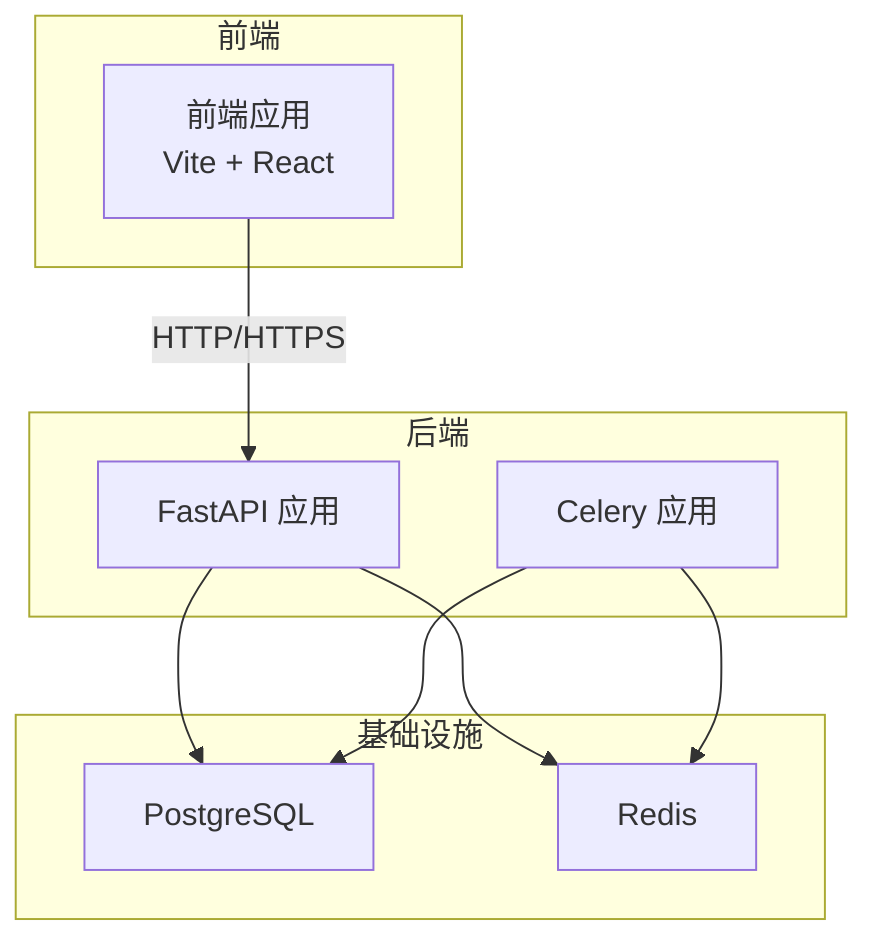
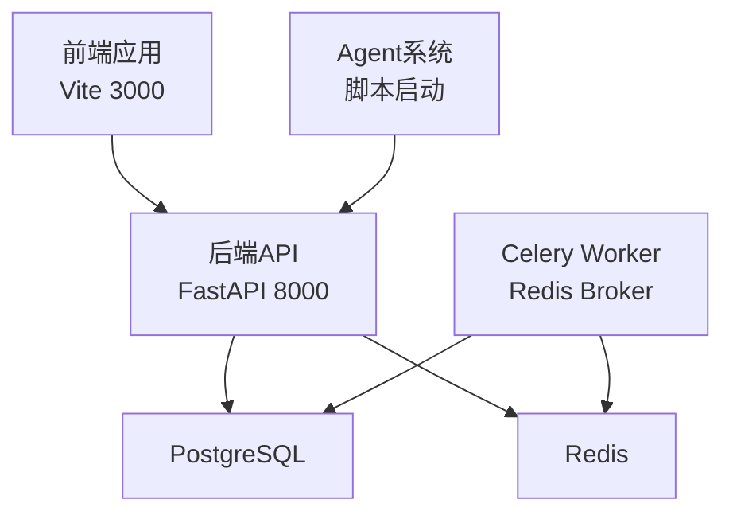
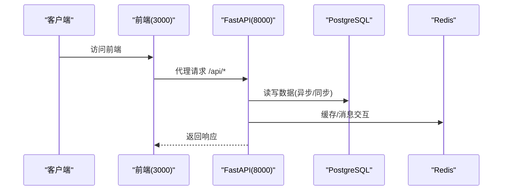
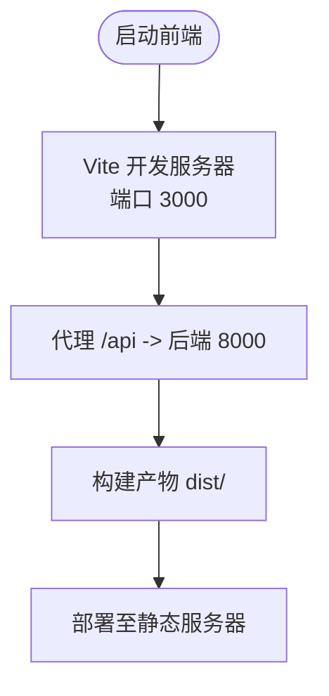
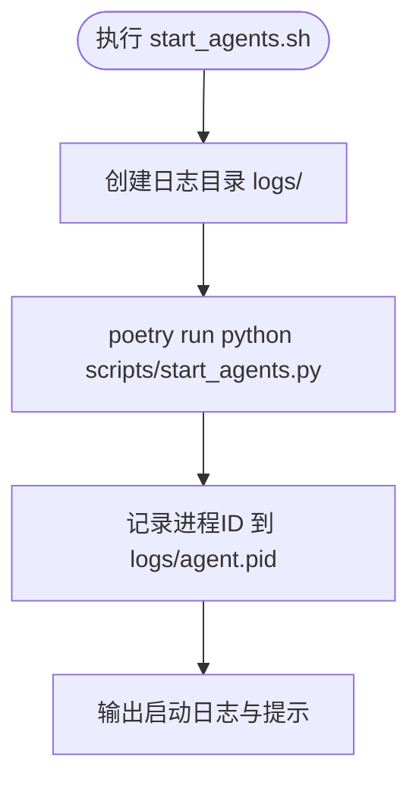
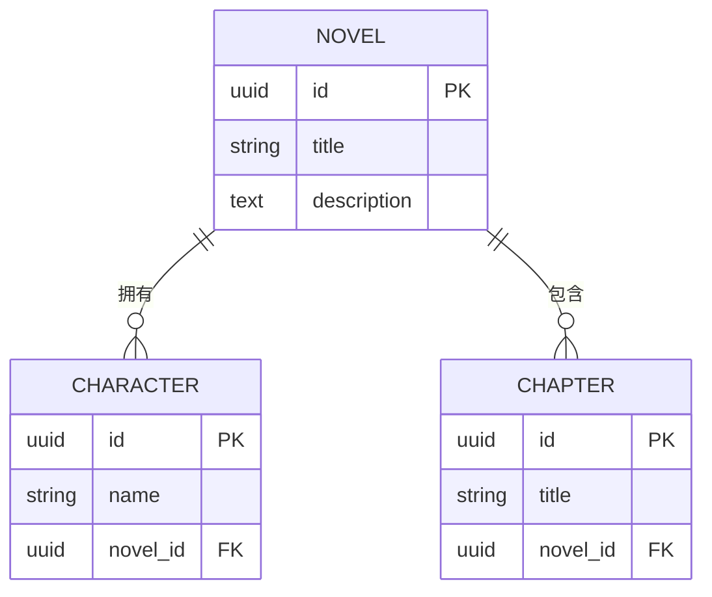
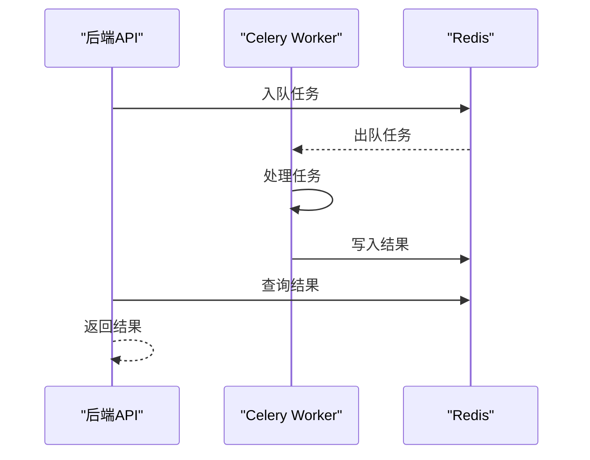
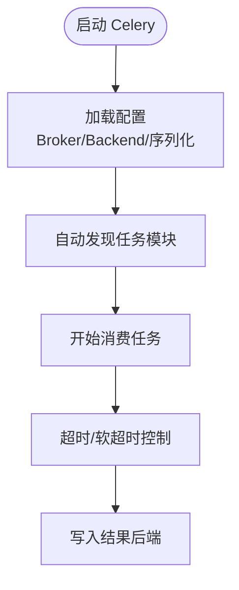
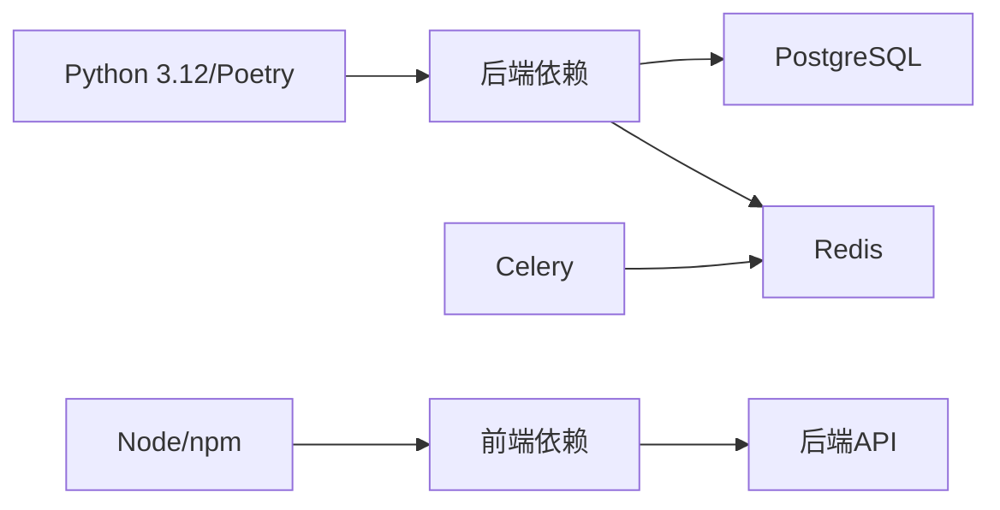

# 部署架构

<cite>
**本文引用的文件**
- [docker-compose.yml](file://docker-compose.yml)
- [pyproject.toml](file://pyproject.toml)
- [.env.example](file://.env.example)
- [backend/main.py](file://backend/main.py)
- [backend/config.py](file://backend/config.py)
- [workers/celery_app.py](file://workers/celery_app.py)
- [scripts/start_agents.sh](file://scripts/start_agents.sh)
- [scripts/run_auto_novel.sh](file://scripts/run_auto_novel.sh)
- [frontend/vite.config.ts](file://frontend/vite.config.ts)
- [.github/workflows/playwright.yml](file://.github/workflows/playwright.yml)
- [alembic.ini](file://alembic.ini)
- [alembic/env.py](file://alembic/env.py)
- [README.md](file://README.md)
</cite>

## 目录
1. [引言](#引言)
2. [项目结构](#项目结构)
3. [核心组件](#核心组件)
4. [架构总览](#架构总览)
5. [详细组件分析](#详细组件分析)
6. [依赖关系分析](#依赖关系分析)
7. [性能考虑](#性能考虑)
8. [故障排除指南](#故障排除指南)
9. [结论](#结论)
10. [附录](#附录)

## 引言
本文件面向运维与开发团队，提供小说生成系统的部署架构说明与实施指南。内容覆盖容器化部署拓扑、服务编排、环境变量配置、各组件部署方式（后端FastAPI、前端React、智能体Agent系统、数据库PostgreSQL、消息队列Redis、任务队列Celery）、部署流程、CI/CD与自动化测试策略，以及最佳实践与故障排除建议。

## 项目结构
该系统采用前后端分离与多服务协同的架构：
- 后端：基于FastAPI的API服务，负责业务接口、数据模型与服务编排。
- 前端：基于Vite+React的单页应用，通过代理访问后端API。
- 智能体Agent系统：独立脚本与启动脚本，负责自动化流程调度与执行。
- 数据库：PostgreSQL，使用异步驱动与同步驱动分别满足不同场景。
- 缓存与消息：Redis作为Broker与结果存储，支撑Celery任务队列。
- 任务队列：Celery基于Redis实现异步任务处理。
- 迁移工具：Alembic用于数据库版本迁移。
- 测试：Playwright端到端测试，配合GitHub Actions进行CI。

图表来源
- [backend/main.py](file://backend/main.py#L15-L32)
- [workers/celery_app.py](file://workers/celery_app.py#L6-L23)
- [docker-compose.yml](file://docker-compose.yml#L2-L20)

章节来源
- [backend/main.py](file://backend/main.py#L1-L53)
- [backend/config.py](file://backend/config.py#L1-L59)
- [workers/celery_app.py](file://workers/celery_app.py#L1-L26)
- [docker-compose.yml](file://docker-compose.yml#L1-L25)

## 核心组件
- 后端FastAPI服务
  - 应用入口与路由注册，CORS中间件配置，健康检查端点。
  - 通过配置模块读取环境变量，构建数据库与Redis/Celery连接。
- 前端React应用
  - Vite开发服务器，默认端口3000；通过代理将/api请求转发至后端。
- 智能体Agent系统
  - 通过启动脚本以守护进程方式运行，日志与PID管理。
- 数据库(PostgreSQL)
  - 提供异步与同步连接字符串，支持迁移与数据持久化。
- 消息队列(Redis)
  - 提供Broker与结果存储，支持高并发与可靠性。
- 任务队列(Celery)
  - 基于Redis，配置序列化、时区、任务超时与并发策略。
- 迁移工具(Alembic)
  - 配置脚本位置、日志级别与数据库URL模板。

章节来源
- [backend/main.py](file://backend/main.py#L15-L53)
- [backend/config.py](file://backend/config.py#L5-L59)
- [workers/celery_app.py](file://workers/celery_app.py#L6-L26)
- [alembic.ini](file://alembic.ini#L1-L150)

## 架构总览
系统采用“前端-后端-API-数据库/缓存”的分层架构。前端通过本地代理访问后端，后端通过异步ORM与同步ORM分别处理业务逻辑与数据库操作；智能体Agent系统通过脚本启动，Celery在Redis上执行后台任务；数据库与缓存通过Compose统一编排。

图表来源
- [frontend/vite.config.ts](file://frontend/vite.config.ts#L12-L21)
- [backend/main.py](file://backend/main.py#L15-L32)
- [workers/celery_app.py](file://workers/celery_app.py#L6-L23)
- [docker-compose.yml](file://docker-compose.yml#L2-L20)

## 详细组件分析

### 后端FastAPI服务
- 应用初始化
  - 标题、版本、描述与调试开关来自配置。
  - 注册CORS中间件，限制前端开发服务器访问。
  - 包含API路由并提供根与健康检查端点。
- 配置加载
  - 通过Pydantic Settings从.env文件加载LLM、数据库、Redis、Celery、应用与爬虫等配置。
  - 动态生成异步与同步数据库连接URL。
- 部署要点
  - 确保端口映射与网络连通性。
  - 在生产环境调整调试与CORS白名单。
  - 配置加密密钥与平台账号凭证加密。

图表来源
- [frontend/vite.config.ts](file://frontend/vite.config.ts#L15-L20)
- [backend/main.py](file://backend/main.py#L22-L32)
- [backend/config.py](file://backend/config.py#L18-L26)

章节来源
- [backend/main.py](file://backend/main.py#L15-L53)
- [backend/config.py](file://backend/config.py#L5-L59)

### 前端React应用
- 开发服务器
  - 默认端口3000，严格端口绑定。
  - 代理将/api前缀转发到后端8000端口。
- 构建与产物
  - 使用Vite构建，产物位于dist目录，包含静态资源与入口HTML。
- 部署要点
  - 生产环境可将dist部署至Nginx或静态托管。
  - 确保代理配置与后端域名一致。

图表来源
- [frontend/vite.config.ts](file://frontend/vite.config.ts#L12-L22)

章节来源
- [frontend/vite.config.ts](file://frontend/vite.config.ts#L1-L23)

### 智能体Agent系统
- 启动脚本
  - 通过Poetry运行Python脚本，重定向标准输出与错误到日志文件。
  - 记录进程ID到agent.pid，便于后续停止与监控。
- 运行模式
  - 以守护进程方式启动，适合长时间运行的自动化流程。
- 部署要点
  - 确保Poetry环境可用与脚本路径正确。
  - 结合日志轮转与进程监控，保障稳定性。

图表来源
- [scripts/start_agents.sh](file://scripts/start_agents.sh#L9-L35)

章节来源
- [scripts/start_agents.sh](file://scripts/start_agents.sh#L1-L35)

### 数据库(PostgreSQL)
- 连接配置
  - 异步驱动与同步驱动分别提供连接字符串，适配不同ORM需求。
  - 默认端口映射为5434，卷挂载保证数据持久化。
- 迁移与版本控制
  - Alembic配置脚本位置与日志级别，支持数据库演进。
- 部署要点
  - 生产环境建议使用独立主机或云数据库，启用备份与只读副本。
  - 控制连接池大小与超时，避免并发峰值导致阻塞。

图表来源
- [alembic/versions/](file://alembic/versions/40555b81bb5d_add_batch_writing_task_type.py#L1-L50)
- [core/models/novel.py](file://core/models/novel.py#L1-L50)
- [core/models/character.py](file://core/models/character.py#L1-L50)
- [core/models/chapter.py](file://core/models/chapter.py#L1-L50)

章节来源
- [backend/config.py](file://backend/config.py#L11-L26)
- [docker-compose.yml](file://docker-compose.yml#L2-L12)
- [alembic.ini](file://alembic.ini#L1-L150)

### 消息队列(Redis)
- 角色与用途
  - 作为Celery的Broker与结果存储，支撑异步任务。
  - 提供键值缓存能力，支持会话与临时数据。
- 部署要点
  - 生产环境建议启用持久化与主从复制。
  - 控制内存上限与淘汰策略，避免OOM。

图表来源
- [workers/celery_app.py](file://workers/celery_app.py#L6-L23)
- [docker-compose.yml](file://docker-compose.yml#L14-L20)

章节来源
- [workers/celery_app.py](file://workers/celery_app.py#L1-L26)
- [docker-compose.yml](file://docker-compose.yml#L14-L20)

### 任务队列(Celery)
- 配置要点
  - Broker与结果后端指向Redis。
  - 序列化、时区、UTC、任务超时、并发与预取策略。
  - 自动发现任务模块。
- 部署要点
  - 根据CPU与任务特性调整并发与预取。
  - 监控任务积压与失败率，及时扩容或优化任务。

图表来源
- [workers/celery_app.py](file://workers/celery_app.py#L12-L26)

章节来源
- [workers/celery_app.py](file://workers/celery_app.py#L1-L26)

### 自动化创作流程脚本
- 功能概述
  - 支持类型、标签、平台参数解析，调用自动化流程执行器。
  - 输出执行结果、耗时与成本统计。
- 部署要点
  - 确保Poetry环境与依赖安装。
  - 结合日志轮转与告警，监控流程成功率。

图表来源
- [scripts/run_auto_novel.sh](file://scripts/run_auto_novel.sh#L17-L53)
- [scripts/run_auto_novel.sh](file://scripts/run_auto_novel.sh#L72-L106)

章节来源
- [scripts/run_auto_novel.sh](file://scripts/run_auto_novel.sh#L1-L113)

## 依赖关系分析
- 语言与包管理
  - Python 3.12，Poetry管理依赖；前端使用npm。
- 关键依赖
  - 后端：FastAPI、SQLAlchemy异步、asyncpg、Alembic、Redis、Celery、CrewAI、DashScope/OpenAI等。
  - 前端：React、Playwright（测试）。
- 组件耦合
  - 后端对数据库与Redis存在直接依赖；Celery依赖Redis；前端依赖后端API。
- 外部依赖
  - LLM服务（DashScope/OpenAI），爬虫与第三方平台。

图表来源
- [pyproject.toml](file://pyproject.toml#L8-L36)
- [package.json](file://package.json#L1-L12)

章节来源
- [pyproject.toml](file://pyproject.toml#L1-L64)
- [package.json](file://package.json#L1-L12)

## 性能考虑
- 数据库
  - 使用异步ORM减少阻塞；合理设置连接池与查询超时。
  - 对高频表建立索引，避免全表扫描。
- 缓存与队列
  - Redis内存与淘汰策略需结合业务峰值评估。
  - Celery并发与预取应与任务类型匹配（CPU密集/IO密集）。
- 前端
  - 生产构建开启压缩与Tree-shaking；CDN加速静态资源。
- 监控与日志
  - 建议接入APM与日志聚合，设置关键指标阈值告警。

## 故障排除指南
- 健康检查
  - 后端提供健康检查端点，优先验证服务可用性。
- 数据库连接
  - 检查端口映射与凭据；确认容器网络可达。
- Redis连通性
  - 验证Broker与结果后端URL；查看队列积压与任务失败。
- 前端代理
  - 确认代理目标与端口；检查跨域策略。
- 日志定位
  - 后端：查看应用日志；Agent：查看agent.pid与agent_startup.log；自动化流程：查看auto_novel_output.log与process日志。
- CI/CD
  - Playwright测试报告上传，便于问题复现与归档。

章节来源
- [backend/main.py](file://backend/main.py#L46-L53)
- [docker-compose.yml](file://docker-compose.yml#L9-L20)
- [scripts/start_agents.sh](file://scripts/start_agents.sh#L24-L35)
- [scripts/run_auto_novel.sh](file://scripts/run_auto_novel.sh#L106-L113)
- [.github/workflows/playwright.yml](file://.github/workflows/playwright.yml#L1-L28)

## 结论
本部署架构以容器化为核心，结合FastAPI、React、Redis与Celery形成高内聚低耦合的服务体系。通过Compose快速搭建开发与测试环境，借助Playwright与CI实现自动化质量保障。生产部署建议进一步强化数据库与缓存的高可用、监控与告警体系，确保系统稳定与可观测性。

## 附录

### 环境变量与配置清单
- LLM配置
  - DASHSCOPE_API_KEY、DASHSCOPE_MODEL、DASHSCOPE_BASE_URL
- 数据库
  - DATABASE_URL、DATABASE_URL_SYNC（由DB_USER/DB_PASSWORD/DB_HOST/DB_PORT/DB_NAME拼接）
- 缓存与消息
  - REDIS_URL
- 任务队列
  - CELERY_BROKER_URL、CELERY_RESULT_BACKEND
- 应用
  - APP_ENV、APP_DEBUG、APP_HOST、APP_PORT
- 爬虫与加密
  - CRAWLER_REQUEST_DELAY、CRAWLER_MAX_RETRIES、CRAWLER_TIMEOUT、CRAWLER_USER_AGENT、ENCRYPTION_KEY

章节来源
- [.env.example](file://.env.example#L1-L21)
- [backend/config.py](file://backend/config.py#L5-L59)

### 部署流程指南
- 环境准备
  - 安装Docker与Docker Compose；安装Poetry与Node/npm。
- 依赖安装
  - 后端：poetry install；前端：npm ci。
- 配置文件
  - 复制.env.example为.env，填写LLM与数据库凭据。
- 启动服务
  - 使用Compose启动PostgreSQL与Redis；启动后端与前端。
- 初始化数据库
  - 执行迁移脚本（参考Alembic配置与版本迁移文件）。
- 启动Agent与Celery
  - 使用Agent启动脚本；启动Celery Worker。
- 验证
  - 健康检查端点、前端页面、任务队列状态。

章节来源
- [docker-compose.yml](file://docker-compose.yml#L1-L25)
- [backend/main.py](file://backend/main.py#L46-L53)
- [alembic.ini](file://alembic.ini#L86-L89)

### CI/CD与自动化测试
- GitHub Actions工作流
  - 使用Node LTS环境，安装依赖与浏览器，运行Playwright测试，并上传报告。
- 自动化测试
  - 前端端到端测试，覆盖主要页面与交互流程。
- 建议
  - 在PR中增加单元与集成测试；在主分支触发全量测试与报告归档。

章节来源
- [.github/workflows/playwright.yml](file://.github/workflows/playwright.yml#L1-L28)

### Docker容器化部署方案
- Compose服务
  - PostgreSQL：端口映射5434，数据卷postgres_data。
  - Redis：端口映射6379，数据卷redis_data。
- 建议
  - 生产环境使用独立网络与资源限制；启用健康检查与重启策略。

章节来源
- [docker-compose.yml](file://docker-compose.yml#L1-L25)

### 服务编排配置
- 端口映射
  - PostgreSQL: 5434->5432；Redis: 6379。
- 卷管理
  - 持久化数据至宿主机目录。
- 网络
  - 容器间通过服务名通信；前端代理转发至后端。

章节来源
- [docker-compose.yml](file://docker-compose.yml#L9-L20)
- [frontend/vite.config.ts](file://frontend/vite.config.ts#L15-L20)

### 数据库迁移与版本控制
- 配置
  - 脚本位置、日志级别、数据库URL模板。
- 版本迁移
  - 使用Alembic生成与应用迁移脚本，维护数据库演进历史。

章节来源
- [alembic.ini](file://alembic.ini#L1-L150)
- [alembic/env.py](file://alembic/env.py#L1-L50)

### 前端构建与部署
- 开发服务器
  - Vite默认端口3000，代理/api至后端。
- 构建产物
  - dist目录包含静态资源与入口HTML。
- 部署建议
  - Nginx反向代理；静态资源CDN；HTTPS与缓存头配置。

章节来源
- [frontend/vite.config.ts](file://frontend/vite.config.ts#L1-L23)

### 后端API与中间件
- CORS
  - 限制为前端开发服务器，生产环境按域名白名单配置。
- 路由
  - 包含API v1路由，根与健康检查端点。
- 日志
  - 应用启动即初始化日志配置。

章节来源
- [backend/main.py](file://backend/main.py#L22-L32)
- [backend/main.py](file://backend/main.py#L35-L53)

### 智能体Agent系统与自动化脚本
- Agent启动
  - 通过脚本以守护进程方式运行，记录PID与日志。
- 自动化流程
  - 参数化执行，输出结果与成本统计。

章节来源
- [scripts/start_agents.sh](file://scripts/start_agents.sh#L1-L35)
- [scripts/run_auto_novel.sh](file://scripts/run_auto_novel.sh#L1-L113)

### 任务队列与Worker
- 配置
  - Broker与结果后端、序列化、时区、超时与并发。
- 自动发现
  - 自动扫描任务模块，按需扩展。

章节来源
- [workers/celery_app.py](file://workers/celery_app.py#L1-L26)

### 参考与致谢
- 项目说明与贡献指南参见README。

章节来源
- [README.md](file://README.md#L1-L40)