# 项目概述

<cite>
**本文引用的文件**
- [pyproject.toml](file://pyproject.toml)
- [CHANGELOG.md](file://CHANGELOG.md)
- [AGENTS.md](file://AGENTS.md)
- [backend/main.py](file://backend/main.py)
- [backend/api/v1/novels.py](file://backend/api/v1/novels.py)
- [backend/config.py](file://backend/config.py)
- [workers/celery_app.py](file://workers/celery_app.py)
- [core/models/novel.py](file://core/models/novel.py)
- [core/models/ai_chat_session.py](file://core/models/ai_chat_session.py)
- [agents/crew_manager.py](file://agents/crew_manager.py)
- [agents/specific_agents.py](file://agents/specific_agents.py)
- [agents/agent_dispatcher.py](file://agents/agent_dispatcher.py)
- [agents/character_consistency_tracker.py](file://agents/character_consistency_tracker.py)
- [agents/foreshadowing_auto_injector.py](file://agents/foreshadowing_auto_injector.py)
- [llm/qwen_client.py](file://llm/qwen_client.py)
- [llm/cost_tracker.py](file://llm/cost_tracker.py)
- [core/graph/neo4j_client.py](file://core/graph/neo4j_client.py)
- [scripts/start_agents.py](file://scripts/start_agents.py)
- [docker-compose.yml](file://docker-compose.yml)
- [frontend/src/App.tsx](file://frontend/src/App.tsx)
- [frontend/package.json](file://frontend/package.json)
</cite>

## 更新摘要
**所做更改**
- 更新了项目版本信息：从1.3.2更新为2.1.0
- 新增了Neo4j图数据库支持章节
- 新增了成本追踪系统章节
- 新增了AI聊天增强功能章节
- 新增了角色进化跟踪章节
- 新增了智能重试机制章节
- 新增了AI增强型E2E测试框架章节
- 更新了核心组件分析以反映新功能
- 更新了架构总览以包含图数据库
- 更新了详细组件分析以包含新模块

## 目录
1. [引言](#引言)
2. [项目结构](#项目结构)
3. [核心组件](#核心组件)
4. [架构总览](#架构总览)
5. [详细组件分析](#详细组件分析)
6. [依赖关系分析](#依赖关系分析)
7. [性能考虑](#性能考虑)
8. [故障排查指南](#故障排查指南)
9. [结论](#结论)
10. [附录](#附录)

## 引言
本项目是一个AI驱动的小说生成系统，旨在通过多智能体协作实现从市场分析、内容策划、创作、编辑到发布的全链路自动化内容生产。系统采用Python后端（FastAPI）、React前端、AI智能体系统与数据库层的全栈架构，结合异步任务处理与LLM集成，为用户提供可规模化、可追踪的成本与质量控制能力。

**项目版本**：2.1.0

系统的核心价值主张：
- 自动化内容生产：通过多智能体流水线，自动完成市场洞察、设定构建、角色设计、情节架构与章节写作。
- 成本与质量可控：内置Token用量统计与质量评分，便于成本控制与质量评估。
- 可扩展的全栈架构：前后端分离、异步任务解耦、容器化部署，便于横向扩展与维护。
- 图数据库支持：集成Neo4j图数据库，提供智能章节分析和关系追踪能力。
- 智能成本追踪：全面的令牌使用监控和成本计算功能。
- 角色一致性保证：角色进化跟踪和相似度检测功能。
- 智能重试机制：优化的QwenClient可靠性保障。

## 项目结构
项目采用模块化分层组织，按功能域划分：
- backend：FastAPI后端服务，提供REST API、数据库ORM模型与服务层。
- frontend：React前端应用，提供可视化界面与交互。
- agents：多智能体系统，包含通用调度器、具体Agent实现与提示词管理。
- llm：LLM客户端封装与成本追踪，统一接入DashScope/Qwen。
- workers：Celery异步任务队列，承载长耗时任务。
- core：数据库模型、图数据库客户端与通用配置。
- scripts：Agent系统启动脚本与自动化流程入口。
- docker-compose：数据库与缓存服务容器编排。

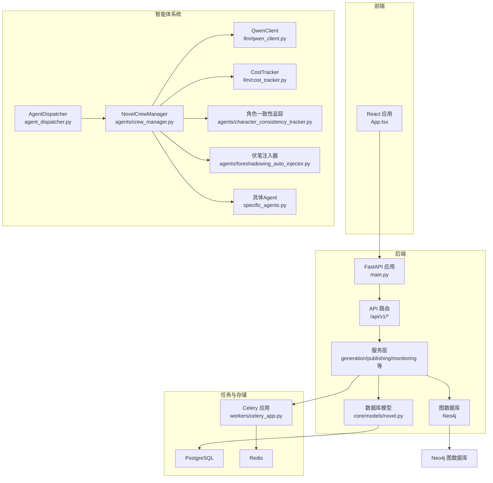

**图表来源**
- [backend/main.py:1-53](file://backend/main.py#L1-L53)
- [backend/api/v1/novels.py:1-150](file://backend/api/v1/novels.py#L1-L150)
- [agents/agent_dispatcher.py:1-52](file://agents/agent_dispatcher.py#L1-L52)
- [agents/crew_manager.py:1-480](file://agents/crew_manager.py#L1-L480)
- [agents/specific_agents.py:1-200](file://agents/specific_agents.py#L1-L200)
- [llm/qwen_client.py:1-383](file://llm/qwen_client.py#L1-L383)
- [llm/cost_tracker.py:1-126](file://llm/cost_tracker.py#L1-L126)
- [agents/character_consistency_tracker.py:1-800](file://agents/character_consistency_tracker.py#L1-L800)
- [agents/foreshadowing_auto_injector.py:1-641](file://agents/foreshadowing_auto_injector.py#L1-L641)
- [core/graph/neo4j_client.py:1-550](file://core/graph/neo4j_client.py#L1-L550)
- [workers/celery_app.py:1-26](file://workers/celery_app.py#L1-L26)
- [core/models/novel.py:1-66](file://core/models/novel.py#L1-L66)

**章节来源**
- [backend/main.py:1-53](file://backend/main.py#L1-L53)
- [backend/api/v1/novels.py:1-150](file://backend/api/v1/novels.py#L1-L150)
- [core/models/novel.py:1-66](file://core/models/novel.py#L1-L66)
- [agents/agent_dispatcher.py:1-52](file://agents/agent_dispatcher.py#L1-L52)
- [agents/crew_manager.py:1-480](file://agents/crew_manager.py#L1-L480)
- [agents/specific_agents.py:1-200](file://agents/specific_agents.py#L1-L200)
- [llm/qwen_client.py:1-383](file://llm/qwen_client.py#L1-L383)
- [llm/cost_tracker.py:1-126](file://llm/cost_tracker.py#L1-L126)
- [agents/character_consistency_tracker.py:1-800](file://agents/character_consistency_tracker.py#L1-L800)
- [agents/foreshadowing_auto_injector.py:1-641](file://agents/foreshadowing_auto_injector.py#L1-L641)
- [core/graph/neo4j_client.py:1-550](file://core/graph/neo4j_client.py#L1-L550)
- [workers/celery_app.py:1-26](file://workers/celery_app.py#L1-L26)
- [docker-compose.yml:1-25](file://docker-compose.yml#L1-L25)
- [frontend/src/App.tsx:1-16](file://frontend/src/App.tsx#L1-L16)
- [frontend/package.json:1-42](file://frontend/package.json#L1-L42)
- [pyproject.toml:1-111](file://pyproject.toml#L1-L111)

## 核心组件
- FastAPI后端服务：提供健康检查、根接口与版本化API路由，集成CORS与日志配置。
- 数据模型：定义小说、章节、角色、大纲、发布任务等实体及关系。
- 多智能体系统：通过调度器与Crew风格编排，协调市场分析、内容策划、写作、编辑与发布Agent。
- LLM客户端：统一接入DashScope/Qwen，支持重试、流式输出与OpenAI兼容模式。
- 成本追踪系统：全面的令牌使用监控和成本计算功能，支持章节维度追踪。
- 角色一致性追踪：角色进化跟踪和相似度检测功能，确保角色行为一致性。
- 伏笔自动注入：智能伏笔识别、埋设和回收系统，提升故事连贯性。
- 图数据库客户端：Neo4j图数据库连接管理，支持异步查询和事务处理。
- 异步任务：Celery + Redis，承载长耗时任务与后台作业。
- 前端应用：React + Ant Design，提供仪表盘、小说管理与监控视图。

**章节来源**
- [backend/main.py:1-53](file://backend/main.py#L1-L53)
- [core/models/novel.py:1-66](file://core/models/novel.py#L1-L66)
- [agents/crew_manager.py:1-480](file://agents/crew_manager.py#L1-L480)
- [llm/qwen_client.py:1-383](file://llm/qwen_client.py#L1-L383)
- [llm/cost_tracker.py:1-126](file://llm/cost_tracker.py#L1-L126)
- [agents/character_consistency_tracker.py:1-800](file://agents/character_consistency_tracker.py#L1-L800)
- [agents/foreshadowing_auto_injector.py:1-641](file://agents/foreshadowing_auto_injector.py#L1-L641)
- [core/graph/neo4j_client.py:1-550](file://core/graph/neo4j_client.py#L1-L550)
- [workers/celery_app.py:1-26](file://workers/celery_app.py#L1-L26)
- [frontend/src/App.tsx:1-16](file://frontend/src/App.tsx#L1-L16)

## 架构总览
系统采用"前端-后端-API路由-服务层-数据库/图数据库/任务队列"的分层架构；智能体系统作为独立子系统，通过LLM客户端与提示词管理器协同工作，并与后端服务通过API与任务队列交互。新增的图数据库层提供智能章节分析和关系追踪能力。

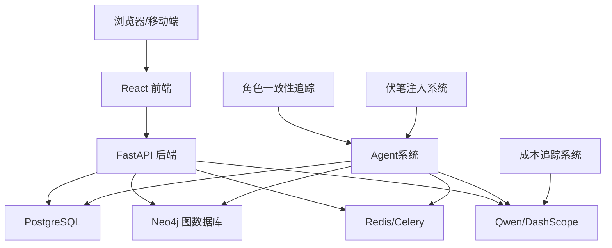

**图表来源**
- [backend/main.py:1-53](file://backend/main.py#L1-L53)
- [workers/celery_app.py:1-26](file://workers/celery_app.py#L1-L26)
- [llm/qwen_client.py:1-383](file://llm/qwen_client.py#L1-L383)
- [llm/cost_tracker.py:1-126](file://llm/cost_tracker.py#L1-L126)
- [agents/character_consistency_tracker.py:1-800](file://agents/character_consistency_tracker.py#L1-L800)
- [agents/foreshadowing_auto_injector.py:1-641](file://agents/foreshadowing_auto_injector.py#L1-L641)
- [core/graph/neo4j_client.py:1-550](file://core/graph/neo4j_client.py#L1-L550)
- [docker-compose.yml:1-25](file://docker-compose.yml#L1-L25)

## 详细组件分析

### 后端服务与API路由
- 应用入口：配置CORS、日志与根/健康检查端点。
- 路由模块：novels模块提供CRUD与分页查询，支持状态筛选与关联加载。
- 配置中心：集中管理数据库、Redis、Celery、LLM与应用参数。

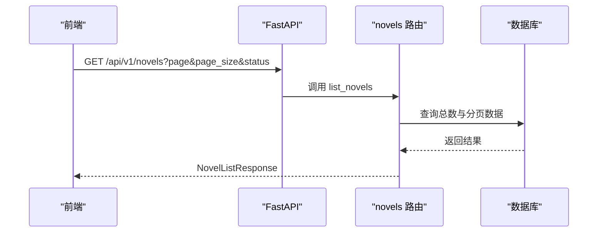

**图表来源**
- [backend/main.py:1-53](file://backend/main.py#L1-L53)
- [backend/api/v1/novels.py:1-150](file://backend/api/v1/novels.py#L1-L150)

**章节来源**
- [backend/main.py:1-53](file://backend/main.py#L1-L53)
- [backend/api/v1/novels.py:1-150](file://backend/api/v1/novels.py#L1-L150)
- [backend/config.py:1-59](file://backend/config.py#L1-L59)

### 数据模型与关系
- 小说实体：包含标题、作者、类型、标签、状态、长度类型、字数、章节数、封面、简介、目标平台、收益与Token成本等字段。
- AI聊天会话实体：支持会话隔离、标题生成和流式对话功能。
- 关系映射：与世界观、角色、大纲、章节、生成任务、发布任务的一对一/一对多关系，支持级联删除与排序。

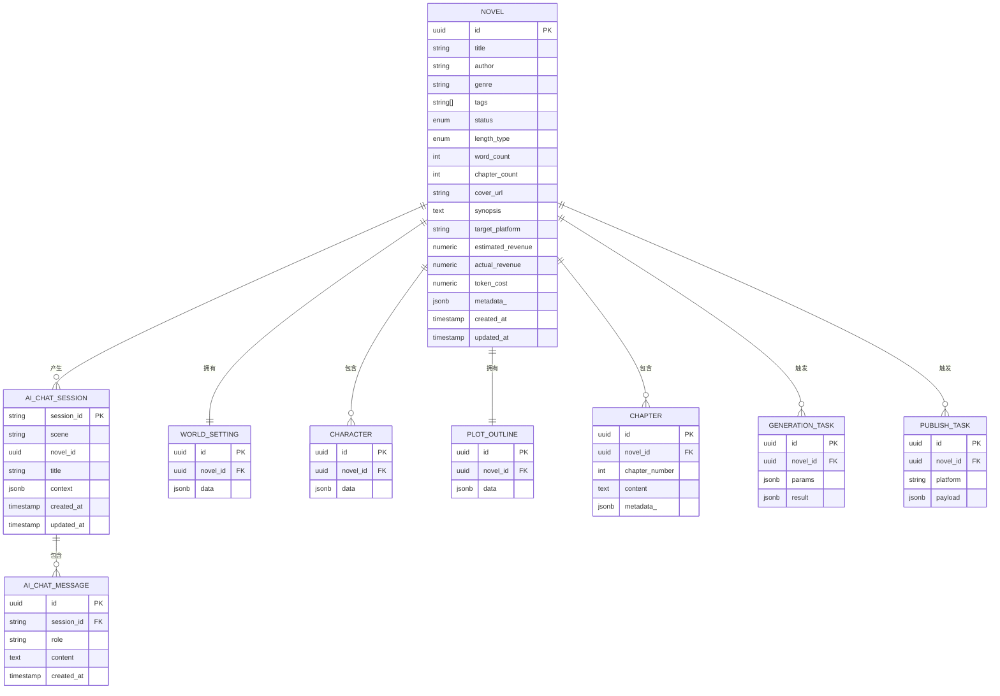

**图表来源**
- [core/models/novel.py:1-66](file://core/models/novel.py#L1-L66)
- [core/models/ai_chat_session.py:1-53](file://core/models/ai_chat_session.py#L1-L53)

**章节来源**
- [core/models/novel.py:1-66](file://core/models/novel.py#L1-L66)
- [core/models/ai_chat_session.py:1-53](file://core/models/ai_chat_session.py#L1-L53)

### 多智能体协作与Crew编排
- Agent调度器：负责在不同Agent实现之间进行调度，支持两种模式：CrewAI风格（完整企划阶段）与基于调度器的任务模式。
- Crew管理器：按阶段顺序执行主题分析、世界观构建、角色设计与情节架构；随后进入写作阶段，依次完成章节策划、初稿、编辑与连续性检查。
- 具体Agent：市场分析Agent、内容策划Agent、创作Agent、编辑Agent、发布Agent，均通过LLM客户端与提示词管理器协作。
- LLM客户端：支持DashScope与OpenAI兼容模式，具备重试、流式输出与Token用量统计。
- 成本追踪：全面的令牌使用监控和成本计算功能，支持章节维度追踪。
- 角色一致性：角色进化跟踪和相似度检测功能，确保角色行为一致性。
- 伏笔注入：智能伏笔识别、埋设和回收系统，提升故事连贯性。

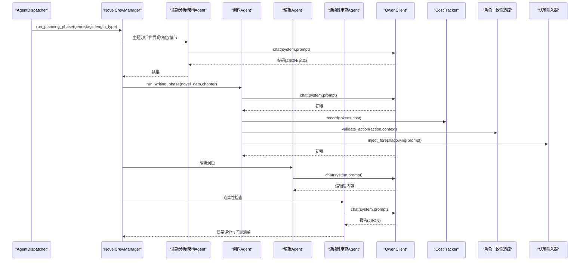

**图表来源**
- [agents/agent_dispatcher.py:1-52](file://agents/agent_dispatcher.py#L1-L52)
- [agents/crew_manager.py:1-480](file://agents/crew_manager.py#L1-L480)
- [agents/specific_agents.py:1-200](file://agents/specific_agents.py#L1-L200)
- [llm/qwen_client.py:1-383](file://llm/qwen_client.py#L1-L383)
- [llm/cost_tracker.py:1-126](file://llm/cost_tracker.py#L1-L126)
- [agents/character_consistency_tracker.py:1-800](file://agents/character_consistency_tracker.py#L1-L800)
- [agents/foreshadowing_auto_injector.py:1-641](file://agents/foreshadowing_auto_injector.py#L1-L641)

**章节来源**
- [agents/agent_dispatcher.py:1-52](file://agents/agent_dispatcher.py#L1-L52)
- [agents/crew_manager.py:1-480](file://agents/crew_manager.py#L1-L480)
- [agents/specific_agents.py:1-200](file://agents/specific_agents.py#L1-L200)
- [llm/qwen_client.py:1-383](file://llm/qwen_client.py#L1-L383)
- [llm/cost_tracker.py:1-126](file://llm/cost_tracker.py#L1-L126)
- [agents/character_consistency_tracker.py:1-800](file://agents/character_consistency_tracker.py#L1-L800)
- [agents/foreshadowing_auto_injector.py:1-641](file://agents/foreshadowing_auto_injector.py#L1-L641)

### Neo4j图数据库支持
- 图数据库客户端：提供异步的Neo4j数据库连接管理和查询执行能力，支持连接池、事务管理和健康检查。
- 节点标签白名单：防止Cypher注入攻击，支持角色、地点、事件、派系、伏笔、物品等标签。
- 关系类型白名单：支持角色关系、地理位置、参与事件、成员关系、伏笔链接、相关性等关系类型。
- 异步操作：使用线程池执行同步查询，提供异步接口，支持连接池管理。
- 健康检查：提供完整的健康状态检查功能，包括连接状态和数据库可用性验证。

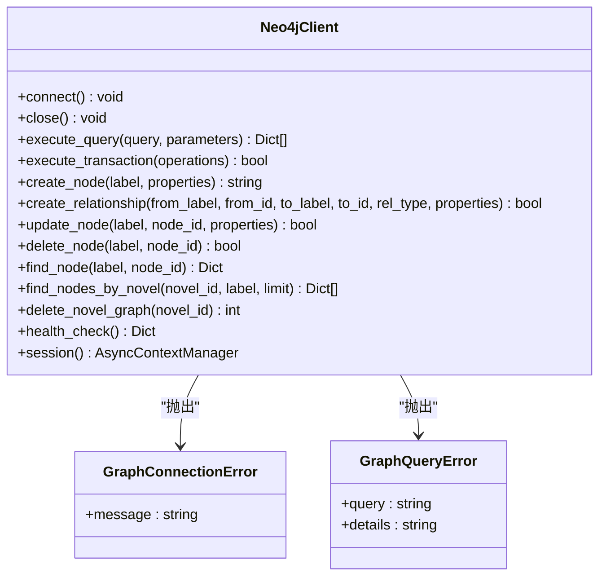

**图表来源**
- [core/graph/neo4j_client.py:1-550](file://core/graph/neo4j_client.py#L1-L550)

**章节来源**
- [core/graph/neo4j_client.py:1-550](file://core/graph/neo4j_client.py#L1-L550)

### 成本追踪系统
- 成本计算器：支持多种模型定价（qwen-plus、qwen-turbo、qwen-max），提供精确的成本计算。
- 章节维度追踪：按章节、按类别追踪成本，支持base、iteration、query、vote等分类。
- 会话隔离：支持按小说ID和会话ID进行成本追踪，便于多项目管理。
- 实时监控：记录每次API调用的token使用量，提供累计成本和详细统计。
- 成本限制：支持章节成本限制检查，防止超支。

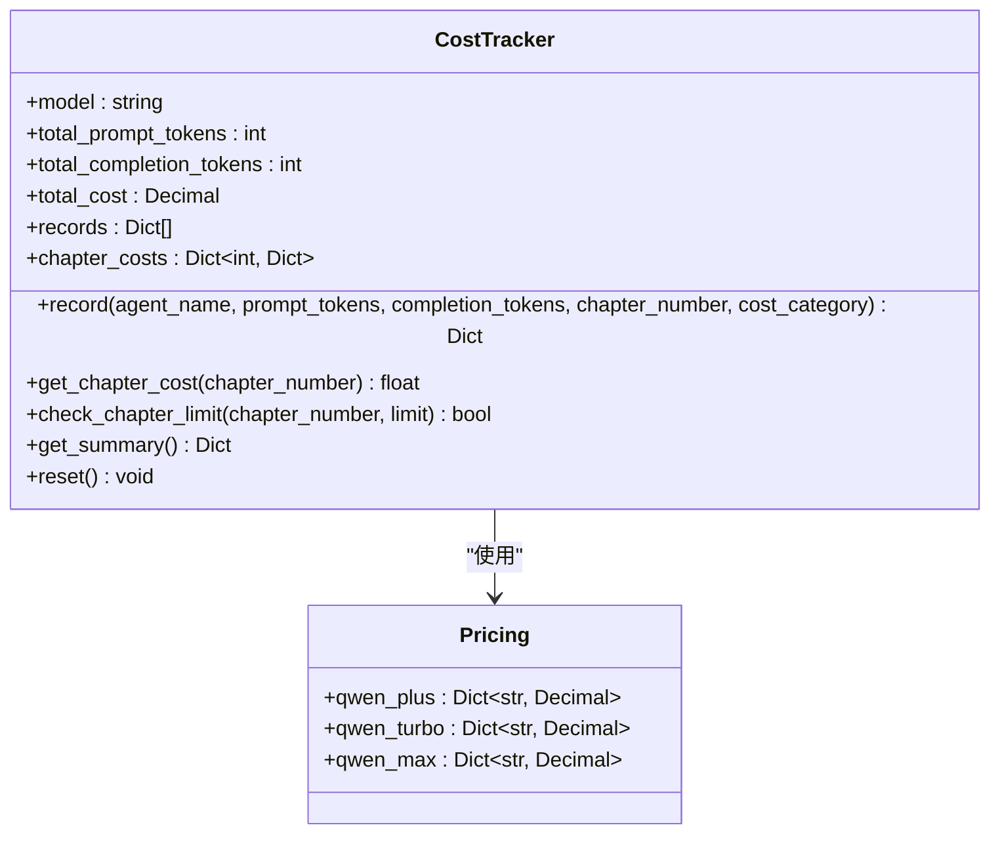

**图表来源**
- [llm/cost_tracker.py:1-126](file://llm/cost_tracker.py#L1-L126)

**章节来源**
- [llm/cost_tracker.py:1-126](file://llm/cost_tracker.py#L1-L126)

### AI聊天增强功能
- 完整数据库模式：支持AI聊天会话的完整数据库模式，包括会话表和消息表。
- 流式对话：支持流式对话功能，提供更好的用户体验。
- 会话隔离：按小说ID隔离会话，确保数据安全性。
- 标题生成：支持自动生成聊天标题，便于会话管理。
- 上下文管理：支持复杂的上下文管理，包括场景标识和自定义上下文。

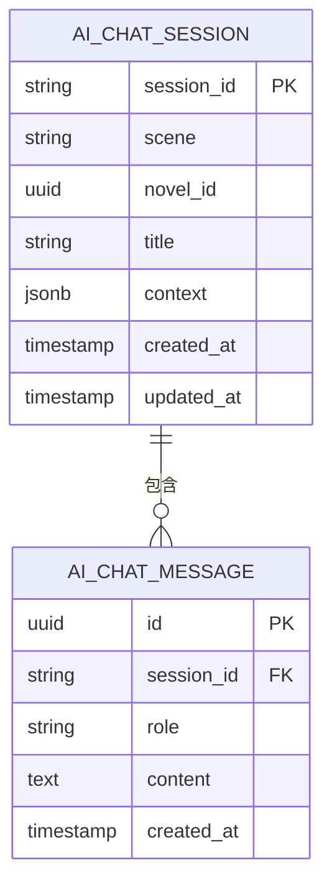

**图表来源**
- [core/models/ai_chat_session.py:1-53](file://core/models/ai_chat_session.py#L1-L53)

**章节来源**
- [core/models/ai_chat_session.py:1-53](file://core/models/ai_chat_session.py#L1-L53)

### 角色进化跟踪
- 角色档案：维护角色的核心设定，包括核心动机、行为准则、性格特质等。
- 演变记录：记录角色在能力、身份、性格、关系等方面的变化轨迹。
- 行为验证：验证新行为是否与角色人设一致，提供详细分析和建议。
- 决策历史：记录角色的重要决策，用于历史一致性检查。
- 演变类型：支持ability、identity、personality、relationship、status、skill等演变类型。

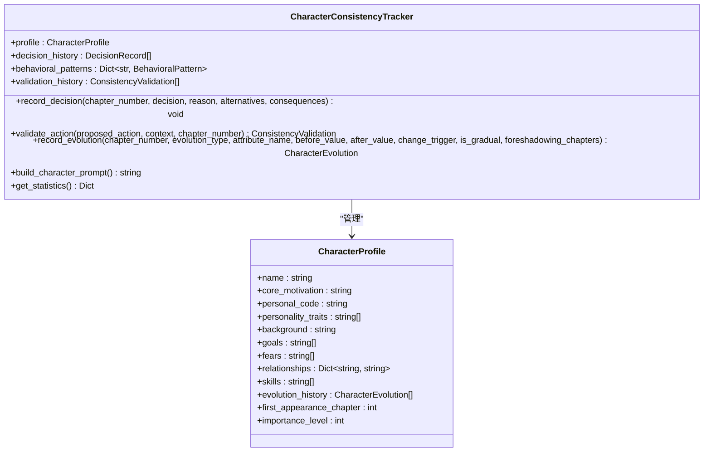

**图表来源**
- [agents/character_consistency_tracker.py:1-800](file://agents/character_consistency_tracker.py#L1-L800)

**章节来源**
- [agents/character_consistency_tracker.py:1-800](file://agents/character_consistency_tracker.py#L1-L800)

### 伏笔自动注入系统
- 伏笔状态管理：支持pending、planted、paying_off、resolved、abandoned等状态。
- 任务优先级：基于重要性和超期程度计算紧急程度分数。
- 自动识别：自动识别当前章需要回收的伏笔和应该埋设的新伏笔。
- 提示词注入：将伏笔要求强制注入到创作流程，确保故事连贯性。
- 统计分析：提供完整的伏笔统计信息和回收率分析。

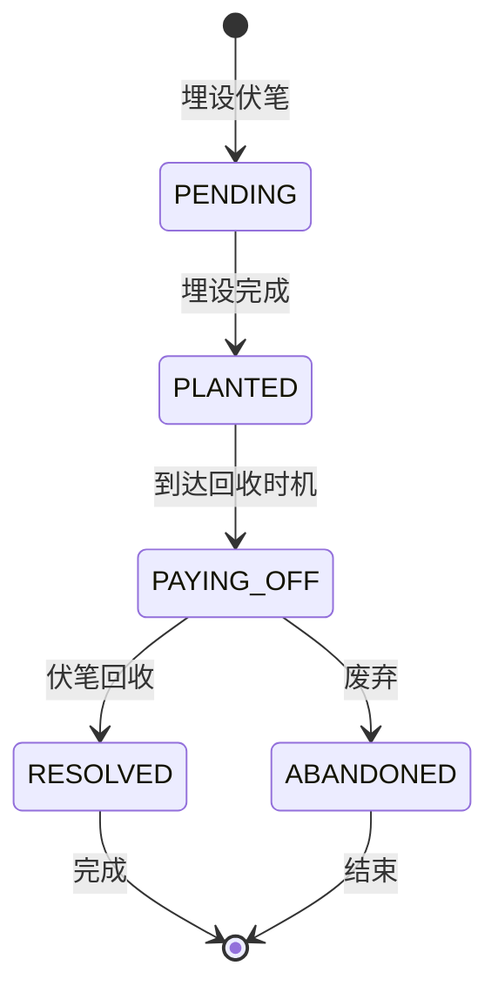

**图表来源**
- [agents/foreshadowing_auto_injector.py:1-641](file://agents/foreshadowing_auto_injector.py#L1-L641)

**章节来源**
- [agents/foreshadowing_auto_injector.py:1-641](file://agents/foreshadowing_auto_injector.py#L1-L641)

### 智能重试机制
- 增强重试策略：对连接错误使用更长的退避时间，普通错误使用标准退避策略。
- 超时配置：支持自定义超时时间，特别是复杂任务可能需要5分钟超时。
- 错误分类：区分连接错误和其他错误，采用不同的重试策略。
- 详细日志：记录详细的错误类型和重试过程，便于问题诊断。
- OpenAI兼容：支持OpenAI兼容模式的智能重试机制。

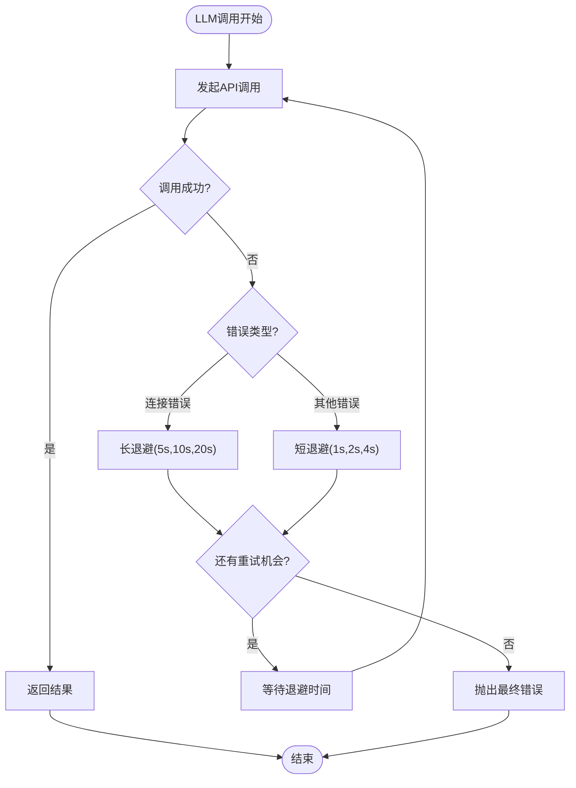

**图表来源**
- [llm/qwen_client.py:1-383](file://llm/qwen_client.py#L1-L383)

**章节来源**
- [llm/qwen_client.py:1-383](file://llm/qwen_client.py#L1-L383)

### 异步任务与Celery集成
- Celery应用：配置Broker与Backend、序列化、时区、任务超时与并发策略。
- 任务发现：自动发现workers包下的任务，支持长任务限流与可靠性保障。
- 与后端集成：后端服务通过Celery提交生成、发布等异步任务，前端轮询状态或订阅WebSocket更新。

**图表来源**
- [workers/celery_app.py:1-26](file://workers/celery_app.py#L1-L26)

**章节来源**
- [workers/celery_app.py:1-26](file://workers/celery_app.py#L1-L26)

### LLM集成与成本追踪
- QwenClient：支持DashScope与OpenAI兼容模式，统一chat/stream_chat接口，内置指数退避重试与线程池执行同步调用，避免阻塞事件循环。
- 成本追踪：每次调用记录prompt/completion/total tokens，便于成本核算与预算控制。
- 提示词管理：集中管理各Agent提示词模板，支持格式化注入上下文。

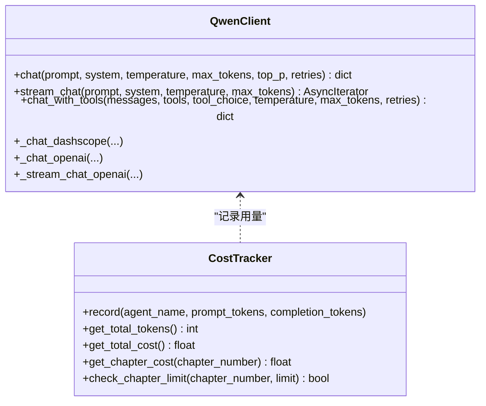

**图表来源**
- [llm/qwen_client.py:1-383](file://llm/qwen_client.py#L1-L383)
- [llm/cost_tracker.py:1-126](file://llm/cost_tracker.py#L1-L126)

**章节来源**
- [llm/qwen_client.py:1-383](file://llm/qwen_client.py#L1-L383)
- [llm/cost_tracker.py:1-126](file://llm/cost_tracker.py#L1-L126)

### 前端与部署拓扑
- 前端：React + Ant Design，提供路由、布局与组件化页面；依赖Axios、Zustand等库。
- 部署：PostgreSQL与Redis通过docker-compose编排，本地开发环境快速可用。

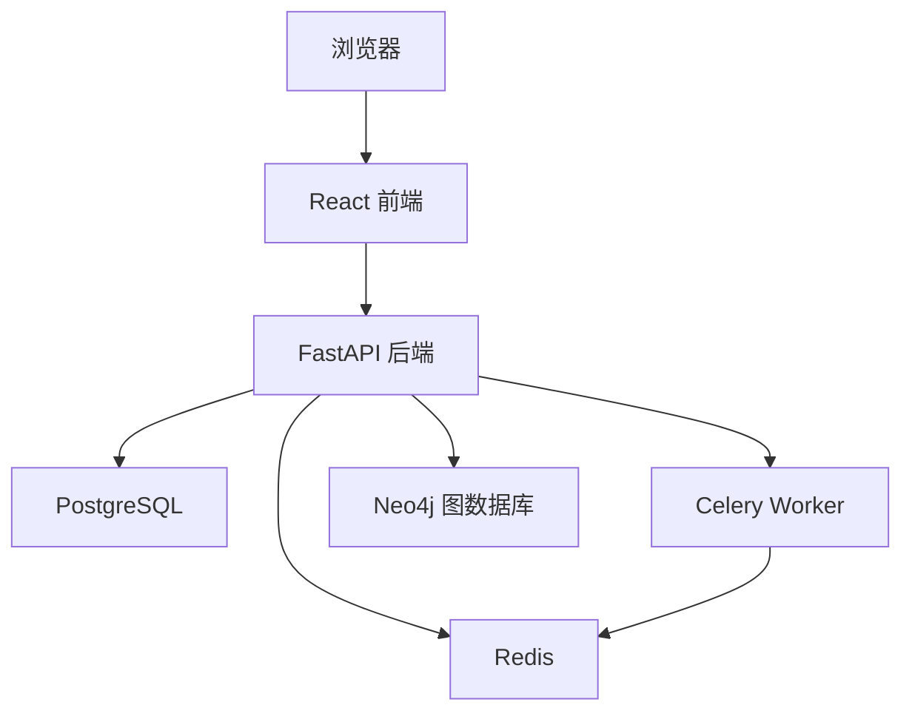

**图表来源**
- [frontend/src/App.tsx:1-16](file://frontend/src/App.tsx#L1-L16)
- [frontend/package.json:1-42](file://frontend/package.json#L1-L42)
- [docker-compose.yml:1-25](file://docker-compose.yml#L1-L25)

**章节来源**
- [frontend/src/App.tsx:1-16](file://frontend/src/App.tsx#L1-L16)
- [frontend/package.json:1-42](file://frontend/package.json#L1-L42)
- [docker-compose.yml:1-25](file://docker-compose.yml#L1-L25)

## 依赖关系分析
- 后端依赖：FastAPI、SQLAlchemy(asyncpg)、Alembic、Pydantic/Settings、Celery/Redis、DashScope/OpenAI、Websockets、Neo4j等。
- 前端依赖：React、React Router、Ant Design、Axios、Zustand等。
- 智能体与LLM：CrewAI（工具与框架支持）、DashScope/Qwen、提示词管理器与成本追踪器。
- 图数据库：Neo4j Python Driver，支持异步操作和连接池管理。

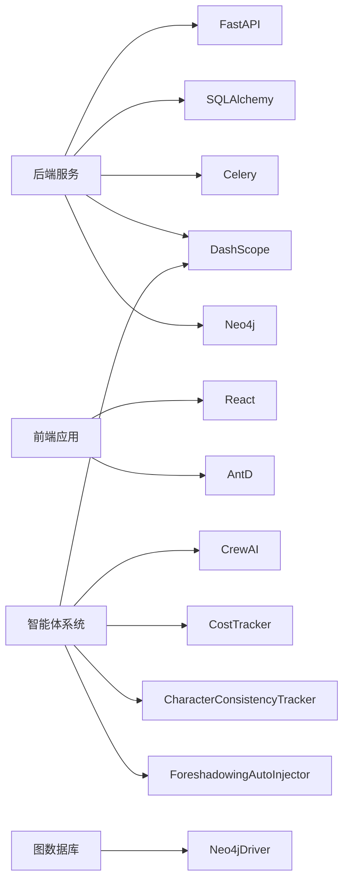

**图表来源**
- [pyproject.toml:1-111](file://pyproject.toml#L1-L111)

**章节来源**
- [pyproject.toml:1-111](file://pyproject.toml#L1-L111)

## 性能考虑
- 异步与并发：后端使用FastAPI异步IO，数据库访问采用异步驱动；智能体调用通过线程池避免阻塞事件循环。
- 任务隔离：长耗时任务放入Celery队列，避免阻塞主请求线程。
- 成本控制：LLM调用统一走QwenClient，记录Token用量，便于预算与性能优化。
- 缓存与存储：Redis用于任务队列与会话缓存；PostgreSQL存储结构化数据，配合索引与分页查询。
- 图数据库优化：Neo4j连接池管理，支持异步查询和事务处理，提升大规模数据处理性能。
- 成本追踪：章节维度的成本追踪，支持实时监控和预算控制。

## 故障排查指南
- 健康检查：后端提供健康检查端点，用于快速判断服务状态。
- 日志定位：全局日志配置与模块级日志，便于定位Agent执行、LLM调用与任务队列异常。
- LLM调用失败：检查API Key、Base URL与网络连通性；确认重试策略与指数退避生效。
- 任务堆积：检查Redis连接、Celery worker进程与并发配置，关注任务超时与软超时设置。
- 数据库连接：核对DATABASE_URL与端口映射，确认容器内PostgreSQL可达。
- 图数据库连接：检查Neo4j连接配置、认证信息和网络连通性，确认连接池配置合理。
- 成本追踪异常：验证CostTracker配置，检查模型定价和token计算逻辑。
- 角色一致性验证：确认角色档案完整性，检查验证逻辑和评分标准。

**章节来源**
- [backend/main.py:46-53](file://backend/main.py#L46-L53)
- [backend/config.py:1-59](file://backend/config.py#L1-L59)
- [llm/qwen_client.py:1-383](file://llm/qwen_client.py#L1-L383)
- [llm/cost_tracker.py:1-126](file://llm/cost_tracker.py#L1-L126)
- [agents/character_consistency_tracker.py:1-800](file://agents/character_consistency_tracker.py#L1-L800)
- [core/graph/neo4j_client.py:1-550](file://core/graph/neo4j_client.py#L1-L550)
- [workers/celery_app.py:1-26](file://workers/celery_app.py#L1-L26)
- [docker-compose.yml:1-25](file://docker-compose.yml#L1-L25)

## 结论
本项目通过"后端API + 智能体系统 + LLM + 异步任务 + 数据库 + 图数据库"的全栈架构，实现了从市场洞察到内容生产的自动化流水线。v2.1.0版本新增的Neo4j图数据库支持、成本追踪系统、AI聊天增强、角色进化跟踪、智能重试机制等功能，进一步提升了系统的智能化水平和可运维性。系统具备良好的扩展性与可观测性，适合在内容创作、IP孵化与多平台发布场景中规模化落地。建议在生产环境中进一步完善监控告警、限流熔断与灰度发布机制，持续优化LLM提示词与Agent编排策略。

**项目版本**：2.1.0

## 附录
- 实际使用场景举例：
  - 快速生成中篇/长篇小说：输入题材与长度类型，系统自动完成企划与章节写作。
  - 多平台发布：根据平台特性生成适配内容，提交发布任务至队列。
  - 成本与收益追踪：记录Token用量与平台收益，辅助运营决策。
  - 智能章节分析：利用图数据库分析角色关系和情节发展。
  - 角色一致性保证：确保角色行为符合人设，提升故事质量。
- 关键概念说明（面向初学者）：
  - CrewAI智能体框架：用于角色扮演与多Agent协作的编排工具，本项目采用其思想但自研编排器以灵活对接Qwen。
  - 异步任务处理：通过Celery与Redis实现后台任务解耦，提升用户体验与系统吞吐。
  - LLM集成：统一通过QwenClient封装DashScope/Qwen，支持重试、流式输出与用量统计。
  - Neo4j图数据库：提供强大的关系查询能力，支持复杂的故事分析和角色关系追踪。
  - 成本追踪：全面的令牌使用监控系统，支持章节维度的成本分析和预算控制。
  - 角色一致性：基于角色档案的智能验证系统，确保故事连贯性和角色可信度。
  - 伏笔管理：智能的伏笔识别、埋设和回收系统，提升故事结构完整性。