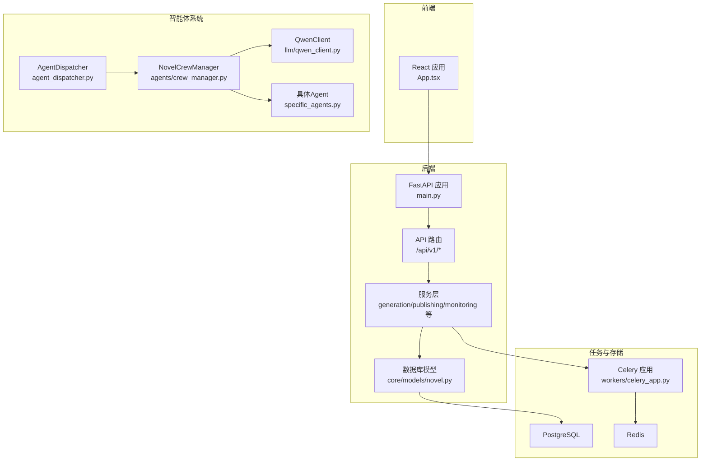
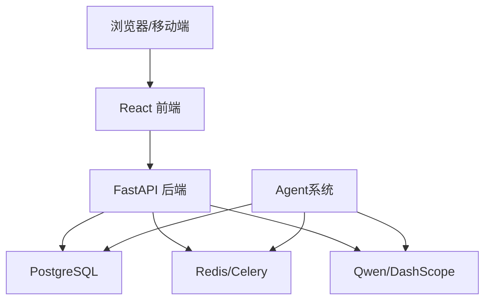
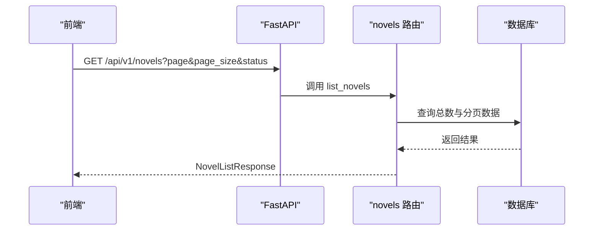
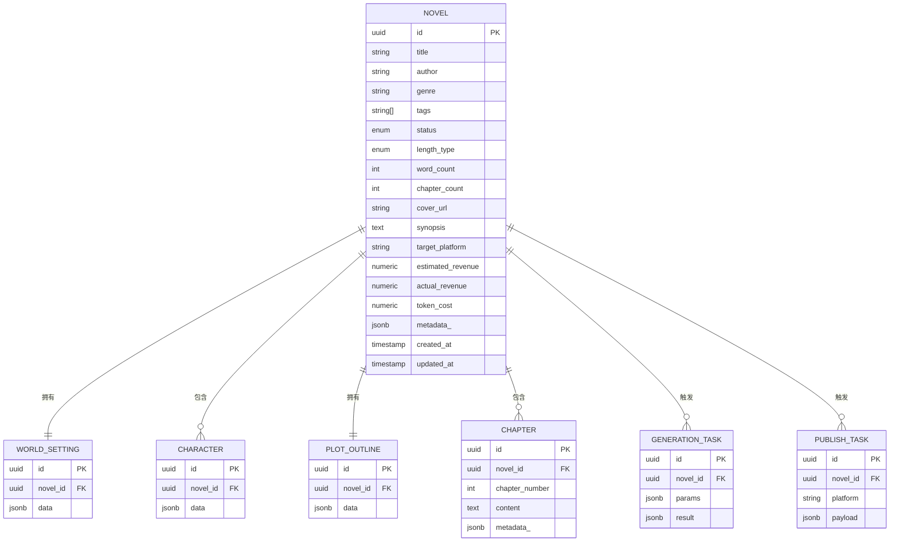
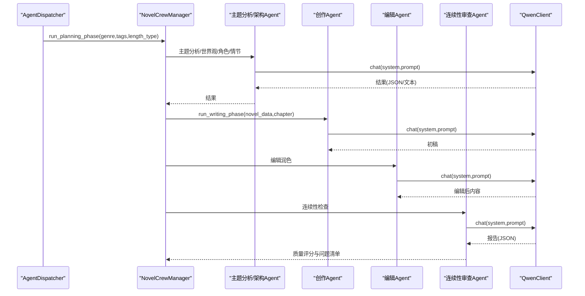
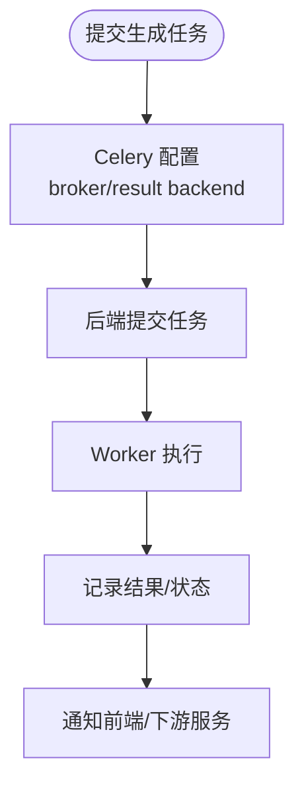
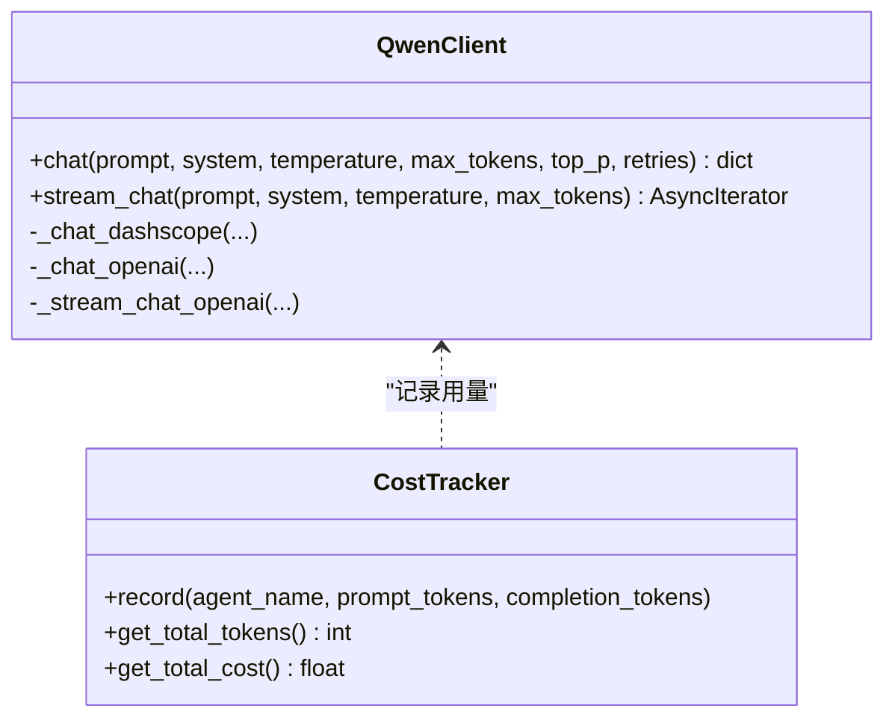
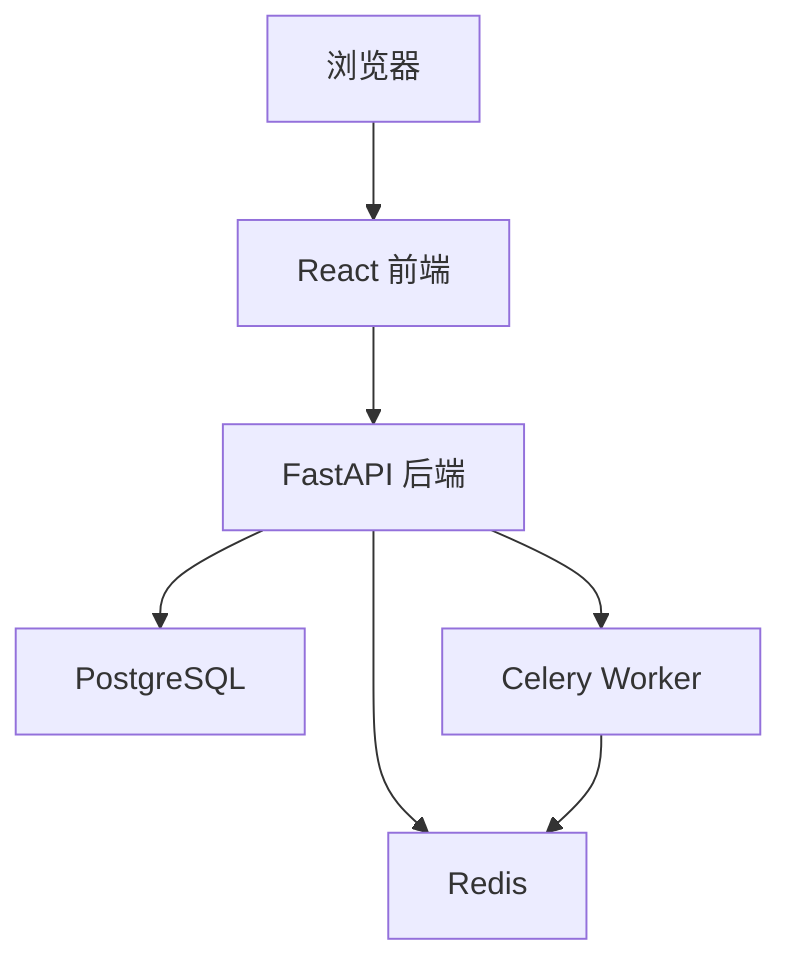
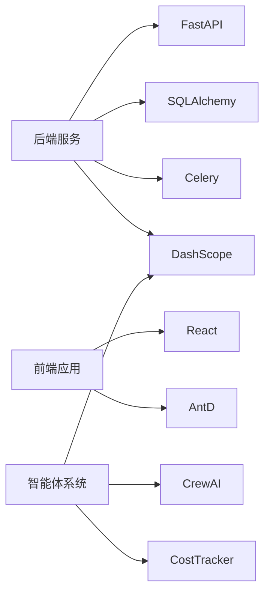

# 项目概述

<cite>
**本文引用的文件**
- [README.md](file://README.md)
- [backend/main.py](file://backend/main.py)
- [backend/api/v1/novels.py](file://backend/api/v1/novels.py)
- [backend/config.py](file://backend/config.py)
- [workers/celery_app.py](file://workers/celery_app.py)
- [core/models/novel.py](file://core/models/novel.py)
- [agents/crew_manager.py](file://agents/crew_manager.py)
- [agents/specific_agents.py](file://agents/specific_agents.py)
- [agents/agent_dispatcher.py](file://agents/agent_dispatcher.py)
- [llm/qwen_client.py](file://llm/qwen_client.py)
- [scripts/start_agents.py](file://scripts/start_agents.py)
- [docker-compose.yml](file://docker-compose.yml)
- [frontend/src/App.tsx](file://frontend/src/App.tsx)
- [frontend/package.json](file://frontend/package.json)
- [pyproject.toml](file://pyproject.toml)
</cite>

## 目录
1. [引言](#引言)
2. [项目结构](#项目结构)
3. [核心组件](#核心组件)
4. [架构总览](#架构总览)
5. [详细组件分析](#详细组件分析)
6. [依赖关系分析](#依赖关系分析)
7. [性能考虑](#性能考虑)
8. [故障排查指南](#故障排查指南)
9. [结论](#结论)
10. [附录](#附录)

## 引言
本项目是一个AI驱动的小说生成系统，旨在通过多智能体协作实现从市场分析、内容策划、创作、编辑到发布的全链路自动化内容生产。系统采用Python后端（FastAPI）、React前端、AI智能体系统与数据库层的全栈架构，结合异步任务处理与LLM集成，为用户提供可规模化、可追踪的成本与质量控制能力。

系统的核心价值主张：
- 自动化内容生产：通过多智能体流水线，自动完成市场洞察、设定构建、角色设计、情节架构与章节写作。
- 成本与质量可控：内置Token用量统计与质量评分，便于成本控制与质量评估。
- 可扩展的全栈架构：前后端分离、异步任务解耦、容器化部署，便于横向扩展与维护。

## 项目结构
项目采用模块化分层组织，按功能域划分：
- backend：FastAPI后端服务，提供REST API、数据库ORM模型与服务层。
- frontend：React前端应用，提供可视化界面与交互。
- agents：多智能体系统，包含通用调度器、具体Agent实现与提示词管理。
- llm：LLM客户端封装与成本追踪，统一接入DashScope/Qwen。
- workers：Celery异步任务队列，承载长耗时任务。
- core：数据库模型与通用配置。
- scripts：Agent系统启动脚本与自动化流程入口。
- docker-compose：数据库与缓存服务容器编排。

图表来源
- [backend/main.py](file://backend/main.py#L1-L53)
- [backend/api/v1/novels.py](file://backend/api/v1/novels.py#L1-L150)
- [agents/agent_dispatcher.py](file://agents/agent_dispatcher.py#L1-L52)
- [agents/crew_manager.py](file://agents/crew_manager.py#L1-L480)
- [agents/specific_agents.py](file://agents/specific_agents.py#L1-L200)
- [llm/qwen_client.py](file://llm/qwen_client.py#L1-L232)
- [workers/celery_app.py](file://workers/celery_app.py#L1-L26)
- [core/models/novel.py](file://core/models/novel.py#L1-L66)

章节来源
- [backend/main.py](file://backend/main.py#L1-L53)
- [backend/api/v1/novels.py](file://backend/api/v1/novels.py#L1-L150)
- [core/models/novel.py](file://core/models/novel.py#L1-L66)
- [agents/agent_dispatcher.py](file://agents/agent_dispatcher.py#L1-L52)
- [agents/crew_manager.py](file://agents/crew_manager.py#L1-L480)
- [agents/specific_agents.py](file://agents/specific_agents.py#L1-L200)
- [llm/qwen_client.py](file://llm/qwen_client.py#L1-L232)
- [workers/celery_app.py](file://workers/celery_app.py#L1-L26)
- [docker-compose.yml](file://docker-compose.yml#L1-L25)
- [frontend/src/App.tsx](file://frontend/src/App.tsx#L1-L16)
- [frontend/package.json](file://frontend/package.json#L1-L42)
- [pyproject.toml](file://pyproject.toml#L1-L64)

## 核心组件
- FastAPI后端服务：提供健康检查、根接口与版本化API路由，集成CORS与日志配置。
- 数据模型：定义小说、章节、角色、大纲、发布任务等实体及关系。
- 多智能体系统：通过调度器与Crew风格编排，协调市场分析、内容策划、写作、编辑与发布Agent。
- LLM客户端：统一接入DashScope/Qwen，支持重试、流式输出与OpenAI兼容模式。
- 异步任务：Celery + Redis，承载长耗时任务与后台作业。
- 前端应用：React + Ant Design，提供仪表盘、小说管理与监控视图。

章节来源
- [backend/main.py](file://backend/main.py#L1-L53)
- [core/models/novel.py](file://core/models/novel.py#L1-L66)
- [agents/crew_manager.py](file://agents/crew_manager.py#L1-L480)
- [llm/qwen_client.py](file://llm/qwen_client.py#L1-L232)
- [workers/celery_app.py](file://workers/celery_app.py#L1-L26)
- [frontend/src/App.tsx](file://frontend/src/App.tsx#L1-L16)

## 架构总览
系统采用“前端-后端-API路由-服务层-数据库/任务队列”的分层架构；智能体系统作为独立子系统，通过LLM客户端与提示词管理器协同工作，并与后端服务通过API与任务队列交互。

图表来源
- [backend/main.py](file://backend/main.py#L1-L53)
- [workers/celery_app.py](file://workers/celery_app.py#L1-L26)
- [llm/qwen_client.py](file://llm/qwen_client.py#L1-L232)
- [docker-compose.yml](file://docker-compose.yml#L1-L25)

## 详细组件分析

### 后端服务与API路由
- 应用入口：配置CORS、日志与根/健康检查端点。
- 路由模块：novels模块提供CRUD与分页查询，支持状态筛选与关联加载。
- 配置中心：集中管理数据库、Redis、Celery、LLM与应用参数。

图表来源
- [backend/main.py](file://backend/main.py#L1-L53)
- [backend/api/v1/novels.py](file://backend/api/v1/novels.py#L1-L150)

章节来源
- [backend/main.py](file://backend/main.py#L1-L53)
- [backend/api/v1/novels.py](file://backend/api/v1/novels.py#L1-L150)
- [backend/config.py](file://backend/config.py#L1-L59)

### 数据模型与关系
- 小说实体：包含标题、作者、类型、标签、状态、长度类型、字数、章节数、封面、简介、目标平台、收益与Token成本等字段。
- 关系映射：与世界观、角色、大纲、章节、生成任务、发布任务的一对一/一对多关系，支持级联删除与排序。

图表来源
- [core/models/novel.py](file://core/models/novel.py#L1-L66)

章节来源
- [core/models/novel.py](file://core/models/novel.py#L1-L66)

### 多智能体协作与Crew编排
- Agent调度器：负责在不同Agent实现之间进行调度，支持两种模式：CrewAI风格（完整企划阶段）与基于调度器的任务模式。
- Crew管理器：按阶段顺序执行主题分析、世界观构建、角色设计与情节架构；随后进入写作阶段，依次完成章节策划、初稿、编辑与连续性检查。
- 具体Agent：市场分析Agent、内容策划Agent、创作Agent、编辑Agent、发布Agent，均通过LLM客户端与提示词管理器协作。
- LLM客户端：支持DashScope与OpenAI兼容模式，具备重试、流式输出与Token用量统计。

图表来源
- [agents/agent_dispatcher.py](file://agents/agent_dispatcher.py#L1-L52)
- [agents/crew_manager.py](file://agents/crew_manager.py#L1-L480)
- [agents/specific_agents.py](file://agents/specific_agents.py#L1-L200)
- [llm/qwen_client.py](file://llm/qwen_client.py#L1-L232)

章节来源
- [agents/agent_dispatcher.py](file://agents/agent_dispatcher.py#L1-L52)
- [agents/crew_manager.py](file://agents/crew_manager.py#L1-L480)
- [agents/specific_agents.py](file://agents/specific_agents.py#L1-L200)
- [llm/qwen_client.py](file://llm/qwen_client.py#L1-L232)

### 异步任务与Celery集成
- Celery应用：配置Broker与Backend、序列化、时区、任务超时与并发策略。
- 任务发现：自动发现workers包下的任务，支持长任务限流与可靠性保障。
- 与后端集成：后端服务通过Celery提交生成、发布等异步任务，前端轮询状态或订阅WebSocket更新。

图表来源
- [workers/celery_app.py](file://workers/celery_app.py#L1-L26)

章节来源
- [workers/celery_app.py](file://workers/celery_app.py#L1-L26)

### LLM集成与成本追踪
- QwenClient：支持DashScope与OpenAI兼容模式，统一chat/stream_chat接口，内置指数退避重试与线程池执行同步调用，避免阻塞事件循环。
- 成本追踪：每次调用记录prompt/completion/total tokens，便于成本核算与预算控制。
- 提示词管理：集中管理各Agent提示词模板，支持格式化注入上下文。

图表来源
- [llm/qwen_client.py](file://llm/qwen_client.py#L1-L232)

章节来源
- [llm/qwen_client.py](file://llm/qwen_client.py#L1-L232)

### 前端与部署拓扑
- 前端：React + Ant Design，提供路由、布局与组件化页面；依赖Axios、Zustand等库。
- 部署：PostgreSQL与Redis通过docker-compose编排，本地开发环境快速可用。

图表来源
- [frontend/src/App.tsx](file://frontend/src/App.tsx#L1-L16)
- [frontend/package.json](file://frontend/package.json#L1-L42)
- [docker-compose.yml](file://docker-compose.yml#L1-L25)

章节来源
- [frontend/src/App.tsx](file://frontend/src/App.tsx#L1-L16)
- [frontend/package.json](file://frontend/package.json#L1-L42)
- [docker-compose.yml](file://docker-compose.yml#L1-L25)

## 依赖关系分析
- 后端依赖：FastAPI、SQLAlchemy(asyncpg)、Alembic、Pydantic/Settings、Celery/Redis、DashScope/OpenAI、Websockets等。
- 前端依赖：React、React Router、Ant Design、Axios、Zustand等。
- 智能体与LLM：CrewAI（工具与框架支持）、DashScope/Qwen、提示词管理器与成本追踪器。

图表来源
- [pyproject.toml](file://pyproject.toml#L1-L64)

章节来源
- [pyproject.toml](file://pyproject.toml#L1-L64)

## 性能考虑
- 异步与并发：后端使用FastAPI异步IO，数据库访问采用异步驱动；智能体调用通过线程池避免阻塞事件循环。
- 任务隔离：长耗时任务放入Celery队列，避免阻塞主请求线程。
- 成本控制：LLM调用统一走QwenClient，记录Token用量，便于预算与性能优化。
- 缓存与存储：Redis用于任务队列与会话缓存；PostgreSQL存储结构化数据，配合索引与分页查询。

## 故障排查指南
- 健康检查：后端提供健康检查端点，用于快速判断服务状态。
- 日志定位：全局日志配置与模块级日志，便于定位Agent执行、LLM调用与任务队列异常。
- LLM调用失败：检查API Key、Base URL与网络连通性；确认重试策略与指数退避生效。
- 任务堆积：检查Redis连接、Celery worker进程与并发配置，关注任务超时与软超时设置。
- 数据库连接：核对DATABASE_URL与端口映射，确认容器内PostgreSQL可达。

章节来源
- [backend/main.py](file://backend/main.py#L46-L53)
- [backend/config.py](file://backend/config.py#L1-L59)
- [llm/qwen_client.py](file://llm/qwen_client.py#L1-L232)
- [workers/celery_app.py](file://workers/celery_app.py#L1-L26)
- [docker-compose.yml](file://docker-compose.yml#L1-L25)

## 结论
本项目通过“后端API + 智能体系统 + LLM + 异步任务 + 数据库”的全栈架构，实现了从市场洞察到内容生产的自动化流水线。系统具备良好的扩展性与可观测性，适合在内容创作、IP孵化与多平台发布场景中规模化落地。建议在生产环境中进一步完善监控告警、限流熔断与灰度发布机制，持续优化LLM提示词与Agent编排策略。

## 附录
- 实际使用场景举例：
  - 快速生成中篇/长篇小说：输入题材与长度类型，系统自动完成企划与章节写作。
  - 多平台发布：根据平台特性生成适配内容，提交发布任务至队列。
  - 成本与收益追踪：记录Token用量与平台收益，辅助运营决策。
- 关键概念说明（面向初学者）：
  - CrewAI智能体框架：用于角色扮演与多Agent协作的编排工具，本项目采用其思想但自研编排器以灵活对接Qwen。
  - 异步任务处理：通过Celery与Redis实现后台任务解耦，提升用户体验与系统吞吐。
  - LLM集成：统一通过QwenClient封装DashScope/Qwen，支持重试、流式输出与用量统计。