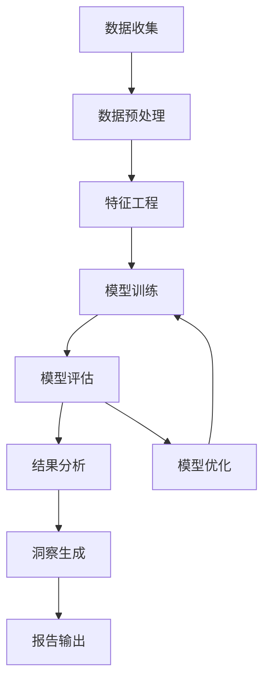
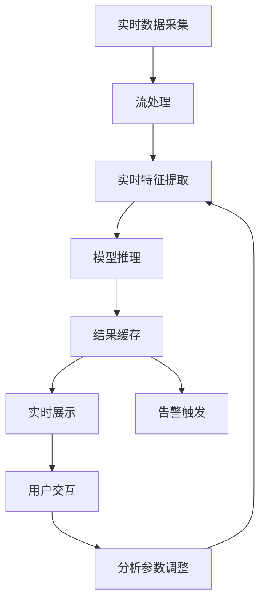
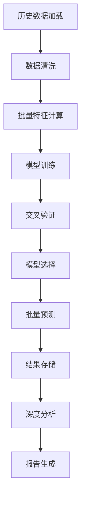
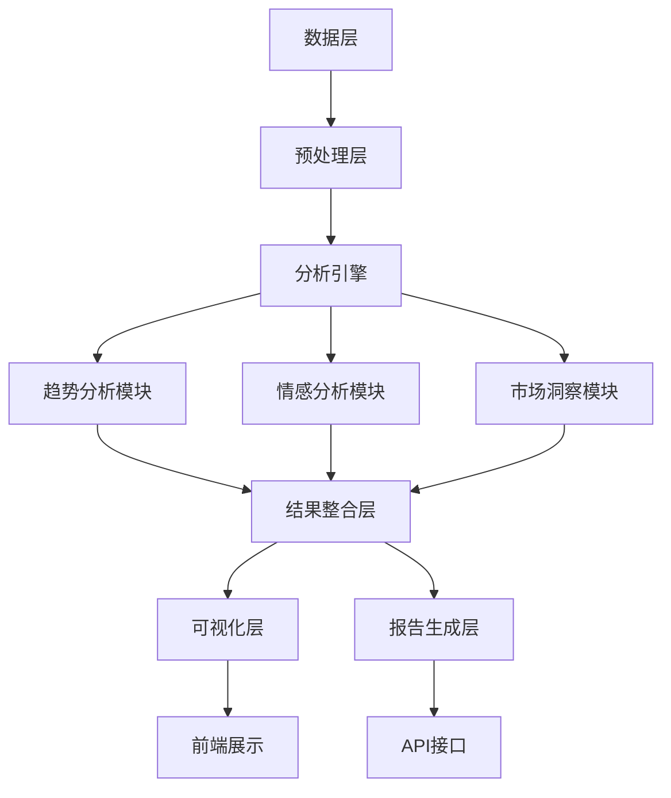

# 数据分析框架

## 1. 分析框架概述

本数据分析框架旨在通过多维度、多层次的分析方法，全面理解网民小说偏好，为内容创作、平台运营和市场决策提供数据支持。框架涵盖趋势分析、情感分析和市场洞察三大核心领域，结合统计分析、机器学习和深度学习技术，实现从描述性分析到预测性分析的全流程覆盖。

## 2. 核心分析维度

### 2.1 类型偏好分析

#### 2.1.1 分析指标

| 指标 | 计算方法 | 含义 | 应用场景 |
|------|---------|------|----------|
| 热度指数 | (阅读量权重×0.4 + 收藏数权重×0.3 + 推荐票权重×0.3) | 类型受欢迎程度 | 市场趋势判断 |
| 增长率 | (当前热度指数 - 上期热度指数) / 上期热度指数 | 类型增长速度 | 潜力类型识别 |
| 市场份额 | 类型作品数 / 总作品数 | 类型市场占比 | 市场格局分析 |
| 留存率 | 类型作品的追更率 | 用户粘性 | 内容质量评估 |
| 转化率 | 推荐票/收藏数 | 用户付费意愿 | 商业价值评估 |

#### 2.1.2 分析方法

1. **时间序列分析**
   - 识别类型热度的周期性变化
   - 预测未来趋势
   - 检测异常波动

2. **聚类分析**
   - 基于热度、增长率等指标对类型进行聚类
   - 识别相似类型组
   - 发现潜在的类型融合机会

3. **关联分析**
   - 分析类型之间的关联关系
   - 识别类型组合偏好
   - 推荐内容扩展方向

### 2.2 情感分析

#### 2.2.1 分析指标

| 指标 | 计算方法 | 含义 | 应用场景 |
|------|---------|------|----------|
| 情感得分 | (正面评论比例 - 负面评论比例) × 100 | 整体情感倾向 | 内容质量评估 |
| 情感强度 | 情感得分的绝对值 | 情感表达强烈程度 | 用户参与度分析 |
| 情感一致性 | 情感得分的标准差 | 用户情感一致性 | 目标受众匹配 |
| 情感变化率 | (当前情感得分 - 上期情感得分) / 上期情感得分 | 情感变化趋势 | 内容调整建议 |
| 情感共鸣度 | 高情感强度评论的比例 | 内容情感共鸣 | 创作方向指导 |

#### 2.2.2 分析方法

1. **文本分类**
   - 基于BERT模型的情感分类
   - 多标签情感分析
   - 细粒度情感识别

2. **主题情感关联**
   - 识别不同主题的情感倾向
   - 分析主题情感演变
   - 发现情感触发点

3. **情感网络分析**
   - 构建用户情感互动网络
   - 识别情感领袖
   - 分析情感传播路径

### 2.3 市场洞察

#### 2.3.1 分析指标

| 指标 | 计算方法 | 含义 | 应用场景 |
|------|---------|------|----------|
| 市场活跃度 | (新作品数 + 评论数 + 互动数) / 平台用户数 | 市场活跃程度 | 投资机会评估 |
| 创新指数 | 新类型作品数 / 总作品数 | 市场创新能力 | 内容差异化策略 |
| 竞争激烈度 | 类型作品数 × 平均热度指数 | 市场竞争程度 | 进入壁垒评估 |
| 机会指数 | 增长率 × (1 - 市场份额) | 市场机会大小 | 潜力市场识别 |
| 风险指数 | 情感得分标准差 × 竞争激烈度 | 市场风险程度 | 风险控制策略 |

#### 2.3.2 分析方法

1. **多维尺度分析**
   - 映射市场竞争格局
   - 识别市场空白区域
   - 分析平台定位差异

2. **因子分析**
   - 提取影响市场的关键因素
   - 构建市场评估模型
   - 预测市场变化趋势

3. **AI辅助分析**
   - 基于大语言模型的市场洞察生成
   - 自动发现隐藏模式
   - 提供战略建议

## 3. 分析方法实现

### 3.1 统计分析

#### 3.1.1 描述性统计

```python
def descriptive_analysis(data):
    """描述性统计分析
    
    Args:
        data: 分析数据
        
    Returns:
        统计结果
    """
    stats = {
        "mean": data.mean(),
        "median": data.median(),
        "std": data.std(),
        "min": data.min(),
        "max": data.max(),
        "quantiles": data.quantile([0.25, 0.5, 0.75]).to_dict()
    }
    return stats
```

#### 3.1.2 相关性分析

```python
def correlation_analysis(data, method="pearson"):
    """相关性分析
    
    Args:
        data: 分析数据
        method: 相关系数计算方法
        
    Returns:
        相关系数矩阵
    """
    corr_matrix = data.corr(method=method)
    return corr_matrix
```

#### 3.1.3 差异性检验

```python
def difference_test(group1, group2, test_type="t-test"):
    """差异性检验
    
    Args:
        group1: 第一组数据
        group2: 第二组数据
        test_type: 检验类型
        
    Returns:
        检验结果
    """
    if test_type == "t-test":
        from scipy import stats
        t_stat, p_value = stats.ttest_ind(group1, group2)
        return {
            "test_type": "t-test",
            "t_statistic": t_stat,
            "p_value": p_value,
            "significant": p_value < 0.05
        }
    # 其他检验方法...
```

### 3.2 机器学习分析

#### 3.2.1 时间序列预测

```python
def time_series_prediction(data, forecast_days=90):
    """时间序列预测
    
    Args:
        data: 时间序列数据
        forecast_days: 预测天数
        
    Returns:
        预测结果
    """
    from sklearn.linear_model import LinearRegression
    import pandas as pd
    import numpy as np
    
    # 准备数据
    df = pd.DataFrame(data)
    df["date_ordinal"] = df["date"].apply(lambda x: x.toordinal())
    
    X = df["date_ordinal"].values.reshape(-1, 1)
    y = df["value"].values
    
    # 训练模型
    model = LinearRegression()
    model.fit(X, y)
    
    # 生成预测
    predictions = []
    last_date = df["date"].max()
    
    for i in range(1, forecast_days + 1):
        pred_date = last_date + pd.Timedelta(days=i)
        pred_ordinal = pred_date.toordinal()
        pred_value = model.predict([[pred_ordinal]])[0]
        
        predictions.append({
            "date": pred_date.isoformat(),
            "value": float(pred_value),
            "is_prediction": True
        })
    
    return predictions
```

#### 3.2.2 情感分析模型

```python
def sentiment_analysis(texts):
    """情感分析
    
    Args:
        texts: 文本列表
        
    Returns:
        情感分析结果
    """
    from transformers import pipeline
    
    # 使用预训练的情感分析模型
    sentiment_pipeline = pipeline("sentiment-analysis", model="nlptown/bert-base-multilingual-uncased-sentiment")
    
    results = []
    for text in texts:
        result = sentiment_pipeline(text)[0]
        # 转换为标准格式
        sentiment = "positive" if result["label"] in ["4 stars", "5 stars"] else "negative" if result["label"] in ["1 star", "2 stars"] else "neutral"
        score = result["score"]
        
        results.append({
            "text": text,
            "sentiment": sentiment,
            "score": score
        })
    
    return results
```

#### 3.2.3 聚类分析

```python
def cluster_analysis(data, n_clusters=5):
    """聚类分析
    
    Args:
        data: 分析数据
        n_clusters: 聚类数量
        
    Returns:
        聚类结果
    """
    from sklearn.cluster import KMeans
    from sklearn.preprocessing import StandardScaler
    import pandas as pd
    
    # 数据预处理
    features = data[['heat_index', 'growth_rate', 'market_share', 'retention_rate']]
    scaler = StandardScaler()
    scaled_features = scaler.fit_transform(features)
    
    # 训练模型
    kmeans = KMeans(n_clusters=n_clusters, random_state=42)
    clusters = kmeans.fit_predict(scaled_features)
    
    # 结果处理
    data['cluster'] = clusters
    cluster_centers = scaler.inverse_transform(kmeans.cluster_centers_)
    
    return {
        "clusters": data['cluster'].tolist(),
        "cluster_centers": cluster_centers.tolist(),
        "cluster_stats": data.groupby('cluster').mean().to_dict()
    }
```

### 3.3 深度学习分析

#### 3.3.1 评论情感分析（BERT模型）

```python
def advanced_sentiment_analysis(comments):
    """高级情感分析
    
    Args:
        comments: 评论列表
        
    Returns:
        情感分析结果
    """
    from transformers import AutoTokenizer, AutoModelForSequenceClassification
    import torch
    
    # 加载预训练模型
    model_name = "bert-base-chinese"
    tokenizer = AutoTokenizer.from_pretrained(model_name)
    model = AutoModelForSequenceClassification.from_pretrained(model_name, num_labels=3)
    
    results = []
    for comment in comments:
        # 处理输入
        inputs = tokenizer(comment, return_tensors="pt", padding=True, truncation=True)
        
        # 模型预测
        with torch.no_grad():
            outputs = model(**inputs)
            logits = outputs.logits
            predicted_class = torch.argmax(logits, dim=1).item()
        
        # 映射结果
        sentiment_map = {0: "negative", 1: "neutral", 2: "positive"}
        sentiment = sentiment_map[predicted_class]
        
        results.append({
            "comment": comment,
            "sentiment": sentiment,
            "confidence": float(torch.softmax(logits, dim=1).max().item())
        })
    
    return results
```

#### 3.3.2 趋势预测（LSTM模型）

```python
def lstm_trend_prediction(data, forecast_days=90):
    """LSTM趋势预测
    
    Args:
        data: 时间序列数据
        forecast_days: 预测天数
        
    Returns:
        预测结果
    """
    import numpy as np
    import pandas as pd
    from tensorflow.keras.models import Sequential
    from tensorflow.keras.layers import LSTM, Dense
    
    # 数据准备
    values = np.array([item['value'] for item in data])
    
    # 标准化
    from sklearn.preprocessing import MinMaxScaler
    scaler = MinMaxScaler(feature_range=(0, 1))
    scaled_values = scaler.fit_transform(values.reshape(-1, 1))
    
    # 创建训练数据
    def create_dataset(dataset, look_back=7):
        X, Y = [], []
        for i in range(len(dataset) - look_back - 1):
            a = dataset[i:(i + look_back), 0]
            X.append(a)
            Y.append(dataset[i + look_back, 0])
        return np.array(X), np.array(Y)
    
    look_back = 7
    X_train, y_train = create_dataset(scaled_values, look_back)
    
    # 重塑输入
    X_train = np.reshape(X_train, (X_train.shape[0], X_train.shape[1], 1))
    
    # 创建和训练模型
    model = Sequential()
    model.add(LSTM(50, return_sequences=True, input_shape=(look_back, 1)))
    model.add(LSTM(50))
    model.add(Dense(1))
    model.compile(loss='mean_squared_error', optimizer='adam')
    model.fit(X_train, y_train, epochs=100, batch_size=1, verbose=2)
    
    # 预测
    predictions = []
    last_values = scaled_values[-look_back:].reshape(1, look_back, 1)
    
    for i in range(forecast_days):
        pred = model.predict(last_values)
        predictions.append(float(scaler.inverse_transform(pred)[0][0]))
        
        # 更新输入
        last_values = np.roll(last_values, -1, axis=1)
        last_values[0, -1, 0] = pred[0][0]
    
    # 生成预测结果
    last_date = pd.to_datetime(data[-1]['date'])
    forecast_results = []
    for i, pred_value in enumerate(predictions):
        forecast_date = last_date + pd.Timedelta(days=i+1)
        forecast_results.append({
            "date": forecast_date.isoformat(),
            "value": pred_value,
            "is_prediction": True
        })
    
    return forecast_results
```

### 3.4 AI辅助分析

#### 3.4.1 市场洞察生成

```python
def generate_market_insights(market_data, trend_data, sentiment_data):
    """生成市场洞察
    
    Args:
        market_data: 市场数据
        trend_data: 趋势数据
        sentiment_data: 情感数据
        
    Returns:
        市场洞察
    """
    from langchain_community.llms import QianfanLLMEndpoint
    
    # 构建提示词
    prompt = f"""基于以下数据，生成详细的市场洞察报告：
    
    市场数据摘要：
    - 总作品数: {market_data.get('total_books', 0)}
    - 热门类型: {list(market_data.get('top_genres', {}).keys())[:5]}
    - 市场活跃度: {market_data.get('market_activity', 0)}
    
    趋势数据摘要：
    - 增长最快的类型: {list(trend_data.get('fastest_growing', {}).keys())[:3]}
    - 整体趋势: {trend_data.get('overall_trend', 'stable')}
    - 预测趋势: {trend_data.get('predicted_trend', 'stable')}
    
    情感数据摘要：
    - 平均情感得分: {sentiment_data.get('average_sentiment', 0)}
    - 情感分布: {sentiment_data.get('sentiment_distribution', {})}
    - 情感变化: {sentiment_data.get('sentiment_change', 0)}
    
    要求：
    1. 市场现状分析：当前市场的整体状况
    2. 趋势预测：基于数据的未来趋势预测
    3. 机会识别：潜在的市场机会
    4. 风险分析：可能的风险因素
    5. 战略建议：具体的行动建议
    6. 数据驱动：所有分析都要基于提供的数据
    7. 格式清晰：使用Markdown格式，结构清晰
    
    请生成详细的分析报告，至少5个关键洞察点。
    """
    
    # 调用大语言模型
    llm = QianfanLLMEndpoint(model="ERNIE-Bot-4", temperature=0.7)
    response = llm(prompt)
    
    # 提取关键洞察
    import re
    insights = []
    paragraphs = re.split(r'\n\s*\n', response)
    
    for i, para in enumerate(paragraphs[:5]):
        if para.strip():
            insights.append({
                "id": i + 1,
                "content": para.strip(),
                "importance": 5 - i
            })
    
    return {
        "insights": insights,
        "full_report": response,
        "generated_at": pd.Timestamp.now().isoformat()
    }
```

## 4. 分析模型优化

### 4.1 模型选择指南

| 分析任务 | 推荐模型 | 适用场景 | 优势 | 劣势 |
|---------|---------|---------|------|------|
| 趋势预测 | Linear Regression | 短期预测，线性趋势 | 简单快速，解释性强 | 非线性趋势表现差 |
| 趋势预测 | LSTM | 长期预测，复杂趋势 | 捕捉非线性关系 | 训练时间长，需要更多数据 |
| 情感分析 | BERT | 细粒度情感识别 | 准确率高，理解上下文 | 计算资源需求大 |
| 情感分析 | TextCNN | 快速情感分类 | 训练快，部署简单 | 上下文理解能力有限 |
| 聚类分析 | K-Means | 类型分组 | 简单易用，可解释性强 | 需要指定聚类数量 |
| 聚类分析 | DBSCAN | 发现自然聚类 | 自动识别聚类数量 | 对参数敏感 |
| 市场洞察 | 大语言模型 | 综合分析 | 理解复杂关系，生成自然语言报告 | 成本高，可能产生幻觉 |

### 4.2 模型评估标准

| 评估指标 | 计算方法 | 理想值 | 应用场景 |
|---------|---------|-------|----------|
| 准确率 | 正确预测数 / 总预测数 | >0.9 | 分类任务 |
| F1得分 | 2×(精确率×召回率)/(精确率+召回率) | >0.85 | 情感分析 |
| R²得分 | 1 - (残差平方和/总平方和) | >0.8 | 回归任务 |
| 均方根误差 | √(Σ(预测值-实际值)²/n) | <0.1×数据标准差 | 预测任务 |
| 轮廓系数 | (类内距离-类间距离)/max(类内距离,类间距离) | >0.5 | 聚类任务 |

### 4.3 模型优化策略

1. **特征工程**
   - 构建复合特征
   - 特征选择和降维
   - 特征标准化

2. **超参数调优**
   - 网格搜索
   - 随机搜索
   - 贝叶斯优化

3. **集成学习**
   - 模型融合
   -  stacking
   - 投票机制

4. **迁移学习**
   - 利用预训练模型
   - 领域适应
   - 少样本学习

## 5. 分析流程

### 5.1 标准分析流程



### 5.2 实时分析流程



### 5.3 批量分析流程



## 6. 分析结果评估

### 6.1 分析质量评估

| 评估维度 | 评估指标 | 阈值 | 处理方式 |
|---------|---------|------|----------|
| 准确性 | 分析结果与实际情况的符合度 | >85% | 低于阈值时重新分析 |
| 完整性 | 覆盖所有关键分析维度 | >90% | 补充缺失维度 |
| 一致性 | 不同分析方法结果的一致性 | >80% | 分析方法调整 |
| 时效性 | 分析完成时间 | <2小时 | 优化分析流程 |
| 可操作性 | 分析结果的可执行性 | >75% | 增加具体建议 |

### 6.2 分析结果应用

1. **内容创作指导**
   - 类型选择建议
   - 题材融合方向
   - 情节设计参考

2. **平台运营策略**
   - 内容推荐优化
   - 活动策划建议
   - 用户分层运营

3. **市场决策支持**
   - 投资方向评估
   - 竞争策略制定
   - 风险控制建议

4. **行业趋势预测**
   - 类型演变预测
   - 市场规模预测
   - 技术影响评估

## 7. 分析系统架构

### 7.1 系统组件



### 7.2 技术栈选择

| 组件 | 技术 | 版本 | 用途 |
|------|------|------|------|
| 数据处理 | Pandas | 2.0+ | 数据清洗和转换 |
| 数据处理 | NumPy | 1.20+ | 数值计算 |
| 统计分析 | SciPy | 1.10+ | 统计检验 |
| 机器学习 | Scikit-learn | 1.3+ | 传统机器学习模型 |
| 深度学习 | TensorFlow | 2.10+ | 深度神经网络 |
| 深度学习 | PyTorch | 2.0+ | 深度学习模型 |
| 自然语言处理 | Transformers | 4.30+ | NLP模型 |
| 大语言模型 | LangChain | 0.2+ | LLM应用集成 |
| 可视化 | Matplotlib | 3.7+ | 静态图表 |
| 可视化 | Seaborn | 0.12+ | 统计图表 |
| 并行计算 | Dask | 2023.0+ | 大规模数据处理 |

### 7.3 性能优化

1. **计算优化**
   - 并行计算
   - 缓存机制
   - 向量化操作

2. **存储优化**
   - 数据压缩
   - 索引优化
   - 列式存储

3. **部署优化**
   - 模型量化
   - 批处理优化
   - 负载均衡

## 8. 扩展计划

### 8.1 分析维度扩展

1. **用户画像分析**
   - 基于阅读行为的用户分层
   - 个性化偏好识别
   - 用户生命周期价值评估

2. **内容质量分析**
   - 文本质量评估
   - 情节结构分析
   - 语言风格识别

3. **跨媒体分析**
   - 小说改编影视数据分析
   - 短视频与小说关联分析
   - 社交媒体影响力评估

### 8.2 技术升级

1. **实时分析系统**
   - 流处理框架集成
   - 实时模型推理
   - 低延迟响应

2. **自动机器学习**
   - 自动特征工程
   - 模型自动选择
   - 超参数自动调优

3. **知识图谱**
   - 小说类型知识图谱
   - 作者关联网络
   - 内容主题映射

### 8.3 行业合作

1. **数据共享**
   - 建立行业数据标准
   - 促进数据共享机制
   - 联合分析项目

2. **研究合作**
   - 学术研究合作
   - 行业标准制定
   - 技术创新探索

3. **应用落地**
   - 内容创作工具
   - 平台运营系统
   - 市场决策支持系统

## 9. 实施计划

### 9.1 短期计划（1-2周）

1. **基础分析框架搭建**
   - 实现核心分析方法
   - 集成现有模型
   - 建立分析流程

2. **模型评估与优化**
   - 评估现有模型性能
   - 优化关键模型参数
   - 建立模型选择机制

3. **分析结果验证**
   - 与实际市场情况对比
   - 调整分析方法
   - 建立验证流程

### 9.2 中期计划（3-4周）

1. **深度学习模型集成**
   - 实现BERT情感分析
   - 集成LSTM趋势预测
   - 建立模型服务架构

2. **AI辅助分析系统**
   - 实现市场洞察生成
   - 建立自动报告系统
   - 优化提示词工程

3. **分析平台建设**
   - 开发分析控制台
   - 实现可视化界面
   - 建立API服务

### 9.3 长期计划（1-2个月）

1. **智能分析系统**
   - 实现自动分析触发
   - 建立预测模型库
   - 开发个性化分析

2. **生态系统建设**
   - 开放分析API
   - 建立行业数据联盟
   - 开发分析工具链

3. **行业标准制定**
   - 参与数据标准制定
   - 推动分析方法标准化
   - 发布行业洞察报告

## 10. 预期成果

1. **分析能力提升**
   - 实现多维度、多层次的分析
   - 提供准确的趋势预测
   - 生成有价值的市场洞察

2. **决策支持增强**
   - 为内容创作提供数据指导
   - 为平台运营提供策略建议
   - 为市场投资提供风险评估

3. **技术创新**
   - 整合前沿分析技术
   - 建立行业领先的分析框架
   - 推动数据分析在网络文学领域的应用

4. **行业影响力**
   - 成为行业数据标准的参与者
   - 发布权威的市场分析报告
   - 促进网络文学市场的健康发展

## 11. 风险评估

| 风险 | 影响 | 应对策略 |
|------|------|----------|
| 数据质量问题 | 分析结果不准确 | 建立数据质量控制机制 |
| 模型过拟合 | 预测结果不可靠 | 实施交叉验证和正则化 |
| 计算资源不足 | 分析速度慢 | 优化算法，考虑云服务 |
| 技术复杂度高 | 系统维护困难 | 模块化设计，完善文档 |
| 市场变化快 | 分析结果过时 | 建立实时分析机制 |

## 12. 结论

本数据分析框架通过整合多种分析方法和技术，构建了一个全面、深入的网民小说偏好分析系统。框架不仅能够描述当前市场状况，还能预测未来趋势，识别潜在机会，为网络文学行业的发展提供数据驱动力。通过持续的技术创新和优化，该框架将不断提升分析能力，成为行业决策的重要支持工具。