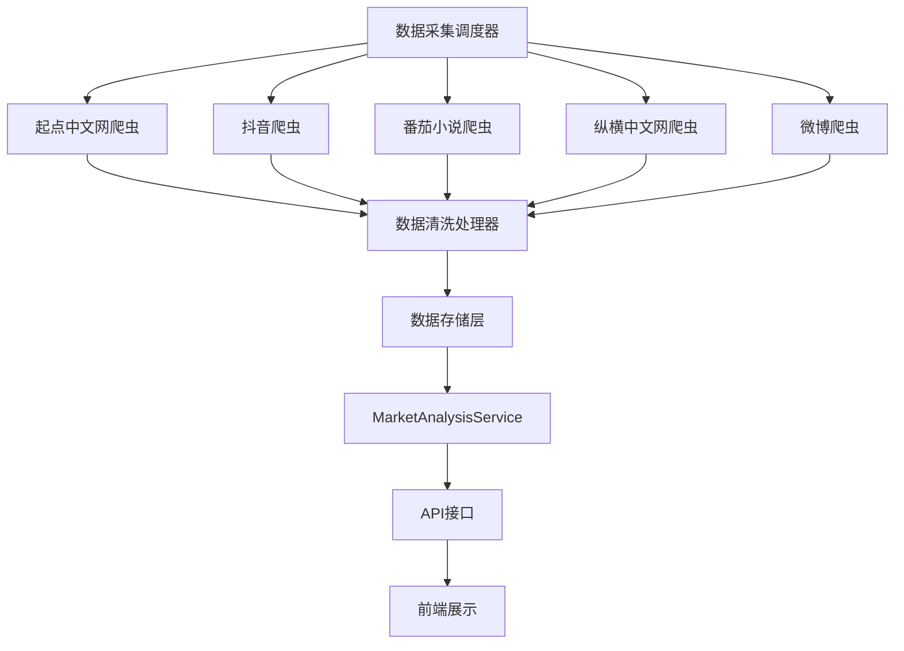
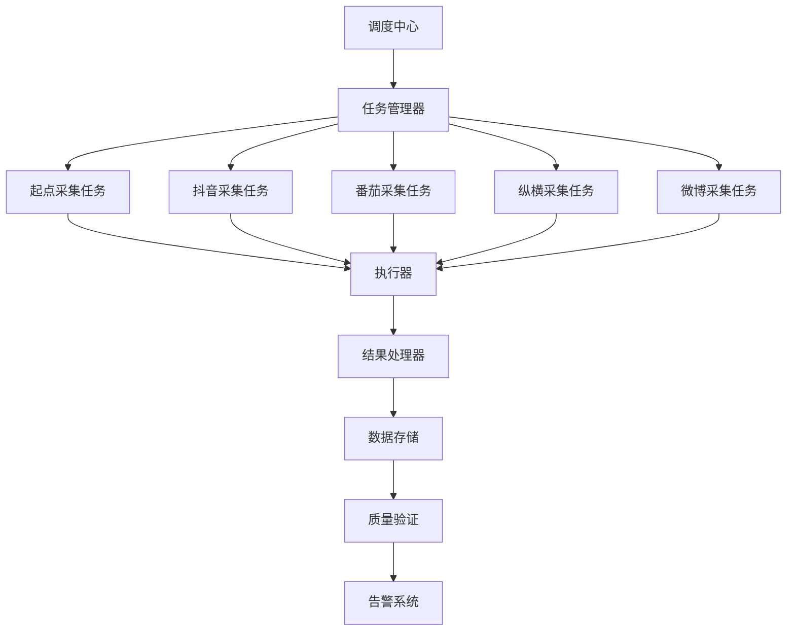
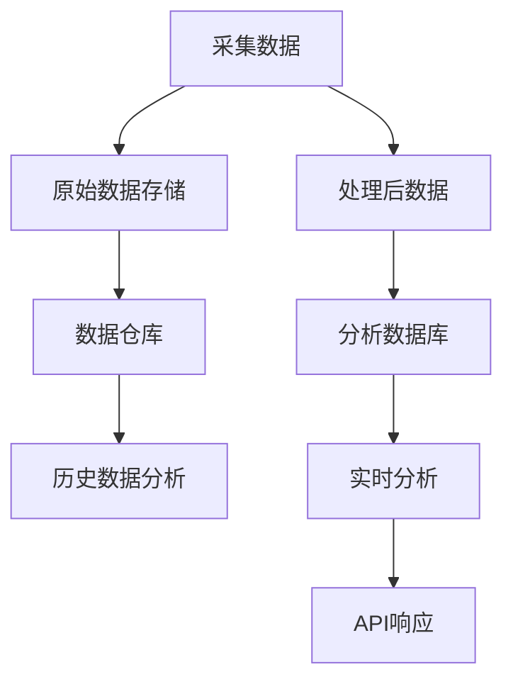

# 数据收集策略

## 1. 现有数据收集机制分析

### 1.1 系统架构

当前系统已经实现了基础的数据收集和分析功能，主要组件包括：

- **MarketAnalysisService**: 核心服务类，提供各种市场分析方法
- **API端点**: 提供RESTful接口供前端调用
- **数据模型**: `CrawlResult`和`ReaderPreference`用于存储采集数据

### 1.2 支持的平台

| 平台 | 代码标识 | 数据类型 | 采集状态 |
|------|---------|---------|----------|
| 起点中文网 | qidian | 排行榜、热度、搜索趋势 | 已支持 |
| 抖音 | douyin | 热门话题、互动数据 | 已支持 |
| 番茄小说 | fanqie | 排行榜、热度 | 已支持 |
| 纵横中文网 | zongheng | 排行榜、热度 | 已支持 |
| 微博 | weibo | 话题讨论、作者互动 | 待实现 |

### 1.3 现有数据类型

- **ranking**: 排行榜数据
- **hot**: 热门数据
- **search_trend**: 搜索趋势
- **tag**: 标签数据

## 2. 多平台数据整合方法

### 2.1 数据采集架构



### 2.2 数据采集策略

#### 2.2.1 起点中文网 (qidian)

**采集目标**:
- 各分类排行榜（月票榜、推荐票榜、收藏榜）
- 新书榜
- 热门搜索词
- 作品详细信息（字数、评分、评论）

**采集方法**:
- 网页爬虫：使用Scrapy框架
- 采集频率：每6小时一次
- 数据存储：`CrawlResult`表，data_type分别为"ranking", "hot", "search_trend"

#### 2.2.2 抖音 (douyin)

**采集目标**:
- 小说相关话题热度
- 小说推荐短视频互动数据
- 相关话题讨论量

**采集方法**:
- 抖音API：使用官方开放平台API
- 网页爬虫：补充API未覆盖的数据
- 采集频率：每4小时一次
- 数据存储：`CrawlResult`表，data_type为"hot"

#### 2.2.3 番茄小说 (fanqie)

**采集目标**:
- 排行榜数据
- 热门作品
- 分类热度

**采集方法**:
- 网页爬虫：使用Scrapy框架
- 采集频率：每8小时一次
- 数据存储：`CrawlResult`表，data_type分别为"ranking", "hot"

#### 2.2.4 纵横中文网 (zongheng)

**采集目标**:
- 排行榜数据
- 热门作品
- 新书速递

**采集方法**:
- 网页爬虫：使用Scrapy框架
- 采集频率：每8小时一次
- 数据存储：`CrawlResult`表，data_type分别为"ranking", "hot"

#### 2.2.5 微博 (weibo) - 待实现

**采集目标**:
- 小说相关话题讨论
- 作者互动数据
- 热门小说提及量

**采集方法**:
- 微博API：使用官方开放平台API
- 采集频率：每6小时一次
- 数据存储：`CrawlResult`表，data_type为"hot"

### 2.3 数据整合机制

#### 2.3.1 统一数据模型

设计统一的数据结构，确保不同平台的数据可以被标准化处理：

```python
# 统一数据结构示例
unified_data = {
    "platform": "qidian",  # 平台标识
    "data_type": "ranking",  # 数据类型
    "data_date": "2024-01-01",  # 数据日期
    "content": {
        "rank": 1,  # 排名
        "title": "小说标题",  # 标题
        "author": "作者名",  # 作者
        "genre": "玄幻",  # 分类
        "word_count": 100000,  # 字数
        "rating": 9.5,  # 评分
        "heat": 10000,  # 热度值
        "tags": ["热血", "升级流"],  # 标签
        "comments": 1000  # 评论数
    }
}
```

#### 2.3.2 数据清洗流程

1. **去重处理**
   - 基于平台、数据类型、标题、作者的组合去重
   - 保留最新的数据记录

2. **标准化处理**
   - 统一日期格式
   - 统一分类名称
   - 标准化热度值计算

3. **缺失值处理**
   - 对于缺失字段，根据平台特性进行合理填充
   - 建立默认值体系

4. **异常值处理**
   - 识别并过滤异常数据
   - 建立数据质量监控机制

### 2.4 数据质量保证

#### 2.4.1 监控指标

| 指标 | 定义 | 阈值 | 处理方式 |
|------|------|------|----------|
| 采集成功率 | 成功采集的平台/总平台数 | >95% | 低于阈值时告警 |
| 数据完整性 | 非空字段比例 | >90% | 低于阈值时重新采集 |
| 数据一致性 | 跨平台数据一致性 | >85% | 标记不一致数据 |
| 采集延迟 | 实际采集时间与计划时间的差值 | <30分钟 | 超时告警 |

#### 2.4.2 质量控制措施

1. **多重数据源验证**
   - 对同一数据点，从多个来源验证
   - 建立数据可信度评分

2. **定期数据校准**
   - 每周进行一次全平台数据校准
   - 确保历史数据的准确性

3. **异常检测机制**
   - 实时监控数据采集过程
   - 自动识别异常数据模式

## 3. 数据采集调度系统

### 3.1 调度架构



### 3.2 调度策略

#### 3.2.1 时间调度

- **高频采集**（每4小时）：抖音热门数据
- **中频采集**（每6小时）：起点中文网、微博
- **低频采集**（每8小时）：番茄小说、纵横中文网
- **全量采集**（每天）：所有平台完整数据

#### 3.2.2 负载均衡

- 错峰采集：避免所有任务同时执行
- 资源分配：根据平台数据量动态分配资源
- 失败重试：建立智能重试机制

### 3.3 故障处理

1. **采集失败处理**
   - 自动重试机制（最多3次）
   - 指数退避策略
   - 失败告警

2. **数据异常处理**
   - 自动标记异常数据
   - 启动备用采集方案
   - 人工审核流程

## 4. 数据存储优化

### 4.1 存储架构



### 4.2 存储优化策略

1. **分区策略**
   - 按日期分区：便于历史数据管理
   - 按平台分区：提高查询效率

2. **索引优化**
   - 为常用查询字段建立索引
   - 定期重建索引

3. **缓存机制**
   - 热门数据缓存
   - 分析结果缓存
   - 多级缓存策略

4. **数据归档**
   - 建立数据归档策略
   - 冷数据压缩存储
   - 历史数据按需加载

## 5. 数据安全

### 5.1 采集安全

1. **合规性**
   - 遵守各平台robots.txt规则
   - 控制采集频率，避免对目标服务器造成压力
   - 尊重数据版权

2. **反爬策略应对**
   - 随机用户代理
   - 合理的请求间隔
   - 分布式采集
   - 验证码识别机制

### 5.2 存储安全

1. **数据加密**
   - 敏感数据加密存储
   - 传输过程加密

2. **访问控制**
   - 基于角色的访问控制
   - API访问限流
   - 日志审计

3. **备份策略**
   - 定期数据备份
   - 灾难恢复计划

## 6. 扩展计划

### 6.1 新增数据源

1. **社交媒体平台**
   - 微信读书
   - B站
   - 知乎

2. **垂直社区**
   - 起点论坛
   - 龙空论坛
   - 贴吧

3. **行业数据**
   - 出版社数据
   - 改编影视数据
   - 版权交易数据

### 6.2 技术升级

1. **实时数据处理**
   - 引入流处理技术
   - 实现近实时分析

2. **智能采集**
   - 基于机器学习的采集策略优化
   - 自动识别重要数据点

3. **数据可视化增强**
   - 实时数据仪表盘
   - 交互式分析工具

## 7. 实施计划

### 7.1 短期计划（1-2周）

1. **微博数据采集实现**
   - 开发微博爬虫
   - 集成到现有系统

2. **调度系统优化**
   - 实现智能调度策略
   - 建立监控机制

3. **数据质量提升**
   - 完善数据清洗流程
   - 建立质量评估体系

### 7.2 中期计划（3-4周）

1. **多平台数据整合**
   - 实现统一数据模型
   - 建立跨平台数据关联

2. **存储优化**
   - 实施分区策略
   - 优化索引结构

3. **API增强**
   - 新增数据质量相关端点
   - 优化响应性能

### 7.3 长期计划（1-2个月）

1. **智能分析系统**
   - 引入高级机器学习模型
   - 实现预测分析

2. **生态系统建设**
   - 开放API接口
   - 建立数据共享机制

3. **行业标准制定**
   - 参与行业数据标准制定
   - 推动数据规范化

## 8. 预期成果

1. **数据完整性**
   - 覆盖主流小说平台
   - 提供全面的市场数据

2. **分析深度**
   - 支持多维度分析
   - 提供准确的趋势预测

3. **系统可靠性**
   - 高可用性采集系统
   - 完善的故障处理机制

4. **业务价值**
   - 为内容创作提供指导
   - 为平台运营提供数据支持
   - 为市场决策提供依据

## 9. 风险评估

| 风险 | 影响 | 应对策略 |
|------|------|----------|
| 平台反爬策略加强 | 采集失败率增加 | 开发适应性采集策略 |
| 数据格式变更 | 数据解析失败 | 建立自适应解析机制 |
| 系统负载过高 | 性能下降 | 优化架构，增加资源 |
| 数据质量问题 | 分析结果不准确 | 建立多维度质量控制 |
| 合规风险 | 法律问题 | 严格遵守平台规则 |

## 10. 结论

本数据收集策略通过建立完善的多平台数据整合机制，实现了从数据采集、清洗、存储到分析的全流程优化。系统将为网民小说偏好分析提供坚实的数据基础，支持更准确、更深入的市场洞察。同时，通过持续的技术升级和扩展，系统将保持与时俱进，为网络文学行业的发展提供数据驱动力。